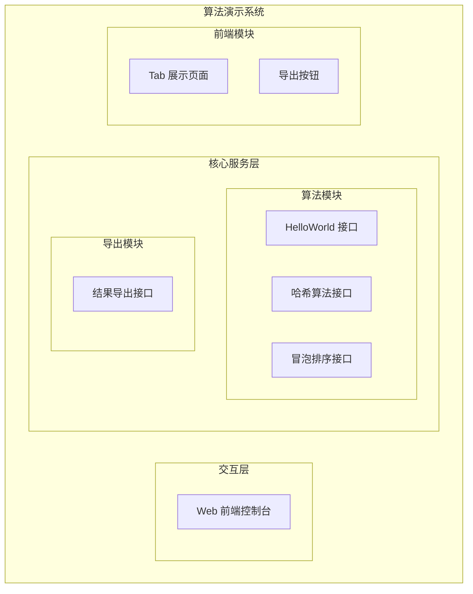
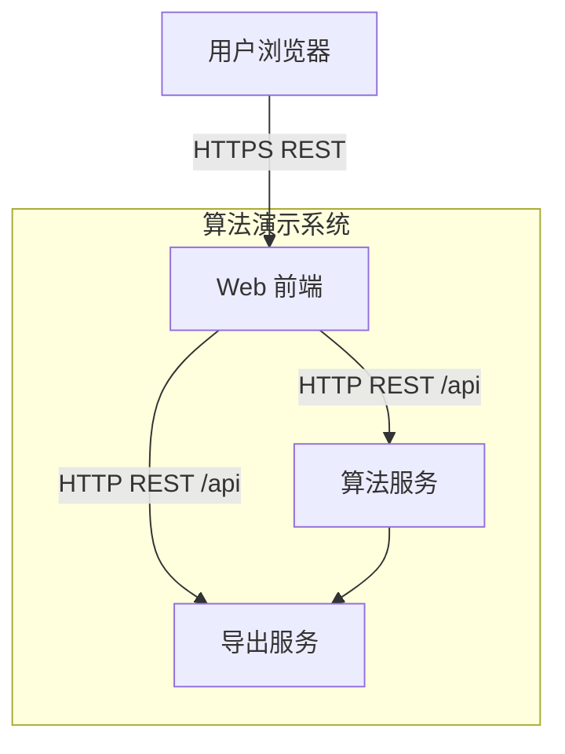
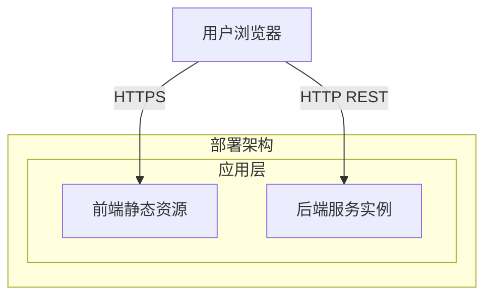
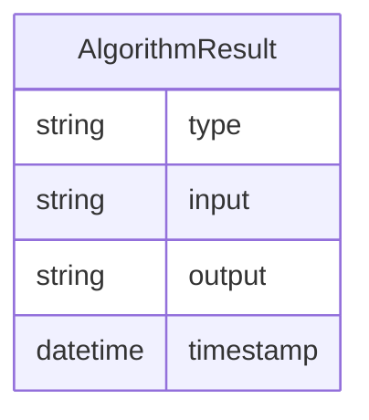
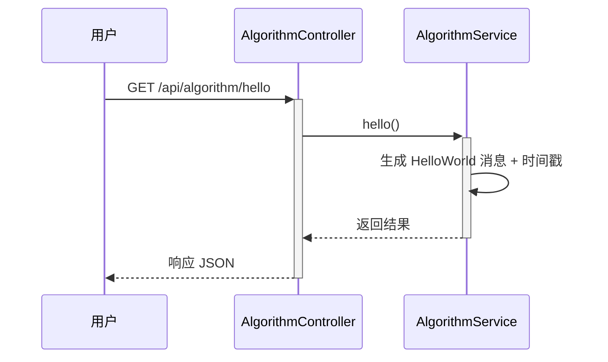
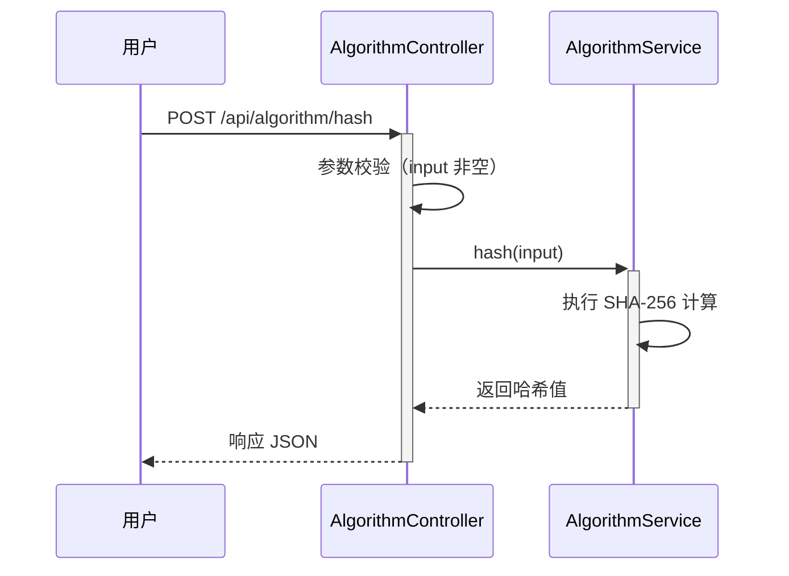
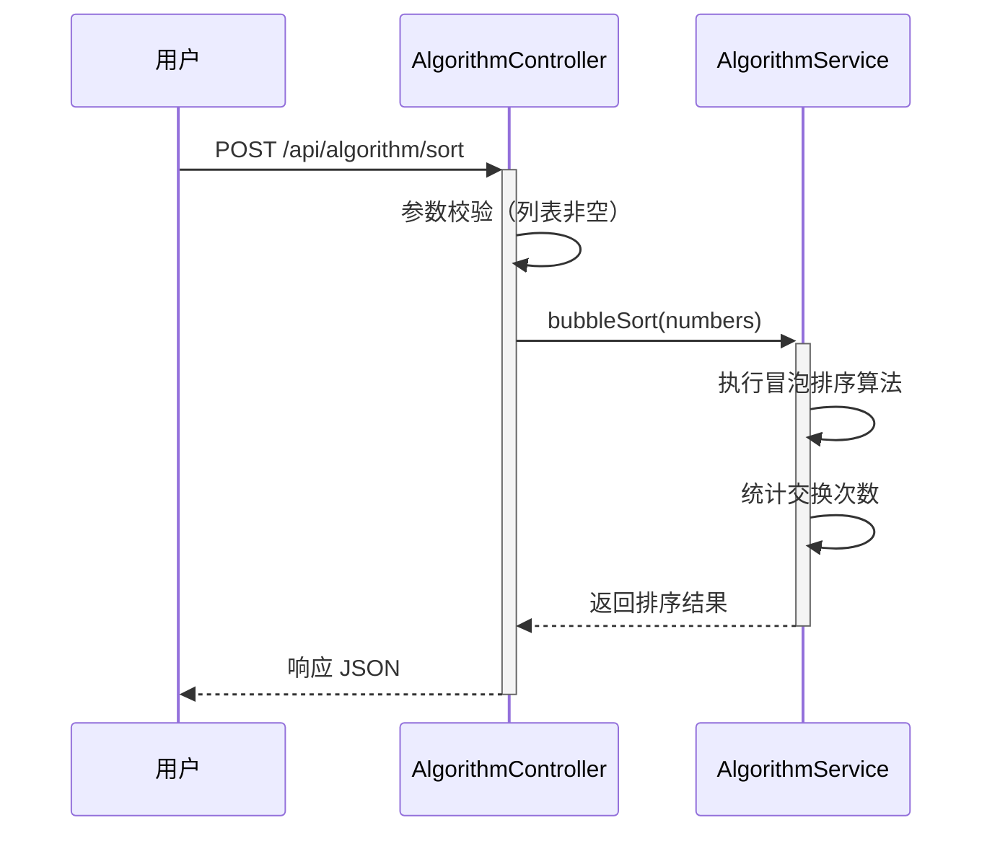
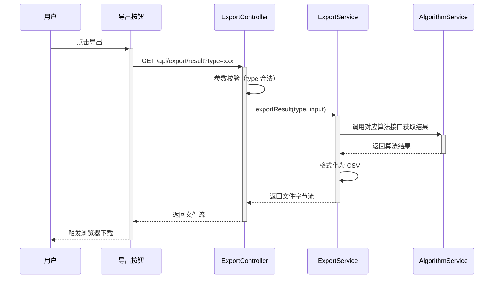
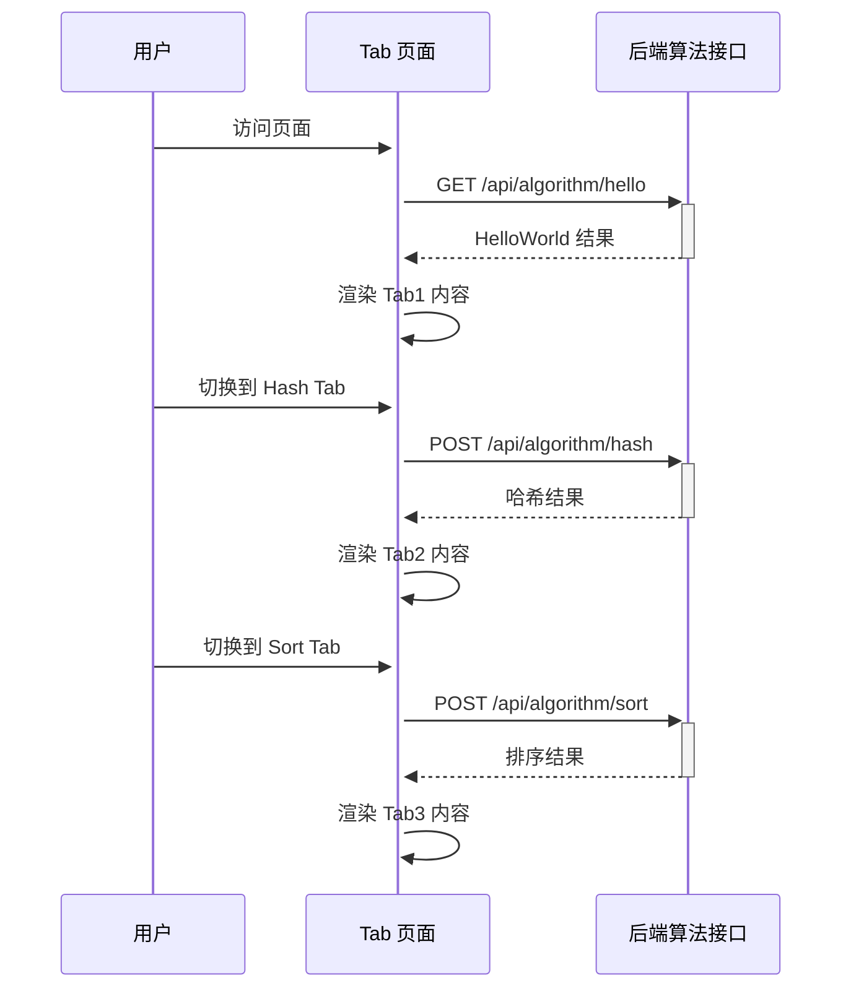
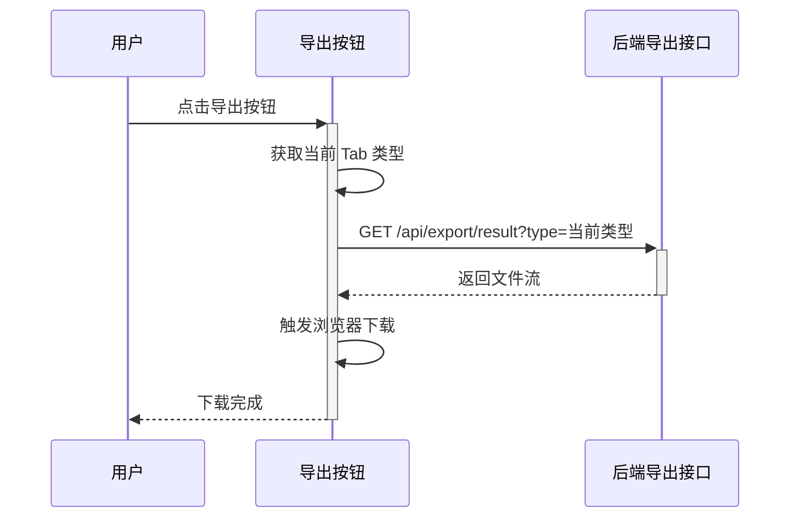

> **文档元信息**
>
> | 项目 | 内容 |
> |------|------|
> | 文档版本 | v1.0 |
> | 作者 | DTCoder |
> | 创建日期 | 2025-08-19 |
> | 需求来源 | 用户需求描述 |
> | 评审状态 | 待评审 |

# 算法演示与结果导出系统 系分设计

## 1. 需求与范围

### 背景与目标

构建一个算法演示系统，后端提供三个独立的算法接口（HelloWorld、哈希算法、冒泡排序），前端通过 Tab 页签分别展示各算法的执行结果，同时支持将各页面的展示结果导出为文件。

**核心目标：**
- 提供三个可独立调用的算法执行接口
- 前端以 Tab 形式清晰展示三种算法的执行结果
- 支持将各 Tab 页面的展示结果导出

### 核心功能

1. **HelloWorld 接口**：返回固定的 HelloWorld 字符串结果
2. **哈希算法接口**：接收输入字符串，返回其哈希计算结果
3. **冒泡排序接口**：接收一组数字，返回冒泡排序后的结果
4. **前端 Tab 展示页**：三个 Tab 分别展示上述三种算法的执行结果
5. **导出功能**：前端提供导出按钮，后端提供导出接口，支持导出各页面展示结果

### 约束与非功能要求

- 接口响应时间 < 1s（算法计算本身为轻量级操作）
- 导出文件格式默认为 CSV
- 前后端分离架构

### 排除范围

- 不涉及用户认证/鉴权
- 不涉及数据库持久化存储
- 不涉及外部系统集成

### 需求功能清单与优先级

| 编号 | 功能点 | 优先级 | PRD 原始描述/章节 | 备注 |
|------|--------|--------|-------------------|------|
| F01 | HelloWorld 接口 | P0 | "分别写三个接口helloworld" | 后端算法接口 |
| F02 | 哈希算法接口 | P0 | "哈希算法" | 后端算法接口 |
| F03 | 冒泡排序接口 | P0 | "冒泡排序" | 后端算法接口 |
| F04 | 前端 Tab 展示页面 | P0 | "前端新增一个页面，有三个tab分别展示不同的执行结果" | 前端页面 |
| F05 | 导出按钮（前端） | P1 | "新增导出按钮" | 前端交互 |
| F06 | 导出接口（后端） | P1 | "后台提供导出接口，支持导出各个页面的展示结果" | 后端接口 |

### 假设与待确认项

| 编号 | 假设/待确认内容 | 当前假设 | 确认状态 |
|------|-----------------|----------|----------|
| A01 | 哈希算法具体类型 | 假设使用 SHA-256 算法 | 待确认 |
| A02 | 导出文件格式 | 假设默认导出 CSV 格式 | 待确认 |
| A03 | 冒泡排序输入方式 | 假设前端以逗号分隔的数字字符串传入 | 待确认 |
| A04 | 技术栈 | 假设后端为 Java/Spring Boot，前端为 Vue/React | 待确认 |
| A05 | HelloWorld 接口行为 | 假设返回固定字符串 "Hello World" 及时间戳 | 待确认 |

## 2. 架构与模块

### 功能架构



- **交互层**：Web 前端控制台，提供 Tab 页面和导出按钮
- **核心服务层**：
  - 算法模块：包含 HelloWorld、哈希算法、冒泡排序三个接口
  - 导出模块：提供统一的导出接口，根据参数导出不同算法结果
- **前端模块**：Tab 展示页面 + 导出按钮

**模块清单**

| 模块 | 职责 | 依赖 |
|------|------|------|
| 算法模块 | 提供三种算法的计算执行能力 | 无 |
| 导出模块 | 将算法执行结果格式化并导出 | 算法模块（获取结果数据） |
| 前端模块 | 展示算法结果、触发导出操作 | 算法模块、导出模块 |

### 应用集成架构



本项为轻量级演示系统，无外部系统集成，无数据库依赖。

**集成关系说明：**

| 调用方 | 被调用方 | 协议 | 接口类型 | 说明 |
|--------|----------|------|----------|------|
| 用户浏览器 | Web 前端 | HTTPS | 静态资源 | 加载前端页面 |
| Web 前端 | 算法服务 | HTTP | oneapi REST | 调用算法接口获取结果 |
| Web 前端 | 导出服务 | HTTP | oneapi REST | 调用导出接口获取文件 |

### 部署架构



**部署说明：**
- **应用层**：前端静态资源可通过 Nginx 或 CDN 部署；后端为单体服务实例
- 本系统为轻量演示项目，单实例部署即可满足需求

## 3. 数据模型与存储

### 实体清单

| 实体名称 | 实体说明 | 所属模块 | 与其他实体的关系 |
|----------|----------|----------|-----------------|
| AlgorithmResult | 算法执行结果（内存对象，不持久化） | 算法模块 | 被导出模块引用 |

### 实体关系图



**模型说明：**
- 本系统为无状态计算服务，不涉及数据库持久化
- AlgorithmResult 仅作为接口传输的内存对象，不存储

## 4. 接口设计

### 4.1 oneapi（Web 控制台接口）

| 编号 | 接口名称 | 方法 | 路径 | 模块 |
|------|----------|------|------|------|
| W01 | HelloWorld 执行 | GET | /api/algorithm/hello | 算法模块 |
| W02 | 哈希算法执行 | POST | /api/algorithm/hash | 算法模块 |
| W03 | 冒泡排序执行 | POST | /api/algorithm/sort | 算法模块 |
| W04 | 结果导出 | GET | /api/export/result | 导出模块 |

### 4.2 OpenAPI（对外接口）

本项不适用，原因：本系统为内部演示系统，无对外 OpenAPI 需求。

### 4.3 内部接口（Service 层）

| 编号 | 接口名称 | 类 | 方法签名 |
|------|----------|------|----------|
| S01 | HelloWorld 执行 | AlgorithmService | String hello() |
| S02 | 哈希计算 | AlgorithmService | String hash(String input) |
| S03 | 冒泡排序 | AlgorithmService | List<Integer> bubbleSort(List<Integer> numbers) |
| S04 | 导出结果 | ExportService | byte[] exportResult(String type) |

### 4.4 集成接口（Integration 层）

本项不适用，原因：本系统无外部系统集成。

## 5. 功能模块设计

### 全局约定

- **错误码格式**：`{MODULE}_{SEQ}`，如 `ALGO_001`、`EXPORT_001`
- **通用出参结构**：`{code, msg, data}`

| 约定项 | 值 |
|--------|-----|
| 成功 code | "200" |
| 失败 code | "500" |
| 参数错误 code | "400" |

### 5.1 算法模块

#### 5.1.1 表结构设计

本模块不适用，原因：算法模块为纯计算服务，无数据库表。

##### 枚举与常量定义

| 枚举名称 | 取值 | 含义 | 关联字段 |
|----------|------|------|----------|
| AlgorithmType | HELLO | HelloWorld 算法 | 导出接口 type 参数 |
| AlgorithmType | HASH | 哈希算法 | 导出接口 type 参数 |
| AlgorithmType | SORT | 冒泡排序 | 导出接口 type 参数 |

#### 5.1.2 接口详细设计

##### W01 HelloWorld 执行

- **URI**: GET /api/algorithm/hello
- **描述**: 执行 HelloWorld 算法，返回固定问候语及当前时间戳
- **入参**: 无

| 参数名称 | 类型 | 是否必填 | 描述 |
|----------|------|----------|------|
| （无入参） | - | - | - |

- **出参**:

| 参数名称 | 类型 | 描述 |
|----------|------|------|
| code | String | 结果码 |
| msg | String | 提示信息 |
| data.message | String | HelloWorld 消息 |
| data.timestamp | String | 执行时间戳 |

- **错误码**:

| 错误码 | 说明 |
|--------|------|
| ALGO_001 | 系统内部错误 |

- **请求示例**:
```
GET /api/algorithm/hello
```

- **响应示例**:
```json
{
  "code": "200",
  "msg": "SUCCESS",
  "data": {
    "message": "Hello World",
    "timestamp": "2025-08-19T10:30:00"
  }
}
```

##### W02 哈希算法执行

- **URI**: POST /api/algorithm/hash
- **描述**: 对输入字符串执行 SHA-256 哈希计算，返回哈希值
- **入参**:

| 参数名称 | 类型 | 是否必填 | 描述 |
|----------|------|----------|------|
| input | String | 是 | 待计算的输入字符串 |

- **出参**:

| 参数名称 | 类型 | 描述 |
|----------|------|------|
| code | String | 结果码 |
| msg | String | 提示信息 |
| data.input | String | 原始输入 |
| data.algorithm | String | 哈希算法名称 |
| data.hashValue | String | 哈希结果（十六进制） |

- **错误码**:

| 错误码 | 说明 |
|--------|------|
| ALGO_002 | 输入参数为空 |
| ALGO_003 | 哈希计算异常 |

- **请求示例**:
```json
{
  "input": "hello world"
}
```

- **响应示例**:
```json
{
  "code": "200",
  "msg": "SUCCESS",
  "data": {
    "input": "hello world",
    "algorithm": "SHA-256",
    "hashValue": "b94d27b9934d3e08a52e52d7da7dabfac484efe37a5380ee9088f7ace2efcde9"
  }
}
```

##### W03 冒泡排序执行

- **URI**: POST /api/algorithm/sort
- **描述**: 对输入的数字列表执行冒泡排序，返回排序后的结果及排序过程
- **入参**:

| 参数名称 | 类型 | 是否必填 | 描述 |
|----------|------|----------|------|
| numbers | List<Integer> | 是 | 待排序的整数列表 |

- **出参**:

| 参数名称 | 类型 | 描述 |
|----------|------|------|
| code | String | 结果码 |
| msg | String | 提示信息 |
| data.original | List<Integer> | 原始输入列表 |
| data.sorted | List<Integer> | 排序后结果 |
| data.swapCount | Integer | 交换次数 |

- **错误码**:

| 错误码 | 说明 |
|--------|------|
| ALGO_004 | 输入列表为空 |
| ALGO_005 | 输入包含非整数 |

- **请求示例**:
```json
{
  "numbers": [5, 3, 8, 1, 2]
}
```

- **响应示例**:
```json
{
  "code": "200",
  "msg": "SUCCESS",
  "data": {
    "original": [5, 3, 8, 1, 2],
    "sorted": [1, 2, 3, 5, 8],
    "swapCount": 7
  }
}
```

#### 5.1.3 子功能详细设计

##### 5.1.3.1 HelloWorld 执行（F01）

- 处理时序图


**业务规则：**

| 规则编号 | 规则描述 | 校验时机 | 不满足时的处理 |
|----------|----------|----------|--------------|
| R01 | 始终返回固定消息 "Hello World" | 始终 | 不适用 |

**异常场景：**

| 异常场景 | 处理方式 |
|----------|----------|
| 系统时间获取失败 | 返回 ALGO_001 错误 |

**并发控制**：无并发风险，原因：纯读操作，无共享状态。

##### 5.1.3.2 哈希算法执行（F02）

- 处理时序图


**业务规则：**

| 规则编号 | 规则描述 | 校验时机 | 不满足时的处理 |
|----------|----------|----------|--------------|
| R01 | 输入不能为空 | 请求进入时 | 返回 ALGO_002 |
| R02 | 使用 SHA-256 算法 | 始终 | 不适用 |

**异常场景：**

| 异常场景 | 处理方式 |
|----------|----------|
| 输入为空/null | 返回 ALGO_002 错误码 |
| SHA-256 算法不可用 | 返回 ALGO_003 错误码 |

**并发控制**：无并发风险，原因：无状态计算。

##### 5.1.3.3 冒泡排序执行（F03）

- 处理时序图


**业务规则：**

| 规则编号 | 规则描述 | 校验时机 | 不满足时的处理 |
|----------|----------|----------|--------------|
| R01 | 输入列表不能为空 | 请求进入时 | 返回 ALGO_004 |
| R02 | 列表元素必须为整数 | 请求进入时 | 返回 ALGO_005 |
| R03 | 使用标准冒泡排序算法（升序） | 始终 | 不适用 |

**异常场景：**

| 异常场景 | 处理方式 |
|----------|----------|
| 输入列表为空 | 返回 ALGO_004 错误码 |
| 包含非整数元素 | 返回 ALGO_005 错误码 |
| 列表过大（>10000） | 返回 ALGO_006 错误码，防止性能问题 |

**并发控制**：无并发风险，原因：无状态计算。

### 5.2 导出模块

#### 5.2.1 表结构设计

本模块不适用，原因：导出模块无数据库表。

##### 枚举与常量定义

本模块无额外枚举/常量定义，复用算法模块的 AlgorithmType 枚举。

#### 5.2.2 接口详细设计

##### W04 结果导出

- **URI**: GET /api/export/result
- **描述**: 根据算法类型参数，生成对应算法结果的导出文件（CSV 格式）
- **入参**:

| 参数名称 | 类型 | 是否必填 | 描述 |
|----------|------|----------|------|
| type | String | 是 | 算法类型：HELLO / HASH / SORT |
| input | String | 否 | 输入参数（HASH 和 SORT 需要） |

- **出参**:

| 参数名称 | 类型 | 描述 |
|----------|------|------|
| Content-Type | Header | text/csv |
| Content-Disposition | Header | attachment; filename=xxx.csv |
| Body | byte[] | CSV 文件内容 |

- **错误码**:

| 错误码 | 说明 |
|--------|------|
| EXPORT_001 | 不支持的算法类型 |
| EXPORT_002 | 导出文件生成失败 |

- **请求示例**:
```
GET /api/export/result?type=HASH&input=hello
```

- **响应示例**:
```
Content-Type: text/csv
Content-Disposition: attachment; filename=hash_result.csv

输入,算法,哈希值
hello,SHA-256,2cf24dba5fb0a30e26e83b2ac5b9e29e1b161e5c1fa7425e73043362938b9824
```

#### 5.2.3 子功能详细设计

##### 5.2.3.1 结果导出（F05/F06）

- 处理时序图


**业务规则：**

| 规则编号 | 规则描述 | 校验时机 | 不满足时的处理 |
|----------|----------|----------|--------------|
| R01 | type 必须为 HELLO/HASH/SORT 之一 | 请求进入时 | 返回 EXPORT_001 |
| R02 | HASH 类型必须提供 input 参数 | 请求进入时 | 返回 EXPORT_002 |
| R03 | SORT 类型必须提供 input 参数 | 请求进入时 | 返回 EXPORT_002 |
| R04 | 导出文件名为 {type}_result_{timestamp}.csv | 始终 | 不适用 |

**异常场景：**

| 异常场景 | 处理方式 |
|----------|----------|
| type 参数不合法 | 返回 EXPORT_001 错误 |
| 算法执行失败 | 返回 EXPORT_002 错误 |
| 文件生成 IO 异常 | 返回 EXPORT_002 错误 |

**并发控制**：无并发风险，原因：每次导出为独立请求，无共享状态。

### 5.3 前端模块

#### 5.3.1 表结构设计

本模块不适用，原因：前端模块无数据库表。

##### 枚举与常量定义

本模块不适用，原因：前端无后端枚举定义。

#### 5.3.2 接口详细设计

本模块不适用，原因：前端模块不对外提供接口。

#### 5.3.3 子功能详细设计

##### 5.3.3.1 Tab 展示页面（F04）

- 处理时序图


**业务规则：**

| 规则编号 | 规则描述 | 校验时机 | 不满足时的处理 |
|----------|----------|----------|--------------|
| R01 | 页面默认展示 HelloWorld Tab | 页面加载时 | 不适用 |
| R02 | 每个 Tab 独立请求对应算法接口 | Tab 切换时 | 展示错误提示 |
| R03 | 接口失败时展示友好错误信息 | 接口返回异常时 | 展示错误提示 + 重试按钮 |

**异常场景：**

| 异常场景 | 处理方式 |
|----------|----------|
| 网络异常 | 展示"网络错误，请重试"提示 |
| 接口超时 | 展示"请求超时"提示 |

##### 5.3.3.2 导出按钮（F05）

- 处理时序图


**业务规则：**

| 规则编号 | 规则描述 | 校验时机 | 不满足时的处理 |
|----------|----------|----------|--------------|
| R01 | 导出当前 Tab 对应的算法结果 | 点击导出时 | 不适用 |
| R02 | 导出按钮在请求中显示 loading 状态 | 请求进行中 | 禁用按钮 |

**异常场景：**

| 异常场景 | 处理方式 |
|----------|----------|
| 导出接口失败 | Toast 提示"导出失败，请重试" |

## 6. 非功能性需求设计

### 6.1 高可用性

本项不适用，原因：本系统为轻量演示系统，无高可用要求。后端服务异常时前端展示错误提示即可。

### 6.2 可扩展性

- 新增算法类型时，只需在算法模块增加新的接口和对应的导出逻辑
- 前端 Tab 页可动态配置扩展
- 导出格式可扩展（如增加 Excel、PDF 等）

### 6.3 稳定性/可靠性

- 算法计算为纯 CPU 操作，结果确定性高
- 冒泡排序对大列表有性能限制（>10000 元素拒绝），防止 OOM

### 6.4 安全性设计

#### 6.4.1 账户系统方案

本项不适用，原因：本系统不涉及用户认证。

#### 6.4.2 授权&访问控制

##### 6.4.2.1 是否实现水平权限检查

本项不适用，原因：无用户数据隔离需求。

##### 6.4.2.2 是否实现垂直权限检查

本项不适用，原因：无角色权限需求。

##### 6.4.2.3 是否检查登录态

本项不适用，原因：公开访问的演示系统。

#### 6.4.3 数据防护方案

##### 6.4.3.1 是否对敏感数据加密存储

本项不适用，原因：无持久化数据。

##### 6.4.3.2 是否对敏感数据展示进行脱敏

本项不适用，原因：不涉及敏感数据。

### 6.5 监控/统计/日志/告警

- 记录每次算法调用的耗时日志
- 记录导出操作的日志（类型、时间）
- 异常错误记录错误日志

## 7. 变更三板斧

### 7.1 可监控

- 算法接口调用次数统计
- 导出接口调用次数统计
- 接口响应耗时监控
- 错误率监控

### 7.2 可灰度

本项不适用，原因：本系统为演示系统，用户量小，无需灰度发布。如需灰度，可通过 Nginx 按流量比例分发。

### 7.3 可应急

- 各算法接口独立，单个接口异常不影响其他接口
- 导出功能为独立模块，可快速关闭（配置开关）
- 回滚方案：直接回滚后端服务版本，前后端接口向后兼容
