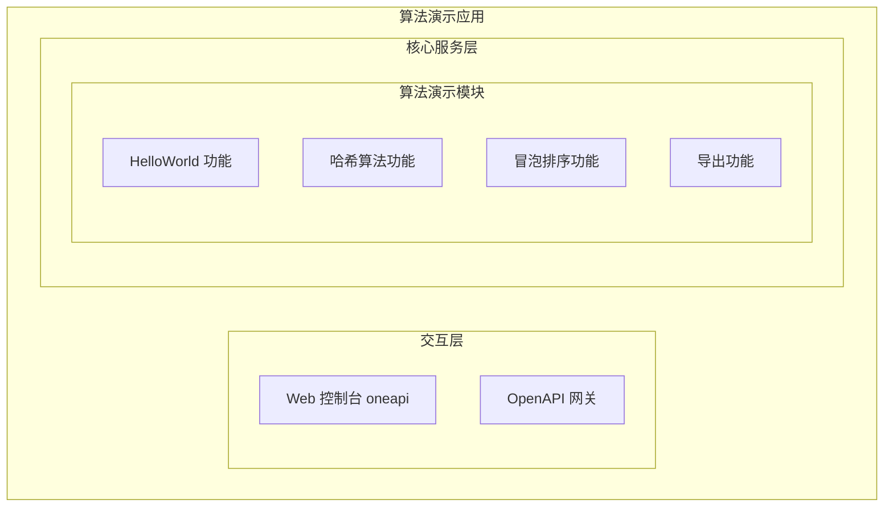
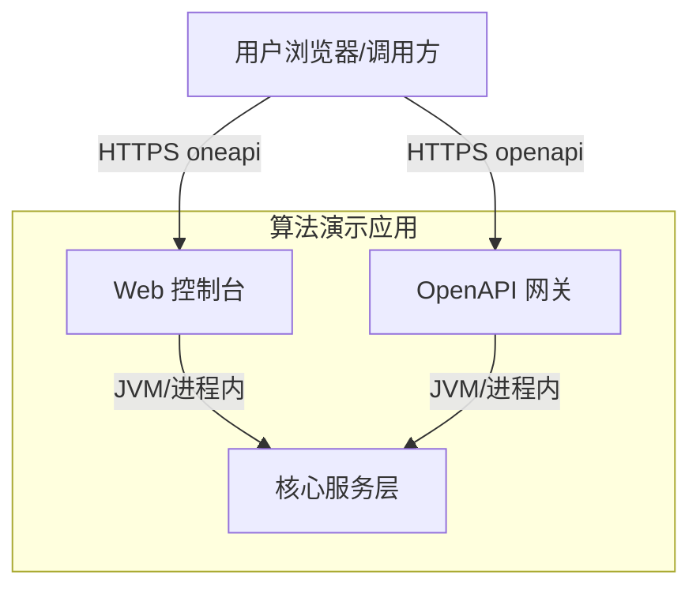
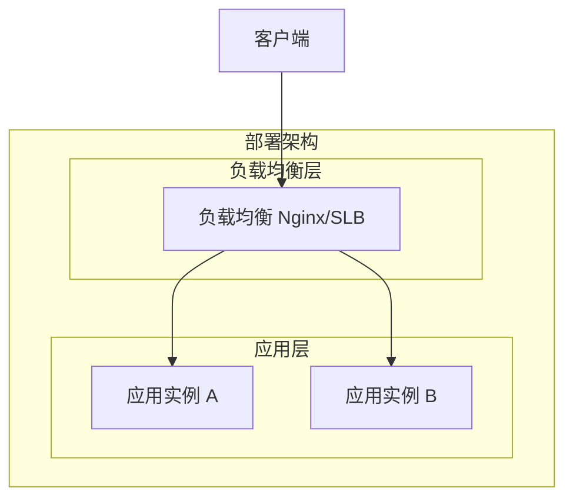
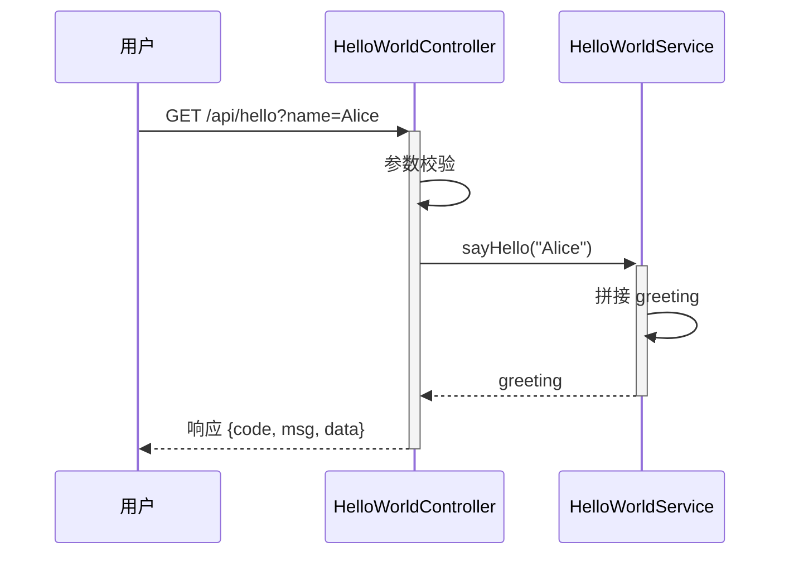
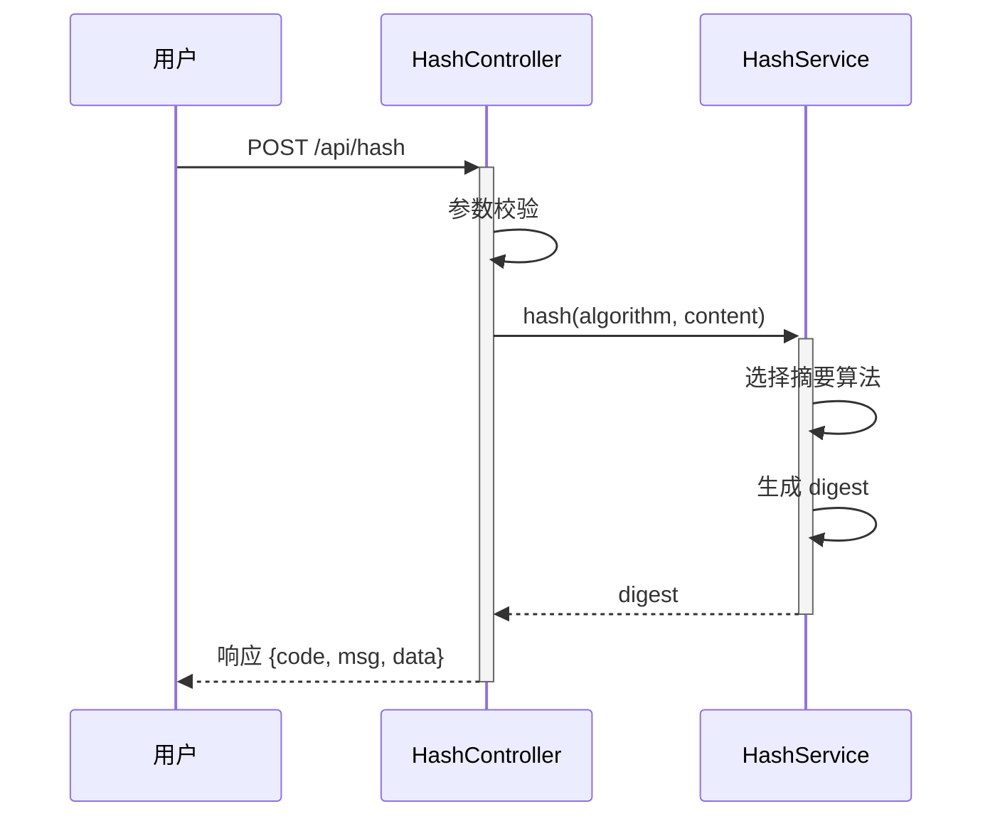
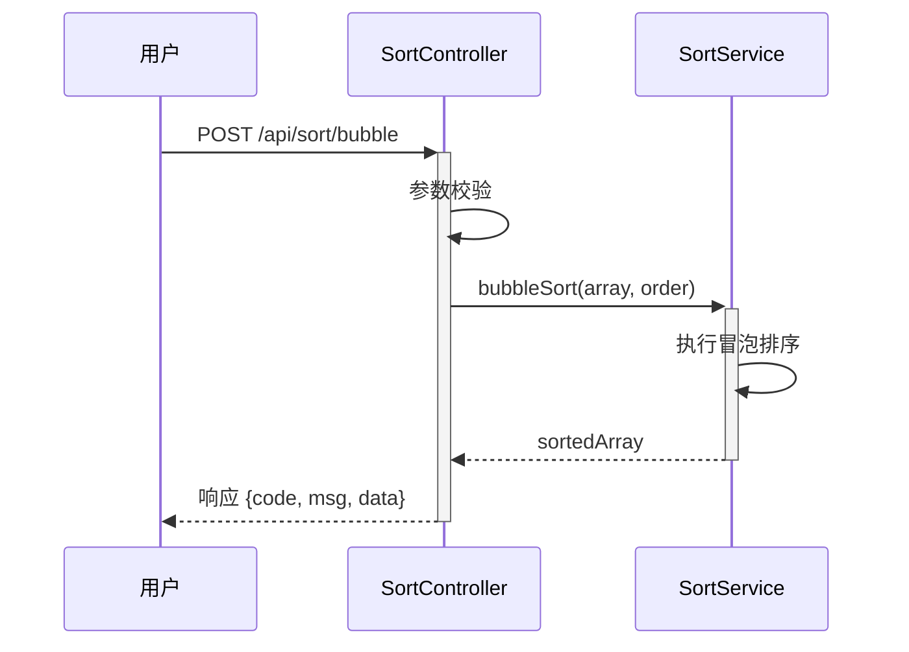
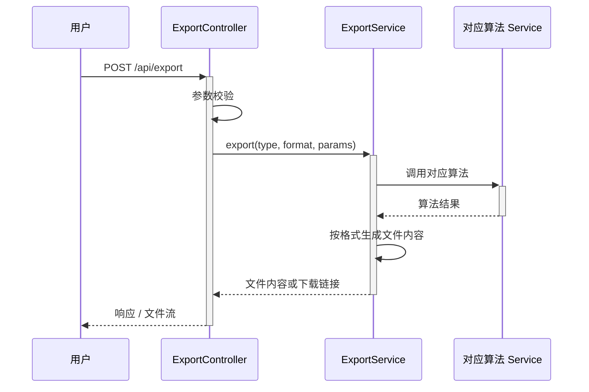

> **文档元信息**
>
> | 项目 | 内容 |
> |------|------|
> | 文档版本 | v1.0 |
> | 作者 | dtazziboot-system-analysis-design |
> | 创建日期 | 2026-08-19 |
> | 需求来源 | 分别写三个接口 helloworld、哈希算法以及冒泡排序；新增导出按钮，后台提供导出接口 |
> | 评审状态 | 待评审 |

# 算法演示模块系分设计

## 1. 需求与范围

### 背景与目标
为当前项目补充一组基础算法演示接口，用于验证服务可用性、展示常用算法能力，并提供结果导出能力。目标用户为前端页面/外部调用方，通过统一的后端接口获取算法结果，并可一键导出结果。

### 核心功能
1. 提供 HelloWorld 问候接口。
2. 提供哈希算法接口（支持常见哈希算法如 MD5、SHA-256）。
3. 提供冒泡排序接口，对输入数组进行排序并返回结果。
4. 前端新增“导出”按钮，后台提供导出接口，支持导出上述接口的结果。

### 约束与非功能要求
- 接口响应简洁，延迟低（纯内存计算）。
- 导出接口避免大数据量，默认导出当前单次结果。
- 无登录态、权限、多租户要求（假设为内部演示或公共示例）。
- 无持久化要求。

### 排除范围
- 用户管理、权限管理。
- 结果持久化、历史记录查询。
- 复杂报表、定时任务。
- 第三方服务集成。

### 需求功能清单与优先级

| 编号 | 功能点 | 优先级 | PRD 原始描述/章节 | 备注 |
|------|--------|--------|-------------------|------|
| F01 | HelloWorld 接口 | P0 | 分别写三个接口 helloworld | 返回问候语 |
| F02 | 哈希算法接口 | P0 | 哈希算法 | 支持 MD5、SHA-256 等 |
| F03 | 冒泡排序接口 | P0 | 冒泡排序 | 对输入数组排序 |
| F04 | 结果导出接口 | P0 | 新增导出按钮，后台提供导出接口 | 导出算法结果 |

### 假设与待确认项

| 编号 | 假设/待确认内容 | 当前假设 | 确认状态 |
|------|-----------------|----------|----------|
| A01 | 哈希算法支持范围 | 默认支持 MD5、SHA-256；可扩展 | 待确认 |
| A02 | 冒泡排序数组元素类型 | 整数数组 | 待确认 |
| A03 | 导出文件格式 | 支持 CSV 和 JSON 两种格式，由请求参数指定 | 待确认 |
| A04 | 是否需要登录/权限 | 当前设计不需要 | 待确认 |

## 2. 架构与模块

### 功能架构



- 交互层说明：外部通过 HTTP 请求访问 Web 控制台或 OpenAPI 网关。
- 核心服务层说明：算法演示模块集中实现 HelloWorld、哈希、冒泡排序及导出功能。
- 扩展/集成层说明：本项不适用，原因：无外部依赖。

### 模块清单

| 模块 | 职责 | 依赖 |
|------|------|------|
| 算法演示模块 | 提供 HelloWorld、哈希、冒泡排序计算及结果导出 | 无外部依赖 |

### 应用集成架构



**集成关系说明：**

| 调用方 | 被调用方 | 协议 | 接口类型 | 说明 |
|--------|----------|------|----------|------|
| 用户浏览器 | Web 控制台 | HTTPS | oneapi REST | 页面调用 |
| 外部调用方 | OpenAPI 网关 | HTTPS | openapi REST | 开放接口 |
| 网关/控制台 | 核心服务层 | 进程内 | Service | 业务逻辑 |

### 部署架构



**部署说明：**
- 负载均衡层：Nginx / SLB。
- 应用层：多实例部署，无状态。
- 数据层：本项不适用，原因：无持久化存储。

## 3. 数据模型与存储

### 实体清单

| 实体名称 | 实体说明 | 所属模块 | 与其他实体的关系 |
|----------|----------|----------|-----------------|
| 无 | 本系统为纯计算型服务，无持久化实体 | - | - |

### 实体关系图


**模型说明：**
- 三个算法接口均为无状态计算，入参直接通过 HTTP 请求传入，计算结果通过响应返回。
- 导出接口仅导出本次计算结果，不存储历史数据。
- 若未来需要记录调用日志或审计，可再新增日志实体，本次设计不涉及。

## 4. 接口设计

### 4.1 oneapi（Web 控制台接口）

| 编号 | 接口名称 | 方法 | 路径 | 模块 |
|------|----------|------|------|------|
| W01 | HelloWorld 接口 | GET | /api/hello | 算法演示模块 |
| W02 | 哈希算法接口 | POST | /api/hash | 算法演示模块 |
| W03 | 冒泡排序接口 | POST | /api/sort/bubble | 算法演示模块 |
| W04 | 结果导出接口 | POST | /api/export | 算法演示模块 |

### 4.2 OpenAPI（对外接口）

| 编号 | 接口名称 | 方法 | 路径 | 模块 |
|------|----------|------|------|------|
| O01 | HelloWorld 接口 | GET | /openapi/hello | 算法演示模块 |
| O02 | 哈希算法接口 | POST | /openapi/hash | 算法演示模块 |
| O03 | 冒泡排序接口 | POST | /openapi/sort/bubble | 算法演示模块 |
| O04 | 结果导出接口 | POST | /openapi/export | 算法演示模块 |

### 4.3 内部接口（Service 层）

| 编号 | 接口名称 | 类 | 方法签名 |
|------|----------|------|----------|
| S01 | HelloWorld 服务 | HelloWorldService | sayHello(name) |
| S02 | 哈希服务 | HashService | hash(algorithm, content) |
| S03 | 排序服务 | SortService | bubbleSort(array) |
| S04 | 导出服务 | ExportService | export(type, result) |

### 4.4 集成接口（Integration 层）

本项不适用，原因：无外部系统集成。

## 5. 功能模块设计

### 全局约定

#### 错误码格式
- 格式：`ALG_{SEQ}`（Algorithm 模块错误码）。

#### 通用出参结构
```json
{
  "code": "OK",
  "msg": "SUCCESS",
  "data": {}
}
```

#### 错误码清单（全局）

| 错误码 | 说明 |
|--------|------|
| OK | 处理成功 |
| ALG_001 | 参数非法 |
| ALG_002 | 不支持的哈希算法 |
| ALG_003 | 排序数组为空或格式错误 |
| ALG_004 | 导出格式不支持 |
| ALG_999 | 系统内部错误 |

#### 模块映射表

| 功能 | 模块 | Controller | Service |
|------|------|------------|---------|
| HelloWorld | 算法演示模块 | HelloWorldController | HelloWorldService |
| 哈希算法 | 算法演示模块 | HashController | HashService |
| 冒泡排序 | 算法演示模块 | SortController | SortService |
| 结果导出 | 算法演示模块 | ExportController | ExportService |

### 5.1 表结构设计

本模块无持久化表结构，原因：三个接口均为无状态计算，导出接口仅导出本次请求结果，不存储历史数据。

### 5.2 枚举与常量定义

| 枚举名称 | 取值 | 含义 | 关联字段 |
|----------|------|------|----------|
| HashAlgorithm | MD5 | MD5 摘要算法 | hash.algorithm |
| HashAlgorithm | SHA256 | SHA-256 摘要算法 | hash.algorithm |
| ExportFormat | CSV | 逗号分隔值文件 | export.format |
| ExportFormat | JSON | JSON 格式文件 | export.format |

### 5.3 接口详细设计

#### 5.3.1 W01 / O01 HelloWorld 接口

- **URI**: GET /api/hello （oneapi） / GET /openapi/hello （OpenAPI）
- **描述**: 返回问候语。
- **入参**:

| 参数名称 | 类型 | 是否必填 | 描述 |
|----------|------|----------|------|
| name | String | 否 | 称呼，默认为 "World" |

- **出参**:

| 参数名称 | 类型 | 描述 |
|----------|------|------|
| code | String | 结果码 |
| msg | String | 提示信息 |
| data | Object | 业务数据，含 greeting 字段 |

- **错误码**:

| 错误码 | 说明 |
|--------|------|
| OK | 成功 |

- **业务规则**: 无特殊规则，返回 `Hello, {name}!`。

- **请求示例**:
```
GET /api/hello?name=Alice
```

- **响应示例**:
```json
{
  "code": "OK",
  "msg": "SUCCESS",
  "data": {
    "greeting": "Hello, Alice!"
  }
}
```

#### 5.3.2 W02 / O02 哈希算法接口

- **URI**: POST /api/hash （oneapi） / POST /openapi/hash （OpenAPI）
- **描述**: 对输入内容使用指定算法生成摘要。
- **入参**:

| 参数名称 | 类型 | 是否必填 | 描述 |
|----------|------|----------|------|
| algorithm | String | 是 | 算法名：MD5 / SHA256 |
| content | String | 是 | 待摘要原文 |

- **出参**:

| 参数名称 | 类型 | 描述 |
|----------|------|------|
| code | String | 结果码 |
| msg | String | 提示信息 |
| data | Object | 含 algorithm、content、digest 字段 |

- **错误码**:

| 错误码 | 说明 |
|--------|------|
| OK | 成功 |
| ALG_001 | 参数非法 |
| ALG_002 | 不支持的哈希算法 |

- **业务规则**:
  - content 为空时返回 ALG_001。
  - algorithm 不在支持列表时返回 ALG_002。
  - 返回的 digest 为小写十六进制字符串。

- **请求示例**:
```json
{
  "algorithm": "SHA256",
  "content": "hello"
}
```

- **响应示例**:
```json
{
  "code": "OK",
  "msg": "SUCCESS",
  "data": {
    "algorithm": "SHA256",
    "content": "hello",
    "digest": "2cf24dba5fb0a30e26e83b2ac5b9e29e1b161e5c1fa7425e73043362938b9824"
  }
}
```

#### 5.3.3 W03 / O03 冒泡排序接口

- **URI**: POST /api/sort/bubble （oneapi） / POST /openapi/sort/bubble （OpenAPI）
- **描述**: 对整数数组执行冒泡排序并返回结果。
- **入参**:

| 参数名称 | 类型 | 是否必填 | 描述 |
|----------|------|----------|------|
| array | int[] | 是 | 待排序整数数组 |
| order | String | 否 | 排序方向：ASC（默认） / DESC |

- **出参**:

| 参数名称 | 类型 | 描述 |
|----------|------|------|
| code | String | 结果码 |
| msg | String | 提示信息 |
| data | Object | 含 originalArray、sortedArray、order 字段 |

- **错误码**:

| 错误码 | 说明 |
|--------|------|
| OK | 成功 |
| ALG_001 | 参数非法 |
| ALG_003 | 排序数组为空或格式错误 |

- **业务规则**:
  - 数组为空或元素非整数时返回 ALG_003。
  - order 默认为 ASC，非法时返回 ALG_001。
  - 使用标准冒泡排序算法，稳定排序。

- **请求示例**:
```json
{
  "array": [3, 1, 4, 1, 5, 9, 2, 6],
  "order": "ASC"
}
```

- **响应示例**:
```json
{
  "code": "OK",
  "msg": "SUCCESS",
  "data": {
    "originalArray": [3, 1, 4, 1, 5, 9, 2, 6],
    "sortedArray": [1, 1, 2, 3, 4, 5, 6, 9],
    "order": "ASC"
  }
}
```

#### 5.3.4 W04 / O04 结果导出接口

- **URI**: POST /api/export （oneapi） / POST /openapi/export （OpenAPI）
- **描述**: 导出指定算法结果，支持 CSV 和 JSON 格式。
- **入参**:

| 参数名称 | 类型 | 是否必填 | 描述 |
|----------|------|----------|------|
| type | String | 是 | 导出类型：hello / hash / bubbleSort |
| format | String | 否 | 导出格式：CSV（默认） / JSON |
| params | Object | 否 | 对应接口的请求参数 |

- **出参**:

| 参数名称 | 类型 | 描述 |
|----------|------|------|
| code | String | 结果码 |
| msg | String | 提示信息 |
| data | Object | 含 downloadUrl 或 fileContent 字段 |

- **错误码**:

| 错误码 | 说明 |
|--------|------|
| OK | 成功 |
| ALG_001 | 参数非法 |
| ALG_004 | 导出格式不支持 |

- **业务规则**:
  - type 必须是 hello / hash / bubbleSort 之一，否则返回 ALG_001。
  - format 默认 CSV，不支持时返回 ALG_004。
  - 导出内容按 type 调用对应 Service 生成结果后格式化输出。
  - 若返回 fileContent，需设置合适的 Content-Type 响应头。

- **请求示例**:
```json
{
  "type": "bubbleSort",
  "format": "JSON",
  "params": {
    "array": [3, 1, 4],
    "order": "ASC"
  }
}
```

- **响应示例（返回下载链接）**:
```json
{
  "code": "OK",
  "msg": "SUCCESS",
  "data": {
    "downloadUrl": "/api/export/download/{fileId}"
  }
}
```

### 5.4 子功能详细设计

#### 5.4.1 HelloWorld 功能（F01）



**业务规则：**

| 规则编号 | 规则描述 | 校验时机 | 不满足时的处理 |
|----------|----------|----------|--------------|
| R01 | name 默认为 "World" | 请求处理时 | 使用默认值 |

**异常场景：**

| 异常场景 | 处理方式 |
|----------|----------|
| name 超长 | 截断或返回 ALG_001（待确认） |

**并发控制：** 无并发风险，原因：纯计算，无共享状态。

#### 5.4.2 哈希算法功能（F02）



**业务规则：**

| 规则编号 | 规则描述 | 校验时机 | 不满足时的处理 |
|----------|----------|----------|--------------|
| R01 | algorithm 支持 MD5/SHA256 | 请求处理时 | 返回 ALG_002 |
| R02 | content 非空 | 请求处理时 | 返回 ALG_001 |

**异常场景：**

| 异常场景 | 处理方式 |
|----------|----------|
| 算法不支持 | 返回 ALG_002 |
| 内容为空 | 返回 ALG_001 |

**并发控制：** 无并发风险，原因：纯计算，无共享状态。

#### 5.4.3 冒泡排序功能（F03）



**业务规则：**

| 规则编号 | 规则描述 | 校验时机 | 不满足时的处理 |
|----------|----------|----------|--------------|
| R01 | array 非空且元素为整数 | 请求处理时 | 返回 ALG_003 |
| R02 | order 为 ASC/DESC | 请求处理时 | 返回 ALG_001 |

**异常场景：**

| 异常场景 | 处理方式 |
|----------|----------|
| 数组为空 | 返回 ALG_003 |
| 元素类型非法 | 返回 ALG_003 |
| order 非法 | 返回 ALG_001 |

**并发控制：** 无并发风险，原因：纯计算，无共享状态。

#### 5.4.4 导出功能（F04）



**业务规则：**

| 规则编号 | 规则描述 | 校验时机 | 不满足时的处理 |
|----------|----------|----------|--------------|
| R01 | type 支持 hello/hash/bubbleSort | 请求处理时 | 返回 ALG_001 |
| R02 | format 支持 CSV/JSON | 请求处理时 | 返回 ALG_004 |
| R03 | params 需满足对应接口校验 | 调用算法时 | 由对应接口返回错误码 |

**异常场景：**

| 异常场景 | 处理方式 |
|----------|----------|
| type 不支持 | 返回 ALG_001 |
| format 不支持 | 返回 ALG_004 |
| 算法执行失败 | 透传对应错误码 |

**并发控制：** 无并发风险，原因：单次请求独立，导出数据量小。

### 5.5 技术选型

| 方案 | 优势 | 劣势 | 推荐 |
|------|------|------|------|
| 内置 Java Digest 实现哈希 | 零依赖、稳定 | 需自行封装 | 推荐 |
| 使用 Apache Commons Codec | 接口友好 | 引入额外依赖 | 备选 |
| 手动实现冒泡排序 | 符合需求、易于演示 | 性能一般 | 推荐 |
| 使用 Collections.sort | 性能更优 | 不满足“冒泡排序”需求 | 不采用 |

**决策结果：** 采用内置 Java 安全摘要算法 + 手动实现冒泡排序。

## 6. 非功能性需求设计

### 6.1 高可用性
- 应用为无状态服务，可通过多实例部署消除单点。
- 无外部依赖，不存在第三方异常导致的不可用。

### 6.2 可扩展性
- 算法接口可通过新增枚举值和 Service 分支快速扩展。
- 导出功能可通过新增 format 类型（如 Excel、PDF）扩展，当前默认 CSV/JSON。

### 6.3 稳定性/可靠性
- 入参均有校验，非法参数返回明确错误码，避免未处理异常。
- 冒泡排序时间复杂度为 O(n²)，建议对数组长度做上限限制（如 10000），防止极端输入导致超时。

### 6.4 安全性设计

#### 6.4.1 账户系统方案
本项不适用，原因：当前需求无登录态和账户体系。

#### 6.4.2 授权&访问控制
- 水平权限检查：本项不适用，原因：无多租户、无用户资源隔离。
- 垂直权限检查：本项不适用，原因：无角色权限体系。
- 登录态检查：本项不适用，原因：接口为公开演示接口。

#### 6.4.3 数据防护方案
- 敏感数据加密存储：本项不适用，原因：无持久化数据。
- 敏感数据展示脱敏：本项不适用，原因：接口仅返回算法结果，无敏感信息。
- 输入参数校验：对数组长度、字符串长度、枚举值进行校验，防止异常输入。

### 6.5 监控/统计/日志/告警
- 接口调用量、耗时、错误码通过 APM 或框架拦截器埋点。
- 关键日志：请求参数、响应状态、处理耗时。
- 告警：错误率超过阈值时触发告警（可选）。

## 7. 变更三板斧

### 7.1 可监控
- 在 Controller 层统一埋点，记录接口 QPS、RT、错误码分布。
- 导出接口额外记录导出类型、格式、文件大小。
- 使用应用日志 + 监控大盘展示。

### 7.2 可灰度
- 本功能为新增接口，无旧逻辑影响，可直接全量发布。
- 若后续接入网关，可按流量百分比或按租户尾号灰度。
- 当前阶段可灰度性：适用（按 URL 灰度）。

### 7.3 可应急
- 新增功能无状态，回滚应用版本即可。
- 如导出接口异常，可关闭导出开关（配置中心开关）或回滚版本。
- 回滚影响：仅影响新增接口，不影响原有功能。
