> **文档元信息**
>
> | 项目 | 内容 |
> |------|------|
> | 文档版本 | v1.0 |
> | 作者 | DTCoder |
> | 创建日期 | 2025-08-19 |
> | 需求来源 | 分别写三个接口helloworld、哈希算法以及冒泡排序 |
> | 评审状态 | 待评审 |

# 三接口演示与调用分析平台 系分设计

## 1. 需求与范围

### 背景与目标

构建一个前后端分离的演示平台，后端提供三个基础算法接口（HelloWorld、哈希算法、冒泡排序），前端以多 Tab 页面展示各接口执行结果；同时支持结果导出、接口调用埋点统计，并在前端以可视化报表（折线图、饼图、柱状图）呈现调用情况，帮助管理者从人员类型、人员层级、人员部门等维度分析接口使用状况。

### 核心功能

1. 三个业务接口：HelloWorld 问候、哈希算法计算、冒泡排序
2. 前端三 Tab 页面分别展示三个接口的执行结果
3. 导出功能：前端导出按钮 + 后端导出接口，支持导出各 Tab 页展示结果
4. 调用埋点：后端记录每次接口调用的调用人与调用信息
5. 可视化报表：前端展示调用统计（折线图、饼图、柱状图），支持多维度筛选（人员类型、人员层级、人员部门）

### 约束与非功能要求

- 前后端分离架构，后端 RESTful API，前端 SPA
- 接口响应时间 < 500ms
- 导出数据格式为 CSV 或 Excel
- 报表图表使用前端图表库（如 ECharts）
- 埋点数据不影响业务接口性能（异步写入）

### 排除范围

- 不涉及用户注册/登录体系（假设已有统一认证）
- 不涉及第三方系统对接
- 不涉及消息队列/分布式缓存等中间件

### 需求功能清单与优先级

| 编号 | 功能点 | 优先级 | PRD 原始描述/章节 | 备注 |
|------|--------|--------|-------------------|------|
| F01 | HelloWorld 接口 | P0 | "分别写三个接口helloworld" | 返回问候语 |
| F02 | 哈希算法接口 | P0 | "哈希算法" | 接收输入，返回哈希值 |
| F03 | 冒泡排序接口 | P0 | "冒泡排序" | 接收数组，返回排序结果 |
| F04 | 前端三 Tab 展示页 | P0 | "前端新增一个页面，有三个tab分别展示不同的执行结果" | Tab 切换展示 |
| F05 | 导出接口（后端） | P1 | "后台提供导出接口，支持导出各个页面的展示结果" | CSV/Excel |
| F06 | 导出按钮（前端） | P1 | "新增导出按钮" | 各 Tab 页独立导出 |
| F07 | 接口调用埋点 | P0 | "后端再做个埋点，获取调用次数和调用人" | 异步记录 |
| F08 | 调用统计查询接口 | P1 | "前端在当前页面上可视化出来一个报表查看调用情况" | 多维度聚合 |
| F09 | 可视化报表（前端） | P1 | "折线图以及饼图和柱状图不同展示形式" | ECharts |
| F10 | 多维度筛选 | P1 | "根据不同的维度：人员类型、人员层级、人员部门等" | 人员类型/层级/部门 |

### 假设与待确认项

| 编号 | 假设/待确认内容 | 当前假设 | 确认状态 |
|------|-----------------|----------|----------|
| A01 | 用户身份信息获取方式 | 假设：通过请求头中的统一认证 Token 解析出用户 ID、姓名、类型、层级、部门 | 待确认 |
| A02 | 哈希算法具体类型 | 假设：使用 SHA-256 算法，接收字符串输入返回十六进制哈希值 | 待确认 |
| A03 | 冒泡排序输入格式 | 假设：接收整数数组，返回升序排列结果 | 待确认 |
| A04 | 导出文件格式 | 假设：默认 CSV 格式，轻量且通用 | 待确认 |
| A05 | 数据库选型 | 假设：MySQL 5.7+，单库单表 | 待确认 |
| A06 | 前端技术栈 | 假设：React + Ant Design + ECharts | 待确认 |
| A07 | 后端技术栈 | 假设：Java Spring Boot | 待确认 |

## 2. 架构与模块

### 功能架构

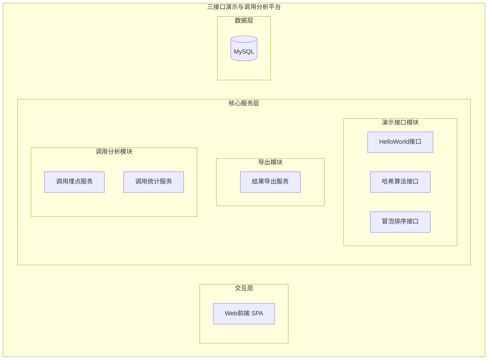

- **交互层**：Web 前端 SPA，提供三 Tab 演示页面、导出操作入口、可视化报表页面
- **核心服务层**：
  - **演示接口模块**：提供 HelloWorld、哈希算法、冒泡排序三个业务接口
  - **导出模块**：提供各接口执行结果的 CSV 导出
  - **调用分析模块**：异步记录接口调用日志，提供多维度聚合统计查询
- **数据层**：MySQL 持久化调用日志

**模块清单**

| 模块 | 职责 | 依赖 |
|------|------|------|
| 演示接口模块 | 提供 HelloWorld、哈希算法、冒泡排序三个基础算法接口，执行业务逻辑并返回结果 | 调用分析模块（埋点） |
| 导出模块 | 将各接口执行结果导出为 CSV 文件 | 无 |
| 调用分析模块 | 记录每次接口调用的埋点数据（调用次数、调用人信息），提供多维度聚合统计查询 | 数据库 |

### 应用集成架构

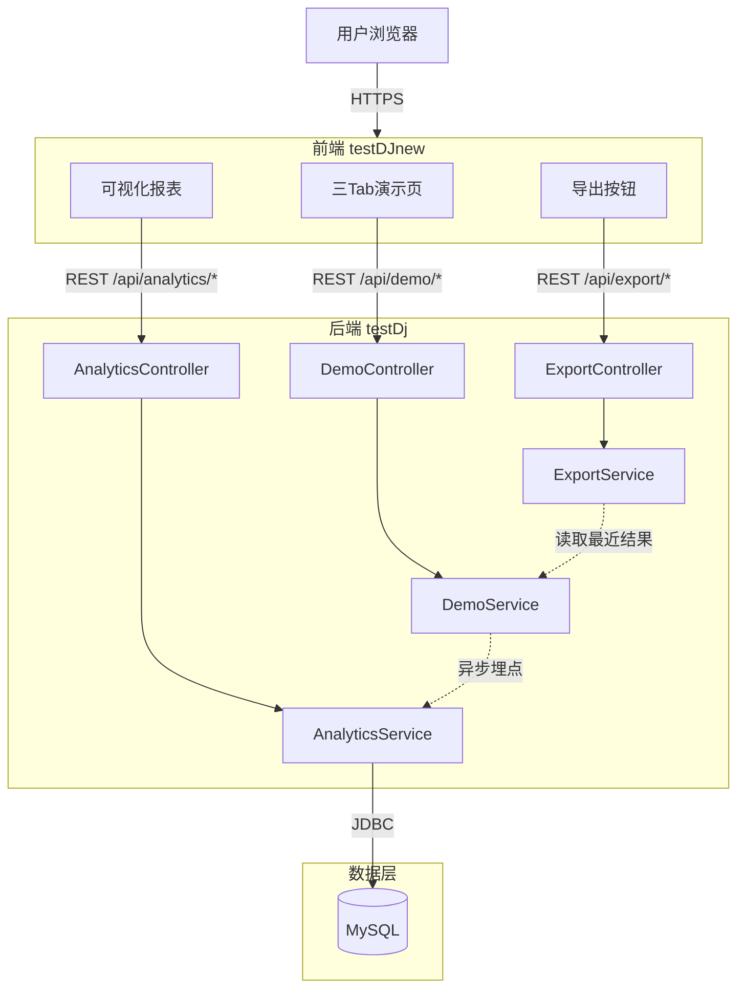

**集成关系说明：**

| 调用方 | 被调用方 | 协议 | 接口类型 | 说明 |
|--------|----------|------|----------|------|
| 用户浏览器 | 前端 SPA | HTTPS | 静态资源 | 前端页面加载 |
| 前端三Tab页 | DemoController | HTTPS | oneapi REST | 调用三个演示接口 |
| 前端导出按钮 | ExportController | HTTPS | oneapi REST | 导出执行结果 |
| 前端报表页 | AnalyticsController | HTTPS | oneapi REST | 查询调用统计 |
| DemoService | AnalyticsService | JVM 内部 | 异步调用 | 接口调用埋点 |
| AnalyticsService | MySQL | JDBC | SQL | 读写调用日志 |

### 部署架构

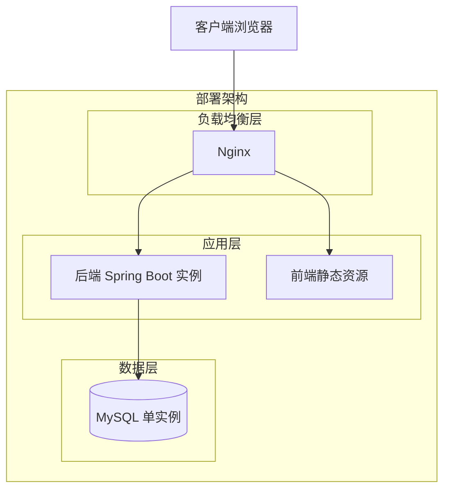

**部署说明：**
- **负载均衡层**：Nginx 反向代理，前端静态资源与后端 API 统一代理
- **应用层**：后端 Spring Boot 单实例部署；前端打包为静态资源由 Nginx 托管
- **数据层**：MySQL 单实例，存储调用日志数据
- **假设**：当前为轻量演示项目，单实例部署即可满足需求；如需扩展可水平扩展后端实例

## 3. 数据模型与存储

### 实体清单

| 实体名称 | 实体说明 | 所属模块 | 与其他实体的关系 |
|----------|----------|----------|-----------------|
| api_call_log | 接口调用日志，记录每次接口调用的详细信息 | 调用分析模块 | 无直接关联实体 |

### 实体关系图

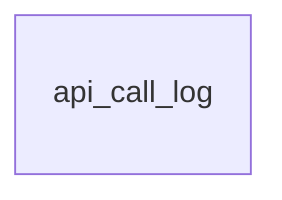

**模型说明：**
- 本系统仅涉及一张调用日志表 `api_call_log`，用于记录每次接口调用的元数据（接口名称、调用人、调用时间、人员维度信息等）
- 三个演示接口的输入/输出为即时计算结果，不做持久化存储（导出时基于最近一次请求的内存缓存或重新执行）

## 4. 接口设计

### 4.1 oneapi（Web 控制台接口）

| 编号 | 接口名称 | 方法 | 路径 | 模块 |
|------|----------|------|------|------|
| W01 | HelloWorld 接口 | POST | /api/demo/helloworld | 演示接口模块 |
| W02 | 哈希算法接口 | POST | /api/demo/hash | 演示接口模块 |
| W03 | 冒泡排序接口 | POST | /api/demo/bubble-sort | 演示接口模块 |
| W04 | 导出 HelloWorld 结果 | GET | /api/export/helloworld | 导出模块 |
| W05 | 导出哈希算法结果 | GET | /api/export/hash | 导出模块 |
| W06 | 导出冒泡排序结果 | GET | /api/export/bubble-sort | 导出模块 |
| W07 | 调用统计查询 | GET | /api/analytics/summary | 调用分析模块 |
| W08 | 调用趋势查询 | GET | /api/analytics/trend | 调用分析模块 |
| W09 | 调用分布查询 | GET | /api/analytics/distribution | 调用分析模块 |

### 4.2 OpenAPI（对外接口）

本项不适用，原因：当前需求不涉及对外开放接口，所有接口仅供内部前端调用。

### 4.3 内部接口（Service 层）

| 编号 | 接口名称 | 类 | 方法签名 |
|------|----------|------|----------|
| S01 | HelloWorld 执行 | DemoService | String helloWorld(String name) |
| S02 | 哈希计算 | DemoService | String hash(String input) |
| S03 | 冒泡排序 | DemoService | List\<Integer\> bubbleSort(List\<Integer\> input) |
| S04 | 记录调用日志 | AnalyticsService | void recordCall(String apiName, String callerId, String callerName, String callerType, String callerLevel, String callerDept) |
| S05 | 查询调用汇总 | AnalyticsService | CallSummaryDTO getSummary(String dimension, String apiName, Date startDate, Date endDate) |
| S06 | 查询调用趋势 | AnalyticsService | List\<TrendDTO\> getTrend(String apiName, String granularity, Date startDate, Date endDate) |
| S07 | 查询调用分布 | AnalyticsService | List\<DistributionDTO\> getDistribution(String dimension, String apiName, Date startDate, Date endDate) |
| S08 | 导出 HelloWorld | ExportService | byte[] exportHelloWorld() |
| S09 | 导出哈希结果 | ExportService | byte[] exportHash() |
| S10 | 导出排序结果 | ExportService | byte[] exportBubbleSort() |

### 4.4 集成接口（Integration 层）

本项不适用，原因：当前需求不涉及外部系统集成调用。

## 5. 功能模块设计

### 5.1 演示接口模块

#### 5.1.1 表结构设计

本模块无独立数据表。三个接口均为无状态计算型接口，输入输出即时处理，不做持久化。

#### 5.1.2 接口详细设计

##### W01 HelloWorld 接口

- **URI**: POST /api/demo/helloworld
- **描述**: 接收用户名称，返回问候语
- **入参**:

| 参数名称 | 类型 | 是否必填 | 描述 |
|----------|------|----------|------|
| name | String | 否 | 用户名称，默认值 "World" |

- **出参**:

| 参数名称 | 类型 | 描述 |
|----------|------|------|
| code | String | 结果code |
| msg | String | 提示信息 |
| data | Object | 业务数据 |
| data.result | String | 问候语，如 "Hello, {name}!" |
| data.timestamp | String | 执行时间戳 |

- **错误码**:

| 错误码 | 说明 |
|--------|------|
| DEMO_001 | 参数格式异常 |

- **业务规则**: 接收 name 参数，拼接问候语返回

- **请求示例**:
```json
{
  "name": "张三"
}
```

- **响应示例**:
```json
{
  "code": "OK",
  "msg": "SUCCESS",
  "data": {
    "result": "Hello, 张三!",
    "timestamp": "2025-08-19T10:30:00"
  }
}
```

##### W02 哈希算法接口

- **URI**: POST /api/demo/hash
- **描述**: 接收输入字符串，使用 SHA-256 算法计算并返回十六进制哈希值
- **入参**:

| 参数名称 | 类型 | 是否必填 | 描述 |
|----------|------|----------|------|
| input | String | 是 | 待哈希的输入字符串 |

- **出参**:

| 参数名称 | 类型 | 描述 |
|----------|------|------|
| code | String | 结果code |
| msg | String | 提示信息 |
| data | Object | 业务数据 |
| data.input | String | 原始输入 |
| data.algorithm | String | 算法名称，固定 "SHA-256" |
| data.hashValue | String | 十六进制哈希值 |
| data.timestamp | String | 执行时间戳 |

- **错误码**:

| 错误码 | 说明 |
|--------|------|
| DEMO_002 | 输入不能为空 |
| DEMO_003 | 哈希算法不可用（系统异常） |

- **业务规则**: 使用 Java 标准库 MessageDigest 实现 SHA-256 哈希

- **请求示例**:
```json
{
  "input": "hello world"
}
```

- **响应示例**:
```json
{
  "code": "OK",
  "msg": "SUCCESS",
  "data": {
    "input": "hello world",
    "algorithm": "SHA-256",
    "hashValue": "b94d27b9934d3e08a52e52d7da7dabfac484efe37a5380ee9088f7ace2efcde9",
    "timestamp": "2025-08-19T10:30:00"
  }
}
```

##### W03 冒泡排序接口

- **URI**: POST /api/demo/bubble-sort
- **描述**: 接收整数数组，使用冒泡排序算法返回升序排列结果
- **入参**:

| 参数名称 | 类型 | 是否必填 | 描述 |
|----------|------|----------|------|
| numbers | List\<Integer\> | 是 | 待排序的整数数组 |

- **出参**:

| 参数名称 | 类型 | 描述 |
|----------|------|------|
| code | String | 结果code |
| msg | String | 提示信息 |
| data | Object | 业务数据 |
| data.original | List\<Integer\> | 原始输入数组 |
| data.sorted | List\<Integer\> | 排序后数组 |
| data.timestamp | String | 执行时间戳 |

- **错误码**:

| 错误码 | 说明 |
|--------|------|
| DEMO_004 | 输入数组不能为空 |
| DEMO_005 | 数组长度超过上限（10000） |

- **业务规则**: 经典冒泡排序实现，数组长度上限 10000

- **请求示例**:
```json
{
  "numbers": [5, 3, 8, 1, 9, 2]
}
```

- **响应示例**:
```json
{
  "code": "OK",
  "msg": "SUCCESS",
  "data": {
    "original": [5, 3, 8, 1, 9, 2],
    "sorted": [1, 2, 3, 5, 8, 9],
    "timestamp": "2025-08-19T10:30:00"
  }
}
```

#### 5.1.3 子功能详细设计

##### 5.1.3.1 HelloWorld 执行（F01）

- 处理时序图
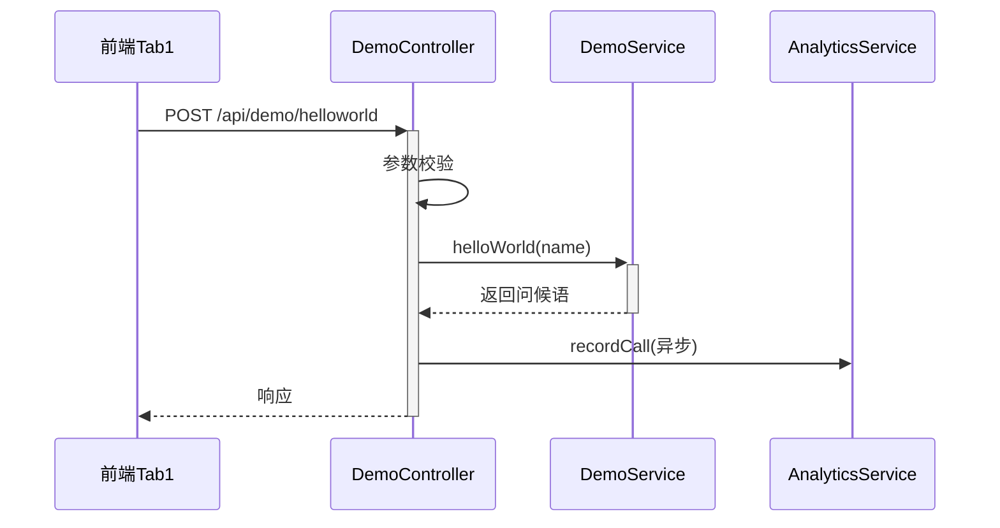

**业务规则：**
| 规则编号 | 规则描述 | 校验时机 | 不满足时的处理 |
|----------|----------|----------|--------------|
| R01 | name 为空时默认使用 "World" | 调用时 | 自动填充默认值 |

**异常场景：**
| 异常场景 | 处理方式 |
|----------|----------|
| 参数类型异常 | 返回错误码 DEMO_001 |

**并发控制：**
- 无并发风险，原因：接口为无状态纯计算，不涉及共享数据写入

##### 5.1.3.2 哈希算法执行（F02）

- 处理时序图
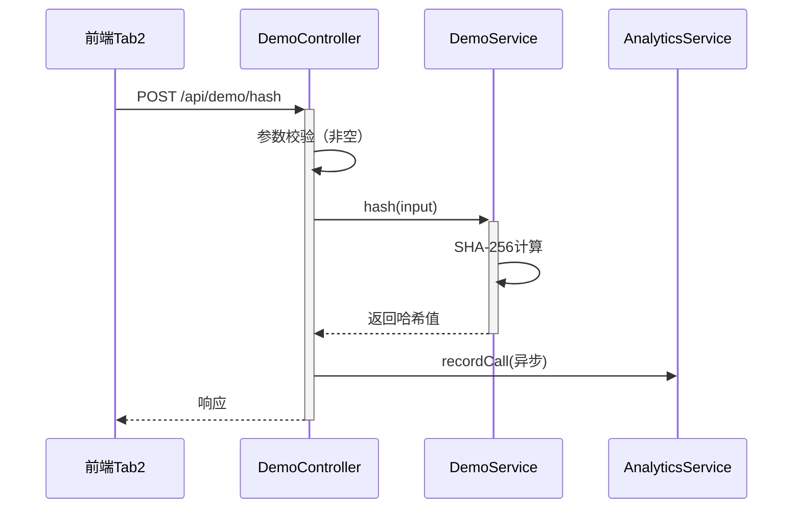

**业务规则：**
| 规则编号 | 规则描述 | 校验时机 | 不满足时的处理 |
|----------|----------|----------|--------------|
| R02 | input 不能为空 | 调用时 | 返回错误码 DEMO_002 |
| R03 | 使用 SHA-256 算法 | 始终 | 固定算法 |

**异常场景：**
| 异常场景 | 处理方式 |
|----------|----------|
| 输入为空 | 返回错误码 DEMO_002 |
| SHA-256 算法不可用 | 返回错误码 DEMO_003，记录系统异常日志 |

**并发控制：**
- 无并发风险，原因：接口为无状态纯计算

##### 5.1.3.3 冒泡排序执行（F03）

- 处理时序图
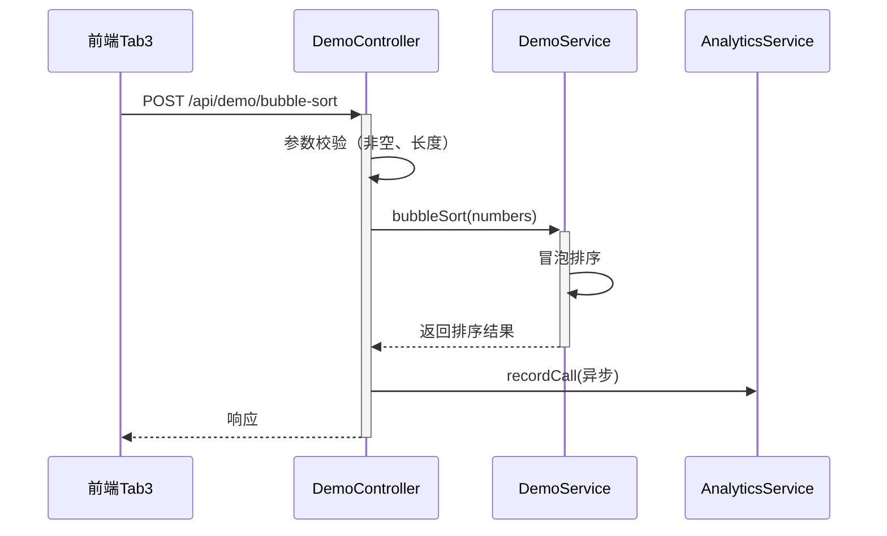

**业务规则：**
| 规则编号 | 规则描述 | 校验时机 | 不满足时的处理 |
|----------|----------|----------|--------------|
| R04 | 输入数组不能为空 | 调用时 | 返回错误码 DEMO_004 |
| R05 | 数组长度不超过 10000 | 调用时 | 返回错误码 DEMO_005 |

**异常场景：**
| 异常场景 | 处理方式 |
|----------|----------|
| 输入为空 | 返回错误码 DEMO_004 |
| 数组超长 | 返回错误码 DEMO_005 |

**并发控制：**
- 无并发风险，原因：接口为无状态纯计算

### 5.2 导出模块

#### 5.2.1 表结构设计

本模块无独立数据表。导出内容基于最近一次接口执行的内存缓存或重新执行获取。

#### 5.2.2 接口详细设计

##### W04 导出 HelloWorld 结果

- **URI**: GET /api/export/helloworld
- **描述**: 导出 HelloWorld 接口最近执行结果为 CSV 文件
- **入参**: 无（通过请求头获取用户身份）
- **出参**: 文件流（Content-Type: text/csv, Content-Disposition: attachment）

- **CSV 结构**:

| 列名 | 说明 |
|------|------|
| name | 输入名称 |
| result | 问候语结果 |
| timestamp | 执行时间 |

- **错误码**:

| 错误码 | 说明 |
|--------|------|
| EXPORT_001 | 无可导出的数据 |

##### W05 导出哈希算法结果

- **URI**: GET /api/export/hash
- **描述**: 导出哈希算法接口最近执行结果为 CSV 文件
- **入参**: 无
- **出参**: 文件流

- **CSV 结构**:

| 列名 | 说明 |
|------|------|
| input | 原始输入 |
| algorithm | 算法名称 |
| hash_value | 哈希值 |
| timestamp | 执行时间 |

- **错误码**:

| 错误码 | 说明 |
|--------|------|
| EXPORT_001 | 无可导出的数据 |

##### W06 导出冒泡排序结果

- **URI**: GET /api/export/bubble-sort
- **描述**: 导出冒泡排序接口最近执行结果为 CSV 文件
- **入参**: 无
- **出参**: 文件流

- **CSV 结构**:

| 列名 | 说明 |
|------|------|
| original | 原始数组 |
| sorted | 排序结果 |
| timestamp | 执行时间 |

- **错误码**:

| 错误码 | 说明 |
|--------|------|
| EXPORT_001 | 无可导出的数据 |

#### 5.2.3 子功能详细设计

##### 5.2.3.1 结果导出（F05/F06）

- 处理时序图
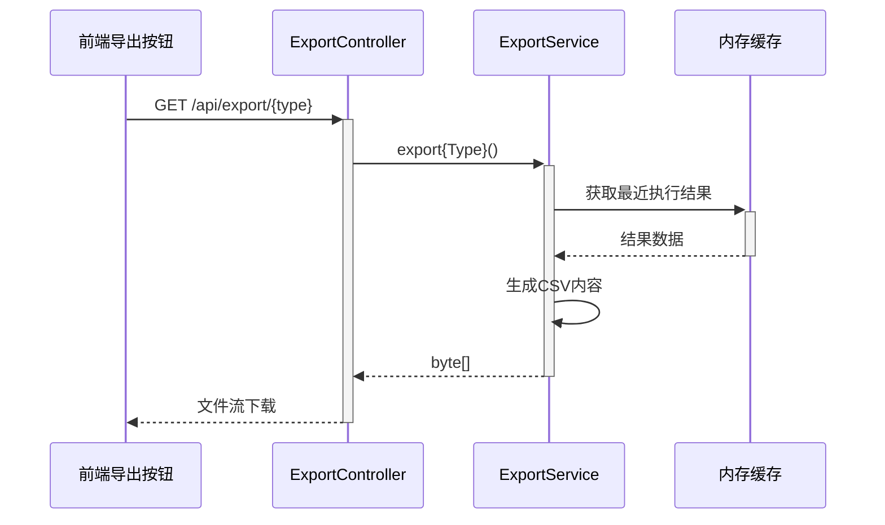

**业务规则：**
| 规则编号 | 规则描述 | 校验时机 | 不满足时的处理 |
|----------|----------|----------|--------------|
| R06 | 导出内容为当前会话中最近的执行结果 | 导出时 | 无数据时返回 EXPORT_001 |
| R07 | 文件名包含接口名称和时间戳 | 导出时 | 固定格式 |

**异常场景：**
| 异常场景 | 处理方式 |
|----------|----------|
| 缓存中无数据 | 返回错误码 EXPORT_001 |
| 文件生成异常 | 返回 500 错误 |

**并发控制：**
- 无并发风险，原因：导出为只读操作，各用户独立会话缓存

### 5.3 调用分析模块

#### 5.3.1 表结构设计

##### 5.3.1.1 api_call_log

| 字段名 | 数据类型 | 约束 | 默认值 | 说明 |
|--------|----------|------|--------|------|
| id | bigint | PK, 自增 | - | 系统自增主键 |
| api_name | varchar(64) | NOT NULL | - | 接口标识：helloworld/hash/bubble-sort |
| caller_id | varchar(64) | NOT NULL | - | 调用人 ID |
| caller_name | varchar(128) | NOT NULL | '' | 调用人姓名 |
| caller_type | varchar(32) | NOT NULL | '' | 人员类型（如：正式/外包/实习） |
| caller_level | varchar(32) | NOT NULL | '' | 人员层级（如：P5/P6/P7） |
| caller_dept | varchar(128) | NOT NULL | '' | 人员部门 |
| request_params | text | | NULL | 请求参数快照（JSON） |
| response_status | varchar(16) | NOT NULL | 'SUCCESS' | 调用结果状态：SUCCESS/FAIL |
| call_duration_ms | int | NOT NULL | 0 | 调用耗时（毫秒） |
| gmt_create | datetime | NOT NULL | CURRENT_TIMESTAMP | 调用时间 |
| gmt_modified | datetime | NOT NULL | CURRENT_TIMESTAMP | 修改时间 |

**索引：**
- IDX: `idx_api_call_log_api_name` (api_name) — 按接口名称查询
- IDX: `idx_api_call_log_caller_id` (caller_id) — 按调用人查询
- IDX: `idx_api_call_log_caller_dept` (caller_dept) — 按部门查询
- IDX: `idx_api_call_log_gmt_create` (gmt_create) — 按时间范围查询
- IDX: `idx_api_call_log_caller_type` (caller_type) — 按人员类型查询
- IDX: `idx_api_call_log_caller_level` (caller_level) — 按人员层级查询

##### 5.3.1.2 枚举与常量定义

| 枚举名称 | 取值 | 含义 | 关联字段 |
|----------|------|------|----------|
| ApiNameEnum | helloworld | HelloWorld 接口 | api_call_log.api_name |
| ApiNameEnum | hash | 哈希算法接口 | api_call_log.api_name |
| ApiNameEnum | bubble-sort | 冒泡排序接口 | api_call_log.api_name |
| CallerTypeEnum | REGULAR | 正式员工 | api_call_log.caller_type |
| CallerTypeEnum | CONTRACTOR | 外包人员 | api_call_log.caller_type |
| CallerTypeEnum | INTERN | 实习人员 | api_call_log.caller_type |
| ResponseStatusEnum | SUCCESS | 调用成功 | api_call_log.response_status |
| ResponseStatusEnum | FAIL | 调用失败 | api_call_log.response_status |

#### 5.3.2 接口详细设计

##### W07 调用统计查询（汇总）

- **URI**: GET /api/analytics/summary
- **描述**: 查询接口调用次数汇总，支持按维度分组
- **入参**:

| 参数名称 | 类型 | 是否必填 | 描述 |
|----------|------|----------|------|
| dimension | String | 是 | 统计维度：caller_type/caller_level/caller_dept |
| apiName | String | 否 | 接口名称筛选，不传则查全部 |
| startDate | String | 否 | 起始日期，格式 yyyy-MM-dd，默认近 7 天 |
| endDate | String | 否 | 结束日期，格式 yyyy-MM-dd，默认今天 |

- **出参**:

| 参数名称 | 类型 | 描述 |
|----------|------|------|
| code | String | 结果code |
| msg | String | 提示信息 |
| data | Object | 业务数据 |
| data.dimension | String | 统计维度 |
| data.items | List | 分组列表 |
| data.items[].groupKey | String | 分组键（如部门名） |
| data.items[].callCount | Integer | 调用次数 |
| data.items[].uniqueCallers | Integer | 独立调用人数 |

- **错误码**:

| 错误码 | 说明 |
|--------|------|
| ANALYTICS_001 | 维度参数无效 |
| ANALYTICS_002 | 日期范围无效 |

- **请求示例**:
```json
GET /api/analytics/summary?dimension=caller_dept&apiName=hash&startDate=2025-08-12&endDate=2025-08-19
```

- **响应示例**:
```json
{
  "code": "OK",
  "msg": "SUCCESS",
  "data": {
    "dimension": "caller_dept",
    "items": [
      { "groupKey": "技术部", "callCount": 156, "uniqueCallers": 12 },
      { "groupKey": "产品部", "callCount": 89, "uniqueCallers": 7 },
      { "groupKey": "运营部", "callCount": 45, "uniqueCallers": 5 }
    ]
  }
}
```

##### W08 调用趋势查询

- **URI**: GET /api/analytics/trend
- **描述**: 查询接口调用次数随时间变化的趋势，用于折线图展示
- **入参**:

| 参数名称 | 类型 | 是否必填 | 描述 |
|----------|------|----------|------|
| apiName | String | 否 | 接口名称筛选 |
| granularity | String | 否 | 时间粒度：hour/day/week/month，默认 day |
| startDate | String | 否 | 起始日期 |
| endDate | String | 否 | 结束日期 |

- **出参**:

| 参数名称 | 类型 | 描述 |
|----------|------|------|
| code | String | 结果code |
| msg | String | 提示信息 |
| data | Object | 业务数据 |
| data.granularity | String | 时间粒度 |
| data.points | List | 趋势数据点 |
| data.points[].timeLabel | String | 时间标签 |
| data.points[].callCount | Integer | 调用次数 |

- **错误码**:

| 错误码 | 说明 |
|--------|------|
| ANALYTICS_003 | 粒度参数无效 |

- **请求示例**:
```json
GET /api/analytics/trend?apiName=hash&granularity=day&startDate=2025-08-12&endDate=2025-08-19
```

- **响应示例**:
```json
{
  "code": "OK",
  "msg": "SUCCESS",
  "data": {
    "granularity": "day",
    "points": [
      { "timeLabel": "2025-08-13", "callCount": 23 },
      { "timeLabel": "2025-08-14", "callCount": 45 },
      { "timeLabel": "2025-08-15", "callCount": 38 },
      { "timeLabel": "2025-08-16", "callCount": 52 },
      { "timeLabel": "2025-08-17", "callCount": 61 },
      { "timeLabel": "2025-08-18", "callCount": 40 },
      { "timeLabel": "2025-08-19", "callCount": 31 }
    ]
  }
}
```

##### W09 调用分布查询

- **URI**: GET /api/analytics/distribution
- **描述**: 查询接口调用在指定维度上的分布情况，用于饼图和柱状图展示
- **入参**:

| 参数名称 | 类型 | 是否必填 | 描述 |
|----------|------|----------|------|
| dimension | String | 是 | 统计维度：caller_type/caller_level/caller_dept |
| apiName | String | 否 | 接口名称筛选 |
| startDate | String | 否 | 起始日期 |
| endDate | String | 否 | 结束日期 |

- **出参**:

| 参数名称 | 类型 | 描述 |
|----------|------|------|
| code | String | 结果code |
| msg | String | 提示信息 |
| data | Object | 业务数据 |
| data.dimension | String | 统计维度 |
| data.items | List | 分布数据 |
| data.items[].groupKey | String | 分组键 |
| data.items[].callCount | Integer | 调用次数 |
| data.items[].percentage | Double | 占比（百分比） |

- **错误码**:

| 错误码 | 说明 |
|--------|------|
| ANALYTICS_001 | 维度参数无效 |

- **请求示例**:
```json
GET /api/analytics/distribution?dimension=caller_type&startDate=2025-08-12&endDate=2025-08-19
```

- **响应示例**:
```json
{
  "code": "OK",
  "msg": "SUCCESS",
  "data": {
    "dimension": "caller_type",
    "items": [
      { "groupKey": "正式员工", "callCount": 200, "percentage": 66.7 },
      { "groupKey": "外包人员", "callCount": 70, "percentage": 23.3 },
      { "groupKey": "实习人员", "callCount": 30, "percentage": 10.0 }
    ]
  }
}
```

#### 5.3.3 子功能详细设计

##### 5.3.3.1 调用埋点记录（F07）

- 处理时序图
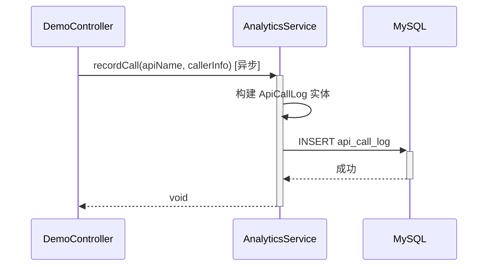

**业务规则：**
| 规则编号 | 规则描述 | 校验时机 | 不满足时的处理 |
|----------|----------|----------|--------------|
| R08 | 埋点记录必须异步执行，不阻塞业务接口响应 | 始终 | 使用 @Async 或线程池 |
| R09 | 埋点失败不影响业务接口 | 始终 | 捕获异常，记录日志 |
| R10 | 调用人员信息从请求上下文中获取 | 记录时 | 无法获取时记录为 UNKNOWN |

**异常场景：**
| 异常场景 | 处理方式 |
|----------|----------|
| 数据库写入失败 | 捕获异常，记录 WARN 日志，不影响业务接口 |
| 用户身份信息缺失 | caller_id 记录为 UNKNOWN，其他字段留空 |

**并发控制：**
- 并发场景：多个请求同时触发埋点写入
- 控制策略：INSERT 操作天然幂等，无并发冲突风险；使用线程池限制异步写入并发度

##### 5.3.3.2 调用统计查询（F08）

- 处理时序图
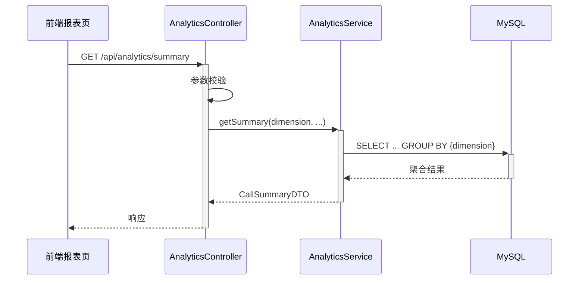

**业务规则：**
| 规则编号 | 规则描述 | 校验时机 | 不满足时的处理 |
|----------|----------|----------|--------------|
| R11 | 日期范围默认近 7 天 | 查询时 | 自动填充 |
| R12 | 维度必须为 caller_type/caller_level/caller_dept 之一 | 查询时 | 返回 ANALYTICS_001 |
| R13 | 查询结果按 callCount 降序排列 | 始终 | 自动排序 |

**异常场景：**
| 异常场景 | 处理方式 |
|----------|----------|
| 维度参数非法 | 返回 ANALYTICS_001 |
| 日期格式错误 | 返回 ANALYTICS_002 |

**并发控制：**
- 无并发风险，原因：统计查询为只读操作

##### 5.3.3.3 调用趋势查询（F08-趋势）

- 处理时序图
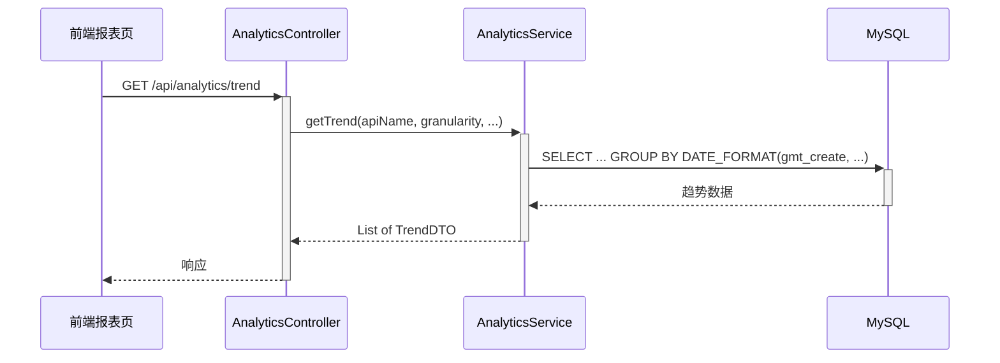

**业务规则：**
| 规则编号 | 规则描述 | 校验时机 | 不满足时的处理 |
|----------|----------|----------|--------------|
| R14 | 时间粒度默认 day | 查询时 | 自动填充 |
| R15 | 缺失时间点补零 | 结果组装时 | 自动填充 callCount=0 |

**异常场景：**
| 异常场景 | 处理方式 |
|----------|----------|
| 粒度参数非法 | 返回 ANALYTICS_003 |

**并发控制：**
- 无并发风险，原因：只读查询

##### 5.3.3.4 调用分布查询（F08-分布）

- 处理时序图
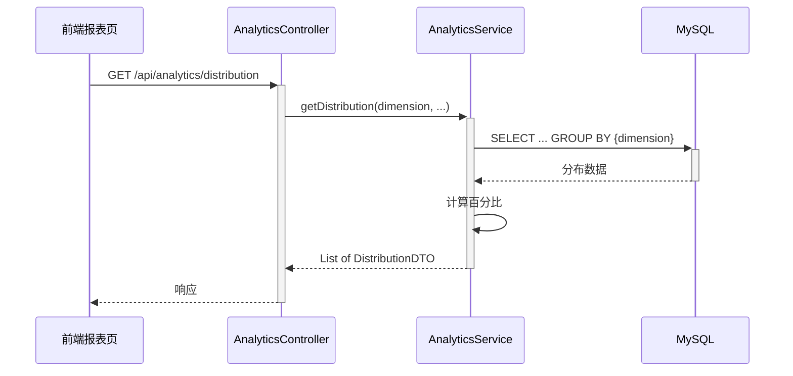

**业务规则：**
| 规则编号 | 规则描述 | 校验时机 | 不满足时的处理 |
|----------|----------|----------|--------------|
| R16 | 百分比保留一位小数 | 结果组装时 | 自动计算 |
| R17 | 分组键为空时归类为"未知" | 结果组装时 | 自动归类 |

**异常场景：**
| 异常场景 | 处理方式 |
|----------|----------|
| 维度参数非法 | 返回 ANALYTICS_001 |

**并发控制：**
- 无并发风险，原因：只读查询

### 5.4 前端页面设计（testDJnew）

#### 5.4.1 页面结构

前端新增一个主页面，包含以下区域：

**区域一：三 Tab 演示区（F04）**

| Tab | 功能 | 对应后端接口 |
|-----|------|-------------|
| Tab1 - HelloWorld | 输入名称，展示问候语结果 | POST /api/demo/helloworld |
| Tab2 - 哈希算法 | 输入字符串，展示哈希值 | POST /api/demo/hash |
| Tab3 - 冒泡排序 | 输入整数数组，展示排序结果 | POST /api/demo/bubble-sort |

每个 Tab 页包含：
- 输入区域：表单输入控件
- 执行按钮：触发接口调用
- 结果展示区：以表格或卡片形式展示返回结果
- 导出按钮（F06）：调用对应导出接口下载 CSV

**区域二：可视化报表区（F09/F10）**

| 图表类型 | 用途 | 对应后端接口 |
|----------|------|-------------|
| 折线图 | 调用趋势（按时间） | GET /api/analytics/trend |
| 饼图 | 调用分布（按维度占比） | GET /api/analytics/distribution |
| 柱状图 | 调用汇总（按维度分组） | GET /api/analytics/summary |

报表区包含：
- 筛选条件栏：维度选择（人员类型/人员层级/人员部门）、接口筛选、日期范围
- 图表切换：折线图 / 饼图 / 柱状图切换按钮
- 图表渲染区：使用 ECharts 渲染

#### 5.4.2 前端组件结构

| 组件 | 职责 | 依赖 |
|------|------|------|
| DemoPage | 主页面容器，管理 Tab 切换和报表区域 | - |
| HelloWorldTab | HelloWorld 接口调用与结果展示 | API Service |
| HashTab | 哈希算法接口调用与结果展示 | API Service |
| BubbleSortTab | 冒泡排序接口调用与结果展示 | API Service |
| ExportButton | 导出按钮，触发 CSV 下载 | API Service |
| AnalyticsDashboard | 可视化报表容器，管理筛选与图表切换 | API Service |
| TrendChart | 折线图组件（ECharts） | ECharts |
| PieChart | 饼图组件（ECharts） | ECharts |
| BarChart | 柱状图组件（ECharts） | ECharts |
| FilterBar | 筛选条件栏（维度/接口/日期） | - |

#### 5.4.3 前后端接口契约汇总

| 前端操作 | 后端接口 | 方法 | 备注 |
|----------|----------|------|------|
| Tab1 执行 | /api/demo/helloworld | POST | JSON body |
| Tab2 执行 | /api/demo/hash | POST | JSON body |
| Tab3 执行 | /api/demo/bubble-sort | POST | JSON body |
| Tab1 导出 | /api/export/helloworld | GET | 文件下载 |
| Tab2 导出 | /api/export/hash | GET | 文件下载 |
| Tab3 导出 | /api/export/bubble-sort | GET | 文件下载 |
| 报表-汇总 | /api/analytics/summary | GET | Query params |
| 报表-趋势 | /api/analytics/trend | GET | Query params |
| 报表-分布 | /api/analytics/distribution | GET | Query params |

## 6. 非功能性需求设计

### 6.1 高可用性

- 后端为单实例部署，无下游依赖服务故障风险
- 数据库写入失败（埋点场景）不影响业务接口响应，降级为日志记录
- 导出功能失败时返回明确错误提示，不影响其他功能

### 6.2 可扩展性

- 演示接口模块采用策略模式设计，新增接口只需实现统一接口并注册
- 调用分析模块按维度字段扩展，新增维度只需在表中增加字段
- 前端图表组件化，新增图表类型只需添加新组件

### 6.3 稳定性/可靠性

- 冒泡排序接口限制数组长度（上限 10000），防止超时
- 哈希算法为标准库实现，无稳定性风险
- 埋点异步化，避免数据库抖动影响业务接口

### 6.4 安全性设计

#### 6.4.1 账户系统方案

假设：使用现有统一认证体系，通过请求头 Token 获取用户身份信息。

#### 6.4.2 授权&访问控制

##### 6.4.2.1 是否实现水平权限检查

不涉及数据库查询中的用户私有数据，接口均为公共计算型接口，调用日志仅记录自身调用信息。

##### 6.4.2.2 是否实现垂直权限检查

假设：报表查询接口仅对管理员角色开放，通过接口级权限注解控制。

##### 6.4.2.3 是否检查登录态

全局统一拦截器校验登录态，未登录请求返回 401。

#### 6.4.3 数据防护方案

##### 6.4.3.1 是否对敏感数据加密存储

调用日志中的 request_params 可能包含用户输入，假设：当前为内部演示系统，不做加密处理。如需上线生产环境需评估脱敏策略。

##### 6.4.3.2 是否对敏感数据展示进行脱敏

不涉及敏感数据展示。

### 6.5 监控/统计/日志/告警

- **接口日志**：所有接口调用记录 access log（请求路径、耗时、状态码）
- **埋点统计**：api_call_log 表记录完整调用信息，可直接用于统计分析
- **异常告警**：冒泡排序超时、哈希算法系统异常时记录 ERROR 日志

## 7. 变更三板斧

### 7.1 可监控

- 三个演示接口：通过 api_call_log 表自动统计调用次数、调用耗时、成功/失败率
- 导出接口：记录导出操作日志
- 统计接口：记录查询条件与响应耗时
- 建议配置监控大盘：接口 QPS、P99 耗时、错误率

### 7.2 可灰度

当前为内部演示系统，用户规模较小，不需要灰度发布。

**假设**：如后续推广至更大范围，可通过接口级开关控制新版接口流量比例。

### 7.3 可应急

- **演示接口**：无状态计算型接口，出问题可直接回滚代码版本，无数据迁移风险
- **埋点功能**：可通过配置开关关闭异步埋点（降级为仅记录日志），不影响业务接口
- **导出功能**：独立模块，出问题可直接下线，不影响核心演示功能
- **报表功能**：只读查询，出问题可关闭前端入口，不影响后端其他服务
- **回滚兼容性**：api_call_log 表为新增表，回滚旧版本代码后新表数据不影响系统运行
