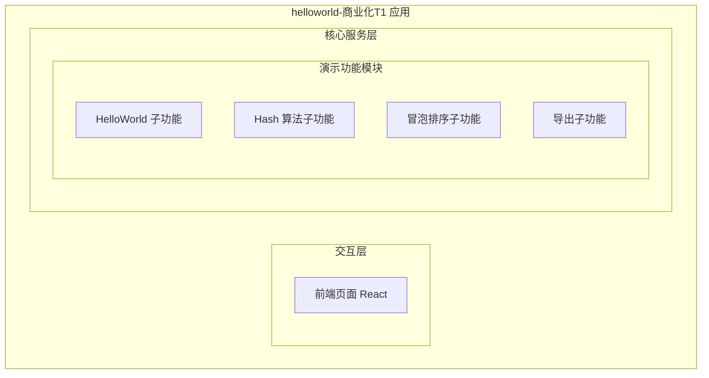
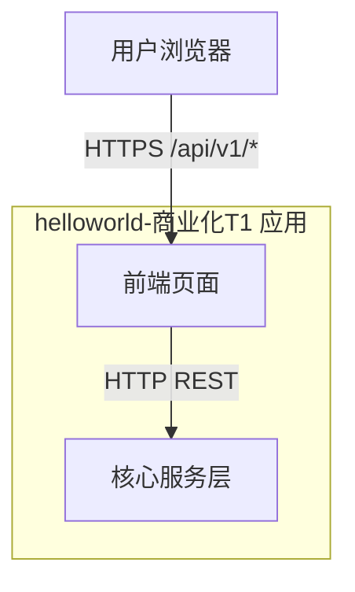
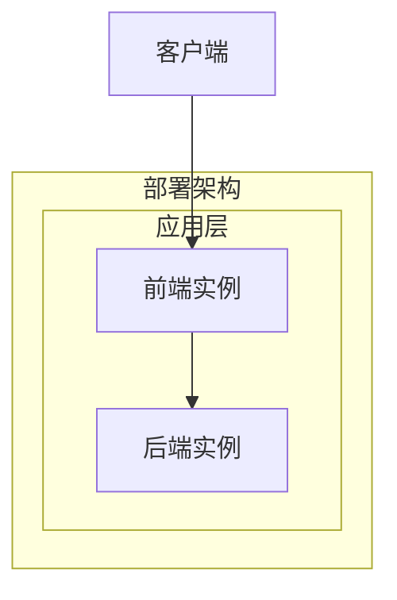
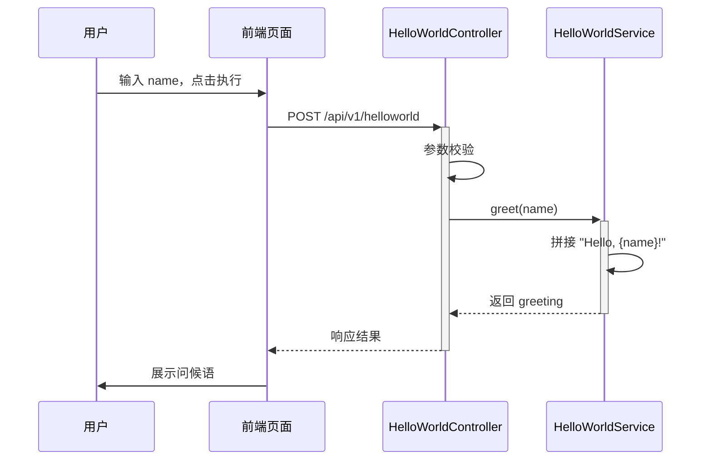
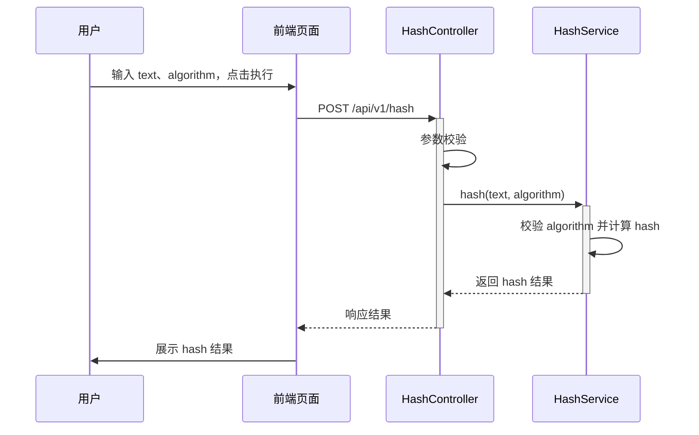
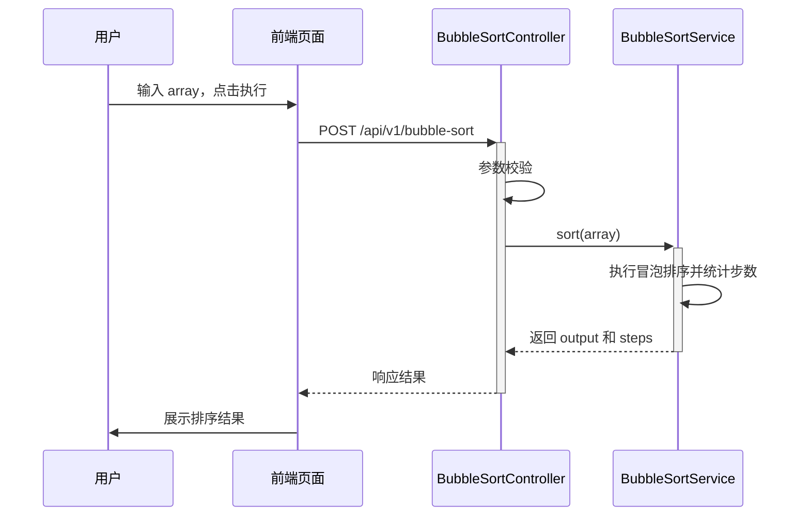
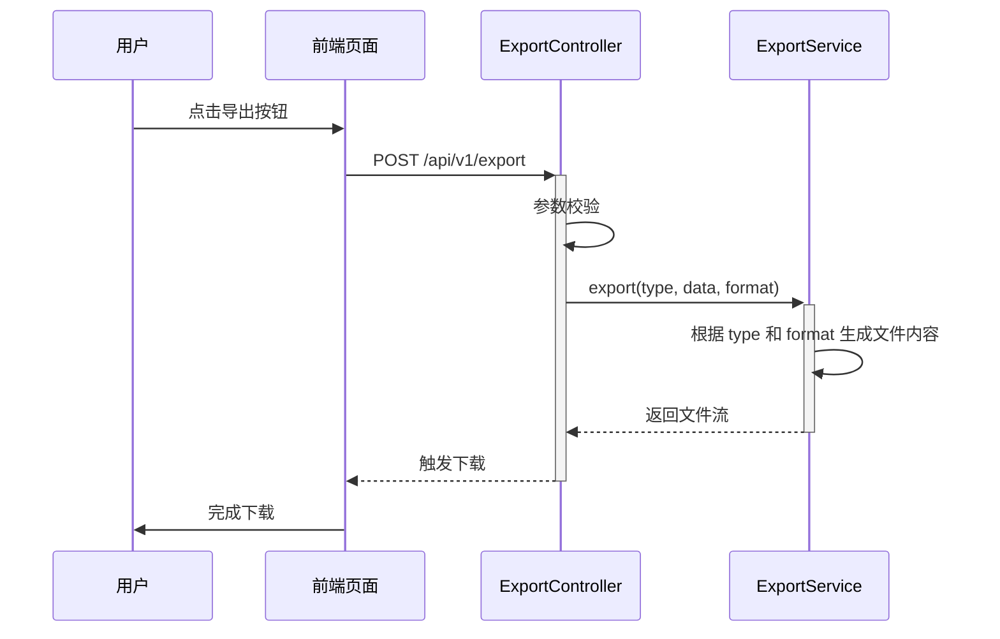

> **文档元信息**
>
> | 项目 | 内容 |
> |------|------|
> | 文档版本 | v1.0 |
> | 作者 | dtazziboot-system-analysis-design |
> | 创建日期 | 2026-08-20 |
> | 需求来源 | helloworld-商业化T1 |
> | 评审状态 | 待评审 |
> | 所属仓库 | testDj-main |

# helloworld-商业化T1 系分设计

## 1. 需求与范围

### 1.1 背景与目标

为 testDj-main 项目提供一个入门级别的商业化功能演示（T1 阶段），验证前后端基础协作能力。具体目标如下：

1. 后端提供 3 个独立接口：helloworld、哈希算法、冒泡排序。
2. 前端新增一个页面，包含 3 个 Tab，分别展示上述接口的执行结果。
3. 页面提供导出按钮，后台提供导出接口，支持导出当前 Tab 的展示结果。

### 1.2 核心功能

| 编号 | 功能点 | 说明 |
|------|--------|------|
| F01 | HelloWorld 接口 | 接收可选名称参数，返回问候语 |
| F02 | Hash 算法接口 | 接收文本与算法类型，返回哈希值 |
| F03 | 冒泡排序接口 | 接收整数数组，返回排序后数组及排序步数 |
| F04 | 前端三 Tab 页面 | HelloWorld / Hash / 冒泡排序 三标签页展示 |
| F05 | 结果导出 | 支持导出当前 Tab 展示结果 |
| F06 | 导出接口 | 后台接收页面类型与结果数据，生成导出文件 |

### 1.3 约束与非功能要求

- 本阶段为演示功能，不引入用户权限、登录鉴权。
- 不做持久化存储，结果以实时计算为准。
- 接口响应需统一包装，便于前端统一处理。
- 导出文件格式默认 `.txt`，可扩展支持 `.json`。

### 1.4 排除范围

- 不实现复杂的 UI 设计，以功能演示为主。
- 不做缓存、不做数据库持久化。
- 不做分布式部署、不做高可用专项设计。

### 1.5 需求功能清单与优先级

| 编号 | 功能点 | 优先级 | 对应原始需求 | 备注 |
|------|--------|--------|--------------|------|
| F01 | HelloWorld 接口 | P0 | 分别写三个接口 helloworld | 返回问候语 |
| F02 | Hash 算法接口 | P0 | 分别写三个接口 哈希算法 | 默认 SHA-256，可选 MD5 |
| F03 | 冒泡排序接口 | P0 | 分别写三个接口 冒泡排序 | 升序，返回步数 |
| F04 | 前端三 Tab 页面 | P0 | 前端新增一个页面，有三个 tab 分别展示 | 每个 Tab 独立输入与结果 |
| F05 | 导出按钮 | P0 | 新增导出按钮 | 导出当前激活 Tab 的结果 |
| F06 | 导出接口 | P0 | 后台提供导出接口，支持导出各个页面的展示结果 | 按页面类型生成文件 |

### 1.6 假设与待确认项

| 编号 | 假设/待确认内容 | 当前假设 | 确认状态 |
|------|-----------------|----------|----------|
| A01 | 前端框架 | React 18 + Vite | 待确认 |
| A02 | 后端框架 | Node.js + Express | 待确认 |
| A03 | 导出文件默认格式 | `.txt`，可指定 `format=json` | 待确认 |
| A04 | testDJnew-main 是否同步实现 | 当前阶段不参与实现，仅作为设计参考 | 待确认 |
| A05 | 是否对 hash 结果做缓存 | 不做缓存 | 待确认 |

## 2. 架构与模块

### 2.1 功能架构



- **交互层**：前端页面，包含三个 Tab 与导出按钮。
- **核心服务层**：演示功能模块，提供 HelloWorld、Hash、冒泡排序、导出四个子功能。

### 2.2 模块清单

| 模块 | 职责 | 依赖 |
|------|------|------|
| 演示功能模块 | 提供三个计算接口与导出能力 | 无外部依赖 |

### 2.3 应用集成架构



**集成关系说明：**

| 调用方 | 被调用方 | 协议 | 接口类型 | 说明 |
|--------|----------|------|----------|------|
| 用户浏览器 | 前端页面 | HTTPS | oneapi | 静态页面或 SSR 页面 |
| 前端页面 | 核心服务层 | HTTP | REST | /api/v1/* |

### 2.4 部署架构



**部署说明：**
- **应用层**：前端与后端均可在本地运行，也可容器化部署。
- **无数据库依赖**，无需数据层。

## 3. 数据模型与存储

### 3.1 实体清单

本需求不涉及持久化存储，无业务实体。

| 实体名称 | 实体说明 | 所属模块 | 与其他实体的关系 |
|----------|----------|----------|-----------------|
| 无 | 本项不适用，原因：需求为纯计算演示，结果实时返回，无需持久化 | - | - |

### 3.2 实体关系图

本项不适用，原因：无持久化实体。

## 4. 接口设计

### 4.1 oneapi（Web 控制台接口）

| 编号 | 接口名称 | 方法 | 路径 | 模块 |
|------|----------|------|------|------|
| W01 | HelloWorld | POST | /api/v1/helloworld | 演示功能模块 |
| W02 | Hash 计算 | POST | /api/v1/hash | 演示功能模块 |
| W03 | 冒泡排序 | POST | /api/v1/bubble-sort | 演示功能模块 |
| W04 | 结果导出 | POST | /api/v1/export | 演示功能模块 |

### 4.2 OpenAPI（对外接口）

本项不适用，原因：本阶段无外部系统对接需求。

### 4.3 内部接口（Service 层）

| 编号 | 接口名称 | 类 | 方法签名 |
|------|----------|------|----------|
| S01 | HelloWorld | HelloWorldService | greet(name?: string) |
| S02 | Hash 计算 | HashService | hash(text: string, algorithm: string) |
| S03 | 冒泡排序 | BubbleSortService | sort(input: number[]) |
| S04 | 导出 | ExportService | export(type: string, data: object, format: string) |

### 4.4 集成接口（Integration 层）

本项不适用，原因：无外部系统调用。

## 5. 功能模块设计

### 全局约定

- 统一响应结构：

| 字段 | 类型 | 说明 |
|------|------|------|
| code | int | 0 表示成功，非 0 表示错误 |
| msg | string | 提示信息 |
| data | object | 业务数据 |

- 错误码格式：`{MODULE}_{SEQ}`
- 演示功能模块：`DEMO_{SEQ}`

### 5.1 演示功能模块

#### 5.1.1 表结构设计

本模块无持久化表结构。

#### 5.1.2 枚举与常量定义

| 枚举名称 | 取值 | 含义 | 关联字段 |
|----------|------|------|----------|
| HashAlgorithm | MD5 | MD5 哈希算法 | hash.algorithm |
| HashAlgorithm | SHA-256 | SHA-256 哈希算法 | hash.algorithm |
| ExportFormat | txt | 文本导出格式 | export.format |
| ExportFormat | json | JSON 导出格式 | export.format |
| PageType | helloworld | HelloWorld 页面 | export.type |
| PageType | hash | Hash 页面 | export.type |
| PageType | bubble-sort | 冒泡排序页面 | export.type |

#### 5.1.3 接口详细设计

##### W01 HelloWorld 接口

- **URI**: `POST /api/v1/helloworld`
- **描述**: 接收可选名称参数，返回问候语。
- **入参**:

| 参数名称 | 类型 | 是否必填 | 描述 |
|----------|------|----------|------|
| name | string | 否 | 问候对象名称，默认 World |

- **出参**:

| 参数名称 | 类型 | 描述 |
|----------|------|------|
| code | int | 结果码 |
| msg | string | 提示信息 |
| data.greeting | string | 问候语 |

- **错误码**:

| 错误码 | 说明 |
|--------|------|
| DEMO_001 | 参数类型错误 |

- **业务规则**: 无复杂业务规则。

- **请求示例**:
```json
{
  "name": "World"
}
```

- **响应示例**:
```json
{
  "code": 0,
  "msg": "ok",
  "data": {
    "greeting": "Hello, World!"
  }
}
```

##### W02 Hash 算法接口

- **URI**: `POST /api/v1/hash`
- **描述**: 对输入文本进行哈希计算，支持 MD5 和 SHA-256。
- **入参**:

| 参数名称 | 类型 | 是否必填 | 描述 |
|----------|------|----------|------|
| text | string | 是 | 待计算哈希的文本 |
| algorithm | string | 否 | 算法类型，默认 SHA-256，可选 MD5 |

- **出参**:

| 参数名称 | 类型 | 描述 |
|----------|------|------|
| code | int | 结果码 |
| msg | string | 提示信息 |
| data.input | string | 原始输入文本 |
| data.algorithm | string | 实际使用的算法 |
| data.hash | string | 哈希结果 |

- **错误码**:

| 错误码 | 说明 |
|--------|------|
| DEMO_002 | 待计算文本为空 |
| DEMO_003 | 不支持的哈希算法 |

- **业务规则**: 仅支持 MD5 和 SHA-256，其他算法返回错误。

- **请求示例**:
```json
{
  "text": "hello world",
  "algorithm": "SHA-256"
}
```

- **响应示例**:
```json
{
  "code": 0,
  "msg": "ok",
  "data": {
    "input": "hello world",
    "algorithm": "SHA-256",
    "hash": "b94d27b9934d3e08a52e52d7da7dabf..."
  }
}
```

##### W03 冒泡排序接口

- **URI**: `POST /api/v1/bubble-sort`
- **描述**: 接收整数数组，执行冒泡排序并返回结果与排序步数。
- **入参**:

| 参数名称 | 类型 | 是否必填 | 描述 |
|----------|------|----------|------|
| array | int[] | 是 | 待排序整数数组 |

- **出参**:

| 参数名称 | 类型 | 描述 |
|----------|------|------|
| code | int | 结果码 |
| msg | string | 提示信息 |
| data.input | int[] | 原始数组 |
| data.output | int[] | 排序后数组 |
| data.steps | int | 排序交换步数 |

- **错误码**:

| 错误码 | 说明 |
|--------|------|
| DEMO_004 | 数组为空 |
| DEMO_005 | 数组元素非整数 |

- **业务规则**: 默认升序排列，本期不支持降序。

- **请求示例**:
```json
{
  "array": [5, 3, 8, 1, 2]
}
```

- **响应示例**:
```json
{
  "code": 0,
  "msg": "ok",
  "data": {
    "input": [5, 3, 8, 1, 2],
    "output": [1, 2, 3, 5, 8],
    "steps": 8
  }
}
```

##### W04 导出接口

- **URI**: `POST /api/v1/export`
- **描述**: 根据当前页面类型和结果数据生成导出文件。
- **入参**:

| 参数名称 | 类型 | 是否必填 | 描述 |
|----------|------|----------|------|
| type | string | 是 | 页面类型：helloworld / hash / bubble-sort |
| format | string | 否 | 导出格式：txt / json，默认 txt |
| data | object | 是 | 当前页面的展示结果数据 |

- **出参**: 直接返回文件流，响应头 `Content-Disposition: attachment; filename=result.{format}`。

- **错误码**:

| 错误码 | 说明 |
|--------|------|
| DEMO_006 | 页面类型不支持 |
| DEMO_007 | 导出格式不支持 |

- **业务规则**: 导出内容依据 type 和 format 生成对应文本或 JSON 文件。

- **请求示例**:
```json
{
  "type": "helloworld",
  "format": "txt",
  "data": {
    "greeting": "Hello, World!"
  }
}
```

- **响应**: 文件流，Content-Type 为 `text/plain` 或 `application/json`。

#### 5.1.4 子功能详细设计

##### 5.1.4.1 HelloWorld 子功能（F01）

- 处理时序图



**业务规则：**

| 规则编号 | 规则描述 | 校验时机 | 不满足时的处理 |
|----------|----------|----------|--------------|
| R01 | name 为空时使用默认值 World | 请求处理时 | 使用默认值 |

**异常场景：**

| 异常场景 | 处理方式 |
|----------|----------|
| name 非字符串 | 返回 DEMO_001 |

**并发控制：** 无并发风险，原因：无共享状态，纯计算。

##### 5.1.4.2 Hash 算法子功能（F02）

- 处理时序图



**业务规则：**

| 规则编号 | 规则描述 | 校验时机 | 不满足时的处理 |
|----------|----------|----------|--------------|
| R02 | algorithm 为空时默认 SHA-256 | 请求处理时 | 使用默认值 |
| R03 | 仅支持 MD5 和 SHA-256 | 计算前 | 返回 DEMO_003 |
| R04 | text 不能为空 | 计算前 | 返回 DEMO_002 |

**异常场景：**

| 异常场景 | 处理方式 |
|----------|----------|
| text 为空 | 返回 DEMO_002 |
| algorithm 不支持 | 返回 DEMO_003 |

**并发控制：** 无并发风险，原因：无共享状态，纯计算。

##### 5.1.4.3 冒泡排序子功能（F03）

- 处理时序图



**业务规则：**

| 规则编号 | 规则描述 | 校验时机 | 不满足时的处理 |
|----------|----------|----------|--------------|
| R05 | array 必须为非空数组 | 校验时 | 返回 DEMO_004 |
| R06 | 数组元素必须为整数 | 校验时 | 返回 DEMO_005 |
| R07 | 默认升序排列 | 排序时 | 不适用 |

**异常场景：**

| 异常场景 | 处理方式 |
|----------|----------|
| array 为空 | 返回 DEMO_004 |
| array 元素非整数 | 返回 DEMO_005 |

**并发控制：** 无并发风险，原因：无共享状态，纯计算。

##### 5.1.4.4 导出子功能（F05 / F06）

- 处理时序图



**业务规则：**

| 规则编号 | 规则描述 | 校验时机 | 不满足时的处理 |
|----------|----------|----------|--------------|
| R08 | type 仅支持 helloworld / hash / bubble-sort | 校验时 | 返回 DEMO_006 |
| R09 | format 仅支持 txt / json，默认 txt | 校验时 | 返回 DEMO_007 |
| R10 | 文件内容由 type 和 data 共同决定 | 生成时 | 不适用 |

**异常场景：**

| 异常场景 | 处理方式 |
|----------|----------|
| type 不支持 | 返回 DEMO_006 |
| format 不支持 | 返回 DEMO_007 |

**并发控制：** 无并发风险，原因：无共享状态。

#### 5.1.5 模块自检

| 检查项 | 结果 |
|--------|------|
| 功能点覆盖 | F01~F06 均已覆盖 |
| 接口一致性 | W01~W04 均有详细设计 |
| 过度设计检查 | 无，保持最小可用 |
| 依赖检查 | 无外部依赖 |

## 6. 非功能性需求设计

### 6.1 高可用性

本项不适用，原因：演示阶段为本地或单实例运行，无高可用要求。

### 6.2 可扩展性

- 接口层可横向扩展：新增算法或排序接口可按相同模式追加 Controller 和 Service。
- 导出格式可扩展：新增 format 枚举值并补充对应生成逻辑即可。

### 6.3 稳定性/可靠性

- 接口参数校验前置，避免异常输入导致服务异常。
- 导出文件大小受输入数据限制，前端可控制 data 大小。

### 6.4 安全性设计

#### 6.4.1 账户系统方案

本项不适用，原因：本阶段不做用户权限与登录鉴权。

#### 6.4.2 授权 & 访问控制

##### 6.4.2.1 是否实现水平权限检查

不涉及数据库查询、公共数据查询，无需水平权限检查。

##### 6.4.2.2 是否实现垂直权限检查

不涉及角色权限，本阶段不做。

##### 6.4.2.3 是否检查登录态

本项不适用，原因：本阶段不做登录态检查。

#### 6.4.3 数据防护方案

##### 6.4.3.1 是否对敏感数据加密存储

本项不适用，原因：无持久化存储。

##### 6.4.3.2 是否对敏感数据展示进行脱敏

本项不适用，原因：输入输出均为用户自行输入的演示数据，无敏感信息。

### 6.5 监控/统计/日志/告警

本项不适用，原因：演示阶段暂不接入监控告警，可在后续阶段按需补充接口调用日志。

## 7. 变更三板斧

### 7.1 可监控

- 接口调用埋点：记录 helloworld、hash、bubble-sort、export 接口的请求次数、耗时、成功率。
- 日志输出：请求参数、响应码、异常信息统一落日志。

### 7.2 可灰度

本项不适用，原因：演示阶段为单环境全量发布。

### 7.3 可应急

- 接口新增全局开关：在配置中心或环境变量中可关闭导出接口，防止导出功能异常影响整体。
- 回滚策略：由于无数据库变更，回滚仅需重新发布旧版本包。

## 8. 跨仓库对齐点

| 仓库 | 职责 | 产物 |
|------|------|------|
| testDj-main | 主仓库，存放设计文档，承载后端接口与前端页面 | design.md / 后端 / 前端 |
| testDJnew-main | 辅助仓库，当前阶段不参与实现 | 视后续阶段而定 |

## 9. 技术选型

| 层级 | 默认选型 | 说明 |
|------|----------|------|
| 后端框架 | Node.js + Express | 轻量、易搭建，适合 demo |
| 前端框架 | React 18 + Vite | 组件化开发，热更新快 |
| 导出文件格式 | txt / json | 默认 txt，可指定 json |

## 10. 验收标准

- [ ] 后端 `/api/v1/helloworld`、`/api/v1/hash`、`/api/v1/bubble-sort` 可用。
- [ ] 前端页面包含 3 个 Tab，分别展示对应结果。
- [ ] 导出按钮可下载当前 Tab 结果。
- [ ] 文档中所有接口均有请求/响应示例。

---

**评审记录**：
- 首次编写：2026-08-20 需求澄清阶段输出。
