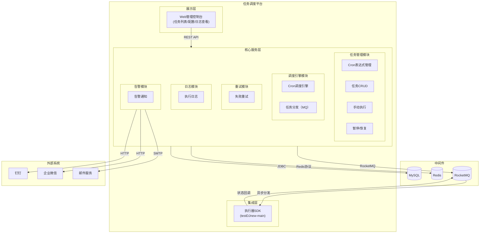
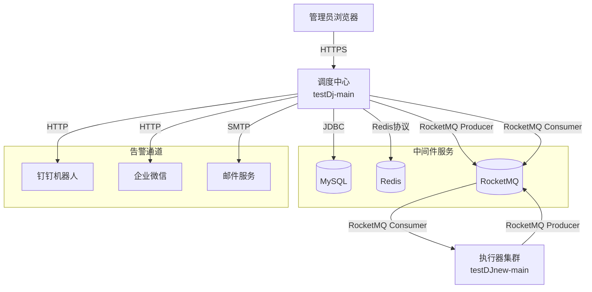
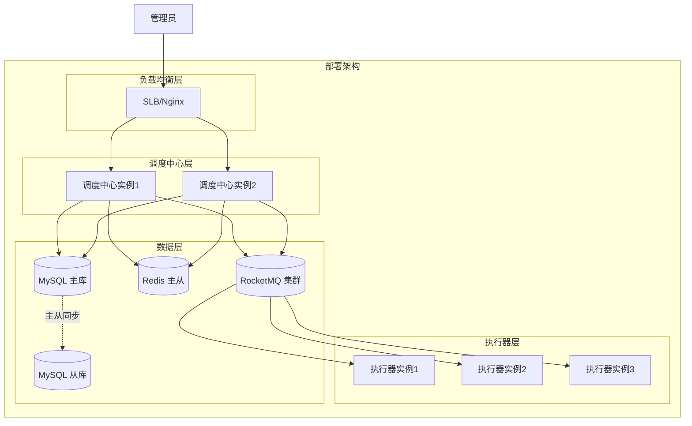
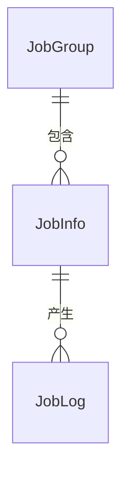
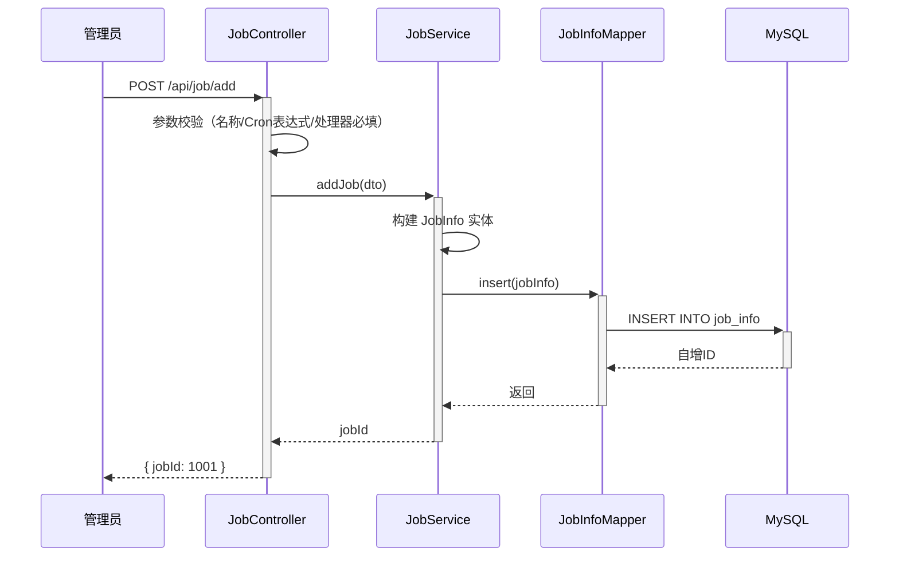
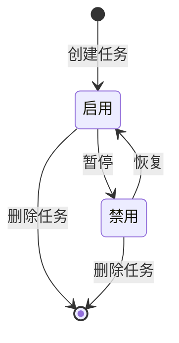
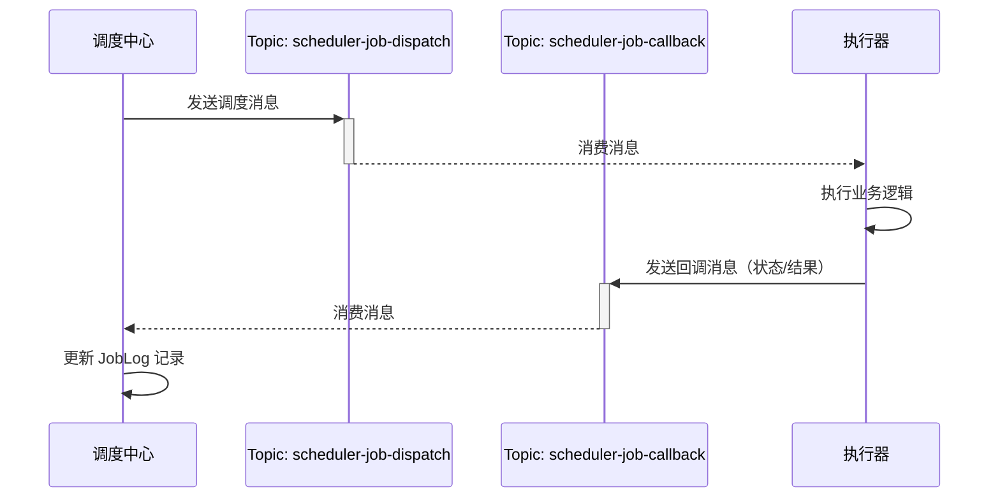
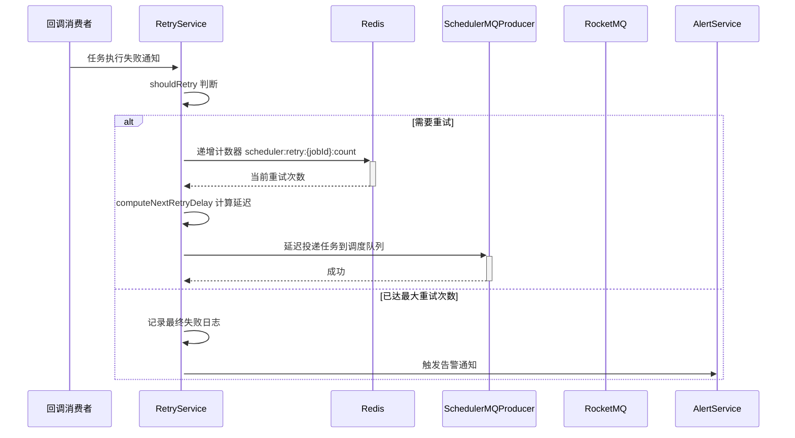
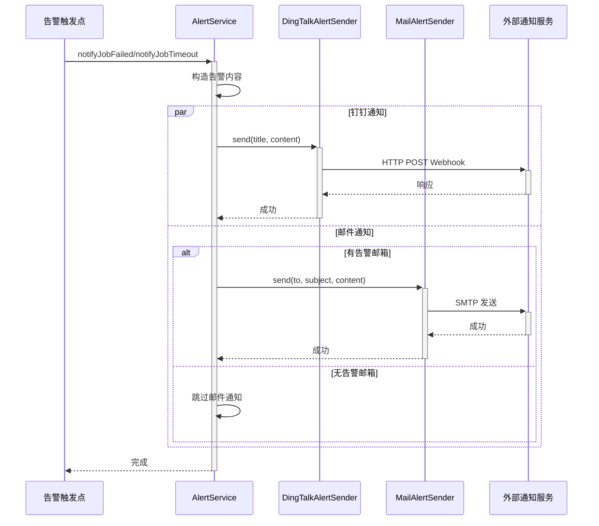
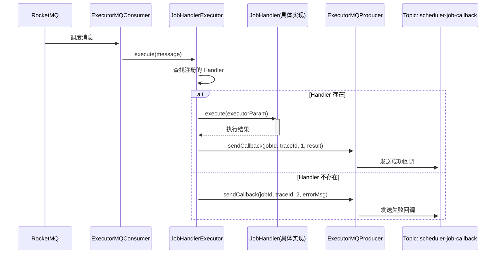

> **文档元信息**
>
> | 项目 | 内容 |
> |------|------|
> | 文档版本 | v1.0 |
> | 作者 | DTCoder |
> | 创建日期 | 2026-08-20 |
> | 需求来源 | DIMA-20260820-001 |
> | 评审状态 | 待评审 |

# 任务调度平台建设 系分设计

## 1. 需求与范围

### 背景与目标

**业务背景**：目前定时同步、数据统计、文件同步、营销活动、批处理任务全部写死在代码中，维护成本高，无法统一管理，缺少失败处理机制，难以监控和告警。

**业务目标**：构建统一的任务调度平台，将分散的调度逻辑集中管理，提供 Cron 调度、失败重试、手动执行、暂停恢复、执行日志、告警通知等核心能力，降低开发成本，提升任务可观测性和执行可靠性。

**成功标准**：
- 支持至少 1000 个定时任务的统一管理
- 任务调度延迟 ≤ 1 秒（在 Cron 精度范围内）
- 失败重试成功率 ≥ 99%（排除业务逻辑错误）
- 执行日志完整可追溯，保留至少 30 天

### 核心功能

1. **Cron 表达式支持** — 支持标准 Cron 表达式，精确到秒级/分钟级调度
2. **任务管理** — 任务的增删改查、启用/禁用、分类管理
3. **失败重试** — 任务执行失败后自动重试，可配置重试次数和间隔策略
4. **手动执行** — 支持手动触发任务立即执行，用于调试和应急
5. **暂停/恢复** — 支持暂停正在运行的任务，以及恢复已暂停的任务
6. **执行日志** — 记录每次任务执行的完整日志，包括开始时间、结束时间、状态、结果
7. **告警通知** — 任务失败/超时等异常场景下，通过邮件/钉钉/企微等方式通知

### 约束与非功能要求

- 统一 RESTful API 前缀 `/api/`
- 数据库表名采用小写蛇形命名，字段名采用小写蛇形命名
- 跨仓接口向后兼容（新增字段/接口只增不改）
- testDj-main 仓库负责调度中心核心服务；testDJnew-main 仓库负责执行器 SDK

### 排除范围

- 不包含工作流/DAG 编排（Phase 1 不涉及）
- 不包含任务分片执行（后续版本考虑）
- 不包含灰度发布策略（后续版本考虑）

### 需求功能清单与优先级

| 编号 | 功能点 | 优先级 | PRD 原始描述/章节 | 备注 |
|------|--------|--------|-------------------|------|
| F01 | Cron 表达式支持 | P0 | DIMA 1.2 需求范围-Cron 表达式支持 | 支持标准 Cron 表达式，秒级/分钟级 |
| F02 | 任务管理（增删改查） | P0 | DIMA 1.2 需求范围-任务管理 | 任务的增删改查、启用/禁用、分类管理 |
| F03 | 失败重试 | P0 | DIMA 1.2 需求范围-失败重试 | 可配置重试次数和间隔策略 |
| F04 | 手动执行 | P0 | DIMA 1.2 需求范围-手动执行 | 手动触发任务立即执行 |
| F05 | 暂停/恢复 | P0 | DIMA 1.2 需求范围-暂停/恢复 | 暂停/恢复正在运行的任务 |
| F06 | 执行日志 | P0 | DIMA 1.2 需求范围-执行日志 | 完整执行日志记录与查询 |
| F07 | 告警通知 | P1 | DIMA 1.2 需求范围-告警通知 | 邮件/钉钉/企微通知 |
| F08 | 分布式调度 | P0 | DIMA 3.2 架构设计 | 调度中心多节点 + 执行器集群 |
| F09 | 调度与执行解耦 | P0 | DIMA 3.2 MQ 设计 | 通过 MQ 异步分发任务 |
| F10 | 管理界面 | P0 | 前端需求-任务列表/配置/日志 | 前端管理界面 |

### 假设与待确认项

| 编号 | 假设/待确认内容 | 当前假设 | 确认状态 |
|------|-----------------|----------|----------|
| A01 | 消息队列选型 | 默认使用 RocketMQ | 待确认 |
| A02 | 前端技术栈 | 默认使用 Vue 3 + Element Plus | 待确认 |
| A03 | 部署环境 | 默认容器化部署，同城双机房 | 待确认 |
| A04 | 告警渠道配置 | 默认钉钉 + 邮件，企微预留扩展 | 待确认 |

## 2. 架构与模块

### 功能架构



**模块清单**

| 模块 | 职责 | 依赖 |
|------|------|------|
| 任务管理模块 | 任务 CRUD、启用/禁用、分类管理、手动执行、暂停恢复 | 数据库、Redis |
| 调度引擎模块 | Cron 表达式解析与调度、任务分发到 MQ | 数据库、Redis、MQ |
| 重试模块 | 指数退避重试策略、重试次数上限控制 | 数据库、MQ |
| 告警模块 | 钉钉/企微/邮件渠道的任务异常通知 | 外部通知API |
| 日志模块 | 执行日志记录、查询、归档 | 数据库 |
| 执行器SDK | 接收调度指令、执行业务逻辑、状态上报（testDJnew-main） | MQ |

### 应用集成架构



**集成关系说明：**

| 调用方 | 被调用方 | 协议 | 接口类型 | 说明 |
|--------|----------|------|----------|------|
| 管理员浏览器 | 调度中心 | HTTPS | REST API | 管理界面操作 |
| 调度中心 | MySQL | JDBC | SQL | 持久化任务/日志数据 |
| 调度中心 | Redis | Redis协议 | 缓存/锁 | 分布式锁、状态缓存 |
| 调度中心 | RocketMQ | MQ Producer | 异步消息 | 任务分发 |
| 执行器集群 | RocketMQ | MQ Producer | 异步消息 | 状态回调 |
| 调度中心 | 钉钉/企微/邮件 | HTTP/SMTP | API | 告警通知 |

### 部署架构



**部署说明：**
- **负载均衡层**：SLB/Nginx 分发调度中心请求，避免单点
- **调度中心层**：多节点部署，无状态设计，通过 Redis 分布式锁防止任务重复调度
- **执行器层**：水平扩展，按业务维度分组注册
- **数据层**：MySQL 主从架构 + Redis 主从 + RocketMQ 集群，消除单点故障

## 3. 数据模型与存储

### 实体清单

| 实体名称 | 实体说明 | 所属模块 | 与其他实体的关系 |
|----------|----------|----------|-----------------|
| JobInfo | 任务信息，记录任务配置和调度参数 | 任务管理模块 | 一对多关联 JobLog |
| JobLog | 执行记录，记录每次任务执行的详细信息 | 日志模块 | 多对一关联 JobInfo |
| JobGroup | 任务分组，用于任务分类管理 | 任务管理模块 | 一对多关联 JobInfo |

### 实体关系图



**模型说明：**
- JobGroup 分组下可包含多个 JobInfo 任务
- 每次任务执行产生一条 JobLog 记录
- 执行器信息通过执行器注册中心管理，以心跳方式维护，不做持久化实体

### 缓存/MQ 数据形态

| 中间件 | 用途 | 数据形态 | 说明 |
|--------|------|----------|------|
| Redis | 分布式锁 | `scheduler:lock:job:{jobId}` | 防止同一任务被多个调度器同时触发 |
| Redis | 任务状态缓存 | `scheduler:job:{jobId}:status` | 缓存任务最新状态，减少数据库查询 |
| Redis | 分布式计数器 | `scheduler:retry:{jobId}:count` | 记录重试次数 |
| RocketMQ | 任务分发 | `scheduler-job-dispatch` Topic | 调度中心投递任务指令到执行器 |
| RocketMQ | 状态回调 | `scheduler-job-callback` Topic | 执行器上报执行结果到调度中心 |

## 4. 接口设计

### 4.1 oneapi（Web 控制台接口）

| 编号 | 接口名称 | 方法 | 路径 | 模块 |
|------|----------|------|------|------|
| W01 | 新增任务 | POST | /api/job/add | 任务管理模块 |
| W02 | 更新任务 | POST | /api/job/update | 任务管理模块 |
| W03 | 删除任务 | POST | /api/job/delete | 任务管理模块 |
| W04 | 手动触发执行 | POST | /api/job/trigger | 任务管理模块 |
| W05 | 暂停任务 | POST | /api/job/pause | 任务管理模块 |
| W06 | 恢复任务 | POST | /api/job/resume | 任务管理模块 |
| W07 | 任务列表查询 | GET | /api/job/list | 任务管理模块 |
| W08 | 执行日志查询 | GET | /api/job/log/list | 日志模块 |

### 4.2 OpenAPI（对外接口）

本阶段暂不涉及对外 OpenAPI 接口。后续版本可考虑提供任务管理 OpenAPI 供外部系统集成。

### 4.3 内部接口（Service 层）

| 编号 | 接口名称 | 类 | 方法签名 |
|------|----------|------|----------|
| S01 | 新增任务 | JobService | Long addJob(JobInfoDTO jobInfoDTO) |
| S02 | 更新任务 | JobService | boolean updateJob(JobInfoDTO jobInfoDTO) |
| S03 | 删除任务 | JobService | boolean deleteJob(Long jobId) |
| S04 | 手动触发 | JobService | boolean triggerJob(Long jobId) |
| S05 | 暂停任务 | JobService | boolean pauseJob(Long jobId) |
| S06 | 恢复任务 | JobService | boolean resumeJob(Long jobId) |
| S07 | 任务列表查询 | JobService | PageResult<JobInfoDTO> listJobs(PageQuery query) |
| S08 | 执行日志查询 | JobService | PageResult<JobLog> listJobLogs(PageQuery query) |
| S09 | 计算重试延迟 | RetryService | long computeNextRetryDelay(JobInfo jobInfo, int currentRetryCount) |
| S10 | 判断是否重试 | RetryService | boolean shouldRetry(JobInfo jobInfo, int currentRetryCount) |
| S11 | 执行重试调度 | RetryService | void scheduleRetry(JobInfo jobInfo, int currentRetryCount) |
| S12 | 发送失败告警 | AlertService | void notifyJobFailed(JobInfo jobInfo, String errorMessage, int retryCount) |
| S13 | 发送超时告警 | AlertService | void notifyJobTimeout(JobInfo jobInfo, long timeoutSeconds) |

### 4.4 集成接口（Integration 层）

| 编号 | 接口名称 | 类 | 方法签名 | 说明 |
|------|----------|------|----------|------|
| I01 | 发送钉钉通知 | DingTalkAlertSender | void send(String title, String content) | 对接钉钉机器人 Webhook |
| I02 | 发送邮件通知 | MailAlertSender | void send(String to, String subject, String content) | 对接邮件 SMTP 服务 |
| I03 | 发送回调状态 | ExecutorMQProducer | void sendCallback(Long jobId, String traceId, int status, String result) | 执行器通过 MQ 回调调度中心 |
| I04 | 任务分发消费 | SchedulerMQProducer | void dispatchJob(JobInfo jobInfo, String triggerTime) | 调度中心通过 MQ 分发任务到执行器 |

## 5. 功能模块设计

### 5.1 任务管理模块

#### 5.1.1 表结构设计

##### 5.1.1.1 job_info（任务信息表）

| 字段名 | 数据类型 | 约束 | 默认值 | 说明 |
|--------|----------|------|--------|------|
| id | bigint | PK, 自增 | - | 系统自增主键 |
| job_name | varchar(128) | NOT NULL | - | 任务名称 |
| job_desc | varchar(512) | - | - | 任务描述 |
| job_group | varchar(64) | - | 'default' | 任务分组 |
| cron_expression | varchar(64) | NOT NULL | - | Cron 表达式 |
| executor_handler | varchar(128) | NOT NULL | - | 执行器处理器标识 |
| executor_param | text | - | - | 执行参数（JSON） |
| max_retry_times | int | - | 3 | 最大重试次数 |
| retry_interval | int | - | 60 | 重试间隔（秒） |
| alert_email | varchar(256) | - | - | 告警邮箱 |
| status | tinyint | - | 1 | 状态 0-禁用 1-启用 |
| gmt_create | datetime | NOT NULL | CURRENT_TIMESTAMP | 创建时间 |
| gmt_modified | datetime | NOT NULL | CURRENT_TIMESTAMP | 修改时间 |

**索引：**
- PK: `pk_job_info` (id)
- IDX: `idx_job_group` (job_group)
- IDX: `idx_status` (status)

##### 5.1.1.2 job_log（执行记录表）

| 字段名 | 数据类型 | 约束 | 默认值 | 说明 |
|--------|----------|------|--------|------|
| id | bigint | PK, 自增 | - | 系统自增主键 |
| job_id | bigint | NOT NULL | - | 任务 ID |
| trigger_time | datetime | - | - | 触发时间 |
| finish_time | datetime | - | - | 完成时间 |
| executor_address | varchar(128) | - | - | 执行器地址 |
| status | tinyint | - | 0 | 状态 0-运行中 1-成功 2-失败 3-超时 |
| result | text | - | - | 执行结果 |
| retry_times | int | - | 0 | 已重试次数 |
| gmt_create | datetime | NOT NULL | CURRENT_TIMESTAMP | 创建时间 |

**索引：**
- PK: `pk_job_log` (id)
- IDX: `idx_job_id` (job_id)
- IDX: `idx_status` (status)
- IDX: `idx_gmt_create` (gmt_create)

##### 5.1.1.3 枚举与常量定义

| 枚举名称 | 取值 | 含义 | 关联字段 |
|----------|------|------|----------|
| JobStatus | 0 | 禁用 | job_info.status |
| JobStatus | 1 | 启用 | job_info.status |
| JobLogStatus | 0 | 运行中 | job_log.status |
| JobLogStatus | 1 | 成功 | job_log.status |
| JobLogStatus | 2 | 失败 | job_log.status |
| JobLogStatus | 3 | 超时 | job_log.status |

#### 5.1.2 接口详细设计

##### W01 新增任务

- **URI**: POST /api/job/add
- **描述**: 创建新的定时任务
- **入参**:

| 参数名称 | 类型 | 是否必填 | 描述 |
|----------|------|----------|------|
| jobName | String | 是 | 任务名称 |
| jobDesc | String | 否 | 任务描述 |
| jobGroup | String | 否 | 任务分组，默认"default" |
| cronExpression | String | 是 | Cron 表达式 |
| executorHandler | String | 是 | 执行器处理器标识 |
| executorParam | String | 否 | 执行参数 JSON |
| maxRetryTimes | Integer | 否 | 最大重试次数，默认3 |
| retryInterval | Integer | 否 | 重试间隔秒数，默认60 |
| alertEmail | String | 否 | 告警邮箱 |

- **出参**:

| 参数名称 | 类型 | 描述 |
|----------|------|------|
| result | String | 结果code |
| msg | String | 提示信息 |
| data | Object | { jobId: Long } |

- **错误码**:

| 错误码 | 说明 |
|--------|------|
| JOB_MGMT_001 | 任务名称不能为空 |
| JOB_MGMT_002 | Cron 表达式不能为空 |
| JOB_MGMT_003 | 执行器处理器不能为空 |
| JOB_MGMT_004 | Cron 表达式格式不正确 |

- **业务规则**: 任务名称、Cron 表达式、执行器处理器为必填项；创建时默认启用状态
- **请求示例**:
```json
{
  "jobName": "数据同步任务",
  "jobGroup": "data-sync",
  "cronExpression": "0 0/5 * * * ?",
  "executorHandler": "dataSyncHandler",
  "executorParam": "{\"source\":\"db1\",\"target\":\"db2\"}",
  "maxRetryTimes": 3,
  "retryInterval": 60
}
```

- **响应示例**:
```json
{
  "result": "OK",
  "msg": "SUCCESS",
  "data": { "jobId": 1001 }
}
```

##### W02 更新任务

- **URI**: POST /api/job/update
- **描述**: 更新已有任务配置
- **入参**: 同 W01，额外包含 id 字段
- **出参**: { result, msg, data: { success: boolean } }
- **错误码**: 同 W01 + JOB_MGMT_005 任务不存在

##### W03 删除任务

- **URI**: POST /api/job/delete
- **描述**: 删除指定任务
- **入参**: { jobId: Long }
- **出参**: { result, msg, data: { success: boolean } }

##### W04 手动触发执行

- **URI**: POST /api/job/trigger
- **描述**: 手动触发指定任务立即执行
- **入参**: { jobId: Long }
- **出参**: { result, msg, data: { success: boolean } }

##### W05 暂停任务

- **URI**: POST /api/job/pause
- **描述**: 暂停指定任务（设置 status=0）
- **入参**: { jobId: Long }
- **出参**: { result, msg, data: { success: boolean } }

##### W06 恢复任务

- **URI**: POST /api/job/resume
- **描述**: 恢复已暂停的任务（设置 status=1）
- **入参**: { jobId: Long }
- **出参**: { result, msg, data: { success: boolean } }

##### W07 任务列表查询

- **URI**: GET /api/job/list
- **描述**: 分页查询任务列表，支持按名称/分组/状态筛选
- **入参**: { page, size, keyword, jobGroup, status }
- **出参**: { result, msg, data: { total, page, size, records: [JobInfoDTO] } }

##### W08 执行日志查询

- **URI**: GET /api/job/log/list
- **描述**: 分页查询执行日志
- **入参**: { page, size, jobId }
- **出参**: { result, msg, data: { total, page, size, records: [JobLog] } }

#### 5.1.3 子功能详细设计

##### 5.1.3.1 创建任务（F02）— 处理时序图



**业务规则：**

| 规则编号 | 规则描述 | 校验时机 | 不满足时的处理 |
|----------|----------|----------|--------------|
| R01 | 任务名称不能为空 | 创建时/更新时 | 返回 JOB_MGMT_001 |
| R02 | Cron 表达式不能为空 | 创建时/更新时 | 返回 JOB_MGMT_002 |
| R03 | 执行器处理器标识不能为空 | 创建时/更新时 | 返回 JOB_MGMT_003 |
| R04 | Cron 表达式格式校验 | 创建时/更新时 | 返回 JOB_MGMT_004 |

**异常场景：**

| 异常场景 | 处理方式 |
|----------|----------|
| 数据库写入失败 | 事务回滚，返回错误码 JOB_MGMT_500，记录错误日志 |
| 重复任务名称（同一分组下） | 不强制唯一，允许同名任务 |

**并发控制：**
- 并发场景：无，创建任务为单次写入操作
- 控制策略：无并发风险，数据库自增主键保证原子性

##### 5.1.3.2 暂停/恢复任务（F05）— 状态机设计



**状态流转规则：**

| 当前状态 | 目标状态 | 流转条件 | 前置校验 | 触发动作 |
|----------|----------|----------|----------|----------|
| 启用 | 禁用 | 管理员触发暂停 | 任务存在 | 更新 status=0，清除调度计划 |
| 禁用 | 启用 | 管理员触发恢复 | 任务存在 | 更新 status=1，重新注册调度计划 |
| 启用 | [*] | 管理员触发删除 | 任务存在 | 删除任务记录，清除调度计划 |
| 禁用 | [*] | 管理员触发删除 | 任务存在 | 删除任务记录 |

##### 5.1.3.3 手动触发执行（F04）— 处理时序图

```mermaid
sequenceDiagram
    participant U as 管理员
    participant Ctrl as JobController
    participant Svc as JobService
    participant MQProducer as SchedulerMQProducer
    participant MQ as RocketMQ
    participant Executor as 执行器

    U->>+Ctrl: POST /api/job/trigger
    Ctrl->>+Svc: triggerJob(jobId)
    Svc->>Svc: 查询任务信息
    Svc->>+MQProducer: dispatchJob(jobInfo, triggerTime)
    MQProducer->>+MQ: 发送消息到 scheduler-job-dispatch
    MQ-->>-MQProducer: 确认
    MQProducer-->>-Svc: 成功
    Svc-->>-Ctrl: true
    Ctrl-->>-U: { success: true }
    MQ-->>-Executor: 消费消息，执行任务
```

**业务规则：**

| 规则编号 | 规则描述 | 校验时机 | 不满足时的处理 |
|----------|----------|----------|--------------|
| R05 | 任务必须存在 | 触发时 | 返回 JOB_MGMT_005 |
| R06 | 任务必须为启用状态 | 触发时 | 返回 JOB_MGMT_006 任务已禁用 |

**异常场景：**

| 异常场景 | 处理方式 |
|----------|----------|
| MQ 发送失败 | 重试3次，全部失败则记录错误日志，返回错误码 JOB_MGMT_501 |
| 任务不存在 | 返回错误码 JOB_MGMT_005 |

### 5.2 调度引擎模块

#### 5.2.1 表结构设计

本模块无独立表，复用 job_info 表的 cron_expression 和 status 字段。

#### 5.2.2 接口详细设计

##### 5.2.2.1 内部接口

**S09 调度任务分发**
- **类**: SchedulerMQProducer
- **方法**: void dispatchJob(JobInfo jobInfo, String triggerTime)
- **描述**: 将任务分发消息发送到 RocketMQ `scheduler-job-dispatch` Topic

**I03 任务分发消费（执行器端）**
- **类**: ExecutorMQConsumer
- **描述**: 调度中心将任务投递到 MQ，执行器消费执行

#### 5.2.3 子功能详细设计

##### 5.2.3.1 Cron 调度引擎（F01）

```mermaid
sequenceDiagram
    participant Quartz as Quartz调度器
    participant Svc as ScheduleService
    participant Redis as Redis
    participant MQProducer as SchedulerMQProducer
    participant MQ as RocketMQ
    participant Executor as 执行器

    Quartz->>+Svc: Cron触发
    Svc->>+Redis: 尝试获取分布式锁
    Redis-->>-Svc: 获取锁成功
    Svc->>Svc: 查询任务信息（校验是否启用）
    Svc->>+MQProducer: dispatchJob(jobInfo, triggerTime)
    MQProducer->>+MQ: 发送消息到 scheduler-job-dispatch
    MQ-->>-MQProducer: 确认
    MQProducer-->>-Svc: 成功
    Svc->>Redis: 释放锁
    MQ-->>-Executor: 消费消息，执行任务
```

**业务规则：**

| 规则编号 | 规则描述 | 校验时机 | 不满足时的处理 |
|----------|----------|----------|--------------|
| R07 | 分布式锁防止重复调度 | 每次调度触发时 | 获取锁失败则跳过本次调度 |
| R08 | 仅调度启用状态的任务 | 调度触发时 | 禁用状态任务跳过调度 |
| R09 | 调度延迟 ≤ 1秒 | 调度触发时 | 记录延迟告警 |

**异常场景：**

| 异常场景 | 处理方式 |
|----------|----------|
| Quartz 调度器宕机 | 多节点部署，故障转移后自动恢复调度 |
| Redis 不可用 | 降级为无锁模式，记录告警，容忍极低概率的重复调度 |
| MQ 发送失败 | 重试3次，失败后记录错误日志，保留重试能力 |

**并发控制：**
- 并发场景：同一任务在多个调度节点同时触发
- 控制策略：Redis 分布式锁 `scheduler:lock:job:{jobId}`，TTL 设为 60 秒，防止死锁

**技术选型方案对比：**

| 方案 | 优势 | 劣势 | 推荐度 |
|------|------|------|--------|
| **Quartz Scheduler** | 成熟稳定，与 Spring 深度集成，持久的 job store | 需自行管理调度器生命周期 | ⭐⭐⭐⭐⭐ |
| **XXL-JOB 内置调度** | 开箱即用，自带管理界面 | 调度中心强依赖 | ⭐⭐⭐⭐ |
| **自研 Cron 解析 + 定时线程池** | 无外部依赖，高度定制 | 开发成本高，缺少持久化/恢复能力 | ⭐⭐⭐ |

**推荐方案：Quartz Scheduler**（内嵌于调度中心应用，通过 MQ 分发任务）

##### 5.2.3.2 MQ 任务分发与回调（F09）



**MQ 消息契约：**

**调度消息（scheduler-job-dispatch）：**

| 字段 | 类型 | 说明 |
|------|------|------|
| jobId | Long | 任务ID |
| jobHandler | String | 执行器处理器标识 |
| executorParam | String | 执行参数 JSON |
| triggerTime | String | 触发时间 |
| traceId | String | 链路追踪 ID |

**回调消息（scheduler-job-callback）：**

| 字段 | 类型 | 说明 |
|------|------|------|
| jobId | Long | 任务ID |
| traceId | String | 链路追踪 ID |
| status | Integer | 执行状态 1-成功 2-失败 |
| result | String | 执行结果信息 |
| finishTime | DateTime | 完成时间 |

**业务规则：**

| 规则编号 | 规则描述 | 校验时机 | 不满足时的处理 |
|----------|----------|----------|--------------|
| R10 | 消息必须至少消费一次 | 发送时 | 设置 MQ 重试机制 |
| R11 | 回调消息必须包含完整 traceId | 消费时 | 记录错误日志，丢弃消息 |

**异常场景：**

| 异常场景 | 处理方式 |
|----------|----------|
| MQ 消息积压 | 水平扩展执行器实例提升消费能力 |
| 消费失败 | 设置 MQ 重试队列，最大重试3次，超过则进入死信队列 |
| 回调消息丢失 | 调度中心定时扫描未完成的任务记录，触发补偿查询 |

### 5.3 重试模块

#### 5.3.1 表结构设计

本模块无独立表，复用 job_info 表的 max_retry_times、retry_interval 字段和 job_log 表的 retry_times 字段。

#### 5.3.2 接口详细设计

##### S09 计算重试延迟

- **类**: RetryService
- **方法**: long computeNextRetryDelay(JobInfo jobInfo, int currentRetryCount)
- **描述**: 采用指数退避策略计算下次重试延迟时间，公式: baseInterval * (2 ^ retryCount)，上限 1 小时

##### S10 判断是否重试

- **类**: RetryService
- **方法**: boolean shouldRetry(JobInfo jobInfo, int currentRetryCount)
- **描述**: 判断当前重试次数是否小于最大重试次数

##### S11 执行重试调度

- **类**: RetryService
- **方法**: void scheduleRetry(JobInfo jobInfo, int currentRetryCount)
- **描述**: 根据重试策略，延迟后重新投递任务到 MQ 分发队列

#### 5.3.3 子功能详细设计

##### 5.3.3.1 失败重试机制（F03）



**业务规则：**

| 规则编号 | 规则描述 | 校验时机 | 不满足时的处理 |
|----------|----------|----------|--------------|
| R12 | 重试次数不超过 maxRetryTimes | 每次重试前 | 记录最终失败，触发告警 |
| R13 | 指数退避延迟计算 | 重试调度时 | 公式：baseInterval * 2^retryCount，上限3600秒 |
| R14 | 重试计数使用 Redis 原子递增 | 重试时 | 防止并发下的计数错误 |

**异常场景：**

| 异常场景 | 处理方式 |
|----------|----------|
| Redis 不可用导致计数器失败 | 降级为数据库计数，记录告警 |
| 重试消息投递失败 | 记录日志，3秒后重试投递，最大重试3次 |
| 任务在重试队列中被删除 | 调度前校验任务状态，已删除则取消重试 |

**并发控制：**
- 并发场景：同一任务执行失败的多个回调同时触发重试
- 控制策略：Redis INCR 原子操作保证计数器准确性

**技术选型方案对比：**

| 方案 | 优势 | 劣势 | 推荐度 |
|------|------|------|--------|
| **Redis 延迟队列** | 延迟精度高，支持 TTL 自动过期 | 需要额外维护，Redis 内存占用 | ⭐⭐⭐⭐⭐ |
| **MQ 延迟消息** | RocketMQ 原生支持延迟消息 | 延迟等级固定（18个等级） | ⭐⭐⭐⭐ |
| **数据库轮询** | 实现简单，不依赖额外组件 | 轮询间隔无法精确，数据库压力大 | ⭐⭐⭐ |

**推荐方案：MQ 延迟消息 + Redis 计数器**（RocketMQ 原生延迟消息投递，Redis 维护重试次数）

### 5.4 告警模块

#### 5.4.1 表结构设计

本模块无独立表，复用 job_info 表的 alert_email 字段。

#### 5.4.2 接口详细设计

##### S12 发送失败告警

- **类**: AlertService
- **方法**: void notifyJobFailed(JobInfo jobInfo, String errorMessage, int retryCount)
- **描述**: 任务执行失败后发送告警通知（钉钉+邮件）

##### S13 发送超时告警

- **类**: AlertService
- **方法**: void notifyJobTimeout(JobInfo jobInfo, long timeoutSeconds)
- **描述**: 任务执行超时后发送告警通知（钉钉）

##### I01 发送钉钉通知

- **类**: DingTalkAlertSender
- **方法**: void send(String title, String content)
- **描述**: 通过钉钉机器人 Webhook 发送通知

##### I02 发送邮件通知

- **类**: MailAlertSender
- **方法**: void send(String to, String subject, String content)
- **描述**: 通过 SMTP 邮件服务发送通知

#### 5.4.3 子功能详细设计

##### 5.4.3.1 告警发送（F07）



**业务规则：**

| 规则编号 | 规则描述 | 校验时机 | 不满足时的处理 |
|----------|----------|----------|--------------|
| R15 | 钉钉 Webhook 未配置时跳过钉钉通知 | 发送时 | 记录 WARN 日志，继续其他渠道 |
| R16 | 邮件服务未配置时跳过邮件通知 | 发送时 | 记录 WARN 日志，继续其他渠道 |
| R17 | 告警内容包含任务名称、ID、Cron、错误信息 | 发送时 | 必填信息缺失则补充默认值 |

**异常场景：**

| 异常场景 | 处理方式 |
|----------|----------|
| 钉钉 Webhook 调用失败 | 记录错误日志，不影响主流程 |
| 邮件发送失败 | 记录错误日志，不影响主流程 |
| 所有告警渠道均失败 | 记录严重告警日志，留待人工排查 |

**技术选型方案对比：**

| 方案 | 优势 | 劣势 | 推荐度 |
|------|------|------|--------|
| **钉钉机器人 + 邮件** | 覆盖常见通知场景，配置简单 | 企微需额外配置 | ⭐⭐⭐⭐⭐ |
| **企业微信机器人** | 企业内部使用广泛 | 需额外维护 Webhook 配置 | ⭐⭐⭐⭐ |
| **短信通知** | 实时性最高 | 成本高，仅用于 P0 告警 | ⭐⭐⭐ |

**推荐方案：钉钉机器人 + 邮件双通道**（默认同时发送，企微作为扩展预留）

### 5.5 日志模块

#### 5.5.1 表结构设计

本模块复用 job_log 表（详见 5.1.1.2 节）。

#### 5.5.2 接口详细设计

##### S08 执行日志查询

- **类**: JobService
- **方法**: PageResult<JobLog> listJobLogs(PageQuery query)
- **描述**: 分页查询执行日志，支持按 jobId 筛选

#### 5.5.3 子功能详细设计

##### 5.5.3.1 执行日志记录与查询（F06）

**业务规则：**

| 规则编号 | 规则描述 | 校验时机 | 不满足时的处理 |
|----------|----------|----------|--------------|
| R18 | 每次任务执行生成一条 JobLog 记录 | 调度触发时 | 创建初始记录，状态为"运行中" |
| R19 | 执行完成/失败后更新对应 JobLog | 回调消费时 | 更新状态、结果、完成时间 |
| R20 | 日志保留至少 30 天 | 定时清理 | 超过 30 天的日志归档或删除 |

**异常场景：**

| 异常场景 | 处理方式 |
|----------|----------|
| 日志写入数据库失败 | 记录本地日志，不影响任务执行主流程 |
| 日志查询超时 | 限制查询条件，避免全表扫描，使用索引优化 |
| 日志数据量超过 500 万行 | 按 gmt_create 分表或迁移到 ES |

**日志归档策略：**
- 默认保留最近 30 天日志
- 超过 30 天的日志按月份归档到历史表或迁移到 ES
- 提供手动清理接口，支持按时间范围删除

### 5.6 执行器SDK模块（testDJnew-main）

#### 5.6.1 表结构设计

本模块无独立数据库表，所有状态通过 MQ 回调上报。

#### 5.6.2 接口详细设计

##### 执行器处理器接口

- **接口**: JobHandler
- **方法**: String execute(String executorParam) throws Exception
- **方法**: String getHandlerName()

##### 执行器执行引擎

- **类**: JobHandlerExecutor
- **方法**: void registerHandler(JobHandler handler)
- **方法**: void execute(JobDispatchMessage message)

#### 5.6.3 子功能详细设计

##### 5.6.3.1 执行器执行引擎（F08）



**业务规则：**

| 规则编号 | 规则描述 | 校验时机 | 不满足时的处理 |
|----------|----------|----------|--------------|
| R21 | 执行器启动时自动注册所有 Handler | 启动时 | 扫描 @Component 标注的 Handler |
| R22 | 未找到对应 Handler 时返回失败回调 | 执行时 | 发送 status=2 回调，错误信息="No handler found" |
| R23 | Handler 执行异常时捕获并返回失败回调 | 执行时 | 发送 status=2 回调，包含异常信息 |
| R24 | 心跳保活维持执行器注册状态 | 定时 | 30 秒发送一次心跳 |

**异常场景：**

| 异常场景 | 处理方式 |
|----------|----------|
| Handler 执行超时 | 设置执行超时时间，超时后中断执行并上报失败 |
| MQ 回调发送失败 | 重试3次，失败后记录本地日志 |
| 执行器宕机 | 调度中心通过心跳超时感知，标记执行器下线 |

**并发控制：**
- 并发场景：多个任务同时调度到同一个执行器
- 控制策略：线程池隔离，每个 Handler 使用独立线程池，避免相互影响

## 6. 非功能性需求设计

### 6.1 高可用性

| 维度 | 设计策略 |
|------|----------|
| 调度中心 | 多节点部署（≥2），无状态设计，通过 SLB/Nginx 负载均衡 |
| 执行器 | 多实例水平扩展，按业务分组注册，通过心跳维持在线状态 |
| 数据库 | MySQL 主从架构，主库写入，从库查询，自动故障切换 |
| Redis | Redis 主从/哨兵模式，提供分布式锁和缓存 |
| RocketMQ | RocketMQ 集群部署，Broker 多副本，Namesrv 多节点 |
| 降级策略 | Redis 不可用时降级为无锁模式；MQ 不可用时任务暂存本地队列，恢复后重投 |

**第三方异常降级方案：**
- 钉钉/邮件等告警渠道不可用时，不影响调度主流程，仅记录告警失败日志
- MQ 不可用时，调度中心将任务暂存本地内存队列，MQ 恢复后批量投递

### 6.2 可扩展性

| 维度 | 设计策略 |
|------|----------|
| 调度中心 | 水平扩展：增加调度中心实例即可提升调度能力，无状态设计 |
| 执行器 | 水平扩展：增加执行器实例即可提升处理能力，通过分组注册自动发现 |
| 任务数量 | 支持 1000+ 任务，Quartz 调度器在合理配置下可支持数千任务 |
| 插件式 Handler | 执行器 SDK 通过 Handler 注册机制，支持业务方按需扩展 |

### 6.3 稳定性/可靠性

| 维度 | 设计策略 |
|------|----------|
| 任务防重复 | Redis 分布式锁确保同一任务在多个调度节点中仅被调度一次 |
| 超时控制 | 任务执行设超时时间，超时自动中断并上报失败 |
| 线程池隔离 | 不同 Handler 使用独立线程池，避免任务间相互影响 |
| 幂等设计 | MQ 消费者实现幂等，避免重复消费导致数据异常 |

### 6.4 安全性设计

#### 6.4.1 账户系统方案
本项不适用，原因：任务调度平台为内部管理平台，第一阶段不涉及独立账户系统，可复用企业统一登录（如 LDAP/OAuth），具体方案待后续安全评审。

#### 6.4.2 授权 & 访问控制

##### 6.4.2.1 是否实现水平权限检查
本项不适用，原因：第一阶段任务调度为内部管理平台，所有管理员可见所有任务，不涉及租户级数据隔离。

##### 6.4.2.2 是否实现垂直权限检查
**假设**：第一阶段不区分管理员/普通用户角色，所有操作接口对内部用户开放。后续版本可引入角色权限管理（admin/operator/viewer）。

##### 6.4.2.3 是否检查登录态
**假设**：管理界面通过企业统一登录认证，API 接口通过统一拦截器校验登录态。具体方案待后续对接企业认证系统时确定。

#### 6.4.3 数据防护方案

##### 6.4.3.1 是否对敏感数据加密存储
**假设**：executor_param（执行参数 JSON）可能包含敏感配置信息，建议加密存储。具体加密方案待安全评审确认。

##### 6.4.3.2 是否对敏感数据展示进行脱敏
- 日志打印：避免打印完整 executor_param，可打印脱敏后的参数摘要
- 告警内容：告警信息中不包含敏感参数内容

### 6.5 监控/统计/日志/告警

| 监控维度 | 监控指标 | 采集方式 | 告警阈值 |
|----------|----------|----------|----------|
| 调度延迟 | 调度触发时间 - Cron 期望时间 | 埋点采集 | > 1 秒 |
| 任务执行成功率 | 成功次数 / 总执行次数 | 数据库统计 | < 95% |
| 执行器心跳 | 执行器最后心跳时间 | Redis 缓存 | 心跳超时 30 秒 |
| MQ 消息积压 | 消息队列堆积数量 | RocketMQ 监控 | > 1000 |
| 数据库连接池 | 活跃连接数 / 最大连接数 | 应用监控 | > 80% |

## 7. 变更三板斧

### 7.1 可监控

| 埋点位置 | 埋点内容 | 采集方式 |
|----------|----------|----------|
| 调度触发 | 任务ID、触发时间、调度节点 | 日志 + Metrics |
| 任务分发 | 任务ID、MQ 发送状态、耗时 | 日志 + Metrics |
| 任务执行 | 任务ID、执行器地址、开始时间、结束时间、状态 | MQ 回调 + 数据库 |
| 重试操作 | 任务ID、重试次数、延迟时间 | 日志 + Metrics |
| 告警发送 | 告警渠道、发送状态、耗时 | 日志 + Metrics |
| 数据库操作 | SQL 执行耗时 | 数据库连接池监控 |
| Redis 操作 | 缓存命中率、操作耗时 | Redis 监控 |

### 7.2 可灰度

**灰度策略**：本项不适用，原因：任务调度平台为内部管理平台，非面向用户的业务系统。灰度策略主要体现在：
- 新功能通过 feature flag 控制打开
- 执行器分组分批升级，确保调度兼容性

**假设**：后续版本如需对接外部业务系统，可考虑按租户尾号灰度引流。

### 7.3 可应急

| 应急场景 | 应急方案 | 回滚影响 |
|----------|----------|----------|
| 调度中心发布故障 | 回滚至上一版本，多节点灰度发布 | 发布期间调度停止，任务积压，恢复后自动补偿 |
| 执行器版本兼容 | 执行器 SDK 保持向后兼容，新增字段只增不改 | 不影响存量任务 |
| 数据库表变更 | 新增字段必须设置默认值，禁止删除/修改已有字段 | 新旧版本均可运行 |
| MQ 消息格式变更 | 新增字段，消费者端兼容新旧格式 | 消息不丢失 |
| 功能异常 | 通过配置开关切换回旧逻辑 | 需在发布前预留开关 |

**回滚依赖关系**：
- 调度中心回滚 → 需确保回滚版本兼容当前数据库 schema
- 执行器回滚 → 需确保回滚版本兼容当前 MQ 消息格式
- 数据库回滚 → 禁止删除字段，仅通过新增字段方式实现变更