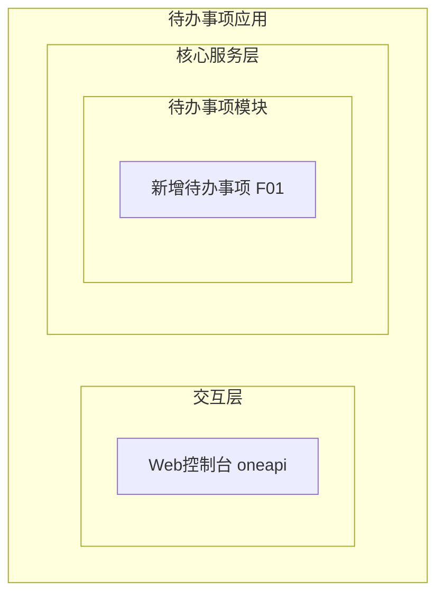
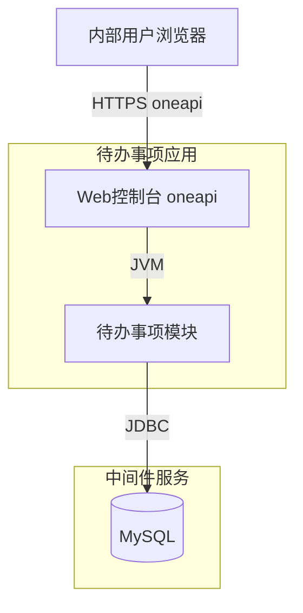
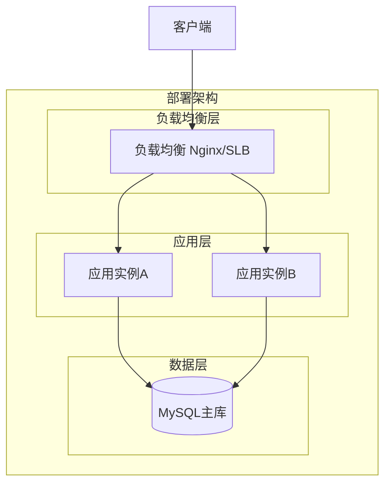
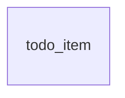
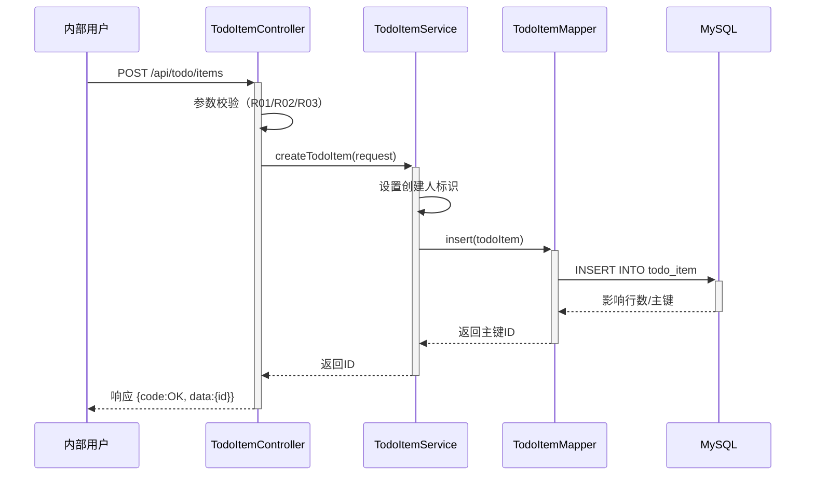

> **文档元信息**
>
> | 项目 | 内容 |
> |------|------|
> | 文档版本 | v1.0 |
> | 作者 | AiWork |
> | 创建日期 | 2026-08-31 |
> | 需求来源 | 任务输入：帮助用户记录日常待办事项（核心功能：新增待办事项） |
> | 评审状态 | 待评审 |

# 待办事项（新增）系分设计

## 1. 需求与范围

- 背景与目标：内部用户需要一个轻量工具来记录日常待办事项，以便跟踪和管理个人工作。本期目标为最小闭环：仅支持「新增待办事项」这一核心功能，后续可在此基础上迭代（查询、完成、删除等）。
- 核心功能：新增待办事项——用户录入事项名称和描述，系统持久化保存。
- 约束与非功能要求：目标用户为内部用户；最小闭环仅创建；事项信息字段为事项名称、描述；数据持久化，创建后不丢失。
- 排除范围：待办事项的查询/列表展示、编辑、删除、状态流转（待办→完成）、用户认证与权限体系、分类/标签/优先级、提醒/通知。

### 需求功能清单与优先级

| 编号 | 功能点 | 优先级 | PRD 原始描述/章节 | 备注 |
|------|--------|--------|-------------------|------|
| F01 | 新增待办事项 | P0 | "核心功能：新增待办事项" | 录入事项名称+描述并持久化 |

### 假设与待确认项

| 编号 | 假设/待确认内容 | 当前假设 | 确认状态 |
|------|-----------------|----------|----------|
| A01 | 内部用户身份标识来源 | 假设：通过请求上下文/网关透传获取操作人标识（用户ID/工号），写入 creator 字段；本期不实现独立登录 | 待确认 |
| A02 | 事项名称是否必填 | 假设：名称必填（1~100字符），描述选填（最长500字符） | 待确认 |
| A03 | 创建后是否需返回事项ID | 假设：返回创建后的事项ID，便于后续迭代引用 | 待确认 |
| A04 | 技术栈选型 | 假设：Spring Boot 3 + MySQL，组织主流内部应用技术栈 | 待确认 |

## 2. 架构与模块

### 架构选型

| 方案 | 说明 | 优点 | 缺点 |
|------|------|------|------|
| A：单体三层（推荐） | Controller–Service–Repository，单服务 | 简单清晰，开发/部署成本低，符合最小闭环 | 扩展性有限（本期足够） |
| B：DDD 六边形 | 领域层+应用层+基础设施层 | 扩展性强，复杂业务适配好 | 过度设计，本期仅一个创建功能 |
| C：Serverless | 函数计算+托管DB | 免运维 | 内部应用不适用，冷启动/调试成本高 |

**推荐方案A**，理由：本期为最小闭环（仅创建），单体三层架构足以支撑，避免过度设计。

### 功能架构



- 交互层说明：内部用户通过 Web 控制台调用 oneapi REST 接口。
- 核心服务层说明：待办事项模块负责待办事项的创建与持久化。
- 扩展/集成层说明：本期无外部系统集成，不适用。

**模块清单**

| 模块 | 职责 | 依赖 |
|------|------|------|
| 待办事项模块 | 待办事项的创建与持久化 | MySQL |

### 应用集成架构



**集成关系说明：**

| 调用方 | 被调用方 | 协议 | 接口类型 | 说明 |
|--------|----------|------|----------|------|
| 内部用户浏览器 | 应用 Web控制台 | HTTPS | oneapi REST | 创建待办事项 |
| 应用核心服务层 | MySQL | JDBC | SQL | 待办事项持久化 |

### 部署架构



**部署说明：**
- **负载均衡层**：Nginx/SLB，内部轻量流量。
- **应用层**：多实例无状态部署，支持水平扩展。
- **数据层**：MySQL 单主库，本期数据量小，后续可主从分离。

## 3. 数据模型与存储

### 实体清单

| 实体名称 | 实体说明 | 所属模块 | 与其他实体的关系 |
|----------|----------|----------|-----------------|
| todo_item | 待办事项，记录用户录入的事项名称与描述 | 待办事项模块 | 无关联实体（最小闭环仅创建） |

### 实体关系图



本期仅一个实体，无实体间关系。

**模型说明：**
- 本期为最小闭环（仅创建），仅包含待办事项实体，无关联关系。
- 后续迭代（查询、状态流转、分类）可能引入更多实体与关系，本期不展开。
- 租户隔离：默认采用 creator 字段标识数据归属，当前无独立租户体系，creator 兼作数据归属标识（假设：内部用户场景）。
- 无缓存/MQ 需求。

## 4. 接口设计

### 4.1 oneapi（Web 控制台接口）

| 编号 | 接口名称 | 方法 | 路径 | 模块 |
|------|----------|------|------|------|
| W01 | 新增待办事项 | POST | /api/todo/items | 待办事项模块 |

### 4.2 OpenAPI（对外接口）

本项不适用，原因：目标用户为内部用户，无对外接口需求。

### 4.3 内部接口（Service 层）

| 编号 | 接口名称 | 类 | 方法签名 |
|------|----------|------|----------|
| S01 | 创建待办事项 | TodoItemService | createTodoItem(TodoItemCreateRequest request): Long |

### 4.4 集成接口（Integration 层）

本项不适用，原因：本期无外部系统集成。

## 5. 功能模块设计

### 5.1 待办事项模块

#### 5.1.1 表结构设计

##### 5.1.1.1 todo_item（待办事项表）

| 字段名 | 数据类型 | 约束 | 默认值 | 说明 |
|--------|----------|------|--------|------|
| id | bigint | PK, 自增 | - | 系统自增主键 |
| title | varchar(100) | NOT NULL | - | 待办事项名称 |
| description | varchar(500) | NULL | NULL | 待办事项描述 |
| creator | varchar(64) | NOT NULL | - | 创建人标识（用户ID/工号） |
| gmt_create | datetime | NOT NULL | CURRENT_TIMESTAMP | 创建时间 |
| gmt_modified | datetime | NOT NULL | CURRENT_TIMESTAMP | 修改时间 |

**索引：**
- PK: `pk_todo_item` (id)
- IDX: `idx_todo_item_creator` (creator)

##### 5.1.1.2 枚举与常量定义

本模块无枚举/常量定义，原因：最小闭环仅创建，无状态字段、无分类/类型字段。

#### 5.1.2 接口详细设计

##### W01 新增待办事项

- **URI**: POST /api/todo/items
- **描述**: 创建一条待办事项，持久化保存
- **入参**:

| 参数名称 | 类型 | 是否必填 | 描述 |
|----------|------|----------|------|
| title | String | 是 | 待办事项名称，1~100字符 |
| description | String | 否 | 待办事项描述，最长500字符 |

- **出参**:

| 参数名称 | 类型 | 描述 |
|----------|------|------|
| code | String | 结果code，OK 表示成功 |
| msg | String | 提示信息 |
| data | Object | 业务数据 |
| data.id | Long | 创建成功的待办事项ID |

- **错误码**:

| 错误码 | 说明 |
|--------|------|
| TODO_001 | 事项名称为空 |
| TODO_002 | 事项名称超过100字符 |
| TODO_003 | 事项描述超过500字符 |
| TODO_999 | 系统异常 |

- **业务规则**: 见 5.1.3.1 业务规则表

- **请求示例**:
```json
{
  "title": "完成季度汇报材料",
  "description": "整理Q3数据并准备PPT"
}
```

- **响应示例**:
```json
{
  "code": "OK",
  "msg": "SUCCESS",
  "data": {
    "id": 1001
  }
}
```

#### 5.1.3 子功能详细设计

##### 5.1.3.1 新增待办事项（F01）

- 处理时序图


**业务规则：**

| 规则编号 | 规则描述 | 校验时机 | 不满足时的处理 |
|----------|----------|----------|--------------|
| R01 | 事项名称（title）不可为空 | 创建时（Controller 入参校验） | 返回 TODO_001，提示"事项名称不能为空" |
| R02 | 事项名称长度 1~100 字符 | 创建时 | 返回 TODO_002，提示"事项名称长度需在1~100字符" |
| R03 | 事项描述长度不超过 500 字符 | 创建时 | 返回 TODO_003，提示"事项描述长度不超过500字符" |
| R04 | 创建人标识（creator）不可为空 | 创建时（Service 层从请求上下文获取） | 假设：内部用户场景，若获取不到则返回 TODO_999，提示"无法获取操作人信息" |

**异常场景：**

| 异常场景 | 处理方式 |
|----------|----------|
| 数据库写入失败 | 捕获异常，记录日志，返回 TODO_999，提示"系统异常，请稍后重试" |
| 请求体格式错误（非JSON/缺字段） | 框架统一异常处理，返回 400 + TODO_999 |

**并发控制（如涉及数据写入）：**
- 并发场景：多用户/多请求并发创建待办事项，各请求生成独立主键，无共享资源竞争。
- 控制策略：无并发风险，原因：每条待办事项为独立记录，主键自增，无共享行级写入冲突。

**状态机设计：**
本模块无状态字段，不适用状态机设计。原因：最小闭环仅创建，待办事项无状态流转。

##### 技术选型方案对比

| 方案 | 说明 | 优点 | 缺点 |
|------|------|------|------|
| A：MyBatis（推荐） | MyBatis-Plus + Mapper | 灵活SQL控制，团队熟悉 | XML/注解维护 |
| B：JPA/Hibernate | Spring Data JPA | 简单CRUD零SQL | 复杂查询不灵活 |

**推荐方案A**，理由：组织主流持久层框架，对简单 CRUD 和后续扩展查询友好。

##### 模块自检

###### 完备性对账表

| Step 1 功能点 | Step 5 对应设计 | 状态 |
|---------------|-----------------|------|
| F01 新增待办事项 | 5.1.2 W01 + 5.1.3.1 | 已覆盖 |

| Step 3 实体 | Step 5 表结构 | 状态 |
|-------------|--------------|------|
| todo_item | 5.1.1.1 todo_item | 已覆盖 |

| Step 4 接口 | Step 5 详细定义 | 状态 |
|-------------|----------------|------|
| W01 新增待办事项 | 5.1.2 | 已覆盖 |
| S01 createTodoItem | 5.1.3.1 时序图 | 已覆盖 |

###### 过度设计检查

- 本期仅创建功能，未引入状态机、枚举、缓存、MQ，符合最小闭环，无过度设计。
- 表结构仅必要字段（title/description/creator + 审计字段），无冗余字段。

## 6. 非功能性需求设计

### 6.1 高可用性
本期为内部轻量应用，最小闭环。服务多实例无状态部署，单实例故障由负载均衡剔除。数据层 MySQL 单主库，故障时影响可用性；后续可升级主从保证数据层高可用。本期不涉及第三方依赖，无外部降级需求。

### 6.2 可扩展性
应用层无状态，支持水平扩缩容（增加实例）。数据层单表，预估一年内数据量远低于分表阈值（500w/10G），无需分表。

### 6.3 稳定性/可靠性
- 边界场景：事项名称/描述长度边界（空、最大长度）已在业务规则 R01~R03 校验。
- 数据库写入异常有统一兜底（TODO_999）。
- 可靠性依赖 MySQL 持久化，创建成功即保证不丢失。

### 6.4 安全性设计

#### 6.4.1 账户系统方案
本期不涉及独立账户系统。假设：内部用户身份通过请求上下文/网关透传获取，不实现登录注册。

#### 6.4.2 授权&访问控制

##### 6.4.2.1 是否实现水平权限检查
本期最小闭环仅创建，不涉及跨用户数据查询/操作，本项暂不适用。后续迭代查询/编辑时需校验 creator 与当前用户一致。

##### 6.4.2.2 是否实现垂直权限检查
本期不涉及角色分级，不适用。

##### 6.4.2.3 是否检查登录态
假设：网关层统一校验登录态并透传用户标识，应用层信任 creator 来源。待确认项 A01。

#### 6.4.3 数据防护方案

##### 6.4.3.1 是否对敏感数据加密存储
待办事项名称/描述为普通业务文本，不涉及身份证/手机号等敏感信息，无需加密存储。

##### 6.4.3.2 是否对敏感数据展示进行脱敏
本项不适用，原因：无敏感字段需脱敏展示。

### 6.5 监控/统计/日志/告警
- 关键监控点：POST /api/todo/items 接口的 QPS、耗时、错误率。
- 告警点：接口错误率 > 1%、数据库连接异常。
- 日志：创建失败记录请求参数（脱敏后）与异常堆栈。

## 7. 变更三板斧

### 7.1 可监控
- 服务埋点：POST /api/todo/items 接口调用次数、处理结果（成功/失败）、处理耗时。
- 数据库操作埋点：insert 耗时与失败计数。
- 假设：基于组织统一监控组件（如 Prometheus/Grafana）采集。

### 7.2 可灰度
本期为全新功能最小闭环，无旧逻辑需灰度切换，不适用灰度。后续功能迭代（如状态流转）可按用户尾号灰度。

### 7.3 可应急
- 开关控制：通过配置开关（如 feature flag）可快速关闭「新增待办事项」入口，返回友好提示。
- 回滚兜底：发布异常时回滚发布包；回滚无上下游依赖（仅 MySQL 单表写入），兼容性无风险。
- 应急优先：关闭入口开关 > 回滚发布包。

## 8. 方案检查

| 检查项 | 结果 | 说明 |
|--------|------|------|
| 模块划分合理性检查 | 通过 | 单一模块（待办事项模块）职责单一，无循环依赖 |
| 依赖关系合理性 | 通过 | 仅依赖 MySQL，下游异常时返回 TODO_999 兜底 |
| 单点问题检查（部署层面） | 通过 | 应用层多实例无状态；数据层单主库为已知风险，本期可接受，后续可主从 |
| 表模型设计范式检查 | 通过 | 满足第三范式，无冗余字段，无反范式需求 |
| 隐私安全检查 | 通过 | 无敏感信息，无需脱敏/加密 |
| 兼容性检查（接口） | 通过 | 全新接口，无旧调用方兼容问题 |
| 兼容性检查（表） | 通过 | 全新表，无新旧版本兼容问题 |
| 数据迁移检查 | 通过 | 新增表无初始化数据需求 |
| 一致性检查（功能点） | 通过 | F01 在 5.1.2/5.1.3.1 有对应设计 |
| 一致性检查（表） | 通过 | Step 3 实体 todo_item 在 5.1.1.1 有完整定义 |
| 一致性检查（接口） | 通过 | W01/S01 在 5.1.2/5.1.3.1 有详细定义 |
| 一致性检查（枚举） | 不适用 | 本模块无枚举字段 |
| 状态机完整性检查 | 不适用 | 无状态字段 |
| 并发风险检查 | 通过 | 无并发风险，独立主键自增记录 |
| 单点问题检查（定时任务层面） | 不适用 | 无定时任务 |
| 非功能性设计可行性检查 | 通过 | 高可用/扩展/安全/监控设计可行且落地 |
| 变更三板斧设计可行性检查（可监控） | 通过 | 接口与DB埋点设计可行 |
| 变更三板斧设计可行性检查（可灰度） | 不适用 | 全新功能无旧逻辑灰度需求 |
| 变更三板斧设计可行性检查（可应急） | 通过 | 开关+回滚方案，无上下游依赖，简单快速 |
