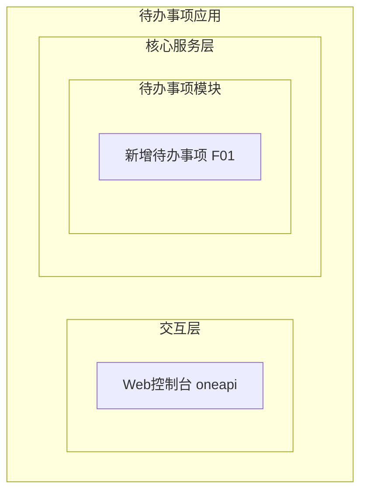
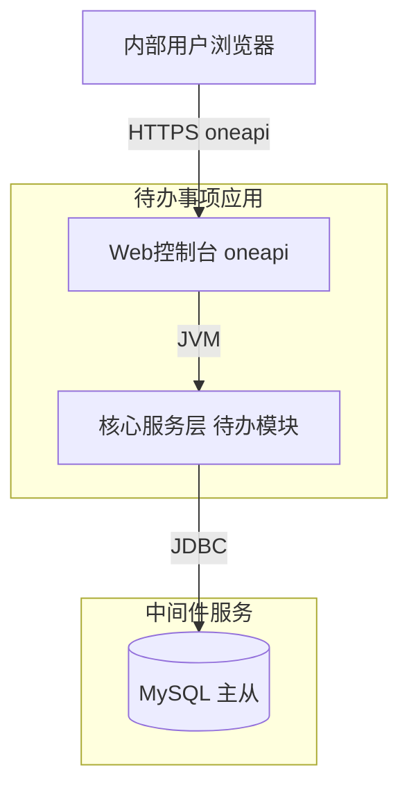
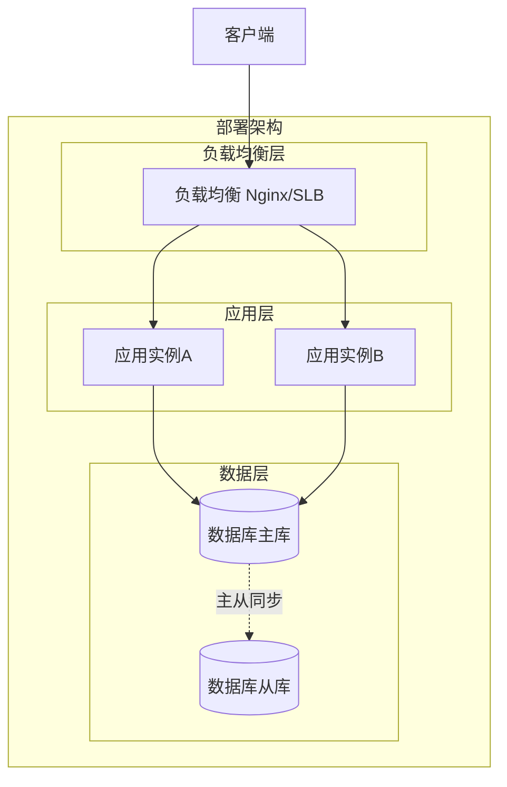
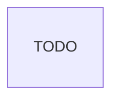
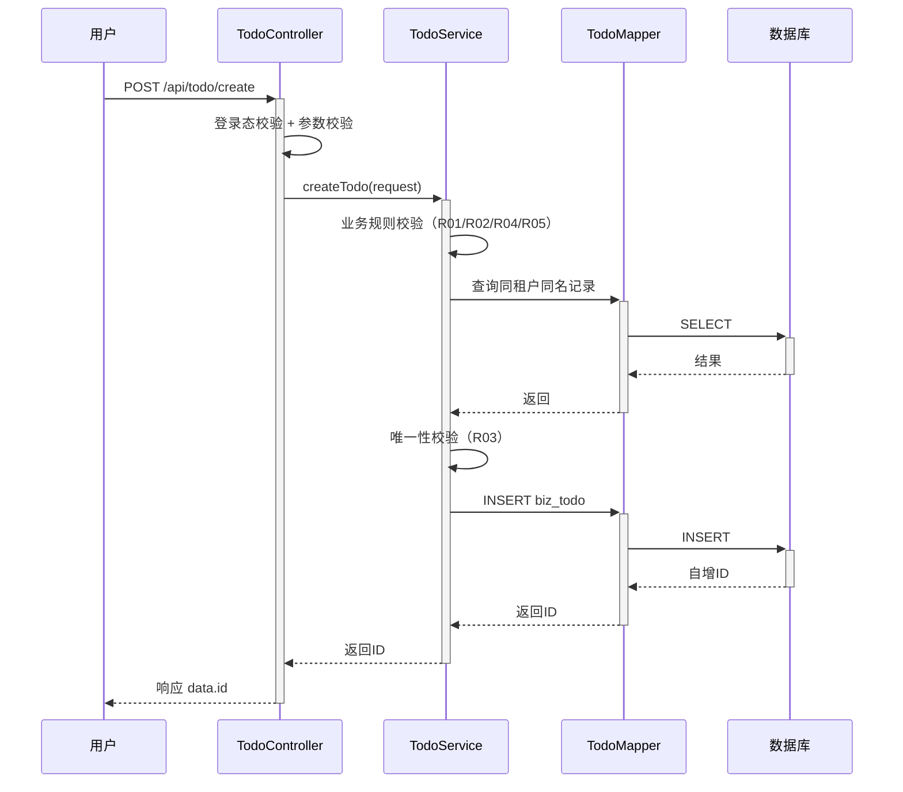
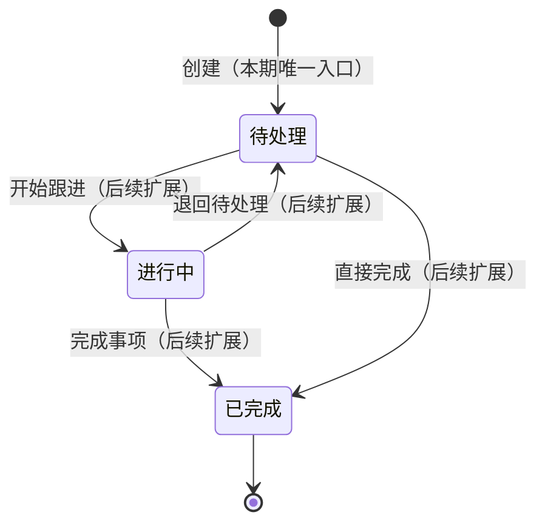

> **文档元信息**
>
> | 项目 | 内容 |
> |------|------|
> | 文档版本 | v1.0 |
> | 作者 | DTCoder（系分自动生成） |
> | 创建日期 | 2026-08-31 |
> | 需求来源 | 任务：帮助用户记录日常待办事项（核心功能：新增待办事项） |
> | 评审状态 | 待评审 |

# 待办事项新增 系分设计

## 1. 需求与范围
- 背景与目标：帮助内部用户记录日常待办事项，提供"新增待办事项"能力，使内部用户能快速登记一条事项（名称+描述）并持久化保存，为后续查看/跟进/完成提供数据基础。
- 核心功能：新增待办事项（录入事项名称与描述并保存）。
- 约束与非功能要求：目标用户为内部用户（经登录态鉴权）；最小闭环仅"创建"动作；数据持久化不丢失；并发新增互不干扰；事项名称必填且有长度上限，描述选填且有长度上限。
- 排除范围：待办的查询/列表/详情、编辑、删除、完成/状态流转接口（本期不实现，仅预留 status 字段与状态机设计）；对外业务系统开放接口（OpenAPI）；通知/提醒、定时任务。

### 需求功能清单与优先级

| 编号 | 功能点 | 优先级 | PRD 原始描述/章节 | 备注 |
|------|--------|--------|-------------------|------|
| F01 | 新增待办事项 | P0 | "新增待办事项；任务信息：事项名称和描述" | 唯一核心闭环 |

### 假设与待确认项

| 编号 | 假设/待确认内容 | 当前假设 | 确认状态 |
|------|-----------------|----------|----------|
| A01 | 技术栈未在需求中声明 | Java + Spring Boot + MyBatis + MySQL，依据 dtazziboot 栈惯例 | 待确认 |
| A02 | 内部用户身份体系未声明 | 假设复用内部统一登录（BUC/办公网鉴权），本期仅校验登录态 | 待确认 |
| A03 | 是否多租户未声明 | 默认采用 tenant_id 做租户隔离，便于后续扩展 | 待确认 |
| A04 | 事项名称/描述长度上限未声明 | 名称≤128字符，描述≤1024字符 | 待确认 |
| A05 | 待办是否需要状态 | 引入 status（默认待处理）承载生命周期，本期仅"创建"接口 | 待确认 |

## 2. 架构与模块
### 架构选型
| 方案 | 说明 | 优势 | 劣势 |
|------|------|------|------|
| 方案A：单体应用（推荐） | 单一 Spring Boot 应用，Controller–Service–Repository 分层 | 结构简单、开发快、运维成本低，契合最小闭环 | 单体扩展性受限 |
| 方案B：微服务 | 拆分待办服务、用户服务等 | 独立扩展 | 过度设计 |

**推荐方案A**，理由：本期最小闭环仅"新增待办"，单体足够且避免过度设计。

### 功能架构

- 交互层说明：Web 控制台（oneapi，/api 前缀），内部用户经登录态访问。
- 核心服务层说明：待办事项模块承载新增待办事项功能点 F01。
- 扩展/集成层说明：本期无外部系统集成。

**模块清单**

| 模块 | 职责 | 依赖 |
|------|------|------|
| 待办事项模块（todo） | 待办事项的创建与持久化 | MySQL |

### 应用集成架构

无外部系统集成；部署形态明确，集成架构与部署架构合并说明。

**集成关系说明：**

| 调用方 | 被调用方 | 协议 | 接口类型 | 说明 |
|--------|----------|------|----------|------|
| 内部用户浏览器 | 应用 Web控制台 | HTTPS | oneapi REST | 新增待办 |
| 应用核心服务层 | 数据库 | JDBC | SQL | 写入 biz_todo |

### 部署架构


**部署说明：**
- **负载均衡层**：Nginx/SLB，多实例分流。
- **应用层**：多副本无状态部署，应用状态落在 DB。
- **数据层**：MySQL 主从架构（InnoDB，ReadCommitted）。


## 3. 数据模型与存储
### 实体清单

| 实体名称 | 实体说明 | 所属模块 | 与其他实体的关系 |
|----------|----------|----------|-----------------|
| 待办事项（todo） | 一条日常待办事项记录，含名称、描述、状态 | 待办事项模块 | 无关联实体（本期最小闭环） |

### 实体关系图

> 本期仅一个实体，无实体间关系连线。字段详细定义见第5章。

**模型说明：**
- 待办事项为独立聚合根，本期不与用户表/标签表等建立外键关系（遵循 db.md：禁止使用外键）。
- 租户隔离：通过 tenant_id 字段实现逻辑隔离。
- 存储介质：MySQL（InnoDB，ReadCommitted），无缓存/MQ。


## 4. 接口设计

### 4.1 oneapi（Web 控制台接口）

| 编号 | 接口名称 | 方法 | 路径 | 模块 |
|------|----------|------|------|------|
| W01 | 新增待办事项 | POST | /api/todo/create | 待办事项模块 |

### 4.2 OpenAPI（对外接口）
本项不适用，原因：目标用户为内部用户，无对外业务系统接入需求。

### 4.3 内部接口（Service 层）

| 编号 | 接口名称 | 类 | 方法签名 |
|------|----------|------|----------|
| S01 | 创建待办事项 | TodoService | boolean createTodo(TodoCreateRequest request) |

### 4.4 集成接口（Integration 层）
本项不适用，原因：无外部系统集成。


## 5. 功能模块设计

### 全局约定
- 错误码格式：`{MODULE}_{SEQ}`，待办事项模块前缀 `TODO_`。
- 通用出参结构：`{ "code": "OK/错误码", "msg": "提示信息", "data": {} }`。

### 5.1 待办事项模块
#### 5.1.1 表结构设计
##### 5.1.1.1 biz_todo（待办事项表）

| 字段名 | 数据类型 | 约束 | 默认值 | 说明 |
|--------|----------|------|--------|------|
| id | bigint | PK, 自增 | - | 系统自增主键 |
| tenant_id | varchar(32) | NOT NULL | '' | 租户ID，逻辑隔离 |
| name | varchar(128) | NOT NULL | - | 事项名称 |
| description | varchar(1024) | NULL | NULL | 事项描述 |
| status | tinyint | NOT NULL | 0 | 状态：0待处理/1进行中/2已完成 |
| creator | varchar(64) | NOT NULL | '' | 创建人（登录态用户标识） |
| is_deleted | tinyint | NOT NULL | 0 | 是否删除：0否/1是 |
| gmt_create | datetime | NOT NULL | CURRENT_TIMESTAMP | 创建时间 |
| gmt_modified | datetime | NOT NULL | CURRENT_TIMESTAMP | 修改时间 |

**索引：**
- PK: `pk_biz_todo` (id)
- UK: `uk_biz_todo_tenant_name` (tenant_id, name) —— 同租户下事项名称唯一，避免重复登记
- IDX: `idx_biz_todo_tenant_status` (tenant_id, status) —— 便于后续按租户+状态查询
- IDX: `idx_biz_todo_creator` (creator)

##### 5.1.1.2 枚举与常量定义

| 枚举名称 | 取值 | 含义 | 关联字段 |
|----------|------|------|----------|
| TodoStatus | 0 | 待处理 | biz_todo.status |
| TodoStatus | 1 | 进行中 | biz_todo.status |
| TodoStatus | 2 | 已完成 | biz_todo.status |
| IsDeleted | 0 | 未删除 | biz_todo.is_deleted |
| IsDeleted | 1 | 已删除 | biz_todo.is_deleted |

#### 5.1.2 接口详细设计
##### W01 新增待办事项

- **URI**: POST /api/todo/create
- **描述**: 内部用户新增一条待办事项，状态默认置为"待处理"。
- **入参**:

| 参数名称 | 类型 | 是否必填 | 描述 |
|----------|------|----------|------|
| name | string | 是 | 事项名称，长度1-128 |
| description | string | 否 | 事项描述，长度0-1024 |

- **出参**:

| 参数名称 | 类型 | 描述 |
|----------|------|------|
| code | string | 结果code（OK或错误码） |
| msg | string | 提示信息 |
| data | object | 业务数据 |
| data.id | bigint | 新建待办事项ID |

- **错误码**:

| 错误码 | 说明 |
|--------|------|
| TODO_001 | 事项名称为空 |
| TODO_002 | 事项名称超过128字符 |
| TODO_003 | 事项描述超过1024字符 |
| TODO_004 | 同租户下事项名称已存在 |
| TODO_005 | 登录态缺失 |
| TODO_900 | 系统异常 |

- **业务规则**: 见 5.1.3.1 业务规则表（R01-R05）。

- **请求示例**:
```json
{ "name": "完成周报", "description": "本周五前提交部门周报" }
```

- **响应示例**:
```json
{ "code": "OK", "msg": "SUCCESS", "data": { "id": 1001 } }
```

#### 5.1.3 子功能详细设计
##### 5.1.3.1 新增待办事项（F01）

- 处理时序图


**业务规则：**

| 规则编号 | 规则描述 | 校验时机 | 不满足时的处理 |
|----------|----------|----------|--------------|
| R01 | name 非空，长度1-128 | 创建时 | 返回 TODO_001/TODO_002 |
| R02 | description 长度0-1024 | 创建时 | 返回 TODO_003 |
| R03 | 同租户未删除范围内 name 唯一 | 创建时 | 返回 TODO_004 |
| R04 | 必须登录态，creator 取登录用户 | 创建时 | 返回 TODO_005 |
| R05 | status 默认0、is_deleted 默认0 | 创建时 | 服务端强制覆盖入参 |

**异常场景：**

| 异常场景 | 处理方式 |
|----------|----------|
| 唯一索引冲突（并发同名校验穿透） | 捕获 DuplicateKeyException，返回 TODO_004 |
| 数据库连接失败/写库异常 | 返回 TODO_900，记录错误日志 |
| 参数反序列化失败 | 框架统一异常处理，返回 TODO_900 |

**并发控制（数据写入）：**
- 并发场景：同一租户下两个用户同时新增同名事项，先查后插之间存在校验窗口。
- 控制策略：依赖唯一索引 `uk_biz_todo_tenant_name` 兜底；并发重复由数据库唯一约束拦截并捕获异常返回 TODO_004。方案对比：

| 方案 | 优势 | 劣势 | 推荐 |
|------|------|------|------|
| 唯一索引兜底 | 简单可靠、DB保证 | 抛异常需转换 | ✅ |
| 分布式锁 | 不产生异常 | 锁粒度大、性能差 | ❌ |
| 仅先查后插无兜底 | 实现简单 | 并发穿透、数据脏 | ❌ |

采用"唯一索引兜底"方案。

**状态机设计（biz_todo.status）：**


**状态流转规则：**

| 当前状态 | 目标状态 | 流转条件 | 前置校验 | 触发动作 |
|----------|----------|----------|----------|----------|
| （新建） | 待处理 | 调用新增接口 | 参数与唯一性校验 | 写入记录、返回ID |
| 待处理 | 进行中 | 调用开始接口（本期未实现） | 记录存在且未删除 | 更新status=1 |
| 进行中 | 已完成 | 调用完成接口（本期未实现） | 记录存在且未删除 | 更新status=2 |
| 进行中 | 待处理 | 调用退回接口（本期未实现） | 记录存在且未删除 | 更新status=0 |
| 待处理 | 已完成 | 调用完成接口（本期未实现） | 记录存在且未删除 | 更新status=2 |

> 本期最小闭环仅实现"新建→待处理"入口；其余流转为后续扩展预留，状态机无孤岛状态。


## 6. 非功能性需求设计
### 6.1 高可用性
单体应用多实例部署，无外部系统依赖；数据库为主从架构。本期仅一个写入接口，下游异常风险低；DB 不可用时返回 TODO_900 并告警。本项不展开自动降级，原因：最小闭环无可降级的第三方依赖。

### 6.2 可扩展性
- 水平扩容：应用无状态（状态落在 DB），可通过增加实例横向扩容。
- 数据扩展：biz_todo 后续可按 tenant_id 分库分表（命名规范见 db.md）。

### 6.3 稳定性/可靠性
- 写入由唯一索引保证幂等性兜底，并发新增不产生脏数据。
- 参数边界（长度上限）在入口与服务层双重校验，避免超长写入。

### 6.4 安全性设计
#### 6.4.1 账户系统方案
假设复用内部统一登录（BUC/办公网鉴权），本期不自实现注册/登录/找密。待确认项 A02。

#### 6.4.2 授权&访问控制
##### 6.4.2.1 是否实现水平权限检查
本项不适用，原因：本期仅"创建"动作，写入数据归属当前 tenant_id 与 creator，不涉及查询他人资源；tenant_id/creator 由服务端从登录态注入，禁止客户端传入。

##### 6.4.2.2 是否实现垂直权限检查
本项不适用，原因：内部用户均可新增待办，无需角色区分。

##### 6.4.2.3 是否检查登录态
全局统一拦截器校验登录态，未登录返回 TODO_005。

#### 6.4.3 数据防护方案
##### 6.4.3.1 是否对敏感数据加密存储
本项不适用，原因：事项名称/描述为普通业务文本，非敏感个人信息。

##### 6.4.3.2 是否对敏感数据展示进行脱敏
本项不适用，原因：本期无查询/展示接口；日志不打印完整 description。

### 6.5 监控/统计/日志/告警
- 监控：对 /api/todo/create 的 QPS、耗时、错误率埋点。
- 日志：记录创建成功（tenant_id、creator、id）、失败（错误码、原因）。
- 告警：错误率/耗时超阈值告警。


## 7. 变更三板斧
### 7.1 可监控
- 对创建接口埋点：调用服务名、入参摘要（不含完整 description）、处理结果（OK/错误码）、处理耗时。
- DB 写入异常埋点：异常类型、错误码、耗时。

### 7.2 可灰度
- 本期为新增功能（绿地），无旧逻辑需兼容。
- 方案对比：

| 方案 | 说明 | 优势 | 劣势 | 推荐 |
|------|------|------|------|------|
| 接口开关灰度 | 配置开关控制 /api/todo/create 是否生效 | 简单 | 粒度为接口级 | ✅ |
| 按租户尾号灰度 | tenant_id 尾号灰度引流 | 精细 | 实现成本高 | ❌ |
| 不灰度全量发布 | 直接上线 | 最快 | 无回滚观察 | ❌ |

采用接口开关灰度，新功能可按需开启/关闭。

### 7.3 可应急
- 保留功能开关（feature toggle），异常时可一键关闭 /api/todo/create，返回友好提示。
- 应急优先用开关切回"功能不可用"，避免回滚发布包；如必须回滚，biz_todo 为新增表，回滚不依赖既有数据，兼容性无风险（新表可保留或删除）。
- 上下游兼容：本期无上游依赖、无下游消费，回滚无连锁影响。

---

## 8. 方案检查（Step 9 checklist）

| 检查项 | 结果 | 说明 |
|--------|------|------|
| 模块划分合理性 | 通过 | 单一职责（待办事项模块），无循环依赖，无功能点超50%的模块 |
| 依赖关系合理性 | 通过 | 无外部依赖，DB 异常时返回 TODO_900 |
| 单点问题（部署） | 通过 | 应用多实例 + DB 主从，无单点 |
| 表模型设计范式 | 通过 | 满足第三范式，无字段二义性 |
| 隐私安全 | 通过 | 无敏感数据，日志不打印完整 description |
| 兼容性（接口） | 不适用 | 新增接口，无旧调用方 |
| 兼容性（表） | 不适用 | 新增表，无旧版本 |
| 数据迁移 | 不适用 | 新增表，无初始化数据需求 |
| 一致性（功能点） | 通过 | F01 对应 W01/S01/5.1.3.1 |
| 一致性（表） | 通过 | Step3 实体 todo 在 5.1.1.1 完整定义 |
| 一致性（接口） | 通过 | Step4 W01/S01 在 5.1.2 详细定义 |
| 一致性（枚举） | 通过 | TodoStatus/IsDeleted 与表字段说明一致 |
| 状态机完整性 | 通过 | 含 status 字段实体有状态机图，无孤岛状态 |
| 并发风险 | 通过 | 唯一索引兜底方案已对比并推荐 |
| 单点问题（定时任务） | 不适用 | 本期无定时任务 |
| 非功能性设计可行性 | 通过 | 落地可行，未引入过度中间件 |
| 变更三板斧-可监控 | 通过 | 接口与DB异常埋点可行 |
| 变更三板斧-可灰度 | 通过 | 接口开关灰度方案已对比推荐 |
| 变更三板斧-可应急 | 通过 | 功能开关优先，回滚兼容性已评估 |
