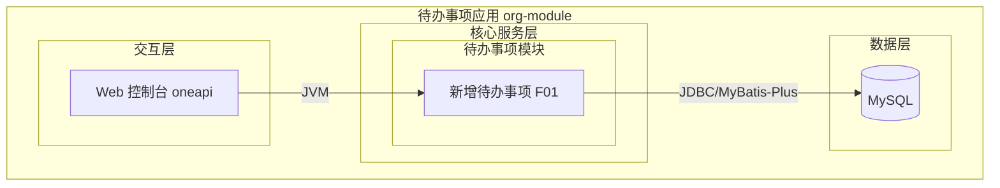
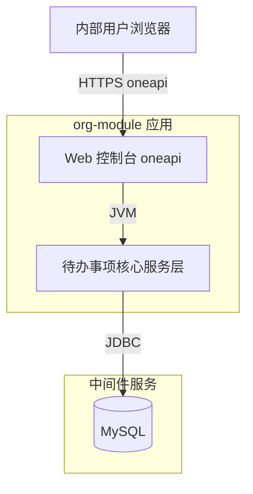
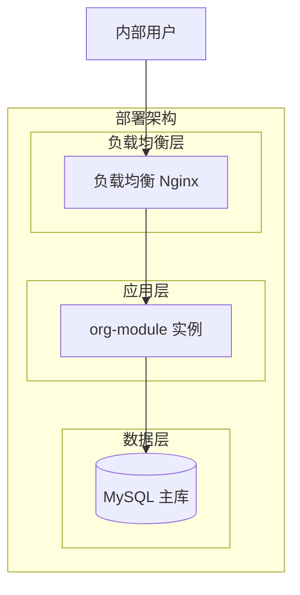
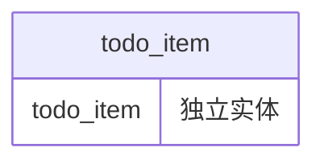
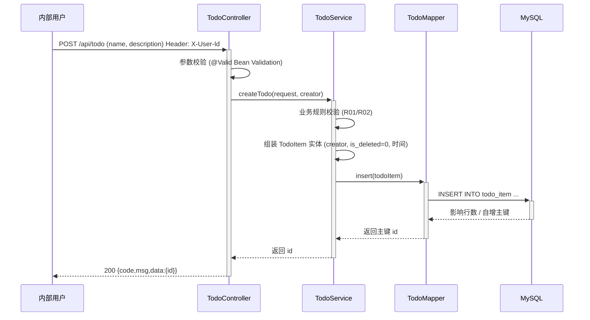

> **文档元信息**
>
> | 项目 | 内容 |
> |------|------|
> | 文档版本 | v1.0 |
> | 作者 | 系分设计 Agent |
> | 创建日期 | 2026-08-31 |
> | 需求来源 | 任务输入：目标-帮助用户记录日常待办事项；核心功能-新增待办事项；任务信息-事项名称和描述；目标用户-内部用户；最小闭环-仅创建 |
> | 评审状态 | 待评审 |

# 待办事项模块 系分设计

---

## 1. 需求与范围

### 1.1 背景与目标

内部用户在日常工作中需要快速记录待办事项，以便后续跟进。本期提供**最小可用闭环**：用户可新增一条待办事项，记录其名称与描述。后续迭代再扩展查询、编辑、完成、删除等完整生命周期能力。

**目标：**
- 支持内部用户新增待办事项，至少包含「事项名称」和「描述」两项信息
- 数据可持久化存储，创建即落库
- 以最小闭环验证链路打通（前端录入 → 后端校验 → 持久化 → 返回结果），为后续功能扩展奠定基础

### 1.2 核心角色与权限

| 角色 | 权限范围 |
|------|---------|
| 内部用户 | 可新增待办事项；本期不区分多角色，所有内部用户均可创建 |

> 假设：A01——本期目标用户为「内部用户」，但仓库内未提供统一身份认证/登录态模块。当前假设内部用户身份标识通过请求头 `X-User-Id` 传入并由服务端读取作为「创建人」落库，统一身份认证（SSO）不在本期范围。

### 1.3 核心功能清单与优先级

| 编号 | 功能点 | 优先级 | PRD 原始描述/章节 | 备注 |
|------|--------|--------|-------------------|------|
| F01 | 新增待办事项 | P0 | 核心功能：新增待办事项；任务信息：事项名称和描述；最小闭环：仅创建 | 入参为事项名称 + 描述，落库后返回创建结果 |

### 1.4 约束与非功能要求

- **技术栈约束**：后端 Spring Boot 3.2.5 + Java 17 + MyBatis-Plus 3.5.6 + MySQL 8（与现有 `org-module` 工程保持一致）；前端 Vue 3 + Element Plus + Pinia + Axios + Vite
- **数据安全**：禁止物理删除，预留逻辑删除字段 `is_deleted`（本期仅创建，不触发删除）
- **参数校验**：事项名称必填、长度受限；描述可选、长度受限；使用 `spring-boot-starter-validation`
- **通用出参**：沿用工程既有 `Result<T>`（`{code, msg, data}`，成功 code=200）
- **异常兜底**：沿用工程既有 `GlobalExceptionHandler`（业务异常 400、乐观锁 409、系统异常 500）
- **性能要求**：单条插入，响应时间 P99 < 200ms（内部小范围使用，数据量极小）

### 1.5 排除范围

- 本期**仅实现「新增」**，以下能力均不在本期范围，留待后续迭代：
  - 待办事项列表查询 / 详情查询
  - 待办事项编辑（修改名称、描述）
  - 待办事项完成 / 状态流转（待处理 → 完成 等）
  - 待办事项删除（逻辑删除触发）
  - 批量导入、附件、提醒/通知
- 统一身份认证（SSO）、水平/垂直权限模型不在本期范围（见 A01）
- 多租户隔离本期不涉及（内部单一租户场景）

### 1.6 假设与待确认项

| 编号 | 假设/待确认内容 | 当前假设 | 确认状态 |
|------|-----------------|----------|----------|
| A01 | 内部用户身份来源 | 通过请求头 `X-User-Id` 传入，服务端读取作为 `creator` 落库；统一身份认证不在本期范围 | 待确认 |
| A02 | 是否需要状态字段（待处理/完成） | 本期最小闭环「仅创建」，不引入状态字段，避免出现不可流转的孤立状态；状态机随「完成」功能迭代再引入 | 待确认 |
| A03 | 是否需要防重复提交/幂等 | 本期为独立插入，未引入幂等键；假设前端做按钮防抖即可，服务端不额外防重 | 待确认 |
| A04 | board-knowledge-search 检索能力 | 当前运行环境未提供该检索 skill，项目初始信息通过仓库实测（pom.xml、源码布局、既有 design.md）获取 | 待确认 |
| A05 | 部署形态 | 假设内部小范围使用，首期单实例容器化部署即可；高可用多副本留待规模化后启用 | 待确认 |

---

## 2. 架构与模块

### 2.1 功能架构



- **交互层说明**：内部用户通过 Vue3 + Element Plus 前端页面录入待办事项，经 oneapi（`/api` 前缀）REST 接口提交。
- **核心服务层说明**：待办事项模块负责参数校验、业务规则校验、数据组装与持久化，采用 Controller–Service–Mapper 分层。
- **数据层说明**：MySQL 单库存储，本期无缓存/MQ。

### 2.2 应用集成架构



**集成关系说明：**

| 调用方 | 被调用方 | 协议 | 接口类型 | 说明 |
|--------|----------|------|----------|------|
| 内部用户浏览器 | org-module Web 控制台 | HTTPS | oneapi REST | 提交新增待办事项请求 |
| org-module 核心服务层 | MySQL | JDBC | SQL（MyBatis-Plus） | 待办事项落库 |

> 本期无外部系统/第三方服务集成。

### 2.3 部署架构



**部署说明：**
- **负载均衡层**：内部小范围使用，假设前置 Nginx 做反向代理与 TLS 卸载（见 A05）。
- **应用层**：首期单实例容器化部署即可满足最小闭环；规模化后可无状态水平扩容。
- **数据层**：MySQL 单主库；本期数据量极小，暂不引入主从/分库分表。

> 架构选型：本期为既有 Spring Boot 单体工程内新增模块，沿用单体 + 分层架构，无多服务/微服务选型必要，不展开多方案对比。

---

## 3. 数据模型与存储

### 3.1 实体清单

| 实体名称 | 实体说明 | 所属模块 | 与其他实体的关系 |
|----------|----------|----------|-----------------|
| todo_item | 待办事项，记录单条事项名称、描述与创建人 | 待办事项模块 | 无关联实体（本期最小闭环，不关联用户实体/部门实体） |

### 3.2 实体关系图



> 本期仅一个实体，无实体间关系连线。字段级详细定义见第 5 章。

**模型说明：**
- 待办事项为独立记录，本期不与组织架构模块的 `employee`/`department` 建立外键关联（数据库禁止使用外键，见 db.md 规范）。
- `creator` 仅记录创建人标识字符串，不强制引用员工主键，避免引入跨模块耦合（见 A01）。

---

## 4. 接口设计

### 4.1 oneapi（Web 控制台接口）

| 编号 | 接口名称 | 方法 | 路径 | 模块 |
|------|----------|------|------|------|
| W01 | 新增待办事项 | POST | /api/todo | 待办事项模块 |

### 4.2 OpenAPI（对外接口）

本期不提供对外 OpenAPI 接口。

### 4.3 内部接口（Service 层）

| 编号 | 接口名称 | 类 | 方法签名 |
|------|----------|------|----------|
| S01 | 新增待办事项 | TodoService | boolean createTodo(TodoCreateRequest request) |

### 4.4 集成接口（Integration 层）

本期无外部系统集成接口。

---

## 5. 功能模块设计

### 5.0 全局约定

| 约定项 | 约定内容 |
|--------|----------|
| 错误码格式 | `{MODULE}_{SEQ}`，本期模块代号 `TODO`，如 `TODO_001` |
| 通用出参结构 | `{code, msg, data}`，成功 code=200、msg=SUCCESS，沿用工程 `Result<T>` |
| 业务异常处理 | 抛 `BusinessException`，由 `GlobalExceptionHandler` 统一转 code=400 |

**模块映射表：**

| 模块代号 | 模块名称 | 责任层 | 对应实体/表 |
|----------|----------|--------|-------------|
| TODO | 待办事项模块 | Controller–Service–Mapper | todo_item |

### 5.1 待办事项模块

#### 5.1.1 表结构设计

##### 5.1.1.1 todo_item

| 字段名 | 数据类型 | 约束 | 默认值 | 说明 |
|--------|----------|------|--------|------|
| id | bigint | PK, 自增 | - | 系统自增主键 |
| name | varchar(128) | NOT NULL | - | 事项名称，必填 |
| description | varchar(1024) | NULL | NULL | 事项描述，可选 |
| creator | varchar(64) | NULL | NULL | 创建人标识，来源请求头 X-User-Id（见 A01） |
| is_deleted | tinyint | NOT NULL | 0 | 逻辑删除标记：0-未删除，1-已删除 |
| gmt_create | datetime | NOT NULL | CURRENT_TIMESTAMP | 创建时间 |
| gmt_modified | datetime | NOT NULL | CURRENT_TIMESTAMP | 修改时间，代码逻辑维护 |

**索引：**
- PK: `pk_todo_item` (id) — 主键
- IDX: `idx_todo_item_creator` (creator) — 按创建人检索（为后续「我的待办」查询预留，本期暂不使用但建立成本极低）
- IDX: `idx_todo_item_gmt_create` (gmt_create) — 按时间检索预留

> 字段命名遵循 references/db.md：全小写+下划线、整形单列主键、datetime（禁用 timestamp）、禁用 enum、布尔字段 `is_` 前缀、表名不复数、`业务_作用` 命名（`todo_item`）。

##### 5.1.1.2 枚举与常量定义

本模块无枚举/常量定义（本期不引入 status 字段，见 A02）。

#### 5.1.2 接口详细设计

##### W01 新增待办事项

- **URI**: POST `/api/todo`
- **描述**: 内部用户新增一条待办事项，包含事项名称与描述，落库后返回创建结果。
- **入参**:

| 参数名称 | 类型 | 是否必填 | 描述 |
|----------|------|----------|------|
| name | string | 是 | 事项名称，长度 1–128 |
| description | string | 否 | 事项描述，长度 ≤ 1024 |
| X-User-Id（请求头） | string | 否 | 创建人标识，服务端读取写入 creator 字段；缺失时 creator 落 NULL（见 A01） |

- **出参**:

| 参数名称 | 类型 | 描述 |
|----------|------|------|
| code | int | 结果码，200 成功 |
| msg | string | 提示信息 |
| data | object | 业务数据 |
| data.id | bigint | 新建待办事项主键 |

- **错误码**:

| 错误码 | 说明 |
|--------|------|
| TODO_001 | 事项名称不能为空或长度超限 |
| TODO_002 | 事项描述长度超限（>1024） |

- **业务规则**: 见 5.1.3.1 业务规则表。

- **请求示例**:
```json
{
  "name": "完成季度汇报",
  "description": "整理 Q3 数据并提交评审"
}
```

- **响应示例**:
```json
{
  "code": 200,
  "msg": "SUCCESS",
  "data": {
    "id": 1001
  }
}
```

#### 5.1.3 子功能详细设计

##### 5.1.3.1 新增待办事项（F01）

- **处理时序图**


**业务规则：**

| 规则编号 | 规则描述 | 校验时机 | 不满足时的处理 |
|----------|----------|----------|--------------|
| R01 | 事项名称 `name` 非空且长度 1–128 | 创建时（Controller 参数校验） | 返回错误码 TODO_001，提示「事项名称不能为空或长度超限」 |
| R02 | 事项描述 `description` 长度 ≤ 1024（允许为空） | 创建时（Controller 参数校验） | 返回错误码 TODO_002，提示「事项描述长度超限」 |
| R03 | `creator` 由服务端从请求头 `X-User-Id` 读取，禁止由请求体传入以防伪造 | 创建时（Service 组装阶段） | 缺失时 creator 落 NULL，不阻断创建（见 A01） |

**异常场景：**

| 异常场景 | 处理方式 |
|----------|----------|
| 参数校验失败（ConstraintViolationException） | 由 GlobalExceptionHandler 兜底，返回业务提示，code=400 |
| 数据库唯一/约束异常、连接异常等运行时异常 | 由 GlobalExceptionHandler 兜底，code=500，记录错误日志 |
| 重复快速提交（双击） | 前端按钮防抖；服务端不额外幂等，允许产生两条记录（见 A03） |

> 本期为单表插入，无多表事务，无需显式回滚策略。

**并发控制：**
- 并发场景：多个内部用户同时新增待办事项，或同一用户快速重复提交。
- 控制策略：无并发风险——新增为独立 INSERT，无共享资源竞争、无读改写序列。重复提交仅产生重复记录，由前端按钮防抖缓解（见 A03），本期不引入分布式锁/幂等键，避免过度设计。

**状态机设计：**
- 本实体不含状态字段（见 A02），不适用状态机。状态机随「完成/取消」等状态流转功能迭代时再引入。

**技术选型方案对比：**

| 选型项 | 方案 A | 方案 B | 方案 C | 推荐 | 推荐理由 |
|--------|--------|--------|--------|------|----------|
| 持久层框架 | MyBatis-Plus BaseMapper | 原生 MyBatis XML | Spring Data JPA | 方案 A | 与现有工程 `org-module` 技术栈完全一致（pom 已引入 mybatis-plus-boot-starter），单表 CRUD 用 BaseMapper 零 XML 成本最低 |
| 参数校验 | spring-boot-starter-validation（@Valid + 注解） | Service 手动 if 校验 | — | 方案 A | 工程已引入 validation 依赖，注解式校验声明式、可复用、与 GlobalExceptionHandler 自然衔接 |

**模块自检（完备性对账 + 过度设计检查）：**

| 检查维度 | 对账结果 |
|----------|----------|
| F01 ↔ W01 | F01（新增待办事项）对应 W01（POST /api/todo），已设计 ✓ |
| F01 ↔ 表 | F01 写入 todo_item 表，字段 name/description/creator 完整覆盖任务信息 ✓ |
| F01 ↔ 时序 | 时序图覆盖 用户→Controller→Service→Mapper→DB 完整链路 ✓ |
| 过度设计检查 | 不引入 status 字段（避免孤立状态）、不引入幂等键/分布式锁（避免过度设计）、不引入缓存/MQ（数据量极小）✓ |

---

## 6. 非功能性需求设计

### 6.1 高可用性
本期为内部小范围使用的最小闭环，单实例容器化部署。上下游无外部依赖，应用自身可用性由 Spring Boot 进程稳定性保障。规模化后可启用多副本 + LB 无状态水平扩容。

### 6.2 可扩展性
单体应用 + 分层架构，待办事项模块与既有组织架构模块在同应用内隔离包路径（`com.org.module.todo.*`）。水平扩容依赖应用无状态（会话/状态不落本地），后续多实例时 creator/context 仍由请求头传递。

### 6.3 稳定性/可靠性
参数校验（R01/R02）前置拦截非法输入；`GlobalExceptionHandler` 兜底所有未捕获异常返回统一结构，避免 500 裸栈；逻辑删除字段预留，杜绝物理删除误操作。

### 6.4 安全性设计

#### 6.4.1 账户系统方案
本期不实现自有登录/注册。假设内部用户身份经企业内网网关/SSO 完成认证后注入请求头 `X-User-Id`（见 A01），本模块不做认证逻辑。

#### 6.4.2 授权&访问控制

##### 6.4.2.1 是否实现水平权限检查
本期「仅创建」不涉及按资源归属查询/修改他人数据，本期不适用水平权限检查。后续「我的待办」查询迭代时再按 `creator` 实现水平权限。

##### 6.4.2.2 是否实现垂直权限检查
本期不区分角色，所有内部用户均可创建，不适用垂直权限检查。

##### 6.4.2.3 是否检查登录态
假设由前置网关统一校验登录态并注入 `X-User-Id`；本模块接口默认信任网关鉴权结果，不重复实现登录态校验（见 A01）。

#### 6.4.3 数据防护方案

##### 6.4.3.1 是否对敏感数据加密存储
事项名称/描述为普通工作记录，非敏感数据，不加密存储。

##### 6.4.3.2 是否对敏感数据展示进行脱敏
本模块无敏感信息（姓名/身份证/手机号等），不适用脱敏。

### 6.5 监控/统计/日志/告警
- 关键监控点：新增待办事项接口调用次数、成功/失败计数、处理耗时。
- 日志：`GlobalExceptionHandler` 已记录系统异常堆栈；业务侧对创建成功记录 INFO 级别日志（含 todo id、creator）。
- 告警：本期内部小范围使用，暂不设告警阈值，规模化后接入监控平台。

---

## 7. 变更三板斧

### 7.1 可监控
对 W01 新增接口埋点：记录调用服务名、处理结果（成功/失败）、处理耗时；异常路径由 `GlobalExceptionHandler` 统一记录错误日志。落地可行，依赖工程既有日志框架（SLF4J）。

### 7.2 可灰度
本期为**全新增接口**，无旧逻辑需要兼容/灰度切换，不适用灰度引流。后续若改造创建逻辑时再按租户/用户尾号灰度。

> 灰度方案对比：本期不涉及，留待后续改造场景。推荐：未来改造时采用「按 X-User-Id 尾号灰度」+ 功能开关组合，简单可控。

### 7.3 可应急
本期新增功能为纯增量，无旧逻辑回滚需求。应急方案：若新接口出现严重故障，直接通过网关下线 `/api/todo` 路由或回滚发布包即可，无上下游依赖、无数据兼容性问题。应急从「自身」角度越简单越好——下线路由/回滚包即可隔离影响。

---

## 8. 方案检查（Step 9 checklist）

| # | 检查项 | 结果 | 说明 |
|---|--------|------|------|
| 1 | 模块划分合理性 | 通过 | 单一职责（待办事项模块仅负责新增）；无循环依赖；无功能点超 50% 的模块（本期仅 1 个功能点） |
| 2 | 依赖关系合理性 | 通过 | 无外部系统依赖；下游仅 MySQL，DB 异常时由 GlobalExceptionHandler 兜底返回 500，应用进程仍可用 |
| 3 | 单点问题（部署层面） | 不适用 | 首期内部小范围单实例（见 A05），规模化后启用多副本消除单点 |
| 4 | 表模型设计范式 | 通过 | 满足第三范式：每字段均依赖主键、无传递依赖；name/description/creator 均直接描述该待办事项 |
| 5 | 隐私安全检查 | 通过 | 接口无敏感信息；creator 由服务端从请求头读取、禁止请求体传入防伪造 |
| 6 | 兼容性（接口） | 不适用 | 全新接口，无旧调用方需兼容 |
| 7 | 兼容性（表） | 不适用 | 全新表，无新旧版本并存 |
| 8 | 数据迁移检查 | 不适用 | 新增表，无初始化数据需求；上线即空表使用 |
| 9 | 一致性（功能点） | 通过 | F01 在第 5 章有对应设计（W01/表/时序/规则） |
| 10 | 一致性（表） | 通过 | 第 3 章 todo_item 实体在第 5.1.1.1 有完整表结构定义 |
| 11 | 一致性（接口） | 通过 | 第 4 章 W01 在第 5.1.2 有详细定义（入参/出参/错误码/示例） |
| 12 | 一致性（枚举） | 不适用 | 本模块无枚举字段 |
| 13 | 状态机完整性 | 不适用 | 本实体无状态字段（见 A02），随状态流转迭代再引入 |
| 14 | 并发风险检查 | 通过 | 新增为独立 INSERT 无并发风险；多方案对比见 5.1.3.1 并发控制，推荐不引入锁/幂等避免过度设计 |
| 15 | 单点问题（定时任务） | 不适用 | 本期无定时任务 |
| 16 | 非功能性设计可行性 | 通过 | 校验/异常兜底/日志均基于工程既有能力落地；HA/灰度等按不适用或未来迭代标注 |
| 17 | 变更三板斧（可监控） | 通过 | 基于 SLF4J 日志 + GlobalExceptionHandler，落地可行 |
| 18 | 变更三板斧（可灰度） | 不适用 | 全新接口无旧逻辑，不适用灰度；未来改造方案已给出 |
| 19 | 变更三板斧（可应急） | 通过 | 下线路由/回滚发布包即可隔离，无上下游依赖 |

**检查结论：** 全部项目通过或不适用，未发现需修复项。设计文档保持 v1.0。

---

## 附：决策记录摘要

| 决策项 | 决策结果 | 备选方案 | 决策原因 |
|--------|----------|----------|----------|
| 产出文件路径 | 用户指定 `.agents/20260831-.../design.md` | — | 任务硬性约束 |
| 设计模式 | 全量模式 | 增量模式 | 仓库无同名待办事项历史文档 |
| 持久层框架 | MyBatis-Plus BaseMapper | 原生 MyBatis XML / JPA | 与现有 org-module 工程栈一致，单表 CRUD 成本最低 |
| 参数校验 | spring-boot-starter-validation | Service 手动校验 | 工程已引入 validation，声明式可复用 |
| 是否引入 status 字段 | 不引入 | 引入 status + 状态机 | 最小闭环仅创建，避免出现不可流转的孤立状态 |
| 是否引入幂等/分布式锁 | 不引入 | 幂等键 / 分布式锁 | 独立 INSERT 无并发风险，避免过度设计 |
| 用户身份来源 | 请求头 X-User-Id | 自实现认证 / SSO | 仓库无认证模块，假设网关注入（见 A01） |
