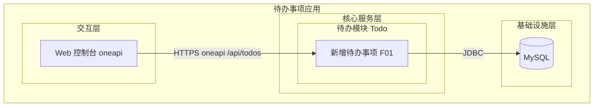
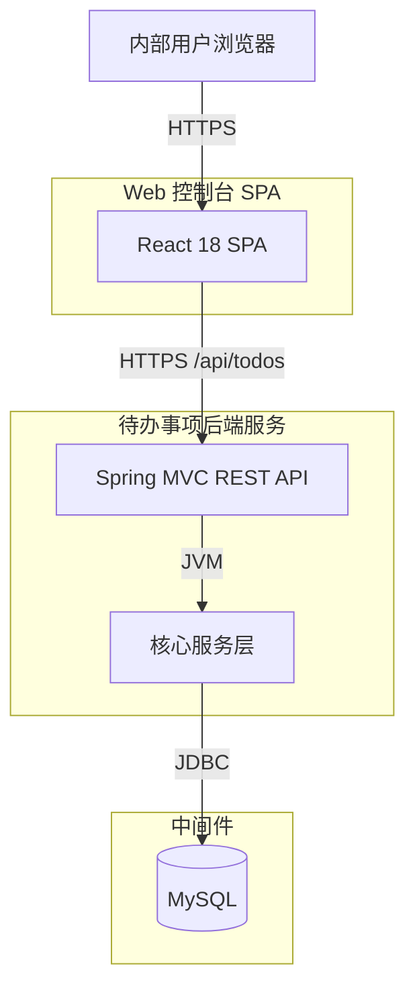
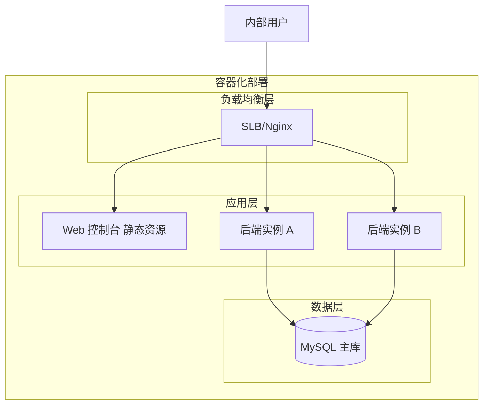
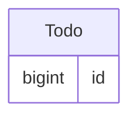
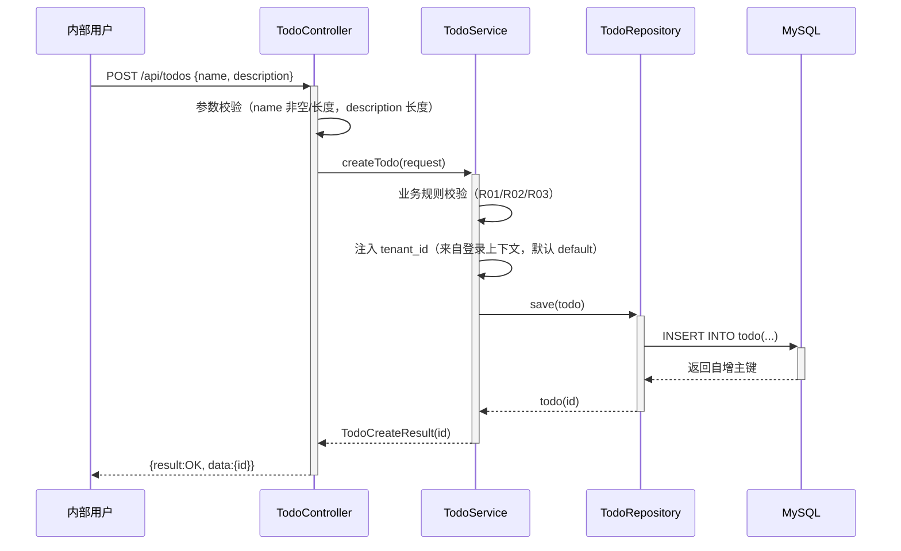

> **文档元信息**
>
> | 项目 | 内容 |
> |------|------|
> | 文档版本 | v1.0 |
> | 作者 | DTCoder |
> | 创建日期 | 2026-08-31 |
> | 需求来源 | 任务输入：目标"帮助用户记录日常待办事项"，核心功能"新增待办事项"，任务信息"事项名称和描述"，目标用户"内部用户"，最小闭环"仅创建" |
> | 评审状态 | 待评审 |

# 待办事项记录 系分设计

## 1. 需求与范围

### 1.1 背景与目标

内部用户需要一个轻量工具来记录日常待办事项，以便后续跟进。本期聚焦最小闭环：**仅实现"新增待办事项"功能**，用户可通过 Web 控制台录入事项名称与描述并持久化保存，完成一次可用的创建链路。后续版本可在此基础上扩展查询、修改、完成、删除等能力。

核心目标：
- **新增待办事项**：内部用户在控制台填写事项名称、描述，提交后落库保存，返回创建结果。

### 1.2 核心功能

| ID | 功能 | 描述 |
|----|------|------|
| FR-TODO-01 | 新增待办事项 | 用户提交事项名称（必填）和描述（选填），系统校验并持久化，返回创建后的待办事项 ID |

### 1.3 约束与非功能要求

| 约束项 | 指标 |
|--------|------|
| 性能 | 创建接口 P95 < 500ms（数据量 < 10万条） |
| 并发 | 支持 20 并发用户 |
| 字符长度 | 名称 ≤ 100 字符；描述 ≤ 500 字符 |
| 名称必填 | 名称不可为空 / 不可全空白 |
| 浏览器兼容 | Chrome 90+, Edge 90+, Safari 15+ |
| 数据库 | MySQL（InnoDB），事务隔离级别 ReadComited |
| 时间字段 | datetime 类型并维护默认值（禁用 timestamp） |
| 租户隔离 | 预留 tenant_id，当前单租户 |
| 通用出参 | {result, msg, data} |

### 1.4 排除范围

| 包含（本期） | 不包含（本期） |
|------|---------------|
| 新增待办事项（名称+描述） | 待办查询/列表 |
| 待办事项持久化 | 待办修改/编辑 |
| Web 控制台创建表单页 | 待办完成/状态流转 |
| | 待办删除 |
| | 用户登录注册（假设登录态已由外部统一鉴权提供） |
| | 移动端 App |
| | 通知/提醒 |

### 1.5 需求功能清单与优先级

| 编号 | 功能点 | 优先级 | 来源 | 备注 |
|------|--------|--------|------|------|
| F01 | 新增待办事项（名称必填、描述选填、落库返回 ID） | P0 | FR-TODO-01 | 最小闭环唯一功能 |

### 1.6 假设与待确认项

| 编号 | 假设/待确认内容 | 当前假设 | 确认状态 |
|------|-----------------|----------|----------|
| A01 | 后端技术栈 | Spring Boot 3 + Spring Data JPA + MySQL(InnoDB) | 待确认 |
| A02 | 前端技术栈 | React 18 SPA（Web 控制台） | 待确认 |
| A03 | 登录态来源 | 由外部统一鉴权提供，后端通过全局拦截器校验登录态并注入 tenant_id | 待确认 |
| A04 | 租户隔离 | 预留 tenant_id，当前单租户，默认值 "default" | 待确认 |
| A05 | 是否需要状态字段 | 本期不加 status，仅创建；需求仅声明"名称和描述"，避免过度设计 | 待确认 |
| A06 | 部署方式 | 容器化部署，双副本 | 待确认 |
| A07 | 字符长度上限 | 名称 100、描述 500 字符 | 待确认 |

---

## 2. 架构与模块

### 2.1 功能架构



- **交互层**：Web 控制台提供待办创建表单页，内部用户通过浏览器提交，走 oneapi（/api 前缀）REST 接口。
- **核心服务层**：待办模块（Todo），单一职责——处理待办事项的创建（参数校验、持久化）。
- **基础设施层**：MySQL 持久化存储。

**模块清单**

| 模块 | 职责 | 依赖 |
|------|------|------|
| 待办模块（Todo） | 待办事项新增的参数校验、业务规则校验、持久化与结果返回 | MySQL（通过 Repository 层） |

> 说明：最小闭环仅创建一个功能点，故不拆分多模块，保持单一职责。模块内部仍按 Controller–Service–Repository 分层。

### 2.2 应用集成架构



**集成关系说明：**

| 调用方 | 被调用方 | 协议 | 接口类型 | 说明 |
|--------|----------|------|----------|------|
| 内部用户浏览器 | Web 控制台 SPA | HTTPS | - | 待办创建表单页 |
| Web 控制台 SPA | 后端 REST API | HTTPS | oneapi REST | POST /api/todos 创建待办 |
| 后端核心服务层 | MySQL | JDBC | SQL | 待办事项持久化 INSERT |

### 2.3 部署架构



**部署说明：**
- **负载均衡层**：SLB/Nginx 反向代理，前端静态资源与后端 API 同域名，路径区分。
- **应用层**：后端 Spring Boot 双副本（无状态），消除单点；前端静态资源经 CDN/SLB 分发。
- **数据层**：MySQL 单主库（内部应用、低数据量）；后续数据量增长可加从库与读写分离。假设：单主库在本期数据量与并发下满足需求。

---

## 3. 数据模型与存储

### 3.1 实体清单

| 实体名称 | 实体说明 | 所属模块 | 与其他实体的关系 |
|----------|----------|----------|-----------------|
| Todo | 待办事项记录，承载事项名称与描述 | 待办模块（Todo） | 独立实体（本期无关联实体） |

### 3.2 实体关系图



> 本期仅一个独立实体，无实体间关系连线。字段详细定义见 5.2.1。

**模型说明：**
- **最小模型**：仅记录事项名称、描述与审计字段；按需求不引入状态、优先级等字段。
- **租户隔离**：预留 tenant_id 字段，当前单租户，默认值 "default"，便于后续多租户扩展。
- **审计字段**：遵循 db.md，包含 id、gmt_create、gmt_modified，由代码逻辑维护。

### 3.3 缓存与 MQ

| 组件 | 用途 | 数据形态 |
|------|------|----------|
| - | 缓存 | 本期不涉及，原因：仅创建接口，无高频读取场景 |
| - | MQ | 本期不涉及，原因：同步创建即可满足，无异步需求 |

---

## 4. 接口设计

### 4.1 oneapi（Web 控制台接口）

| 编号 | 接口名称 | 方法 | 路径 | 模块 |
|------|----------|------|------|------|
| W01 | 新增待办事项 | POST | /api/todos | 待办模块（Todo） |

### 4.2 OpenAPI（对外接口）

本项不适用，原因：本期目标用户为内部用户，仅通过 Web 控制台操作，无第三方系统对接需求。

### 4.3 内部接口（Service 层）

| 编号 | 接口名称 | 类 | 方法签名 |
|------|----------|-----|----------|
| S01 | 创建待办事项 | TodoService | TodoCreateResult createTodo(TodoCreateRequest request) |

### 4.4 集成接口（Integration 层）

本项不适用，原因：本期无外部系统集成（无邮件、对象存储、第三方 API 等）。

---

## 5. 功能模块设计

### 5.1 全局约定

**错误码格式**：`TODO_{SEQ}`（单模块，前缀简化为 TODO）

| 模块 | 前缀 | 范围 |
|------|------|------|
| 待办模块 | TODO_ | 0001-0099 |

**通用出参结构**：
```json
{ "result": "OK", "msg": "SUCCESS", "data": {} }
```

> 失败时 result 为错误码、msg 为提示信息、data 为空对象。

### 5.2 待办模块 (F01)

#### 5.2.1 表结构设计

##### todo（待办事项）

| 字段名 | 数据类型 | 约束 | 默认值 | 说明 |
|--------|----------|------|--------|------|
| id | bigint | PK, 自增 | - | 系统自增主键 |
| name | varchar(100) | NOT NULL | - | 事项名称 |
| description | varchar(500) | - | NULL | 事项描述 |
| tenant_id | varchar(50) | NOT NULL | 'default' | 租户标识，预留隔离 |
| gmt_create | datetime | NOT NULL | CURRENT_TIMESTAMP | 创建时间 |
| gmt_modified | datetime | NOT NULL | CURRENT_TIMESTAMP | 修改时间 |

**索引：**
- UK: 无（本期无唯一性约束）
- IDX: `idx_todo_tenant` (tenant_id)
- IDX: `idx_todo_create` (gmt_create)

> 遵循 references/db.md：整形单列主键、datetime 非 timestamp、表名小写下划线、含 id/gmt_create/gmt_modified、索引前缀 idx_。

#### 5.2.2 枚举与常量定义

本模块无枚举/常量定义，原因：本期仅创建功能，无 status/type 等有限取值字段。

#### 5.2.3 接口详细设计

##### W01 新增待办事项

- **URI**: POST /api/todos
- **描述**: 内部用户创建一条待办事项，校验名称必填与长度，持久化后返回待办 ID
- **入参**:

| 参数名称 | 类型 | 是否必填 | 描述 |
|----------|------|----------|------|
| name | String | 是 | 事项名称，≤100 字符，不可全空白 |
| description | String | 否 | 事项描述，≤500 字符 |

- **出参**:

| 参数名称 | 类型 | 描述 |
|----------|------|------|
| result | String | 结果 code，成功为 "OK" |
| msg | String | 提示信息，成功为 "SUCCESS" |
| data.id | Long | 创建后的待办事项主键 ID |

- **错误码**:

| 错误码 | 说明 |
|--------|------|
| TODO_0001 | name 缺失或为空白 |
| TODO_0002 | name 长度超过 100 字符 |
| TODO_0003 | description 长度超过 500 字符 |
| TODO_0004 | 系统内部错误（如数据库不可用） |

- **业务规则**: name 去除首尾空白后不可为空且长度 ≤ 100；description 选填，传入时长度 ≤ 500；tenant_id 由登录态上下文注入，默认 "default"。

- **请求示例**:
```json
{
  "name": "完成系分评审",
  "description": "本周五前完成待办模块系分文档评审"
}
```

- **响应示例**:
```json
{
  "result": "OK",
  "msg": "SUCCESS",
  "data": {
    "id": 1001
  }
}
```

#### 5.2.4 子功能详细设计

##### 5.2.4.1 新增待办事项 (F01)

- 处理时序图


**业务规则：**

| 规则编号 | 规则描述 | 校验时机 | 不满足时的处理 |
|----------|----------|----------|--------------|
| R01 | name 必填，去除首尾空白后非空 | 创建时 | 返回 TODO_0001，提示"事项名称不可为空" |
| R02 | name 长度 ≤ 100 字符 | 创建时 | 返回 TODO_0002，提示"事项名称过长" |
| R03 | description 长度 ≤ 500 字符 | 创建时 | 返回 TODO_0003，提示"事项描述过长" |

**异常场景：**

| 异常场景 | 处理方式 |
|----------|----------|
| 数据库连接失败/超时 | 返回 TODO_0004，提示"系统繁忙，请稍后重试"；记录 ERROR 日志含堆栈 |
| 参数反序列化失败 | 返回 TODO_0004，提示"请求参数格式错误" |
| 未登录访问 | 由全局拦截器拦截，返回 401（非业务错误码） |

**并发控制：**
- 并发场景：多用户同时创建待办事项。
- 控制策略：无并发风险，原因：每条待办独立 INSERT，自增主键无竞争；无唯一性约束冲突。无需乐观锁/分布式锁。

**状态机设计：**
本项不适用，原因：本期无状态字段，仅创建，无状态流转。

**技术选型方案对比：**

| 方案 | 优点 | 缺点 | 推荐 |
|------|------|------|------|
| 方案A：同步直接落库 | 实现简单、链路短、即时返回 ID | 高并发下 DB 写压力 | ✅ 推荐 |
| 方案B：MQ 异步创建 | 削峰、解耦 | 链路长、需轮询/回调取 ID，过度设计 | |
| 方案C：批量创建缓存后异步刷库 | 减少写次数 | 一致性风险、复杂度高 | |

**推荐理由**：最小闭环仅创建一个功能点，内部用户并发低（≤20），同步落库即可满足性能与一致性要求，引入 MQ/批量缓存属过度设计。

---

## 6. 非功能性需求设计

### 6.1 高可用性
- **服务多副本**：后端 Spring Boot 双副本无状态部署，任一实例宕机，SLB 自动切换，创建接口仍可用。
- **数据库**：本期单主库 MySQL；DB 不可用时创建接口返回 TODO_0004 降级提示，不影响其他（本期无其他功能）。
- **第三方依赖**：本期无外部依赖，无需降级。

### 6.2 可扩展性
- **水平扩展**：后端无状态，可通过增加副本横向扩展。
- **功能扩展**：todo 表预留 tenant_id；后续增加查询/修改/状态流转仅需新增接口与字段，现有创建链路无破坏性变更。
- **数据库扩展**：单表数据量超 500 万行时考虑按 tenant_id 分表。

### 6.3 稳定性/可靠性
- **限流策略**：创建接口按租户/用户限流，单用户 5 req/s（内部应用轻量）。
- **数据一致性**：创建采用单表事务 INSERT，失败整体回滚。
- **边界场景**：name 全空白返回 TODO_0001；description 不传时存 NULL；超长返回对应错误码。

### 6.4 安全性设计

#### 6.4.1 账户系统方案
本项不适用，原因：本期不自实现登录注册，假设登录态由外部统一鉴权提供。

#### 6.4.2 授权 & 访问控制
- 水平权限检查：不涉及，原因：本期仅创建（写入自己租户数据），无跨用户资源访问。
- 垂直权限检查：不涉及，原因：本期无角色区分。
- 登录态检查：全局统一拦截器校验 /api/todos 登录态，未登录返回 401；并从登录上下文注入 tenant_id。

#### 6.4.3 数据防护方案
- 敏感数据加密存储：不涉及，原因：事项名称/描述为普通业务文本，非敏感信息。
- 敏感数据脱敏：不涉及，原因：无敏感字段。
- SQL 注入防护：使用 Spring Data JPA 参数化查询/预编译，禁止拼接 SQL。

### 6.5 监控/统计/日志/告警
- **接口监控**：POST /api/todos 记录请求耗时、成功率、QPS。
- **慢请求告警**：创建耗时 > 500ms 触发告警。
- **失败告警**：创建失败率 > 5% 触发告警。
- **日志规范**：创建成功记 INFO（含 tenant_id、todo id）；异常记 ERROR 含堆栈。

---

## 7. 变更三板斧

### 7.1 可监控
针对关键点监控埋点：

| 监控点 | 指标 | 告警阈值 |
|--------|------|----------|
| 新增待办接口 | 耗时、成功率、QPS | 耗时 > 500ms / 成功率 < 99% |
| MySQL | 连接耗时、慢 SQL | 慢 SQL > 1s |
| 数据库连接池 | 活跃连接数 | > 80% 池大小 |

三方服务埋点：本期无外部三方服务，不适用。

### 7.2 可灰度
灰度方案对比：

| 方案 | 描述 | 优点 | 缺点 | 推荐 |
|------|------|------|------|------|
| 方案A：按租户尾号灰度 | 按 tenant_id 末位分流 | 粒度细、风险可控 | 当前单租户不适用 | 预留 |
| 方案B：按用户 ID 哈希灰度 | 按 userId 哈希分流 | 实现简单 | 粒度粗 | |
| 方案C：全量发布 | 直接全量上线 | 最快 | 风险高 | |

**推荐**：本期为新增功能（无旧逻辑兼容负担），且仅创建一个功能点、影响面小，采用**全量发布 + 前端特性开关控制入口可见性**。后续多租户化后按 tenant_id 尾号灰度（10% → 50% → 100%）。

### 7.3 可应急
应急开关设计：

| 开关 | 控制粒度 | 触发方式 | 效果 |
|------|----------|----------|------|
| todo.create.enabled | 全局 | 配置中心 | 临时关闭创建入口，前端禁用提交按钮 |

回滚方案：

| 场景 | 回滚方式 | 关注点 |
|------|----------|--------|
| 后端 API 异常 | 回滚至上一版本镜像 | 本期为新增功能首次上线，无旧版本；优先用开关关闭入口 |
| 前端页面异常 | 回滚静态资源至上一版本 CDN | 确认 API 契约未变 |
| 数据库变更异常 | DDL 只增不删，新表无依赖，可保留 | todo 表为全新表，无数据迁移风险 |

**注意**：本期为全新功能首次上线，优先使用开关关闭入口而非代码回滚；todo 表为新建表，无旧数据兼容问题。

---

## 附录：方案自检 Checklist

| 检查项 | 结果 | 说明 |
|--------|------|------|
| 模块划分合理性检查 | 通过 | 单一职责（仅创建）；无循环依赖；功能点仅 1 个，无超 50% 模块 |
| 依赖关系合理性 | 通过 | 仅依赖 MySQL，DB 异常时返回 TODO_0004 降级，保证应用不崩 |
| 单点问题检查（部署层面） | 通过 | 后端双副本无单点；MySQL 单主为本期可接受假设，后续可加从库 |
| 表模型设计范式检查 | 通过 | 满足第三范式；todo 表无冗余/传递依赖 |
| 隐私安全检查 | 不适用 | 名称/描述为普通业务文本，无敏感信息 |
| 兼容性检查（接口） | 不适用 | 首次上线新增接口，无旧调用方 |
| 兼容性检查（表） | 不适用 | 新建表，无新旧版本兼容问题 |
| 数据迁移检查 | 不适用 | 新建表，初始化无数据；tenant_id 默认 "default" |
| 一致性检查（功能点） | 通过 | F01 在 5.2.4.1 有对应设计 |
| 一致性检查（表） | 通过 | Step3 实体 Todo 在 5.2.1 有完整表结构定义 |
| 一致性检查（接口） | 通过 | Step4 接口 W01/S01 在 5.2.3/5.1 有详细定义 |
| 一致性检查（枚举） | 不适用 | 本模块无枚举字段 |
| 状态机完整性检查 | 不适用 | 无状态字段 |
| 并发风险检查 | 通过 | 独立 INSERT 自增主键无竞争，方案对比见 5.2.4.1，推荐无锁 |
| 单点问题检查（定时任务层面） | 不适用 | 本期无定时任务 |
| 非功能性设计可行性检查 | 通过 | 限流/双副本/JPA 参数化均可落地 |
| 变更三板斧-可监控可行性 | 通过 | 接口/DB/连接池埋点可行 |
| 变更三板斧-可灰度可行性 | 通过 | 全量发布+特性开关，方案对比见 7.2 |
| 变更三板斧-可应急可行性 | 通过 | 开关关闭入口，简单快速，无上下游依赖 |

> 自检全部通过或不适用，无需修复。
