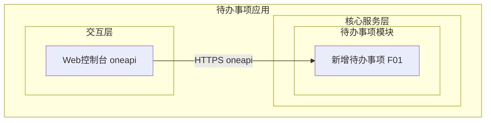
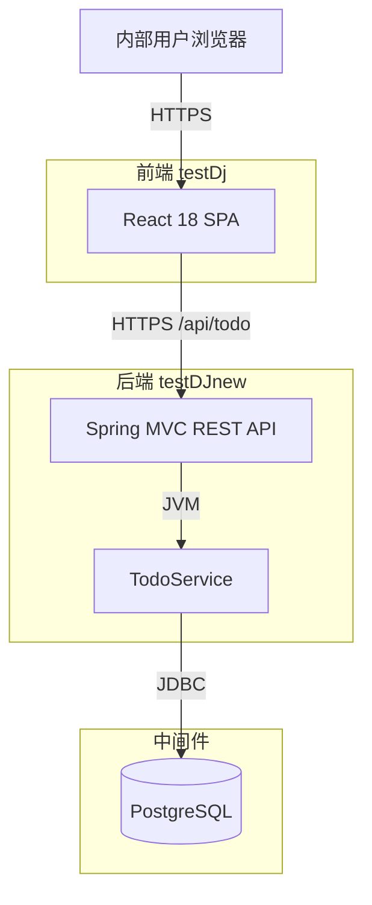
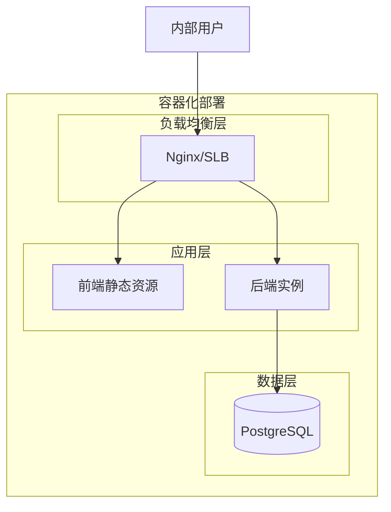
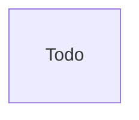
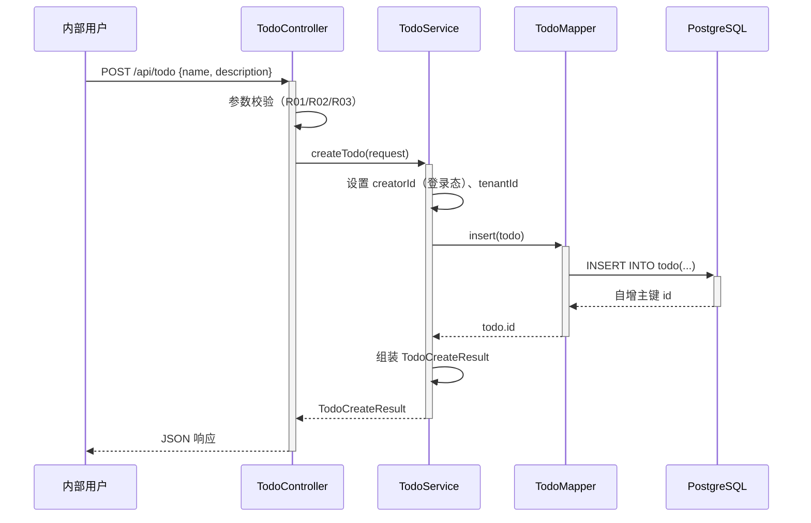

> **文档元信息**
>
> | 项目 | 内容 |
> |------|------|
> | 文档版本 | v1.0 |
> | 作者 | DTCoder |
> | 创建日期 | 2026-08-31 |
> | 需求来源 | 任务输入：帮助用户记录日常待办事项（核心功能：新增待办事项；任务信息：事项名称和描述；目标用户：内部用户；最小闭环：仅创建） |
> | 评审状态 | 待评审 |

# 待办事项记录（创建）系分设计

## 1. 需求与范围

### 1.1 背景与目标

内部用户需要一个轻量工具用于记录日常待办事项。本期目标是完成"新增待办事项"这一最小可用闭环：用户提交事项名称和描述，系统持久化后返回创建结果，即视为闭环完成。

核心目标：
- **新增待办事项**：用户填写事项名称与描述，提交后系统落库并返回创建结果。

### 1.2 核心功能

| ID | 功能 | 描述 |
|----|------|------|
| FR-TODO-01 | 新增待办事项 | 用户提交事项名称（必填）与描述（选填），系统持久化并返回待办事项ID与创建时间。 |

### 1.3 约束与非功能要求

| 约束项 | 指标 |
|--------|------|
| 目标用户 | 内部用户 |
| 并发 | 低并发，预估 < 10 并发用户 |
| 性能 | 创建接口 P95 < 500ms |
| 事项名称长度 | 1~200 字符 |
| 事项描述长度 | 0~2000 字符 |
| 字符编码 | UTF-8（utf8mb4） |
| 分页规范 | 本期不涉及（仅创建） |
| 登录态 | 假设前端已集成登录态，后端通过全局拦截器校验 |
| 租户隔离 | 预留 tenant_id，当前单租户 |
| 部署 | 容器化部署，单实例可横向扩展 |

### 1.4 排除范围

| 包含（本期） | 不包含（本期） |
|------|---------------|
| 新增待办事项（名称+描述） | 待办事项列表/分页查询 |
| 创建结果返回（ID+创建时间） | 编辑/修改待办事项 |
| | 删除待办事项 |
| | 标记完成/状态流转 |
| | 优先级、截止时间、提醒 |
| | 批量导入、外部系统对接 |
| | 移动端 App |

### 1.5 需求功能清单与优先级

| 编号 | 功能点 | 优先级 | PRD 原始描述/章节 | 备注 |
|------|--------|--------|-------------------|------|
| F01 | 新增待办事项（名称+描述，落库返回） | P0 | 核心功能：新增待办事项；任务信息：事项名称和描述；最小闭环：仅创建 | 唯一 P0 功能，构成最小闭环 |

### 1.6 假设与待确认项

| 编号 | 假设/待确认内容 | 当前假设 | 确认状态 |
|------|-----------------|----------|----------|
| A01 | 创建人是否记录 | 记录 creator_id（取登录态用户ID），用于内部可追溯 | 假设 |
| A02 | 租户隔离 | 预留 tenant_id，当前单租户、默认值 0 | 假设 |
| A03 | 后端技术栈 | Spring Boot 3 + PostgreSQL（对齐既有项目 testDJnew 约定） | 假设 |
| A04 | 前端技术栈 | React 18 + Ant Design 5（对齐既有项目 testDj 约定） | 假设 |
| A05 | 登录态校验 | 由全局拦截器统一校验，/api/todo 需登录态 | 假设 |
| A06 | 描述是否必填 | 描述选填，允许为空 | 假设 |
| A07 | 幂等性 | 不引入幂等键；前端按钮防抖 + 后端长度校验防误提交 | 假设 |
| A08 | 部署形态 | 容器化单实例，可横向扩展 | 假设 |

---

## 2. 架构与模块

### 2.1 功能架构



- **交互层**：内部用户通过浏览器访问 Web 控制台，提交"新增待办事项"表单。
- **核心服务层**：待办事项模块负责接收创建请求、参数校验、落库并返回结果。
- **扩展/集成层**：本期无外部系统集成。

**模块清单**

| 模块 | 职责 | 依赖 |
|------|------|------|
| 待办事项模块 | 接收新增待办请求、参数校验、持久化、返回创建结果 | PostgreSQL |

### 2.2 应用集成架构



**集成关系说明：**

| 调用方 | 被调用方 | 协议 | 接口类型 | 说明 |
|--------|----------|------|----------|------|
| 内部用户浏览器 | 前端 SPA | HTTPS | oneapi REST | 新增待办表单页 |
| 前端 SPA | 后端 API | HTTPS | oneapi REST | POST /api/todo |
| 后端 TodoService | PostgreSQL | JDBC | SQL | 待办事项落库 |

### 2.3 部署架构



**部署说明：**
- **负载均衡层**：Nginx 反向代理，前端静态资源与后端 API 同域名，按路径区分。
- **应用层**：前端静态资源部署于 Nginx；后端 Spring Boot 内嵌 Tomcat，端口 8080。内部低并发场景单实例即可，可按需横向扩展为多副本。
- **数据层**：PostgreSQL 单实例；数据量增长后可升级主从架构（本期不涉及）。

**部署架构选型方案对比：**

| 方案 | 优点 | 缺点 | 推荐 |
|------|------|------|------|
| 方案A：容器化单实例 | 成本最低、部署简单 | 单点（实例级） | ✅ 推荐 |
| 方案B：同城双机房双副本 | 高可用 | 成本高、内部低并发不必要 | |
| 方案C：Serverless | 弹性伸缩 | 冷启动、状态管理复杂 | |

**推荐理由**：内部用户、低并发、最小闭环，单实例已满足性能与可用性要求；架构无状态化设计保证后续可平滑横向扩展。

---

## 3. 数据模型与存储

### 3.1 实体清单

| 实体名称 | 实体说明 | 所属模块 | 与其他实体的关系 |
|----------|----------|----------|-----------------|
| Todo | 待办事项，记录事项名称、描述、创建人、租户 | 待办事项模块 | 独立实体，本期无关联实体 |

### 3.2 实体关系图



**模型说明：**
- 本期仅一个独立实体 `Todo`，无与其他实体的关系连线。
- 预留 `creator_id`（创建人）、`tenant_id`（租户隔离）字段，便于后续扩展为"按用户/租户查询"。
- 字段级详细定义见第 5 章功能模块设计。

### 3.3 缓存与 MQ

| 组件 | 用途 | 数据形态 |
|------|------|----------|
| - | 缓存 | 本期不涉及，原因：仅创建无聚合查询，无需缓存。 |
| - | MQ | 本期不涉及，原因：仅同步创建，无异步消费。 |

---

## 4. 接口设计

### 4.1 oneapi（Web 控制台接口）

| 编号 | 接口名称 | 方法 | 路径 | 模块 |
|------|----------|------|------|------|
| W01 | 新增待办事项 | POST | /api/todo | 待办事项模块 |

### 4.2 OpenAPI（对外接口）

本项不适用，原因：本期无第三方系统对接需求，所有接口均为 Web 控制台 oneapi 接口。

### 4.3 内部接口（Service 层）

| 编号 | 接口名称 | 类 | 方法签名 |
|------|----------|------|----------|
| S01 | 创建待办事项 | TodoService | TodoCreateResult createTodo(TodoCreateRequest request) |

### 4.4 集成接口（Integration 层）

本项不适用，原因：本期无外部系统集成。

---

## 5. 功能模块设计

### 5.1 全局约定

**错误码格式**：`TODO_{SEQ}`（四位序号）

| 模块 | 前缀 | 范围 |
|------|------|------|
| 待办事项 | TODO_ | 0001-0099 |

**通用出参结构**：
```json
{ "result": "OK", "msg": "SUCCESS", "data": {} }
```

### 5.2 待办事项模块 (F01)

#### 5.2.1 表结构设计

##### 5.2.1.1 todo（待办事项）

| 字段名 | 数据类型 | 约束 | 默认值 | 说明 |
|--------|----------|------|--------|------|
| id | bigint | PK, 自增 | - | 系统自增主键 |
| name | varchar(200) | NOT NULL | - | 事项名称 |
| description | varchar(2000) | - | NULL | 事项描述（选填） |
| creator_id | bigint | - | NULL | 创建人ID（取登录态用户ID） |
| tenant_id | bigint | NOT NULL | 0 | 租户ID，预留隔离，当前单租户默认0 |
| gmt_create | datetime | NOT NULL | CURRENT_TIMESTAMP | 创建时间 |
| gmt_modified | datetime | NOT NULL | CURRENT_TIMESTAMP | 修改时间 |

**索引：**
- IDX: `idx_todo_creator` (creator_id)
- IDX: `idx_todo_tenant` (tenant_id)

> 说明：本期仅创建无查询接口，索引为后续查询场景预留；按 db.md 规范，被索引列定义为 NOT NULL 或允许 NULL（tenant_id 设 NOT NULL 默认0，creator_id 允许 NULL 以兼容未登录兜底）。表名/字段名全小写、不超过 26 字符总长度建议。

##### 5.2.1.2 枚举与常量定义

本模块无枚举/常量定义，原因：仅创建无 status/type 等有限取值字段。

#### 5.2.2 接口详细设计

##### W01 新增待办事项

- **URI**: POST /api/todo
- **描述**: 创建一条待办事项，持久化名称与描述，返回事项ID与创建时间。
- **入参**:

| 参数名称 | 类型 | 是否必填 | 描述 |
|----------|------|----------|------|
| name | String | 是 | 事项名称，1~200 字符 |
| description | String | 否 | 事项描述，0~2000 字符 |

- **出参**:

| 参数名称 | 类型 | 描述 |
|----------|------|------|
| result | String | 结果 code |
| msg | String | 提示信息 |
| data.id | Long | 待办事项ID |
| data.name | String | 事项名称 |
| data.description | String | 事项描述 |
| data.creatorId | Long | 创建人ID |
| data.gmtCreate | DateTime | 创建时间（yyyy-MM-dd HH:mm:ss） |

- **错误码**:

| 错误码 | 说明 |
|--------|------|
| TODO_0001 | name 参数缺失或为空 |
| TODO_0002 | name 长度超过 200 字符 |
| TODO_0003 | description 长度超过 2000 字符 |
| TODO_0004 | 系统内部错误（落库失败） |

- **业务规则**: name 必填且去首尾空格后长度 1~200；description 选填，长度 0~2000；creator_id 从登录态获取；落库成功后返回完整创建结果。

- **请求示例**:
```json
{
  "name": "完成周报",
  "description": "本周工作总结与下周计划"
}
```

- **响应示例**:
```json
{
  "result": "OK",
  "msg": "SUCCESS",
  "data": {
    "id": 1001,
    "name": "完成周报",
    "description": "本周工作总结与下周计划",
    "creatorId": 88,
    "gmtCreate": "2026-08-31 10:20:30"
  }
}
```

#### 5.2.3 子功能详细设计

##### 5.2.3.1 新增待办事项 (F01)

- 处理时序图



**业务规则：**

| 规则编号 | 规则描述 | 校验时机 | 不满足时的处理 |
|----------|----------|----------|--------------|
| R01 | name 必填，去首尾空格后非空 | 请求时 | 返回 TODO_0001，提示"事项名称不能为空" |
| R02 | name 长度 1~200 字符 | 请求时 | 返回 TODO_0002，提示"事项名称长度超限" |
| R03 | description 长度 0~2000 字符 | 请求时 | 返回 TODO_0003，提示"描述长度超限" |
| R04 | creator_id 从登录态获取 | 服务端 | 未登录由全局拦截器拦截（401） |

**异常场景：**

| 异常场景 | 处理方式 |
|----------|----------|
| 数据库写入失败 | 返回 TODO_0004，提示"创建失败，请稍后重试"，记录 ERROR 日志含堆栈 |
| 数据库连接超时 | 返回 TODO_0004，触发连接池告警 |
| 未登录访问 | 全局拦截器返回 401，不进入业务逻辑 |

**并发控制（如涉及数据写入）：**
- 并发场景：多用户/同一用户快速重复点击提交新增待办。
- 控制策略：无并发风险，原因：每次创建为独立 INSERT，无唯一业务键冲突、无共享资源争用；前端按钮提交后防抖禁用，后端无额外加锁需求。
- 幂等设计对比：

| 方案 | 优点 | 缺点 | 推荐 |
|------|------|------|------|
| 方案A：无幂等键 | 实现简单、符合最小闭环 | 极端网络重试可能产生重复 | ✅ 推荐 |
| 方案B：客户端幂等键 | 防重复提交 | 增加唯一索引与复杂度 | |

  推荐理由：事项名称非唯一、内部低并发，重复提交概率低；前端防抖即可兜底，无需引入幂等键增加复杂度。

**状态机设计（如实体存在状态字段）：**
本项不适用，原因：本期仅创建，todo 表无 status 字段，无状态流转。

**技术选型方案对比（数据访问层）：**

| 方案 | 优点 | 缺点 | 推荐 |
|------|------|------|------|
| 方案A：Spring Data JPA | 开发快、类型安全、对齐项目栈 | 复杂查询灵活性一般 | ✅ 推荐 |
| 方案B：MyBatis | SQL 灵活、可控 | 单表 INSERT 收益不明显 | |
| 方案C：JdbcTemplate | 最轻量 | 缺少 ORM 映射 | |

推荐理由：单表 INSERT 场景，JPA 开发效率最高且与既有项目栈一致。

---

## 6. 非功能性需求设计

### 6.1 高可用性
- 单实例容器化部署，进程异常由容器编排自动重启；内部低并发场景可用性满足要求。
- 数据库单实例，故障时影响创建可用性；后续可升级主从（本期不涉及）。
- 本期无第三方依赖，无降级链路。

### 6.2 可扩展性
- 后端 Spring Boot 无状态，可按需增加副本横向扩展，前置 Nginx 负载均衡。
- 数据表预留 tenant_id/creator_id，支持后续按租户/用户维度查询扩展而无需改表结构。

### 6.3 稳定性/可靠性
- 入参长度上限校验（name≤200、description≤2000），防止超长输入导致 DB 写入异常。
- 数据库写入采用事务，失败回滚并返回错误码。
- 边界场景：description 为空字符串时正常落库；name 仅空格时按 R01 拦截。

### 6.4 安全性设计

#### 6.4.1 账户系统方案
本项不适用，原因：内部用户登录态由既有全局登录体系提供，本期不自实现登录/注册。

#### 6.4.2 授权 & 访问控制
- 水平权限检查：不涉及数据库跨用户查询，本期仅创建自身待办。
- 垂直权限检查：不涉及，本期无角色区分。
- 登录态检查：假设全局拦截器统一校验，/api/todo 需登录态，未登录返回 401。

#### 6.4.3 数据防护方案
- 敏感数据加密存储：不涉及，待办名称/描述为普通业务文本，非敏感个人信息。
- 敏感数据脱敏：不涉及。
- SQL 注入防护：使用 Spring Data JPA 参数化绑定（预编译），禁止字符串拼接 SQL。

### 6.5 监控/统计/日志/告警
- 接口监控：记录 POST /api/todo 请求量、耗时、成功率。
- 错误告警：TODO_0004（落库失败）出现即告警。
- 日志规范：创建成功记录 INFO（含 todoId、creatorId）；失败记录 ERROR 含堆栈。

---

## 7. 变更三板斧

### 7.1 可监控

| 监控点 | 指标 | 告警阈值 |
|--------|------|----------|
| 新增待办接口 | 耗时、成功率、QPS | P95 > 500ms / 成功率 < 99% |
| 落库失败 | TODO_0004 次数 | 出现即告警 |
| 数据库连接池 | 活跃连接数 | > 80% 池大小 |

### 7.2 可灰度

| 方案 | 描述 | 优点 | 缺点 | 推荐 |
|------|------|------|------|------|
| 方案A：特性开关 | 前端通过特性开关控制"新增待办"入口可见性 | 实现简单、可即时关闭 | 不分流量 | ✅ 推荐 |
| 方案B：按租户尾号灰度 | 按 tenant_id 尾号分流 | 粒度细 | 当前单租户无意义 | |
| 方案C：全量发布 | 直接全量上线 | 最快 | 风险高 | |

推荐理由：当前单租户、内部低风险，特性开关即可满足"可灰度、可快速关闭"要求；后续多租户化再启用按租户灰度。

### 7.3 可应急

| 开关 | 控制粒度 | 触发方式 | 效果 |
|------|----------|----------|------|
| todo.create.enabled | 全局 | 配置中心 | 关闭"新增待办"入口，前端隐藏按钮、后端拒绝请求 |

- 应急方案：发现严重缺陷时，通过特性开关 `todo.create.enabled=false` 关闭新增入口（前端隐藏、后端返回 TODO_0099 维护中），避免直接回滚代码；数据库变更采用只增不删策略，确保回滚后表结构兼容。
- 回滚关注点：本期为新增表、新增接口，无破坏性变更；回滚仅影响"无法创建"，不影响既有功能。

---

## 8. 方案检查（Step 9 checklist）

| 检查项 | 结果 | 说明 |
|------|------|------|
| 模块划分合理性检查 | 通过 | 单一待办事项模块、职责单一、无循环依赖、无超 50% 功能点模块 |
| 依赖关系合理性检查 | 通过 | 仅依赖 PostgreSQL，DB 异常时返回错误码并告警，保证不崩溃 |
| 单点问题检查（部署层面） | 通过（标注） | 单实例为已知取舍，内部低并发可接受；无状态可横向扩展 |
| 表模型设计范式检查 | 通过 | 满足第三范式，无冗余、无传递依赖；无反范式需求 |
| 隐私安全检查 | 通过 | 无敏感信息；name/description 为普通文本 |
| 兼容性检查（接口） | 通过 | 新增接口，无旧调用方兼容问题 |
| 兼容性检查（表） | 通过 | 新增表，无新旧版本兼容问题 |
| 数据迁移检查 | 通过 | 新增表无初始化数据需求 |
| 一致性检查（功能点） | 通过 | F01 在 5.2 有完整设计 |
| 一致性检查（表） | 通过 | Todo 实体在 5.2.1.1 有完整表结构 |
| 一致性检查（接口） | 通过 | W01 在 5.2.2 有详细定义；S01 在 4.3 已列 |
| 一致性检查（枚举） | 不适用 | 本模块无枚举字段 |
| 状态机完整性检查 | 不适用 | 无状态字段，原因：仅创建 |
| 并发风险检查 | 通过 | 无并发风险，详见 5.2.3.1 并发控制 |
| 单点问题检查（定时任务层面） | 不适用 | 本期无定时任务 |
| 非功能性设计可行性检查 | 通过 | 单实例 + 事务 + 参数校验，落地可行 |
| 变更三板斧-可监控 | 通过 | 接口埋点 + 落库失败告警，可行 |
| 变更三板斧-可灰度 | 通过 | 特性开关方案可行，已推荐 |
| 变更三板斧-可应急 | 通过 | 开关关闭入口 + 只增不删，方案可行 |

---

## 附录：需求追溯矩阵

| 需求点 | 来源 | 对应功能/接口 | 设计位置 |
|--------|------|---------------|----------|
| 帮助用户记录日常待办事项 | 目标 | F01 新增待办 | 1.1 / 5.2 |
| 核心功能：新增待办事项 | 核心功能 | F01 / W01 POST /api/todo | 5.2.2 / 5.2.3.1 |
| 任务信息：事项名称和描述 | 任务信息 | name + description 入参 | 5.2.1.1 / 5.2.2 |
| 目标用户：内部用户 | 目标用户 | oneapi 接口、登录态校验 | 2.2 / 6.4.2 |
| 最小闭环：仅创建 | 最小闭环 | 仅 W01，查询/编辑/删除排除 | 1.4 / 4.1 |
