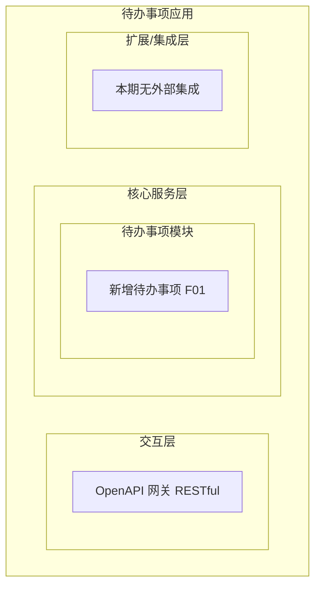
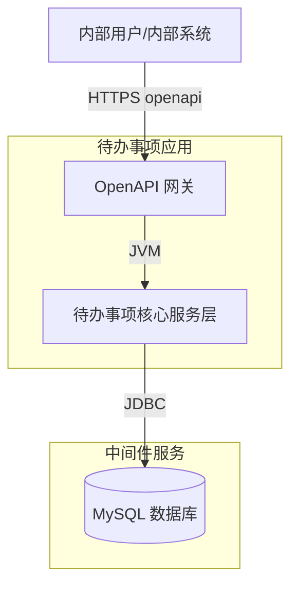
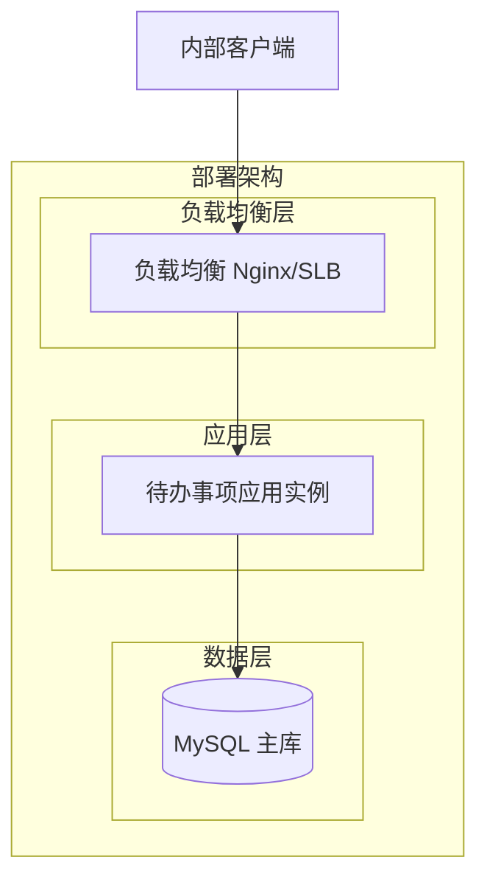
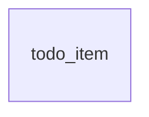
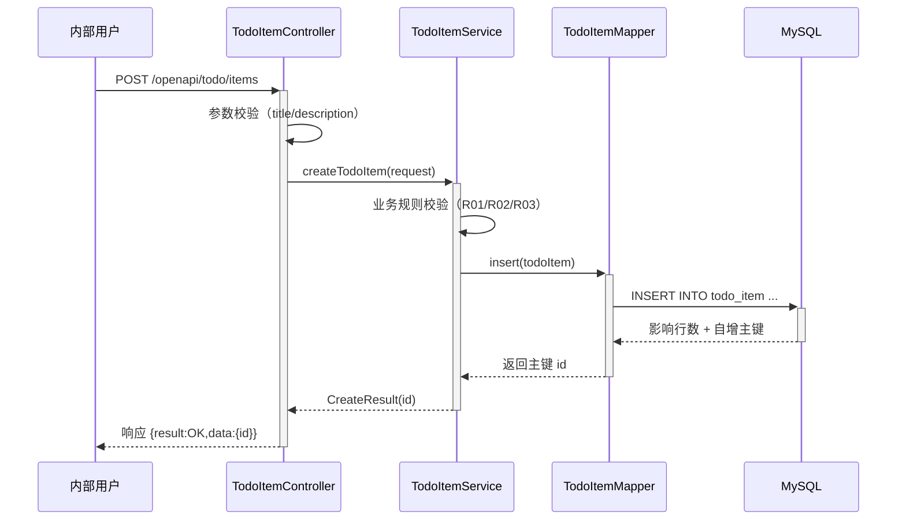
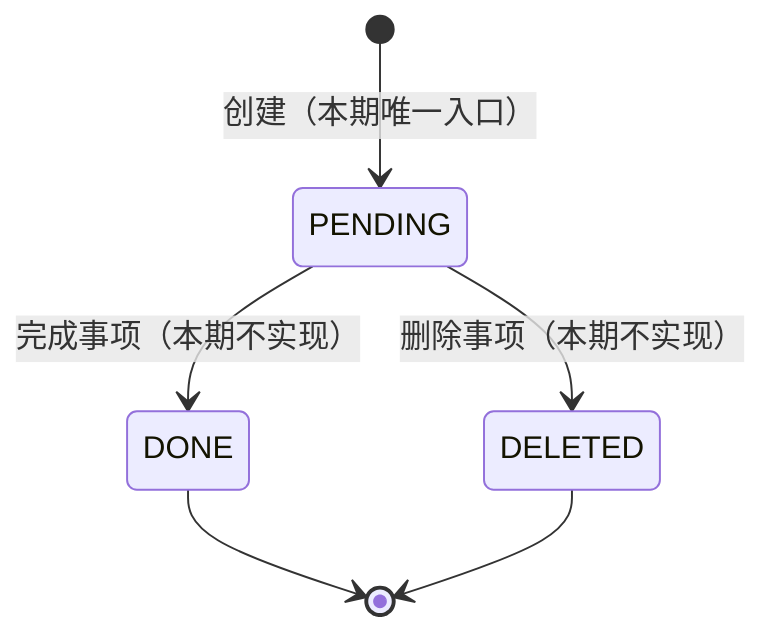

> **文档元信息**
>
> | 项目 | 内容 |
> |------|------|
> | 文档版本 | v1.0 |
> | 作者 | AiWork |
> | 创建日期 | 2026-08-31 |
> | 需求来源 | 任务输入：帮助用户记录日常待办事项（核心功能：新增待办事项） |
> | 评审状态 | 待评审 |

# 待办事项（新增）系分设计

## 1. 需求与范围

- **背景与目标**：为内部用户提供一个轻量化的日常待办事项记录工具，帮助其快速登记需要处理的事项，避免遗忘。本期聚焦"仅创建"这一最小闭环，先跑通"录入事项 → 落库 → 返回结果"链路，后续迭代再扩展查询、完成、删除等能力。
- **核心功能**：新增待办事项。用户提交事项名称（title）和描述（description），系统校验并持久化，返回创建结果（含生成的事项 ID）。
- **约束与非功能要求**：
  - 目标用户：内部用户（假定已具备统一登录态，登录体系不在本期范围）。
  - 事务信息：事项名称、描述。
  - 可用性：单实例即可满足内部用户量；预留水平扩展能力。
  - 安全性：仅内部用户可调用；接口入参校验防止 XSS/超长注入；描述为长文本需限长。
  - 性能：单次创建响应 < 200ms（本地数据库）。
- **排除范围**：
  - 待办事项的查询、修改、完成、删除、分类、提醒、到期时间等均不在本期。
  - 用户注册/登录/权限体系不在本期（假设：调用方已通过内部统一登录，身份信息由请求上下文带入）。
  - 多端同步、消息通知、附件上传不在本期。

### 需求功能清单与优先级

| 编号 | 功能点 | 优先级 | PRD 原始描述/章节 | 备注 |
|------|--------|--------|-------------------|------|
| F01 | 新增待办事项 | P0 | 核心功能：新增待办事项 | 入参：事项名称 + 描述 |
| F02 | 入参校验 | P0 | 任务信息：事项名称和描述 | 名称必填、长度限制；描述选填、长度限制 |
| F03 | 创建结果返回 | P0 | 最小闭环：仅创建 | 返回生成的事项 ID |

### 假设与待确认项

| 编号 | 假设/待确认内容 | 当前假设 | 确认状态 |
|------|-----------------|----------|----------|
| A01 | 用户身份来源未明确 | 假设：调用方已通过内部统一登录，operator 由请求上下文（如 header/拦截器）带入，本期不实现登录 | 待确认 |
| A02 | 待办事项是否需归属人/租户字段 | 假设：需要记录创建人（creator），便于后续按人查询；多租户预留 tenant_id | 待确认 |
| A03 | 事项是否需要状态字段 | 假设：预留 status 字段（默认"待处理"），便于后续扩展完成/删除，本期仅写入默认值 | 待确认 |
| A04 | 技术栈未指定 | 假设：单体应用、Spring Boot + MySQL（内部工具典型栈），RESTful 接口 | 待确认 |
| A05 | 部署形态未指定 | 假设：容器化部署、单实例起步 | 待确认 |

## 2. 架构与模块

本应用为单体应用（内部工具、单一最小闭环，单体即可满足，无需多服务拆分）。分层边界：Controller（接口与参数校验）→ Service（业务规则）→ Repository/Mapper（数据访问）。

### 功能架构

- 交互层说明：通过 OpenAPI（RESTful）对外暴露"新增待办事项"接口，供内部用户/内部系统调用。
- 核心服务层说明：待办事项模块负责入参校验、业务规则校验、数据落库并返回结果。
- 扩展/集成层说明：本期不涉及外部系统集成。

**模块清单**

| 模块 | 职责 | 依赖 |
|------|------|------|
| 待办事项模块 | 接收新增请求、校验、持久化待办事项、返回创建结果 | MySQL 数据库 |

### 应用集成架构


**集成关系说明：**

| 调用方 | 被调用方 | 协议 | 接口类型 | 说明 |
|--------|----------|------|----------|------|
| 内部用户/内部系统 | 待办事项应用 OpenAPI 网关 | HTTPS | openapi REST | 新增待办事项 |
| 待办事项核心服务层 | MySQL 数据库 | JDBC | SQL | 插入待办事项记录 |

### 部署架构


**部署说明：**
- **负载均衡层**：内部用户量小，本期可使用 Nginx 单实例；水平扩展时接入 SLB。
- **应用层**：容器化部署，单实例起步；后续流量增长可多副本无状态横向扩展（应用无本地状态）。
- **数据层**：MySQL 单主库起步；数据增长后可主从分离，写仍走主库。

## 3. 数据模型与存储

### 实体清单

| 实体名称 | 实体说明 | 所属模块 | 与其他实体的关系 |
|----------|----------|----------|-----------------|
| todo_item | 待办事项记录，存储单条待办的名称、描述、状态、创建人等 | 待办事项模块 | 无关联实体（本期最小闭环，无分类/标签等） |

### 实体关系图

本期仅一个实体，无实体间关系。

**模型说明：**
- 本期为最小闭环，待办事项独立存储，不与其它实体关联。
- 预留 creator、tenant_id、status 字段以支持后续归属人查询、多租户隔离与状态流转，但本期仅写入默认值，不展开相关业务。

## 4. 接口设计

### 4.1 oneapi（Web 控制台接口）
本项不适用，原因：本期不提供 Web 控制台，仅对外 RESTful 接口。

### 4.2 OpenAPI（对外接口）

| 编号 | 接口名称 | 方法 | 路径 | 模块 |
|------|----------|------|------|------|
| O01 | 新增待办事项 | POST | /openapi/todo/items | 待办事项模块 |

### 4.3 内部接口（Service 层）

| 编号 | 接口名称 | 类 | 方法签名 |
|------|----------|------|----------|
| S01 | 创建待办事项 | TodoItemService | CreateResult createTodoItem(CreateTodoRequest request) |

### 4.4 集成接口（Integration 层）
本项不适用，原因：本期无外部系统集成。

## 5. 功能模块设计

### 5.1 全局约定
- **错误码格式**：`{MODULE}_{SEQ}`，模块名 `TODO`，如 `TODO_001`。
- **通用出参结构**：`{ "result": "OK"/错误码, "msg": "提示信息", "data": {} }`。

| 模块 | 模块编码 | 错误码前缀 |
|------|----------|-----------|
| 待办事项模块 | TODO | TODO_ |

### 5.2 待办事项模块

#### 5.2.1 表结构设计
##### 5.2.1.1 todo_item（待办事项表）

| 字段名 | 数据类型 | 约束 | 默认值 | 说明 |
|--------|----------|------|--------|------|
| id | bigint | PK, 自增 | - | 系统自增主键 |
| tenant_id | varchar(32) | NOT NULL | '' | 租户标识，多租户隔离，本期默认值由上下文带入或留空 |
| title | varchar(100) | NOT NULL | - | 待办事项名称 |
| description | varchar(1000) | NOT NULL | '' | 待办事项描述，本期选填，存空串 |
| status | varchar(16) | NOT NULL | 'PENDING' | 事项状态，本期固定写入 PENDING |
| creator | varchar(64) | NOT NULL | '' | 创建人标识，由登录上下文带入 |
| gmt_create | datetime | NOT NULL | CURRENT_TIMESTAMP | 创建时间 |
| gmt_modified | datetime | NOT NULL | CURRENT_TIMESTAMP | 修改时间 |

**索引：**
- PK: `pk_todo_item` (id) 主键
- IDX: `idx_todo_item_tenant_creator` (tenant_id, creator) 用于后续按租户+创建人查询
- IDX: `idx_todo_item_gmt_create` (gmt_create) 用于后续按时间排序/清理

##### 5.2.1.2 枚举与常量定义

| 枚举名称 | 取值 | 含义 | 关联字段 |
|----------|------|------|----------|
| TodoStatus | PENDING | 待处理（本期默认） | todo_item.status |
| TodoStatus | DONE | 已完成（本期不使用，预留） | todo_item.status |
| TodoStatus | DELETED | 已删除（本期不使用，预留） | todo_item.status |

#### 5.2.2 接口详细设计
##### O01 新增待办事项

- **URI**: POST /openapi/todo/items
- **描述**: 内部用户创建一条待办事项，系统校验后落库并返回生成的事项 ID。
- **入参**:

| 参数名称 | 类型 | 是否必填 | 描述 |
|----------|------|----------|------|
| title | String | 是 | 事项名称，1-100 字符 |
| description | String | 否 | 事项描述，最长 1000 字符，为空时存空串 |

- **出参**:

| 参数名称 | 类型 | 描述 |
|----------|------|------|
| result | String | 结果 code，成功为 OK |
| msg | String | 提示信息 |
| data | Object | 业务数据 |
| data.id | Long | 生成的事项 ID |

- **错误码**:

| 错误码 | 说明 |
|--------|------|
| TODO_001 | 事项名称不能为空 |
| TODO_002 | 事项名称超过 100 字符 |
| TODO_003 | 事项描述超过 1000 字符 |
| TODO_999 | 系统异常 |

- **业务规则**: 名称必填且长度 ≤100；描述长度 ≤1000；状态默认 PENDING；creator、tenant_id 由请求上下文带入；落库成功后返回生成主键 ID。

- **请求示例**:
```json
{
  "title": "完成周报",
  "description": "本周工作总结，周五前提交"
}
```

- **响应示例**:
```json
{
  "result": "OK",
  "msg": "SUCCESS",
  "data": {
    "id": 1001
  }
}
```

#### 5.2.3 子功能详细设计
##### 5.2.3.1 新增待办事项（F01）

- 处理时序图


**业务规则：**
| 规则编号 | 规则描述 | 校验时机 | 不满足时的处理 |
|----------|----------|----------|--------------|
| R01 | title 不能为空 | 创建时 | 返回 TODO_001，提示"事项名称不能为空" |
| R02 | title 长度 ≤100 | 创建时 | 返回 TODO_002，提示"事项名称超过 100 字符" |
| R03 | description 长度 ≤1000 | 创建时 | 返回 TODO_003，提示"事项描述超过 1000 字符" |
| R04 | status 默认 PENDING | 创建时 | 由系统写入默认值，无需用户传入 |
| R05 | creator/tenant_id 由上下文带入 | 创建时 | 缺失时按默认规则赋值，不阻断创建 |

**异常场景：**
| 异常场景 | 处理方式 |
|----------|----------|
| 数据库写入失败（连接异常/主键冲突等） | 捕获异常，返回 TODO_999，记录日志 |
| 入参 JSON 格式错误 | 框架层统一返回参数解析错误，提示"请求格式错误" |
| 上下文缺失 creator | 按 A01 假设，写入空串默认值并记录告警日志，不阻断创建 |

**并发控制（如涉及数据写入）：**
- 并发场景：多名内部用户并发创建待办事项。
- 控制策略：无并发风险，原因：每次创建为独立 INSERT，主键自增，无共享资源竞争；无需加锁。

**状态机设计（如实体存在状态字段）：**


**状态流转规则：**
| 当前状态 | 目标状态 | 流转条件 | 前置校验 | 触发动作 |
|----------|----------|----------|----------|----------|
| （初始） | PENDING | 用户执行新增 | R01-R03 | 写入记录、返回 ID |
| PENDING | DONE | （本期不实现） | - | - |
| PENDING | DELETED | （本期不实现） | - | - |

> 注：本期仅实现"初始 → PENDING"，DONE/DELETED 为预留状态，避免后续扩展时改表。

### 5.3 技术选型方案对比

| 方案 | 优点 | 缺点 |
|------|------|------|
| 方案A：Spring Boot 单体 + MySQL | 内部工具典型栈、生态成熟、开发快、运维简单 | 单体扩展上限有限（本期足够） |
| 方案B：Node.js 单体 + MySQL | 异步 IO、前后端同语言 | 团队/生态需评估，无明显收益 |
| 方案C：Serverless 函数 + MySQL | 弹性伸缩、免运维 | 冷启动、内部工具过重 |

**推荐：方案A**，理由：内部工具、单一最小闭环，Spring Boot 单体最成熟、运维最简单，满足需求且便于后续迭代扩展。

## 6. 非功能性需求设计

### 6.1 高可用性
本期为内部工具最小闭环，单实例即可满足。下游仅 MySQL，MySQL 异常时创建失败并返回 TODO_999，不影响其它系统（无被依赖方）。后续可引入主从与多副本提升可用性。

### 6.2 可扩展性
应用无本地状态，支持水平扩容多副本；数据层可主从分离，写仍走主库。接口按 `/openapi/todo/*` 前缀划分，便于后续按子域拆分。

### 6.3 稳定性/可靠性
- 入参长度上限校验，防止超长写入导致 DB 异常。
- description 默认空串而非 NULL，避免空值处理二义性。
- 数据库写入异常被捕获并降级返回错误码，不向调用方抛栈。

### 6.4 安全性设计
#### 6.4.1 账户系统方案
本期不实现登录，假设：调用方已通过内部统一登录（A01）。后续接入统一鉴权拦截器。

#### 6.4.2 授权&访问控制
##### 6.4.2.1 是否实现水平权限检查
本期为"仅创建"且记录 creator，暂不涉及跨用户资源访问；后续查询/修改时需按 creator/tenant_id 做水平权限校验。

##### 6.4.2.2 是否实现垂直权限检查
本期不涉及角色权限；内部用户均可创建待办。后续如需管理类操作再引入角色校验。

##### 6.4.2.3 是否检查登录态
假设：通过全局统一拦截器校验登录态并注入 creator；本期未实现登录则放行并记录告警（A01）。

#### 6.4.3 数据防护方案
##### 6.4.3.1 是否对敏感数据加密存储
本期待办事项为日常记录，非敏感数据，不加密存储。若后续涉及隐私内容再评估。

##### 6.4.3.2 是否对敏感数据展示进行脱敏
本项不适用，原因：本期无敏感字段、无展示页面。

### 6.5 监控/统计/日志/告警
- 关键监控点：新增接口 QPS、成功率、响应耗时、TODO_999 错误数。
- 日志：请求入参（title 截断）、creator、返回 id、异常堆栈。
- 告警：TODO_999 错误率超阈值告警。

## 7. 变更三板斧

### 7.1 可监控
对"新增待办事项"接口埋点：调用次数、成功/失败结果、处理耗时；数据库写入耗时与异常埋点；TODO_999 上报告警。

### 7.2 可灰度
本期为全新功能首发，无旧逻辑对照，不涉及灰度对比。后续扩展（如完成/删除）如需灰度，可按 creator 尾号或 tenant_id 灰度引流。

### 7.3 可应急
- 预留功能开关 `todo.create.enabled`，异常时可快速关闭创建入口，返回友好提示，避免数据库压力传导。
- 应急回滚：本期为新增表 + 新增接口，回滚不涉及旧数据兼容；必要时下线接口即可，表保留不动。

## 8. 方案检查（Step 9 checklist）

| 检查项 | 结果 | 说明 |
|------|------|------|
| 模块划分合理性检查 | 通过 | 单一待办事项模块，职责单一，无循环依赖 |
| 依赖关系合理性检查 | 通过 | 仅依赖 MySQL，下游异常返回错误码不影响自身可用 |
| 单点问题检查（部署层面） | 通过（标注） | 本期单实例为已知取舍，内部工具可接受；预留水平扩展 |
| 表模型设计范式检查 | 通过 | 满足第三范式，无冗余依赖字段 |
| 隐私安全检查 | 通过 | 无敏感字段需脱敏 |
| 兼容性检查（接口） | 不适用 | 全新接口，无旧调用方 |
| 兼容性检查（表） | 不适用 | 全新表 |
| 数据迁移检查 | 通过 | 全新表，无初始化数据需求 |
| 一致性检查（功能点） | 通过 | F01/F02/F03 在 5.2 均有对应设计 |
| 一致性检查（表） | 通过 | todo_item 实体在 5.2.1 有完整表结构 |
| 一致性检查（接口） | 通过 | O01/S01 在 5.2.2 有详细定义 |
| 一致性检查（枚举） | 通过 | TodoStatus 与 status 字段说明一致 |
| 状态机完整性检查 | 通过 | PENDING/DONE/DELETED 流转完整，无孤岛（DONE/DELETED 为预留但已标注） |
| 并发风险检查 | 通过 | 独立 INSERT 无并发风险 |
| 单点问题检查（定时任务层面） | 不适用 | 本期无定时任务 |
| 非功能性设计可行性检查 | 通过 | 单实例 + 容器化 + 预留扩展，落地可行 |
| 变更三板斧-可监控 | 通过 | 接口/DB 埋点设计可行 |
| 变更三板斧-可灰度 | 不适用 | 全新首发，无旧逻辑对比；后续按 creator/tenant 灰度 |
| 变更三板斧-可应急 | 通过 | 功能开关 + 下线接口，简单快速 |

> 本期为全新最小闭环，所有"全新"项检查标注为不适用或通过，无修复项。
