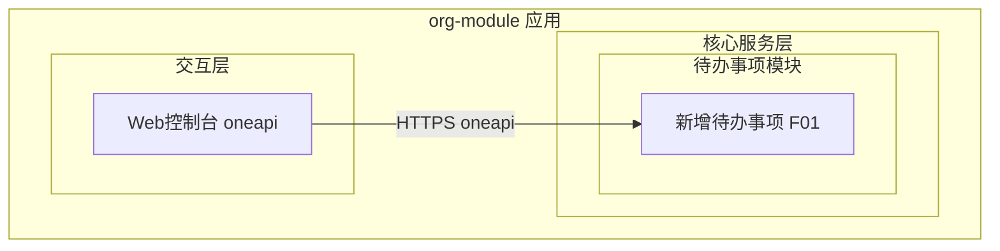
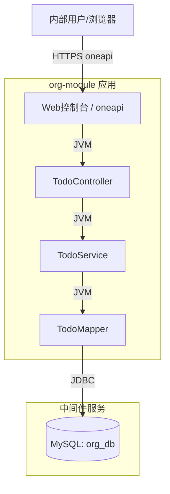
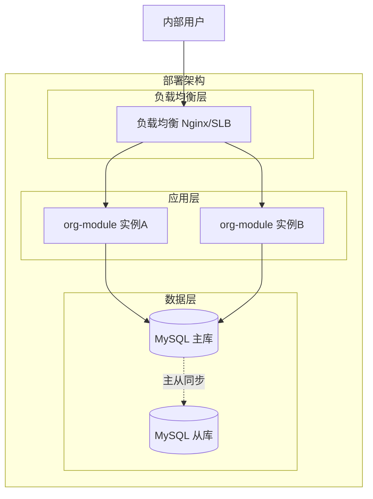
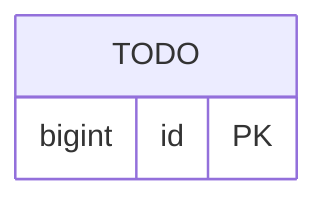
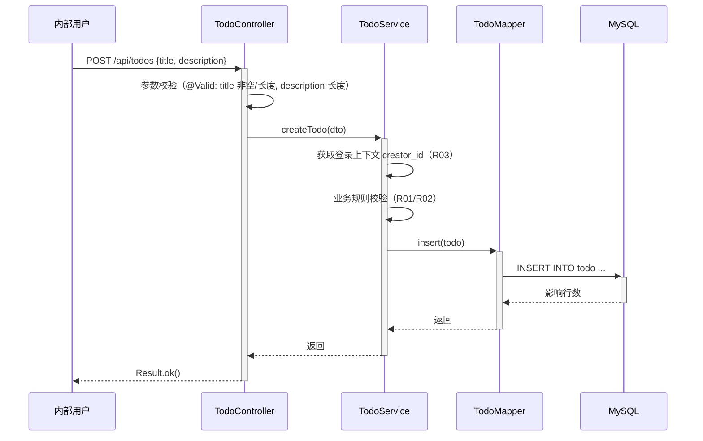

> **文档元信息**
>
> | 项目 | 内容 |
> |------|------|
> | 文档版本 | v1.0 |
> | 作者 | AiWork |
> | 创建日期 | 2026-09-01 |
> | 需求来源 | 1.0 T2 — 目标：帮助用户记录日常待办事项 |
> | 评审状态 | 待评审 |

# 待办事项（Todo）系分设计

## 1. 需求与范围

- **背景与目标**：内部用户在日常工作中需要快速记录待办事项，以便后续跟踪与处理。本需求（1.0 T2）为待办事项能力的首个迭代，目标是为内部用户提供一个最小可用的「记录待办」入口，形成"创建即落库"的最小闭环。
- **核心功能**：新增待办事项。用户提交事项名称与描述，系统持久化生成一条待办记录。
- **约束与非功能要求**：
  - 目标用户为内部用户，通过内部 Web 控制台访问，访问前需具备登录态（假设：复用现有应用登录上下文）。
  - 事项名称为必填、描述为选填，需对长度做约束校验。
  - 待办记录归属创建人（水平权限隔离依据）。
  - 沿用现有 `org-module` 应用技术栈（Spring Boot 3.2.5 + MyBatis-Plus + MySQL），不引入新中间件。
- **排除范围**（本迭代不实现，后续迭代展开）：
  - 待办事项的编辑、完成/状态流转、删除、列表查询、详情查看、搜索/筛选。
  - 待办提醒/通知、到期时间、优先级、分类标签。
  - 对外 OpenAPI、跨系统集成。

### 需求功能清单与优先级

| 编号 | 功能点 | 优先级 | PRD 原始描述/章节 | 备注 |
|------|--------|--------|-------------------|------|
| F01 | 新增待办事项（事项名称 + 描述） | P0 | 需求：「新增待办事项」「任务信息：事项名称和描述」「最小闭环：仅创建」 | 本迭代唯一交付功能点 |

### 假设与待确认项

| 编号 | 假设/待确认内容 | 当前假设 | 确认状态 |
|------|-----------------|----------|----------|
| A01 | 创建人身份来源 | 从应用登录上下文获取 `creator_id`（内部用户 ID），不依赖前端传值，避免伪造 | 待确认 |
| A02 | 是否已有统一登录/鉴权拦截器 | 复用现有应用登录态校验机制（与 EmployeeController 等接口一致的鉴权方式） | 待确认 |
| A03 | 描述字段是否必填 | 描述为选填，允许为空；长度上限 1000 字符 | 待确认 |
| A04 | 事项名称唯一性 | 名称不要求唯一，允许重复（用户可记多条同名待办） | 待确认 |
| A05 | 是否需要分租户 | 内部单租户场景，暂不引入 `tenant_id` 隔离 | 待确认 |

## 2. 架构与模块

### 功能架构



- 交互层说明：内部用户经 Web 控制台调用 oneapi（`/api` 前缀）REST 接口。
- 核心服务层说明：待办事项模块负责待办记录的创建与落库，职责单一。
- 扩展/集成层说明：本迭代无外部系统集成。

**模块清单**

| 模块 | 职责 | 依赖 |
|------|------|------|
| 待办事项模块（todo） | 接收待办创建请求、参数校验、生成待办记录并持久化 | MySQL 数据库 |

### 应用集成架构



**集成关系说明：**

| 调用方 | 被调用方 | 协议 | 接口类型 | 说明 |
|--------|----------|------|----------|------|
| 内部用户浏览器 | org-module Web控制台 | HTTPS | oneapi REST | 创建待办事项 |
| org-module TodoMapper | MySQL org_db | JDBC | SQL | 待办记录读写 |

### 部署架构



**部署说明：**
- **负载均衡层**：Nginx/SLB 流量分发，假设内部环境为云原生/容器化部署，多实例无状态。
- **应用层**：org-module 多副本部署，待办创建为无状态请求，可水平扩展。
- **数据层**：MySQL 主从架构，待办写入走主库，读写分离可承载后续查询迭代。

## 3. 数据模型与存储

### 实体清单

| 实体名称 | 实体说明 | 所属模块 | 与其他实体的关系 |
|----------|----------|----------|-----------------|
| todo | 待办事项记录，存储事项名称、描述与创建人 | 待办事项模块 | 无关联实体（本迭代单实体，创建人不强关联用户表） |

### 实体关系图



> 本迭代仅一个实体，无跨实体关系，故 erDiagram 仅展示单实体框。`creator_id` 为创建人 ID 冗余字段，本迭代不与用户/员工表建立外键关联（遵循 db.md「禁止使用外键」规范）。

**模型说明：**
- 待办记录与创建人通过 `creator_id` 逻辑关联，不建立物理外键，便于后续用户体系演进。
- 表结构字段级详细定义见第 5 章。

## 4. 接口设计

### 4.1 oneapi（Web 控制台接口）

| 编号 | 接口名称 | 方法 | 路径 | 模块 |
|------|----------|------|------|------|
| W01 | 新增待办事项 | POST | /api/todos | 待办事项模块 |

### 4.2 OpenAPI（对外接口）

本迭代不涉及对外接口。原因：目标用户为内部用户，仅经 Web 控制台访问。

### 4.3 内部接口（Service 层）

| 编号 | 接口名称 | 类 | 方法签名 |
|------|----------|------|----------|
| S01 | 创建待办事项 | TodoService | `void createTodo(TodoDTO dto)` |

### 4.4 集成接口（Integration 层）

本迭代不涉及集成接口。原因：无外部系统调用。

## 5. 功能模块设计

### 5.1 全局约定

- **错误码格式**：`{MODULE}_{SEQ}`，本模块 MODULE = `TODO`，如 `TODO_001`。
- **通用出参结构**：沿用现有 `Result<T>`，结构为 `{code, msg, data}`，成功 `code=200, msg="SUCCESS"`。
- **模块映射表**：

| 模块 | 错误码前缀 | 出参结构 |
|------|-----------|----------|
| 待办事项模块 | TODO | Result<T> {code, msg, data} |

### 5.2 待办事项模块

#### 5.2.1 表结构设计

##### 5.2.1.1 todo（待办事项表）

| 字段名 | 数据类型 | 约束 | 默认值 | 说明 |
|--------|----------|------|--------|------|
| id | bigint | PK, 自增 | - | 系统自增主键 |
| title | varchar(200) | NOT NULL | - | 事项名称 |
| description | varchar(1000) | NULL | NULL | 事项描述（选填） |
| creator_id | bigint | NOT NULL | - | 创建人ID（内部用户ID，来自登录上下文） |
| version | bigint | NOT NULL | 0 | 乐观锁版本号（为后续编辑迭代预留，创建时置 0） |
| is_deleted | tinyint | NOT NULL | 0 | 逻辑删除 0=否 1=是 |
| created_at | datetime | NOT NULL | CURRENT_TIMESTAMP | 创建时间 |
| updated_at | datetime | NOT NULL | CURRENT_TIMESTAMP | 修改时间（ON UPDATE CURRENT_TIMESTAMP） |

**索引：**
- PK: `pk_todo` (id)（主键）
- IDX: `idx_todo_creator` (creator_id)（按创建人检索，为后续列表查询迭代预留）

> 说明：表名 `todo`、字段名均小写+下划线，字符总长度 < 26，符合 db.md 命名规范；主键为整形单列自增，无联合主键、无外键、无 enum、使用 datetime 而非 timestamp，均符合 db.md 结构规范。

##### 5.2.1.2 枚举与常量定义

本模块无枚举/常量定义。原因：本迭代为仅创建闭环，不含状态字段，故无有限取值枚举。

#### 5.2.2 接口详细设计

##### W01 新增待办事项

- **URI**: POST `/api/todos`
- **描述**: 内部用户创建一条待办事项记录，落库后返回成功。
- **入参**:

| 参数名称 | 类型 | 是否必填 | 描述 |
|----------|------|----------|------|
| title | String | 是 | 事项名称，长度 1-200 |
| description | String | 否 | 事项描述，长度 0-1000 |

- **出参**:

| 参数名称 | 类型 | 描述 |
|----------|------|------|
| code | int | 结果 code，200 为成功 |
| msg | String | 提示信息 |
| data | Object | 业务数据（创建成功时为空对象） |

- **错误码**:

| 错误码 | 说明 |
|--------|------|
| TODO_001 | 事项名称不能为空或长度超出 200 |
| TODO_002 | 事项描述长度超出 1000 |
| TODO_003 | 未获取到登录用户信息，无法确定创建人 |

- **业务规则**: 事项名称必填且长度 1-200；描述选填且长度 ≤1000；创建人 ID 由登录上下文注入，前端不传；名称不要求唯一。

- **请求示例**:
```json
{
  "title": "完成季度汇报",
  "description": "整理 Q3 数据并提交评审"
}
```

- **响应示例**:
```json
{
  "code": 200,
  "msg": "SUCCESS",
  "data": null
}
```

#### 5.2.3 子功能详细设计

##### 5.2.3.1 新增待办事项（F01）

- 处理时序图


**业务规则：**

| 规则编号 | 规则描述 | 校验时机 | 不满足时的处理 |
|----------|----------|----------|--------------|
| R01 | 事项名称 title 非空且长度 1-200 | 创建时（Controller 入参校验） | 返回 TODO_001，提示"事项名称不能为空或长度超出 200" |
| R02 | 事项描述 description 长度 ≤1000（允许为空） | 创建时（Controller 入参校验） | 返回 TODO_002，提示"事项描述长度超出 1000" |
| R03 | 必须能从登录上下文获取创建人 creator_id | Service 创建时 | 返回 TODO_003，提示"未获取到登录用户信息" |

**异常场景：**

| 异常场景 | 处理方式 |
|----------|----------|
| 参数校验失败（title/description 不合规） | 由全局异常处理器捕获 `MethodArgumentNotValidException`，返回对应错误码与提示 |
| 登录上下文缺失（未登录或获取用户信息失败） | Service 抛出 `BusinessException(TODO_003)`，全局处理器返回 401/TODO_003 |
| 数据库写入失败（连接异常/约束冲突） | 事务回滚，抛出运行时异常，全局处理器返回 500 |

**并发控制（如涉及数据写入）：**
- 并发场景：多个内部用户同时创建待办事项，各自插入独立行，无共享资源争抢。
- 控制策略：无并发风险，原因：创建操作为独立行 INSERT，名称不要求唯一，无唯一约束冲突点。

**状态机设计（如实体存在状态字段）：**

本项不适用，原因：本迭代为仅创建闭环，`todo` 表不含状态字段，不存在状态流转。

### 5.3 跨模块时序

本项不适用，原因：本迭代仅涉及待办事项模块自身创建链路，无跨模块调用。

## 6. 非功能性需求设计

### 6.1 高可用性
org-module 为多实例无状态部署（见部署架构），单个实例故障时负载均衡自动剔除，不影响创建可用性。本功能仅依赖 MySQL 主库写入，无第三方依赖，可用性与应用整体一致。

### 6.2 可扩展性
待办创建为无状态请求，应用层可随 org-module 整体水平扩缩容；数据层单表预计数据量可控（内部用户日常待办），暂不分库分表。后续数据量增长可按 `creator_id` 分表，需提前评估历史迁移（参见 db.md 分表建议）。

### 6.3 稳定性/可靠性
创建接口为简单写入，边界场景（空 title、超长 description、登录态缺失）均由 R01-R03 规则覆盖并返回明确错误码，不会产生脏数据。数据库事务保证写入原子性。

### 6.4 安全性设计
#### 6.4.1 账户系统方案
复用现有 org-module 应用登录体系（内部用户）。假设：与 EmployeeController 等现有接口一致的登录态校验机制，本迭代不新实现登录/注册。

#### 6.4.2 授权&访问控制
##### 6.4.2.1 是否实现水平权限检查
是。`todo` 表含 `creator_id`，后续查询/操作迭代需按 `creator_id` 校验数据归属（水平权限）。当前仅创建闭环，`creator_id` 由登录上下文注入而非前端传入，本身即防止越权创建他人待办。

##### 6.4.2.2 是否实现垂直权限检查
本项暂不适用，原因：内部用户角色体系沿用应用既有方案，本迭代不引入新角色/权限点。

##### 6.4.2.3 是否检查登录态
是。假设通过全局统一拦截器校验登录态（与现有接口一致）；未登录请求被拦截，不会进入创建逻辑。

#### 6.4.3 数据防护方案
##### 6.4.3.1 是否对敏感数据加密存储
本项不适用，原因：title/description 为普通工作事项文本，非敏感个人信息（身份证/银行卡/人脸等），无需加密存储。

##### 6.4.3.2 是否对敏感数据展示进行脱敏
本项不适用，原因：待办内容非敏感信息，无需脱敏展示；日志打印避免完整打印长描述（仅打印 title 与 creator_id）。

### 6.5 监控/统计/日志/告警
- 创建接口记录请求量、成功/失败数、处理耗时（见 7.1 监控埋点）。
- 关键日志：创建成功记录 `creator_id + todo.id`；失败记录错误码与原因。
- 告警：创建失败率突增、接口耗时超阈值告警。

## 7. 变更三板斧

### 7.1 可监控
- 服务埋点：在 `TodoController.create` 入口与 `TodoService.createTodo` 出口埋点，记录调用服务、处理结果（成功/失败+错误码）、处理耗时。
- 依赖埋点：`TodoMapper.insert` 记录 DB 写入耗时与结果。
- 监控指标：创建接口 QPS、成功率、失败错误码分布、p99 耗时。

### 7.2 可灰度
- 方案对比：

| 方案 | 说明 | 优点 | 缺点 |
|------|------|------|------|
| 方案A：接口级功能开关 | 通过配置开关控制 `/api/todos` 是否可创建 | 简单、粒度适中、可快速开关 | 不支持按用户细粒度灰度 |
| 方案B：按租户尾号灰度 | 按用户 ID 尾号灰度引流 | 用户级灰度 | 内部单租户场景收益低，实现复杂 |

- 推荐：方案 A（接口级功能开关）。理由：内部单租户、功能简单，开关即可满足灰度与应急需求。

### 7.3 可应急
- 保留接口级功能开关（7.2 方案 A）：异常时关闭开关，创建接口直接返回功能不可用，不影响 org-module 其他模块。
- 应急回滚：`todo` 表为本次新增表，无历史数据依赖、无上下游强依赖，必要时可通过 DDL 回滚（DROP）并回滚代码发布包，回滚不破坏其他模块。优先使用开关关闭而非回滚 DDL，避免丢失已记录数据。

## 8. 方案检查（Step 9 checklist）

| 检查项 | 结论 | 说明 |
|--------|------|------|
| 模块划分合理性检查 | 通过 | 单一模块、单一职责；无循环依赖；功能点 1 个，无超 50% 问题 |
| 依赖关系合理性 | 通过 | 仅依赖 MySQL，DB 异常时创建失败返回错误码，不影响 org-module 其他模块可用 |
| 单点问题检查（部署层面） | 通过 | 应用多实例无状态；MySQL 主从；无单点 |
| 表模型设计范式检查 | 通过 | 满足第三范式，无传递依赖；`creator_id` 冗余但非频繁修改字段，合理 |
| 隐私安全检查 | 不适用 | 无敏感个人信息字段，无需脱敏标识 |
| 兼容性检查（接口） | 不适用 | 全新接口，无旧调用方 |
| 兼容性检查（表） | 不适用 | 全新表，无旧版本 |
| 数据迁移检查 | 通过 | 新增 `todo` 表无初始化数据需求，建表即可用 |
| 一致性检查（功能点） | 通过 | F01 在 5.2.3.1 有对应设计 |
| 一致性检查（表） | 通过 | 实体 todo 在 5.2.1.1 有完整表结构定义 |
| 一致性检查（接口） | 通过 | W01、S01 在 5.2.2 / 4.x 有详细定义 |
| 一致性检查（枚举） | 不适用 | 本模块无枚举字段 |
| 状态机完整性检查 | 不适用 | 无状态字段，无状态机 |
| 并发风险检查 | 通过 | 创建为独立行 INSERT，无并发风险；推荐：无需额外并发控制（方案对比：乐观锁/分布式锁均无收益） |
| 单点问题检查（定时任务层面） | 不适用 | 本迭代无定时任务 |
| 非功能性设计可行性检查 | 通过 | 复用应用既有部署/安全体系，落地可行 |
| 变更三板斧设计可行性检查（可监控） | 通过 | Controller/Service/Mapper 三层埋点可行 |
| 变更三板斧设计可行性检查（可灰度） | 通过 | 方案 A 接口级开关，推荐并采用 |
| 变更三板斧设计可行性检查（可应急） | 通过 | 接口开关 + 新建表安全回滚，从自身角度最简单快速 |

---

**文档结束。** 上述设计覆盖 1.0 T2 「新增待办事项」最小闭环（仅创建）的全部内容，后续编辑/完成/查询等能力列为排除范围，留待后续迭代展开。
