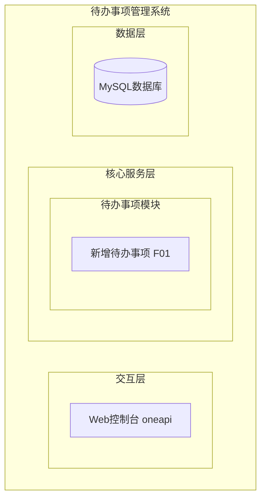
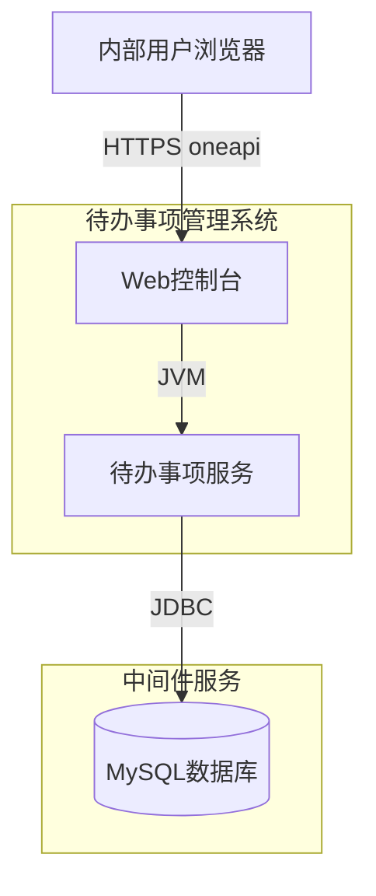
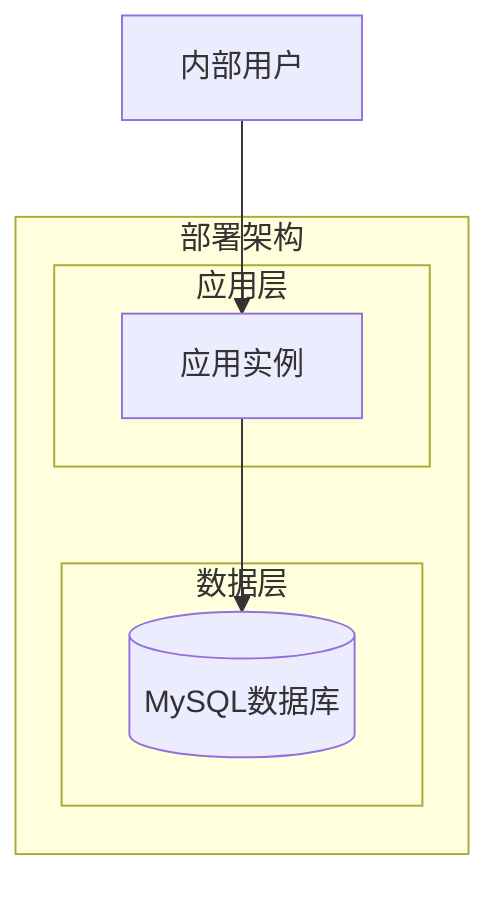
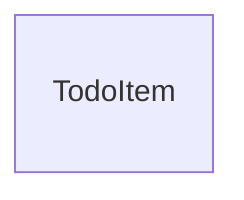
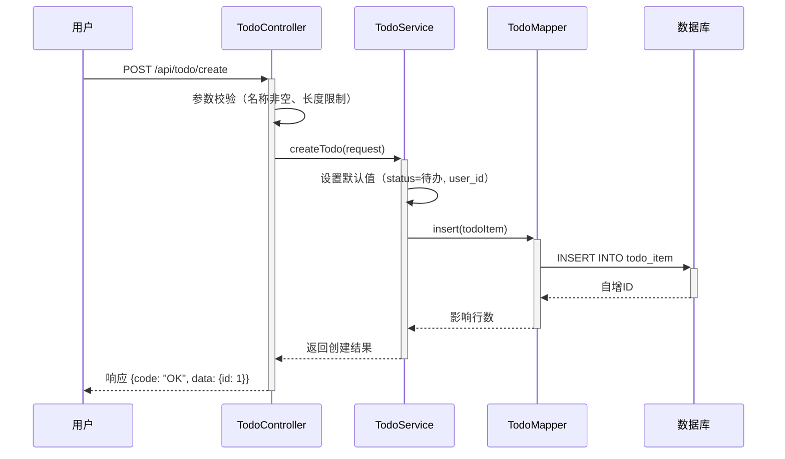
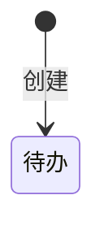

曼昱test

> **文档元信息**
>
> | 项目 | 内容 |
> |------|------|
> | 文档版本 | v1.0 |
> | 作者 | AiWork |
> | 创建日期 | 2026-09-03 |
> | 需求来源 | 用户需求：帮助用户记录日常待办事项 |
> | 评审状态 | 待评审 |

# 待办事项管理系统 系分设计

## 1. 需求与范围

### 背景与目标
帮助内部用户记录日常待办事项，提供便捷的待办事项创建能力，满足日常任务记录需求。

### 核心功能
- 新增待办事项：用户可填写事项名称和描述，提交后生成一条待办记录

### 约束与非功能要求
- 目标用户：内部用户
- 最小闭环：仅创建（不涉及编辑、删除、查询、完成状态变更等能力）
- 系统需支持基本的输入校验（名称非空）
- 数据持久化存储

### 排除范围
- 待办事项的编辑、删除、查询、列表展示、状态管理
- 用户认证与权限管理（本次不涉及，假设已通过统一登录态处理）
- 通知提醒、定时任务、协作共享

### 需求功能清单与优先级

| 编号 | 功能点 | 优先级 | 原始描述 | 备注 |
|------|--------|--------|----------|------|
| F01 | 新增待办事项 | P0 | 用户可创建待办事项，填写事项名称和描述 | 最小闭环核心功能 |

### 假设与待确认项

| 编号 | 假设/待确认内容 | 当前假设 | 确认状态 |
|------|-----------------|----------|----------|
| A01 | 用户身份如何获取 | 假设通过统一登录态获取用户ID（user_id），本次不涉及用户认证模块 | 待确认 |
| A02 | 事项名称长度限制 | 假设名称长度不超过100字符 | 待确认 |
| A03 | 事项描述长度限制 | 假设描述长度不超过500字符 | 待确认 |
| A04 | 是否需要事项分类/标签 | 假设不需要，最小闭环仅包含名称和描述 | 待确认 |

## 2. 架构与模块

### 功能架构



- **交互层**：提供 Web 控制台界面，供内部用户操作，通过 oneapi REST 接口与后端交互
- **核心服务层**：待办事项模块，包含新增待办事项功能
- **数据层**：MySQL 数据库存储待办事项数据

### 模块清单

| 模块 | 职责 | 依赖 |
|------|------|------|
| 待办事项模块 | 管理待办事项的创建 | 无 |

### 应用集成架构



**集成关系说明：**

| 调用方 | 被调用方 | 协议 | 接口类型 | 说明 |
|--------|----------|------|----------|------|
| 用户浏览器 | 应用 Web控制台 | HTTPS | oneapi REST | 用户通过浏览器操作 |
| 待办事项服务 | 数据库 | JDBC | SQL | 数据持久化 |

### 部署架构



**部署说明：**
- **应用层**：单实例容器化部署，内部工具低并发场景
- **数据层**：单节点 MySQL 数据库

## 3. 数据模型与存储

### 实体清单

| 实体名称 | 实体说明 | 所属模块 | 与其他实体的关系 |
|----------|----------|----------|-----------------|
| TodoItem | 待办事项记录 | 待办事项模块 | 无关联实体，独立存在 |

### 实体关系图



**模型说明：**
- TodoItem 为独立实体，当前最小闭环阶段不涉及与其他实体的关联关系
- 后续扩展可引入 User（用户）、Category（分类）等实体

### 存储方案
- 数据库：MySQL（InnoDB）
- 无需缓存/MQ，当前阶段数据量小，无高并发需求
- 租户隔离：暂不涉及，内部统一使用

## 4. 接口设计

### 4.1 oneapi（Web 控制台接口）

| 编号 | 接口名称 | 方法 | 路径 | 模块 |
|------|----------|------|------|------|
| W01 | 新增待办事项 | POST | /api/todo/create | 待办事项模块 |

### 4.2 OpenAPI（对外接口）

无，本次仅内部使用。

### 4.3 内部接口（Service 层）

| 编号 | 接口名称 | 类 | 方法签名 |
|------|----------|------|----------|
| S01 | 创建待办事项 | TodoService | createTodo(CreateTodoRequest) |

### 4.4 集成接口（Integration 层）

无。

## 5. 功能模块设计

### 全局约定

- **错误码格式**：TODO_{SEQ}
- **通用出参结构**：{code, msg, data}
- **模块映射**：

| 模块 | 模块前缀 | 错误码区间 |
|------|----------|-----------|
| 待办事项模块 | TODO | TODO_001 ~ TODO_099 |

---

### 5.1 待办事项模块

#### 5.1.1 表结构设计

##### 5.1.1.1 todo_item（待办事项表）

| 字段名 | 数据类型 | 约束 | 默认值 | 说明 |
|--------|----------|------|--------|------|
| id | bigint | PK, 自增 | - | 系统自增主键 |
| user_id | varchar(64) | NOT NULL | - | 创建用户ID |
| title | varchar(100) | NOT NULL | - | 事项名称 |
| description | varchar(500) | NULL | NULL | 事项描述 |
| status | tinyint(4) | NOT NULL | 0 | 状态：0-待办 1-已完成 2-已取消 |
| gmt_create | datetime | NOT NULL | CURRENT_TIMESTAMP | 创建时间 |
| gmt_modified | datetime | NOT NULL | CURRENT_TIMESTAMP | 修改时间 |

**索引：**
- PK: `pk_todo_item` (id)
- IDX: `idx_todo_item_user_id` (user_id) — 后续扩展用户查询时使用
- IDX: `idx_todo_item_status` (status) — 后续扩展状态筛选时使用

##### 5.1.1.2 枚举与常量定义

| 枚举名称 | 取值 | 含义 | 关联字段 |
|----------|------|------|----------|
| TODO_STATUS_PENDING | 0 | 待办 | todo_item.status |
| TODO_STATUS_COMPLETED | 1 | 已完成 | todo_item.status |
| TODO_STATUS_CANCELLED | 2 | 已取消 | todo_item.status |

#### 5.1.2 接口详细设计

##### W01 新增待办事项

- **URI**: POST /api/todo/create
- **描述**: 创建一条新的待办事项
- **入参**:

| 参数名称 | 类型 | 是否必填 | 描述 |
|----------|------|----------|------|
| title | String | 是 | 事项名称，长度1~100字符 |
| description | String | 否 | 事项描述，长度不超过500字符 |

- **出参**:

| 参数名称 | 类型 | 描述 |
|----------|------|------|
| code | String | 结果code，成功为"OK" |
| msg | String | 提示信息 |
| data | Object | 业务数据 |
| data.id | Long | 新建待办事项的ID |

- **错误码**:

| 错误码 | 说明 |
|--------|------|
| TODO_001 | 事项名称不能为空 |
| TODO_002 | 事项名称长度超过限制（100字符） |
| TODO_003 | 事项描述长度超过限制（500字符） |

- **业务规则**:
  1. 事项名称不能为空，且长度不超过100字符
  2. 事项描述可选，长度不超过500字符
  3. 创建时状态默认为待办（0）
  4. 创建时自动记录当前用户ID

- **请求示例**:
```json
{
  "title": "完成周报",
  "description": "本周完成项目进度汇报"
}
```

- **响应示例**:
```json
{
  "code": "OK",
  "msg": "SUCCESS",
  "data": {
    "id": 1
  }
}
```

#### 5.1.3 子功能详细设计

##### 5.1.3.1 新增待办事项（F01）

- **处理时序图**



**业务规则：**

| 规则编号 | 规则描述 | 校验时机 | 不满足时的处理 |
|----------|----------|----------|--------------|
| R01 | 事项名称不能为空 | 创建时 | 返回错误码 TODO_001，提示"事项名称不能为空" |
| R02 | 事项名称长度不超过100字符 | 创建时 | 返回错误码 TODO_002，提示"事项名称长度超过限制" |
| R03 | 事项描述长度不超过500字符 | 创建时 | 返回错误码 TODO_003，提示"事项描述长度超过限制" |

**异常场景：**

| 异常场景 | 处理方式 |
|----------|----------|
| 数据库写入失败（连接异常/主键冲突等） | 捕获异常，返回系统错误码，记录错误日志 |
| 参数格式错误（如JSON解析失败） | 返回参数校验错误 |

**并发控制：**
- 并发场景：无并发风险。当前仅创建操作，无并发写入冲突场景
- 控制策略：无并发风险，无需特殊处理

**状态机设计：**

当前最小闭环仅创建，不涉及状态流转。状态机在后续扩展编辑/完成功能时补充。



**状态流转规则：**

| 当前状态 | 目标状态 | 流转条件 | 前置校验 | 触发动作 |
|----------|----------|----------|----------|----------|
| - | 待办 | 用户创建待办事项 | 参数校验通过 | 插入数据库记录 |

#### 5.1.4 模块自检

**完备性对账表：**

| 需求编号 | 对应设计 | 覆盖情况 |
|----------|----------|----------|
| F01（新增待办事项） | 5.1.2 W01 + 5.1.3.1 | ✅ 完整覆盖 |

**过度设计检查：**
- 当前设计仅覆盖"创建"功能，未引入不必要的编辑/删除/查询/列表等能力
- 状态字段（status）预留了未来扩展空间（已完成/已取消），但当前仅使用"待办"状态，不过度设计状态机流转
- 结论：无过度设计

## 6. 非功能性需求设计

### 6.1 高可用性
本项不适用，原因：最小闭环阶段仅支持创建功能，内部工具低并发场景，无需多副本高可用设计。

### 6.2 可扩展性
- 水平扩展：模块为无状态服务，后续可通过前端负载均衡实现水平扩展
- 功能扩展：当前预留了 status 字段（0-待办、1-已完成、2-已取消），后续可扩展编辑、完成、删除、查询功能

### 6.3 稳定性/可靠性
- 参数校验：前端+后端双重校验，确保数据质量
- 数据库写入异常：捕获异常并返回友好提示，记录错误日志
- 事务：单表写入，无需事务管理

### 6.4 安全性设计

#### 6.4.1 账户系统方案
本项不适用，原因：假设已通过统一登录态获取用户身份，本次不涉及用户认证模块。

#### 6.4.2 授权&访问控制
本项不适用，原因：最小闭环阶段仅创建，且为内部工具，暂不实现细粒度权限控制。

#### 6.4.3 数据防护方案
本项不适用，原因：待办事项数据不涉及敏感信息（身份证、手机号等），无需加密存储或脱敏展示。

### 6.5 监控/统计/日志/告警
- 关键操作日志：记录创建待办事项的操作日志（用户ID、事项名称、时间）
- 异常日志：记录数据库异常、参数校验异常等错误信息，便于排查问题

## 7. 变更三板斧

### 7.1 可监控
- 接口埋点：`POST /api/todo/create` 的总调用次数、成功/失败次数、响应耗时
- 业务埋点：新增待办事项的数量统计
- 异常告警：接口错误率超过阈值（如5%）时触发告警

### 7.2 可灰度
本项不适用，原因：内部工具，单实例部署，最小闭环功能无需灰度发布。后续可考虑按用户ID尾号灰度引流。

### 7.3 可应急
- 功能开关：可配置化开关，紧急情况下关闭待办事项创建功能，前端展示维护提示
- 发布包回滚：如新版本出现问题，可快速回滚至上一稳定版本
- 数据兜底：数据库有备份策略，确保数据可恢复