> **文档元信息**
>
> | 项目 | 内容 |
> |------|------|
> | 文档版本 | v1.0 |
> | 作者 | DTCoder |
> | 创建日期 | 2026-08-25 |
> | 需求来源 | docs/superpowers/specs/2026-08-25-three-api-tracking-dashboard-design.md |
> | 评审状态 | 待评审 |

# 三接口工具 + 埋点可视化报表 — 系分设计

## 1. 需求与范围

### 背景与目标

构建三接口工具（HelloWorld、SHA-256 哈希、冒泡排序）+ AOP 埋点 + Excel 导出 + 前端可视化报表的完整系统。面向内部用户，提供在线工具调用和调用量统计分析能力。

### 核心功能

分别实现三个后端接口（HelloWorld、SHA-256 哈希、冒泡排序）；前端新增一个页面，含三个 Tab 展示各接口执行结果；提供导出按钮，后端支持 Excel 导出；后端 AOP 埋点记录调用次数和调用人；前端在同一页面展示可视化报表（折线图、饼图、柱状图），按人员类型/层级/部门维度分析。

### 约束与非功能要求

- 后端：Spring Boot 3 + MySQL + JPA + JWT + Apache POI + AOP
- 前端：React 18 + ECharts + Axios + React Router
- 认证：JWT Bearer Token，过期时间 24h
- 密码存储：BCrypt 加密
- 接口前缀：统一 /api/*
- 错误响应：{code, message} 格式

### 排除范围

- 无用户管理后台（CRUD），人员维度信息由注册时自行填写
- 无 SSO/OAuth 集成
- 无权限分级（所有认证用户均可调用三接口）
- 无国际化、移动端适配、消息推送

### 需求功能清单与优先级

| 编号 | 功能点 | 优先级 | 原始描述 | 备注 |
|------|--------|--------|----------|------|
| F01 | 用户注册 | P0 | 注册时填写人员类型/层级/部门 | 自建认证体系 |
| F02 | 用户登录 | P0 | JWT 令牌签发 | 全局认证基础 |
| F03 | HelloWorld 接口 | P0 | GET /api/helloworld?name={name} | 返回 "Hello, {name}!" |
| F04 | SHA-256 哈希接口 | P0 | POST /api/hash，输入字符串，返回哈希值 | SHA-256 算法 |
| F05 | 冒泡排序接口 | P0 | POST /api/bubblesort，输入数组，返回排序结果 | 冒泡排序算法 |
| F06 | AOP 埋点记录 | P0 | 拦截三个业务接口，记录调用人、接口名、参数、时间、IP | 零侵入切面 |
| F07 | Excel 导出 | P1 | GET /api/export?type={name}，导出各接口调用记录为 .xlsx | Apache POI |
| F08 | 埋点报表查询 | P1 | GET /api/tracking/report?dimension={...}，按维度聚合调用次数 | 支持 personType/personLevel/personDept |
| F09 | 前端三 Tab 工具页 | P0 | HelloWorld/Hash/BubbleSort 三个 Tab 切换 | 输入参数 + 执行按钮 + 结果展示 |
| F10 | 前端导出按钮 | P1 | 每个 Tab 内嵌导出按钮，触发 blob 下载 | 与后端导出接口对接 |
| F11 | 前端可视化报表 | P1 | 折线图 + 饼图 + 柱状图，维度切换 | ECharts 实现 |
| F12 | JWT 认证拦截 | P0 | 前端 Axios 拦截器自动附加 Token，401 跳转登录 | 全局认证 |

### 假设与待确认项

| 编号 | 假设/待确认内容 | 当前假设 | 确认状态 |
|------|-----------------|----------|----------|
| A01 | 人员维度枚举值 | 自由填写，非固定枚举 | 待确认 |
| A02 | 报表数据时间范围 | 全量数据，不做时间筛选 | 待确认 |
| A03 | 导出内容范围 | 按 type 筛选该接口所有调用记录 | 待确认 |
| A04 | 并发用户量 | < 100 并发，无需分布式架构 | 待确认 |
| A05 | 部署方式 | 单体应用，单实例部署 | 待确认 |
| A06 | 数据库地址 | localhost:3306，开发环境 | 待确认 |

---

## 2. 架构与模块

### 功能架构

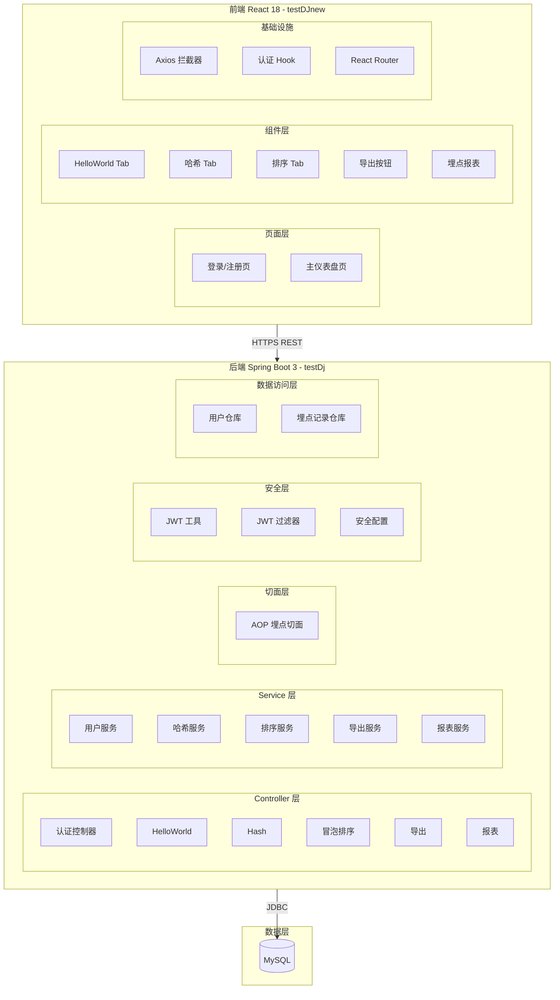

- **交互层说明**：React 18 SPA，通过 Axios 与后端 REST API 通信，JWT Token 通过拦截器自动附加
- **核心服务层说明**：Spring Boot 3 分层架构（Controller → Service → Repository），认证/业务/埋点/导出/报表五大模块
- **扩展/集成层说明**：当前无外部系统集成

**模块清单**

| 模块 | 仓库 | 职责 | 依赖 |
|------|------|------|------|
| 认证模块 | testDj | 用户注册/登录、JWT 签发与校验 | MySQL users 表 |
| 业务接口模块 | testDj | HelloWorld/Hash/BubbleSort 三个接口 | 认证模块（JWT 校验） |
| 埋点模块 | testDj | AOP 切面拦截、调用记录写入 | 业务接口模块、MySQL tracking_records 表 |
| 导出模块 | testDj | 按接口类型导出 Excel | 埋点模块、Apache POI |
| 报表模块 | testDj | 按维度聚合查询调用次数 | 埋点模块、MySQL |
| 前端认证模块 | testDJnew | 登录/注册页面、Token 管理、Axios 拦截 | 后端认证模块 |
| 前端工具页模块 | testDJnew | 三 Tab 工具页面、输入/执行/展示 | 后端业务接口模块 |
| 前端报表模块 | testDJnew | ECharts 可视化（折线/饼图/柱状图）、维度切换 | 后端报表模块 |

### 应用集成架构

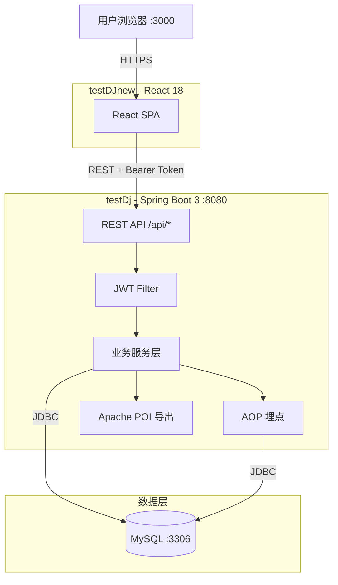

**集成关系说明：**

| 调用方 | 被调用方 | 协议 | 接口类型 | 说明 |
|--------|----------|------|----------|------|
| 用户浏览器 | React SPA | HTTPS | 静态资源 | 前端页面加载 |
| React SPA | Spring Boot REST API | HTTPS | oneapi REST | 所有业务请求 |
| Spring Boot | MySQL | JDBC | SQL | 数据持久化 |
| AOP 切面 | MySQL | JDBC | SQL | 埋点写入 |

### 部署架构

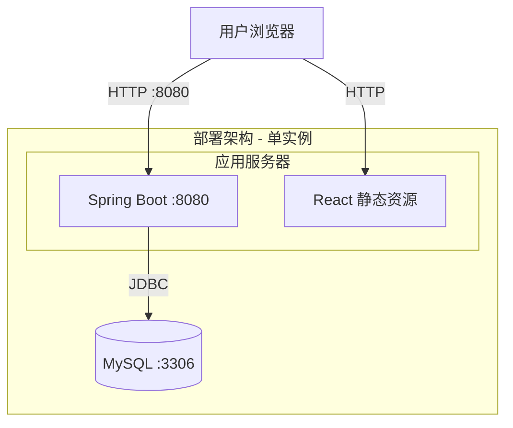

**部署说明：**
- **应用层**：Spring Boot 内嵌 Tomcat，单实例部署，同时托管 React 编译后的静态资源（或通过 Nginx 反向代理分离）
- **数据层**：单实例 MySQL，开发环境 localhost
- 假设：内部工具，无需高可用集群部署（假设 A04/A05）

---

## 3. 数据模型与存储

### 实体清单

| 实体名称 | 实体说明 | 所属模块 | 与其他实体的关系 |
|----------|----------|----------|-----------------|
| User | 系统用户，含人员维度信息 | 认证模块 | 一对多 TrackingRecord |
| TrackingRecord | 接口调用埋点记录 | 埋点模块 | 多对一 User（通过 user_id） |

### 实体关系图

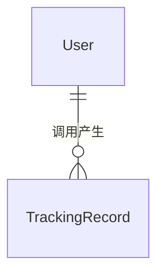

**模型说明：**
- User 与 TrackingRecord 为一对多关系：一个用户可多次调用接口，产生多条埋点记录
- TrackingRecord 通过 user_id 关联 User，采用逻辑外键（非数据库物理外键，遵循规范：禁止使用外键）
- 无缓存/MQ 需求，直接操作 MySQL

### 租户隔离

本项不适用，原因：单租户内部工具，所有用户共享同一数据空间，无需 tenant_id 隔离。

---

## 4. 接口设计

### 4.1 oneapi（Web 控制台接口 /api 前缀）

| 编号 | 接口名称 | 方法 | 路径 | 模块 |
|------|----------|------|------|------|
| W01 | 用户注册 | POST | /api/auth/register | 认证模块 |
| W02 | 用户登录 | POST | /api/auth/login | 认证模块 |
| W03 | HelloWorld | GET | /api/helloworld | 业务接口模块 |
| W04 | SHA-256 哈希 | POST | /api/hash | 业务接口模块 |
| W05 | 冒泡排序 | POST | /api/bubblesort | 业务接口模块 |
| W06 | 导出 Excel | GET | /api/export | 导出模块 |
| W07 | 埋点报表查询 | GET | /api/tracking/report | 报表模块 |

### 4.2 OpenAPI（对外接口）

本项不适用，原因：纯内部工具，无对外开放 API 需求。

### 4.3 内部接口（Service 层）

| 编号 | 接口名称 | 类 | 方法签名 |
|------|----------|------|----------|
| S01 | 用户注册 | UserService | AuthResponse register(RegisterRequest) |
| S02 | 用户登录 | UserService | AuthResponse login(LoginRequest) |
| S03 | JWT 生成 | JwtUtil | String generateToken(Long userId, String username) |
| S04 | JWT 校验 | JwtUtil | boolean validateToken(String token) |
| S05 | 哈希计算 | HashService | String computeHash(String input) |
| S06 | 冒泡排序 | BubbleSortService | int[] sort(int[] array) |
| S07 | 导出生成 | ExportService | byte[] generateExcel(String apiName) |
| S08 | 报表查询 | TrackingService | List<DimensionReport> getReport(String dimension) |
| S09 | 埋点记录写入 | TrackingAspect | Object recordTracking(ProceedingJoinPoint) |

### 4.4 集成接口（Integration 层）

本项不适用，原因：无外部系统集成，所有功能均为自建。

---

## 5. 功能模块设计

### 全局约定

**错误码格式**：`{MODULE}_{SEQ}`

| 模块 | 错误码前缀 | 说明 |
|------|-----------|------|
| 认证模块 | AUTH | 注册/登录相关 |
| 业务接口模块 | BIZ | HelloWorld/Hash/BubbleSort |
| 导出模块 | EXPORT | Excel 导出 |
| 报表模块 | REPORT | 埋点报表查询 |
| 通用 | COMMON | 全局异常 |

**通用出参结构**：`{code, msg, data}`，成功 code=200，业务异常 code=4xx，系统异常 code=500

---

### 5.1 认证模块

#### 5.1.1 表结构设计

##### users 表

| 字段名 | 数据类型 | 约束 | 默认值 | 说明 |
|--------|----------|------|--------|------|
| id | bigint | PK, AUTO_INCREMENT | - | 系统自增主键 |
| username | varchar(50) | UNIQUE, NOT NULL | - | 用户名 |
| password | varchar(255) | NOT NULL | - | BCrypt 加密密码 |
| person_type | varchar(50) | — | NULL | 人员类型 |
| person_level | varchar(50) | — | NULL | 人员层级 |
| person_dept | varchar(100) | — | NULL | 人员部门 |
| gmt_create | datetime | NOT NULL | CURRENT_TIMESTAMP | 创建时间 |
| gmt_modified | datetime | NOT NULL | CURRENT_TIMESTAMP | 修改时间 |

**索引：**
- PK: `pk_users` (id)
- UK: `uk_users_username` (username)

##### 枚举与常量定义

本模块无枚举/常量定义（人员维度字段为自由填写，非固定枚举）。

#### 5.1.2 接口详细设计

##### W01: 用户注册 — POST /api/auth/register

- **描述**: 用户注册，提交用户名、密码及人员维度信息，返回 JWT Token
- **入参**:

| 参数名称 | 类型 | 是否必填 | 描述 |
|----------|------|----------|------|
| username | String | 是 | 用户名，唯一 |
| password | String | 是 | 明文密码，后端 BCrypt 加密 |
| personType | String | 否 | 人员类型 |
| personLevel | String | 否 | 人员层级 |
| personDept | String | 否 | 人员部门 |

- **出参**:

| 参数名称 | 类型 | 描述 |
|----------|------|------|
| id | Long | 用户 ID |
| username | String | 用户名 |
| token | String | JWT Token |
| personType | String | 人员类型 |
| personLevel | String | 人员层级 |
| personDept | String | 人员部门 |

- **错误码**:

| 错误码 | 说明 |
|--------|------|
| AUTH_001 | 用户名已存在 |

- **请求示例**:
```json
{"username": "zhangsan", "password": "pass123", "personType": "技术岗", "personLevel": "高级", "personDept": "研发部"}
```

- **响应示例**:
```json
{"id": 1, "username": "zhangsan", "token": "eyJhbGciOiJIUzI1NiJ9...", "personType": "技术岗", "personLevel": "高级", "personDept": "研发部"}
```

##### W02: 用户登录 — POST /api/auth/login

- **描述**: 用户登录，校验用户名密码，返回 JWT Token
- **入参**:

| 参数名称 | 类型 | 是否必填 | 描述 |
|----------|------|----------|------|
| username | String | 是 | 用户名 |
| password | String | 是 | 明文密码 |

- **出参**:

| 参数名称 | 类型 | 描述 |
|----------|------|------|
| token | String | JWT Token |
| user | Object | 用户信息 {id, username, personType, personLevel, personDept} |

- **错误码**:

| 错误码 | 说明 |
|--------|------|
| AUTH_002 | 用户名或密码错误 |

- **请求示例**:
```json
{"username": "zhangsan", "password": "pass123"}
```

- **响应示例**:
```json
{"token": "eyJhbGciOiJIUzI1NiJ9...", "user": {"id": 1, "username": "zhangsan", "personType": "技术岗", "personLevel": "高级", "personDept": "研发部"}}
```

#### 5.1.3 子功能详细设计

##### 用户注册（F01）

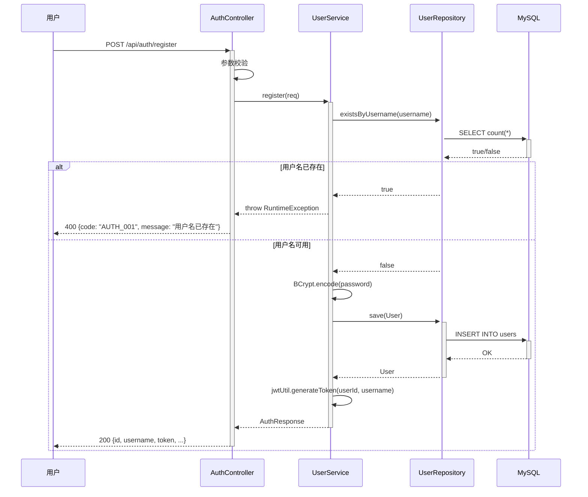

**业务规则：**

| 规则编号 | 规则描述 | 校验时机 | 不满足时的处理 |
|----------|----------|----------|--------------|
| R01 | 用户名唯一 | 注册时 | 返回 AUTH_001，提示"用户名已存在" |
| R02 | 密码长度 >= 6 | 注册时 | 返回 AUTH_003，提示"密码长度不能少于6位" |
| R03 | 用户名不能为空 | 注册时 | 返回 AUTH_004，提示"用户名不能为空" |

##### 用户登录（F02）

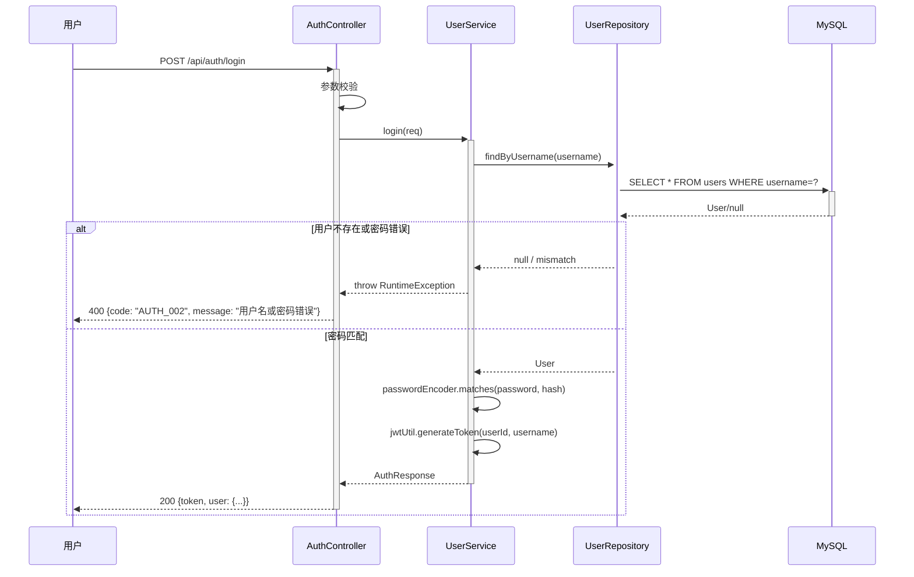

**业务规则：**

| 规则编号 | 规则描述 | 校验时机 | 不满足时的处理 |
|----------|----------|----------|--------------|
| R04 | 用户名和密码必须匹配 | 登录时 | 返回 AUTH_002，统一提示"用户名或密码错误" |

**异常场景：**

| 异常场景 | 处理方式 |
|----------|----------|
| 用户名重复 | 返回 400，AUTH_001 |
| 输入参数为空 | 返回 400，Spring Validation 自动校验 |
| 数据库异常 | 返回 500，COMMON_001 |

**并发控制：** 无并发风险，原因：注册/登录为独立操作，不同用户互不影响。

**状态机设计：** 本项不适用，原因：User 实体无业务状态字段。

---

### 5.2 业务接口模块

#### 5.2.1 表结构设计

本模块不涉及独立表结构，业务接口为无状态计算服务。

##### 枚举与常量定义

| 枚举名称 | 取值 | 含义 | 关联字段 |
|----------|------|------|----------|
| api_name | helloworld / hash / bubblesort | 接口名称 | tracking_records.api_name |

#### 5.2.2 接口详细设计

##### W03: HelloWorld — GET /api/helloworld

- **描述**: 返回 "Hello, {name}!" 问候语
- **入参**:

| 参数名称 | 类型 | 是否必填 | 描述 |
|----------|------|----------|------|
| name | String | 否 | 名称，默认 "World" |

- **出参**:

| 参数名称 | 类型 | 描述 |
|----------|------|------|
| result | String | 问候语 "Hello, {name}!" |

- **请求示例**: `GET /api/helloworld?name=Alice`
- **响应示例**: `{"result": "Hello, Alice!"}`

##### W04: SHA-256 哈希 — POST /api/hash

- **描述**: 对输入字符串计算 SHA-256 哈希值
- **入参**:

| 参数名称 | 类型 | 是否必填 | 描述 |
|----------|------|----------|------|
| input | String | 是 | 待哈希字符串 |

- **出参**:

| 参数名称 | 类型 | 描述 |
|----------|------|------|
| algorithm | String | 算法名称 "SHA-256" |
| input | String | 原始输入 |
| hash | String | 十六进制哈希值 |

- **错误码**: BIZ_001 — 输入参数不能为空

- **请求示例**: `{"input": "hello world"}`
- **响应示例**: `{"algorithm": "SHA-256", "input": "hello world", "hash": "b94d27b9..."}`

##### W05: 冒泡排序 — POST /api/bubblesort

- **描述**: 对输入整数数组执行冒泡排序
- **入参**:

| 参数名称 | 类型 | 是否必填 | 描述 |
|----------|------|----------|------|
| array | int[] | 是 | 待排序整数数组 |

- **出参**:

| 参数名称 | 类型 | 描述 |
|----------|------|------|
| original | int[] | 原始数组 |
| sorted | int[] | 排序后数组（升序） |

- **错误码**: BIZ_002 — 数组不能为空或为 null

- **请求示例**: `{"array": [5, 3, 8, 1, 2]}`
- **响应示例**: `{"original": [5, 3, 8, 1, 2], "sorted": [1, 2, 3, 5, 8]}`

#### 5.2.3 子功能详细设计

##### HelloWorld 调用（F03）

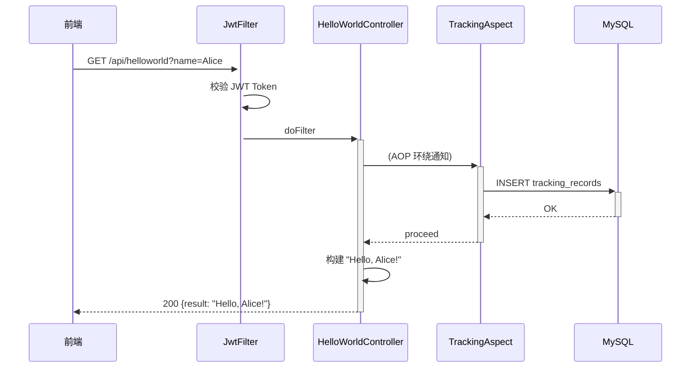

**业务规则：**

| 规则编号 | 规则描述 | 校验时机 | 不满足时的处理 |
|----------|----------|----------|--------------|
| R05 | name 参数为空时默认 "World" | 调用时 | 无，使用默认值 |

##### SHA-256 哈希计算（F04）

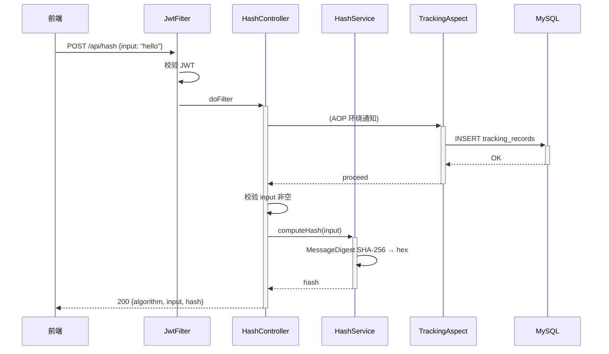

**业务规则：**

| 规则编号 | 规则描述 | 校验时机 | 不满足时的处理 |
|----------|----------|----------|--------------|
| R06 | input 不能为空 | 调用时 | 返回 BIZ_001 |

##### 冒泡排序（F05）

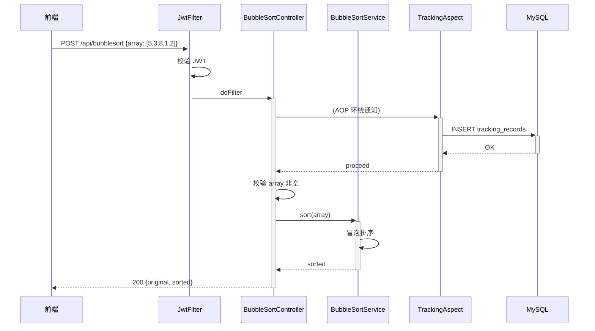

**业务规则：**

| 规则编号 | 规则描述 | 校验时机 | 不满足时的处理 |
|----------|----------|----------|--------------|
| R07 | array 不能为空或 null | 调用时 | 返回 BIZ_002 |

**异常场景：**

| 异常场景 | 处理方式 |
|----------|----------|
| 输入参数为空 | 返回 400，BIZ_001 / BIZ_002 |
| 数据库异常（埋点写入） | 捕获异常，记录日志，不阻断业务 |

**并发控制：** 无并发风险，原因：三个接口均为无状态计算，不涉及共享数据写入。

**状态机设计：** 本项不适用，原因：无状态实体。

**技术选型：**

| 方案 | 哈希算法 | 排序算法 | 优劣 |
|------|----------|----------|------|
| 方案A（推荐） | SHA-256 (MessageDigest) | 冒泡排序（自实现） | 满足需求，SHA-256 安全标准，冒泡排序直观 |
| 方案B | SHA-1 | Arrays.sort() | SHA-1 不再安全；不满足"冒泡排序"需求 |
| 方案C | MD5 | 快速排序 | MD5 已破解；需求明确要求冒泡排序 |

**推荐方案A**，理由：SHA-256 为当前安全标准，冒泡排序满足需求明确性。

---

### 5.3 埋点模块

#### 5.3.1 表结构设计

##### tracking_records 表

| 字段名 | 数据类型 | 约束 | 默认值 | 说明 |
|--------|----------|------|--------|------|
| id | bigint | PK, AUTO_INCREMENT | - | 系统自增主键 |
| user_id | bigint | NOT NULL | - | 调用人 ID，逻辑关联 users.id |
| api_name | varchar(50) | — | NULL | 接口名（helloworld/hash/bubblesort） |
| params_json | text | — | NULL | 请求参数 JSON |
| call_time | datetime | NOT NULL | CURRENT_TIMESTAMP | 调用时间 |
| ip_address | varchar(45) | — | NULL | 客户端 IP |
| gmt_create | datetime | NOT NULL | CURRENT_TIMESTAMP | 创建时间 |

**索引：**
- PK: `pk_tracking_records` (id)
- IDX: `idx_tracking_records_user_id` (user_id)
- IDX: `idx_tracking_records_api_name` (api_name)
- IDX: `idx_tracking_records_call_time` (call_time)

#### 5.3.2 接口详细设计

本模块无对外接口，仅内部 AOP 切面。

##### S09: TrackingAspect.recordTracking()

- **方法签名**: `Object recordTracking(ProceedingJoinPoint joinPoint)`
- **描述**: 环绕通知，拦截业务 Controller 方法，提取调用信息写入 tracking_records
- **切点**: `@Around` 限定于业务 Controller 包下的 @GetMapping/@PostMapping 方法

#### 5.3.3 子功能详细设计

##### AOP 埋点记录（F06）

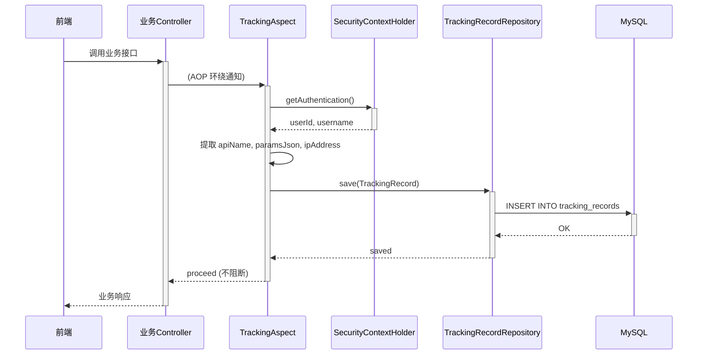

**业务规则：**

| 规则编号 | 规则描述 | 校验时机 | 不满足时的处理 |
|----------|----------|----------|--------------|
| R08 | 埋点记录为异步旁路，不阻断业务 | 始终 | 埋点写入失败不影响业务响应 |
| R09 | 仅对已认证的请求记录 | 切面中 | 未认证请求不记录 |

**异常场景：**

| 异常场景 | 处理方式 |
|----------|----------|
| 数据库写入失败 | 捕获异常，记录日志，不抛出 |
| SecurityContext 为空 | 跳过记录，不报错 |

**并发控制：** 无并发风险，原因：埋点记录为纯追加写入，无共享状态竞争。

**技术选型：**

| 方案 | 实现方式 | 优劣 |
|------|----------|------|
| 方案A（推荐） | Spring AOP @Around 切面 | 零侵入，声明式切点，代码简洁 |
| 方案B | Spring Interceptor | 更底层，需手动管理路径匹配 |
| 方案C | Controller 方法内手动调用 | 侵入性强，重复代码多 |

**推荐方案A**，理由：Spring AOP 切面是 Spring Boot 生态标准做法，对业务代码零侵入。

---

### 5.4 导出模块

#### 5.4.1 表结构设计

本模块不涉及独立表结构，复用 tracking_records 和 users 表。

#### 5.4.2 接口详细设计

##### W06: 导出 Excel — GET /api/export

- **描述**: 按接口类型导出调用记录为 .xlsx 文件
- **入参**:

| 参数名称 | 类型 | 是否必填 | 描述 |
|----------|------|----------|------|
| type | String | 是 | 接口类型：helloworld / hash / bubblesort |

- **出参**: 二进制流 (application/vnd.openxmlformats-officedocument.spreadsheetml.sheet)
- **响应头**: `Content-Disposition: attachment; filename={type}_export.xlsx`
- **错误码**: EXPORT_001 — 不支持的导出类型

#### 5.4.3 子功能详细设计

##### Excel 导出（F07）

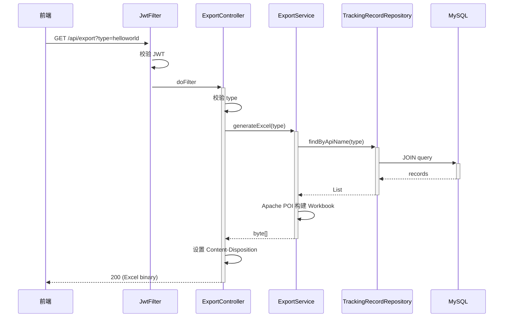

**Excel 列定义：**

| 列 | 字段 | 来源 |
|----|------|------|
| A | 调用人 | users.username |
| B | 人员类型 | users.person_type |
| C | 人员层级 | users.person_level |
| D | 人员部门 | users.person_dept |
| E | 接口名 | tracking_records.api_name |
| F | 请求参数 | tracking_records.params_json |
| G | 调用时间 | tracking_records.call_time |
| H | IP 地址 | tracking_records.ip_address |

**业务规则：**

| 规则编号 | 规则描述 | 校验时机 | 不满足时的处理 |
|----------|----------|----------|--------------|
| R10 | type 必须为 helloworld/hash/bubblesort 之一 | 导出时 | 返回 EXPORT_001 |
| R11 | 无数据时返回空 Excel（仅表头） | 导出时 | 正常返回 |

**异常场景：**

| 异常场景 | 处理方式 |
|----------|----------|
| type 参数非法 | 返回 400，EXPORT_001 |
| 数据库查询异常 | 返回 500，COMMON_001 |
| POI 生成异常 | 返回 500，EXPORT_003 |

**并发控制：** 无并发风险，原因：导出为只读操作。

**技术选型：**

| 方案 | 库 | 优劣 |
|------|-----|------|
| 方案A（推荐） | Apache POI (XSSFWorkbook) | 功能完整，支持 .xlsx，设计文档已指定 |
| 方案B | EasyExcel (Alibaba) | 内存占用更低，但引入额外依赖 |
| 方案C | CSV 导出 | 简单但不支持样式，不符合需求 |

**推荐方案A**，理由：设计文档已指定 Apache POI。

---

### 5.5 报表模块

#### 5.5.1 表结构设计

本模块不涉及独立表结构，复用 tracking_records 和 users 表。

#### 5.5.2 接口详细设计

##### W07: 埋点报表查询 — GET /api/tracking/report

- **描述**: 按维度聚合查询各接口调用次数
- **入参**:

| 参数名称 | 类型 | 是否必填 | 描述 |
|----------|------|----------|------|
| dimension | String | 是 | 聚合维度：personType / personLevel / personDept |

- **出参**:

| 参数名称 | 类型 | 描述 |
|----------|------|------|
| [].label | String | 维度标签值 |
| [].callCount | Long | 调用次数 |
| [].details | Array | 明细列表 [{apiName, callTime, paramsJson}] |

- **错误码**: REPORT_001 — 不支持的维度参数

- **请求示例**: `GET /api/tracking/report?dimension=personType`
- **响应示例**:
```json
[{"label": "技术岗", "callCount": 42, "details": [{"apiName": "helloworld", "callTime": "2026-08-25T10:30:00", "paramsJson": "{\"name\":\"Alice\"}"}]}, {"label": "管理岗", "callCount": 18, "details": []}]
```

#### 5.5.3 子功能详细设计

##### 埋点报表查询（F08）

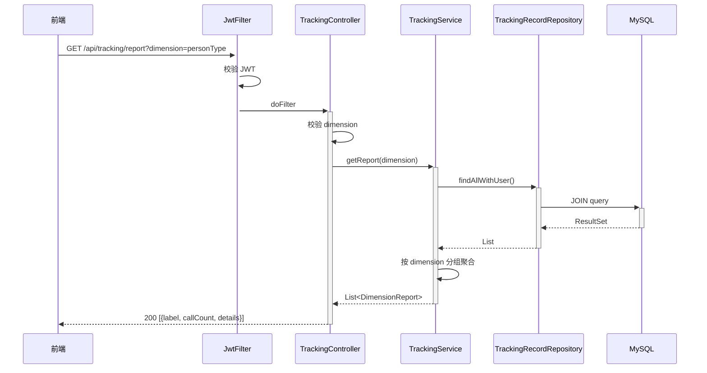

**业务规则：**

| 规则编号 | 规则描述 | 校验时机 | 不满足时的处理 |
|----------|----------|----------|--------------|
| R12 | dimension 必须为 personType/personLevel/personDept | 查询时 | 返回 REPORT_001 |
| R13 | 聚合维度字段为空时归入"未设置" | 聚合时 | 以 "未设置" 作为 label |

**异常场景：**

| 异常场景 | 处理方式 |
|----------|----------|
| dimension 参数非法 | 返回 400，REPORT_001 |
| 无任何调用记录 | 返回空数组 [] |

**并发控制：** 无并发风险，原因：报表查询为只读操作。

**技术选型：**

| 方案 | 聚合方式 | 优劣 |
|------|----------|------|
| 方案A（推荐） | 应用层内存聚合（JOIN 查询后 Java Stream 分组） | 简单直接，数据量小时性能好 |
| 方案B | SQL GROUP BY 聚合 | 数据库端完成，适合大数据量 |
| 方案C | 定时任务预聚合 + 汇总表 | 实时性差，过度设计 |

**推荐方案A**，理由：内部工具调用量小，内存聚合足够。

---

## 6. 非功能性需求设计

### 6.1 高可用性

本系统为内部工具，单实例部署即可。高可用保障：
- 服务异常降级：前端 10s 超时，超时后展示友好错误提示
- 埋点写入降级：AOP 切面中写入失败仅记录日志，不阻断业务
- 数据库不可用：返回 500 统一错误

### 6.2 可扩展性

- 水平扩展：Spring Boot 无状态设计，可随时增加实例
- 前端组件化：Tab 组件独立封装，新增工具接口只需新增 Tab 组件
- 报表维度扩展：通过映射配置新增维度，无需改代码

### 6.3 稳定性/可靠性

- 边界场景：空数组排序返回空数组，空字符串哈希返回正常哈希值
- 数据库连接池：HikariCP 最大连接数 20
- JWT 过期：24h，前端 401 自动跳转登录页

### 6.4 安全性设计

#### 6.4.1 账户系统方案

自建 JWT 认证体系，用户注册/登录自实现。新应用首次系分，需安全评审。

#### 6.4.2 授权与访问控制

- **水平权限检查**：不涉及（所有用户均可调用三接口，无数据隔离需求）
- **垂直权限检查**：不涉及（无角色分级）
- **登录态检查**：JwtAuthenticationFilter 对除 /api/auth/** 外所有接口校验 JWT

#### 6.4.3 数据防护方案

- **敏感数据加密存储**：密码 BCrypt 加密；JWT Secret 配置存储
- **敏感数据脱敏**：不涉及（不展示密码等敏感信息）

### 6.5 监控/统计/日志/告警

- 监控埋点：AOP 切面记录每次接口调用，写入 tracking_records 表
- 应用日志：Spring Boot 默认日志，INFO 级别
- SQL 日志：开发环境 show-sql=true

---

## 7. 变更三板斧

### 7.1 可监控

| 监控点 | 指标 | 采集方式 | 存储 |
|--------|------|----------|------|
| 三接口调用 | 调用人、接口名、参数、调用时间、IP | AOP 切面自动采集 | tracking_records 表 |
| 注册/登录 | 用户名、时间、成功/失败 | Controller 日志 | 应用日志 |
| 导出操作 | 导出类型、导出人、时间 | Controller 日志 | 应用日志 |
| 报表查询 | 查询维度、查询人、时间 | Controller 日志 | 应用日志 |

**前端可视化监控：** 折线图（趋势）、饼图（占比）、柱状图（对比），维度切换（人员类型/层级/部门）

### 7.2 可灰度

本项不适用，原因：内部工具，用户量小，无需灰度发布。如需灰度建议通过 Nginx 按流量比例分流。

### 7.3 可应急

| 开关 | 作用 | 实现方式 | 回滚影响 |
|------|------|----------|----------|
| 埋点关闭 | 停止 AOP 埋点记录 | 配置项 `tracking.enabled=true/false` | 报表数据不再增长，不影响业务 |
| 服务回滚 | 回退到上一版本 | 发布包回滚 | DDL 仅新增表，旧版本兼容 |

**回滚策略：** DDL 仅新增表，回滚时无需删表；接口仅新增，旧版本调用新接口返回 404，前端需兼容处理。

---

## 8. 仓间对齐

| # | 对齐项 | [testDj] 后端 | [testDJnew] 前端 | 风险 |
|---|--------|---------------|------------------|------|
| 1 | JWT 格式 | `Bearer {token}`，token 含 userId/username | 登录后存 localStorage，Axios 拦截器自动附加 | 低 |
| 2 | 接口路径 | 统一 `/api/*` 前缀 | 前端 baseURL 指向 `http://localhost:8080` | 低 |
| 3 | 报表维度枚举 | `personType` / `personLevel` / `personDept` | 前端维度下拉值与后端一致 | 低 |
| 4 | 导出文件 | `Content-Disposition: attachment; filename=xxx.xlsx` | 前端 blob 方式下载 | 中（需联调验证） |
| 5 | 错误码 | 统一 `{code, message}` 格式 | 前端统一拦截展示 | 低 |
| 6 | CORS | 允许 `http://localhost:3000` | 前端默认端口 3000 | 低 |

---

## 9. 方案检查（Step 9 Checklist）

| 检查项 | 结果 | 说明 |
|--------|------|------|
| 模块划分合理性检查 | 通过 | 5 个后端模块 + 3 个前端模块，单一职责，无循环依赖 |
| 依赖关系合理性 | 通过 | 前端→后端→MySQL，AOP 旁路不阻断主链路 |
| 单点问题检查（部署层面） | 通过 | 单实例部署（内部工具，可接受），标注假设 |
| 表模型设计范式检查 | 通过 | 满足 3NF，users 和 tracking_records 无冗余 |
| 隐私安全检查 | 通过 | 密码 BCrypt 加密，JWT Secret 配置化 |
| 兼容性检查（接口） | 通过 | 全新接口，无旧调用方兼容问题 |
| 兼容性检查（表） | 通过 | 全新表，无旧版本兼容问题 |
| 数据迁移检查 | 通过 | 全新表，无迁移需求 |
| 一致性检查（功能点） | 通过 | F01-F12 全部在 Step 5 中有对应设计 |
| 一致性检查（表） | 通过 | Step 3 两个实体在 Step 5 中均有完整表结构定义 |
| 一致性检查（接口） | 通过 | Step 4 所有接口在 Step 5 中均有详细定义 |
| 一致性检查（枚举） | 通过 | api_name 枚举与表结构一致 |
| 状态机完整性检查 | 不适用 | 无状态字段实体 |
| 并发风险检查 | 通过 | 无并发写入场景，只读操作无风险 |
| 单点问题检查（定时任务层面） | 不适用 | 无定时任务 |
| 非功能性设计可行性检查 | 通过 | 安全/监控/扩展性设计均基于 Spring Boot 标准能力 |
| 变更三板斧设计可行性检查（可监控） | 通过 | AOP 切面 + 前端 ECharts 可行 |
| 变更三板斧设计可行性检查（可灰度） | 不适用 | 内部工具无灰度需求 |
| 变更三板斧设计可行性检查（可应急） | 通过 | 配置开关 + 回滚方案可行 |