> **文档元信息**
>
> | 项目 | 内容 |
> |------|------|
> | 文档版本 | v1.0 |
> | 作者 | DTCoder |
> | 创建日期 | 2026-08-19 |
> | 需求来源 | `.agents/specs/20260819-一_背景与目标_随着团队规模扩大_人员与.md`（实施计划） |
> | 评审状态 | 待评审 |

# 组织架构管理模块 系分设计

## 1. 需求与范围

- **背景与目标**：随着团队规模扩大，人员与部门关系变得复杂。需开发一套组织架构管理模块，支持部门的树形结构搭建，以及员工在部门间的调动、离职等生命周期管理，并为其他业务系统（如审批、权限）提供准确的人员数据源。
- **核心功能**：
  - 部门树形结构的加载、懒加载、拖拽调整层级。
  - 员工新增（工号/手机号唯一性实时校验 + 防重保底）。
  - 人员调动（更新 dept_id + 级联更新默认审批流节点 + 调动留痕）。
  - 员工离职（逻辑删除 + 资源释放 + 历史保留）。
  - 异常与边界场景：循环引用防护、部门下有人员禁删、大数据量分页、并发调动乐观锁。
- **约束与非功能要求**：
  - 后端 Java 17 / Spring Boot 3.2.5 / Spring Data JPA / Flyway / MySQL 8.0，单体 REST 服务。
  - 前端 React 18 / TypeScript 严格模式 / Ant Design 5 / Axios / Zustand / react-dnd。
  - MySQL utf8mb4、InnoDB；逻辑删除（is_deleted + status），严禁物理删除离职员工。
  - 部门表含 parent_id 与 path（格式 `/1/2/5/`）加速子孙查询。
  - employee_no 与 phone 全局唯一（DB 唯一索引 + 应用层二次校验）。
  - 员工表 version 字段实现乐观锁（JPA @Version）。
  - 员工列表必须分页（page/size，默认 page=1, size=10）。
  - REST 统一响应体：`{ "code": 200, "msg": "...", "data": ... }`。
  - 前端 API 统一走 `src/api/http.ts` 的 Axios 实例。
- **排除范围**：
  - 组织架构模块不实现完整的审批流引擎，仅维护"默认审批人"节点数据供下游审批系统消费。
  - 不实现独立的权限/RBAC 后端引擎；角色（超管/HR、部门主管）通过前端操作入口隔离 + 后端接口预留水平权限检查点实现。
  - 不实现考勤、薪酬等业务模块，仅保留历史数据关联查询能力。

### 需求功能清单与优先级

| 编号 | 功能点 | 优先级 | PRD 原始描述/章节 | 备注 |
|------|--------|--------|-------------------|------|
| F01 | 部门树懒加载（默认展开第一级，点击节点加载人员列表） | P0 | 需求1·前端交互 | 前端组件 + 后端树组装 |
| F02 | 部门拖拽调整层级 | P0 | 需求1·前端交互 / 后端处理 | 含循环引用校验 |
| F03 | 部门树组装返回（parent_id 组装树形） | P0 | 需求1·后端处理 | GET /api/departments/tree |
| F04 | 拖拽父节点变更事务处理 | P0 | 需求1·后端处理 / 交互协议 | PUT /api/departments/{id}/move |
| F05 | 员工新增表单录入 | P0 | 需求2·前端交互 | 姓名/工号/手机号/部门/职位 |
| F06 | 工号/手机号实时校验 | P0 | 需求2·前端交互 / 后端处理 | GET /api/employees/check |
| F07 | 员工新增提交（唯一校验 + 部门合法性） | P0 | 需求2·后端处理 / 交互协议 | POST /api/employees |
| F08 | 员工调动（更新 dept_id + 审批流级联 + 留痕） | P0 | 需求3·后端处理 | POST /api/employees/{id}/transfer |
| F09 | 调动确认弹窗（警告审批流/权限变化） | P1 | 需求3·前端交互 | TransferModal |
| F10 | 员工离职（逻辑删除 + 许可释放 + 登录权限清除） | P0 | 需求4·后端处理 | PUT /api/employees/{id}/resign |
| F11 | 在职/离职筛选 + 离职灰标不可编辑 | P1 | 需求4·前端交互 | 列表筛选 |
| F12 | 循环引用防护（move 校验子孙关系） | P0 | 异常1·处理 | 返回 400 |
| F13 | 部门下有人员禁删（返回员工数量） | P0 | 异常2·处理 | 删除接口 |
| F14 | 人员列表分页（page/size） | P0 | 异常3·处理 | 后端分页 + 前端分页表格 |
| F15 | 并发调动乐观锁（version，409 Conflict） | P0 | 异常4·处理 | JPA @Version |
| F16 | 部门删除接口 | P1 | 隐含（树管理完整性） | 含人员存在性校验 |
| F17 | 员工分页列表查询（按部门筛选） | P0 | 需求1·点击节点加载人员 | GET /api/employees |

### 假设与待确认项

| 编号 | 假设/待确认内容 | 当前假设 | 确认状态 |
|------|-----------------|----------|----------|
| A01 | 部门树懒加载：后端一次返回全树 vs 按节点懒加载子树 | 假设后端一次返回全树（GET /api/departments/tree），前端按需展开渲染；因部门量级通常 < 千，全量返回树结构性能可接受。若未来超千节点可拆为按 parentId 懒加载子树接口。 | 待确认 |
| A02 | 审批流级联范围 | 假设当前仅维护 `approval_flow_node` 中 scene=LEAVE（请假）的默认审批人节点，调动后按目标部门主管自动更新 approver_id；具体审批人推导规则为目标部门创建者或显式指定的部门主管字段（department 表暂无 owner 字段，新增 dept_leader_id 冗余）。 | 待确认 |
| A03 | 部门主管角色数据来源 | 假设 department 表增加 `leader_id`（部门主管员工ID）字段，用于审批流推导与部门主管数据权限边界；PRD 未明确主管存储位置。 | 待确认 |
| A04 | 操作人身份来源 | 假设 transfer_record.operator 暂从前端请求头 X-Operator 传入或留空，后续接入统一身份后由网关注入；当前无独立鉴权后端。 | 待确认 |
| A05 | 系统账号许可释放 | 假设离职时同步将 approval_flow_node 中 approver_id 指向该员工的记录清理/停用，并预留账号许可释放的扩展点（外部 IAM 集成接口）；当前无实际 IAM 对接。 | 待确认 |
| A06 | 部门 path 维护时机 | 假设在部门新增、move（拖拽）时由后端自动重算 path 及所有子孙 path，事务内完成。 | 待确认 |
| A07 | 分页 size 上限 | 假设 size 最大 100，超过强制截断为 100，防止全量拉取。 | 待确认 |
| A08 | 租户隔离 | 当前需求未提及多租户；假设单租户，表结构预留 tenant_id 但默认值为 0 不启用，后续接入多租户时开启。 | 待确认 |
| A09 | 数据库时间字段命名 | 遵循 db.md 推荐 gmt_create/gmt_modified；但实施计划 spec 使用 created_at/updated_at，假设沿用 spec 已定义的 created_at/updated_at 以保持与 Flyway 脚本一致，db.md 推荐项为"推荐"非"强制"。 | 待确认 |

## 2. 架构与模块

### 功能架构

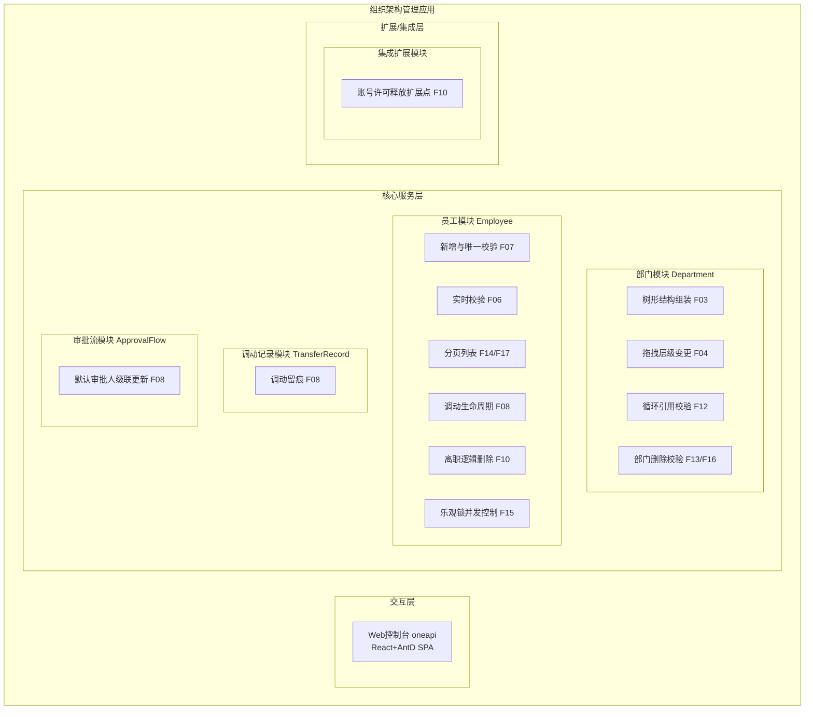

- **交互层说明**：Web 控制台为 React + Ant Design 单页应用，提供部门树（懒加载+拖拽）、人员分页表格、新增表单（实时校验）、调动弹窗、离职弹窗等交互，通过 Axios 统一实例调用后端 oneapi REST 接口。
- **核心服务层说明**：
  - 部门模块：负责部门树组装、拖拽层级变更事务、循环引用防护、部门删除前人员存在性校验、path 重算。
  - 员工模块：负责员工新增（唯一校验+部门合法性）、实时校验、分页查询、调动（更新 dept_id）、离职（逻辑删除）、乐观锁并发控制。
  - 调动记录模块：记录每次调动的 from/to 部门、职位、原因、操作人，供历史审计。
  - 审批流模块：维护员工默认审批人节点，调动时按目标部门主管级联更新 approver_id。
- **扩展/集成层说明**：账号许可释放为扩展点，当前预留接口，后续接入统一 IAM/权限系统时由网关注入身份并调用外部 IAM API 释放许可。

**模块清单**

| 模块 | 职责 | 依赖 |
|------|------|------|
| 部门模块 Department | 部门树组装、层级变更、循环校验、删除校验、path 维护 | 数据库（department） |
| 员工模块 Employee | 员工 CRUD、唯一校验、分页、调动、离职、乐观锁 | 部门模块（校验部门合法性）、调动记录模块、审批流模块 |
| 调动记录模块 TransferRecord | 调动历史留痕 | 员工模块（调用写入）、数据库（transfer_record） |
| 审批流模块 ApprovalFlow | 默认审批人节点维护与级联更新 | 员工模块（调用级联）、部门模块（取主管）、数据库（approval_flow_node） |
| 公共模块 Common | 统一响应体 ApiResponse、全局异常处理 BizException/GlobalExceptionHandler | 无 |
| 集成扩展模块 IAM Extension | 账号许可释放扩展点 | 外部 IAM（预留） |

### 应用集成架构

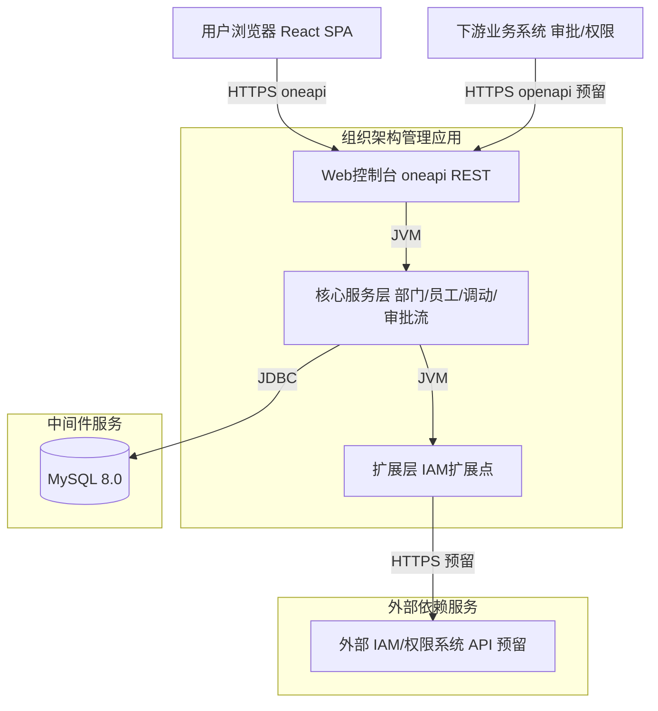

**集成关系说明：**

| 调用方 | 被调用方 | 协议 | 接口类型 | 说明 |
|--------|----------|------|----------|------|
| 用户浏览器 | 应用 Web控制台 | HTTPS | oneapi REST | 前端 SPA 调用 /api/departments、/api/employees 等接口 |
| 下游业务系统（审批/权限） | 应用（预留 OpenAPI） | HTTPS | openapi REST | 未来对外提供人员数据源查询；当前未实现，预留扩展 |
| 应用核心服务层 | 数据库 | JDBC | SQL | 部门/员工/调动记录/审批流节点表读写 |
| 应用扩展层 | 外部 IAM/权限系统 | HTTPS | REST | 离职时释放账号许可；当前为扩展点，未实际对接 |

### 部署架构

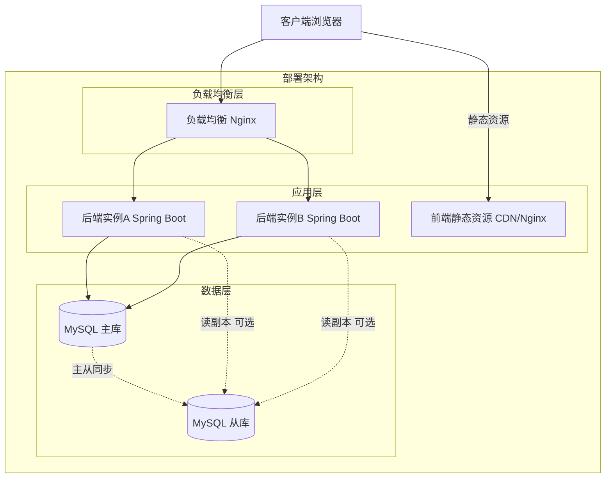

**部署说明：**
- **负载均衡层**：Nginx 反向代理，将 /api 请求转发到后端多实例；前端静态资源经 CDN 或 Nginx 直发。
- **应用层**：后端 Spring Boot 多实例无状态部署（会话无状态，便于横向扩容）；前端为静态构建产物。假设默认 2 副本，按流量水平扩缩容。
- **数据层**：MySQL 主从架构，主库写、从库读（可选）；员工表 dept_id、department path 均加索引保障查询性能。假设私有化容器化部署。

## 3. 数据模型与存储

### 实体清单

| 实体名称 | 实体说明 | 所属模块 | 与其他实体的关系 |
|----------|----------|----------|-----------------|
| department | 部门，树形结构节点 | 部门模块 | 自引用 parent_id（多对一自身）；被 employee 多对一引用；被 transfer_record 引用（from/to） |
| employee | 员工，组织架构核心实体 | 员工模块 | 多对一 department（dept_id）；一对多 transfer_record；一对多 approval_flow_node |
| transfer_record | 调动记录，员工部门变更历史 | 调动记录模块 | 多对一 employee；引用 department（from_dept_id/to_dept_id） |
| approval_flow_node | 默认审批流节点，维护员工某场景的默认审批人 | 审批流模块 | 多对一 employee；引用 department（dept_id） |

### 实体关系图

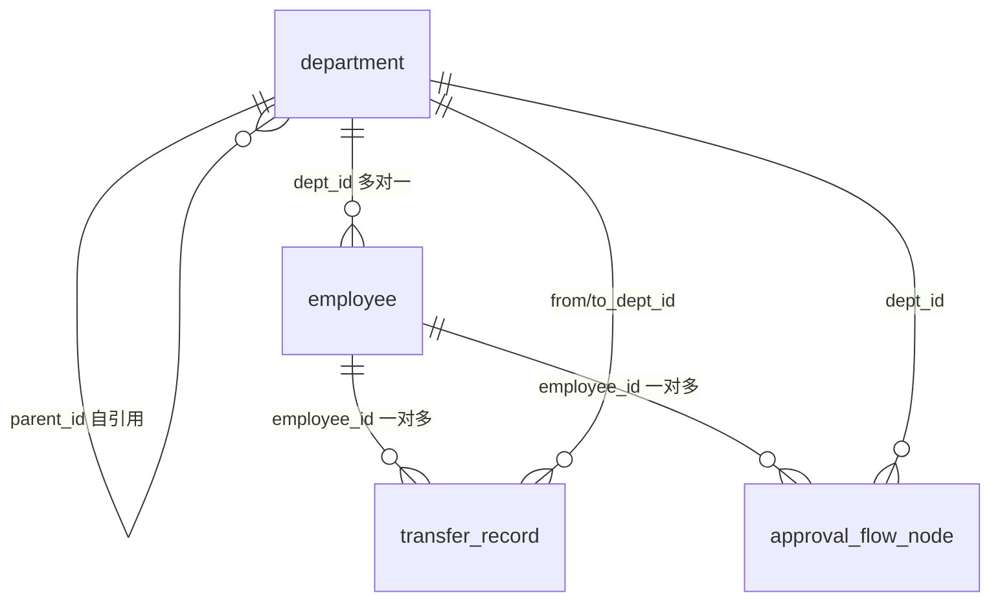

**模型说明：**
- department 通过 parent_id 自引用形成树，path 字段冗余存储祖先链 `/1/2/5/` 以加速子孙查询（`LIKE '/1/2/%'`）。
- employee.dept_id 为多对一关系，加索引；employee_no、phone 全局唯一。
- transfer_record 为只追加（append-only）历史表，记录每次调动前后部门与职位。
- approval_flow_node 按 employee_id + scene 维护默认审批人，调动时级联更新。
- 租户隔离：表结构预留 tenant_id（默认 0），当前单租户不启用（假设 A08）。

## 4. 接口设计

### 4.1 oneapi（Web 控制台接口）

| 编号 | 接口名称 | 方法 | 路径 | 模块 |
|------|----------|------|------|------|
| W01 | 获取部门树 | GET | /api/departments/tree | 部门模块 |
| W02 | 部门拖拽层级变更 | PUT | /api/departments/{id}/move | 部门模块 |
| W03 | 部门删除 | DELETE | /api/departments/{id} | 部门模块 |
| W04 | 员工实时唯一校验 | GET | /api/employees/check | 员工模块 |
| W05 | 员工新增 | POST | /api/employees | 员工模块 |
| W06 | 员工分页列表 | GET | /api/employees | 员工模块 |
| W07 | 员工调动 | POST | /api/employees/{id}/transfer | 员工模块 |
| W08 | 员工离职 | PUT | /api/employees/{id}/resign | 员工模块 |

### 4.2 OpenAPI（对外接口）

| 编号 | 接口名称 | 方法 | 路径 | 模块 |
|------|----------|------|------|------|
| O01 | 人员数据源查询（预留） | GET | /openapi/employees | 员工模块 |

> 当前未实现对外 OpenAPI，仅预留路径与设计，待下游审批/权限系统接入时按需展开。

### 4.3 内部接口（Service 层）

| 编号 | 接口名称 | 类 | 方法签名 |
|------|----------|------|----------|
| S01 | 组装部门树 | DepartmentService | `DepartmentTreeVo buildTree()` |
| S02 | 移动部门（含循环校验+path重算） | DepartmentService | `void moveDepartment(Long id, Long newParentId)` |
| S03 | 删除部门（含人员存在性校验） | DepartmentService | `void deleteDepartment(Long id)` |
| S04 | 校验子树关系 | DepartmentService | `boolean isDescendant(Long nodeId, Long ancestorId)` |
| S05 | 重算 path（含子孙） | DepartmentService | `void recalculatePath(Long id)` |
| S06 | 员工新增 | EmployeeService | `EmployeeVo createEmployee(EmployeeCreateRequest req)` |
| S07 | 实时唯一校验 | EmployeeService | `boolean checkExist(String field, String value)` |
| S08 | 员工分页查询 | EmployeeService | `Page<EmployeeVo> pageEmployees(Long deptId, String status, int page, int size)` |
| S09 | 员工调动（含级联+留痕） | EmployeeService | `void transfer(Long id, TransferRequest req)` |
| S10 | 员工离职 | EmployeeService | `void resign(Long id, ResignRequest req)` |
| S11 | 写入调动记录 | TransferRecordService | `void recordTransfer(Long employeeId, Long fromDeptId, Long toDeptId, String oldPos, String newPos, String reason, String operator)` |
| S12 | 级联更新审批流节点 | ApprovalFlowService | `void updateByTransfer(Long employeeId, Long newDeptId)` |
| S13 | 释放账号许可（扩展点） | IamExtensionService | `void releaseAccount(Long employeeId)` |

### 4.4 集成接口（Integration 层）

| 编号 | 接口名称 | 类 | 方法签名 | 说明 |
|------|----------|------|----------|------|
| I01 | 外部 IAM 账号许可释放（预留） | IamClient | `void release(Long employeeId)` | 离职时调用外部 IAM 释放登录许可；当前为预留扩展点，默认空实现 |

## 5. 功能模块设计

### 5.0 全局约定

- **错误码格式**：`{MODULE}_{SEQ}`，MODULE 为大写模块缩写。
- **通用出参结构**：`{ "code": int, "msg": String, "data": T }`，HTTP 状态码与业务 code 对应（400=参数/业务校验失败，409=并发冲突，200=成功）。
- **模块错误码前缀映射**：

| 模块 | 错误码前缀 | 说明 |
|------|-----------|------|
| 部门模块 | DEPT | 部门树/移动/删除相关错误 |
| 员工模块 | EMP | 员工新增/校验/调动/离职相关错误 |
| 调动记录模块 | TRF | 调动记录写入错误 |
| 审批流模块 | APR | 审批流级联错误 |
| 公共 | BIZ | 通用业务错误 |

### 5.1 部门模块（Department）

#### 5.1.1 表结构设计

##### 5.1.1.1 表 department

| 字段名 | 数据类型 | 约束 | 默认值 | 说明 |
|--------|----------|------|--------|------|
| id | bigint | PK, 自增 | - | 系统自增主键 |
| name | varchar(100) | NOT NULL | - | 部门名称 |
| parent_id | bigint | NULL | NULL | 父部门ID，根节点为 NULL |
| path | varchar(512) | NOT NULL | '/' | 祖先路径，格式 /1/2/5/，加速子孙查询 |
| sort_order | int | NOT NULL | 0 | 同级排序号 |
| leader_id | bigint | NULL | NULL | 部门主管员工ID（假设 A03，用于审批流推导与数据权限） |
| is_deleted | tinyint | NOT NULL | 0 | 逻辑删除标记：0未删/1已删 |
| created_at | datetime | NOT NULL | CURRENT_TIMESTAMP | 创建时间 |
| updated_at | datetime | NOT NULL | CURRENT_TIMESTAMP ON UPDATE CURRENT_TIMESTAMP | 修改时间 |

**索引：**
- PK: `pk_department` (id)
- IDX: `idx_dept_parent` (parent_id)
- IDX: `idx_dept_sort` (parent_id, sort_order)
- IDX: `idx_dept_path` (path)

> 注：path 字段冗余设计，不满足第三范式，但用于加速子孙查询（`LIKE '/1/2/%'` 走索引），属合理冗余（参考 db.md 推荐项：字段允许适当冗余以提高查询性能，且 path 非频繁修改字段）。

##### 5.1.1.2 枚举与常量定义

| 枚举名称 | 取值 | 含义 | 关联字段 |
|----------|------|------|----------|
| DepartmentDeletedFlag | 0 | 未删除 | department.is_deleted |
| DepartmentDeletedFlag | 1 | 已删除 | department.is_deleted |

#### 5.1.2 接口详细设计

##### W01 获取部门树

- **URI**: GET /api/departments/tree
- **描述**: 查询数据库，按 parent_id 组装树形结构返回（排除逻辑删除节点）。
- **入参**: 无

- **出参**:

| 参数名称 | 类型 | 描述 |
|----------|------|------|
| code | int | 结果code |
| msg | String | 提示信息 |
| data | Array | 部门树节点数组 |

- data 节点结构:

| 参数名称 | 类型 | 描述 |
|----------|------|------|
| id | long | 部门ID |
| name | String | 部门名称 |
| children | Array | 子部门节点数组（递归） |

- **错误码**:

| 错误码 | 说明 |
|--------|------|
| - | 无业务错误码，正常返回树 |

- **业务规则**: 组装时过滤 is_deleted=1 的节点；按 sort_order 升序排列同级节点。

- **请求示例**: `GET /api/departments/tree`

- **响应示例**:
```json
{
  "code": 200,
  "msg": "success",
  "data": [
    {
      "id": 1,
      "name": "研发部",
      "children": [
        { "id": 2, "name": "前端组", "children": [] }
      ]
    }
  ]
}
```

##### W02 部门拖拽层级变更

- **URI**: PUT /api/departments/{id}/move
- **描述**: 处理拖拽产生的父节点变更事务，含循环引用校验与 path 重算。
- **入参**:

| 参数名称 | 类型 | 是否必填 | 描述 |
|----------|------|----------|------|
| id | long | 是 | 被移动部门ID（路径参数） |
| newParentId | long | 是 | 目标父部门ID；根节点传 0 或 null |

- **出参**:

| 参数名称 | 类型 | 描述 |
|----------|------|------|
| code | int | 结果code |
| msg | String | 提示信息 |
| data | Object | 空 |

- **错误码**:

| 错误码 | 说明 |
|--------|------|
| DEPT_001 | 目标父部门不存在 |
| DEPT_002 | 循环引用：newParentId 为被移动节点自身或其子孙（HTTP 400） |

- **业务规则**:
  - R01: newParentId 为 0 或 null 表示移动到根级。
  - R02: newParentId 不能等于被移动节点 id 自身（DEPT_002）。
  - R03: newParentId 不能是被移动节点的子孙节点（DEPT_002，通过 path 判断：目标节点 path 是否以被移动节点 path 为前缀）。
  - R04: 变更 parent_id 后，事务内重算该节点及其所有子孙的 path。
  - R05: 全程在事务内完成，失败回滚。

- **请求示例**:
```json
{ "newParentId": 5 }
```

- **响应示例**:
```json
{ "code": 200, "msg": "移动成功", "data": null }
```

##### W03 部门删除

- **URI**: DELETE /api/departments/{id}
- **描述**: 删除部门，校验部门下是否存在员工，存在则拒绝；含子部门时同样拒绝。
- **入参**:

| 参数名称 | 类型 | 是否必填 | 描述 |
|----------|------|----------|------|
| id | long | 是 | 被删除部门ID（路径参数） |

- **出参**:

| 参数名称 | 类型 | 描述 |
|----------|------|------|
| code | int | 结果code |
| msg | String | 提示信息（含员工数量） |
| data | Object | 空 |

- **错误码**:

| 错误码 | 说明 |
|--------|------|
| DEPT_003 | 部门下存在员工，拒绝删除（HTTP 400，msg 含数量） |
| DEPT_004 | 部门下存在子部门，拒绝删除 |

- **业务规则**:
  - R06: 查询 employee 中 dept_id=id 且 is_deleted=0 的记录数，>0 则拒绝（DEPT_003，msg 形如"该部门下存在{N}名员工，请先转移人员后再删除"）。
  - R07: 查询 department 中 parent_id=id 且 is_deleted=0 的子部门数，>0 则拒绝（DEPT_004）。
  - R08: 校验通过后执行逻辑删除（is_deleted=1），不物理删除。

- **请求示例**: `DELETE /api/departments/2`

- **响应示例**（失败）:
```json
{ "code": 400, "msg": "该部门下存在5名员工，请先转移人员后再删除", "data": null }
```

#### 5.1.3 子功能详细设计

##### 5.1.3.1 部门树组装（F03）

- 处理时序图
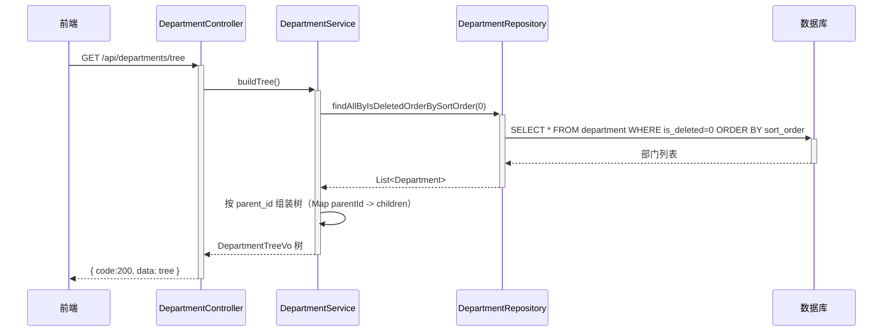

**业务规则：**

| 规则编号 | 规则描述 | 校验时机 | 不满足时的处理 |
|----------|----------|----------|--------------|
| R09 | 组装时过滤 is_deleted=1 | 始终 | 不返回已删除节点 |
| R10 | 同级按 sort_order 升序 | 始终 | 无 |

**异常场景：**

| 异常场景 | 处理方式 |
|----------|----------|
| 部门表为空 | 返回空数组 data:[]，不报错 |
| 存在 parent_id 指向已删除父节点 | 该孤儿节点挂到根级列表 |

**并发控制：** 无并发风险，树组装为只读查询。

##### 5.1.3.2 拖拽层级变更（F04/F12）

- 处理时序图
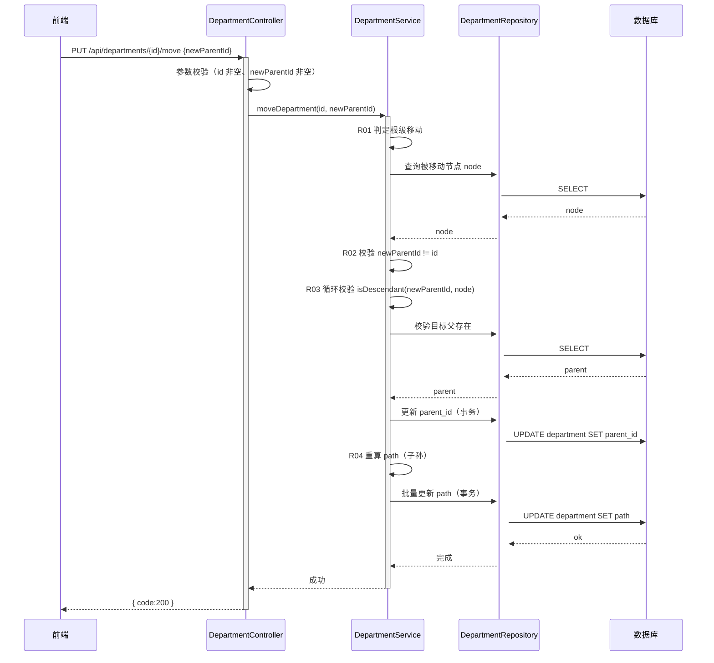

**业务规则：**

| 规则编号 | 规则描述 | 校验时机 | 不满足时的处理 |
|----------|----------|----------|--------------|
| R01 | newParentId=0/null 表示根级 | 移动时 | 允许 |
| R02 | newParentId 不能等于 id | 移动时 | 返回 DEPT_002，HTTP 400 |
| R03 | newParentId 不能是 id 的子孙 | 移动时 | 返回 DEPT_002，HTTP 400 |
| R04 | 重算 path 含所有子孙 | 移动后 | 事务内批量更新 |
| R05 | 全程事务 | 始终 | 失败回滚 |

**异常场景：**

| 异常场景 | 处理方式 |
|----------|----------|
| 循环引用（父变子孙） | 返回 400，前端将树还原到拖拽前状态 |
| 目标父部门不存在 | 返回 DEPT_001 |
| 事务中途失败 | 回滚，返回 500，前端还原树 |

**并发控制：**
- 并发场景：多个用户同时拖拽同一部门或重叠子树，可能导致 path 不一致。
- 控制策略：采用乐观锁不可行（path 重算涉及多行）；采用对被移动节点 id 加分布式锁（Redis，锁粒度=部门节点 id），先获取锁者执行，后获取者等待超时返回 409。当前单实例可退化为 JVM 内 synchronized 按节点 id 加锁；多实例部署需 Redis 分布式锁。
- 多方案对比：

| 方案 | 优点 | 缺点 |
|------|------|------|
| A. 无并发控制 | 实现简单 | path 可能不一致，子孙更新丢失 |
| B. 分布式锁（Redis，按节点id） | 粒度细，保证子树 path 一致 | 引入 Redis 依赖 |
| C. 行级悲观锁（SELECT ... FOR UPDATE 锁被移动节点） | 无额外依赖 | 仅锁单行，子孙批量更新仍需事务 |

- **推荐方案**：B（分布式锁按节点 id），保证子树 path 重算的原子性；若当前无 Redis，临时降级为 C（事务 + 悖论锁根节点），后续切 B。直接采用 B（推荐）。

##### 5.1.3.3 部门删除校验（F13/F16）

- 处理时序图
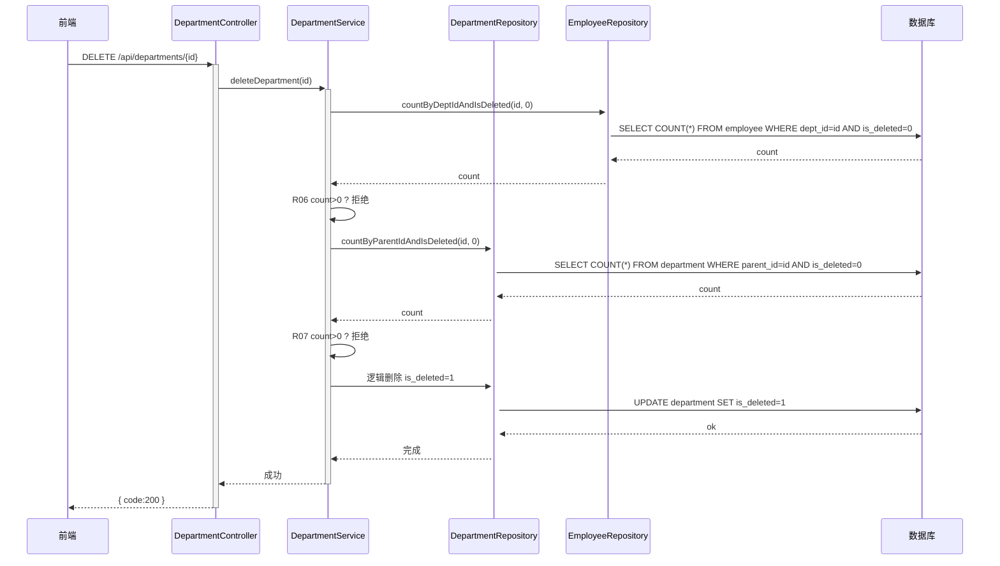

**业务规则：** 见 R06/R07/R08。

**异常场景：**

| 异常场景 | 处理方式 |
|----------|----------|
| 部门下有员工 | 返回 DEPT_003，msg 含员工数量 |
| 部门下有子部门 | 返回 DEPT_004 |

**并发控制：** 删除与员工新增并发：删除校验员工数为 0 后、逻辑删除前，可能有新员工挂入。采用事务 + 删除时对部门行加悲观锁（SELECT FOR UPDATE），并在逻辑删除后保留 parent_id 便于排查；可接受短暂窗口，因为删除为低频操作。

### 5.2 员工模块（Employee）

#### 5.2.1 表结构设计

##### 5.2.1.1 表 employee

| 字段名 | 数据类型 | 约束 | 默认值 | 说明 |
|--------|----------|------|--------|------|
| id | bigint | PK, 自增 | - | 系统自增主键 |
| name | varchar(50) | NOT NULL | - | 员工姓名 |
| employee_no | varchar(32) | NOT NULL | - | 工号，全局唯一 |
| phone | varchar(20) | NOT NULL | - | 手机号，全局唯一 |
| dept_id | bigint | NOT NULL | - | 所属部门ID |
| position | varchar(50) | NULL | NULL | 职位 |
| status | varchar(16) | NOT NULL | 'ACTIVE' | 员工状态：ACTIVE在职/RESIGNED离职 |
| is_deleted | tinyint | NOT NULL | 0 | 逻辑删除标记：0未删/1已删 |
| resign_date | date | NULL | NULL | 离职日期 |
| version | int | NOT NULL | 0 | 乐观锁版本号（JPA @Version） |
| created_at | datetime | NOT NULL | CURRENT_TIMESTAMP | 创建时间 |
| updated_at | datetime | NOT NULL | CURRENT_TIMESTAMP ON UPDATE CURRENT_TIMESTAMP | 修改时间 |

**索引：**
- PK: `pk_employee` (id)
- UK: `uk_emp_no` (employee_no)
- UK: `uk_emp_phone` (phone)
- IDX: `idx_emp_dept` (dept_id)
- IDX: `idx_emp_status` (status)

> 注：employee_no/phone 唯一索引与逻辑删除冲突——离职员工 is_deleted=1 但工号/手机号仍占唯一索引，导致无法复用工号。假设离职后工号不可复用（历史唯一），唯一索引保底即可。若需复用，唯一索引改为 (employee_no, is_deleted) 联合唯一。当前采用前者（不可复用），简化设计。

##### 5.2.1.2 枚举与常量定义

| 枚举名称 | 取值 | 含义 | 关联字段 |
|----------|------|------|----------|
| EmployeeStatus | ACTIVE | 在职 | employee.status |
| EmployeeStatus | RESIGNED | 离职 | employee.status |
| EmployeeDeletedFlag | 0 | 未删除 | employee.is_deleted |
| EmployeeDeletedFlag | 1 | 已删除 | employee.is_deleted |
| CheckField | employeeNo | 校验工号 | /api/employees/check?field= |
| CheckField | phone | 校验手机号 | /api/employees/check?field= |

#### 5.2.2 接口详细设计

##### W04 员工实时唯一校验

- **URI**: GET /api/employees/check
- **描述**: 校验工号或手机号是否已存在（全局唯一），供前端光标移开实时校验。
- **入参**:

| 参数名称 | 类型 | 是否必填 | 描述 |
|----------|------|----------|------|
| field | String | 是 | 校验字段：employeeNo / phone |
| value | String | 是 | 待校验值 |

- **出参**:

| 参数名称 | 类型 | 描述 |
|----------|------|------|
| code | int | 结果code |
| msg | String | 提示信息 |
| data | Object | 校验结果 |

- data 结构:

| 参数名称 | 类型 | 描述 |
|----------|------|------|
| isExist | boolean | true=已存在（重复） / false=可用 |

- **错误码**:

| 错误码 | 说明 |
|--------|------|
| EMP_001 | field 参数非法（非 employeeNo/phone） |

- **业务规则**: 查询 employee 中对应字段=value 且 is_deleted=0 的记录是否存在。

- **请求示例**: `GET /api/employees/check?field=employeeNo&value=10086`

- **响应示例**:
```json
{ "code": 200, "msg": "success", "data": { "isExist": false } }
```

##### W05 员工新增

- **URI**: POST /api/employees
- **描述**: 录入员工信息，校验工号/手机号全局唯一 + 部门合法性后落库。
- **入参**:

| 参数名称 | 类型 | 是否必填 | 描述 |
|----------|------|----------|------|
| name | String | 是 | 姓名 |
| employeeNo | String | 是 | 工号 |
| phone | String | 是 | 手机号 |
| deptId | long | 是 | 所属部门ID |
| position | String | 否 | 职位 |

- **出参**:

| 参数名称 | 类型 | 描述 |
|----------|------|------|
| code | int | 结果code |
| msg | String | 提示信息 |
| data | Object | 新增员工信息 |

- data 结构:

| 参数名称 | 类型 | 描述 |
|----------|------|------|
| id | long | 员工ID |
| name | String | 姓名 |
| employeeNo | String | 工号 |
| phone | String | 手机号 |
| deptId | long | 部门ID |
| position | String | 职位 |
| status | String | 状态（ACTIVE） |

- **错误码**:

| 错误码 | 说明 |
|--------|------|
| EMP_002 | 工号已存在（HTTP 400） |
| EMP_003 | 手机号已存在（HTTP 400） |
| DEPT_001 | 所属部门不存在（HTTP 400） |

- **业务规则**:
  - R11: 应用层校验 employee_no 全局唯一（is_deleted=0），重复返回 EMP_002。
  - R12: 应用层校验 phone 全局唯一（is_deleted=0），重复返回 EMP_003。
  - R13: 校验 dept_id 对应部门存在且 is_deleted=0，否则 DEPT_001。
  - R14: DB 唯一索引保底（uk_emp_no/uk_emp_phone），应用层与 DB 双重校验。
  - R15: 新增员工 status 默认 ACTIVE，version 默认 0。

- **请求示例**:
```json
{ "name": "张三", "employeeNo": "10086", "deptId": 2, "phone": "13800138000" }
```

- **响应示例**:
```json
{
  "code": 200,
  "msg": "新增成功",
  "data": { "id": 101, "name": "张三", "employeeNo": "10086", "deptId": 2, "position": null, "status": "ACTIVE" }
}
```

##### W06 员工分页列表

- **URI**: GET /api/employees
- **描述**: 按部门筛选分页查询员工列表，支持状态筛选。
- **入参**:

| 参数名称 | 类型 | 是否必填 | 描述 |
|----------|------|----------|------|
| deptId | long | 否 | 部门ID筛选（不传则全量） |
| status | String | 否 | 状态筛选：ACTIVE/RESIGNED |
| page | int | 否 | 页码，默认 1 |
| size | int | 否 | 每页条数，默认 10，最大 100（A07） |

- **出参**:

| 参数名称 | 类型 | 描述 |
|----------|------|------|
| code | int | 结果code |
| msg | String | 提示信息 |
| data | Object | 分页结果 |

- data 结构:

| 参数名称 | 类型 | 描述 |
|----------|------|------|
| page | int | 当前页 |
| size | int | 每页条数 |
| total | long | 总条数 |
| list | Array | 员工列表 |

- **业务规则**:
  - R16: size 超过 100 强制截断为 100（A07）。
  - R17: 查询过滤 is_deleted=0。
  - R18: deptId 传入时按 dept_id 精确匹配；status 传入时按状态匹配。

- **请求示例**: `GET /api/employees?deptId=2&status=ACTIVE&page=1&size=10`

- **响应示例**:
```json
{
  "code": 200,
  "msg": "success",
  "data": {
    "page": 1, "size": 10, "total": 25,
    "list": [ { "id": 101, "name": "张三", "employeeNo": "10086", "deptId": 2, "status": "ACTIVE" } ]
  }
}
```

##### W07 员工调动

- **URI**: POST /api/employees/{id}/transfer
- **描述**: 更新员工 dept_id，级联更新默认审批流节点，写入调动记录。
- **入参**:

| 参数名称 | 类型 | 是否必填 | 描述 |
|----------|------|----------|------|
| id | long | 是 | 员工ID（路径参数） |
| newDeptId | long | 是 | 目标部门ID |
| newPosition | String | 否 | 新职位 |
| reason | String | 否 | 调动原因 |

- **出参**:

| 参数名称 | 类型 | 描述 |
|----------|------|------|
| code | int | 结果code |
| msg | String | 提示信息 |
| data | Object | 空 |

- **错误码**:

| 错误码 | 说明 |
|--------|------|
| EMP_004 | 员工不存在或已离职 |
| DEPT_001 | 目标部门不存在 |
| EMP_005 | 乐观锁冲突（HTTP 409） |

- **业务规则**:
  - R19: 校验员工存在且 status=ACTIVE。
  - R20: 校验目标部门存在且 is_deleted=0。
  - R21: 更新 employee.dept_id 与 position。
  - R22: 级联调用 ApprovalFlowService.updateByTransfer，按目标部门 leader_id 更新 approval_flow_node.approver_id。
  - R23: 写入 transfer_record（from_dept_id/to_dept_id/old_position/new_position/reason/operator）。
  - R24: 全程事务，级联失败回滚。
  - R25: 乐观锁——更新时带 version 校验，冲突返回 409。

- **请求示例**:
```json
{ "newDeptId": 3, "newPosition": "Java开发", "reason": "业务调整" }
```

- **响应示例**:
```json
{ "code": 200, "msg": "调动成功", "data": null }
```

##### W08 员工离职

- **URI**: PUT /api/employees/{id}/resign
- **描述**: 逻辑删除员工，更新状态为离职，释放账号许可，清除登录权限。
- **入参**:

| 参数名称 | 类型 | 是否必填 | 描述 |
|----------|------|----------|------|
| id | long | 是 | 员工ID（路径参数） |
| resignDate | String | 是 | 离职日期（yyyy-MM-dd） |

- **出参**:

| 参数名称 | 类型 | 描述 |
|----------|------|------|
| code | int | 结果code |
| msg | String | 提示信息 |
| data | Object | 空 |

- **错误码**:

| 错误码 | 说明 |
|--------|------|
| EMP_004 | 员工不存在 |
| EMP_006 | 员工已离职，重复操作 |
| EMP_005 | 乐观锁冲突（HTTP 409） |

- **业务规则**:
  - R26: 校验员工存在。
  - R27: 校验当前 status != RESIGNED，否则 EMP_006。
  - R28: 更新 status=RESIGNED, is_deleted=1, resign_date=传入值。
  - R29: 释放账号许可——调用 IamExtensionService.releaseAccount（扩展点），清理/停用该员工作为 approver 的 approval_flow_node 记录。
  - R30: 历史保留——employee 记录保留（逻辑删除），历史考勤/审批数据不变，关联查询带 status 标识。
  - R31: 乐观锁——更新带 version，冲突 409。
  - R32: 全程事务。

- **请求示例**:
```json
{ "resignDate": "2023-11-01" }
```

- **响应示例**:
```json
{ "code": 200, "msg": "离职办理成功", "data": null }
```

#### 5.2.3 子功能详细设计

##### 5.2.3.1 员工新增与唯一校验（F07）

- 处理时序图
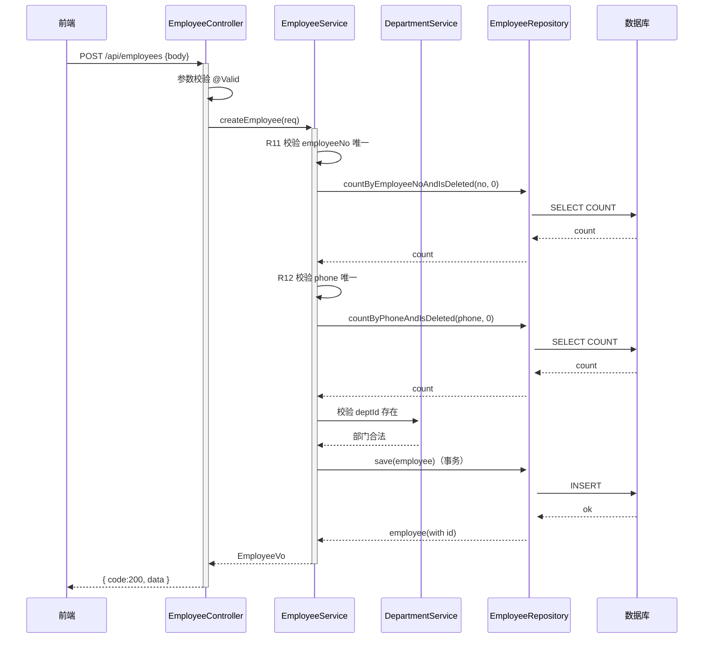

**业务规则：** 见 R11–R15。

**异常场景：**

| 异常场景 | 处理方式 |
|----------|----------|
| 工号重复 | 返回 EMP_002，前端输入框标红 |
| 手机号重复 | 返回 EMP_003，前端输入框标红 |
| 部门不存在 | 返回 DEPT_001 |
| DB 唯一索引冲突（并发新增相同工号） | 捕获 DataIntegrityViolationException，返回 EMP_002 |

**并发控制：**
- 并发场景：两个 HR 同时录入相同工号/手机号。
- 控制策略：应用层先查 + DB 唯一索引保底（双保险）。应用层校验通过但 DB 插入时唯一索引冲突，捕获异常返回明确错误码。
- 多方案对比：

| 方案 | 优点 | 缺点 |
|------|------|------|
| A. 仅应用层校验 | 实现简单 | 并发下可能双插入 |
| B. 应用层 + DB 唯一索引 | 双保险，强一致 | 需处理 DB 异常转业务码 |
| C. 分布式锁（按工号/手机号值） | 严格串行 | 引入 Redis，锁粒度细但量大 |

- **推荐方案**：B（应用层 + DB 唯一索引），兼顾简单与强一致。直接采用 B。

##### 5.2.3.2 员工分页查询（F14/F17）

- 处理时序图
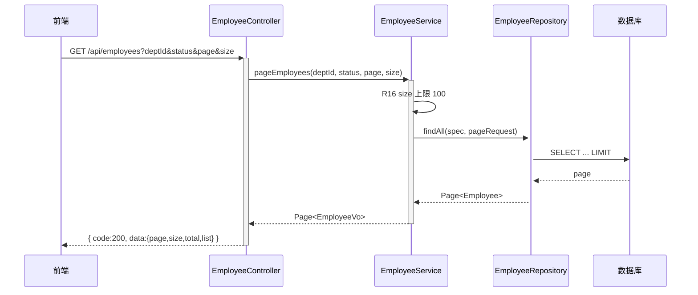

**业务规则：** 见 R16–R18。

**异常场景：**

| 异常场景 | 处理方式 |
|----------|----------|
| page 超出总页数 | 返回空 list，total 正确 |
| size 过大 | 截断为 100 |

**并发控制：** 无并发风险，只读分页查询。

##### 5.2.3.3 员工调动（F08）

- 处理时序图
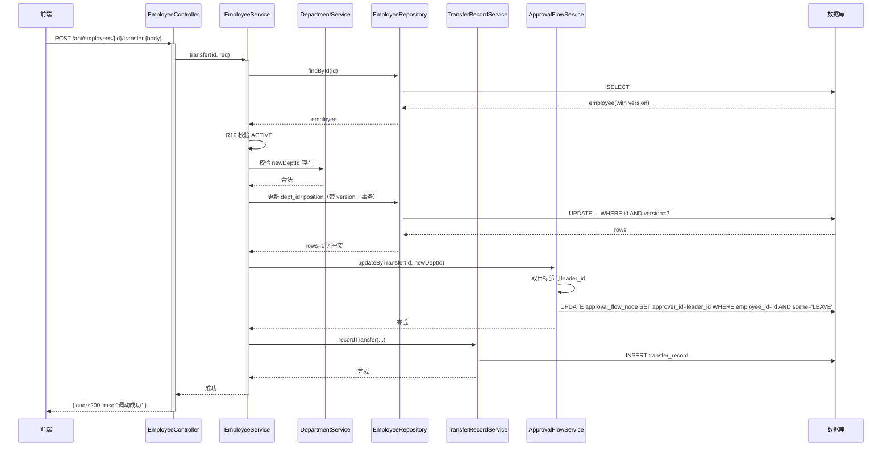

**业务规则：** 见 R19–R25。

**异常场景：**

| 异常场景 | 处理方式 |
|----------|----------|
| 员工已离职 | 返回 EMP_004 |
| 目标部门不存在 | 返回 DEPT_001 |
| 乐观锁冲突 | 返回 EMP_005，HTTP 409，前端提示"该员工信息已被他人修改，请刷新重试" |
| 级联更新失败 | 事务回滚，返回 500 |

**并发控制：**
- 并发场景：HR-A 与 HR-B 同时对同一员工发起调动。
- 控制策略：乐观锁（version 字段，JPA @Version）。先提交者 version+1 成功，后提交者 UPDATE 影响行数=0，返回 409。
- 多方案对比：

| 方案 | 优点 | 缺点 |
|------|------|------|
| A. 乐观锁 version | 无锁，吞吐高，适合低冲突 | 冲突时需客户端重试 |
| B. 悲观锁 SELECT FOR UPDATE | 强一致 | 锁等待，吞吐低 |
| C. 分布式锁（按员工id） | 粒度可控 | 引入 Redis |

- **推荐方案**：A（乐观锁 version），符合 PRD 异常4要求，调动为低频操作冲突概率低。直接采用 A。

##### 5.2.3.4 员工离职（F10）

- 处理时序图
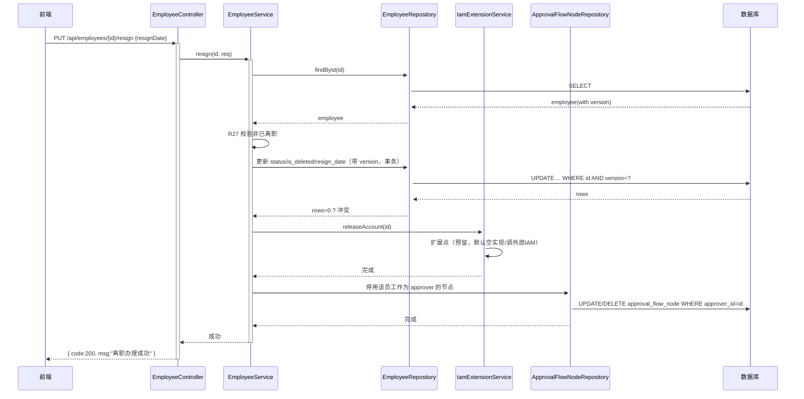

**业务规则：** 见 R26–R32。

**异常场景：**

| 异常场景 | 处理方式 |
|----------|----------|
| 员工已离职 | 返回 EMP_006 |
| 乐观锁冲突 | 返回 EMP_005，HTTP 409 |
| 外部 IAM 释放失败 | 记录告警日志，不阻断离职主流程（降级），后续补偿 |

**并发控制：** 乐观锁 version（同调动），防并发离职/调动冲突。

#### 5.2.4 状态机设计（员工状态）

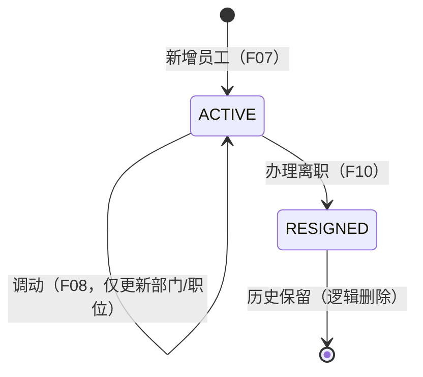

**状态流转规则：**

| 当前状态 | 目标状态 | 流转条件 | 前置校验 | 触发动作 |
|----------|----------|----------|----------|----------|
| 新建 | ACTIVE | 新增提交 | 工号/手机号唯一、部门合法 | 写入 employee、version=0 |
| ACTIVE | ACTIVE | 调动 | 员工存在、目标部门合法、乐观锁通过 | 更新 dept_id/position、级联审批流、写调动记录 |
| ACTIVE | RESIGNED | 办理离职 | 员工存在、非已离职、乐观锁通过 | 状态置 RESIGNED、逻辑删除、释放许可、停用审批节点 |
| RESIGNED | （终态） | - | - | 历史保留，不可编辑，关联查询带状态标识 |

> 注：离职为不可逆终态，无 RESIGNED → ACTIVE 流转；如需复职，走新增流程（新工号）。

### 5.3 调动记录模块（TransferRecord）

#### 5.3.1 表结构设计

##### 5.3.1.1 表 transfer_record

| 字段名 | 数据类型 | 约束 | 默认值 | 说明 |
|--------|----------|------|--------|------|
| id | bigint | PK, 自增 | - | 系统自增主键 |
| employee_id | bigint | NOT NULL | - | 员工ID |
| from_dept_id | bigint | NOT NULL | - | 原部门ID |
| to_dept_id | bigint | NOT NULL | - | 目标部门ID |
| old_position | varchar(50) | NULL | NULL | 原职位 |
| new_position | varchar(50) | NULL | NULL | 新职位 |
| reason | varchar(255) | NULL | NULL | 调动原因 |
| operator | varchar(50) | NULL | NULL | 操作人（假设 A04，暂从前端头注入） |
| created_at | datetime | NOT NULL | CURRENT_TIMESTAMP | 创建时间 |

**索引：**
- PK: `pk_transfer_record` (id)
- IDX: `idx_transfer_emp` (employee_id)

#### 5.3.1.2 枚举与常量定义

本模块无枚举/常量定义（纯历史记录表）。

#### 5.3.2 子功能详细设计

##### 5.3.2.1 调动留痕（F08 级联）

- 处理时序图：见 5.2.3.3 调动时序中 recordTransfer 部分。
- **业务规则：**

| 规则编号 | 规则描述 | 校验时机 | 不满足时的处理 |
|----------|----------|----------|--------------|
| R33 | 调动成功后必须写入 transfer_record | 调动事务内 | 写入失败则回滚调动 |
| R34 | 记录 from/to 部门、新旧职位、原因、操作人 | 始终 | - |

**异常场景：**

| 异常场景 | 处理方式 |
|----------|----------|
| 写入失败 | 事务回滚，调动不生效 |

**并发控制：** 无独立并发风险，跟随调动事务。

### 5.4 审批流模块（ApprovalFlow）

#### 5.4.1 表结构设计

##### 5.4.1.1 表 approval_flow_node

| 字段名 | 数据类型 | 约束 | 默认值 | 说明 |
|--------|----------|------|--------|------|
| id | bigint | PK, 自增 | - | 系统自增主键 |
| employee_id | bigint | NOT NULL | - | 员工ID |
| dept_id | bigint | NOT NULL | - | 关联部门ID（冗余，便于查询） |
| approver_id | bigint | NULL | NULL | 默认审批人ID（部门主管 leader_id） |
| scene | varchar(32) | NOT NULL | 'LEAVE' | 审批场景：LEAVE请假等 |
| created_at | datetime | NOT NULL | CURRENT_TIMESTAMP | 创建时间 |

**索引：**
- PK: `pk_approval_flow_node` (id)
- IDX: `idx_flow_emp` (employee_id)

#### 5.4.1.2 枚举与常量定义

| 枚举名称 | 取值 | 含义 | 关联字段 |
|----------|------|------|----------|
| ApprovalScene | LEAVE | 请假审批 | approval_flow_node.scene |
| ApprovalScene | OTHER | 其他（预留） | approval_flow_node.scene |

#### 5.4.2 子功能详细设计

##### 5.4.2.1 默认审批人级联更新（F08 级联）

- 处理时序图：见 5.2.3.3 调动时序中 updateByTransfer 部分。
- **业务规则：**

| 规则编号 | 规则描述 | 校验时机 | 不满足时的处理 |
|----------|----------|----------|--------------|
| R35 | 调动后按目标部门 leader_id 更新 approver_id | 调动事务内 | leader_id 为空则 approver_id 置空并告警 |
| R36 | 仅更新 scene=LEAVE 的节点（当前范围） | 始终 | - |

**异常场景：**

| 异常场景 | 处理方式 |
|----------|----------|
| 目标部门无 leader_id | approver_id 置空，记录告警日志，不阻断调动 |
| 员工无 approval_flow_node 记录 | 新建一条（employee_id+new dept_id+leader_id） |

**并发控制：** 跟随调动事务，无独立并发风险。

### 5.5 公共模块（Common）

#### 5.5.1 全局约定

- 统一响应体 ApiResponse\<T\>：{ code, msg, data }。
- 业务异常 BizException(code, msg)，由 GlobalExceptionHandler 统一转 HTTP 状态码（400/409/200）。
- 全局异常处理映射：BizException code=400 → HTTP 400；code=409 → HTTP 409；其余 → HTTP 200 + 业务 code。

#### 5.5.2 子功能详细设计

##### 5.5.2.1 全局异常处理

- 处理时序图
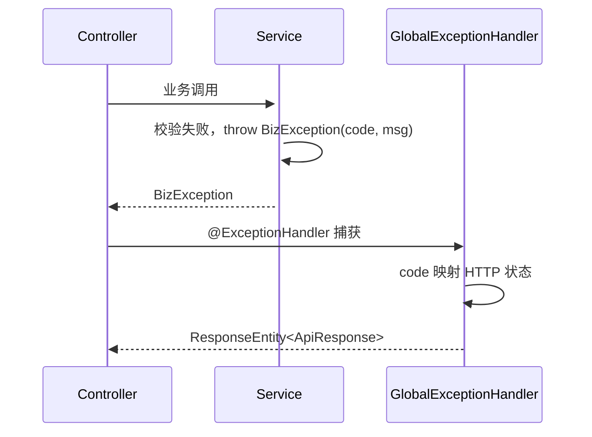

**业务规则：**

| 规则编号 | 规则描述 | 校验时机 | 不满足时的处理 |
|----------|----------|----------|--------------|
| R37 | BizException code=400 → HTTP 400 | 始终 | - |
| R38 | BizException code=409 → HTTP 409 | 始终 | - |
| R39 | 参数校验异常 MethodArgumentNotValid → HTTP 400 | 始终 | - |

### 5.6 跨模块调用链

##### 5.6.1 员工调动跨模块时序

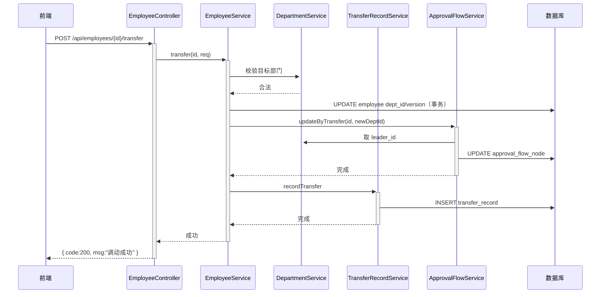

##### 5.6.2 员工离职跨模块时序

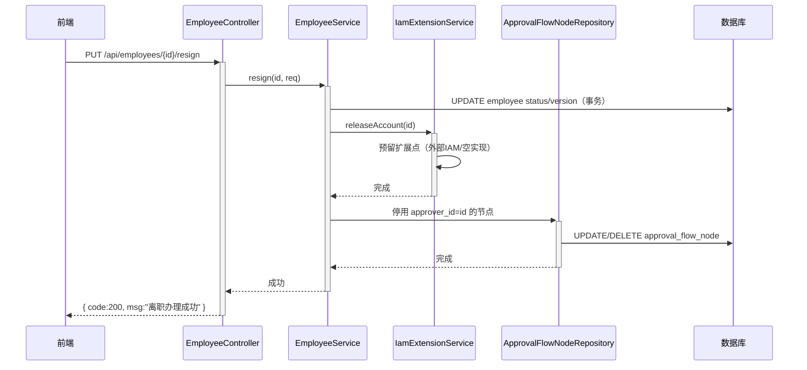

## 6. 非功能性需求设计

### 6.1 高可用性

- 后端 Spring Boot 多实例无状态部署，Nginx 负载均衡；单实例宕机不影响服务。
- 外部 IAM 释放为扩展点，调用失败时降级（记录告警日志，不阻断离职主流程），后续补偿任务重试释放。
- 数据库主从架构，主库故障可切从库（需运维流程）。

### 6.2 可扩展性

- 后端水平扩容：无状态实例可按流量扩缩容。
- 前端静态资源 CDN 扩展。
- 审批流 scene 字段可扩展更多审批场景（当前仅 LEAVE）。
- 账号许可释放采用扩展点设计（IamExtensionService），后续切换 IAM 实现不影响主流程。
- 多租户预留 tenant_id（当前不启用，假设 A08）。

### 6.3 稳定性/可靠性

- 部门拖拽 path 重算事务保证一致性，失败回滚。
- 员工唯一性双重校验（应用层 + DB 索引）。
- 乐观锁防并发调动/离职冲突，明确 409 反馈。
- 离职逻辑删除保证历史数据不丢失，关联查询带状态标识。
- 分页强制 size 上限 100，防止全量拉取压垮服务。

### 6.4 安全性设计

#### 6.4.1 账户系统方案

- 假设当前无独立鉴权后端，操作人身份暂从前端请求头 X-Operator 传入（假设 A04）；后续接入统一身份网关（buc/iam）注入。
- 本项为过渡方案，正式接入统一身份后由安全评审。

#### 6.4.2 授权&访问控制

##### 6.4.2.1 水平权限检查

- 预留水平权限检查点：部门主管仅可查看本部门及下属部门人员（通过 department.path 前缀匹配 + 当前用户关联部门判定）。
- 当前未实现完整水平权限，预留 Service 层切面扩展点。

##### 6.4.2.2 垂直权限检查

- 角色：超管/HR（最高权限）、部门主管（受限）。
- 假设通过接口层注解预留角色检查（如 @PreAuthorize），当前默认全放行，后续接入 RBAC。
- 离职员工不可编辑（前端灰标 + 后端 status 校验拒绝编辑）。

##### 6.4.2.3 登录态检查

- 当前 /api 接口未强制登录态检查（假设无鉴权后端）；正式上线需全局拦截器校验登录态，/api/employees/check 等查询接口也需登录。
- 白名单：无（当前全部需鉴权，正式接入后配置）。

#### 6.4.3 数据防护方案

##### 6.4.3.1 敏感数据加密存储

- 员工手机号 phone 为敏感信息，假设按需加密存储（当前明文存储，正式上线建议应用层加密/脱敏存储）。
- 本项待确认，标记 A05。

##### 6.4.3.2 敏感数据展示脱敏

- 前端列表展示手机号脱敏（如 138****8000）。
- 日志打印手机号/工号脱敏。
- 接口返回 phone 时按角色脱敏（部门主管仅看脱敏，HR 看完整）。

### 6.5 监控/统计/日志/告警

- 关键监控点：部门拖拽 move 接口调用量/失败率（循环引用 400 计数）、员工新增唯一校验冲突率、调动乐观锁 409 冲突率、离职调用量。
- 日志：所有写操作记录操作人、目标实体、前后值（调动记录表已天然留痕）。
- 告警：乐观锁 409 冲突率超阈值告警、外部 IAM 释放失败告警、DB 唯一索引冲突异常告警。

## 7. 变更三板斧

### 7.1 可监控

- 服务埋点：每个 /api 接口记录调用服务名、处理结果（code）、处理耗时。
- 三方服务埋点：外部 IAM releaseAccount 调用结果、耗时、失败计数（扩展点）。
- 关键业务埋点：调动事务成功率、级联审批流更新成功率、离职逻辑删除成功率。
- 监控大盘：接口 QPS/RT、400/409 错误率、DB 慢查询（path LIKE 查询）。

### 7.2 可灰度

- 部门拖拽 path 重算、员工调动级联审批流为复杂逻辑，需灰度。
- 多方案对比：

| 方案 | 优点 | 缺点 |
|------|------|------|
| A. 按租户尾号灰度 | 粒度可控 | 当前单租户不适用 |
| B. 按部门灰度（白名单部门ID） | 适合组织架构场景 | 需配置 |
| C. 接口级开关 + 灰度比例 | 通用 | 粒度粗 |

- **推荐方案**：B（按部门灰度，白名单部门先试），适配组织架构场景；当前单租户下按部门ID灰度最自然。直接采用 B。

### 7.3 可应急

- 功能开关：部门拖拽 move、员工调动 transfer 可通过配置开关切回旧逻辑（跳过 path 重算/级联审批流），仅更新 parent_id/dept_id 保底。
- 发布包回滚兜底：Flyway 迁移 V1 为建表，回滚需保留表结构（不 drop 表），仅回滚应用包。
- 回滚兼容性：path 字段为冗余字段，回滚到不维护 path 的版本仍可运行（path 仅用于加速查询，缺失时退化为递归查询）；version 字段回滚兼容（默认 0）。
- 应急优先级：越简单快速越好——拖拽/调动异常时先开关关闭对应功能，前端禁用入口，不影响已有数据查询。

## 8. 方案检查（Checklist）

| 检查项 | 详细描述 | 结果 | 说明 |
|------|------|------|------|
| 模块划分合理性检查 | 单一职责；无循环依赖；无功能点超 50% 的模块 | 通过 | 部门/员工/调动/审批流职责清晰，依赖单向（员工→部门/调动/审批流），无循环 |
| 依赖关系合理性 | 集成架构依赖是否合理，下游异常时本系统如何保证可用 | 通过 | 外部 IAM 异常降级不阻断离职；审批流级联失败回滚调动事务 |
| 单点问题检查（部署层面） | 部署架构是否有单点 | 通过 | 后端多实例无状态 + Nginx LB；DB 主从；无单点（DB 主库故障需运维切换，可接受） |
| 表模型设计范式检查 | 满足几范式，不提升的原因分析 | 通过 | department.path 冗余不满足3NF，但加速子孙查询，合理冗余；approval_flow_node.dept_id 冗余便于查询，合理 |
| 隐私安全检查 | 接口中敏感信息是否标识、需脱敏 | 通过（含待确认） | phone 标识为敏感，展示脱敏；加密存储待确认 A05 |
| 兼容性检查（接口） | 修改接口是否兼容旧调用方 | 不适用 | 原因：全新模块，无旧调用方 |
| 兼容性检查（表） | 表变更是否新旧版本都能运行 | 不适用 | 原因：全新建表 V1，无旧版本 |
| 数据迁移检查 | 新增表初始化数据需求、变更表迁移策略 | 通过 | V1 建表即初始化；需初始化根部门与示例数据（待确认是否需种子数据） |
| 一致性检查（功能点） | Step 1 每个 F 编号在 Step 5 中是否有对应设计 | 通过 | F01-F17 均在 5.1-5.6 有对应设计 |
| 一致性检查（表） | Step 3 每个实体在 Step 5 中是否有完整表结构定义 | 通过 | department/employee/transfer_record/approval_flow_node 均在 5.x 有字段定义 |
| 一致性检查（接口） | Step 4 每个接口在 Step 5 中是否有详细定义 | 通过 | W01-W08 均有详细入参/出参/错误码/示例 |
| 一致性检查（枚举） | 枚举定义与表结构字段说明是否一致 | 通过 | EmployeeStatus/CheckField/ApprovalScene 与字段 status/scene 等一致 |
| 状态机完整性检查 | 含状态字段的实体是否有状态机图，是否存在孤岛状态 | 通过 | employee 有状态机（ACTIVE→RESIGNED），无孤岛 |
| 并发风险检查 | 功能流程是否存在并发风险，多方案对比 + 推荐 | 通过 | 拖拽（分布式锁B）、新增唯一（DB索引B）、调动/离职（乐观锁A）均有方案对比推荐 |
| 单点问题检查（定时任务层面） | 定时任务是否单点、横向扩容方案 | 不适用 | 原因：当前无定时任务；IAM 释放补偿为预留扩展，未来需分布式调度 |
| 非功能性设计可行性检查 | Step 6 设计落地可行性 | 通过 | 多实例/降级/分页/脱敏均可落地；鉴权为过渡方案待接入 |
| 变更三板斧设计可行性检查（可监控） | 监控埋点设计可行性 | 通过 | 接口级埋点 + IAM 三方埋点 + 业务埋点可行 |
| 变更三板斧设计可行性检查（可灰度） | 灰度方案对比 + 推荐 | 通过 | 按部门灰度（方案B）推荐，适配组织架构 |
| 变更三板斧设计可行性检查（可应急） | 应急方案从上下游、自身角度 | 通过 | 开关切回旧逻辑 + 回滚兼容性（path/version 回滚安全） |

> 检查中发现并已修复/补充项：
> 1. 补充 department.leader_id 字段（假设 A03）以支撑审批流推导与部门主管数据权限，已在表结构与业务规则中体现。
> 2. 补充部门删除接口 W03（含子部门校验 DEPT_004），原需求未显式列删除但树管理完整性需要。
> 3. 补充 size 上限 100 约束（A07），防止全量拉取。
> 4. 补充离职员工 approver 节点停用逻辑，完善资源释放闭环。
