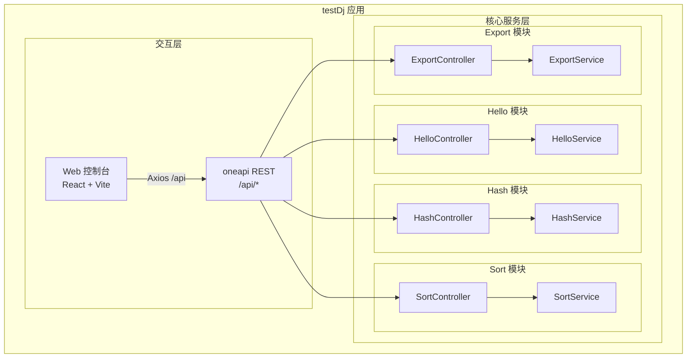
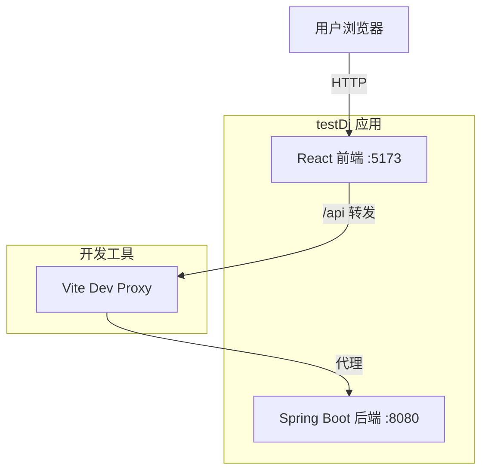
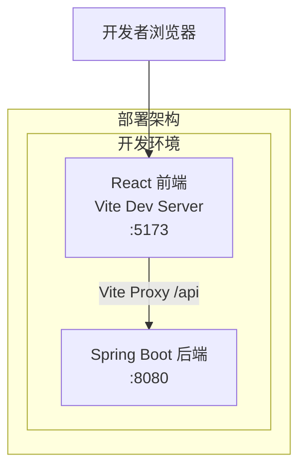

> **文档元信息**
>
> | 项目 | 内容 |
> |------|------|
> | 文档版本 | v1.0 |
> | 作者 | DTCoder |
> | 创建日期 | 2026-08-17 |
> | 需求来源 | 需求描述：分别写三个接口helloworld、哈希算法以及冒泡排序；前端新增三个Tab页面；新增导出按钮和导出接口 |
> | 评审状态 | 待评审 |

# testDj 跨仓系统分析设计

## 1. 需求与范围

### 背景与目标
构建一个支持三种基础功能（Hello World、SHA-256 哈希、冒泡排序）的 Web 应用，前端提供 Tab 切换页面展示各功能执行结果，并支持将各页面的结果导出为 PDF 文件。

### 核心功能
1. Hello World 功能：用户输入名字，返回问候语
2. SHA-256 哈希功能：用户输入文本，返回 SHA-256 哈希值
3. 冒泡排序功能：用户输入数字列表，返回排序后的结果
4. 导出功能：将当前 Tab 页面的结果导出为 PDF 文件

### 约束与非功能要求
- 后端：Spring Boot 3.2.5, Java 17, Maven, iText 7 Core (7.2.6)
- 前端：React 18, Vite 5, Axios
- 前后端分离部署，前端端口 5173，后端端口 8080
- 前端通过 Vite proxy 转发 /api 至后端
- 后端 CORS 配置允许 localhost:5173 和 localhost:3000

### 排除范围
- 不涉及用户认证与授权
- 不涉及持久化存储（无数据库需求）
- 不涉及分布式部署
- 不涉及消息队列

### 需求功能清单与优先级

| 编号 | 功能点 | 优先级 | PRD 原始描述 | 备注 |
|------|--------|--------|-------------|------|
| F01 | Hello World 接口 | P0 | 实现 Hello World 接口 | 后端 POST /api/hello |
| F02 | SHA-256 哈希接口 | P0 | 实现哈希算法 | 后端 POST /api/hash |
| F03 | 冒泡排序接口 | P0 | 实现冒泡排序 | 后端 POST /api/bubble-sort |
| F04 | 前端 Tab 页面 | P0 | 三个 Tab 展示不同执行结果 | Hello/Hash/Sort 三个组件 |
| F05 | 导出按钮及导出接口 | P0 | 新增导出按钮，后台提供导出接口 | PDF 格式导出各页面结果 |

### 假设与待确认项

| 编号 | 假设/待确认内容 | 当前假设 | 确认状态 |
|------|-----------------|----------|----------|
| A01 | 导出数据来源 | 导出时取当前页面展示的实时结果数据 | 待确认 |
| A02 | PDF 导出样式 | 采用统一表格格式展示字段名和值 | 待确认 |
| A03 | 无数据库需求 | 所有功能均为无状态计算，无需持久化 | 待确认 |

## 2. 架构与模块

### 功能架构



- **交互层**: React 前端 SPA，通过 Axios 调用后端 REST API
- **核心服务层**: 四个功能模块，每个模块遵循 Controller-Service 两层架构

**模块清单**

| 模块 | 职责 | 依赖 |
|------|------|------|
| Hello 模块 | 处理问候语生成 | 无（纯字符串处理） |
| Hash 模块 | 计算 SHA-256 哈希值 | java.security.MessageDigest |
| Sort 模块 | 执行冒泡排序 | 无（纯算法实现） |
| Export 模块 | 生成 PDF 导出文件 | iText 7 Core |

### 应用集成架构



**集成关系说明：**

| 调用方 | 被调用方 | 协议 | 接口类型 | 说明 |
|--------|----------|------|----------|------|
| 用户浏览器 | React 前端 | HTTP | Web 页面 | 访问 localhost:5173 |
| React 前端 | Spring Boot 后端 | HTTP | oneapi REST | Vite proxy 转发 /api |

### 部署架构



**部署说明：**
- **开发环境**: 前端通过 Vite Dev Server 运行在 5173 端口，后端 Spring Boot 运行在 8080 端口
- **生产部署**: 前端通过 `vite build` 构建静态资源，可由 Nginx 托管并与后端 API 同域部署或反向代理
- **数据层**: 本应用为无状态计算，不涉及数据库或缓存系统

## 3. 数据模型与存储

### 实体清单

| 实体名称 | 实体说明 | 所属模块 | 与其他实体的关系 |
|----------|----------|----------|-----------------|
| 本项不适用 | 本系统为无状态计算应用，所有功能均为纯计算逻辑，不涉及数据持久化 | - | - |

### 实体关系图

本项不适用，原因：系统无需持久化存储，所有输入即时处理并返回结果，无数据库实体。

### 模型说明

- 本应用所有功能（Hello World、SHA-256 哈希、冒泡排序、PDF 导出）均为**无状态计算**，不涉及数据库、缓存或消息队列
- 请求数据由前端提交，后端即时处理并返回结果，处理完成后无持久化留存
- PDF 导出文件在内存中生成后直接返回给前端下载，不存储于服务端

## 4. 接口设计

### 4.1 oneapi（Web 控制台接口）

| 编号 | 接口名称 | 方法 | 路径 | 模块 |
|------|----------|------|------|------|
| W01 | Hello World 问候 | POST | /api/hello | Hello 模块 |
| W02 | SHA-256 哈希计算 | POST | /api/hash | Hash 模块 |
| W03 | 冒泡排序 | POST | /api/bubble-sort | Sort 模块 |
| W04 | 导出结果 PDF | POST | /api/export | Export 模块 |

### 4.2 OpenAPI（对外接口）

本项不适用，原因：当前系统不提供对外 OpenAPI 接口。

### 4.3 内部接口（Service 层）

| 编号 | 接口名称 | 类 | 方法签名 |
|------|----------|------|----------|
| S01 | 问候服务 | HelloService | greet(String name) → String |
| S02 | 哈希服务 | HashService | sha256(String input) → String |
| S03 | 排序服务 | SortService | bubbleSort(List<Integer> array) → List<Integer> |
| S04 | 导出服务 | ExportService | exportTabResult(String tab, Map<String, Object> resultData) → byte[] |

### 4.4 集成接口（Integration 层）

本项不适用，原因：系统不依赖外部集成接口。

## 5. 功能模块设计

### 全局约定

- **通用出参结构**: 各接口使用扁平化 Map 返回，包含 tab 标识字段
- **错误码格式**: 未定义标准错误码，异常时返回 HTTP 4xx/5xx 状态码
- **参数校验**: Controller 层接收请求后直接调用 Service，无 @Valid 注解校验

### 5.1 Hello 模块

#### 5.1.1 表结构设计

本项不适用，原因：本模块无持久化需求。

#### 5.1.2 接口详细设计

##### W01 Hello World 问候

- **URI**: POST /api/hello
- **描述**: 接收用户名，返回问候语
- **入参**:

| 参数名称 | 类型 | 是否必填 | 描述 |
|----------|------|----------|------|
| name | String | 否 | 用户名，为空时默认使用 "World" |

- **出参**:

| 参数名称 | 类型 | 描述 |
|----------|------|------|
| tab | String | 固定值 "hello" |
| message | String | 问候语 |
| input | String | 用户输入值 |

- **错误码**: 无自定义错误码

- **业务规则**:
  - 若 name 为 null 或空白，默认使用 "World"
  - 返回格式："Hello, {name}!"

- **请求示例**:
```json
{ "name": "Alice" }
```

- **响应示例**:
```json
{
  "tab": "hello",
  "message": "Hello, Alice!",
  "input": "Alice"
}
```

#### 5.1.3 子功能详细设计

##### 5.1.3.1 问候语生成（F01）

- **处理时序图**:
```mermaid
sequenceDiagram
    participant C as 用户
    participant FE as React 前端
    participant Ctrl as HelloController
    participant Svc as HelloService

    C->>FE: 输入姓名并点击发送
    FE->>+Ctrl: POST /api/hello { name }
    Ctrl->>Ctrl: 参数校验
    Ctrl->>+Svc: greet(name)
    Svc->>Svc: name为空则默认"World"
    Svc-->>-Ctrl: "Hello, {name}!"
    Ctrl-->>-FE: { tab, message, input }
    FE-->>-C: 展示问候结果
```

**业务规则：**
| 规则编号 | 规则描述 | 校验时机 | 不满足时的处理 |
|----------|----------|----------|--------------|
| R01 | name 为空或 null 时使用默认值 | 调用时 | 默认使用 "World" |

**异常场景：**
| 异常场景 | 处理方式 |
|----------|----------|
| name 为 null | 默认使用 "World" |
| name 为空白字符串 | 自动 trim 后判空，为空则默认 "World" |

**并发控制：** 无并发风险，原因：纯计算无状态，无共享数据写入。

### 5.2 Hash 模块

#### 5.2.1 表结构设计

本项不适用，原因：本模块无持久化需求。

#### 5.2.2 接口详细设计

##### W02 SHA-256 哈希计算

- **URI**: POST /api/hash
- **描述**: 接收文本，返回 SHA-256 哈希值（十六进制）
- **入参**:

| 参数名称 | 类型 | 是否必填 | 描述 |
|----------|------|----------|------|
| input | String | 否 | 待哈希的文本，为空时返回空字符串的哈希值 |

- **出参**:

| 参数名称 | 类型 | 描述 |
|----------|------|------|
| tab | String | 固定值 "hash" |
| algorithm | String | 固定值 "SHA-256" |
| input | String | 用户输入文本 |
| hash | String | 64 位十六进制哈希值 |

- **错误码**: 无自定义错误码

- **业务规则**:
  - 使用 java.security.MessageDigest 实现 SHA-256
  - 输出为小写十六进制字符串
  - input 为 null 时当作空字符串处理

- **请求示例**:
```json
{ "input": "hello" }
```

- **响应示例**:
```json
{
  "tab": "hash",
  "algorithm": "SHA-256",
  "input": "hello",
  "hash": "2cf24dba5fb0a30e26e83b2ac5b9e29e1b161e5c1fa7425e73043362938b9824"
}
```

#### 5.2.3 子功能详细设计

##### 5.2.3.1 SHA-256 哈希计算（F02）

- **处理时序图**:
```mermaid
sequenceDiagram
    participant C as 用户
    participant FE as React 前端
    participant Ctrl as HashController
    participant Svc as HashService

    C->>FE: 输入文本并点击哈希
    FE->>+Ctrl: POST /api/hash { input }
    Ctrl->>Ctrl: input为null时设为空串
    Ctrl->>+Svc: sha256(input)
    Svc->>Svc: MessageDigest.getInstance("SHA-256")
    Svc->>Svc: digest → 十六进制编码
    Svc-->>-Ctrl: 哈希字符串
    Ctrl-->>-FE: { tab, algorithm, input, hash }
    FE-->>-C: 展示哈希结果
```

**业务规则：**
| 规则编号 | 规则描述 | 校验时机 | 不满足时的处理 |
|----------|----------|----------|--------------|
| R02 | input 为空时哈希空字符串 | 调用时 | 计算 "" 的 SHA-256 |

**异常场景：**
| 异常场景 | 处理方式 |
|----------|----------|
| SHA-256 算法不可用 | 抛出 RuntimeException，触发 HTTP 500 |

**并发控制：** 无并发风险，原因：纯计算无状态，无共享数据写入。

### 5.3 Sort 模块

#### 5.3.1 表结构设计

本项不适用，原因：本模块无持久化需求。

#### 5.3.2 接口详细设计

##### W03 冒泡排序

- **URI**: POST /api/bubble-sort
- **描述**: 接收整数列表，返回冒泡排序后的结果
- **入参**:

| 参数名称 | 类型 | 是否必填 | 描述 |
|----------|------|----------|------|
| array | Array<Integer> | 是 | 待排序的整数数组 |

- **出参**:

| 参数名称 | 类型 | 描述 |
|----------|------|------|
| tab | String | 固定值 "sort" |
| original | Array<Integer> | 原始数组 |
| sorted | Array<Integer> | 排序后数组 |
| length | Number | 数组长度 |

- **错误码**: 无自定义错误码

- **业务规则**:
  - 使用冒泡排序算法（Bubble Sort），升序排列
  - 操作时复制原数组，不修改原始输入

- **请求示例**:
```json
{ "array": [3, 1, 4, 1, 5] }
```

- **响应示例**:
```json
{
  "tab": "sort",
  "original": [3, 1, 4, 1, 5],
  "sorted": [1, 1, 3, 4, 5],
  "length": 5
}
```

#### 5.3.3 子功能详细设计

##### 5.3.3.1 冒泡排序（F03）

- **处理时序图**:
```mermaid
sequenceDiagram
    participant C as 用户
    participant FE as React 前端
    participant Ctrl as SortController
    participant Svc as SortService

    C->>FE: 输入数字列表并点击排序
    FE->>FE: 解析逗号分隔字符串为整数数组
    FE->>+Ctrl: POST /api/bubble-sort { array }
    Ctrl->>+Svc: bubbleSort(array)
    Svc->>Svc: 复制数组
    Svc->>Svc: 双重循环冒泡排序
    Svc-->>-Ctrl: 排序后列表
    Ctrl-->>-FE: { tab, original, sorted, length }
    FE-->>-C: 展示排序结果
```

**业务规则：**
| 规则编号 | 规则描述 | 校验时机 | 不满足时的处理 |
|----------|----------|----------|--------------|
| R03 | 输入为 null 时 | 调用时 | 抛出 NullPointerException |
| R04 | 时间复杂度 O(n²) | 运行中 | 大数据量下性能较低 |

**异常场景：**
| 异常场景 | 处理方式 |
|----------|----------|
| array 为 null | 抛出 NullPointerException，触发 HTTP 500 |
| 非数字输入 | 前端过滤，仅传递有效整数列表 |

**并发控制：** 无并发风险，原因：纯计算无状态，无共享数据写入。

### 5.4 Export 模块

#### 5.4.1 表结构设计

本项不适用，原因：本模块无持久化需求。

#### 5.4.2 接口详细设计

##### W04 导出结果 PDF

- **URI**: POST /api/export
- **描述**: 根据 tab 类型生成对应结果的 PDF 文件并返回
- **入参**:

| 参数名称 | 类型 | 是否必填 | 描述 |
|----------|------|----------|------|
| tab | String | 否 | 指定导出哪个 Tab 的结果，默认 "hello" |

- **出参**: application/pdf 二进制流，Content-Disposition: attachment

- **错误码**: 无自定义错误码

- **业务规则**:
  - 支持 "hello"、"hash"、"sort" 三种 Tab 类型的导出
  - 生成 PDF 包含标题、导出时间和结果数据表格
  - 使用 iText 7 Core 库生成 PDF

- **请求示例**:
```json
{ "tab": "hello" }
```

- **响应示例**: 二进制 PDF 文件流

#### 5.4.3 子功能详细设计

##### 5.4.3.1 PDF 导出（F05）

- **处理时序图**:
```mermaid
sequenceDiagram
    participant C as 用户
    participant FE as React 前端
    participant Ctrl as ExportController
    participant Svc as ExportService

    C->>FE: 点击"导出 PDF"按钮
    FE->>+Ctrl: POST /api/export { tab }
    Ctrl->>Ctrl: 构建样本数据
    Ctrl->>+Svc: exportTabResult(tab, data)
    Svc->>Svc: 创建 PdfWriter
    Svc->>Svc: 添加标题、时间、数据表格
    Svc-->>-Ctrl: PDF 字节数组
    Ctrl-->>-FE: application/pdf 二进制流
    FE->>FE: 创建 Blob 并触发下载
    FE-->>-C: 浏览器下载 PDF 文件
```

**业务规则：**
| 规则编号 | 规则描述 | 校验时机 | 不满足时的处理 |
|----------|----------|----------|--------------|
| R05 | tab 参数为 null 或无效 | 调用时 | 默认使用 "hello" |
| R06 | PDF 生成失败 | 生成时 | 抛出异常，触发 HTTP 500 |

**异常场景：**
| 异常场景 | 处理方式 |
|----------|----------|
| iText 库异常 | 抛出 RuntimeException，触发 HTTP 500 |
| 前端下载失败 | 前端捕获异常并显示错误消息 |

**并发控制：** 无并发风险，原因：每次请求独立创建 PDF 文档，无共享状态。

### 跨模块调用链

本应用各模块相互独立，不存在跨模块调用链。前端通过 Axios 分别调用各后端接口。

## 6. 非功能性需求设计

### 6.1 高可用性

本项不适用，原因：本系统为开发/演示用途的单实例应用，不涉及生产级高可用需求。若需部署到生产环境，建议后端多副本部署 + 负载均衡。

### 6.2 可扩展性

- **水平扩展**: 后端为无状态应用，可横向扩展多实例，前端通过负载均衡分发请求
- **垂直扩展**: 可通过增加单实例资源（CPU/内存）提升性能

### 6.3 稳定性/可靠性

- 所有计算逻辑均为纯函数，无副作用，输入相同则输出相同
- 异常处理采用 try-catch 机制，确保异常情况下返回合理响应
- 前端请求设置 10 秒超时，避免长时间等待

### 6.4 安全性设计

#### 6.4.1 账户系统方案

本项不适用，原因：本应用不涉及用户账户系统，无需登录认证。

#### 6.4.2 授权与访问控制

##### 6.4.2.1 是否实现水平权限检查

本项不适用，原因：不涉及数据库查询，为公共数据查询。

##### 6.4.2.2 是否实现垂直权限检查

本项不适用，原因：不涉及数据库查询或为公共数据查询。

##### 6.4.2.3 是否检查登录态

本项不适用，原因：当前应用未实现登录态检查，所有接口均为公开访问。

#### 6.4.3 数据防护方案

##### 6.4.3.1 是否对敏感数据加密存储

本项不适用，原因：系统无持久化存储，不涉及敏感数据存储。

##### 6.4.3.2 是否对敏感数据展示进行脱敏

本项不适用，原因：系统处理的数据为用户主动输入的公开文本，不涉及敏感信息。

### 6.5 监控/统计/日志/告警

本项不适用，原因：当前为开发/演示阶段，未配置生产级监控。建议后续增加：
- Spring Boot Actuator 健康检查端点
- 接口调用日志（请求/响应耗时）
- 错误日志集中收集

## 7. 变更三板斧

### 7.1 可监控

本项不适用，原因：当前为开发/演示阶段，未配置生产级监控。建议后续增加：
- 接口调用日志（SLF4J + Logback），记录每次请求的路径、处理耗时、处理结果
- 错误日志输出到文件，便于排查问题

### 7.2 可灰度

本项不适用，原因：当前功能简单且无多租户/多版本需求，无需灰度发布方案。新功能直接通过主分支发布。

### 7.3 可应急

- 前端/后端均为独立部署，回滚时可分别回退
- 后端使用 Spring Boot 标准打包，发布包为 Fat JAR，回滚时替换 JAR 包并重启即可
- 前端为静态资源，回滚时替换构建产物

**回滚注意事项：**
- 前后端独立部署，可独立回滚，互不影响
- 接口兼容性：新增接口不会影响已有接口，回滚时前端切换至旧版本即可