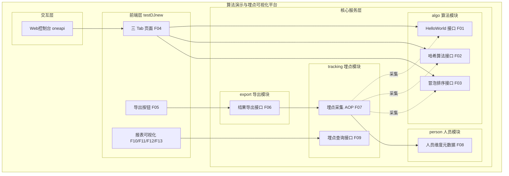
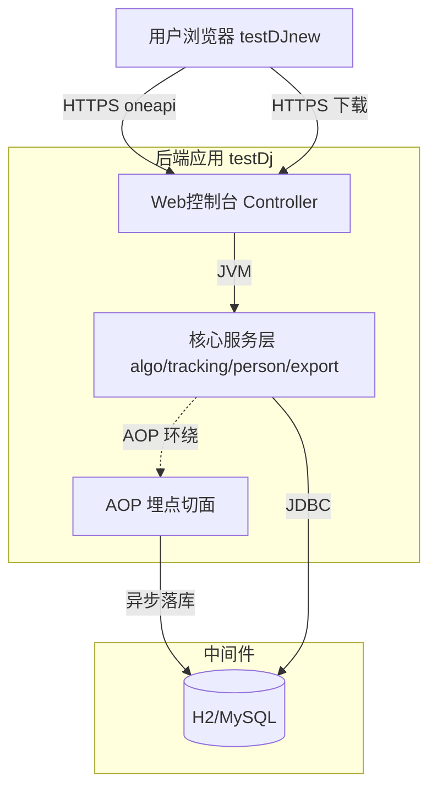
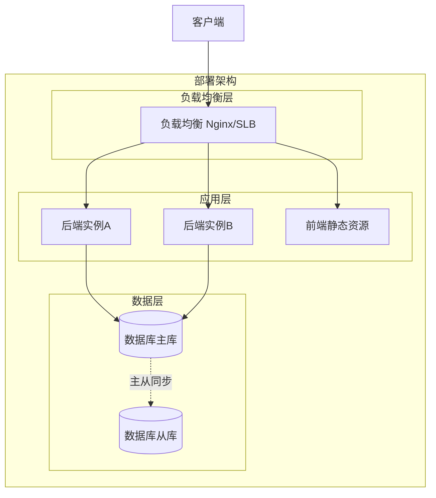
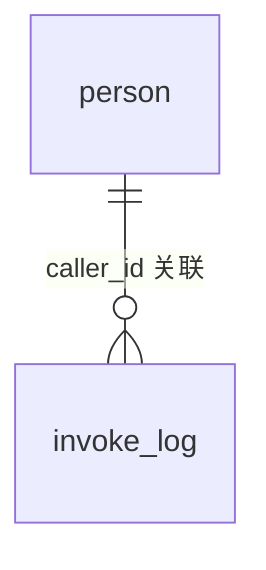
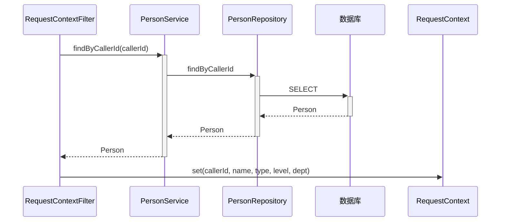
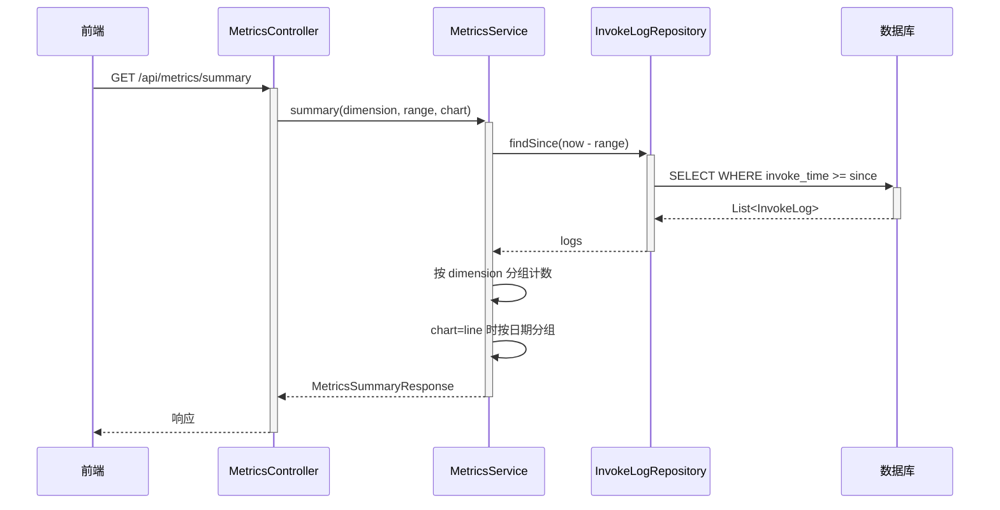
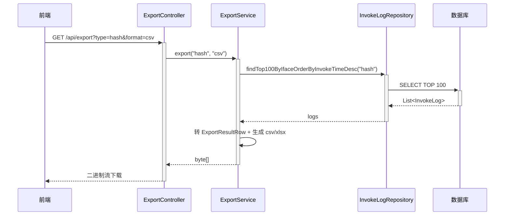
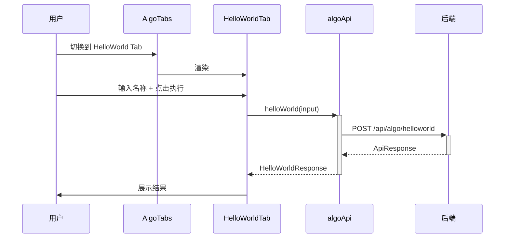
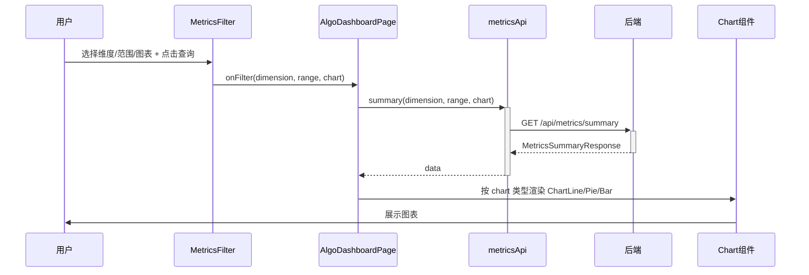

> **文档元信息**
>
> | 项目 | 内容 |
> |------|------|
> | 文档版本 | v1.0 |
> | 作者 | DTCoder（系分生成技能自动产出） |
> | 创建日期 | 2025-08-13 |
> | 需求来源 | 需求澄清 spec `.agents/specs/${system.dima}.md` + 实施计划 `.agents/specs/20260813-分别写三个接口helloworld、哈希.md` |
> | 评审状态 | 待评审 |

# 算法演示与调用埋点可视化平台 系分设计

## 1. 需求与范围

### 背景与目标

本需求要求在两个仓库协同实现一个"算法演示与调用埋点可视化平台"：

- **后端（testDj）**：提供三个算法演示接口（helloworld、哈希算法、冒泡排序）、结果导出接口、调用埋点采集与埋点查询接口，并维护人员维度元数据。
- **前端（testDJnew）**：新增一个页面，以三个 Tab 分别展示三个算法接口的执行结果；提供导出按钮触发后端导出；在当前页面可视化埋点报表，支持折线图、饼图、柱状图三种形式，按人员类型、人员层级、部门等维度查看调用情况。

目标：打通"算法演示 → 调用埋点 → 多维报表可视化 → 结果导出"全链路，跨仓通过接口契约对齐，接口变更向后兼容。

### 核心功能

1. 三个算法接口：helloworld、哈希算法（MD5/SHA-1/SHA-256）、冒泡排序。
2. 前端三 Tab 页面，分别展示三个接口执行结果。
3. 导出按钮 + 后端导出接口，支持导出各页面展示结果（xlsx/csv）。
4. 后端埋点：记录调用次数与调用人（含人员维度）。
5. 前端可视化报表：折线图/饼图/柱状图，按人员类型/人员层级/部门/接口维度。

### 约束与非功能要求

- 后端：Java 17 + Spring Boot 3.2.x；H2（开发）/ MySQL 8（生产）；Apache POI 5.x；Lombok；JUnit 5。
- 前端：React 18 + TypeScript 5 + Vite 5；Ant Design 5；Apache ECharts 5；Axios。
- 统一响应体：`{ code, data, msg, traceId }`，`code=0` 成功。
- 所有 REST 接口路径前缀 `/api/`。
- 调用人身份通过请求头 `X-User-Id`（必填）+ `X-User-Name`（可选）传递；人员维度由 `person` 元数据表按 `caller_id` 查询填充。
- 埋点采集失败不得影响业务接口（AOP 切面 try-catch + 异步落库）。
- 接口契约向后兼容：新增字段不破坏既有字段。
- 前端组件单一职责，每个组件可独立测试。
- 埋点采集为非侵入式（注解 + AOP）。

### 排除范围

- 不对接外部 HR/组织架构系统，人员维度元数据本仓内置种子数据。
- 不实现真实鉴权/SSO，开发期以请求头模拟调用人身份。
- 不做埋点数据 TTL 自动清理（待评审开放问题）。
- 不做导出权限控制（待评审开放问题）。
- 不做报表实时刷新缓存（默认每次查询实时聚合）。

### 需求功能清单与优先级

| 编号 | 功能点 | 优先级 | PRD 原始描述/章节 | 备注 |
|------|--------|--------|-------------------|------|
| F01 | 后端 helloworld 接口 | P0 | "分别写三个接口 helloworld" | 纯计算，输入名称返回问候 |
| F02 | 后端哈希算法接口 | P0 | "哈希算法" | 支持 MD5/SHA-1/SHA-256，默认 SHA-256 |
| F03 | 后端冒泡排序接口 | P0 | "冒泡排序" | 返回排序结果、交换次数、耗时 |
| F04 | 前端三 Tab 页面 | P0 | "前端新增一个页面，有三个 tab 分别展示不同的执行结果" | 每个 Tab 含输入+执行+结果展示 |
| F05 | 前端导出按钮 | P0 | "新增导出按钮" | 导出当前 Tab 对应接口结果 |
| F06 | 后端导出接口 | P0 | "后台提供导出接口，支持导出各个页面的展示结果" | xlsx/csv，来源埋点表 |
| F07 | 后端埋点采集（调用次数+调用人） | P0 | "后端再做个埋点，获取调用次数和调用人" | AOP 注解非侵入，异步落库 |
| F08 | 人员维度元数据 | P1 | "人员类型、人员层级、人员部门等" | person 表 + 种子数据 |
| F09 | 后端埋点查询接口 | P0 | "前端在当前页面上可视化出来一个报表查看调用情况" | 按维度聚合返回 series/trend |
| F10 | 前端报表-折线图 | P0 | "折线图" | 调用次数趋势 |
| F11 | 前端报表-饼图 | P0 | "饼图" | 维度占比 |
| F12 | 前端报表-柱状图 | P0 | "柱状图" | 维度对比 |
| F13 | 前端维度筛选 | P0 | "根据不同的维度：人员类型、人员层级、人员部门等" | 维度+时间范围+图表类型切换 |

### 假设与待确认项

| 编号 | 假设/待确认内容 | 当前假设 | 确认状态 |
|------|-----------------|----------|----------|
| A01 | 仓库映射：testDj=后端，testDJnew=前端 | testDj 承担后端（已含 hello world 占位），testDJnew 命名含 new 暗示前端新仓 | 待确认 |
| A02 | 后端技术栈 | Spring Boot 3.2.x + Java 17；契约不变，实现层可替换 | 待确认 |
| A03 | 前端技术栈 | React 18 + ECharts 5；组件结构可平移至 Vue | 待确认 |
| A04 | 导出范围 | 该接口最近 100 次调用记录；可扩展为时间区间（追加 from/to 参数，向后兼容） | 待确认 |
| A05 | 调用人身份传递 | 开发期请求头 X-User-Id/X-User-Name；生产期由网关鉴权注入 | 待确认 |
| A06 | 人员维度数据源 | 本仓内置 person 种子数据；待评审是否对接 HR 系统 | 待确认 |
| A07 | 埋点数据保留周期 | 暂无 TTL，后续可加定时清理 | 待确认 |
| A08 | 导出权限控制 | 暂不控制，后续可加按 caller_id 过滤 | 待确认 |
| A09 | 报表刷新策略 | 默认实时聚合，后续可加按天缓存 | 待确认 |

---

## 2. 架构与模块

### 功能架构



- 交互层说明：Web 控制台 oneapi 接口，前端通过 HTTPS 调用 `/api/` 前缀接口。
- 核心服务层说明：algo 模块提供三个纯计算算法端点；tracking 模块通过 AOP 切面非侵入采集算法调用埋点，并提供聚合查询；person 模块维护人员维度元数据供 tracking 填充；export 模块从埋点表读取快照生成导出文件。
- 前端层说明：三 Tab 页面承载算法演示，导出按钮触发下载，报表区按维度/时间/图表类型渲染 ECharts 图表。

**模块清单**

| 模块 | 职责 | 依赖 |
|------|------|------|
| algo | 三个算法纯计算逻辑与 REST 端点 | common（ApiResponse） |
| tracking | 埋点采集（AOP 切面）+ 埋点聚合查询接口 | person、common、tracking 表 |
| person | 人员维度元数据（类型/层级/部门）查询 | person 表 |
| export | 从埋点表读取结果快照生成 xlsx/csv | tracking（InvokeLogRepository） |
| common | 统一响应体、全局异常处理、traceId 过滤器 | 无 |
| config | RequestContext 上下文（解析调用人身份） | person |
| 前端 pages | 主页面组装 | 前端 components、api |
| 前端 components | Tab/导出按钮/筛选器/图表组件 | 前端 api、types |
| 前端 api | Axios 调用层 | 后端接口契约 |
| 前端 types | 跨仓契约 TS 类型定义 | 后端接口契约 |

### 应用集成架构



**集成关系说明：**

| 调用方 | 被调用方 | 协议 | 接口类型 | 说明 |
|--------|----------|------|----------|------|
| 用户浏览器 | 后端 Web控制台 | HTTPS | oneapi REST | 算法调用、埋点查询 |
| 用户浏览器 | 后端导出接口 | HTTPS | oneapi REST（二进制流） | 触发文件下载 |
| 后端核心服务层 | 数据库 | JDBC | SQL | 埋点落库、人员查询、导出读取 |
| AOP 切面 | tracking 表 | JVM→JDBC | 异步保存 | 埋点采集异步落库 |

### 部署架构



**部署说明：**
- **负载均衡层**：Nginx/SLB 转发，前端静态资源与后端 API 同域（前端 Vite 代理 `/api` 到后端 8080）。
- **应用层**：后端 Spring Boot 多实例无状态部署，可横向扩容；前端静态资源由 Nginx 托管。
- **数据层**：MySQL 主从架构；开发期使用 H2 内存库。埋点表为日志型数据，单表数据量超 500w 考虑分表或迁移至 OLAP 存储。

---

## 3. 数据模型与存储

### 实体清单

| 实体名称 | 实体说明 | 所属模块 | 与其他实体的关系 |
|----------|----------|----------|-----------------|
| invoke_log | 调用埋点记录，每次算法接口调用采集一条 | tracking | 多对一 person（按 caller_id 关联人员维度） |
| person | 人员维度元数据（类型/层级/部门） | person | 一对多 invoke_log（一个人员可有多条调用记录） |

### 实体关系图



**模型说明：**
- `invoke_log` 通过 `caller_id` 与 `person` 关联，埋点采集时由 AOP 切面从 RequestContext 读取人员维度（type/level/department）冗余写入 invoke_log，避免查询时 JOIN，提升聚合查询性能。
- `person` 为元数据表，初始内置种子数据，后续可对接 HR 系统替换。

---

## 4. 接口设计

### 4.1 oneapi（Web 控制台接口）

| 编号 | 接口名称 | 方法 | 路径 | 模块 |
|------|----------|------|------|------|
| W01 | helloworld | POST | /api/algo/helloworld | algo |
| W02 | 哈希算法 | POST | /api/algo/hash | algo |
| W03 | 冒泡排序 | POST | /api/algo/bubble | algo |
| W04 | 导出结果 | GET | /api/export | export |
| W05 | 埋点查询 | GET | /api/metrics/summary | tracking |

### 4.2 OpenAPI（对外接口）

本项不适用，原因：本平台为内部演示与可视化工具，无外部业务系统调用需求。

### 4.3 内部接口（Service 层）

| 编号 | 接口名称 | 类 | 方法签名 |
|------|----------|------|----------|
| S01 | helloworld | AlgoService | HelloWorldResponse helloWorld(String input) |
| S02 | 哈希计算 | AlgoService | HashResponse hash(String input, String algo) |
| S03 | 冒泡排序 | AlgoService | BubbleResponse bubbleSort(List<Integer> input) |
| S04 | 按调用人查人员 | PersonService | Person findByCallerId(String callerId) |
| S05 | 异步保存埋点 | TrackingService | void saveAsync(InvokeLog entry) |
| S06 | 埋点聚合查询 | MetricsService | MetricsSummaryResponse summary(String dimension, String range, String chart) |
| S07 | 导出 | ExportService | byte[] export(String type, String format) |

### 4.4 集成接口（Integration 层）

本项不适用，原因：本平台无外部系统集成，所有数据在仓内闭环。

---

## 5. 功能模块设计

### 全局约定

- 错误码格式：`{MODULE}_{SEQ}`，如 `ALGO_001`、`EXPORT_001`。
- 通用出参结构：`{ code: int, data: object|null, msg: string|null, traceId: string }`，`code=0` 成功。

**模块映射表：**

| 模块 | 错误码前缀 |
|------|-----------|
| algo | ALGO |
| tracking | TRACK |
| export | EXPORT |
| person | PERSON |
| common | COMMON |

### 5.1 algo 算法模块

#### 5.1.1 表结构设计

本模块无独立表，原因：三个算法接口均为纯计算，无状态持久化。结果快照由 tracking 模块的 invoke_log 表承载。

##### 5.1.1.1 枚举与常量定义

| 枚举名称 | 取值 | 含义 | 关联字段 |
|----------|------|------|----------|
| HashAlgo | SHA-256 | 默认哈希算法 | HashRequest.algo |
| HashAlgo | MD5 | MD5 摘要 | HashRequest.algo |
| HashAlgo | SHA-1 | SHA-1 摘要 | HashRequest.algo |

#### 5.1.2 接口详细设计

##### W01 helloworld

- **URI**: POST /api/algo/helloworld
- **描述**: 输入名称返回问候语，默认 "world"
- **入参**:

| 参数名称 | 类型 | 是否必填 | 描述 |
|----------|------|----------|------|
| input | String | 否 | 名称，默认 "world" |

- **出参**:

| 参数名称 | 类型 | 描述 |
|----------|------|------|
| code | int | 结果 code，0=成功 |
| data.message | String | 问候语，如 "Hello, world!" |
| msg | String | 提示信息（成功时 null） |
| traceId | String | 链路 ID |

- **错误码**:

| 错误码 | 说明 |
|--------|------|
| ALGO_001 | 输入参数非法 |

- **业务规则**: input 为空或空白时使用默认值 "world"。

- **请求示例**:
```json
{
  "input": "world"
}
```

- **响应示例**:
```json
{
  "code": 0,
  "data": { "message": "Hello, world!" },
  "msg": null,
  "traceId": "a1b2c3d4"
}
```

##### W02 哈希算法

- **URI**: POST /api/algo/hash
- **描述**: 对输入文本计算哈希摘要，支持 MD5/SHA-1/SHA-256
- **入参**:

| 参数名称 | 类型 | 是否必填 | 描述 |
|----------|------|----------|------|
| input | String | 是 | 待哈希文本 |
| algo | String | 否 | 算法，默认 SHA-256；支持 MD5/SHA-1/SHA-256 |

- **出参**:

| 参数名称 | 类型 | 描述 |
|----------|------|------|
| code | int | 0=成功 |
| data.input | String | 原始输入 |
| data.algo | String | 实际使用的算法 |
| data.digest | String | 十六进制摘要 |
| msg | String | 提示信息 |
| traceId | String | 链路 ID |

- **错误码**:

| 错误码 | 说明 |
|--------|------|
| ALGO_002 | 不支持的哈希算法 |

- **业务规则**: algo 为空时默认 SHA-256；不支持的算法抛 IllegalArgumentException（返回 400）。

- **请求示例**:
```json
{
  "input": "abc",
  "algo": "SHA-256"
}
```

- **响应示例**:
```json
{
  "code": 0,
  "data": { "input": "abc", "algo": "SHA-256", "digest": "ba7816bf8f01cfea414140de5dae2223b00361a396177a9cb410ff61f20015ad" },
  "msg": null,
  "traceId": "e5f6g7h8"
}
```

##### W03 冒泡排序

- **URI**: POST /api/algo/bubble
- **描述**: 对输入整数数组执行冒泡排序，返回排序结果、交换次数、耗时
- **入参**:

| 参数名称 | 类型 | 是否必填 | 描述 |
|----------|------|----------|------|
| input | List<Integer> | 是 | 待排序整数数组 |

- **出参**:

| 参数名称 | 类型 | 描述 |
|----------|------|------|
| code | int | 0=成功 |
| data.input | List<Integer> | 原始数组 |
| data.sorted | List<Integer> | 排序后数组 |
| data.swaps | int | 交换次数 |
| data.durationMs | double | 耗时（毫秒） |
| msg | String | 提示信息 |
| traceId | String | 链路 ID |

- **错误码**:

| 错误码 | 说明 |
|--------|------|
| ALGO_003 | 输入数组非法 |

- **业务规则**: 空数组返回空结果、swaps=0；不修改原始入参（拷贝后排序）。

- **请求示例**:
```json
{
  "input": [5, 3, 8, 1, 9, 2]
}
```

- **响应示例**:
```json
{
  "code": 0,
  "data": { "input": [5,3,8,1,9,2], "sorted": [1,2,3,5,8,9], "swaps": 7, "durationMs": 0.12 },
  "msg": null,
  "traceId": "i9j0k1l2"
}
```

#### 5.1.3 子功能详细设计

##### 5.1.3.1 算法调用与埋点采集（F01/F02/F03）

- 处理时序图
```mermaid
sequenceDiagram
    participant C as 前端
    participant Ctrl as AlgoController
    participant Aspect as TrackingAspect
    participant Svc as AlgoService
    participant TSvc as TrackingService
    participant DB as 数据库

    C->>+Ctrl: POST /api/algo/hash
    Ctrl->>+Aspect: @TrackInvoke 环绕进入
    Aspect->>+Svc: hash(input, algo)
    Svc-->>-Aspect: HashResponse
    Aspect->>Ctrl: 返回 ApiResponse.ok(resp)
    Ctrl-->>-C: 响应
    Aspect->>+TSvc: saveAsync(InvokeLog) 异步
    TSvc->>DB: INSERT invoke_log
    DB-->>-TSvc: 成功
```

**业务规则：**
| 规则编号 | 规则描述 | 校验时机 | 不满足时的处理 |
|----------|----------|----------|--------------|
| R01 | helloworld input 为空时使用默认值 | 调用时 | 使用 "world" |
| R02 | hash algo 为空时使用默认值 | 调用时 | 使用 SHA-256 |
| R03 | hash algo 不在支持列表 | 调用时 | 返回 ALGO_002，400 |
| R04 | bubble input 为空数组 | 调用时 | 返回空结果，swaps=0 |
| R05 | 埋点采集异常不影响业务 | finally | try-catch 吞异常，仅 warn 日志 |

**异常场景：**
| 异常场景 | 处理方式 |
|----------|----------|
| 哈希算法不支持 | 抛 IllegalArgumentException，全局异常处理返回 400 |
| 埋点落库失败 | AOP 切面 try-catch，warn 日志，业务正常返回 |
| 入参 JSON 解析失败 | 全局异常处理返回 400 |

**并发控制：**
- 并发场景：三个算法接口均为纯计算无副作用，无共享可变状态。
- 控制策略：无并发风险，原因：算法 Service 无状态，每次调用独立创建局部变量。

**状态机设计：**
本模块无状态字段，不适用。

### 5.2 person 人员模块

#### 5.2.1 表结构设计

##### 5.2.1.1 person 表

| 字段名 | 数据类型 | 约束 | 默认值 | 说明 |
|--------|----------|------|--------|------|
| id | bigint | PK, 自增 | - | 系统自增主键 |
| caller_id | varchar(64) | NOT NULL, UNIQUE | - | 调用人 ID |
| caller_name | varchar(64) | - | NULL | 调用人姓名 |
| person_type | varchar(32) | - | NULL | 人员类型（正式/外包/实习） |
| person_level | varchar(16) | - | NULL | 人员层级（L1-L6） |
| department | varchar(64) | - | NULL | 部门 |
| gmt_create | datetime | NOT NULL | CURRENT_TIMESTAMP | 创建时间 |
| gmt_modified | datetime | NOT NULL | CURRENT_TIMESTAMP | 修改时间 |

**索引：**
- UK: `uk_person_caller_id` (caller_id)
- IDX: 无额外索引（caller_id 唯一键已覆盖查询）

##### 5.2.1.2 枚举与常量定义

| 枚举名称 | 取值 | 含义 | 关联字段 |
|----------|------|------|----------|
| PersonType | 正式 | 正式员工 | person.person_type |
| PersonType | 外包 | 外包人员 | person.person_type |
| PersonType | 实习 | 实习生 | person.person_type |
| PersonLevel | L1-L6 | 人员层级 | person.person_level |

#### 5.2.2 接口详细设计

本模块无对外 REST 接口，仅提供内部 Service。

##### S04 按调用人查人员

- **方法签名**: Person findByCallerId(String callerId)
- **入参**: callerId (String)
- **出参**: Person 或 null
- **业务规则**: callerId 为 null 时直接返回 null；查不到返回 null。

#### 5.2.3 子功能详细设计

##### 5.2.3.1 人员维度填充（F08）

- 处理时序图


**业务规则：**
| 规则编号 | 规则描述 | 校验时机 | 不满足时的处理 |
|----------|----------|----------|--------------|
| R06 | callerId 为 null | 查询前 | 直接返回 null，上下文维度为 null |
| R07 | 人员不存在 | 查询后 | 上下文维度为 null，不阻断请求 |

**异常场景：**
| 异常场景 | 处理方式 |
|----------|----------|
| 数据库查询异常 | RequestContext 维度为 null，请求继续 |

**并发控制：** 无并发风险，原因：人员元数据为只读查询。

**状态机设计：** 本模块无状态字段，不适用。

### 5.3 tracking 埋点模块

#### 5.3.1 表结构设计

##### 5.3.1.1 invoke_log 表

| 字段名 | 数据类型 | 约束 | 默认值 | 说明 |
|--------|----------|------|--------|------|
| id | bigint | PK, 自增 | - | 系统自增主键 |
| interface | varchar(32) | NOT NULL | - | 接口名（helloworld/hash/bubble/export/metrics） |
| caller_id | varchar(64) | - | NULL | 调用人 ID |
| caller_name | varchar(64) | - | NULL | 调用人姓名 |
| person_type | varchar(32) | - | NULL | 人员类型（冗余） |
| person_level | varchar(16) | - | NULL | 人员层级（冗余） |
| department | varchar(64) | - | NULL | 部门（冗余） |
| input_summary | varchar(512) | - | NULL | 入参摘要（截断 500） |
| result_summary | varchar(512) | - | NULL | 结果摘要（截断 500） |
| duration_ms | int | - | NULL | 耗时（毫秒） |
| invoke_time | datetime | - | NULL | 调用时间 |
| trace_id | varchar(64) | - | NULL | 链路 ID |
| gmt_create | datetime | NOT NULL | CURRENT_TIMESTAMP | 创建时间 |
| gmt_modified | datetime | NOT NULL | CURRENT_TIMESTAMP | 修改时间 |

> 注：`interface` 为数据库保留字，建表时需转义或使用列别名。JPA 实体属性名用 `iface`，通过 `@Column(name = "interface")` 映射。

**索引：**
- UK: 无唯一键
- IDX: `idx_invoke_log_iface_time` (interface, invoke_time) — 支持按接口+时间倒序查询最近 N 条
- IDX: `idx_invoke_log_time` (invoke_time) — 支持按时间范围聚合查询

##### 5.3.1.2 枚举与常量定义

| 枚举名称 | 取值 | 含义 | 关联字段 |
|----------|------|------|----------|
| IfaceType | helloworld | helloworld 接口 | invoke_log.interface |
| IfaceType | hash | 哈希接口 | invoke_log.interface |
| IfaceType | bubble | 冒泡排序接口 | invoke_log.interface |
| Dimension | personType | 人员类型维度 | MetricsSummaryRequest.dimension |
| Dimension | personLevel | 人员层级维度 | MetricsSummaryRequest.dimension |
| Dimension | department | 部门维度 | MetricsSummaryRequest.dimension |
| Dimension | interface | 接口维度 | MetricsSummaryRequest.dimension |
| RangeType | 1d/7d/30d | 时间范围 | MetricsSummaryRequest.range |
| ChartType | line/pie/bar | 图表类型 | MetricsSummaryRequest.chart |

#### 5.3.2 接口详细设计

##### W05 埋点查询

- **URI**: GET /api/metrics/summary
- **描述**: 按维度聚合埋点数据，返回 series（维度聚合）和 trend（趋势，仅折线图填充）
- **入参**:

| 参数名称 | 类型 | 是否必填 | 描述 |
|----------|------|----------|------|
| dimension | String | 是 | 维度：personType/personLevel/department/interface |
| range | String | 否 | 时间范围：1d/7d/30d，默认 7d |
| chart | String | 否 | 图表类型：line/pie/bar，默认 bar |

- **出参**:

| 参数名称 | 类型 | 描述 |
|----------|------|------|
| code | int | 0=成功 |
| data.dimension | String | 当前维度 |
| data.chart | String | 当前图表类型 |
| data.series | List<{label,value}> | 维度聚合结果 |
| data.trend | List<{date,value}> | 趋势数据（仅 line 填充） |
| msg | String | 提示信息 |
| traceId | String | 链路 ID |

- **错误码**:

| 错误码 | 说明 |
|--------|------|
| TRACK_001 | 不支持的维度 |
| TRACK_002 | 不支持的时间范围 |

- **业务规则**: dimension 不识别时聚合到 "unknown"；range 不识别时默认 7d；chart=line 时填充 trend。

- **请求示例**:
```
GET /api/metrics/summary?dimension=department&range=7d&chart=bar
```

- **响应示例**:
```json
{
  "code": 0,
  "data": {
    "dimension": "department",
    "chart": "bar",
    "series": [
      { "label": "研发一部", "value": 128 },
      { "label": "研发二部", "value": 96 }
    ],
    "trend": []
  },
  "msg": null,
  "traceId": "m3n4o5p6"
}
```

#### 5.3.3 子功能详细设计

##### 5.3.3.1 埋点采集（F07）

- 处理时序图见 5.1.3.1。

**业务规则：**
| 规则编号 | 规则描述 | 校验时机 | 不满足时的处理 |
|----------|----------|----------|--------------|
| R08 | @TrackInvoke 标注的方法被环绕拦截 | AOP 切面 | 采集入参/出参摘要、耗时、调用人 |
| R09 | 入参/出参摘要超 500 字符 | 采集时 | 截断至 500 |
| R10 | 采集异常不影响业务 | finally | try-catch 吞异常，warn 日志 |
| R11 | 异步落库 | saveAsync | @Async 线程池执行 |

**异常场景：**
| 异常场景 | 处理方式 |
|----------|----------|
| 落库失败 | TrackingService.saveAsync 内 try-catch，warn 日志 |
| RequestContext 为空 | 维度字段为 null，仍落库 |

**并发控制：**
- 并发场景：高并发算法调用产生大量埋点写入。
- 控制策略：异步落库（@Async），业务线程不阻塞；写入为 append-only 无冲突。多方案对比：

| 方案 | 优点 | 缺点 |
|------|------|------|
| 同步落库 | 实现简单 | 阻塞业务线程，影响接口耗时 |
| @Async 异步落库（推荐） | 不阻塞业务，实现简单 | 异步线程池需调优 |
| MQ 异步落库 | 解耦削峰 | 引入 MQ 中间件复杂度高 |

推荐：@Async 异步落库。理由：演示平台并发量有限，@Async 足够，避免引入 MQ 复杂度。

**状态机设计：** 本模块无状态字段，不适用。

##### 5.3.3.2 埋点聚合查询（F09）

- 处理时序图


**业务规则：**
| 规则编号 | 规则描述 | 校验时机 | 不满足时的处理 |
|----------|----------|----------|--------------|
| R12 | range 解析 | 查询前 | 不识别默认 7d |
| R13 | dimension 解析 | 聚合时 | 不识别聚合到 "unknown" |
| R14 | chart=line 填充 trend | 聚合后 | 非 line 时 trend 为空 |

**异常场景：**
| 异常场景 | 处理方式 |
|----------|----------|
| 无埋点数据 | series/trend 为空列表，不报错 |

**并发控制：** 无并发风险，原因：聚合查询为只读。

### 5.4 export 导出模块

#### 5.4.1 表结构设计

本模块无独立表，原因：导出数据来源于 tracking 模块的 invoke_log 表。

##### 5.4.1.1 枚举与常量定义

| 枚举名称 | 取值 | 含义 | 关联字段 |
|----------|------|------|----------|
| ExportFormat | xlsx | Excel 格式 | 导出请求 format |
| ExportFormat | csv | CSV 格式（兜底） | 导出请求 format |
| ExportType | helloworld/hash/bubble | 导出接口类型 | 导出请求 type |

#### 5.4.2 接口详细设计

##### W04 导出结果

- **URI**: GET /api/export
- **描述**: 导出指定接口最近 100 次调用记录，返回 xlsx/csv 二进制流
- **入参**:

| 参数名称 | 类型 | 是否必填 | 描述 |
|----------|------|----------|------|
| type | String | 是 | 接口类型：helloworld/hash/bubble |
| format | String | 否 | 格式：xlsx/csv，默认 csv |

- **出参**: 二进制流，`Content-Disposition: attachment; filename=algo-<type>-<ts>.<ext>`

- **错误码**:

| 错误码 | 说明 |
|--------|------|
| EXPORT_001 | 不支持的导出类型 |
| EXPORT_002 | 不支持的导出格式 |

- **业务规则**: 导出内容为该接口最近 100 次调用记录（按 invoke_time 倒序）；format=csv 作为兜底。

- **请求示例**:
```
GET /api/export?type=hash&format=csv
```

- **响应示例**: 二进制流（略）

#### 5.4.3 子功能详细设计

##### 5.4.3.1 结果导出（F06）

- 处理时序图


**业务规则：**
| 规则编号 | 规则描述 | 校验时机 | 不满足时的处理 |
|----------|----------|----------|--------------|
| R15 | 导出最近 100 条 | 查询时 | 按 invoke_time 倒序取 100 |
| R16 | format 不识别 | 生成时 | 默认 csv |
| R17 | 无数据 | 生成时 | 仅含表头，空数据行 |

**异常场景：**
| 异常场景 | 处理方式 |
|----------|----------|
| xlsx 生成异常（POI 问题） | 抛 RuntimeException，前端提示失败 |
| 数据库查询异常 | 全局异常处理返回 500 |

**并发控制：** 无并发风险，原因：导出为只读查询。

### 5.5 前端模块（testDJnew）

> 说明：前端模块为 React 组件，不涉及表结构。以下按组件设计。

#### 5.5.1 组件清单与职责

| 组件 | 职责 | 依赖 |
|------|------|------|
| AlgoDashboardPage | 主页面，组合三 Tab + 导出按钮 + 报表区 | AlgoTabs、ExportButton、MetricsFilter、Chart* |
| AlgoTabs | 三 Tab 容器，切换 helloworld/hash/bubble | HelloWorldTab、HashTab、BubbleTab |
| HelloWorldTab | helloworld 输入+执行+结果展示 | algoApi |
| HashTab | 哈希输入+算法选择+执行+摘要展示 | algoApi |
| BubbleTab | 数组输入+执行+排序前后对比+交换次数 | algoApi |
| ExportButton | 触发导出下载 | exportApi |
| MetricsFilter | 维度/时间范围/图表类型筛选 | metricsApi |
| ChartLine | 折线图渲染（调用次数趋势） | ECharts |
| ChartPie | 饼图渲染（维度占比） | ECharts |
| ChartBar | 柱状图渲染（维度对比） | ECharts |

#### 5.5.2 跨仓契约 TS 类型

| TS 类型 | 对应后端 | 字段 |
|---------|----------|------|
| ApiResponse<T> | 统一响应体 | code, data, msg, traceId |
| HelloWorldResponse | W01 data | message |
| HashResponse | W02 data | input, algo, digest |
| BubbleResponse | W03 data | input, sorted, swaps, durationMs |
| MetricsSummaryResponse | W05 data | dimension, chart, series, trend |
| SeriesPoint | series 元素 | label, value |
| TrendPoint | trend 元素 | date, value |

#### 5.5.3 子功能详细设计

##### 5.5.3.1 三 Tab 页面（F04）

- 处理时序图


**业务规则：**
| 规则编号 | 规则描述 | 校验时机 | 不满足时的处理 |
|----------|----------|----------|--------------|
| R18 | 执行中 loading 状态 | 点击执行 | 按钮 loading=true |
| R19 | 调用失败 | catch | 展示"调用失败" |

##### 5.5.3.2 导出按钮（F05）

**业务规则：**
| 规则编号 | 规则描述 | 校验时机 | 不满足时的处理 |
|----------|----------|----------|--------------|
| R20 | 导出当前 Tab 对应接口 | 点击导出 | exportApi.export(activeTab, 'csv') |

##### 5.5.3.3 报表可视化（F10/F11/F12/F13）

- 处理时序图


**业务规则：**
| 规则编号 | 规则描述 | 校验时机 | 不满足时的处理 |
|----------|----------|----------|--------------|
| R21 | 页面初始化加载默认报表 | useEffect | dimension=department, range=7d, chart=bar |
| R22 | 按 chart 字段选择渲染组件 | 渲染时 | line→ChartLine, pie→ChartPie, bar→ChartBar |

---

## 6. 非功能性需求设计

### 6.1 高可用性

- 后端 Spring Boot 多实例无状态部署，通过 Nginx/SLB 负载均衡，单实例故障不影响整体可用。
- 埋点采集为非核心链路，AOP 切面 try-catch + 异步落库，采集失败不影响算法接口正常返回（降级）。
- 数据库主从架构，从库可承载报表聚合查询，主库故障时可切只读。

### 6.2 可扩展性

- 后端模块化（algo/tracking/person/export），各模块单一职责，可独立扩容。
- 埋点表为日志型数据，支持按 interface 分表或迁移至 OLAP 存储。
- 导出格式可扩展（新增 format 参数值即可，向后兼容）。
- 维度可扩展（新增 dimension 参数值即可，向后兼容）。

### 6.3 稳定性/可靠性

- 算法接口为纯计算无副作用，幂等。
- 埋点异步落库，即使数据库短暂不可用，业务接口仍可用（采集异常被吞）。
- 导出接口无数据时返回仅含表头的空文件，不报错。

### 6.4 安全性设计

#### 6.4.1 账户系统方案

本项不适用，原因：演示平台不实现真实鉴权，开发期以请求头 X-User-Id/X-User-Name 模拟调用人身份。生产期由网关鉴权注入。

#### 6.4.2 授权&访问控制

##### 6.4.2.1 是否实现水平权限检查

本项不适用，原因：演示平台算法接口为公共数据查询，无用户私有数据。导出接口暂不做按 caller_id 过滤（待评审 A08）。

##### 6.4.2.2 是否实现垂直权限检查

本项不适用，原因：演示平台无角色权限区分。

##### 6.4.2.3 是否检查登录态

开发期不检查登录态，生产期由网关统一鉴权。假设：A05。

#### 6.4.3 数据防护方案

##### 6.4.3.1 是否对敏感数据加密存储

本项不适用，原因：埋点数据为调用元数据，无身份证/银行卡等敏感信息。

##### 6.4.3.2 是否对敏感数据展示进行脱敏

- 入参摘要/结果摘要截断至 500 字符，避免超长数据。
- 调用人姓名在报表展示时不脱敏（演示场景）。假设：演示场景无敏感数据脱敏需求。

### 6.5 监控/统计/日志/告警

- 埋点表本身即为调用统计数据源，支持按维度/时间/接口聚合。
- AOP 切面采集耗时，可用于接口性能监控。
- 采集异常 warn 日志，可接入日志告警。
- traceId 贯穿请求链路，便于问题排查。

---

## 7. 变更三板斧

### 7.1 可监控

- 算法接口通过 @TrackInvoke 注解 + AOP 切面采集调用服务、处理结果（摘要）、处理耗时，落库 invoke_log。
- 埋点查询接口本身也可加 @TrackInvoke（interface=metrics），实现自监控。
- 导出接口可加 @TrackInvoke（interface=export）。
- 关键监控点：接口调用次数、平均耗时、错误率（通过 invoke_log 聚合）。

### 7.2 可灰度

- 灰度方案对比：

| 方案 | 优点 | 缺点 |
|------|------|------|
| 按租户尾号灰度引流 | 精准控制 | 演示平台无租户概念 |
| 按请求头灰度开关 | 简单可控 | 需前端配合 |
| 功能开关（配置项） | 后端独立控制 | 需配置中心 |

推荐：功能开关。理由：演示平台可通过 application.yml 配置项控制埋点开关（如 `tracking.enabled=true/false`），AOP 切面读取配置决定是否采集。新增功能可先关闭埋点灰度验证。

### 7.3 可应急

- 埋点采集开关：`tracking.enabled=false` 可快速关闭埋点，切回无埋点逻辑，不影响算法接口。
- 导出接口异常不影响算法演示主流程（前端独立触发）。
- 回滚兜底：发布包回滚，invoke_log 表为新增表，回滚不影响既有功能（无表结构破坏性变更）。
- 回滚时关注上下游兼容性：接口契约仅新增，回滚后前端调用旧接口仍兼容。

---

## 8. 方案检查（Step 9 checklist）

| 检查项 | 结果 | 说明 |
|--------|------|------|
| 模块划分合理性检查 | 通过 | algo/tracking/person/export 单一职责，无循环依赖，无功能点超 50% 的模块 |
| 依赖关系合理性 | 通过 | tracking 依赖 person（填充维度），export 依赖 tracking（读埋点），下游异常时业务接口仍可用（埋点降级） |
| 单点问题检查（部署层面） | 通过 | 后端多实例无状态 + LB，数据库主从，无单点 |
| 表模型设计范式检查 | 通过 | person/invoke_log 满足第三范式；invoke_log 冗余人员维度字段为查询性能冗余（非频繁修改字段，符合规范） |
| 隐私安全检查 | 通过 | 无敏感信息，入参/结果摘要截断；演示场景无脱敏需求（假设 A05/A08） |
| 兼容性检查（接口） | 通过 | 所有接口为新增，无旧调用方；后续扩展仅新增字段/参数值，向后兼容 |
| 兼容性检查（表） | 通过 | person/invoke_log 为新增表，新旧版本均可运行 |
| 数据迁移检查 | 通过 | 新增表通过 schema.sql 初始化 + CommandLineRunner 种子数据，无迁移需求 |
| 一致性检查（功能点） | 通过 | F01-F13 在第 5 章均有对应设计 |
| 一致性检查（表） | 通过 | person、invoke_log 两个实体在第 5 章均有完整表结构定义 |
| 一致性检查（接口） | 通过 | W01-W05 在第 5 章均有详细定义 |
| 一致性检查（枚举） | 通过 | HashAlgo/PersonType/PersonLevel/IfaceType/Dimension/RangeType/ChartType/ExportFormat/ExportType 与表结构字段说明一致 |
| 状态机完整性检查 | 不适用 | 本平台无状态字段实体 |
| 并发风险检查 | 通过 | 算法接口纯计算无状态；埋点异步落库 append-only 无冲突；多方案对比推荐 @Async |
| 单点问题检查（定时任务层面） | 不适用 | 本平台无定时任务 |
| 非功能性设计可行性检查 | 通过 | 高可用多实例、埋点降级、导出空文件兜底均可落地 |
| 变更三板斧设计可行性检查（可监控） | 通过 | @TrackInvoke + AOP 采集服务/结果/耗时，可行 |
| 变更三板斧设计可行性检查（可灰度） | 通过 | 功能开关 tracking.enabled，方案对比推荐 |
| 变更三板斧设计可行性检查（可应急） | 通过 | 埋点开关切回无埋点 + 发布包回滚，新增表回滚无副作用 |

---

## 9. 跨仓对齐点（验收核心）

| 对齐点 | 后端（testDj） | 前端（testDJnew） | 一致性要求 |
|--------|----------------|-------------------|-----------|
| 算法接口路径 | POST /api/algo/{helloworld,hash,bubble} | apiClient.post('/algo/...') | 路径与 method 一致 |
| 响应体结构 | {code,data,msg,traceId} | ApiResponse<T> TS 类型 | 字段名/类型一致 |
| 导出接口 | GET /api/export?type=&format= | exportApi.export(type, format) | 参数名一致 |
| 埋点查询 | GET /api/metrics/summary?dimension=&range=&chart= | metricsApi.summary(dimension, range, chart) | series/trend 结构一致 |
| 调用人传递 | 读取 X-User-Id/X-User-Name | apiClient 默认 header 注入 | 字段名一致 |
| series/trend 结构 | SeriesPoint{label,value}/TrendPoint{date,value} | TS 类型 SeriesPoint/TrendPoint | 字段名一致 |
| AlgoTabKey | helloworld/hash/bubble（@TrackInvoke interfaceName） | AlgoTabKey = 'helloworld'\|'hash'\|'bubble' | 取值一致 |

---

## 10. 显式假设汇总

| 编号 | 假设 | 影响 |
|------|------|------|
| A01 | testDj=后端，testDJnew=前端 | 仓库映射，可互换 |
| A02 | 后端 Spring Boot 3.2.x + Java 17 | 实现层，契约不变 |
| A03 | 前端 React 18 + ECharts 5 | 实现层，契约不变 |
| A04 | 导出范围为最近 100 次 | 可扩展为时间区间 |
| A05 | 调用人经请求头传递，生产期网关注入 | 鉴权方案 |
| A06 | 人员维度本仓内置种子数据 | 可对接 HR 系统 |
| A07 | 埋点暂无 TTL | 后续可加定时清理 |
| A08 | 导出暂无权限控制 | 后续可加 caller_id 过滤 |
| A09 | 报表默认实时聚合 | 后续可加按天缓存 |
