> **文档元信息**
>
> | 项目 | 内容 |
> |------|------|
> | 文档版本 | v1.0 |
> | 作者 | DTCoder |
> | 创建日期 | 2025-08-17 |
> | 需求来源 | .agents/specs/dima.md / .agents/specs/20260817-开发一个成本统计报表...md |
> | 评审状态 | 待评审 |

# 成本统计报表系统 系分设计

## 1. 需求与范围

### 1.1 背景与目标

企业需要一个成本统计报表系统，用于统计和可视化企业各项成本支出，支持多维度分析（部门、项目、业务线、人员、时间），涵盖人力成本与项目成本两大类，并提供报表导出能力。

核心目标：
- **Dashboard 看板**：提供成本总览，快速掌握企业成本健康度
- **成本分析页**：多维度交叉分析，支持钻取与筛选
- **报表导出**：支持 Excel/CSV 格式导出

### 1.2 核心功能

#### Dashboard 看板 (FR-DASH)
| ID | 功能 | 描述 |
|----|------|------|
| FR-DASH-01 | 成本总览卡片 | 展示本期总成本、环比变化率、预算执行率 |
| FR-DASH-02 | 部门成本排行 | Top N 部门成本柱状图，支持切换人力/项目维度 |
| FR-DASH-03 | 月度趋势图 | 近12个月成本趋势折线图，区分人力/项目成本 |
| FR-DASH-04 | 项目超支预警 | 展示超预算项目列表，高亮超支金额与比例 |
| FR-DASH-05 | 人力成本构成 | 饼图展示开发/测试/产品/运维占比 |
| FR-DASH-06 | 业务线对比 | 各业务线成本横向对比柱状图 |

#### 成本分析页 (FR-ANALYSIS)
| ID | 功能 | 描述 |
|----|------|------|
| FR-ANALY-01 | 多维筛选器 | 部门、项目、业务线、人员、月份/季度/年度联动筛选 |
| FR-ANALY-02 | 人力成本明细表 | 按角色（开发/测试/产品/运维）分列，支持排序与合计 |
| FR-ANALY-03 | 项目成本明细表 | 预算金额、实际消耗、预算占比%、预计超支金额 |
| FR-ANALY-04 | 交叉分析 | 部门×业务线、项目×月份等二维交叉透视 |
| FR-ANALY-05 | 时间维度切换 | 月/季/年粒度一键切换，图表与表格联动 |
| FR-ANALY-06 | 数据钻取 | 从汇总数据点击下钻至明细记录 |

#### 报表导出 (FR-EXPORT)
| ID | 功能 | 描述 |
|----|------|------|
| FR-EXPORT-01 | 导出当前视图 | 将当前筛选条件下的表格数据导出为 Excel |
| FR-EXPORT-02 | 导出图表 | Dashboard 图表导出为 PNG 或 PDF |
| FR-EXPORT-03 | 定时导出 | 支持按月/季度自动生成并推送报表（邮件） |
| FR-EXPORT-04 | 导出模板 | 预设几种常用导出模板（部门成本月报、项目成本季报等） |

### 1.3 约束与非功能要求

| 约束项 | 指标 |
|--------|------|
| 性能 | Dashboard 首屏加载 < 2s，分析查询 < 3s（数据量 < 10万条） |
| 并发 | 支持 50 并发用户 |
| 导出 | 单次导出 ≤ 5万行，超时 60s |
| 浏览器兼容 | Chrome 90+, Edge 90+, Safari 15+ |
| 响应式 | Dashboard 适配 1366px ~ 1920px 宽度 |
| 金额单位 | 元（小数2位），前后端统一 |
| 日期格式 | YYYY-MM 字符串传输 |
| 角色枚举 | DEV / TEST / PM / OPS |
| 成本类型枚举 | LABOR / PROJECT / ALL |
| 分页规范 | page / pageSize / total，page 从 1 开始 |
| 财年 | 自然年（1月-12月） |
| 人力成本 | 按月固定成本 + 费率（简化模型） |
| 数据时效 | T+1（隔日数据） |

### 1.4 排除范围

| 包含 | 不包含（本期） |
|------|---------------|
| 人力成本统计（开发/测试/产品/运维） | 固定资产折旧 |
| 项目成本统计（预算/实际/占比/超支） | 税务计算 |
| 多维度筛选与交叉分析 | 实时流式数据接入 |
| Dashboard 看板 + 分析页 | 移动端 App |
| Excel/CSV 导出 | 第三方 ERP 对接 |

### 1.5 需求功能清单与优先级

| 编号 | 功能点 | 优先级 | 来源 | 备注 |
|------|--------|--------|------|------|
| F01 | 成本总览卡片（总成本/环比/预算执行率） | P0 | FR-DASH-01 | Dashboard 核心 |
| F02 | 部门成本排行柱状图 | P0 | FR-DASH-02 | Dashboard 核心 |
| F03 | 月度趋势折线图（近12个月） | P0 | FR-DASH-03 | Dashboard 核心 |
| F04 | 项目超支预警列表 | P1 | FR-DASH-04 | 需关联项目预算 |
| F05 | 人力成本构成饼图 | P0 | FR-DASH-05 | Dashboard 核心 |
| F06 | 业务线对比柱状图 | P1 | FR-DASH-06 | Dashboard 辅助 |
| F07 | 多维筛选器（部门/项目/业务线/人员/时间） | P0 | FR-ANALY-01 | 分析页核心 |
| F08 | 人力成本明细表（按角色分列） | P0 | FR-ANALY-02 | 分析页核心 |
| F09 | 项目成本明细表（预算/实际/占比/超支） | P0 | FR-ANALY-03 | 分析页核心 |
| F10 | 交叉分析（部门×业务线、项目×月份） | P1 | FR-ANALY-04 | 高级分析 |
| F11 | 时间维度切换（月/季/年） | P0 | FR-ANALY-05 | 分析页核心 |
| F12 | 数据钻取（汇总→明细） | P2 | FR-ANALY-06 | 增强交互 |
| F13 | 导出当前视图为 Excel | P0 | FR-EXPORT-01 | 导出核心 |
| F14 | 导出图表为 PNG/PDF | P2 | FR-EXPORT-02 | 增强导出 |
| F15 | 定时导出（月/季度） | P1 | FR-EXPORT-03 | 自动化 |
| F16 | 导出模板 | P2 | FR-EXPORT-04 | 增强导出 |

### 1.6 假设与待确认项

| 编号 | 假设/待确认内容 | 当前假设 | 确认状态 |
|------|-----------------|----------|----------|
| A01 | 财年起始月份 | 自然年（1月-12月） | 待确认 |
| A02 | 人力成本计算方式 | 按月固定成本 + 费率 | 待确认 |
| A03 | 部门树形层级深度 | 最多 3 级（公司→部门→小组） | 待确认 |
| A04 | 权限控制 | 本期不做细粒度权限，所有用户可见全量数据 | 待确认 |
| A05 | 预算数据来源 | 手动录入 + CSV 批量导入 | 待确认 |
| A06 | 实时性要求 | T+1（隔日数据） | 待确认 |
| A07 | 后端技术栈 | Spring Boot 3 + PostgreSQL | 已确认 |
| A08 | 前端技术栈 | React 18 + Ant Design 5 + ECharts | 已确认 |
| A09 | 部署方式 | 公有云同城双机房 | 假设 |
| A10 | 租户隔离 | 预留 tenant_id，当前单租户 | 假设 |

---

## 2. 架构与模块

### 2.1 功能架构

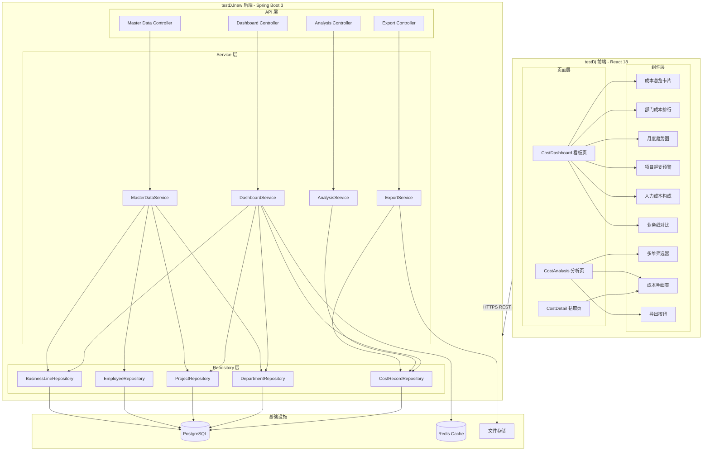

- **交互层**：前端 React SPA，Dashboard 看板页 + 成本分析页 + 钻取页，通过 Ant Design 5 + ECharts 实现可视化
- **核心服务层**：后端 Spring Boot 3 REST API，Dashboard 聚合查询、成本分析查询、报表导出、基础数据管理
- **基础设施层**：PostgreSQL 主从、Redis Cluster、对象存储

**模块清单**

| 模块 | 仓库 | 职责 | 依赖 |
|------|------|------|------|
| Dashboard 看板页 | testDj | 成本总览、图表展示、时间筛选 | API 层、组件层 |
| 成本分析页 | testDj | 多维筛选、明细列表、交叉分析、导出 | API 层、组件层 |
| 成本钻取页 | testDj | 从汇总数据下钻至明细 | API 层 |
| Dashboard API | testDJnew | Dashboard 数据聚合查询接口 | Service 层 |
| Analysis API | testDJnew | 成本分析查询接口（多维筛选+分页） | Service 层 |
| Export API | testDJnew | 报表导出接口（Excel/CSV） | Service 层 |
| Master Data API | testDJnew | 部门/项目/业务线/人员下拉数据 | Service 层 |
| Dashboard Service | testDJnew | 成本汇总计算、环比计算、排行计算 | Repository 层、Redis |
| Analysis Service | testDJnew | 多维交叉查询、聚合计算 | Repository 层 |
| Export Service | testDJnew | Excel 生成、文件管理 | Repository 层、文件存储 |
| Master Data Service | testDJnew | 基础数据 CRUD | Repository 层 |
| CostRecord Repository | testDJnew | 成本记录聚合查询（JPQL） | PostgreSQL |
| Department Repository | testDJnew | 部门数据查询 | PostgreSQL |
| Project Repository | testDJnew | 项目数据查询 | PostgreSQL |
| Employee Repository | testDJnew | 人员数据查询 | PostgreSQL |
| BusinessLine Repository | testDJnew | 业务线数据查询 | PostgreSQL |

### 2.2 应用集成架构

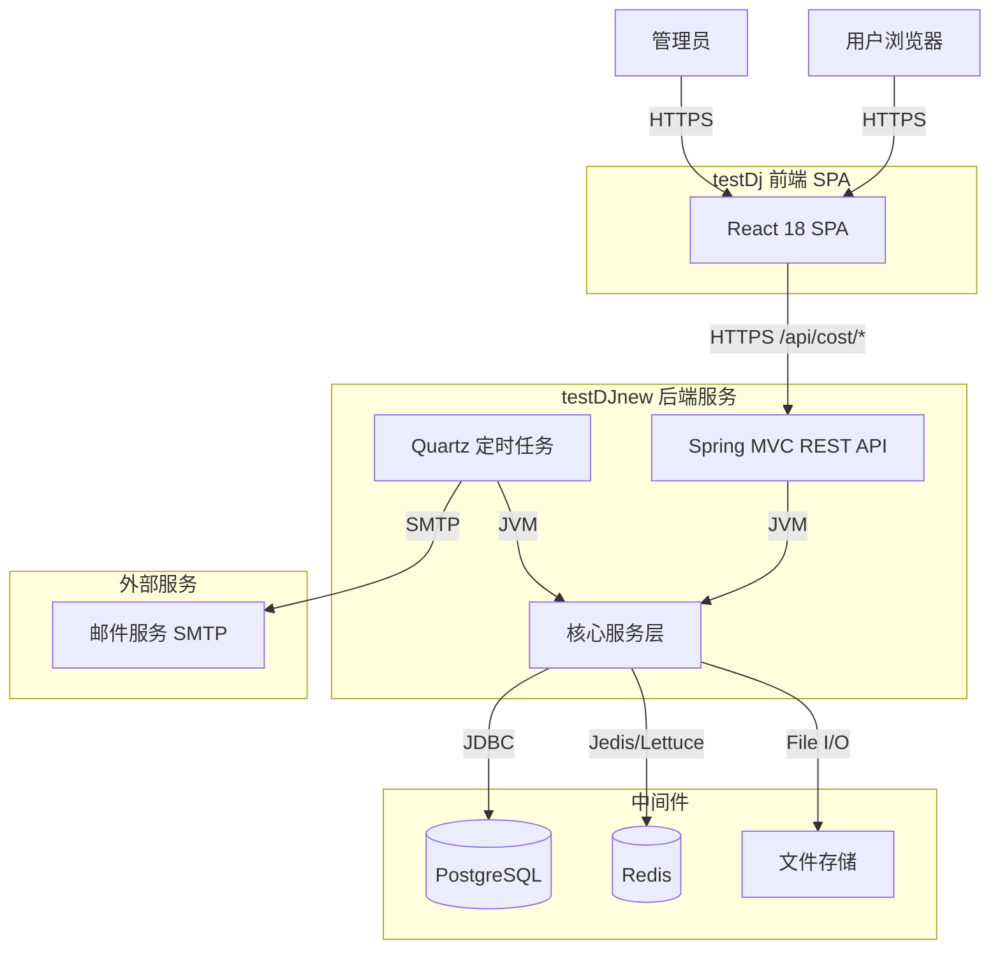

**集成关系说明：**

| 调用方 | 被调用方 | 协议 | 接口类型 | 说明 |
|--------|----------|------|----------|------|
| 用户浏览器 | testDj SPA | HTTPS | oneapi REST | Dashboard + 分析页面 |
| testDj SPA | testDJnew API | HTTPS | oneapi REST | 所有 /api/cost/* 接口 |
| testDJnew Service | PostgreSQL | JDBC | SQL | 聚合查询与 CRUD |
| testDJnew Service | Redis | Redis Protocol | Cache | Dashboard 汇总数据缓存 |
| testDJnew ExportService | 文件存储 | File I/O | - | 导出文件暂存 |
| testDJnew Quartz | 邮件服务 | SMTP | - | 定时导出推送 |

### 2.3 部署架构

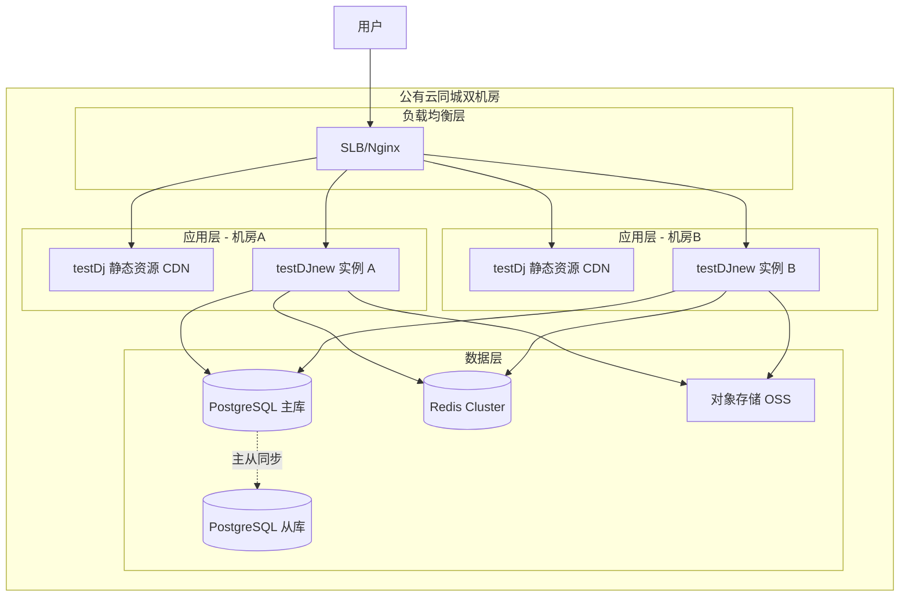

**部署说明：**
- **负载均衡层**：SLB/Nginx 反向代理，前端静态资源与后端 API 同域名，通过路径区分
- **应用层**：前后端各 2 实例，同城双机房部署；前端静态资源部署至 CDN；后端 Spring Boot 内嵌 Tomcat，端口 8080
- **数据层**：PostgreSQL 主从架构（一主一从），Redis Cluster 3 节点，对象存储用于导出文件暂存

---

## 3. 数据模型与存储

### 3.1 实体清单

| 实体名称 | 实体说明 | 所属模块 | 与其他实体的关系 |
|----------|----------|----------|-----------------|
| Department | 部门信息，支持树形层级（parent_id） | Master Data | 一对多关联 Employee、Project、CostRecord |
| Project | 项目信息，含预算金额、起止日期 | Master Data | 多对一关联 Department、BusinessLine；一对多关联 CostRecord |
| BusinessLine | 业务线信息，独立于部门的业务划分 | Master Data | 一对多关联 Department、Project、Employee、CostRecord |
| Employee | 员工信息，含角色、成本费率 | Master Data | 多对一关联 Department、BusinessLine；一对多关联 CostRecord |
| CostRecord | 成本记录，核心实体，记录每笔成本支出 | Cost Record | 多对一关联 Department、Project、Employee、BusinessLine |
| ExportTask | 导出任务记录，跟踪异步导出状态 | Export | 独立实体 |
| ExportTemplate | 导出模板配置 | Export | 独立实体 |

### 3.2 实体关系图

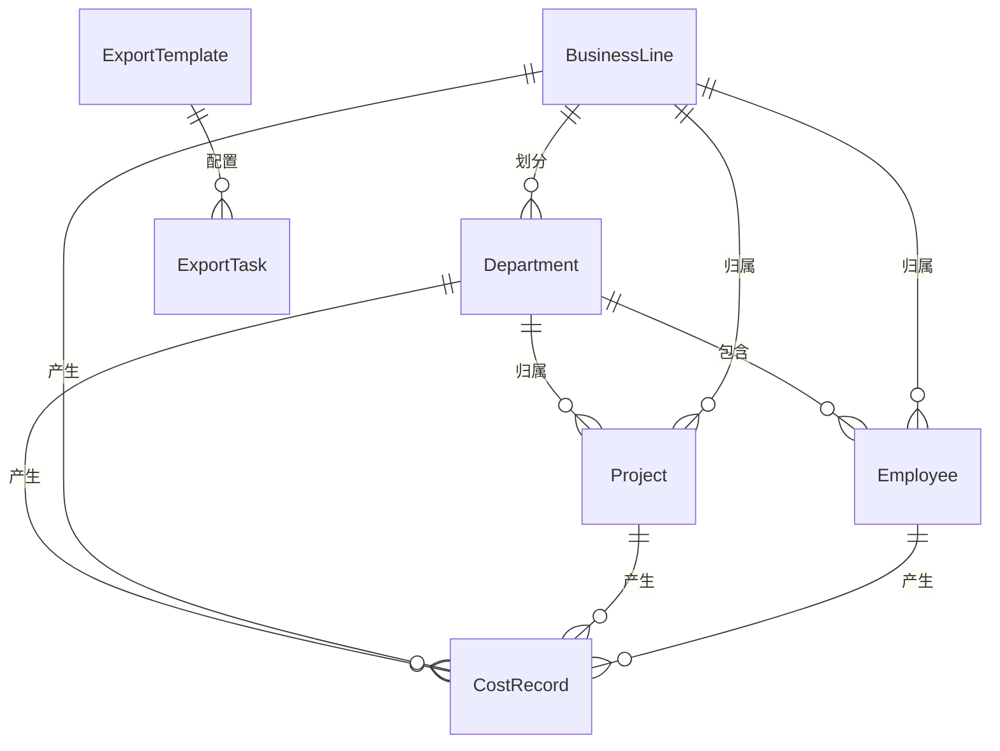

**模型说明：**
- **Department 树形结构**：通过 parent_id 自关联实现最多 3 级部门层级，汇总查询时需递归汇总子部门成本
- **CostRecord 多维度关联**：每条成本记录同时关联部门、项目、人员、业务线四个维度
- **成本类型**：通过 type 字段区分 LABOR（人力成本）和 PROJECT（项目成本）
- **时间维度**：period_year、period_month、period_quarter 三个字段冗余存储，便于按不同粒度聚合
- **租户隔离**：当前单租户，预留 tenant_id 字段

### 3.3 缓存与 MQ

| 组件 | 用途 | 数据形态 |
|------|------|----------|
| Redis | Dashboard 汇总数据缓存 | JSON 序列化，TTL 1h，按 year+month 分 key |
| Redis | 月度趋势数据缓存 | JSON 序列化，TTL 1h |
| - | MQ | 本期不涉及，定时导出直接调用 Service |

---

## 4. 接口设计

### 4.1 oneapi（Web 控制台接口 /api 前缀）

| 编号 | 接口名称 | 方法 | 路径 | 模块 |
|------|----------|------|------|------|
| W01 | Dashboard 汇总查询 | GET | /api/cost/dashboard/summary | Dashboard API |
| W02 | 成本分析查询 | POST | /api/cost/analysis/query | Analysis API |
| W03 | 报表导出 | POST | /api/cost/export | Export API |
| W04 | 定时导出任务创建 | POST | /api/cost/export/schedule | Export API |
| W05 | 部门列表 | GET | /api/cost/master/departments | Master Data API |
| W06 | 项目列表 | GET | /api/cost/master/projects | Master Data API |
| W07 | 业务线列表 | GET | /api/cost/master/business-lines | Master Data API |
| W08 | 人员列表 | GET | /api/cost/master/employees | Master Data API |
| W09 | 预算数据导入 | POST | /api/cost/master/projects/import | Master Data API |
| W10 | 成本明细钻取 | GET | /api/cost/analysis/drill-down | Analysis API |

### 4.2 OpenAPI（对外接口）

本项不适用，原因：本期无第三方系统对接需求，所有接口均为 Web 控制台 oneapi 接口。

### 4.3 内部接口（Service 层）

| 编号 | 接口名称 | 类 | 方法签名 |
|------|----------|-----|----------|
| S01 | 获取 Dashboard 汇总 | DashboardService | DashboardSummary getSummary(int year, Integer month) |
| S02 | 获取部门排行 | DashboardService | List<DepartmentRanking> getDepartmentRanking(int year, Integer month, CostType type) |
| S03 | 获取月度趋势 | DashboardService | List<MonthlyTrend> getMonthlyTrend(int year, int month) |
| S04 | 获取超预算项目 | DashboardService | List<OverBudgetProject> getOverBudgetProjects(int year, Integer month) |
| S05 | 获取人力成本构成 | DashboardService | List<LaborComposition> getLaborComposition(int year, Integer month) |
| S06 | 获取业务线对比 | DashboardService | List<BusinessLineComparison> getBusinessLineComparison(int year, Integer month) |
| S07 | 成本分析查询 | AnalysisService | AnalysisQueryResponse queryAnalysis(AnalysisQueryRequest request) |
| S08 | 导出 Excel | ExportService | byte[] exportExcel(ExportRequest request) |
| S09 | 导出 CSV | ExportService | byte[] exportCsv(ExportRequest request) |
| S10 | 创建定时导出任务 | ExportService | void createScheduleTask(ScheduleExportRequest request) |

### 4.4 集成接口（Integration 层）

| 编号 | 接口名称 | 类 | 方法签名 | 说明 |
|------|----------|-----|----------|------|
| I01 | 发送邮件 | EmailClient | void send(EmailMessage message) | 定时导出邮件推送 |
| I02 | 文件上传 | OssClient | String upload(byte[] data, String fileName) | 导出文件持久化 |

---

## 5. 功能模块设计

### 5.1 全局约定

**错误码格式**：`COST_{MODULE}_{SEQ}`

| 模块 | 前缀 | 范围 |
|------|------|------|
| Dashboard | COST_DASH_ | 0001-0099 |
| Analysis | COST_ANALY_ | 0100-0199 |
| Export | COST_EXPORT_ | 0200-0299 |
| Master Data | COST_MASTER_ | 0300-0399 |

**通用出参结构**：
```json
{ "result": "OK", "msg": "SUCCESS", "data": {} }
```

### 5.2 Dashboard 模块 (F01-F06)

#### 5.2.1 枚举与常量定义

| 枚举名称 | 取值 | 含义 | 关联字段 |
|----------|------|------|----------|
| CostType | LABOR | 人力成本 | cost_record.type |
| CostType | PROJECT | 项目成本 | cost_record.type |
| EmployeeRole | DEV | 开发 | cost_record.role / employee.role |
| EmployeeRole | TEST | 测试 | cost_record.role / employee.role |
| EmployeeRole | PM | 产品 | cost_record.role / employee.role |
| EmployeeRole | OPS | 运维 | cost_record.role / employee.role |

#### 5.2.2 接口详细设计

##### W01 Dashboard 汇总查询

- **URI**: GET /api/cost/dashboard/summary
- **描述**: 获取 Dashboard 页面全部汇总数据，包含总览卡片、排行、趋势、构成、预警
- **入参**:

| 参数名称 | 类型 | 是否必填 | 描述 |
|----------|------|----------|------|
| year | Integer | 是 | 查询年份 |
| month | Integer | 否 | 查询月份，不传则查全年汇总 |

- **出参**:

| 参数名称 | 类型 | 描述 |
|----------|------|------|
| result | String | 结果 code |
| msg | String | 提示信息 |
| data.totalCost | BigDecimal | 本期总成本 |
| data.totalCostChange | BigDecimal | 环比变化率（小数） |
| data.budgetExecutionRate | BigDecimal | 预算执行率 |
| data.laborCost | BigDecimal | 人力成本合计 |
| data.projectCost | BigDecimal | 项目成本合计 |
| data.departmentRanking | Array | 部门成本排行 |
| data.monthlyTrend | Array | 月度趋势（近12个月） |
| data.overBudgetProjects | Array | 超预算项目列表 |
| data.laborComposition | Array | 人力成本构成 |
| data.businessLineComparison | Array | 业务线成本对比 |

- **错误码**:

| 错误码 | 说明 |
|--------|------|
| COST_DASH_0001 | year 参数缺失或无效 |
| COST_DASH_0002 | 系统内部错误 |

- **业务规则**: 若 month 不传，按全年汇总；month 传入时按当月汇总。环比计算：与上期（上月/上年）对比。预算执行率 = 实际消耗 / 预算总额。

- **请求示例**:
```json
GET /api/cost/dashboard/summary?year=2025&month=7
```

- **响应示例**:
```json
{
  "result": "OK",
  "msg": "SUCCESS",
  "data": {
    "totalCost": 1250000.00,
    "totalCostChange": 0.12,
    "budgetExecutionRate": 0.85,
    "laborCost": 750000.00,
    "projectCost": 500000.00,
    "departmentRanking": [
      {"departmentId": 1, "name": "研发部", "cost": 450000.00, "rank": 1}
    ],
    "monthlyTrend": [
      {"month": "2025-01", "laborCost": 700000.00, "projectCost": 480000.00}
    ],
    "overBudgetProjects": [
      {"projectId": 1, "name": "项目A", "budget": 100000.00, "actual": 135000.00, "overrun": 35000.00, "overrunRate": 0.35}
    ],
    "laborComposition": [
      {"role": "DEV", "label": "开发", "cost": 300000.00, "percentage": 0.40}
    ],
    "businessLineComparison": [
      {"businessLineId": 1, "name": "核心业务", "cost": 600000.00}
    ]
  }
}
```

#### 5.2.3 子功能详细设计

##### 5.2.3.1 成本总览卡片 (F01)

- 处理时序图

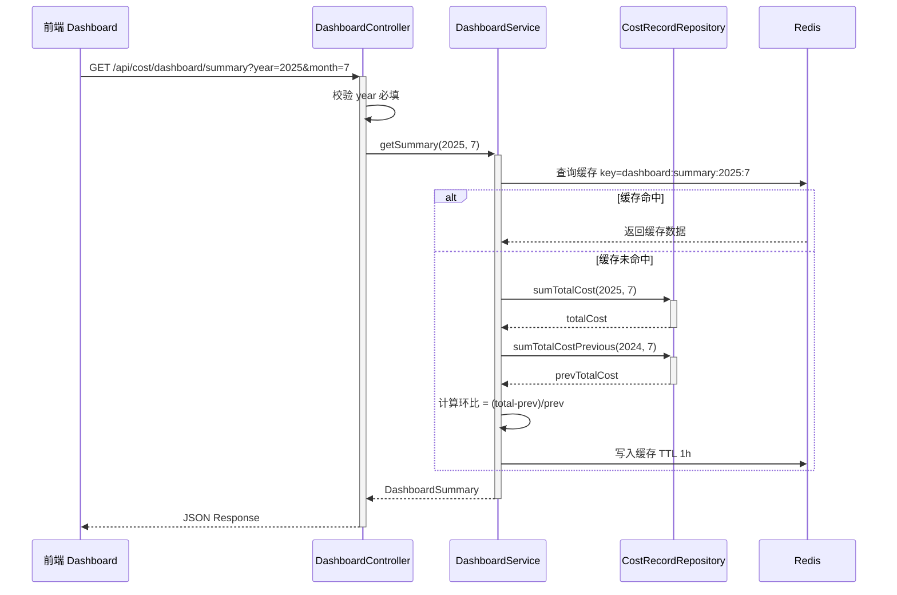

**业务规则：**

| 规则编号 | 规则描述 | 校验时机 | 不满足时的处理 |
|----------|----------|----------|--------------|
| R01 | year 参数必填，值范围 2000-2099 | 请求时 | 返回 COST_DASH_0001 |
| R02 | month 可选，传入时范围 1-12 | 请求时 | 返回 COST_DASH_0001 |

**异常场景：**

| 异常场景 | 处理方式 |
|----------|----------|
| 数据库连接超时 | 返回 COST_DASH_0002，提示"系统繁忙，请稍后重试" |
| 该月份无数据 | 返回空数据（totalCost=0），不报错 |
| Redis 不可用 | 降级直查数据库，日志告警 |

**并发控制：** 无并发风险，原因：纯查询接口，无写入操作。

##### 5.2.3.2 部门成本排行 (F02)

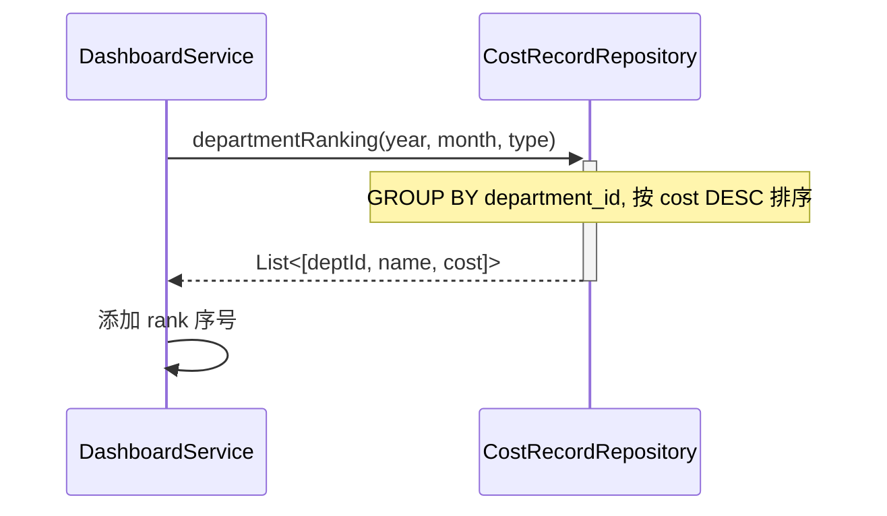

**业务规则：**

| 规则编号 | 规则描述 | 校验时机 | 不满足时的处理 |
|----------|----------|----------|--------------|
| R03 | type 可选，不传返回全部成本排行 | 查询时 | 默认全部 |

##### 5.2.3.3 月度趋势图 (F03)

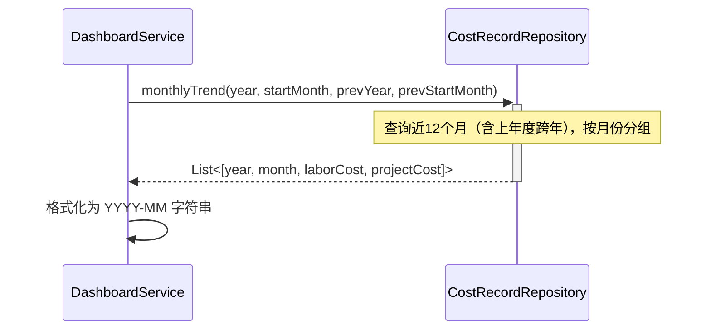

##### 5.2.3.4 项目超支预警 (F04)

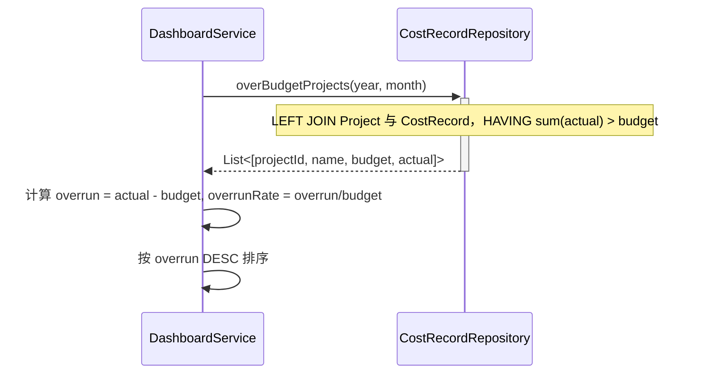

##### 5.2.3.5 人力成本构成 (F05) & 业务线对比 (F06)

同查询模式，无写入操作。按 role 聚合人力成本；按 business_line_id 聚合业务线成本。

**技术选型方案对比：**

| 方案 | 优点 | 缺点 | 推荐 |
|------|------|------|------|
| 方案A：全量实时查询 | 数据最新 | 高并发下 DB 压力大 | |
| 方案B：Redis 缓存 + 定时刷新 | 高性能、低延迟 | 数据有延迟（最多1h） | ✅ 推荐 |
| 方案C：物化视图 | 查询极快 | 维护复杂，刷新需额外调度 | |

**推荐理由**：T+1 数据时效下，1h 缓存延迟可接受；Redis 缓存命中率高，Dashboard 6 个组件可复用同一缓存结果。

### 5.3 成本分析模块 (F07-F12)

#### 5.3.1 接口详细设计

##### W02 成本分析查询

- **URI**: POST /api/cost/analysis/query
- **描述**: 多维筛选条件下的成本分析查询，支持分页排序
- **入参**:

| 参数名称 | 类型 | 是否必填 | 描述 |
|----------|------|----------|------|
| dimensions | String[] | 否 | 维度列表，如 ["department","project","month"] |
| filters.departmentIds | Long[] | 否 | 部门ID 列表 |
| filters.projectIds | Long[] | 否 | 项目ID 列表 |
| filters.businessLineIds | Long[] | 否 | 业务线ID 列表 |
| filters.employeeIds | Long[] | 否 | 人员ID 列表 |
| filters.year | Integer | 否 | 年份 |
| filters.month | Integer | 否 | 月份 |
| filters.quarter | Integer | 否 | 季度 (1-4) |
| filters.costType | String | 否 | 成本类型：LABOR/PROJECT/ALL |
| page | Integer | 是 | 页码，从 1 开始 |
| pageSize | Integer | 是 | 每页条数 |
| sortField | String | 否 | 排序字段，默认 totalCost |
| sortOrder | String | 否 | 排序方向 asc/desc，默认 desc |

- **出参**:

| 参数名称 | 类型 | 描述 |
|----------|------|------|
| result | String | 结果 code |
| msg | String | 提示信息 |
| data.total | Long | 总记录数 |
| data.page | Integer | 当前页码 |
| data.pageSize | Integer | 每页条数 |
| data.rows | Array | 分析行数据 |
| data.aggregations.totalLaborCost | BigDecimal | 人力成本合计 |
| data.aggregations.totalProjectCost | BigDecimal | 项目成本合计 |
| data.aggregations.grandTotal | BigDecimal | 总成本合计 |

- **错误码**:

| 错误码 | 说明 |
|--------|------|
| COST_ANALY_0100 | page 或 pageSize 参数缺失/无效 |
| COST_ANALY_0101 | 查询参数组合无效 |

- **请求示例**:
```json
{
  "dimensions": ["department", "project", "month"],
  "filters": {
    "departmentIds": [1, 2],
    "year": 2025,
    "costType": "ALL"
  },
  "page": 1,
  "pageSize": 20,
  "sortField": "totalCost",
  "sortOrder": "desc"
}
```

- **响应示例**:
```json
{
  "result": "OK",
  "msg": "SUCCESS",
  "data": {
    "total": 150,
    "page": 1,
    "pageSize": 20,
    "rows": [
      {
        "departmentName": "研发部",
        "projectName": "项目A",
        "month": "2025-07",
        "laborCost": {"dev": 50000.00, "test": 20000.00, "pm": 30000.00, "ops": 15000.00},
        "projectCost": {"budget": 100000.00, "actual": 85000.00, "ratio": 0.85, "overrun": 0},
        "totalCost": 200000.00
      }
    ],
    "aggregations": {
      "totalLaborCost": 750000.00,
      "totalProjectCost": 500000.00,
      "grandTotal": 1250000.00
    }
  }
}
```

##### W10 成本明细钻取

- **URI**: GET /api/cost/analysis/drill-down
- **描述**: 从汇总数据钻取到明细记录列表
- **入参**:

| 参数名称 | 类型 | 是否必填 | 描述 |
|----------|------|----------|------|
| departmentId | Long | 否 | 部门ID |
| projectId | Long | 否 | 项目ID |
| businessLineId | Long | 否 | 业务线ID |
| employeeId | Long | 否 | 人员ID |
| year | Integer | 是 | 年份 |
| month | Integer | 否 | 月份 |
| page | Integer | 是 | 页码 |
| pageSize | Integer | 是 | 每页条数 |

#### 5.3.2 子功能详细设计

##### 5.3.2.1 多维筛选器 + 成本明细表 (F07/F08/F09)

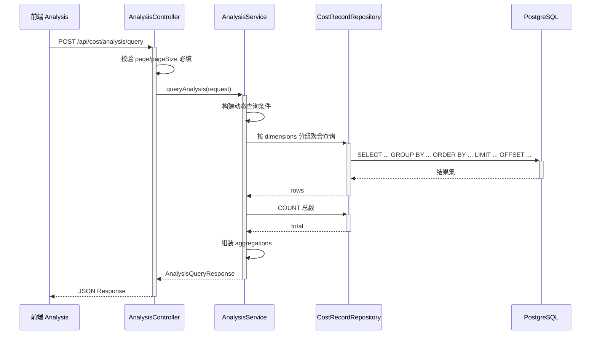

**业务规则：**

| 规则编号 | 规则描述 | 校验时机 | 不满足时的处理 |
|----------|----------|----------|--------------|
| R05 | page 必填，≥1 | 请求时 | COST_ANALY_0100 |
| R06 | pageSize 必填，1-100 | 请求时 | COST_ANALY_0100 |
| R07 | dimensions 中不支持的维度忽略 | 服务端 | 静默忽略 |
| R08 | 按 dimensions 分组后聚合 amount | 查询时 | 默认 SUM |

**异常场景：**

| 异常场景 | 处理方式 |
|----------|----------|
| 筛选条件无匹配数据 | 返回空 rows，total=0 |
| 数据量超 10 万条 | 分页兜底，限制 pageSize 最大 100 |
| 查询超时 | 设置 statement_timeout=5s，超时返回 COST_ANALY_0102 |

**并发控制：** 无并发风险，原因：纯查询接口。

##### 5.3.2.2 交叉分析 (F10) / 时间维度切换 (F11) / 数据钻取 (F12)

- F10：通过 dimensions 参数控制交叉维度组合（如 ["department","businessLine"] → 部门×业务线）
- F11：通过 filters.month / filters.quarter / filters.year 组合控制粒度
- F12：前端点击汇总行，携带维度参数调用 W10 接口

**技术选型方案对比：**

| 方案 | 优点 | 缺点 | 推荐 |
|------|------|------|------|
| 方案A：JPQL 动态拼接 | 类型安全、开发快 | 复杂多维组合时代码冗长 | ✅ 推荐 |
| 方案B：JPA Criteria API | 类型安全、动态强 | 代码可读性差 | |
| 方案C：原生 SQL + JdbcTemplate | 性能最优 | 维护成本高、易出错 | |

**推荐理由**：多维组合有限（部门/项目/业务线/人员/时间），JPQL 拼接可控；Spring Data JPA 项目标准方案。

### 5.4 导出模块 (F13-F16)

#### 5.4.1 表结构设计

##### export_task（导出任务记录）

| 字段名 | 数据类型 | 约束 | 默认值 | 说明 |
|--------|----------|------|--------|------|
| id | bigint | PK, 自增 | - | 系统自增主键 |
| template_id | bigint | - | NULL | 关联导出模板 |
| format | varchar(10) | NOT NULL | 'EXCEL' | 导出格式 EXCEL/CSV/PNG/PDF |
| status | varchar(20) | NOT NULL | 'PENDING' | 任务状态 |
| filter_json | text | - | NULL | 筛选条件 JSON |
| file_path | varchar(500) | - | NULL | 导出文件路径 |
| file_size | bigint | - | NULL | 文件大小（字节） |
| error_msg | varchar(1000) | - | NULL | 失败原因 |
| gmt_create | datetime | NOT NULL | CURRENT_TIMESTAMP | 创建时间 |
| gmt_modified | datetime | NOT NULL | CURRENT_TIMESTAMP | 修改时间 |

**索引：**
- IDX: `idx_export_task_status` (status)
- IDX: `idx_export_task_create` (gmt_create)

##### export_template（导出模板）

| 字段名 | 数据类型 | 约束 | 默认值 | 说明 |
|--------|----------|------|--------|------|
| id | bigint | PK, 自增 | - | 系统自增主键 |
| name | varchar(100) | NOT NULL | - | 模板名称 |
| description | varchar(500) | - | NULL | 模板说明 |
| dimensions | varchar(500) | - | NULL | 预设维度 JSON |
| schedule_cron | varchar(50) | - | NULL | 定时 cron 表达式 |
| status | varchar(20) | NOT NULL | 'ACTIVE' | 状态 |
| gmt_create | datetime | NOT NULL | CURRENT_TIMESTAMP | 创建时间 |
| gmt_modified | datetime | NOT NULL | CURRENT_TIMESTAMP | 修改时间 |

**索引：**
- IDX: `idx_export_template_status` (status)

#### 5.4.2 枚举与常量定义

| 枚举名称 | 取值 | 含义 | 关联字段 |
|----------|------|------|----------|
| ExportFormat | EXCEL | Excel 格式 | export_task.format |
| ExportFormat | CSV | CSV 格式 | export_task.format |
| ExportFormat | PNG | 图表 PNG | export_task.format |
| ExportFormat | PDF | 图表 PDF | export_task.format |
| ExportTaskStatus | PENDING | 待处理 | export_task.status |
| ExportTaskStatus | PROCESSING | 处理中 | export_task.status |
| ExportTaskStatus | COMPLETED | 已完成 | export_task.status |
| ExportTaskStatus | FAILED | 失败 | export_task.status |

**状态机设计：**

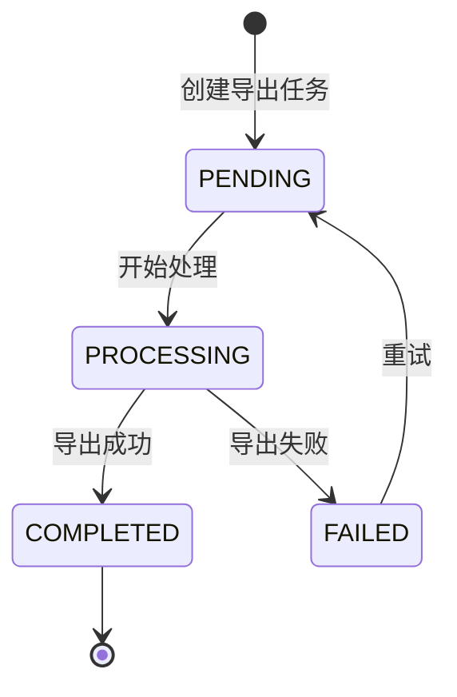

**状态流转规则：**

| 当前状态 | 目标状态 | 流转条件 | 前置校验 | 触发动作 |
|----------|----------|----------|----------|----------|
| PENDING | PROCESSING | 定时任务/手动触发 | 无 | 开始生成文件 |
| PROCESSING | COMPLETED | 文件生成成功 | 文件大小 > 0 | 记录文件路径 |
| PROCESSING | FAILED | 生成异常/超时 | 无 | 记录错误信息 |
| FAILED | PENDING | 用户手动重试 | 无 | 重置状态 |

#### 5.4.3 接口详细设计

##### W03 报表导出

- **URI**: POST /api/cost/export
- **描述**: 根据当前筛选条件导出报表，返回文件二进制流
- **入参**:

| 参数名称 | 类型 | 是否必填 | 描述 |
|----------|------|----------|------|
| filters | Object | 否 | 同 AnalysisQueryRequest |
| dimensions | String[] | 否 | 维度列表 |
| format | String | 是 | EXCEL / CSV |

- **出参**: Binary (Content-Type: application/vnd.openxmlformats-officedocument.spreadsheetml.sheet)
- **错误码**:

| 错误码 | 说明 |
|--------|------|
| COST_EXPORT_0200 | format 参数无效 |
| COST_EXPORT_0201 | 导出数据量超限（>5万行） |
| COST_EXPORT_0202 | 导出处理超时（>60s） |

##### W04 定时导出任务创建

- **URI**: POST /api/cost/export/schedule
- **描述**: 创建定时导出任务，按月/季度自动生成并推送
- **入参**:

| 参数名称 | 类型 | 是否必填 | 描述 |
|----------|------|----------|------|
| templateId | Long | 否 | 导出模板ID |
| filters | Object | 是 | 筛选条件 |
| scheduleType | String | 是 | MONTHLY / QUARTERLY |
| email | String | 否 | 推送邮箱 |

#### 5.4.4 子功能详细设计

##### 5.4.4.1 导出当前视图 (F13)

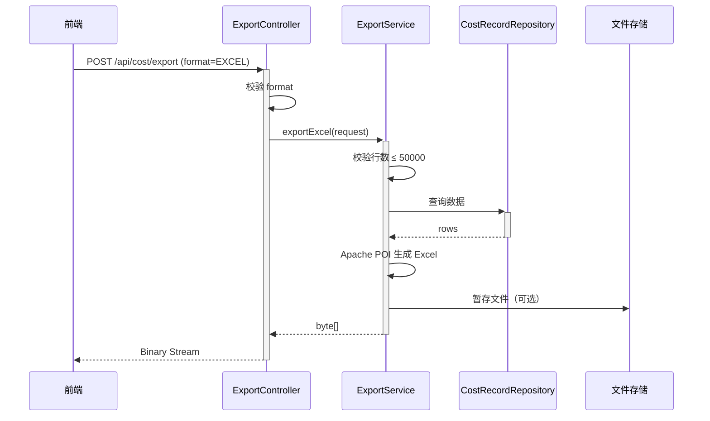

**业务规则：**

| 规则编号 | 规则描述 | 校验时机 | 不满足时的处理 |
|----------|----------|----------|--------------|
| R09 | 单次导出 ≤ 5万行 | 导出前 | COST_EXPORT_0201 |
| R10 | 导出超时 60s | 处理中 | COST_EXPORT_0202 |

**异常场景：**

| 异常场景 | 处理方式 |
|----------|----------|
| 数据量超限 | 提示用户缩小筛选范围 |
| 生成超时 | 返回错误，建议使用定时导出 |
| 无数据 | 导出空 Excel（含表头） |

**并发控制：**
- 并发场景：多用户同时导出大量数据
- 控制策略：无锁，每次导出独立处理；大文件导出建议异步化（创建 ExportTask 返回 taskId，轮询结果）

##### 5.4.4.2 定时导出 (F15)

通过 Quartz @Scheduled 触发，每月1号凌晨2点执行。读取 ExportTemplate 配置，按预设筛选条件生成报表，通过邮件发送。

**技术选型方案对比：**

| 方案 | 优点 | 缺点 | 推荐 |
|------|------|------|------|
| 方案A：同步导出 | 实现简单 | 大文件阻塞请求 | |
| 方案B：异步导出（ExportTask 状态机） | 不阻塞、可追踪 | 增加复杂度 | ✅ 推荐 |
| 方案C：消息队列异步 | 解耦、削峰 | 引入 MQ 依赖 | |

**推荐理由**：异步导出状态机轻量级，无需引入 MQ；ExportTask 表支持状态追踪和重试。

### 5.5 基础数据模块 (F07 下拉数据)

#### 5.5.1 表结构设计

##### department（部门）

| 字段名 | 数据类型 | 约束 | 默认值 | 说明 |
|--------|----------|------|--------|------|
| id | bigint | PK, 自增 | - | 系统自增主键 |
| name | varchar(100) | NOT NULL | - | 部门名称 |
| parent_id | bigint | - | NULL | 父部门ID，根部门为 NULL |
| business_line_id | bigint | - | NULL | 所属业务线 |
| status | varchar(20) | NOT NULL | 'ACTIVE' | 状态 ACTIVE/INACTIVE |
| gmt_create | datetime | NOT NULL | CURRENT_TIMESTAMP | 创建时间 |
| gmt_modified | datetime | NOT NULL | CURRENT_TIMESTAMP | 修改时间 |

**索引：**
- IDX: `idx_department_parent` (parent_id)
- IDX: `idx_department_biz_line` (business_line_id)
- IDX: `idx_department_status` (status)

##### project（项目）

| 字段名 | 数据类型 | 约束 | 默认值 | 说明 |
|--------|----------|------|--------|------|
| id | bigint | PK, 自增 | - | 系统自增主键 |
| name | varchar(200) | NOT NULL | - | 项目名称 |
| department_id | bigint | - | NULL | 所属部门 |
| business_line_id | bigint | - | NULL | 所属业务线 |
| budget_amount | decimal(15,2) | NOT NULL | 0.00 | 预算金额 |
| start_date | date | - | NULL | 开始日期 |
| end_date | date | - | NULL | 结束日期 |
| status | varchar(20) | NOT NULL | 'ACTIVE' | 状态 ACTIVE/CLOSED/SUSPENDED |
| gmt_create | datetime | NOT NULL | CURRENT_TIMESTAMP | 创建时间 |
| gmt_modified | datetime | NOT NULL | CURRENT_TIMESTAMP | 修改时间 |

**索引：**
- IDX: `idx_project_dept` (department_id)
- IDX: `idx_project_biz_line` (business_line_id)
- IDX: `idx_project_status` (status)

##### business_line（业务线）

| 字段名 | 数据类型 | 约束 | 默认值 | 说明 |
|--------|----------|------|--------|------|
| id | bigint | PK, 自增 | - | 系统自增主键 |
| name | varchar(100) | NOT NULL | - | 业务线名称 |
| description | varchar(500) | - | NULL | 描述 |
| status | varchar(20) | NOT NULL | 'ACTIVE' | 状态 ACTIVE/INACTIVE |
| gmt_create | datetime | NOT NULL | CURRENT_TIMESTAMP | 创建时间 |
| gmt_modified | datetime | NOT NULL | CURRENT_TIMESTAMP | 修改时间 |

**索引：**
- IDX: `idx_biz_line_status` (status)

##### employee（员工）

| 字段名 | 数据类型 | 约束 | 默认值 | 说明 |
|--------|----------|------|--------|------|
| id | bigint | PK, 自增 | - | 系统自增主键 |
| name | varchar(50) | NOT NULL | - | 员工姓名 |
| department_id | bigint | - | NULL | 所属部门 |
| business_line_id | bigint | - | NULL | 所属业务线 |
| role | varchar(10) | NOT NULL | - | 角色 DEV/TEST/PM/OPS |
| cost_rate | decimal(10,2) | NOT NULL | 0.00 | 月成本费率（元） |
| status | varchar(20) | NOT NULL | 'ACTIVE' | 状态 ACTIVE/INACTIVE |
| gmt_create | datetime | NOT NULL | CURRENT_TIMESTAMP | 创建时间 |
| gmt_modified | datetime | NOT NULL | CURRENT_TIMESTAMP | 修改时间 |

**索引：**
- IDX: `idx_employee_dept` (department_id)
- IDX: `idx_employee_biz_line` (business_line_id)
- IDX: `idx_employee_role` (role)
- IDX: `idx_employee_status` (status)

##### cost_record（成本记录）

| 字段名 | 数据类型 | 约束 | 默认值 | 说明 |
|--------|----------|------|--------|------|
| id | bigint | PK, 自增 | - | 系统自增主键 |
| type | varchar(10) | NOT NULL | - | 成本类型 LABOR/PROJECT |
| amount | decimal(15,2) | NOT NULL | - | 金额 |
| department_id | bigint | - | NULL | 部门ID |
| project_id | bigint | - | NULL | 项目ID |
| employee_id | bigint | - | NULL | 人员ID |
| business_line_id | bigint | - | NULL | 业务线ID |
| role | varchar(10) | - | NULL | 角色（仅 LABOR 类型） |
| period_year | integer | NOT NULL | - | 年份 |
| period_month | integer | - | NULL | 月份 1-12 |
| period_quarter | integer | - | NULL | 季度 1-4 |
| description | varchar(500) | - | NULL | 描述 |
| gmt_create | datetime | NOT NULL | CURRENT_TIMESTAMP | 创建时间 |
| gmt_modified | datetime | NOT NULL | CURRENT_TIMESTAMP | 修改时间 |

**索引：**
- IDX: `idx_cost_record_type` (type)
- IDX: `idx_cost_record_dept` (department_id)
- IDX: `idx_cost_record_project` (project_id)
- IDX: `idx_cost_record_period` (period_year, period_month)
- IDX: `idx_cost_record_biz_line` (business_line_id)
- IDX: `idx_cost_record_employee` (employee_id)
- IDX: `idx_cost_record_role` (role)

#### 5.5.2 枚举与常量定义

| 枚举名称 | 取值 | 含义 | 关联字段 |
|----------|------|------|----------|
| DepartmentStatus | ACTIVE | 启用 | department.status |
| DepartmentStatus | INACTIVE | 停用 | department.status |
| ProjectStatus | ACTIVE | 进行中 | project.status |
| ProjectStatus | CLOSED | 已结项 | project.status |
| ProjectStatus | SUSPENDED | 暂停 | project.status |
| BusinessLineStatus | ACTIVE | 启用 | business_line.status |
| BusinessLineStatus | INACTIVE | 停用 | business_line.status |
| EmployeeStatus | ACTIVE | 在职 | employee.status |
| EmployeeStatus | INACTIVE | 离职 | employee.status |

**状态机设计（Project）：**

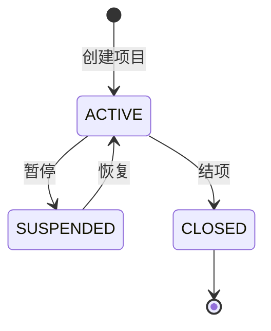

**状态流转规则：**

| 当前状态 | 目标状态 | 流转条件 | 前置校验 | 触发动作 |
|----------|----------|----------|----------|----------|
| ACTIVE | SUSPENDED | 管理员暂停 | 无 | 无 |
| SUSPENDED | ACTIVE | 管理员恢复 | 无 | 无 |
| ACTIVE | CLOSED | 管理员结项 | 确认 end_date 已过 | 无 |

#### 5.5.3 接口详细设计

##### W05 部门列表

- **URI**: GET /api/cost/master/departments
- **描述**: 获取部门树形列表，用于筛选器下拉
- **入参**: 无
- **出参**: data 为部门树形结构数组

##### W06 项目列表

- **URI**: GET /api/cost/master/projects
- **描述**: 获取项目列表，支持按部门筛选
- **入参**: departmentId (Long, 否)

##### W07 业务线列表

- **URI**: GET /api/cost/master/business-lines
- **描述**: 获取业务线列表
- **入参**: 无

##### W08 人员列表

- **URI**: GET /api/cost/master/employees
- **描述**: 获取人员列表，支持按部门/角色筛选
- **入参**: departmentId (Long, 否), role (String, 否)

##### W09 预算数据导入

- **URI**: POST /api/cost/master/projects/import
- **描述**: 通过 CSV 文件批量导入项目预算
- **入参**: Multipart file (CSV)
- **出参**: 导入结果摘要（成功数/失败数/错误详情）

**业务规则：**

| 规则编号 | 规则描述 | 校验时机 | 不满足时的处理 |
|----------|----------|----------|--------------|
| R11 | CSV 格式：name,department_id,budget_amount,start_date,end_date | 解析时 | 跳过该行，记录错误 |
| R12 | budget_amount 必须是正数 | 逐行校验 | 跳过该行 |
| R13 | 单次导入 ≤ 1000 行 | 导入前 | 返回 COST_MASTER_0300 |

**并发控制：** 无锁，导入为批量 INSERT，每条独立。

---

## 6. 非功能性需求设计

### 6.1 高可用性

- **服务多副本**：后端 testDJnew 同城双机房各部署 1 实例，共 2 副本；任一实例宕机，SLB 自动切换
- **数据库降级**：PostgreSQL 主库故障时，自动切换至从库（只读），Dashboard 查询不受影响；写入操作（如预算导入）暂时不可用，等待主库恢复
- **Redis 降级**：Redis 不可用时，Dashboard 查询降级为直查数据库；日志告警，待 Redis 恢复后自动切回缓存模式
- **第三方依赖降级**：邮件服务（SMTP）不可用时，定时导出任务记录失败状态，待恢复后重试；不影响核心 Dashboard/分析功能

### 6.2 可扩展性

- **水平扩展**：后端 Spring Boot 无状态，可通过增加实例数横向扩展；前端静态资源通过 CDN 分发
- **维度扩展**：新增分析维度只需在 CostRecord 表添加关联字段 + 前端筛选器增加选项，无需修改核心查询逻辑
- **插件式存储**：文件存储通过接口抽象，支持 OSS / MinIO / 本地文件系统切换
- **数据库扩展**：CostRecord 表按年份分区，单表数据量超过 500 万行时考虑分表

### 6.3 稳定性/可靠性

- **限流策略**：Dashboard API 使用 Redis 令牌桶限流，单用户 10 req/s
- **熔断策略**：分析查询超时 5s，超时后返回空结果 + 提示，不阻塞后续请求
- **数据一致性**：T+1 数据导入无实时一致性要求；预算数据导入采用事务批量提交，失败回滚
- **边界场景**：无数据月份返回空值（非错误）；筛选条件无匹配返回空数组；金额为 0 时正常显示

### 6.4 安全性设计

#### 6.4.1 账户系统方案
本项不适用，原因：本期无细粒度权限控制，所有用户可见全量数据。后续版本接入统一账户系统。

#### 6.4.2 授权 & 访问控制
- 水平权限检查：不涉及，本期全量数据可见
- 垂直权限检查：不涉及，本期无角色区分
- 登录态检查：假设前端已集成登录态，后端通过全局拦截器校验；/api/cost/* 路径需登录态

#### 6.4.3 数据防护方案
- 敏感数据加密存储：不涉及，成本数据为财务数据，非个人敏感信息
- 敏感数据脱敏：不涉及，成本金额为业务数据，无需脱敏
- SQL 注入防护：使用 Spring Data JPA 参数化查询，JPQL 预编译防注入

### 6.5 监控/统计/日志/告警

- **接口监控**：所有 /api/cost/* 接口记录请求耗时、成功率、QPS
- **慢查询告警**：分析查询 > 3s 触发告警
- **缓存监控**：Redis 命中率 < 80% 触发告警
- **导出监控**：导出任务失败率 > 10% 触发告警
- **日志规范**：关键操作（预算导入、定时导出）记录 INFO 日志；异常记录 ERROR 日志含堆栈

---

## 7. 变更三板斧

### 7.1 可监控

#### 服务埋点

| 监控点 | 指标 | 告警阈值 |
|--------|------|----------|
| Dashboard 汇总查询 | 耗时、成功率 | 耗时 > 2s / 成功率 < 99% |
| 成本分析查询 | 耗时、成功率 | 耗时 > 3s / 成功率 < 99% |
| 报表导出 | 耗时、成功率、文件大小 | 耗时 > 60s / 失败率 > 10% |
| 定时导出任务 | 执行状态、耗时 | 连续 2 次失败 |
| 预算数据导入 | 成功/失败行数 | 失败率 > 20% |
| Redis 缓存命中率 | 命中率 | < 80% |
| 数据库连接池 | 活跃连接数 | > 80% 池大小 |

#### 三方服务埋点

| 服务 | 监控点 | 告警阈值 |
|------|--------|----------|
| PostgreSQL | 连接耗时、慢查询 | 慢查询 > 5s |
| Redis | 连接状态、响应时间 | 不可用 / 响应 > 100ms |
| 邮件服务 SMTP | 发送成功率 | 成功率 < 90% |

### 7.2 可灰度

#### 灰度方案对比

| 方案 | 描述 | 优点 | 缺点 | 推荐 |
|------|------|------|------|------|
| 方案A：按租户尾号灰度 | 按 tenant_id 最后一位数字分流 | 粒度细、风险可控 | 需多租户支持 | ✅ 推荐（预留） |
| 方案B：按用户 ID 灰度 | 按 userId 哈希分流 | 实现简单 | 粒度粗 | |
| 方案C：全量发布 | 直接全量上线 | 最快 | 风险高 | |

**推荐理由**：当前单租户场景，灰度方案预留。后续多租户化后，按 tenant_id 尾号分流：先 10% 租户 → 观察 24h → 50% → 100%。前端通过特性开关控制新页面入口可见性。

#### 灰度执行步骤
1. 部署新版本至灰度实例
2. 配置负载均衡规则：tenant_id 尾号 0 的请求路由至灰度实例
3. 观察 24h 监控指标无异常
4. 逐步扩大灰度范围（0→0-4→0-9）

### 7.3 可应急

#### 应急开关设计

| 开关 | 控制粒度 | 触发方式 | 效果 |
|------|----------|----------|------|
| cost.dashboard.cache.enabled | 全局 | 配置中心 | 关闭 Redis 缓存，直查数据库 |
| cost.export.async.enabled | 全局 | 配置中心 | 关闭异步导出，仅同步导出 |
| cost.schedule.export.enabled | 全局 | 配置中心 | 关闭定时导出任务 |
| cost.analysis.timeout | 全局 | 配置中心 | 调整分析查询超时时间 |

#### 回滚方案

| 场景 | 回滚方式 | 关注点 |
|------|----------|--------|
| 后端 API 异常 | 回滚至上一版本 JAR 包 | 数据库变更需兼容（DDL 只增不删） |
| 前端页面异常 | 回滚静态资源至上一版本 CDN | 确认 API 契约未被破坏 |
| 数据库变更异常 | Flyway 回滚（需预先配置 undo 脚本） | 确保无数据丢失 |
| 缓存数据异常 | 清空 Redis 对应 key，重新预热 | 无数据丢失 |

**注意**：回滚时优先使用开关关闭新功能，而非代码回滚，减少回滚风险。数据库变更采用只增不删策略，确保新旧版本都可运行。

---

## 附录：跨仓对齐检查

| 检查项 | testDj（前端） | testDJnew（后端） | 对齐状态 |
|--------|--------------|-------------------|----------|
| API 基础路径 | `/api/cost/*` | 实现 `/api/cost/*` | ✅ |
| 日期格式 | `YYYY-MM` 字符串 | 返回 `YYYY-MM` 字符串 | ✅ |
| 角色枚举 | `DEV/TEST/PM/OPS` | 同 | ✅ |
| 成本类型枚举 | `LABOR/PROJECT/ALL` | 同 | ✅ |
| 分页规范 | `page/pageSize/total` | 同 | ✅ |
| 金额单位 | 元（小数2位） | BigDecimal(15,2) | ✅ |
| 导出格式 | `EXCEL/CSV` | 同 | ✅ |
| 错误码规范 | 按 HTTP status + result 判断 | COST_{MODULE}_{SEQ} | ✅ |
| 路由 | `/dashboard/cost`, `/analysis/cost` | 后端无路由概念 | ✅ |