> **文档元信息**
>
> | 项目 | 内容 |
> |------|------|
> | 文档版本 | v1.0 |
> | 作者 | DTCoder |
> | 创建日期 | 2025-08-13 |
> | 需求来源 | .agents/specs/dima.md（需求澄清）、.agents/specs/20260813-分别写三个接口helloworld、哈希.md（实施计划） |
> | 评审状态 | 待评审 |

# 多接口演示与分析系统 系分设计

## 1. 需求与范围

### 背景与目标

构建一个**多接口演示 + 数据可视化分析**系统，涵盖后端三个业务接口（HelloWorld、哈希算法、冒泡排序）、前端三 Tab 展示页面、数据导出功能以及基于埋点的多维度可视化报表。系统旨在提供算法演示能力的同时，通过埋点采集调用数据并以图表形式呈现调用情况，支持按人员类型、层级、部门等维度进行分析。

### 核心功能

| # | 功能域 | 描述 |
|---|--------|------|
| F1 | 三个业务接口 | HelloWorld、哈希算法（MD5/SHA-1/SHA-256）、冒泡排序 |
| F2 | 前端多 Tab 展示页 | 三个 Tab 分别展示各接口执行结果，含输入表单、执行按钮、结果展示、历史记录 |
| F3 | 导出功能 | 前端导出按钮 + 后端 CSV 导出接口，支持各页面展示结果导出 |
| F4 | 埋点与可视化报表 | 后端 AOP 自动记录调用次数/调用人，前端多维度可视化（折线图/饼图/柱状图） |

### 约束与非功能要求

- 后端仓库 = testDj，前端仓库 = testDJnew
- 后端技术栈：Java 17 + Spring Boot 3.x + H2 内嵌数据库 + Spring AOP
- 前端技术栈：React 18 + TypeScript 5 + Ant Design 5 + ECharts 5 + Vite 5
- 所有请求通过 HTTP Header 传递用户维度信息（X-User-Id / X-User-Type / X-User-Level / X-User-Dept）
- MVP 阶段不做认证鉴权
- 导出格式为 CSV
- 后端需配置 CORS 允许前端跨域

### 排除范围

- 不涉及用户注册/登录/鉴权体系
- 不涉及持久化数据库迁移（H2 内存模式，重启数据丢失）
- 不涉及分布式部署、消息队列、缓存中间件
- 不涉及国际化、多语言支持

### 需求功能清单与优先级

| 编号 | 功能点 | 优先级 | PRD 原始描述/章节 | 备注 |
|------|--------|--------|-------------------|------|
| F01 | HelloWorld 接口 | P0 | 需求描述：分别写三个接口 helloworld | POST /api/demo/hello |
| F02 | 哈希算法接口 | P0 | 需求描述：哈希算法 | 支持 MD5/SHA-1/SHA-256 |
| F03 | 冒泡排序接口 | P0 | 需求描述：冒泡排序 | 返回原始数组、排序结果、比较次数 |
| F04 | 前端三 Tab 主页面 | P0 | 需求描述：前端新增一个页面，有三个 tab 分别展示不同的执行结果 | React + Ant Design Tabs |
| F05 | 导出按钮与后端导出接口 | P1 | 需求描述：新增导出按钮，后台提供导出接口 | CSV 格式 |
| F06 | AOP 埋点自动记录调用 | P0 | 需求描述：后端再做个埋点，获取调用次数和调用人 | 切面拦截三个业务接口 |
| F07 | 统计查询接口 | P0 | 需求描述：前端可视化出来一个报表查看调用情况 | 按维度聚合查询 |
| F08 | 报表可视化页面（折线图/饼图/柱状图） | P1 | 需求描述：折线图以及饼图和柱状图不同展示形式 | ECharts 实现 |
| F09 | 多维度筛选（人员类型/层级/部门） | P1 | 需求描述：根据不同的维度：人员类型、人员层级、人员部门 | 前端下拉选择器 |

### 假设与待确认项

| 编号 | 假设/待确认内容 | 当前假设 | 确认状态 |
|------|-----------------|----------|----------|
| A01 | 后端技术栈选择 | Java + Spring Boot（企业级标准，AOP 天然支持埋点） | 已确认 |
| A02 | 前端技术栈选择 | React + Ant Design + ECharts（生态成熟，图表能力强） | 已确认 |
| A03 | "调用人"获取方式 | 通过请求 Header X-User-Id 获取 | 待确认 |
| A04 | 用户维度数据来源 | MVP 阶段由前端 Header 传入；后续可对接用户中心 | 待确认 |
| A05 | 导出格式 | CSV（通用轻量），可扩展 Excel | 已确认 |
| A06 | 数据存储方案 | H2 内嵌数据库（MVP 零配置），可迁移 MySQL | 已确认 |
| A07 | 接口认证鉴权 | MVP 阶段不做鉴权，Header 传递用户信息 | 待确认 |
| A08 | 冒泡排序输入规模 | 限制数组长度 ≤ 10000，防止 O(n²) 超时 | 假设：理由——防止恶意大数组导致服务不可用 |

---

## 2. 架构与模块

### 功能架构

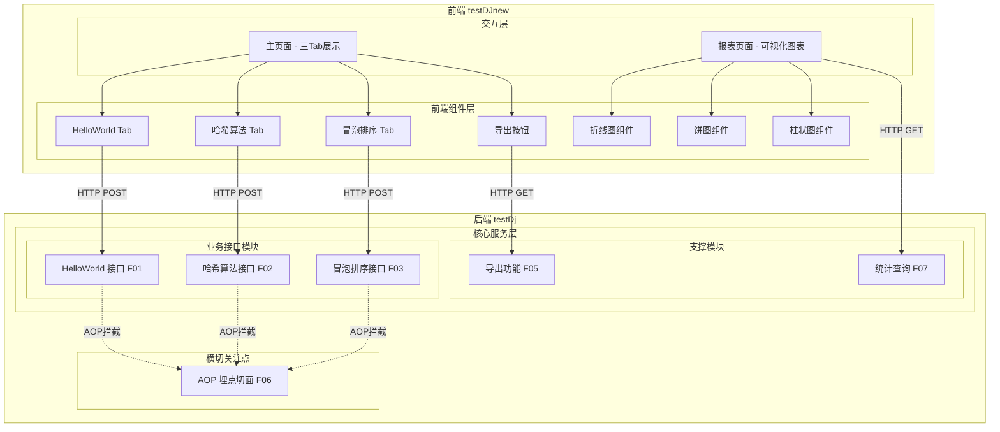

- **交互层**：前端 React 应用，提供主页面（三 Tab 展示算法执行结果）和报表页面（多维度图表可视化）
- **核心服务层**：后端 Spring Boot 应用，分为业务接口模块（三个算法接口）和支撑模块（导出、统计）
- **横切关注点**：AOP 埋点切面，自动拦截业务接口调用并记录调用日志

**模块清单**

| 模块 | 职责 | 依赖 |
|------|------|------|
| 业务接口模块（biz） | 提供 HelloWorld、哈希算法、冒泡排序三个 RESTful 接口 | 无外部依赖 |
| 埋点模块（tracking） | AOP 切面自动拦截业务接口，记录调用日志到数据库 | 业务接口模块（被拦截目标）、数据访问层 |
| 导出模块（export） | 根据接口类型查询调用记录，生成 CSV 文件下载 | 数据访问层 |
| 统计模块（statistics） | 按维度（人员类型/层级/部门）聚合查询调用数据 | 数据访问层 |
| 数据访问层（repository） | JPA Entity + Repository，封装 api_call_log 表操作 | H2 数据库 |
| 前端展示模块（frontend） | React 页面组件，含 Tab 展示、图表渲染、导出下载 | 后端所有接口 |

### 应用集成架构

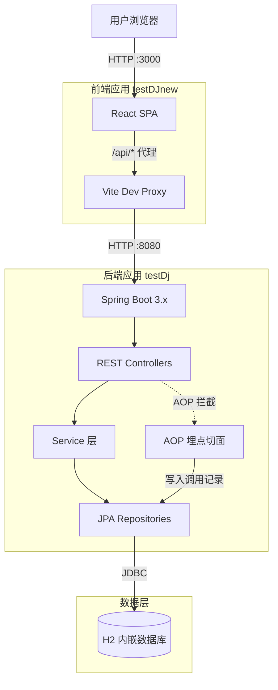

**集成关系说明：**

| 调用方 | 被调用方 | 协议 | 接口类型 | 说明 |
|--------|----------|------|----------|------|
| 用户浏览器 | 前端 React SPA | HTTP | 静态资源 + SPA 路由 | Vite 开发服务器 / 构建后 Nginx |
| 前端 React SPA | 后端 Spring Boot | HTTP/JSON | RESTful API | 开发环境通过 Vite Proxy，生产环境通过 CORS/Nginx 反代 |
| REST Controllers | Service 层 | JVM 方法调用 | 内部接口 | 业务逻辑处理 |
| AOP 切面 | Repository 层 | JVM 方法调用 | 内部接口 | 自动记录调用日志 |
| Repository 层 | H2 数据库 | JDBC | SQL | 数据持久化 |

### 部署架构

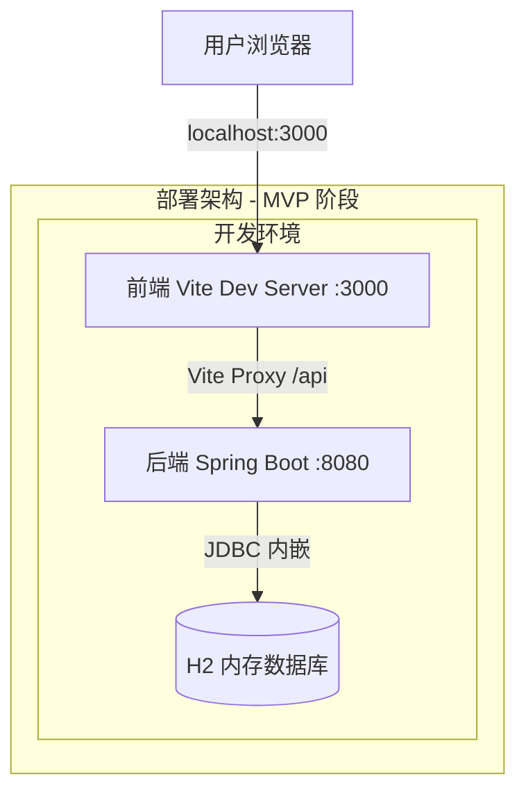

**部署说明：**
- **MVP 阶段**：前后端分别本地启动，前端 Vite 开发服务器通过 proxy 转发 `/api` 请求到后端 8080 端口
- **应用层**：单实例部署，H2 内嵌模式无需独立数据库进程
- **数据层**：H2 内存数据库，应用重启数据清空；后续可配置为文件持久化模式或迁移至 MySQL
- **假设**：MVP 阶段无需负载均衡、多副本部署；生产化部署时可通过 Spring Boot JAR 直接运行 + Nginx 反代

---

## 3. 数据模型与存储

### 实体清单

| 实体名称 | 实体说明 | 所属模块 | 与其他实体的关系 |
|----------|----------|----------|-----------------|
| api_call_log | 接口调用记录日志，记录每次业务接口调用的详细信息 | 埋点模块（tracking） | 独立实体，无外键关联；通过 api_name 字段逻辑关联三个业务接口 |

### 实体关系图

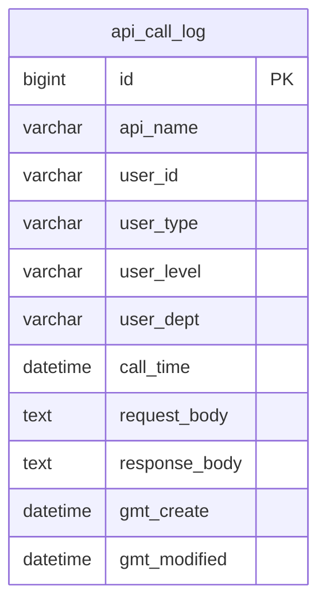

**模型说明：**
- 本系统仅有一个核心实体 `api_call_log`，用于记录所有业务接口的调用日志
- 该实体为独立日志表，不与其他业务实体存在外键关联关系
- 通过 `api_name` 字段区分不同业务接口的调用记录（hello / hash / bubble-sort）
- 用户维度信息（user_type / user_level / user_dept）由前端通过 Header 传入，用于后续多维度统计

---

## 4. 接口设计

### 4.1 oneapi（Web 控制台接口）

| 编号 | 接口名称 | 方法 | 路径 | 模块 |
|------|----------|------|------|------|
| W01 | HelloWorld 接口 | POST | /api/demo/hello | 业务接口模块 |
| W02 | 哈希算法接口 | POST | /api/demo/hash | 业务接口模块 |
| W03 | 冒泡排序接口 | POST | /api/demo/bubble-sort | 业务接口模块 |
| W04 | 数据导出接口 | GET | /api/demo/export | 导出模块 |
| W05 | 统计查询接口 | GET | /api/demo/statistics | 统计模块 |

### 4.2 OpenAPI（对外接口）

本项不适用，原因：MVP 阶段无对外 OpenAPI 需求，所有接口均为内部 Web 控制台使用。

### 4.3 内部接口（Service 层）

| 编号 | 接口名称 | 类 | 方法签名 |
|------|----------|------|----------|
| S01 | HelloWorld 业务处理 | HelloService | sayHello(String name): HelloResponse |
| S02 | 哈希算法业务处理 | HashService | computeHash(String input, String algorithm): HashResponse |
| S03 | 冒泡排序业务处理 | BubbleSortService | bubbleSort(List<Integer> input): SortResponse |
| S04 | CSV 导出业务处理 | ExportService | exportToCsv(String type): String |
| S05 | 统计查询业务处理 | StatisticsService | getStatistics(String dimension, String period): StatisticsResponse |
| S06 | 调用记录保存 | ApiCallLogRepository | save(ApiCallLog log): ApiCallLog |
| S07 | 按维度聚合查询 | ApiCallLogRepository | countByDimension(String dimension, LocalDateTime since): List |

### 4.4 集成接口（Integration 层）

本项不适用，原因：本系统无外部系统集成需求，所有功能自包含。

---

## 5. 功能模块设计

### 全局约定

- **错误码格式**：`{MODULE}_{SEQ}`，如 `BIZ_001`、`TRACK_001`、`EXPORT_001`、`STAT_001`
- **通用出参结构**：`{ code: String, msg: String, data: Object }`
  - 注：为简化 MVP 实现，业务接口直接返回业务对象（非统一包装），异常时通过 `@ControllerAdvice` 统一返回错误结构
- **HTTP Header 约定**（所有请求携带）：

| Header 名称 | 类型 | 是否必填 | 说明 |
|-------------|------|----------|------|
| X-User-Id | String | 是 | 调用人唯一标识 |
| X-User-Type | String | 否 | 人员类型（正式/外包/实习） |
| X-User-Level | String | 否 | 人员层级（P5/P6/P7 等） |
| X-User-Dept | String | 否 | 人员部门 |

---

### 5.1 业务接口模块（biz）

#### 5.1.1 表结构设计

本模块不新增表，复用 `api_call_log` 表（由埋点模块定义）。

#### 5.1.2 接口详细设计

##### W01 HelloWorld 接口

- **URI**: POST /api/demo/hello
- **描述**: 接收一个名字参数，返回问候语和时间戳
- **入参**:

| 参数名称 | 类型 | 是否必填 | 描述 |
|----------|------|----------|------|
| name | String | 是 | 用户输入的名字，长度 1-100 |

- **出参**:

| 参数名称 | 类型 | 描述 |
|----------|------|------|
| message | String | 问候语，格式 "Hello, {name}!" |
| timestamp | String | 响应时间戳，ISO 8601 格式 |

- **错误码**:

| 错误码 | 说明 |
|--------|------|
| BIZ_001 | name 参数为空或超长 |

- **请求示例**:
```json
{
  "name": "World"
}
```

- **响应示例**:
```json
{
  "message": "Hello, World!",
  "timestamp": "2025-08-13T10:00:00"
}
```

##### W02 哈希算法接口

- **URI**: POST /api/demo/hash
- **描述**: 对输入文本执行指定哈希算法，返回哈希值
- **入参**:

| 参数名称 | 类型 | 是否必填 | 描述 |
|----------|------|----------|------|
| input | String | 是 | 待哈希的文本内容 |
| algorithm | String | 是 | 哈希算法，枚举值：MD5 / SHA-1 / SHA-256 |

- **出参**:

| 参数名称 | 类型 | 描述 |
|----------|------|------|
| input | String | 原始输入文本 |
| algorithm | String | 使用的算法名称 |
| hash | String | 计算得到的哈希值（小写十六进制） |

- **错误码**:

| 错误码 | 说明 |
|--------|------|
| BIZ_002 | input 参数为空 |
| BIZ_003 | algorithm 不支持 |

- **请求示例**:
```json
{
  "input": "hello",
  "algorithm": "SHA-256"
}
```

- **响应示例**:
```json
{
  "input": "hello",
  "algorithm": "SHA-256",
  "hash": "2cf24dba5fb0a30e26e83b2ac5b9e29e1b161e5c1fa7425e73043362938b9824"
}
```

##### W03 冒泡排序接口

- **URI**: POST /api/demo/bubble-sort
- **描述**: 对输入的整数数组执行冒泡排序，返回排序结果和比较次数
- **入参**:

| 参数名称 | 类型 | 是否必填 | 描述 |
|----------|------|----------|------|
| array | List<Integer> | 是 | 待排序的整数数组，长度 1-10000 |

- **出参**:

| 参数名称 | 类型 | 描述 |
|----------|------|------|
| original | List<Integer> | 原始输入数组 |
| sorted | List<Integer> | 排序后的数组 |
| steps | int | 比较次数 |

- **错误码**:

| 错误码 | 说明 |
|--------|------|
| BIZ_004 | array 为空或超过长度限制 |

- **请求示例**:
```json
{
  "array": [5, 3, 8, 1, 9]
}
```

- **响应示例**:
```json
{
  "original": [5, 3, 8, 1, 9],
  "sorted": [1, 3, 5, 8, 9],
  "steps": 6
}
```

#### 5.1.3 子功能详细设计

##### 5.1.3.1 HelloWorld 执行（F01）

- 处理时序图
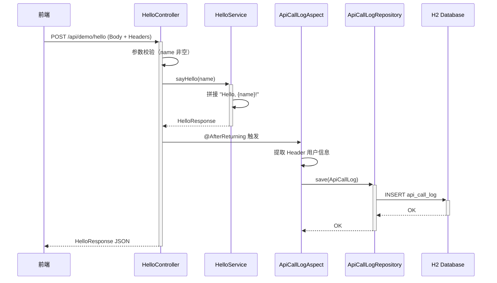

**业务规则：**

| 规则编号 | 规则描述 | 校验时机 | 不满足时的处理 |
|----------|----------|----------|--------------|
| R01 | name 不能为空或空白字符串 | 请求进入时 | 返回 BIZ_001 |
| R02 | name 长度不超过 100 字符 | 请求进入时 | 返回 BIZ_001 |

**异常场景：**

| 异常场景 | 处理方式 |
|----------|----------|
| name 为空 | 返回 400 + BIZ_001 错误码 |
| AOP 记录失败 | 不影响主流程，记录错误日志后继续返回业务结果 |

**并发控制：**
- 无并发风险，原因：HelloWorld 接口为纯计算型，无共享可变状态；AOP 写入为独立 INSERT 操作，不存在冲突

##### 5.1.3.2 哈希算法执行（F02）

- 处理时序图
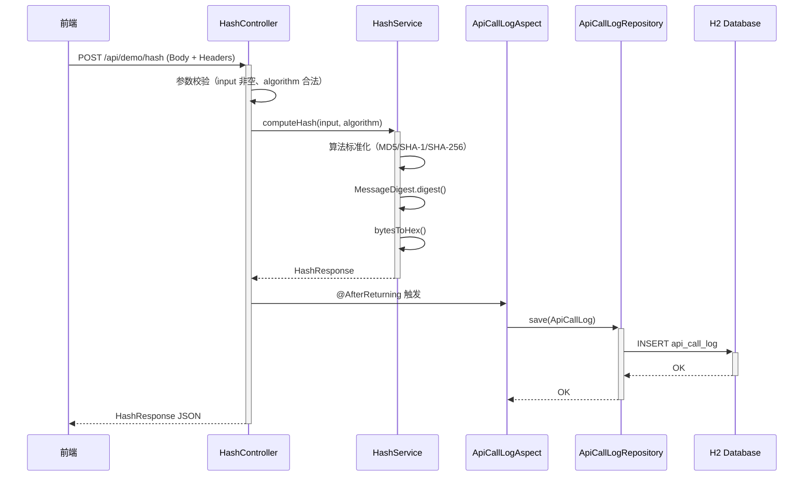

**业务规则：**

| 规则编号 | 规则描述 | 校验时机 | 不满足时的处理 |
|----------|----------|----------|--------------|
| R03 | input 不能为空 | 请求进入时 | 返回 BIZ_002 |
| R04 | algorithm 必须为 MD5/SHA-1/SHA-256 之一 | 请求进入时 | 返回 BIZ_003 |

**异常场景：**

| 异常场景 | 处理方式 |
|----------|----------|
| 不支持的算法 | 返回 400 + BIZ_003 |
| MessageDigest 初始化异常 | 返回 500 + 内部错误 |

**并发控制：**
- 无并发风险，原因：哈希计算为纯函数，无共享状态

##### 5.1.3.3 冒泡排序执行（F03）

- 处理时序图
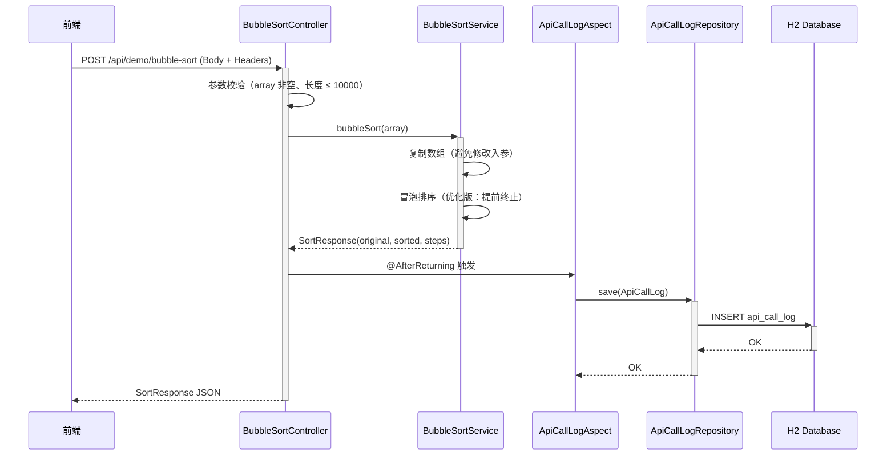

**业务规则：**

| 规则编号 | 规则描述 | 校验时机 | 不满足时的处理 |
|----------|----------|----------|--------------|
| R05 | array 不能为空 | 请求进入时 | 返回 BIZ_004 |
| R06 | array 长度不超过 10000 | 请求进入时 | 返回 BIZ_004 |

**异常场景：**

| 异常场景 | 处理方式 |
|----------|----------|
| 数组为空或超长 | 返回 400 + BIZ_004 |
| 数组元素非整数 | Jackson 反序列化失败，返回 400 |

**并发控制：**
- 无并发风险，原因：每次调用创建数组副本进行排序，无共享可变状态

---

### 5.2 埋点模块（tracking）

#### 5.2.1 表结构设计

##### 5.2.1.1 api_call_log（接口调用记录表）

| 字段名 | 数据类型 | 约束 | 默认值 | 说明 |
|--------|----------|------|--------|------|
| id | bigint | PK, 自增 | - | 系统自增主键 |
| api_name | varchar(50) | NOT NULL | - | 接口名称：hello / hash / bubble-sort |
| user_id | varchar(100) | NOT NULL | - | 调用人标识（来自 X-User-Id） |
| user_type | varchar(50) | NULL | NULL | 人员类型（来自 X-User-Type） |
| user_level | varchar(50) | NULL | NULL | 人员层级（来自 X-User-Level） |
| user_dept | varchar(100) | NULL | NULL | 人员部门（来自 X-User-Dept） |
| call_time | datetime | NOT NULL | - | 调用时间 |
| request_body | text | NULL | NULL | 请求体 JSON（用于导出） |
| response_body | text | NULL | NULL | 响应体 JSON（用于导出） |
| gmt_create | datetime | NOT NULL | CURRENT_TIMESTAMP | 记录创建时间 |
| gmt_modified | datetime | NOT NULL | CURRENT_TIMESTAMP | 记录修改时间 |

**索引：**
- PK: `id`（自增主键）
- IDX: `idx_api_call_log_api_name` (api_name) —— 按接口类型查询
- IDX: `idx_api_call_log_call_time` (call_time) —— 按时间范围查询
- IDX: `idx_api_call_log_user_id` (user_id) —— 按用户查询

**命名规范遵循说明：**
- 表名 `api_call_log`：小写 + 下划线，长度 12 < 26 ✅
- 字段名全部小写 + 下划线 ✅
- 主键为整型单列自增 ✅
- 无外键、存储过程、触发器 ✅
- 包含 id、gmt_create、gmt_modified 三个推荐字段 ✅
- 使用 datetime 而非 timestamp ✅
- 索引命名：idx_ 前缀 ✅

##### 5.2.1.2 枚举与常量定义

| 枚举名称 | 取值 | 含义 | 关联字段 |
|----------|------|------|----------|
| API_NAME_HELLO | hello | HelloWorld 接口 | api_call_log.api_name |
| API_NAME_HASH | hash | 哈希算法接口 | api_call_log.api_name |
| API_NAME_SORT | bubble-sort | 冒泡排序接口 | api_call_log.api_name |
| HASH_ALGO_MD5 | MD5 | MD5 哈希算法 | 业务入参 algorithm |
| HASH_ALGO_SHA1 | SHA-1 | SHA-1 哈希算法 | 业务入参 algorithm |
| HASH_ALGO_SHA256 | SHA-256 | SHA-256 哈希算法 | 业务入参 algorithm |
| DIM_USER_TYPE | userType | 统计维度：人员类型 | 统计接口入参 dimension |
| DIM_USER_LEVEL | userLevel | 统计维度：人员层级 | 统计接口入参 dimension |
| DIM_USER_DEPT | userDept | 统计维度：人员部门 | 统计接口入参 dimension |
| PERIOD_7D | 7d | 时间范围：最近7天 | 统计接口入参 period |
| PERIOD_30D | 30d | 时间范围：最近30天 | 统计接口入参 period |
| PERIOD_ALL | all | 时间范围：全部 | 统计接口入参 period |

#### 5.2.2 接口详细设计

本模块无独立对外接口，通过 AOP 切面自动工作。

**AOP 切面设计：**
- **切点定义**: `execution(* com.example.demo.controller.HelloController.*(..)) || execution(* com.example.demo.controller.HashController.*(..)) || execution(* com.example.demo.controller.BubbleSortController.*(..))`
- **通知类型**: `@AfterReturning`
- **拦截逻辑**:
  1. 从 JoinPoint 获取方法名 → 映射为 api_name
  2. 从 HttpServletRequest Header 提取 X-User-Id / X-User-Type / X-User-Level / X-User-Dept
  3. 序列化请求参数为 request_body
  4. 序列化返回值为 response_body
  5. 构建 ApiCallLog 实体并 save

#### 5.2.3 子功能详细设计

##### 5.2.3.1 AOP 自动埋点记录（F06）

- 处理时序图
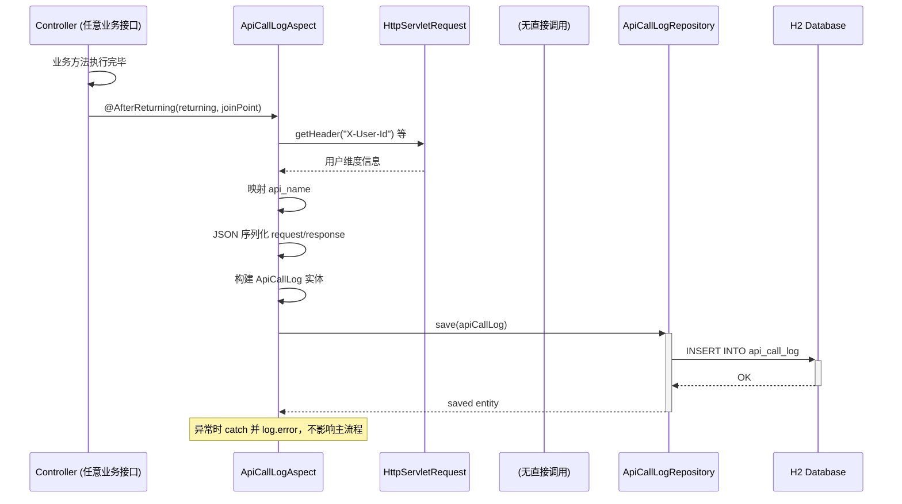

**业务规则：**

| 规则编号 | 规则描述 | 校验时机 | 不满足时的处理 |
|----------|----------|----------|--------------|
| R07 | X-User-Id 缺失时使用 "anonymous" 作为默认值 | 埋点记录时 | 使用默认值，不阻断主流程 |
| R08 | 埋点记录失败不影响业务接口返回 | 写入数据库时 | catch 异常，log.error，继续返回业务结果 |
| R09 | request_body / response_body 序列化失败时存 null | 序列化时 | catch 异常，字段置 null |

**异常场景：**

| 异常场景 | 处理方式 |
|----------|----------|
| 数据库连接异常 | catch 异常，log.error，不影响业务接口正常返回 |
| JSON 序列化循环引用 | catch 异常，request_body/response_body 置 null |
| Header 缺失 | 使用默认值（anonymous / null） |

**并发控制：**
- 并发场景：多个请求同时触发 AOP 写入
- 控制策略：无并发风险，原因：每次调用独立 INSERT 新行，自增主键保证唯一性，无更新冲突

---

### 5.3 导出模块（export）

#### 5.3.1 表结构设计

本模块不新增表，读取 `api_call_log` 表数据。

#### 5.3.2 接口详细设计

##### W04 数据导出接口

- **URI**: GET /api/demo/export
- **描述**: 根据接口类型导出对应的调用记录为 CSV 文件
- **入参**:

| 参数名称 | 类型 | 是否必填 | 描述 |
|----------|------|----------|------|
| type | String | 否（默认 hello） | 接口类型：hello / hash / bubble-sort |
| format | String | 否（默认 csv） | 导出格式，当前仅支持 csv |

- **出参**:

| 参数名称 | 类型 | 描述 |
|----------|------|------|
| （HTTP Response Body） | byte[] | CSV 文件二进制流 |
| Content-Type | Header | text/csv; charset=UTF-8 |
| Content-Disposition | Header | attachment; filename={type}-export.csv |

- **错误码**:

| 错误码 | 说明 |
|--------|------|
| EXPORT_001 | type 参数不合法 |
| EXPORT_002 | 无数据可导出 |

- **请求示例**:
```
GET /api/demo/export?type=hash&format=csv
```

- **响应**:
```
Content-Type: text/csv; charset=UTF-8
Content-Disposition: attachment; filename=hash-export.csv

call_time,user_id,user_type,user_level,user_dept,input,algorithm,hash
2025-08-13T10:00:00,user001,正式,P6,技术部,hello,SHA-256,2cf24dba...
```

#### 5.3.3 子功能详细设计

##### 5.3.3.1 CSV 导出（F05）

- 处理时序图
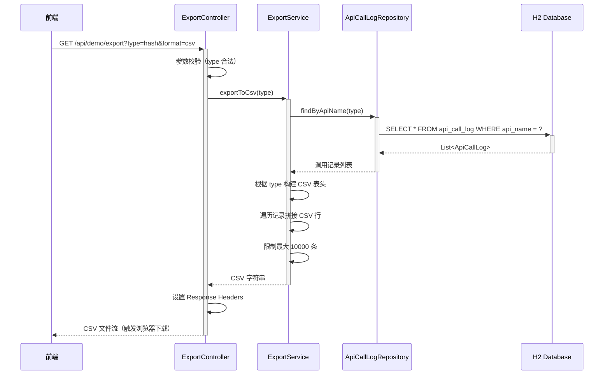

**业务规则：**

| 规则编号 | 规则描述 | 校验时机 | 不满足时的处理 |
|----------|----------|----------|--------------|
| R10 | type 必须为 hello/hash/bubble-sort | 请求进入时 | 返回 EXPORT_001 |
| R11 | 单次导出最多 10000 条 | 查询时 | 截断至 10000 条 |
| R12 | CSV 内容使用 UTF-8 编码 + BOM | 生成时 | 始终添加 BOM 头 |

**异常场景：**

| 异常场景 | 处理方式 |
|----------|----------|
| 无数据 | 返回空 CSV（仅含表头）或 EXPORT_002 提示 |
| 数据量过大 | 限制 10000 条，防止内存溢出 |

**并发控制：**
- 无并发风险，原因：导出为只读查询操作

---

### 5.4 统计模块（statistics）

#### 5.4.1 表结构设计

本模块不新增表，读取 `api_call_log` 表数据。

#### 5.4.2 接口详细设计

##### W05 统计查询接口

- **URI**: GET /api/demo/statistics
- **描述**: 按指定维度和时间范围聚合查询接口调用统计数据
- **入参**:

| 参数名称 | 类型 | 是否必填 | 描述 |
|----------|------|----------|------|
| dimension | String | 是 | 统计维度：userType / userLevel / userDept |
| period | String | 否（默认 all） | 时间范围：7d / 30d / all |

- **出参**:

| 参数名称 | 类型 | 描述 |
|----------|------|------|
| dimension | String | 当前查询维度 |
| data | List<DimensionItem> | 各维度值的统计结果 |
| data[].label | String | 维度值标签（如 "技术部"、"P6"） |
| data[].count | int | 该维度值的调用次数 |
| total | int | 总调用次数 |

- **错误码**:

| 错误码 | 说明 |
|--------|------|
| STAT_001 | dimension 参数不合法 |

- **请求示例**:
```
GET /api/demo/statistics?dimension=userDept&period=7d
```

- **响应示例**:
```json
{
  "dimension": "userDept",
  "data": [
    { "label": "技术部", "count": 120 },
    { "label": "产品部", "count": 45 },
    { "label": "运营部", "count": 30 }
  ],
  "total": 195
}
```

#### 5.4.3 子功能详细设计

##### 5.4.3.1 多维度统计查询（F07）

- 处理时序图
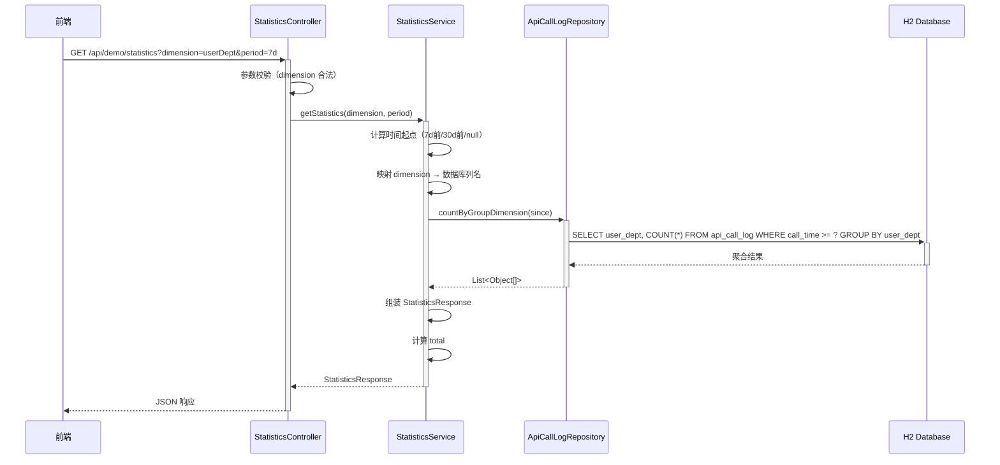

**业务规则：**

| 规则编号 | 规则描述 | 校验时机 | 不满足时的处理 |
|----------|----------|----------|--------------|
| R13 | dimension 必须为 userType/userLevel/userDept | 请求进入时 | 返回 STAT_001 |
| R14 | period=7d 时过滤最近7天数据 | 查询时 | SQL WHERE call_time >= now()-7d |
| R15 | period=30d 时过滤最近30天数据 | 查询时 | SQL WHERE call_time >= now()-30d |
| R16 | period=all 时不过滤时间 | 查询时 | 无时间条件 |
| R17 | 维度值为 NULL 的记录归入 "未知" 分组 | 结果组装时 | label 设为 "未知" |

**异常场景：**

| 异常场景 | 处理方式 |
|----------|----------|
| 无数据 | 返回空 data 列表 + total=0 |
| 维度值全为 NULL | 返回单条 "未知" 记录 |

**并发控制：**
- 无并发风险，原因：只读聚合查询

---

### 5.5 前端展示模块（frontend）

#### 5.5.1 表结构设计

本模块为纯前端，无数据库表。

#### 5.5.2 接口详细设计

前端不对外提供接口，作为调用方消费后端 W01-W05 接口。

**前端 API 服务层封装：**

| 函数名 | 调用后端接口 | 方法 | 说明 |
|--------|-------------|------|------|
| callHello | W01 | POST /api/demo/hello | HelloWorld 调用 |
| callHash | W02 | POST /api/demo/hash | 哈希算法调用 |
| callBubbleSort | W03 | POST /api/demo/bubble-sort | 冒泡排序调用 |
| exportData | W04 | GET /api/demo/export | 触发 CSV 下载 |
| getStatistics | W05 | GET /api/demo/statistics | 获取统计数据 |

**Axios 实例默认 Header 配置：**
- X-User-Id: user001（MVP 默认用户）
- X-User-Type: 正式
- X-User-Level: P6
- X-User-Dept: 技术部

#### 5.5.3 子功能详细设计

##### 5.5.3.1 三 Tab 主页面（F04）

- 处理时序图
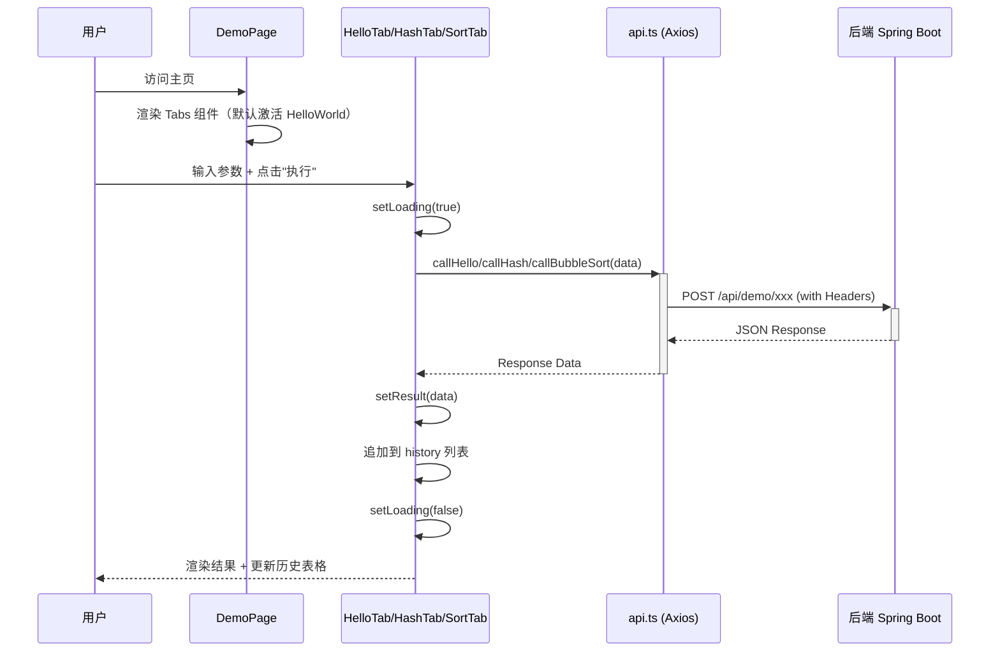

**业务规则：**

| 规则编号 | 规则描述 | 校验时机 | 不满足时的处理 |
|----------|----------|----------|--------------|
| R18 | 输入为空时禁止提交 | 点击执行按钮时 | 不发送请求，按钮无响应 |
| R19 | 请求中禁用执行按钮（防重复提交） | 请求发送期间 | Button loading 状态 |
| R20 | 历史记录按时间倒序展示 | 渲染时 | 新记录插入列表头部 |
| R21 | 历史表格每页展示 5 条 | 渲染时 | Ant Design Table pagination |

##### 5.5.3.2 导出功能（F05 前端部分）

- 处理时序图
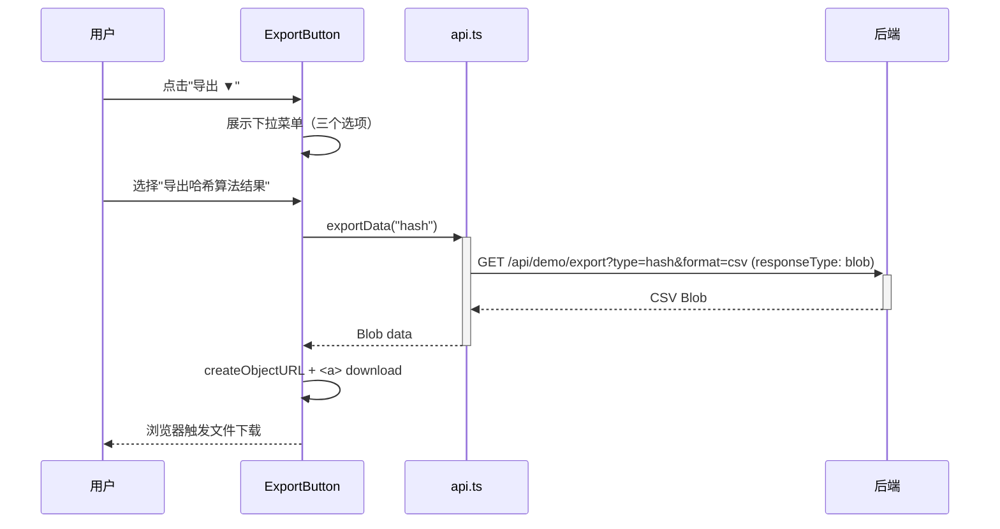

##### 5.5.3.3 报表可视化页面（F08 + F09）

- 处理时序图
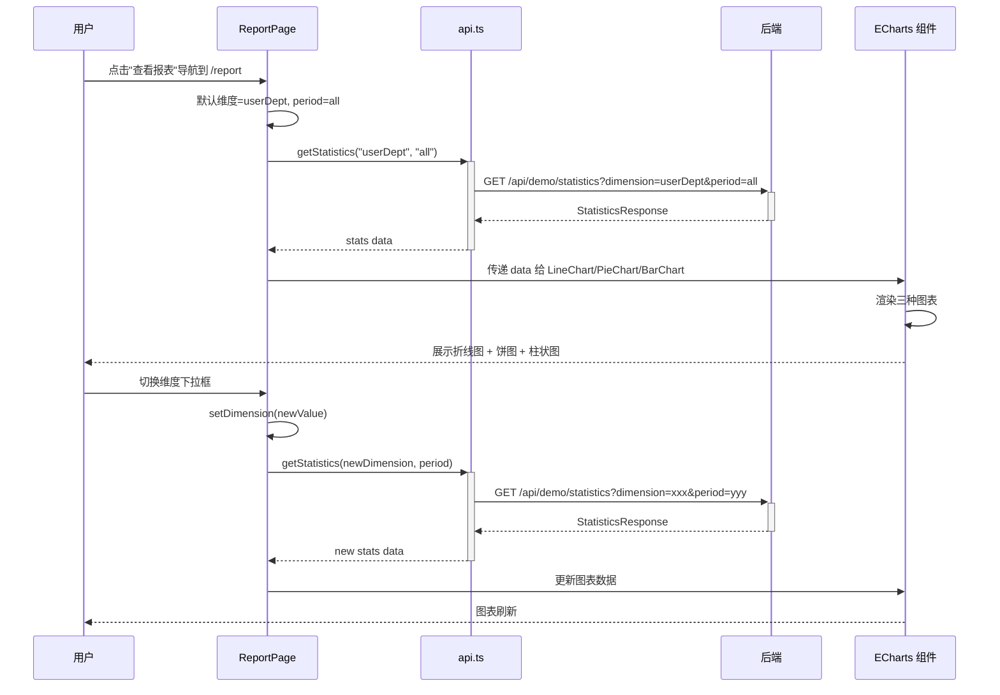

**业务规则：**

| 规则编号 | 规则描述 | 校验时机 | 不满足时的处理 |
|----------|----------|----------|--------------|
| R22 | 维度/时间切换时自动刷新图表 | 选择器 onChange 时 | 重新调用 getStatistics |
| R23 | 折线图展示各维度值的调用趋势 | 图表渲染时 | X 轴=维度标签，Y 轴=调用次数 |
| R24 | 饼图展示各维度值占比 | 图表渲染时 | 百分比标签 |
| R25 | 柱状图展示各维度调用次数对比 | 图表渲染时 | 渐变色柱状图 |
| R26 | 页面顶部展示总调用次数 | 数据加载后 | stats.total 显示 |

---

### 跨模块时序图

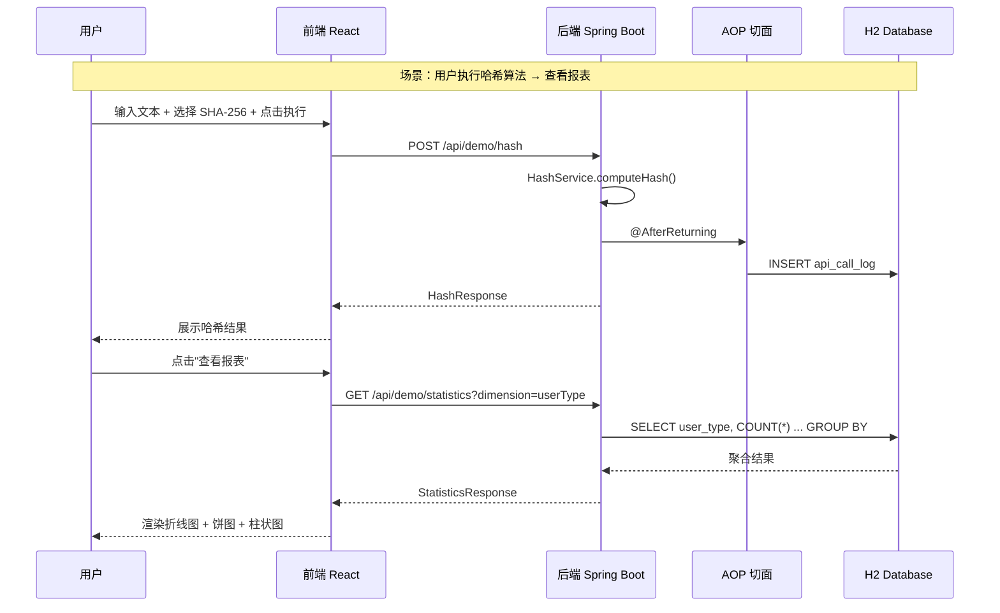

---

## 6. 非功能性需求设计

### 6.1 高可用性

- **MVP 阶段**：单实例部署，H2 内嵌数据库，无高可用设计需求
- **数据库异常降级**：AOP 埋点写入失败时，通过 try-catch 捕获异常并记录日志，不影响业务接口正常返回（自动降级）
- **后续演进**：生产化时可部署多实例 + 外部 MySQL + 负载均衡，实现高可用

### 6.2 可扩展性

- **水平扩展**：Spring Boot 应用无状态（除 H2 内存数据库外），可通过多实例 + 外部数据库实现水平扩展
- **接口扩展**：新增业务接口只需添加 Controller + Service，AOP 切点表达式中追加新的 Controller 即可自动纳入埋点
- **图表扩展**：前端 ECharts 组件化设计，新增图表类型只需新增组件并在 ReportPage 中引用
- **数据库迁移**：H2 → MySQL 仅需修改 application.yml 数据源配置 + 调整 schema.sql 语法差异
- **导出格式扩展**：ExportService 预留 format 参数，后续可新增 Excel 格式（Apache POI）

### 6.3 稳定性/可靠性

- **冒泡排序输入限制**：数组长度限制 10000，防止 O(n²) 算法在极端输入下导致线程长时间阻塞
- **导出条数限制**：单次导出最多 10000 条，防止大数据量导致内存溢出
- **AOP 异常隔离**：埋点记录异常不影响业务主流程，保证核心功能可靠性
- **H2 内存模式风险**：应用重启数据丢失；假设：MVP 阶段可接受，后续切换文件模式或 MySQL

### 6.4 安全性设计

#### 6.4.1 账户系统方案

本项不适用，原因：MVP 阶段不做用户认证，通过 Header 传递用户标识。后续对接统一认证中心时补充。

#### 6.4.2 授权&访问控制

##### 6.4.2.1 是否实现水平权限检查

本项不适用，原因：MVP 阶段无数据隔离需求，所有用户可查看所有统计数据。

##### 6.4.2.2 是否实现垂直权限检查

本项不适用，原因：MVP 阶段无角色权限区分。

##### 6.4.2.3 是否检查登录态

本项不适用，原因：MVP 阶段不检查登录态，所有接口开放访问。假设：内部演示系统，安全风险可控。

#### 6.4.3 数据防护方案

##### 6.4.3.1 是否对敏感数据加密存储

不涉及敏感数据。api_call_log 中存储的为用户输入的算法参数和结果，非个人隐私信息。

##### 6.4.3.2 是否对敏感数据展示进行脱敏

不涉及。用户维度信息（类型/层级/部门）非敏感数据，无需脱敏。

### 6.5 监控/统计/日志/告警

- **应用日志**：Spring Boot 默认 Logback，输出到控制台 + 文件
- **业务埋点**：通过 AOP 切面自动记录所有业务接口调用（即为本系统的核心监控手段）
- **异常告警**：MVP 阶段通过日志级别 ERROR 标记异常；后续可接入监控平台（如 Prometheus + Grafana）
- **关键监控点**：
  - 各接口调用次数（已实现：api_call_log 表）
  - 接口响应时间（后续可通过 AOP 增加耗时记录）
  - 异常调用次数（通过 ERROR 日志统计）

---

## 7. 变更三板斧

### 7.1 可监控

| 监控项 | 实现方式 | 说明 |
|--------|----------|------|
| 接口调用次数 | AOP 切面写入 api_call_log | 每次调用自动记录，支持多维度查询 |
| 调用人维度 | Header 传递 + 数据库存储 | 支持按人员类型/层级/部门统计 |
| 接口调用详情 | request_body + response_body 字段 | 支持导出和审计 |
| 应用异常 | Logback ERROR 日志 | 异常自动记录 |
| 数据库状态 | H2 Console (/h2-console) | 开发阶段可直接查看数据 |

**后续增强方向：**
- 接入 Spring Boot Actuator + Prometheus 暴露 metrics 端点
- AOP 增加耗时统计（@Around 通知）
- 接入 Grafana 实现可视化监控大盘

### 7.2 可灰度

- **MVP 阶段**：全量发布，无需灰度。原因：系统为全新项目，无存量用户，无旧版本兼容问题
- **后续灰度方案**：如需灰度，可通过 Nginx 按用户 ID 尾号分流至新旧版本实例
- **前端灰度**：可通过 CDN 版本号控制，新旧版本页面并行

### 7.3 可应急

| 应急场景 | 应急方案 | 说明 |
|----------|----------|------|
| AOP 埋点导致性能下降 | 通过 Spring Profile 关闭切面（@ConditionalOnProperty） | 配置 `demo.tracking.enabled=false` 即可关闭埋点 |
| 业务接口异常 | 回滚 JAR 包至上一版本 | 接口无状态，回滚无兼容性风险 |
| 数据库异常 | H2 切换为文件模式或外部 MySQL | 修改 application.yml 数据源配置 |
| 前端页面异常 | CDN 切换至上一版本静态资源 | 前后端分离，可独立回滚 |
| 导出功能异常 | 不影响核心业务接口 | 导出为独立接口，可单独降级 |

**回滚兼容性说明：**
- 所有接口为新增接口，无旧调用方兼容问题
- 数据库为新增表，回滚时直接丢弃即可
- 前后端独立部署，可分别回滚

---

## 附录：方案选型对比记录

### 后端技术栈选型

| 方案 | 优点 | 缺点 | 推荐 |
|------|------|------|------|
| **A: Java + Spring Boot** | 企业标准、AOP 天然支持埋点、生态完善 | 启动稍重 | ✅ **推荐** |
| B: Node.js + Express | 轻量、前后端同语言 | AOP 需手动实现、企业级特性弱 | |
| C: Python + FastAPI | 开发快、算法实现简洁 | 与蚂蚁技术栈匹配度低 | |

**推荐理由**：Spring Boot 的 AOP 能力天然匹配埋点需求，且与蚂蚁数科技术栈一致。

### 前端图表库选型

| 方案 | 优点 | 缺点 | 推荐 |
|------|------|------|------|
| **A: ECharts** | 折线/饼/柱状图全支持、中文文档完善、性能好 | 包体积较大 | ✅ **推荐** |
| B: Chart.js | 轻量、简单 | 中文支持弱、复杂图表能力有限 | |
| C: AntV | 蚂蚁出品、设计语言统一 | 学习成本略高 | 备选 |

**推荐理由**：ECharts 对折线图/饼图/柱状图支持完善，中文社区活跃，满足需求中三种图表类型的要求。

### 埋点实现方式选型

| 方案 | 优点 | 缺点 | 推荐 |
|------|------|------|------|
| **A: AOP 切面自动拦截** | 零侵入、统一管理、不遗漏 | 灵活性略低 | ✅ **推荐** |
| B: 每个接口手动埋点 | 灵活可控 | 代码冗余、易遗漏 | |
| C: Filter/Interceptor | 统一入口 | 无法获取响应体 | |

**推荐理由**：AOP 切面可在业务方法执行后获取请求参数和返回值，实现零侵入埋点，且后续新增接口只需修改切点表达式。

---

## 方案检查 Checklist

| # | 检查项 | 结果 | 说明 |
|---|--------|------|------|
| 1 | 模块划分合理性检查 | ✅ 通过 | 5 个模块职责单一，无循环依赖，无模块超 50% 功能点 |
| 2 | 依赖关系合理性 | ✅ 通过 | 无外部系统依赖，H2 内嵌无网络依赖 |
| 3 | 单点问题检查（部署层面） | ✅ 通过（已标注风险） | MVP 单实例，已标注为风险项 R2，后续可多实例部署 |
| 4 | 表模型设计范式检查 | ✅ 通过 | 满足 3NF，单表无冗余字段设计需求 |
| 5 | 隐私安全检查 | ✅ 通过 | 无敏感数据存储，Header 用户信息非隐私数据 |
| 6 | 兼容性检查（接口） | ✅ 通过 | 全部为新增接口，无旧调用方 |
| 7 | 兼容性检查（表） | ✅ 通过 | 新增表，无旧版本兼容问题 |
| 8 | 数据迁移检查 | ✅ 通过 | 新增表无初始数据需求；schema.sql 自动建表 |
| 9 | 一致性检查（功能点） | ✅ 通过 | F01-F09 均在 §5 中有对应设计 |
| 10 | 一致性检查（表） | ✅ 通过 | api_call_log 实体在 §5.2 中有完整表结构定义 |
| 11 | 一致性检查（接口） | ✅ 通过 | W01-W05 在 §5 各模块中有详细定义 |
| 12 | 一致性检查（枚举） | ✅ 通过 | 枚举定义与表结构字段说明一致 |
| 13 | 状态机完整性检查 | ✅ 不适用 | api_call_log 无状态字段，为追加写入模式 |
| 14 | 并发风险检查 | ✅ 通过 | 各接口均为无状态计算或独立 INSERT，无并发冲突 |
| 15 | 单点问题检查（定时任务层面） | ✅ 不适用 | 本系统无定时任务 |
| 16 | 非功能性设计可行性检查 | ✅ 通过 | 输入限制、导出限制、异常隔离均可落地 |
| 17 | 变更三板斧（可监控） | ✅ 通过 | AOP 埋点 + 日志 + H2 Console |
| 18 | 变更三板斧（可灰度） | ✅ 通过 | MVP 全量发布，后续可按用户 ID 灰度 |
| 19 | 变更三板斧（可应急） | ✅ 通过 | 开关控制埋点 + JAR 回滚 + 前后端独立回滚 |
