> **文档元信息**
>
> | 项目 | 内容 |
> |------|------|
> | 文档版本 | v1.0 |
> | 作者 | 系分设计 Agent |
> | 创建日期 | 2025-06-19 |
> | 需求来源 | testDj/.agents/specs/dima.md |
> | 评审状态 | 待评审 |

# 组织架构管理模块 系分设计

---

## 1. 需求与范围

### 1.1 背景与目标

随着团队规模扩大，人员与部门关系变得复杂。现需开发一套**组织架构管理模块**，支持部门的树形结构搭建，以及员工在部门间的调动、离职等生命周期管理，并为其他业务系统（如审批、权限）提供准确的人员数据源。

**目标：**
- 支持部门树形结构的创建、查询、拖拽调整
- 支持员工信息的全生命周期管理（新增、调动、离职）
- 为审批、权限等下游业务系统提供准确、实时的组织架构数据
- 支持多角色权限控制（超管/HR、部门主管）

### 1.2 核心角色与权限

| 角色 | 权限范围 |
|------|---------|
| 超管 / HR | 拥有最高权限，可管理部门及所有人员信息 |
| 部门主管 | 仅可查看本部门及下属部门的人员；可编辑本部门人员部分信息 |

### 1.3 核心功能清单与优先级

| 编号 | 功能点 | 优先级 | PRD 原始描述/章节 | 备注 |
|------|--------|--------|-------------------|------|
| F01 | 部门树形结构查询 | P0 | 需求 1：左侧展示部门树，默认展开第一级，点击节点加载该部门下的人员列表 | 懒加载 |
| F02 | 部门层级拖拽调整 | P0 | 需求 1：支持拖拽调整部门层级 | 防循环引用 |
| F03 | 员工新增（唯一性校验） | P0 | 需求 2：表单录入员工信息，实时校验工号/手机号唯一性 | 数据库唯一索引 + 应用层二次校验 |
| F04 | 人员调动（级联更新 + 快照） | P0 | 需求 3：更新员工 dept_id，级联更新审批流节点，记录调动历史 | 乐观锁控制并发 |
| F05 | 员工离职（逻辑删除 + 状态隔离） | P0 | 需求 4：状态更新为离职，释放系统权限，历史数据保留 | 严禁物理删除 |
| F06 | 分页查询员工列表 | P1 | 需求 2/4：支持分页 page/size，列表页支持状态筛选 | 大数据量性能 |
| F07 | 部门删除校验 | P1 | 边界场景：部门下有人员时禁止删除 | 需先转移人员 |
| F08 | 实时字段唯一性校验 | P1 | 需求 2：输入工号/手机号后，光标移开时实时请求后端检查是否重复 | 前端 + 后端双重校验 |

### 1.4 约束与非功能要求

- **技术栈约束**：后端 Spring Boot 3.x + MyBatis-Plus + MySQL 8，前端 React 18 + Ant Design 5 + Redux Toolkit
- **数据安全**：严禁物理删除，必须使用逻辑删除（is_deleted 或 status 字段）
- **并发控制**：员工调动等关键操作需使用乐观锁（version 字段）
- **性能要求**：员工列表必须支持分页，避免一次性加载上万条数据
- **权限隔离**：超管/HR 拥有最高权限，部门主管仅可查看/编辑本部门及下属部门人员

### 1.5 排除范围

- 本模块不涉及员工薪酬、绩效考核等人力资源管理功能
- 本模块不实现审批流的完整业务逻辑，仅提供调动事件触发下游审批系统更新
- 单点登录（SSO）和统一身份认证不在本模块范围内，仅通过事件通知下游系统处理权限变更

### 1.6 假设与待确认项

| 编号 | 假设/待确认内容 | 当前假设 | 确认状态 |
|------|-----------------|----------|----------|
| A01 | 部门树最大层级深度 | 假设不超过 10 层，path 字段长度 255 足够覆盖 | 待确认 |
| A02 | 员工调动时审批流级联更新的具体策略 | 假设通过事件驱动解耦，由下游审批系统订阅事件并自行处理 | 待确认 |
| A03 | 部门主管的权限粒度 | 假设仅控制数据可见范围，不涉及字段级权限控制 | 待确认 |
| A04 | 是否支持批量导入员工 | 假设首期仅支持单条新增，批量导入作为后续迭代 | 待确认 |
| A05 | 员工头像/附件等文件存储 | 假设首期不涉及，如有需要后续接入对象存储服务 | 待确认 |

---

## 2. 架构与模块

### 2.1 功能架构

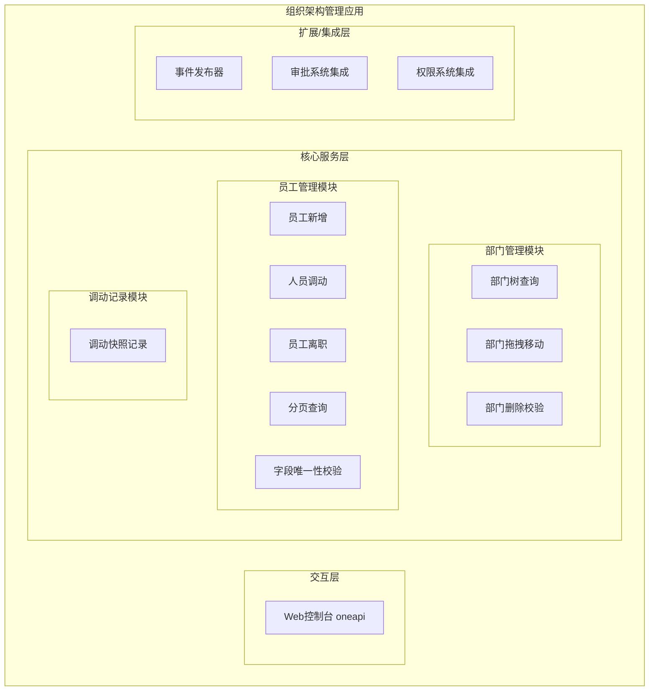

**交互层说明**：Web 控制台提供部门树展示、员工表单录入、调动/离职操作等交互界面，通过 oneapi 与后端交互。

**核心服务层说明**：
- **部门管理模块**：负责部门树形结构的查询、懒加载、拖拽层级调整及删除校验
- **员工管理模块**：负责员工全生命周期管理（新增、调动、离职、分页查询、字段唯一性校验）
- **调动记录模块**：负责记录每次人员调动的完整快照（原部门/职位 → 新部门/职位）

**扩展/集成层说明**：通过事件发布器与下游审批系统、权限系统解耦集成，员工调动时发布事件触发审批流更新，员工离职时触发权限释放。

**模块清单**

| 模块 | 职责 | 依赖 |
|------|------|------|
| 部门管理模块 | 部门树形结构查询、懒加载、拖拽调整层级、删除校验 | 员工管理模块（查询部门下是否有人） |
| 员工管理模块 | 员工新增（唯一性校验）、调动（乐观锁）、离职（逻辑删除）、分页查询 | 部门管理模块（校验部门合法性） |
| 调动记录模块 | 记录每次调动的完整快照信息 | 员工管理模块 |
| 扩展集成层 | 事件发布，与审批系统、权限系统解耦集成 | 无（被依赖） |

### 2.2 应用集成架构

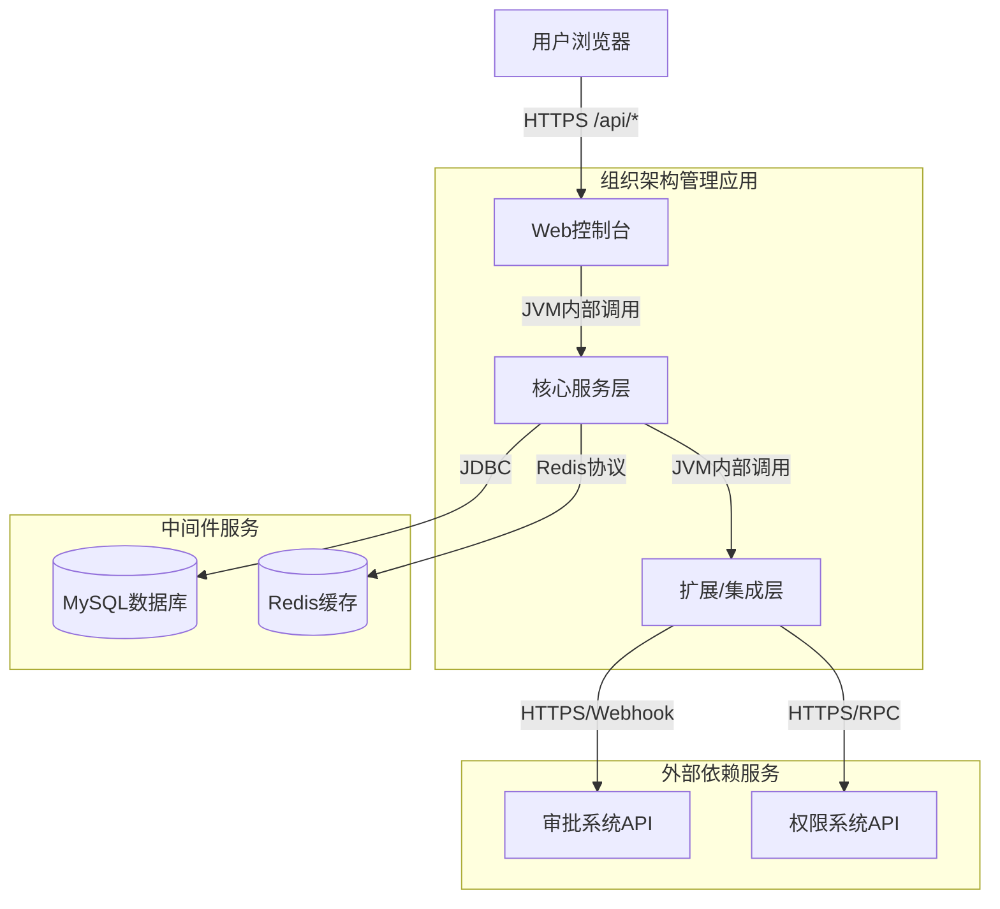

**集成关系说明：**

| 调用方 | 被调用方 | 协议 | 接口类型 | 说明 |
|--------|----------|------|----------|------|
| 用户浏览器 | 应用 Web控制台 | HTTPS | oneapi REST | 前端 React 页面调用后端 API |
| 核心服务层 | MySQL 数据库 | JDBC | SQL | 业务数据持久化存储 |
| 核心服务层 | Redis 缓存 | Redis协议 | KV | 部门树、热点数据缓存 |
| 扩展集成层 | 审批系统 API | HTTPS | Webhook/REST | 员工调动事件通知 |
| 扩展集成层 | 权限系统 API | HTTPS/RPC | REST | 员工离职时权限释放通知 |

### 2.3 部署架构

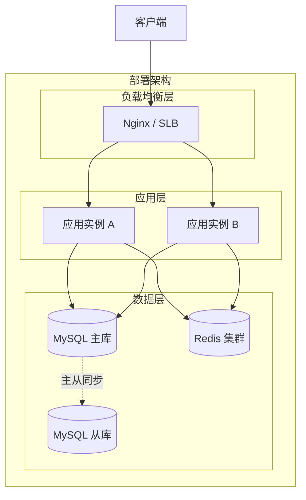

**部署说明：**
- **负载均衡层**：Nginx 反向代理，支持轮询和健康检查
- **应用层**：至少 2 个应用实例部署，支持滚动发布，无单点
- **数据层**：MySQL 主从架构，读写分离；Redis 集群用于缓存热点部门树数据和员工查询结果

---

## 3. 数据模型与存储

### 3.1 实体清单

| 实体名称 | 实体说明 | 所属模块 | 与其他实体的关系 |
|----------|----------|----------|-----------------|
| 部门（department） | 组织架构中的部门节点 | 部门管理模块 | 自关联（parent_id → department.id）；一对多关联员工 |
| 员工（employee） | 组织中的在职/离职人员 | 员工管理模块 | 多对一关联部门；一对多关联调动记录 |
| 调动记录（employee_transfer_record） | 记录每次员工调动的完整快照 | 调动记录模块 | 多对一关联员工 |

### 3.2 实体关系图

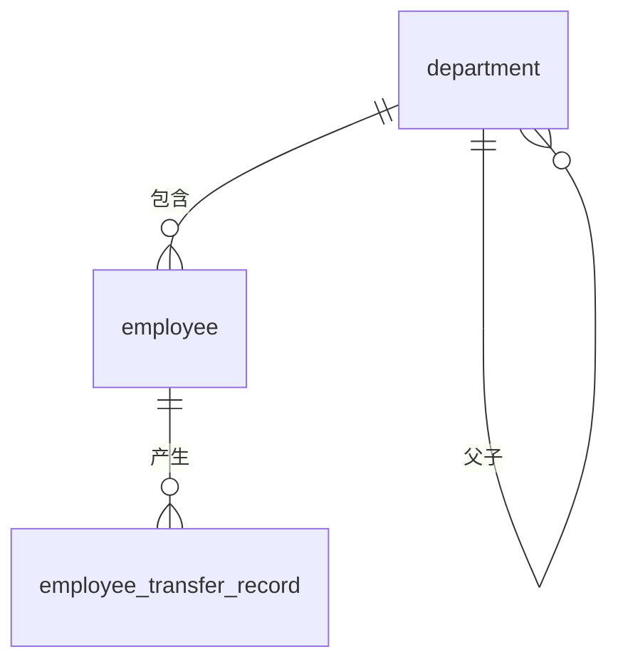

**模型说明：**
- **部门自关联**：通过 `parent_id` 字段实现部门间的层级关系，根节点 `parent_id` 为 NULL
- **部门-员工一对多**：一个部门可包含多名员工，员工通过 `dept_id` 关联部门
- **员工-调动记录一对多**：一名员工可能经历多次调动，每次调动产生一条记录

### 3.3 缓存与 MQ 设计

| 组件 | 用途 | 数据形态 |
|------|------|----------|
| Redis | 部门树全量缓存 | JSON 序列化的部门树结构，TTL 5 分钟 |
| Redis | 员工分页查询结果缓存 | 按 `deptId_status_page_size` 组合作为 Key 缓存 |
| 消息队列（假设） | 员工调动/离职事件异步通知下游 | JSON 格式事件体，包含员工ID、旧部门、新部门、事件类型 |

---

## 4. 接口设计

### 4.1 oneapi（Web 控制台接口）

| 编号 | 接口名称 | 方法 | 路径 | 模块 |
|------|----------|------|------|------|
| W01 | 获取部门树 | GET | /api/departments/tree | 部门管理模块 |
| W02 | 移动部门 | PUT | /api/departments/{id}/move | 部门管理模块 |
| W03 | 删除部门 | DELETE | /api/departments/{id} | 部门管理模块 |
| W04 | 检查员工字段 | GET | /api/employees/check | 员工管理模块 |
| W05 | 新增员工 | POST | /api/employees | 员工管理模块 |
| W06 | 分页查询员工 | GET | /api/employees | 员工管理模块 |
| W07 | 调动员工 | POST | /api/employees/{id}/transfer | 员工管理模块 |
| W08 | 员工离职 | PUT | /api/employees/{id}/resign | 员工管理模块 |

### 4.2 OpenAPI（对外接口）

| 编号 | 接口名称 | 方法 | 路径 | 模块 |
|------|----------|------|------|------|
| O01 | 查询部门下员工列表 | GET | /openapi/departments/{id}/employees | 员工管理模块 |
| O02 | 查询员工基本信息 | GET | /openapi/employees/{id} | 员工管理模块 |

### 4.3 内部接口（Service 层）

| 编号 | 接口名称 | 类 | 方法签名 |
|------|----------|------|----------|
| S01 | 部门下是否存在员工 | EmployeeService | boolean existsByDeptId(Long deptId) |
| S02 | 获取部门树 | DepartmentService | List<DepartmentTreeDTO> getDepartmentTree() |
| S03 | 移动部门 | DepartmentService | void moveDepartment(Long id, Long newParentId) |
| S04 | 创建员工 | EmployeeService | void createEmployee(EmployeeDTO dto) |
| S05 | 调动员工 | EmployeeService | void transferEmployee(Long id, TransferDTO dto) |
| S06 | 员工离职 | EmployeeService | void resignEmployee(Long id, ResignDTO dto) |
| S07 | 检查字段存在性 | EmployeeService | boolean checkFieldExists(String field, String value) |

### 4.4 集成接口（Integration 层）

| 编号 | 接口名称 | 类 | 方法签名 | 说明 |
|------|----------|------|----------|------|
| I01 | 审批流更新通知 | ApprovalFlowClient | void onEmployeeTransferred(TransferEvent event) | 员工调动时触发审批流节点重新计算 |
| I02 | 权限释放通知 | AuthServiceClient | void revokeLoginPermission(Long employeeId) | 员工离职时释放系统登录权限 |

---

## 5. 功能模块设计

### 5.1 部门管理模块

#### 5.1.1 表结构设计

##### 5.1.1.1 部门表（department）

| 字段名 | 数据类型 | 约束 | 默认值 | 说明 |
|--------|----------|------|--------|------|
| id | BIGINT | PK, 自增 | - | 系统自增主键 |
| name | VARCHAR(100) | NOT NULL | - | 部门名称 |
| parent_id | BIGINT | - | NULL | 父部门 ID，根节点为 NULL |
| path | VARCHAR(255) | - | NULL | 路径，如 1-2-5，用于加速子孙节点查询 |
| sort_order | INT | - | 0 | 排序权重 |
| gmt_create | DATETIME | NOT NULL | CURRENT_TIMESTAMP | 创建时间 |
| gmt_modified | DATETIME | NOT NULL | CURRENT_TIMESTAMP | 修改时间 |

**索引：**
- UK: 无（部门名称允许重复，由业务层控制）
- IDX: `idx_parent_id` (parent_id) — 加速子部门查询
- IDX: `idx_path` (path) — 加速子孙节点查询

**索引命名说明：**
- 主键索引：`pk_department_id`
- 普通索引：`idx_department_parent_id`、`idx_department_path`

##### 5.1.1.2 枚举与常量定义

| 枚举名称 | 取值 | 含义 | 关联字段 |
|----------|------|------|----------|
| 本模块无枚举/常量定义 | - | - | - |

#### 5.1.2 接口详细设计

##### W01 获取部门树

- **URI**: GET /api/departments/tree
- **描述**: 查询完整部门树形结构，按 parent_id 组装嵌套 JSON 返回
- **入参**: 无
- **出参**:

| 参数名称 | 类型 | 描述 |
|----------|------|------|
| code | Integer | 结果 code |
| msg | String | 提示信息 |
| data | List<DepartmentTreeNode> | 部门树节点列表 |

- **错误码**:

| 错误码 | 说明 |
|--------|------|
| ORG_001 | 部门树查询失败 |

- **业务规则**: 递归按 parent_id 分组组装树；根节点为 parent_id = NULL 的节点

- **请求示例**:
```json
GET /api/departments/tree
```

- **响应示例**:
```json
{
  "code": 200,
  "msg": "SUCCESS",
  "data": [
    {
      "id": 1,
      "name": "研发部",
      "children": [
        {
          "id": 2,
          "name": "前端组",
          "children": []
        }
      ]
    }
  ]
}
```

##### W02 移动部门

- **URI**: PUT /api/departments/{id}/move
- **描述**: 拖拽调整部门层级，更新父节点
- **入参**:

| 参数名称 | 类型 | 是否必填 | 描述 |
|----------|------|----------|------|
| id | Long | 是 | 路径参数，被移动部门 ID |
| newParentId | Long | 是 | 请求体，新父部门 ID |

- **出参**:

| 参数名称 | 类型 | 描述 |
|----------|------|------|
| code | Integer | 结果 code |
| msg | String | 提示信息 |
| data | Object | 无 |

- **错误码**:

| 错误码 | 说明 |
|--------|------|
| ORG_002 | 目标父部门不存在 |
| ORG_003 | 不能将部门移动到自己的子孙节点下（循环引用） |

- **业务规则**: 校验 newParentId 是否是被移动节点的自身或其子孙节点，若是则拒绝并返回 400

- **请求示例**:
```json
PUT /api/departments/2/move
{
  "newParentId": 5
}
```

- **响应示例**:
```json
{
  "code": 200,
  "msg": "SUCCESS",
  "data": null
}
```

##### W03 删除部门

- **URI**: DELETE /api/departments/{id}
- **描述**: 删除部门，删除前校验部门下是否还有在职员工
- **入参**:

| 参数名称 | 类型 | 是否必填 | 描述 |
|----------|------|----------|------|
| id | Long | 是 | 路径参数，待删除部门 ID |

- **出参**:

| 参数名称 | 类型 | 描述 |
|----------|------|------|
| code | Integer | 结果 code |
| msg | String | 提示信息 |
| data | Object | 无 |

- **错误码**:

| 错误码 | 说明 |
|--------|------|
| ORG_004 | 该部门下存在员工，无法删除 |

- **业务规则**: 若部门下存在 status=1（在职）且 is_deleted=0（未逻辑删除）的员工，拒绝删除

#### 5.1.3 子功能详细设计

##### 5.1.3.1 部门树查询与懒加载（F01）

**处理时序图**

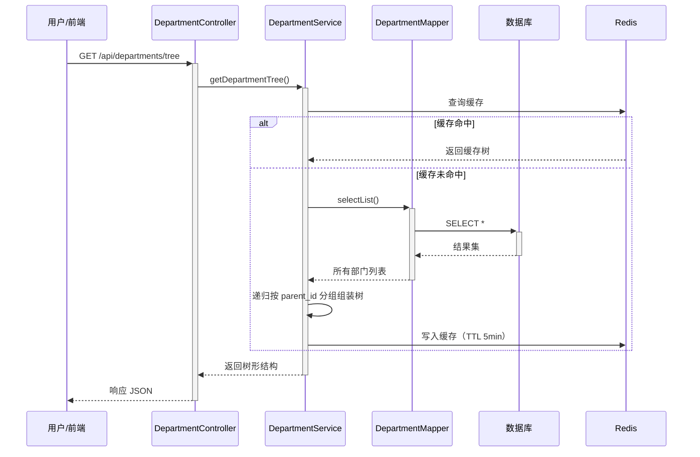

**业务规则：**

| 规则编号 | 规则描述 | 校验时机 | 不满足时的处理 |
|----------|----------|----------|--------------|
| R01 | 部门树默认展开第一级 | 前端渲染时 | 前端控制展开逻辑 |
| R02 | 点击节点展开时才请求子部门 | 前端交互时 | 懒加载逻辑由前端控制，后端一次性返回全量树或由前端按需请求 |

**异常场景：**

| 异常场景 | 处理方式 |
|----------|----------|
| 数据库无部门数据 | 返回空数组，code=200 |
| Redis 连接异常 | 降级直接查库，不影响主流程 |

**并发控制：**
- 并发场景：无并发写入风险，部门树查询为纯读操作
- 控制策略：无并发风险，读操作通过缓存加速

---

##### 5.1.3.2 部门拖拽移动（F02）

**处理时序图**

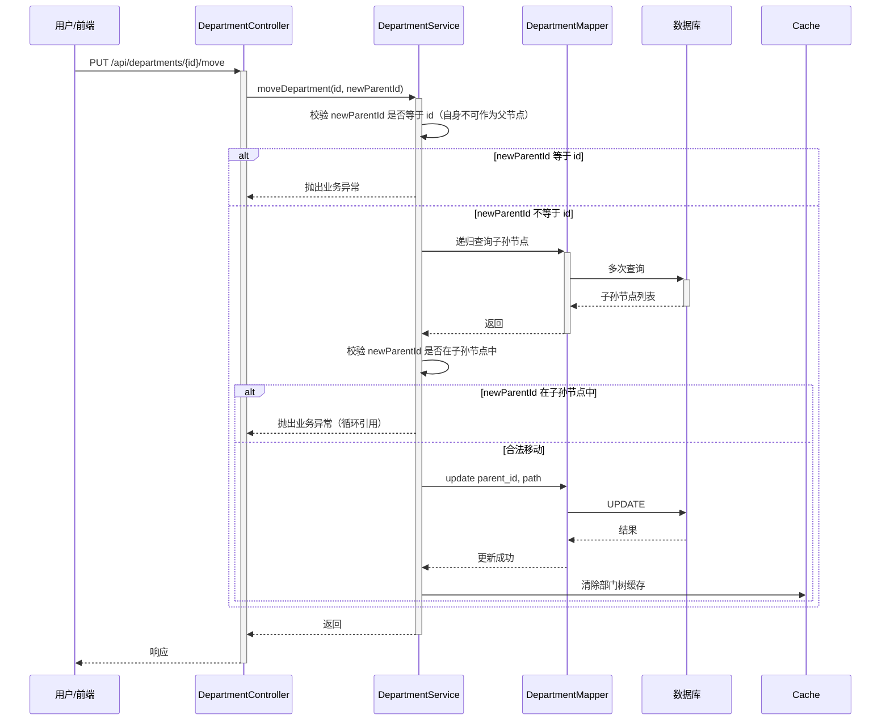

**业务规则：**

| 规则编号 | 规则描述 | 校验时机 | 不满足时的处理 |
|----------|----------|----------|--------------|
| R03 | newParentId 不能等于被移动部门自身 ID | 移动时 | 返回错误码 ORG_003 |
| R04 | newParentId 不能是被移动部门的子孙节点 | 移动时 | 返回错误码 ORG_003，前端还原树到拖拽前状态 |
| R05 | 移动成功后需重新计算 path 字段 | 移动时 | path = 父节点 path + "-" + 当前节点 id |

**异常场景：**

| 异常场景 | 处理方式 |
|----------|----------|
| 目标父部门不存在 | 返回 ORG_002，提示"目标父部门不存在" |
| 循环引用（父变子孙） | 返回 ORG_003，提示"不能将部门移动到自己的子孙节点下" |

**并发控制：**
- 并发场景：多人同时拖拽同一部门
- 控制策略：数据库行级锁（UPDATE 时 InnoDB 行锁），先提交者成功，后提交者等待锁释放后正常执行

---

### 5.2 员工管理模块

#### 5.2.1 表结构设计

##### 5.2.1.1 员工表（employee）

| 字段名 | 数据类型 | 约束 | 默认值 | 说明 |
|--------|----------|------|--------|------|
| id | BIGINT | PK, 自增 | - | 系统自增主键 |
| name | VARCHAR(100) | NOT NULL | - | 员工姓名 |
| employee_no | VARCHAR(50) | NOT NULL, UK | - | 工号，全局唯一 |
| phone | VARCHAR(20) | NOT NULL, UK | - | 手机号，全局唯一 |
| dept_id | BIGINT | NOT NULL, IDX | - | 所属部门 ID |
| position | VARCHAR(100) | - | NULL | 职位 |
| status | TINYINT | NOT NULL, IDX | 1 | 1=在职, 0=离职 |
| version | BIGINT | NOT NULL | 0 | 乐观锁版本号 |
| is_deleted | TINYINT | NOT NULL, IDX | 0 | 逻辑删除标识：0=未删除, 1=已删除 |
| gmt_create | DATETIME | NOT NULL | CURRENT_TIMESTAMP | 创建时间 |
| gmt_modified | DATETIME | NOT NULL | CURRENT_TIMESTAMP | 修改时间 |

**索引：**
- PK: `pk_employee_id` (id)
- UK: `uk_employee_employee_no` (employee_no)
- UK: `uk_employee_phone` (phone)
- IDX: `idx_employee_dept_id` (dept_id)
- IDX: `idx_employee_status` (status)
- IDX: `idx_employee_is_deleted` (is_deleted)
- IDX: `idx_employee_dept_status` (dept_id, status, is_deleted) — 分页查询联合索引

##### 5.2.1.2 枚举与常量定义

| 枚举名称 | 取值 | 含义 | 关联字段 |
|----------|------|------|----------|
| EmployeeStatus | 1 | 在职 | employee.status |
| EmployeeStatus | 0 | 离职 | employee.status |
| DeleteFlag | 0 | 未删除 | employee.is_deleted |
| DeleteFlag | 1 | 已删除 | employee.is_deleted |

#### 5.2.2 接口详细设计

##### W04 检查员工字段唯一性

- **URI**: GET /api/employees/check
- **描述**: 实时校验工号或手机号是否已存在
- **入参**:

| 参数名称 | 类型 | 是否必填 | 描述 |
|----------|------|----------|------|
| field | String | 是 | 校验字段：employeeNo 或 phone |
| value | String | 是 | 待校验值 |

- **出参**:

| 参数名称 | 类型 | 描述 |
|----------|------|------|
| code | Integer | 结果 code |
| msg | String | 提示信息 |
| data.isExist | Boolean | true=已存在, false=不存在 |

- **错误码**:

| 错误码 | 说明 |
|--------|------|
| ORG_005 | 字段参数不合法 |

- **请求示例**:
```json
GET /api/employees/check?field=employeeNo&value=10086
```

- **响应示例**:
```json
{
  "code": 200,
  "msg": "SUCCESS",
  "data": {
    "isExist": false
  }
}
```

##### W05 新增员工

- **URI**: POST /api/employees
- **描述**: 创建新员工记录
- **入参**:

| 参数名称 | 类型 | 是否必填 | 描述 |
|----------|------|----------|------|
| name | String | 是 | 员工姓名 |
| employeeNo | String | 是 | 工号 |
| phone | String | 是 | 手机号 |
| deptId | Long | 是 | 所属部门 ID |
| position | String | 否 | 职位 |

- **出参**:

| 参数名称 | 类型 | 描述 |
|----------|------|------|
| code | Integer | 结果 code |
| msg | String | 提示信息 |
| data | Object | 无 |

- **错误码**:

| 错误码 | 说明 |
|--------|------|
| ORG_006 | 工号已存在 |
| ORG_007 | 手机号已存在 |
| ORG_008 | 所属部门不存在 |

- **请求示例**:
```json
POST /api/employees
{
  "name": "张三",
  "employeeNo": "10086",
  "deptId": 2,
  "phone": "13800138000"
}
```

- **响应示例**:
```json
{
  "code": 200,
  "msg": "SUCCESS",
  "data": null
}
```

##### W06 分页查询员工

- **URI**: GET /api/employees
- **描述**: 分页查询员工列表，支持按部门和状态筛选
- **入参**:

| 参数名称 | 类型 | 是否必填 | 描述 |
|----------|------|----------|------|
| page | Integer | 否 | 页码，默认 1 |
| size | Integer | 否 | 每页条数，默认 10 |
| deptId | Long | 否 | 按部门筛选 |
| status | Integer | 否 | 按状态筛选：1=在职, 0=离职 |

- **出参**:

| 参数名称 | 类型 | 描述 |
|----------|------|------|
| code | Integer | 结果 code |
| msg | String | 提示信息 |
| data.records | List<Employee> | 员工记录列表 |
| data.total | Long | 总记录数 |
| data.page | Integer | 当前页码 |
| data.size | Integer | 每页条数 |

##### W07 调动员工

- **URI**: POST /api/employees/{id}/transfer
- **描述**: 员工调动，更新部门/职位，记录调动历史，触发审批流级联更新
- **入参**:

| 参数名称 | 类型 | 是否必填 | 描述 |
|----------|------|----------|------|
| id | Long | 是 | 路径参数，员工 ID |
| newDeptId | Long | 是 | 目标部门 ID |
| newPosition | String | 否 | 新职位 |
| reason | String | 否 | 调动原因 |

- **出参**:

| 参数名称 | 类型 | 描述 |
|----------|------|------|
| code | Integer | 结果 code |
| msg | String | 提示信息 |
| data | Object | 无 |

- **错误码**:

| 错误码 | 说明 |
|--------|------|
| ORG_009 | 员工不存在 |
| ORG_010 | 目标部门不存在 |
| ORG_011 | 乐观锁冲突（版本号不匹配），返回 409 Conflict |

- **请求示例**:
```json
POST /api/employees/1/transfer
{
  "newDeptId": 3,
  "newPosition": "Java开发",
  "reason": "业务调整"
}
```

- **响应示例**:
```json
{
  "code": 200,
  "msg": "调动成功",
  "data": null
}
```

##### W08 员工离职

- **URI**: PUT /api/employees/{id}/resign
- **描述**: 办理员工离职，更新状态为离职，逻辑删除，释放权限
- **入参**:

| 参数名称 | 类型 | 是否必填 | 描述 |
|----------|------|----------|------|
| id | Long | 是 | 路径参数，员工 ID |
| resignDate | String | 否 | 离职日期，格式 yyyy-MM-dd |

- **出参**:

| 参数名称 | 类型 | 描述 |
|----------|------|------|
| code | Integer | 结果 code |
| msg | String | 提示信息 |
| data | Object | 无 |

- **错误码**:

| 错误码 | 说明 |
|--------|------|
| ORG_012 | 员工不存在或已离职 |

- **请求示例**:
```json
PUT /api/employees/1/resign
{
  "resignDate": "2023-11-01"
}
```

#### 5.2.3 子功能详细设计

##### 5.2.3.1 员工新增（F03）

**处理时序图**

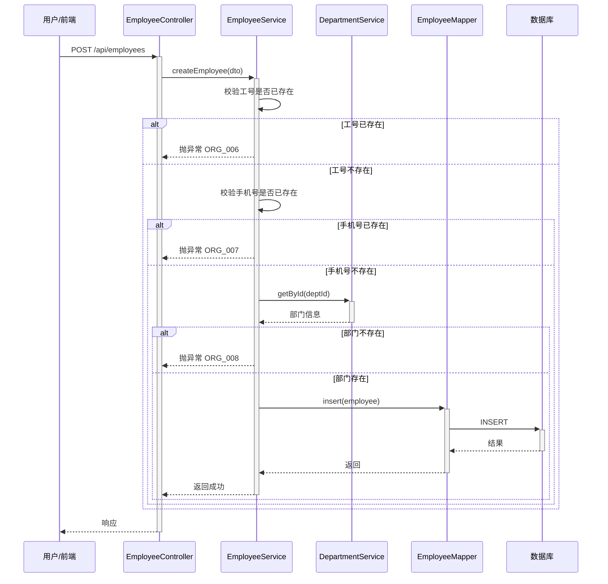

**业务规则：**

| 规则编号 | 规则描述 | 校验时机 | 不满足时的处理 |
|----------|----------|----------|--------------|
| R06 | 工号全局唯一 | 创建时 | 返回 ORG_006 |
| R07 | 手机号全局唯一 | 创建时 | 返回 ORG_007 |
| R08 | 所属部门必须存在 | 创建时 | 返回 ORG_008 |
| R09 | 新员默认为“在职”状态 | 创建时 | status = 1 |

**异常场景：**

| 异常场景 | 处理方式 |
|----------|----------|
| 数据库唯一索引冲突（并发新增相同工号） | 应用层二次校验兜底，冲突时返回 ORG_006 |

**并发控制：**
- 并发场景：多人同时新增相同工号的员工
- 控制策略：数据库唯一索引 + 应用层二次校验双重保障

---

##### 5.2.3.2 人员调动（F04）

**处理时序图**

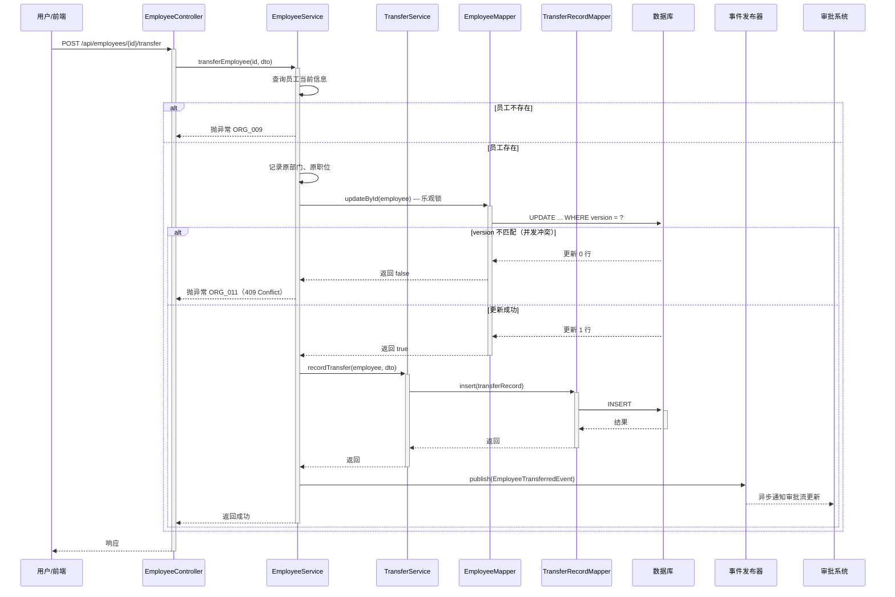

**业务规则：**

| 规则编号 | 规则描述 | 校验时机 | 不满足时的处理 |
|----------|----------|----------|--------------|
| R10 | 目标部门必须存在 | 调动时 | 返回 ORG_010 |
| R11 | 调动时使用乐观锁（version） | 调动时 | version 不匹配时返回 409 Conflict |
| R12 | 调动后记录完整快照（原部门/职位 → 新部门/职位） | 调动成功后 | 写入调动记录表 |
| R13 | 调动成功后异步触发审批流更新 | 调动成功后 | 通过事件发布器通知下游 |

**异常场景：**

| 异常场景 | 处理方式 |
|----------|----------|
| 并发调动冲突（两人同时调动同一员工） | 乐观锁返回 409，前端提示"该员工信息已被他人修改，请刷新重试" |
| 调动记录写入失败 | 事务回滚，保持数据一致性 |
| 审批系统通知失败 | 异步通知，失败可重试，不影响主事务 |

**并发控制：**
- 并发场景：多人同时调动同一员工
- 控制策略：乐观锁（version 字段），updateById 时 MyBatis-Plus 自动拼接 WHERE version = ?，若影响行数为 0 则抛出并发冲突异常

---

##### 5.2.3.3 员工状态机

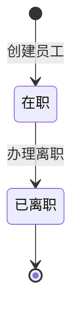

**状态流转规则：**

| 当前状态 | 目标状态 | 流转条件 | 前置校验 | 触发动作 |
|----------|----------|----------|----------|----------|
| 在职 | 已离职 | 办理离职 | 员工存在且当前为在职 | 更新 status=0, is_deleted=1；释放登录权限；异步通知权限系统 |

---

##### 5.2.3.4 员工离职（F05）

**处理时序图**

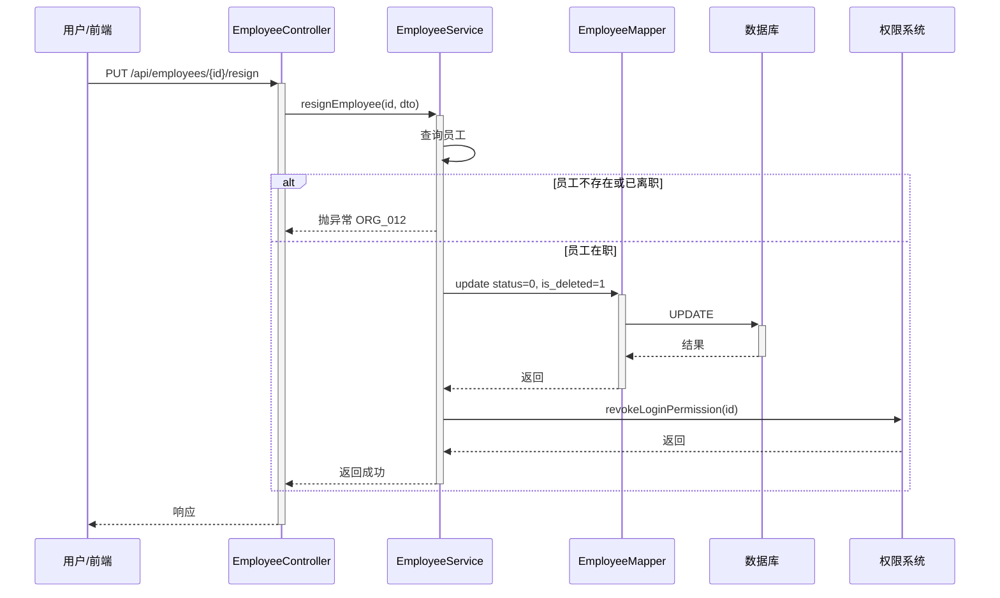

**业务规则：**

| 规则编号 | 规则描述 | 校验时机 | 不满足时的处理 |
|----------|----------|----------|--------------|
| R14 | 已离职员工不可再次办理离职 | 办理时 | 返回 ORG_012 |
| R15 | 离职后自动释放系统登录权限 | 办理成功后 | 调用权限系统接口撤销登录许可 |
| R16 | 历史数据保留，关联查询需带状态标识 | 查询时 | 列表页支持按状态筛选 |

**异常场景：**

| 异常场景 | 处理方式 |
|----------|----------|
| 权限系统调用失败 | 记录失败日志，可人工介入补偿处理 |

---

### 5.3 调动记录模块

#### 5.3.1 表结构设计

##### 5.3.1.1 调动记录表（employee_transfer_record）

| 字段名 | 数据类型 | 约束 | 默认值 | 说明 |
|--------|----------|------|--------|------|
| id | BIGINT | PK, 自增 | - | 系统自增主键 |
| employee_id | BIGINT | NOT NULL, IDX | - | 员工 ID |
| old_dept_id | BIGINT | - | NULL | 原部门 ID |
| new_dept_id | BIGINT | NOT NULL | - | 目标部门 ID |
| old_position | VARCHAR(100) | - | NULL | 原职位 |
| new_position | VARCHAR(100) | - | NULL | 新职位 |
| reason | VARCHAR(500) | - | NULL | 调动原因 |
| operator_id | BIGINT | - | NULL | 操作人 ID |
| gmt_create | DATETIME | NOT NULL | CURRENT_TIMESTAMP | 创建时间 |

**索引：**
- PK: `pk_employee_transfer_record_id` (id)
- IDX: `idx_employee_transfer_record_employee_id` (employee_id)

#### 5.3.2 子功能详细设计

##### 5.3.2.1 调动快照记录

**业务规则：**

| 规则编号 | 规则描述 | 校验时机 | 不满足时的处理 |
|----------|----------|----------|--------------|
| R17 | 每次调动必须记录完整快照 | 调动事务内 | 调动记录写入失败时，主事务回滚 |
| R18 | 操作人 ID 必须记录 | 调动时 | 无操作人时记录为 NULL |

---

## 6. 非功能性需求设计

### 6.1 高可用性

- 应用部署至少 2 个实例，通过 Nginx 负载均衡，避免单点故障
- 数据库采用 MySQL 主从架构，读写分离提升可用性
- Redis 采用集群模式，避免缓存单点
- 下游审批系统、权限系统调用异常时，通过异步消息队列解耦，保证主流程不受阻塞

### 6.2 可扩展性

- 部门树查询结果支持 Redis 缓存，后续可通过增加缓存节点水平扩展
- 员工分页查询通过数据库索引优化，必要时可通过分库分表扩展
- 权限释放、审批流更新等操作通过事件驱动解耦，便于后续接入更多下游系统

### 6.3 稳定性/可靠性

- 大数据量场景：员工列表强制分页（page/size），默认每页 10 条，最大每页 100 条，防止一次性加载过多数据导致浏览器卡死
- 部门删除前校验下属员工数量，存在员工时拒绝删除并返回明确错误信息
- 树形结构循环引用：move 接口递归校验 newParentId，发现循环引用时返回 400，前端还原树状态
- 并发调动冲突：员工表增加 version 字段，使用乐观锁，冲突时返回 409 Conflict

### 6.4 安全性设计

#### 6.4.1 账户系统方案

- 本模块不涉及独立的账户系统，用户认证由上层网关或统一认证中心处理
- 模块内通过请求上下文获取当前操作用户 ID 用于记录操作日志

#### 6.4.2 授权 & 访问控制

##### 6.4.2.1 水平权限检查

- 部门主管角色：接口层通过注解或拦截器校验当前用户是否为该部门或上级部门主管，仅能查看本部门及下属部门人员
- 超管/HR 角色：不受数据范围限制，可查看所有部门及人员

##### 6.4.2.2 垂直权限检查

- 通过角色配置（如 Spring Security 角色或自实现角色权限检查）区分超管/HR 和部门主管的操作权限
- 部门主管仅能编辑本部门人员部分信息，不能进行调动、离职等操作（假设，实际以产品定义为准）

##### 6.4.2.3 登录态检查

- 所有 /api/* 接口均需检查登录态，未登录返回 401 Unauthorized
- 登录态检查通过网关统一拦截器实现

#### 6.4.3 数据防护方案

##### 6.4.3.1 敏感数据加密存储

- 手机号等敏感信息如需加密存储，建议采用 AES 加密，密钥由 KMS 托管
- 假设：首期明文存储，后续根据安全评估决定是否加密

##### 6.4.3.2 敏感数据展示脱敏

- 前端展示员工手机号时，中间 4 位脱敏（如 138****8000）
- 日志中打印手机号时进行脱敏处理

### 6.5 监控/统计/日志/告警

- 部门树查询耗时超过 500ms 时记录慢查询日志
- 员工调动、离职等关键操作记录操作审计日志（操作人、时间、目标员工、操作类型）
- 下游审批系统、权限系统调用失败时记录错误日志并触发告警

---

## 7. 变更三板斧

### 7.1 可监控

- **服务埋点**：
  - 部门树查询接口埋点：记录查询耗时、缓存命中率
  - 员工调动接口埋点：记录调用次数、成功/失败率、乐观锁冲突次数
  - 下游审批系统/权限系统调用埋点：记录调用耗时、失败率
- **业务指标监控**：
  - 每日新增员工数、调动次数、离职人数
  - 部门数量变化趋势

### 7.2 可灰度

- 按租户 ID 尾号灰度：新功能上线时，仅对特定尾号的租户开放，观察稳定后全量放开
- 本模块新增接口默认全量生效，如需灰度可通过网关配置路由规则实现

### 7.3 可应急

- **功能开关**：
  - 员工调动审批流级联更新：可通过配置中心开关控制是否触发下游通知，异常时关闭开关避免影响主流程
  - 员工离职权限释放：可通过开关控制是否调用权限系统，异常时关闭后人工补偿处理
- **回滚策略**：
  - 发布异常时回滚应用包，数据库变更（新增表、字段）通过数据库版本管理工具（如 Flyway）控制，不支持回滚
  - 回滚前确认新接口与旧代码的兼容性，避免回滚后旧代码无法识别新表字段

---

## 8. 附录

### 8.1 跨模块调用链

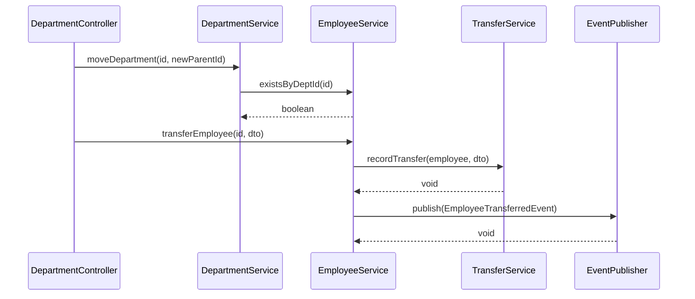

### 8.2 需求追溯矩阵

| 需求编号 | 功能点 | 对应设计章节 |
|----------|--------|-------------|
| F01 | 部门树形结构查询 | 5.1.3.1 |
| F02 | 部门层级拖拽调整 | 5.1.3.2 |
| F03 | 员工新增（唯一性校验） | 5.2.3.1 |
| F04 | 人员调动（级联更新 + 快照） | 5.2.3.2 |
| F05 | 员工离职（逻辑删除 + 状态隔离） | 5.2.3.4 |
| F06 | 分页查询员工列表 | W06 |
| F07 | 部门删除校验 | W03 |
| F08 | 实时字段唯一性校验 | W04 |

### 8.3 决策记录

| 决策项 | 决策结果 | 备选方案 | 决策原因 |
|--------|----------|----------|----------|
| 技术栈 | Spring Boot 3.x + MyBatis-Plus + MySQL 8 | Node.js + NestJS / Python + Django | 实施计划已明确使用 Spring 生态，保持一致性 |
| 部门树缓存 | Redis 全量缓存，TTL 5 分钟 | 不缓存 / 本地缓存 | 部门树读取频繁且相对稳定，Redis 缓存减少数据库压力 |
| 员工调动级联策略 | 事件驱动异步通知 | 事务内同步调用 | 解耦下游系统，避免下游故障影响主事务 |
| 乐观锁实现 | MyBatis-Plus @Version 插件 | 数据库行锁 / 分布式锁 | 实现简单，满足单机并发场景，性能优于行锁 |
| 逻辑删除字段 | is_deleted + status 双字段 | 单 status 字段 | is_deleted 用于通用逻辑删除，status 用于业务状态机，职责分离 |
| 前端技术栈 | React 18 + Ant Design 5 + Redux Toolkit | Vue 3 + Element Plus | 实施计划已明确，保持一致性 |

---

*文档结束*
