> **文档元信息**
>
> | 项目 | 内容 |
> |------|------|
> | 文档版本 | v1.0 |
> | 作者 | DTCoder |
> | 创建日期 | 2025-08-18 |
> | 需求来源 | `${system.dima}.md` (需求澄清) / `20260818-分别写三个接口helloworld、哈希.md` (实施计划) |
> | 评审状态 | 待评审 |
> | 关联仓库 | testDj (后端) / testDJnew (前端) |

# 算法演示与埋点报表系统 系分设计

## 1. 需求与范围

### 背景与目标

构建一个全栈算法演示系统，后端提供 HelloWorld、哈希算法（MD5/SHA256）、冒泡排序三个接口，并通过 HandlerInterceptor 自动记录每次 API 调用（埋点）；前端通过三 Tab 页面展示各算法执行结果，提供 Excel 导出按钮，并在页面底部以 ECharts 渲染调用统计可视化报表（支持折线图、饼图、柱状图三种展示形式，可按人员类型、人员层级、人员部门三个维度切换）。

### 核心功能

1. **HelloWorld 接口**：GET 无参接口，返回 "Hello World" 消息及时间戳
2. **哈希算法接口**：POST 接口，支持 MD5 和 SHA256 两种算法，输入文本返回哈希值
3. **冒泡排序接口**：POST 接口，输入数组和排序方向（asc/desc），返回排序结果、步骤明细和比较次数
4. **Excel 导出接口**：POST 接口，接收当前 Tab 的结果数据，生成 .xlsx 文件并返回二进制流
5. **埋点记录**：拦截所有 `/api/**` 请求，自动记录调用人、调用时间、接口路径、人员类型/层级/部门等信息
6. **埋点查询报表**：GET 接口，按维度聚合查询调用次数，返回结构化数据供前端渲染图表
7. **前端三 Tab 页面**：HelloWorld / 哈希算法 / 冒泡排序三个 Tab，各自展示输入区和结果
8. **前端导出按钮**：调用后端导出接口，触发浏览器下载 Excel
9. **前端可视化报表**：ECharts 渲染折线图/饼图/柱状图，维度下拉切换

### 约束与非功能要求

| 约束项 | 说明 |
|------|------|
| 统一响应格式 | 所有接口返回 `{code, message, data}` |
| 埋点字段 | callerName, callerType, callerLevel, callerDept, apiPath, apiMethod, callTime, clientIp, userAgent |
| 调用人信息来源 | 请求头 `X-Caller-Name / X-Caller-Type / X-Caller-Level / X-Caller-Dept`，缺失使用默认值 |
| 导出格式 | Excel (.xlsx)，Content-Disposition 含动态文件名 |
| 冒泡排序限制 | 最大数组长度 100 |
| 接口响应时间 | P95 < 500ms |
| 后端端口 | 8080 |
| 前端端口 | 5173 (Vite dev server)，通过 Vite proxy 代理 `/api` 到后端 |
| 数据库 | H2 内存数据库，JPA ddl-auto: update |

### 排除范围

- 用户登录/认证系统
- 国际化 (i18n)
- 移动端适配
- 灰度发布/AB 测试
- CI/CD 流水线配置
- 生产级数据库（MySQL/PostgreSQL）迁移

### 需求功能清单与优先级

| 编号 | 功能点 | 优先级 | 原始描述 | 备注 |
|------|--------|--------|----------|------|
| F01 | HelloWorld 接口 | P0 | "分别写三个接口helloworld" | GET /api/helloworld |
| F02 | 哈希算法接口 (MD5/SHA256) | P0 | "哈希算法" | POST /api/hash |
| F03 | 冒泡排序接口 (含步骤) | P0 | "冒泡排序" | POST /api/bubblesort |
| F04 | 导出接口 (Excel) | P0 | "后台提供导出接口，支持导出各个页面的展示结果" | POST /api/export |
| F05 | 埋点拦截器 (自动记录调用) | P0 | "后端再做个埋点，获取调用次数和调用人" | HandlerInterceptor |
| F06 | 埋点查询报表接口 | P0 | "根据不同的维度：人员类型、人员层级、人员部门等" | GET /api/metrics |
| F07 | 三 Tab 展示页面 | P0 | "前端新增一个页面，有三个tab分别展示不同的执行结果" | DashboardPage |
| F08 | 导出按钮 (调用后端导出) | P0 | "新增导出按钮" | ExportButton |
| F09 | 可视化报表 (折线/饼图/柱状图) | P0 | "前端在当前页面上可视化出来一个报表...折线图以及饼图和柱状图" | MetricsPanel + ECharts |

### 假设与待确认项

| 编号 | 假设/待确认内容 | 当前假设 | 确认状态 |
|------|-----------------|----------|----------|
| A01 | 后端技术栈 | Spring Boot 3.2.x + Java 17 + Maven | 待确认 |
| A02 | 前端技术栈 | React 18 + TypeScript + Vite | 待确认 |
| A03 | UI 组件库 | Ant Design 5 | 待确认 |
| A04 | 图表库 | ECharts 5 | 待确认 |
| A05 | 数据库选型 | H2 内存数据库（重启数据丢失） | 待确认 |
| A06 | 调用人信息来源 | 请求头 X-Caller-* 注入 | 待确认 |
| A07 | 导出格式 | Excel (.xlsx) via Apache POI | 待确认 |
| A08 | 冒泡排序最大数组长度 | 100 | 待确认 |
| A09 | 埋点数据保留策略 | 内存存储，不自动清理 | 待确认 |
| A10 | 前后端端口 | 后端 8080，前端 5173 | 待确认 |

---

## 2. 架构与模块

### 功能架构

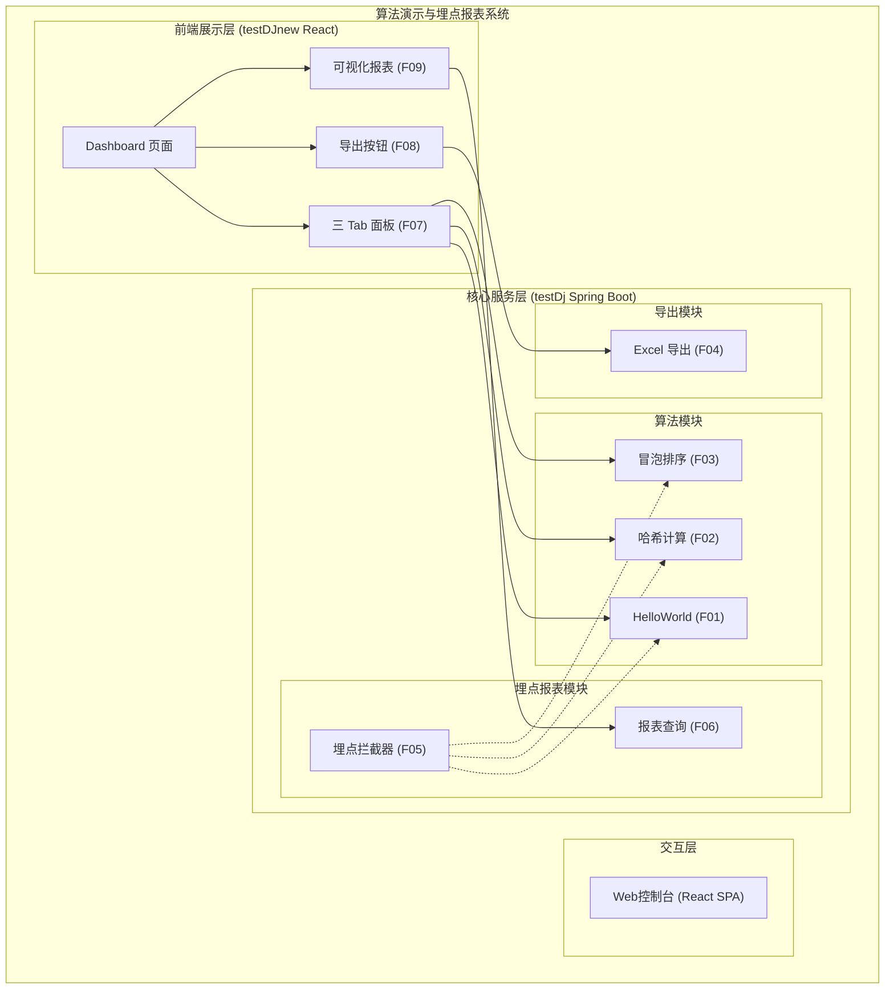

- **交互层**：React SPA 单页应用，通过 Vite dev server 代理 `/api` 到后端
- **核心服务层**：Spring Boot 应用，分为算法模块、导出模块、埋点报表模块
- **前端展示层**：Dashboard 页面，包含三 Tab、导出按钮、ECharts 可视化报表

**模块清单**

| 模块 | 仓库 | 职责 | 依赖 |
|------|------|------|------|
| 算法模块 | testDj | 提供 HelloWorld、哈希计算、冒泡排序三个 API | ApiResult 封装 |
| 导出模块 | testDj | 接收前端数据，使用 Apache POI 生成 Excel 二进制流 | 算法模块（数据结构） |
| 埋点报表模块 | testDj | 拦截 `/api/**` 请求写入 H2，提供维度聚合查询 | H2 数据库、JPA |
| Dashboard 页面 | testDJnew | 主页面容器，管理 Tab 状态和结果缓存 | Ant Design, API Client |
| Tab 面板 | testDJnew | 三 Tab 切换，各自独立的输入区和结果展示 | API Client |
| 导出按钮 | testDJnew | 调用导出接口，触发浏览器下载 | API Client |
| 可视化报表 | testDJnew | 维度选择器 + 图表类型切换 + ECharts 渲染 | ECharts, API Client |

### 应用集成架构

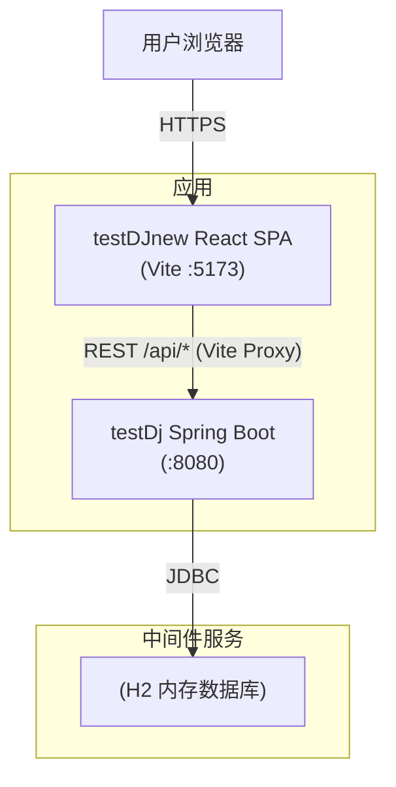

**集成关系说明：**

| 调用方 | 被调用方 | 协议 | 接口类型 | 说明 |
|--------|----------|------|----------|------|
| 用户浏览器 | testDJnew React SPA | HTTPS | SPA 页面 | 前端入口 |
| testDJnew React SPA | testDj Spring Boot | HTTP REST | oneapi | Vite proxy 代理 `/api` 到 8080 |
| testDj Spring Boot | H2 数据库 | JDBC | SQL | JPA 自动建表，存储埋点数据 |

### 部署架构

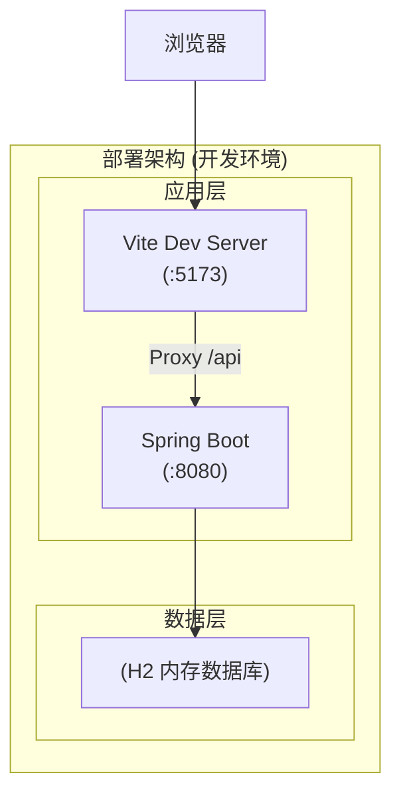

**部署说明：**
- **应用层**：前端 Vite dev server 和后端 Spring Boot 同机部署，开发环境单实例
- **数据层**：H2 内存数据库随 Spring Boot 进程生命周期，重启数据丢失
- **假设**：开发/演示环境，不涉及容器化、多副本、负载均衡

---

## 3. 数据模型与存储

### 实体清单

| 实体名称 | 实体说明 | 所属模块 | 与其他实体的关系 |
|----------|----------|----------|-----------------|
| MetricsRecord | 埋点调用记录，存储每次 API 调用的详细信息 | 埋点报表模块 | 无关联实体（独立实体） |

### 实体关系图

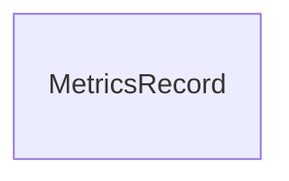

**模型说明：**
- 本系统仅涉及单一实体 `MetricsRecord`，无实体间关联关系
- 埋点数据通过拦截器异步写入，与业务接口完全解耦
- 查询时按维度字段（caller_type / caller_level / caller_dept）GROUP BY 聚合

---

## 4. 接口设计

### 4.1 oneapi（Web 控制台接口）

| 编号 | 接口名称 | 方法 | 路径 | 模块 |
|------|----------|------|------|------|
| W01 | HelloWorld | GET | /api/helloworld | 算法模块 |
| W02 | 哈希计算 | POST | /api/hash | 算法模块 |
| W03 | 冒泡排序 | POST | /api/bubblesort | 算法模块 |
| W04 | Excel 导出 | POST | /api/export | 导出模块 |
| W05 | 埋点报表查询 | GET | /api/metrics | 埋点报表模块 |

### 4.2 OpenAPI（对外接口）

本项不适用，原因：当前系统为内部演示系统，不对外暴露 OpenAPI。

### 4.3 内部接口（Service 层）

| 编号 | 接口名称 | 类 | 方法签名 |
|------|----------|------|----------|
| S01 | 哈希计算 | HashService | `String compute(String input, String algorithm)` |
| S02 | 冒泡排序 | BubbleSortService | `BubbleSortResponse sort(int[] array, String order)` |
| S03 | Excel 生成 | ExportService | `byte[] export(String type, Object data)` |
| S04 | 埋点保存 | MetricsService | `void save(String callerName, String callerType, String callerLevel, String callerDept, String apiPath, String apiMethod, String clientIp, String userAgent)` |
| S05 | 埋点聚合查询 | MetricsService | `MetricsResponse queryByDimension(String dimension, LocalDate start, LocalDate end)` |

### 4.4 集成接口（Integration 层）

本项不适用，原因：当前系统不依赖外部系统集成，无 Integration 层。

---

## 5. 功能模块设计

### 5.1 算法模块（testDj）

#### 5.1.1 表结构设计

本模块不涉及持久化表，所有算法计算为无状态服务。

#### 5.1.2 接口详细设计

##### W01 HelloWorld

- **URI**: GET /api/helloworld
- **描述**: 返回 "Hello World" 消息及当前时间戳
- **入参**: 无

- **出参**:

| 参数名称 | 类型 | 描述 |
|----------|------|------|
| code | int | 0=成功 |
| message | String | "success" |
| data.message | String | "Hello World" |
| data.timestamp | String | ISO-8601 时间戳 |

- **错误码**: 无（该接口不会失败）

- **业务规则**: 无

- **请求示例**: `GET /api/helloworld`

- **响应示例**:
```json
{
  "code": 0,
  "message": "success",
  "data": {
    "message": "Hello World",
    "timestamp": "2025-08-18T10:00:00Z"
  }
}
```

##### W02 哈希计算

- **URI**: POST /api/hash
- **描述**: 对输入文本计算 MD5 或 SHA256 哈希值
- **入参**:

| 参数名称 | 类型 | 是否必填 | 描述 |
|----------|------|----------|------|
| input | String | 是 | 待哈希的输入文本 |
| algorithm | String | 是 | 算法类型，枚举: MD5 / SHA256 |

- **出参**:

| 参数名称 | 类型 | 描述 |
|----------|------|------|
| code | int | 0=成功, 400=参数错误 |
| message | String | "success" 或错误描述 |
| data.input | String | 原始输入 |
| data.algorithm | String | 使用的算法 (大写) |
| data.hash | String | 十六进制哈希值 |

- **错误码**:

| 错误码 | 说明 |
|--------|------|
| 400 | 不支持的算法，仅支持 MD5 / SHA256 |

- **业务规则**: 算法名称大小写不敏感，统一转为大写返回

- **请求示例**:
```json
{
  "input": "hello",
  "algorithm": "MD5"
}
```

- **响应示例**:
```json
{
  "code": 0,
  "message": "success",
  "data": {
    "input": "hello",
    "algorithm": "MD5",
    "hash": "5d41402abc4b2a76b9719d911017c592"
  }
}
```

##### W03 冒泡排序

- **URI**: POST /api/bubblesort
- **描述**: 对输入数组执行冒泡排序，返回排序结果、每轮步骤和比较次数
- **入参**:

| 参数名称 | 类型 | 是否必填 | 描述 |
|----------|------|----------|------|
| array | List\<Integer\> | 是 | 待排序整数数组，最大长度 100 |
| order | String | 是 | 排序方向，枚举: asc / desc |

- **出参**:

| 参数名称 | 类型 | 描述 |
|----------|------|------|
| code | int | 0=成功, 400=参数错误 |
| message | String | "success" 或错误描述 |
| data.original | List\<Integer\> | 原始数组 |
| data.sorted | List\<Integer\> | 排序后数组 |
| data.steps | List\<SortStep\> | 每轮排序后的数组状态 |
| data.steps[].round | int | 轮次编号 |
| data.steps[].array | List\<Integer\> | 该轮结束时的数组状态 |
| data.comparisons | int | 总比较次数 |

- **错误码**:

| 错误码 | 说明 |
|--------|------|
| 400 | 排序方向仅支持 asc 或 desc |
| 400 | 数组长度不能超过 100 |

- **业务规则**: 冒泡排序逐轮记录数组快照，空数组和单元素数组直接返回（比较次数为 0）

- **请求示例**:
```json
{
  "array": [5, 3, 8, 1, 2],
  "order": "asc"
}
```

- **响应示例**:
```json
{
  "code": 0,
  "message": "success",
  "data": {
    "original": [5, 3, 8, 1, 2],
    "sorted": [1, 2, 3, 5, 8],
    "steps": [
      {"round": 1, "array": [3, 5, 1, 2, 8]},
      {"round": 2, "array": [3, 1, 2, 5, 8]},
      {"round": 3, "array": [1, 2, 3, 5, 8]},
      {"round": 4, "array": [1, 2, 3, 5, 8]}
    ],
    "comparisons": 10
  }
}
```

#### 5.1.3 子功能详细设计

##### 5.1.3.1 HelloWorld 接口调用（F01）

- 处理时序图

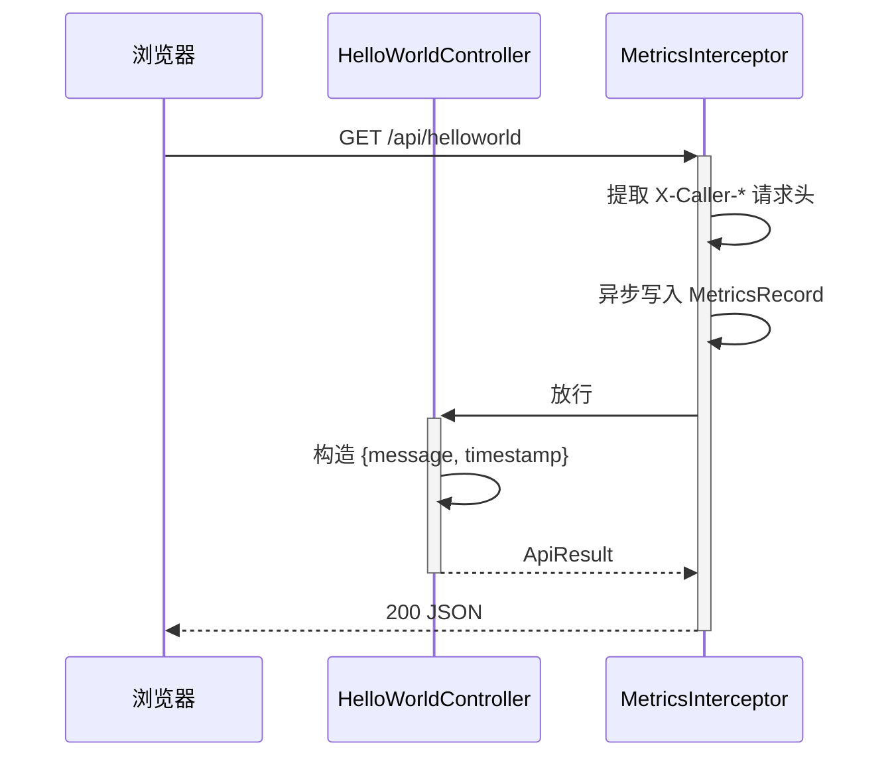

**业务规则：**

| 规则编号 | 规则描述 | 校验时机 | 不满足时的处理 |
|----------|----------|----------|--------------|
| R01 | 无业务规则，该接口为纯静态返回 | - | - |

**异常场景：** 无（该接口无失败路径）

**并发控制：** 无并发风险，原因：该接口为纯读操作，不涉及数据写入

##### 5.1.3.2 哈希计算（F02）

- 处理时序图

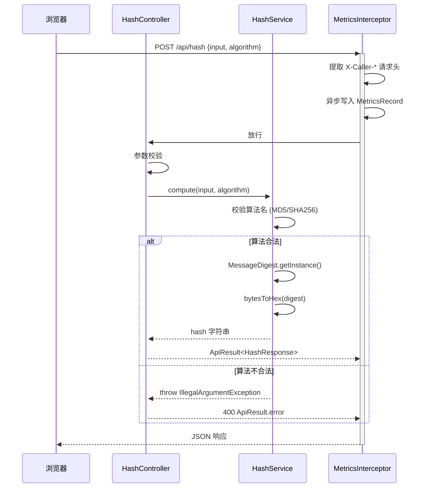

**业务规则：**

| 规则编号 | 规则描述 | 校验时机 | 不满足时的处理 |
|----------|----------|----------|--------------|
| R02 | algorithm 必须为 MD5 或 SHA256 (大小写不敏感) | 请求时 | 返回 400，提示"不支持的算法: XXX，仅支持 MD5 / SHA256" |
| R03 | input 可以为空字符串，返回空字符串的哈希值 | 请求时 | - |

**异常场景：**

| 异常场景 | 处理方式 |
|----------|----------|
| 算法名称不合法 | 返回 400 + 错误消息 |
| 系统不支持算法 (NoSuchAlgorithmException) | 返回 500，内部 RuntimeException |

**并发控制：** 无并发风险，原因：哈希计算为纯函数，无状态，不涉及共享数据

##### 5.1.3.3 冒泡排序（F03）

- 处理时序图

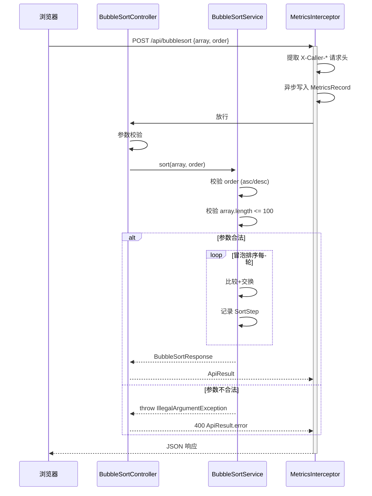

**业务规则：**

| 规则编号 | 规则描述 | 校验时机 | 不满足时的处理 |
|----------|----------|----------|--------------|
| R04 | order 必须为 asc 或 desc (大小写不敏感) | 请求时 | 返回 400，提示"排序方向仅支持 asc 或 desc" |
| R05 | array 长度不能超过 100 | 请求时 | 返回 400，提示"数组长度不能超过 100" |
| R06 | 空数组或单元素数组直接返回，比较次数为 0 | 请求时 | - |

**异常场景：**

| 异常场景 | 处理方式 |
|----------|----------|
| 排序方向参数非法 | 返回 400 + 错误消息 |
| 数组长度超限 | 返回 400 + 错误消息 |

**并发控制：** 无并发风险，原因：排序计算为纯函数，无状态，不涉及共享数据

---

### 5.2 导出模块（testDj）

#### 5.2.1 表结构设计

本模块不涉及持久化表。

#### 5.2.2 接口详细设计

##### W04 Excel 导出

- **URI**: POST /api/export
- **描述**: 接收前端传入的类型和数据，生成 Excel 文件并返回二进制流
- **入参**:

| 参数名称 | 类型 | 是否必填 | 描述 |
|----------|------|----------|------|
| type | String | 是 | 数据类型，枚举: helloworld / hash / bubblesort |
| data | Object | 是 | 与对应接口返回的 data 结构一致 |

- **出参**:

| 参数名称 | 类型 | 描述 |
|----------|------|------|
| Content-Type | - | application/vnd.openxmlformats-officedocument.spreadsheetml.sheet |
| Content-Disposition | - | attachment; filename="export-{type}-{timestamp}.xlsx" |
| Body | byte[] | 二进制 Excel 文件 |

- **错误码**:

| 错误码 | 说明 |
|--------|------|
| 400 | 不支持的导出类型 |
| 500 | Excel 生成失败 |

- **业务规则**:
  - helloworld: 导出 message + timestamp 两列
  - hash: 导出 input + algorithm + hash 三列
  - bubblesort: 导出原始数组、排序结果、步骤明细（多 Sheet）

- **请求示例**:
```json
{
  "type": "bubblesort",
  "data": {
    "original": [5, 3, 8, 1, 2],
    "sorted": [1, 2, 3, 5, 8],
    "steps": [{"round": 1, "array": [3, 5, 1, 2, 8]}],
    "comparisons": 10
  }
}
```

#### 5.2.3 子功能详细设计

##### 5.2.3.1 Excel 导出（F04）

- 处理时序图

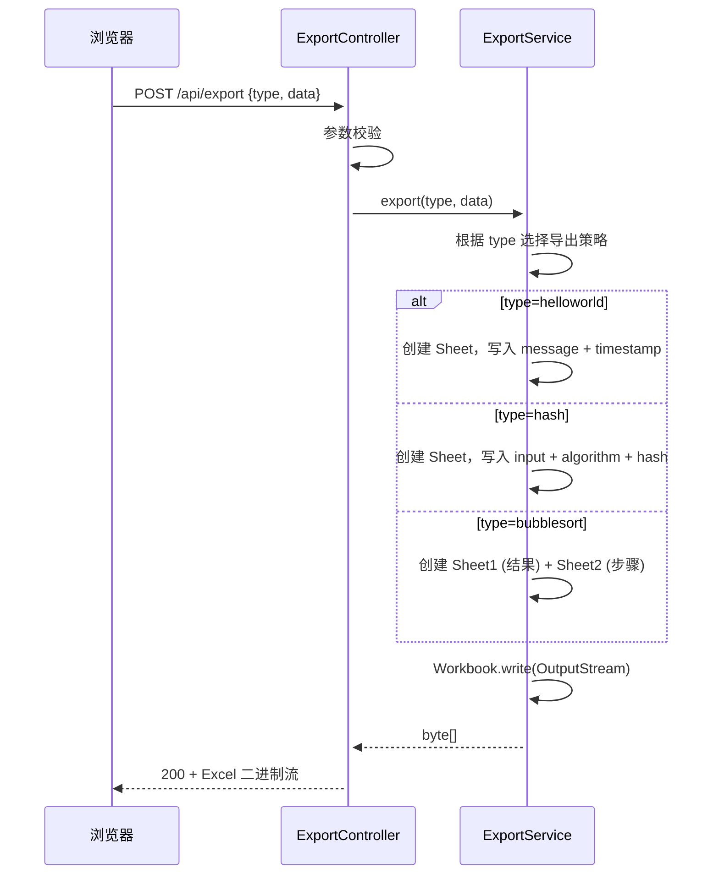

**业务规则：**

| 规则编号 | 规则描述 | 校验时机 | 不满足时的处理 |
|----------|----------|----------|--------------|
| R07 | type 必须为 helloworld / hash / bubblesort 之一 | 请求时 | 返回 400，提示"不支持的导出类型" |
| R08 | data 结构必须与对应接口响应一致 | 生成时 | 返回 500，Excel 生成失败 |

**异常场景：**

| 异常场景 | 处理方式 |
|----------|----------|
| 导出类型不合法 | 返回 400 + 错误消息 |
| POI 生成异常 | 返回 500，内部异常日志 |

**并发控制：** 无并发风险，原因：导出为纯计算操作，基于请求数据生成，不涉及共享状态

---

### 5.3 埋点报表模块（testDj）

#### 5.3.1 表结构设计

##### 5.3.1.1 metrics_record（埋点调用记录表）

| 字段名 | 数据类型 | 约束 | 默认值 | 说明 |
|--------|----------|------|--------|------|
| id | bigint | PK, 自增 | - | 系统自增主键 |
| caller_name | varchar(100) | NOT NULL | - | 调用人姓名 |
| caller_type | varchar(50) | NOT NULL | - | 人员类型：正式员工/外包/实习生 |
| caller_level | varchar(50) | NOT NULL | - | 人员层级：P6/P7/P8/P9 |
| caller_dept | varchar(100) | NOT NULL | - | 人员部门：技术部/产品部/运营部 |
| api_path | varchar(200) | NOT NULL | - | 接口路径 |
| api_method | varchar(10) | NOT NULL | - | HTTP 方法 |
| call_time | datetime | NOT NULL | CURRENT_TIMESTAMP | 调用时间 |
| client_ip | varchar(50) | NULL | - | 客户端 IP |
| user_agent | varchar(500) | NULL | - | User-Agent |
| gmt_create | datetime | NOT NULL | CURRENT_TIMESTAMP | 创建时间 |

**索引：**
- PK: `pk_metrics_record` (id)
- IDX: `idx_metrics_record_call_time` (call_time)
- IDX: `idx_metrics_record_caller_type` (caller_type)
- IDX: `idx_metrics_record_caller_level` (caller_level)
- IDX: `idx_metrics_record_caller_dept` (caller_dept)
- IDX: `idx_metrics_record_api_path` (api_path)

##### 5.3.1.2 枚举与常量定义

| 枚举名称 | 取值 | 含义 | 关联字段 |
|----------|------|------|----------|
| CallerType | 正式员工 / 外包 / 实习生 | 人员类型分类 | metrics_record.caller_type |
| CallerLevel | P6 / P7 / P8 / P9 | 人员层级 | metrics_record.caller_level |
| Dimension | personType / level / department | 报表查询维度 | 查询参数 dimension |

#### 5.3.2 接口详细设计

##### W05 埋点报表查询

- **URI**: GET /api/metrics
- **描述**: 按指定维度聚合查询调用次数，返回结构化数据供前端图表渲染
- **入参**:

| 参数名称 | 类型 | 是否必填 | 描述 |
|----------|------|----------|------|
| dimension | String | 是 | 聚合维度，枚举: personType / level / department |
| startDate | String | 否 | 起始日期 (yyyy-MM-dd) |
| endDate | String | 否 | 结束日期 (yyyy-MM-dd) |

- **出参**:

| 参数名称 | 类型 | 描述 |
|----------|------|------|
| code | int | 0=成功 |
| message | String | "success" |
| data.dimension | String | 查询维度 |
| data.items | List\<MetricsItem\> | 聚合结果列表 |
| data.items[].label | String | 维度标签（如"正式员工"） |
| data.items[].count | int | 该维度总调用次数 |
| data.items[].subItems | List\<MetricsItem\> | 按接口路径细分的调用次数 |
| data.totalCalls | int | 总调用次数 |

- **错误码**:

| 错误码 | 说明 |
|--------|------|
| 400 | 不支持的维度参数 |

- **业务规则**: 维度映射 → personType → caller_type, level → caller_level, department → caller_dept

- **请求示例**: `GET /api/metrics?dimension=personType`

- **响应示例**:
```json
{
  "code": 0,
  "message": "success",
  "data": {
    "dimension": "personType",
    "items": [
      {
        "label": "正式员工",
        "count": 150,
        "subItems": [
          {"label": "/api/helloworld", "count": 50},
          {"label": "/api/hash", "count": 60},
          {"label": "/api/bubblesort", "count": 40}
        ]
      },
      {
        "label": "外包人员",
        "count": 80,
        "subItems": [
          {"label": "/api/helloworld", "count": 30},
          {"label": "/api/hash", "count": 30},
          {"label": "/api/bubblesort", "count": 20}
        ]
      }
    ],
    "totalCalls": 230
  }
}
```

#### 5.3.3 子功能详细设计

##### 5.3.3.1 埋点拦截器自动记录（F05）

- 处理时序图

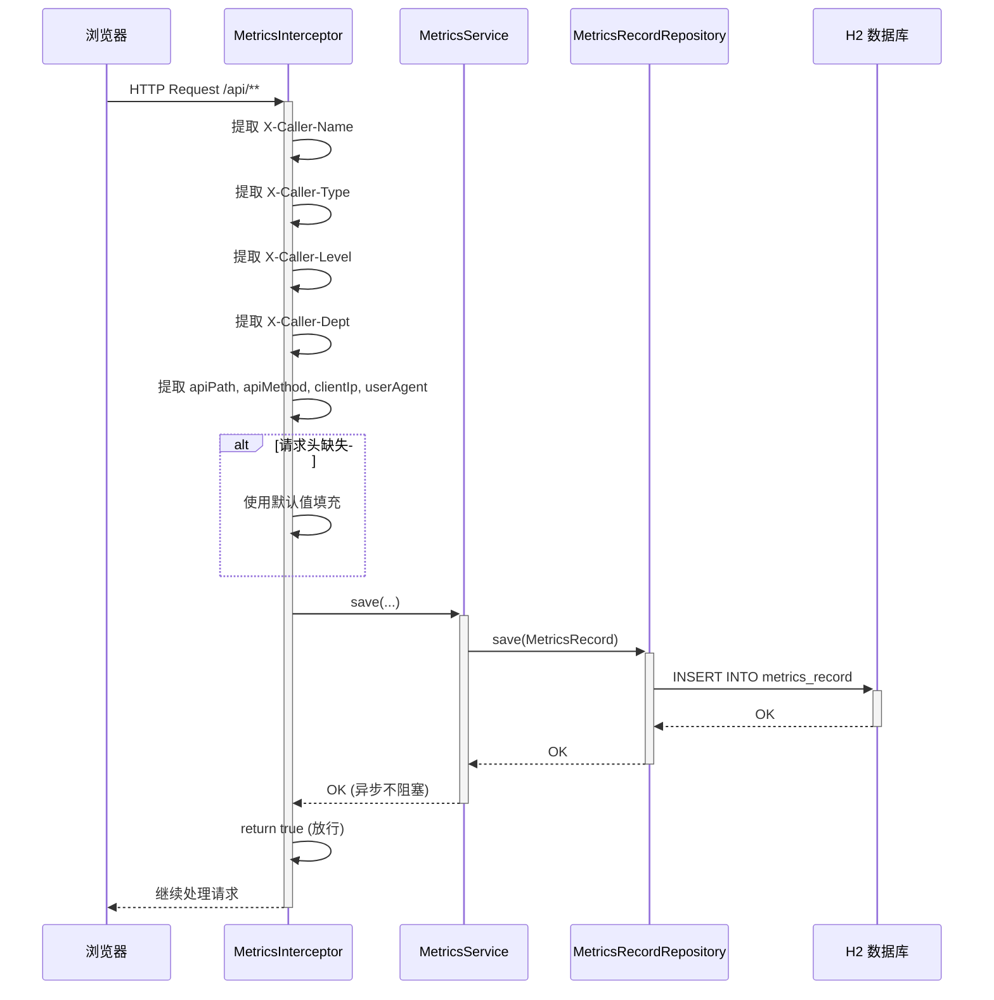

**业务规则：**

| 规则编号 | 规则描述 | 校验时机 | 不满足时的处理 |
|----------|----------|----------|--------------|
| R09 | 拦截所有 `/api/**` 请求 | 每次请求 | - |
| R10 | 请求头 X-Caller-Name 缺失时使用 "anonymous" | 提取时 | 使用默认值 |
| R11 | 请求头 X-Caller-Type 缺失时使用 "未知" | 提取时 | 使用默认值 |
| R12 | 请求头 X-Caller-Level 缺失时使用 "未知" | 提取时 | 使用默认值 |
| R13 | 请求头 X-Caller-Dept 缺失时使用 "未知" | 提取时 | 使用默认值 |
| R14 | 埋点写入异步执行，不阻塞业务响应 | 写入时 | 写入失败仅记日志，不影响请求 |

**异常场景：**

| 异常场景 | 处理方式 |
|----------|----------|
| 数据库写入失败 | 异步线程内捕获异常，仅记日志，不抛出；业务请求正常响应 |
| 请求头全部缺失 | 使用默认值：anonymous / 未知 / 未知 / 未知 |

**并发控制：**
- 并发场景：高并发下多个请求同时写入 metrics_record 表
- 控制策略：JPA 自增主键天然支持并发写入，无额外并发控制；异步写入通过独立线程池隔离，不阻塞业务线程

##### 5.3.3.2 埋点报表查询（F06）

- 处理时序图

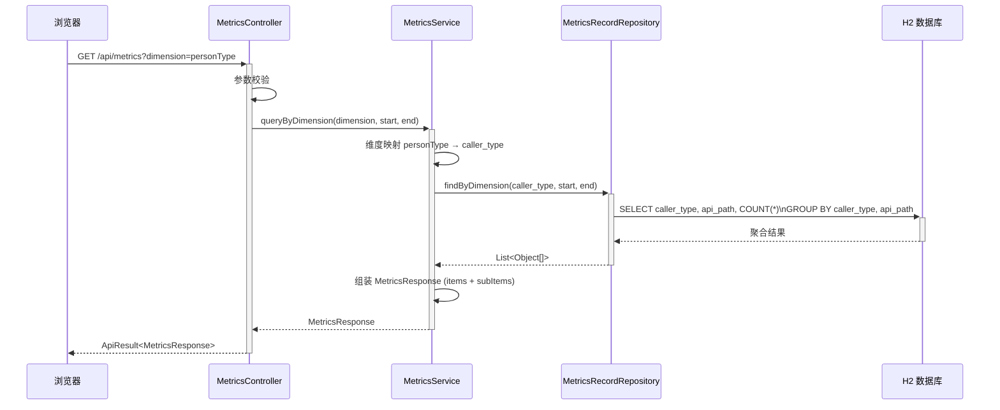

**业务规则：**

| 规则编号 | 规则描述 | 校验时机 | 不满足时的处理 |
|----------|----------|----------|--------------|
| R15 | dimension 必须为 personType / level / department 之一 | 请求时 | 返回 400，提示"不支持的维度" |
| R16 | startDate / endDate 为可选参数，不传则查询全部数据 | 查询时 | - |
| R17 | 聚合查询按维度字段 + api_path 双重 GROUP BY | 查询时 | - |

**异常场景：**

| 异常场景 | 处理方式 |
|----------|----------|
| 维度参数非法 | 返回 400 + 错误消息 |
| 数据库查询异常 | 返回 500 |

**并发控制：** 无并发风险，原因：该接口为纯读操作，不涉及数据写入

---

### 5.4 Dashboard 页面模块（testDJnew）

#### 5.4.1 表结构设计

本项不适用，原因：前端模块不涉及数据库表。

#### 5.4.2 接口详细设计

前端模块通过 API Client 调用后端接口，不直接暴露 HTTP 接口。API Client 封装如下：

| 方法 | 对应后端接口 | 说明 |
|------|------------|------|
| fetchHelloWorld() | GET /api/helloworld | 获取 HelloWorld 结果 |
| fetchHash(input, algorithm) | POST /api/hash | 计算哈希值 |
| fetchBubbleSort(array, order) | POST /api/bubblesort | 执行冒泡排序 |
| exportExcel(type, data) | POST /api/export | 导出 Excel（返回 Blob） |
| fetchMetrics(dimension, startDate?, endDate?) | GET /api/metrics | 查询埋点报表 |

所有请求自动注入 `X-Caller-*` 请求头（demo-user / 正式员工 / P7 / 技术部），用于埋点记录。

#### 5.4.3 子功能详细设计

##### 5.4.3.1 三 Tab 展示页面（F07）

- 组件交互时序图

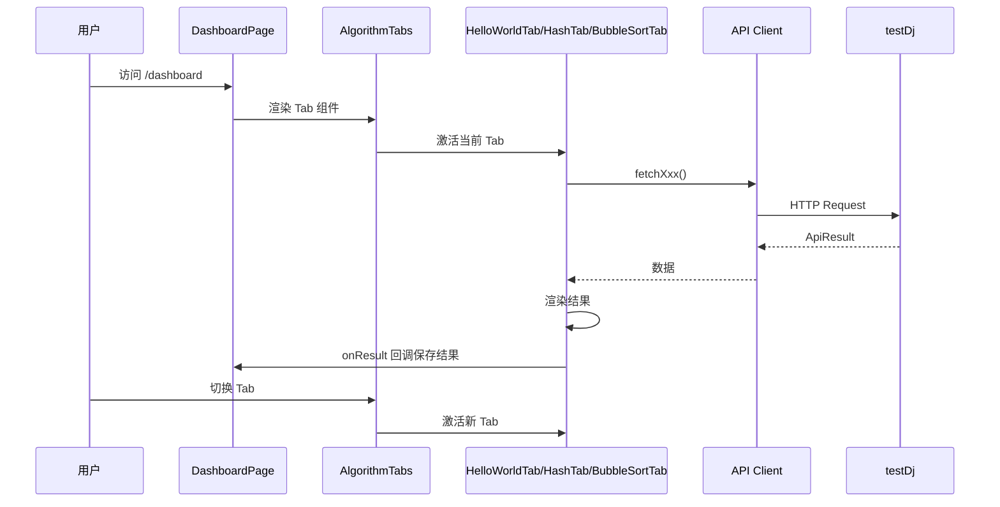

**组件树：**
```
DashboardPage
├── AlgorithmTabs
│   ├── HelloWorldTab        (自动加载，仅展示)
│   ├── HashTab              (输入框 + 算法选择 + 执行按钮)
│   └── BubbleSortTab        (数组输入 + 排序方向 + 执行按钮)
├── ExportButton             (导出当前 Tab 结果)
└── MetricsPanel
    ├── DimensionSelector    (维度下拉)
    ├── ChartTypeSelector    (图表类型切换)
    └── MetricsChart          (ECharts 实例)
```

**业务规则：**

| 规则编号 | 规则描述 | 校验时机 | 不满足时的处理 |
|----------|----------|----------|--------------|
| R18 | HelloWorld Tab 进入即自动加载，无需用户操作 | 组件挂载 | 加载失败显示 Alert |
| R19 | Hash Tab 和 BubbleSort Tab 需用户点击"执行"按钮 | 用户交互 | 输入校验失败显示 Alert |
| R20 | BubbleSort 输入必须是逗号分隔的数字 | 执行前 | 前端校验，提示"请输入有效的数字数组" |
| R21 | 导出按钮仅在当前 Tab 有结果时显示 | 渲染时 | 无结果时不渲染导出按钮 |

**异常场景：**

| 异常场景 | 处理方式 |
|----------|----------|
| API 调用失败 | 显示 Ant Design Alert 错误提示 |
| 网络超时 | 显示错误信息，用户可重试 |
| 后端返回 code != 0 | 显示后端返回的 message |

**并发控制：** 无并发风险，原因：前端为单用户操作，状态通过 React useState 管理

##### 5.4.3.2 导出按钮（F08）

- 交互时序图

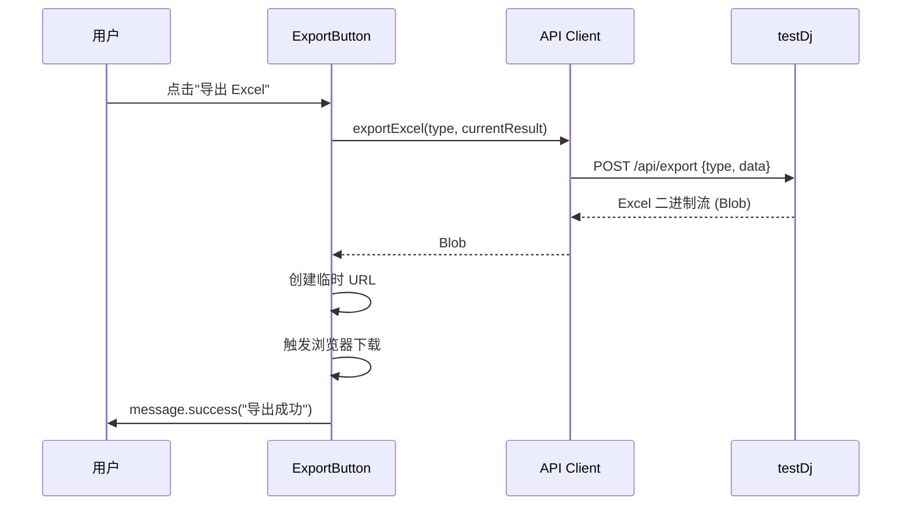

**业务规则：**

| 规则编号 | 规则描述 | 校验时机 | 不满足时的处理 |
|----------|----------|----------|--------------|
| R22 | 导出文件名格式: export-{type}-{timestamp}.xlsx | 下载时 | - |

**异常场景：**

| 异常场景 | 处理方式 |
|----------|----------|
| 导出请求失败 | message.error("导出失败: " + error.message) |

##### 5.4.3.3 可视化报表（F09）

- 交互时序图

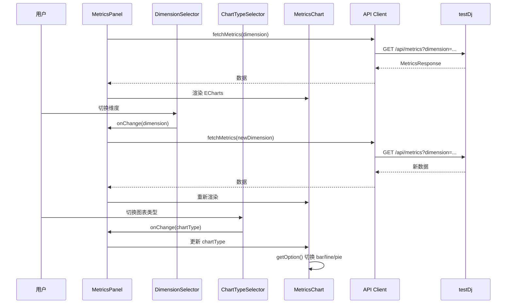

**业务规则：**

| 规则编号 | 规则描述 | 校验时机 | 不满足时的处理 |
|----------|----------|----------|--------------|
| R23 | 维度切换时自动重新请求后端数据 | 维度变更 | 加载中显示 Spin |
| R24 | 图表类型切换仅改变前端渲染，不重新请求 | 图表类型变更 | - |
| R25 | 柱状图：X 轴为维度标签，Y 轴为调用次数 | 渲染 | - |
| R26 | 折线图：smooth 曲线 + 半透明面积填充 | 渲染 | - |
| R27 | 饼图：环形图 (radius: 40%-70%)，显示百分比 | 渲染 | - |

**异常场景：**

| 异常场景 | 处理方式 |
|----------|----------|
| 报表数据加载失败 | 显示 Alert 错误提示 |
| 数据为空 | 图表显示"暂无数据" |

**并发控制：** 无并发风险，原因：前端状态管理为单线程 React 模型

---

### 5.5 跨模块时序图

#### 完整调用链路（用户操作 → 埋点记录 → 报表展示）

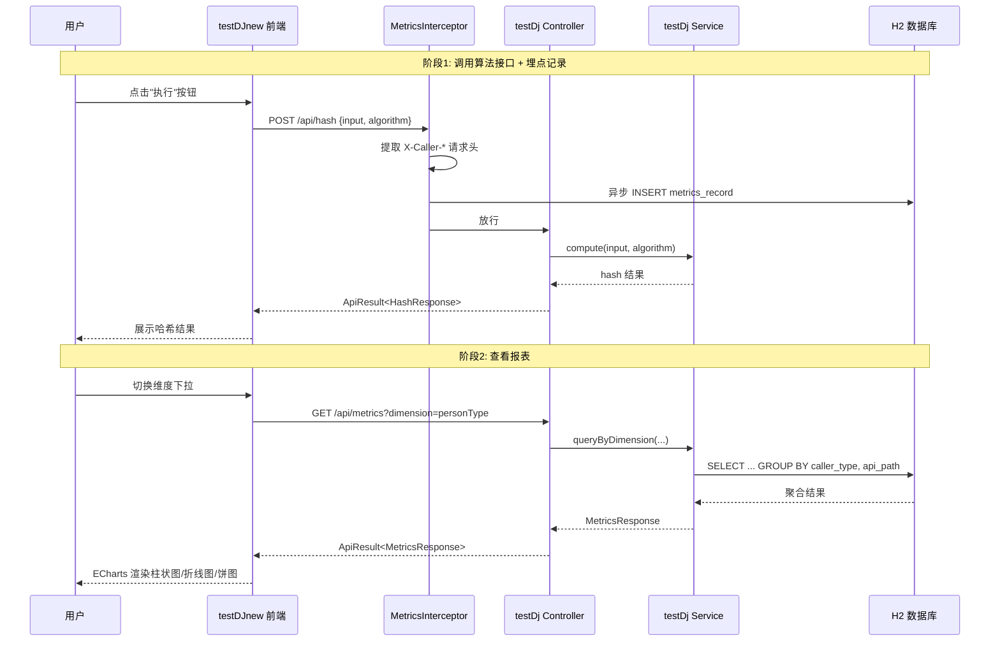

---

## 6. 非功能性需求设计

### 6.1 高可用性

- **降级策略**：埋点写入失败不影响业务接口正常响应（异步写入，异常仅记日志）
- **容错切换**：H2 内存数据库为单点，当前为演示环境，生产需迁移至 MySQL/PostgreSQL 主从架构
- **本项假设**：开发/演示环境，单实例部署，不涉及多副本高可用

### 6.2 可扩展性

- **水平扩展**：后端服务无状态设计，可水平扩容多实例；H2 需替换为独立数据库后支持多实例
- **垂直扩展**：Spring Boot 应用内存占用低，可在单机增加资源
- **插件式依赖**：数据库层通过 JPA 抽象，可切换 H2 → MySQL/PostgreSQL；前端图表库 ECharts 可替换为其他图表库
- **前端扩展**：Tab 组件通过配置化 items 数组驱动，新增 Tab 只需添加一个 item 配置

### 6.3 稳定性/可靠性

- **边界场景**：空数组排序（比较次数 0）、空字符串哈希（返回正确哈希值）、单元素数组（直接返回）
- **输入校验**：所有接口入参均有校验，非法参数返回 400 而非 500
- **埋点兜底**：请求头缺失时使用默认值，不抛异常
- **冒泡排序限制**：最大数组长度 100，防止内存溢出

### 6.4 安全性设计

#### 6.4.1 账户系统方案

本项不适用，原因：当前为演示系统，不涉及用户登录/认证/注册功能。调用人信息通过请求头 `X-Caller-*` 注入，实际部署时需配合网关或 SSO 认证。

#### 6.4.2 授权&访问控制

##### 6.4.2.1 是否实现水平权限检查

本项不适用，原因：当前系统无多租户概念，所有数据为公共数据，不涉及水平权限隔离。

##### 6.4.2.2 是否实现垂直权限检查

本项不适用，原因：当前系统无角色/权限体系，所有接口为公开访问。

##### 6.4.2.3 是否检查登录态

本项不适用，原因：当前系统无登录态，所有接口无认证拦截。

#### 6.4.3 数据防护方案

##### 6.4.3.1 是否对敏感数据加密存储

本项不适用，原因：埋点数据中不包含身份证、银行卡、密码等敏感信息。调用人姓名/部门等为演示数据，不涉及真实用户隐私。

##### 6.4.3.2 是否对敏感数据展示进行脱敏

本项不适用，原因：前端展示的调用人信息为演示数据，不涉及真实用户隐私信息。

### 6.5 监控/统计/日志/告警

- **服务埋点**：MetricsInterceptor 自动记录所有 `/api/**` 调用的调用人、接口路径、时间、耗时（待扩展）
- **日志**：Spring Boot 默认日志输出，埋点写入异常时记录 ERROR 日志
- **报表可视化**：前端 ECharts 实时展示调用统计，可按维度切换
- **待扩展**：生产环境可接入 Prometheus + Grafana 监控体系，扩展 interceptor 记录接口耗时

---

## 7. 变更三板斧

### 7.1 可监控

- **埋点监控**：MetricsInterceptor 拦截所有 `/api/**` 请求，自动记录调用人、接口路径、HTTP 方法、调用时间、客户端 IP、User-Agent
- **报表查询**：GET /api/metrics 接口支持按维度（personType/level/department）和时间范围聚合查询
- **前端可视化**：ECharts 实时渲染调用统计，支持折线图、饼图、柱状图三种展示形式
- **监控指标**：总调用次数、按维度分布、按接口分布
- **待扩展**：接口响应耗时（P95/P99）、错误率监控

### 7.2 可灰度

本项不适用，原因：当前系统为演示/开发环境，单实例部署，不涉及灰度发布。如后续需要灰度，建议方案：
- 按租户尾号灰度引流（需先引入多租户体系）
- 前端通过 Feature Flag 控制新功能可见性

### 7.3 可应急

- **开关控制**：埋点拦截器可通过配置 `metrics.enabled=true/false` 一键关闭（推荐在 application.yml 中添加开关）
- **回滚兜底**：后端接口为纯新增，无旧逻辑需要回滚；前端页面为新增路由，回滚只需移除路由配置
- **上下游兼容性**：
  - 上游（前端）：所有接口为新增，回滚时前端移除 Dashboard 页面路由即可
  - 下游（数据库）：H2 内存数据库，回滚无数据迁移问题
- **应急方案优先级**：关闭埋点开关 > 移除前端路由 > 回滚部署包

---

## 8. 方案检查

### 检查清单

| 检查项 | 结果 | 说明 |
|------|------|------|
| 模块划分合理性检查 | ✅ 通过 | 算法模块、导出模块、埋点报表模块单一职责，无循环依赖 |
| 依赖关系合理性 | ✅ 通过 | 前端 → 后端单向依赖；埋点模块异步写入不阻塞业务 |
| 单点问题检查（部署层面） | ⚠️ 不适用 | 演示环境单实例；生产需扩展 |
| 表模型设计范式检查 | ✅ 通过 | 满足 3NF，单表无冗余 |
| 隐私安全检查 | ✅ 通过 | 无敏感信息存储 |
| 兼容性检查（接口） | ✅ 通过 | 全部为新增接口，无兼容性问题 |
| 兼容性检查（表） | ✅ 通过 | 新增表，无变更兼容性问题 |
| 数据迁移检查 | ✅ 通过 | 新增表，JPA ddl-auto:update 自动建表 |
| 一致性检查（功能点） | ✅ 通过 | F01-F09 全部在 Step 5 中有对应设计 |
| 一致性检查（表） | ✅ 通过 | MetricsRecord 实体在 Step 3 和 Step 5 中均有完整定义 |
| 一致性检查（接口） | ✅ 通过 | W01-W05 在 Step 4 和 Step 5 中均有详细定义 |
| 一致性检查（枚举） | ✅ 通过 | CallerType/CallerLevel/Dimension 枚举定义与表字段一致 |
| 状态机完整性检查 | ✅ 通过 | 无状态字段实体，不适用 |
| 并发风险检查 | ✅ 通过 | 埋点写入通过异步+自增主键处理；算法服务为纯函数无状态 |
| 单点问题检查（定时任务层面） | ✅ 通过 | 无定时任务 |
| 非功能性设计可行性检查 | ✅ 通过 | 降级策略可行，扩展方案明确 |
| 变更三板斧设计可行性检查（可监控） | ✅ 通过 | 埋点拦截器 + 报表接口 + 前端可视化 |
| 变更三板斧设计可行性检查（可灰度） | ✅ 通过 | 不适用，已在 Step 7 中说明原因和后续方案 |
| 变更三板斧设计可行性检查（可应急） | ✅ 通过 | 开关关闭 + 路由移除 + 回滚方案清晰 |

---

> **文档状态**: ✅ 已完成
> **下一步**: 进入实施阶段，按实施计划（`20260818-分别写三个接口helloworld、哈希.md`）逐任务开发