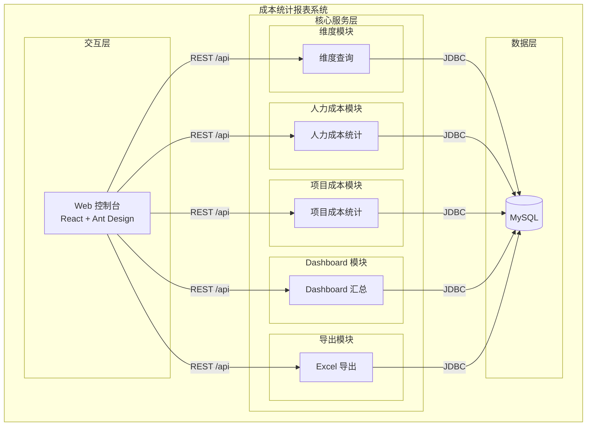
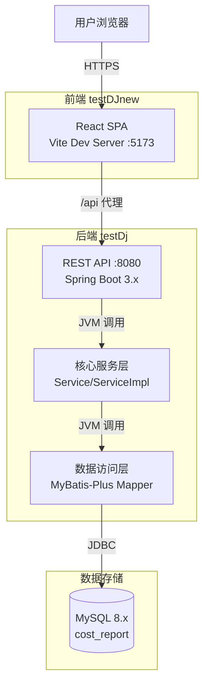
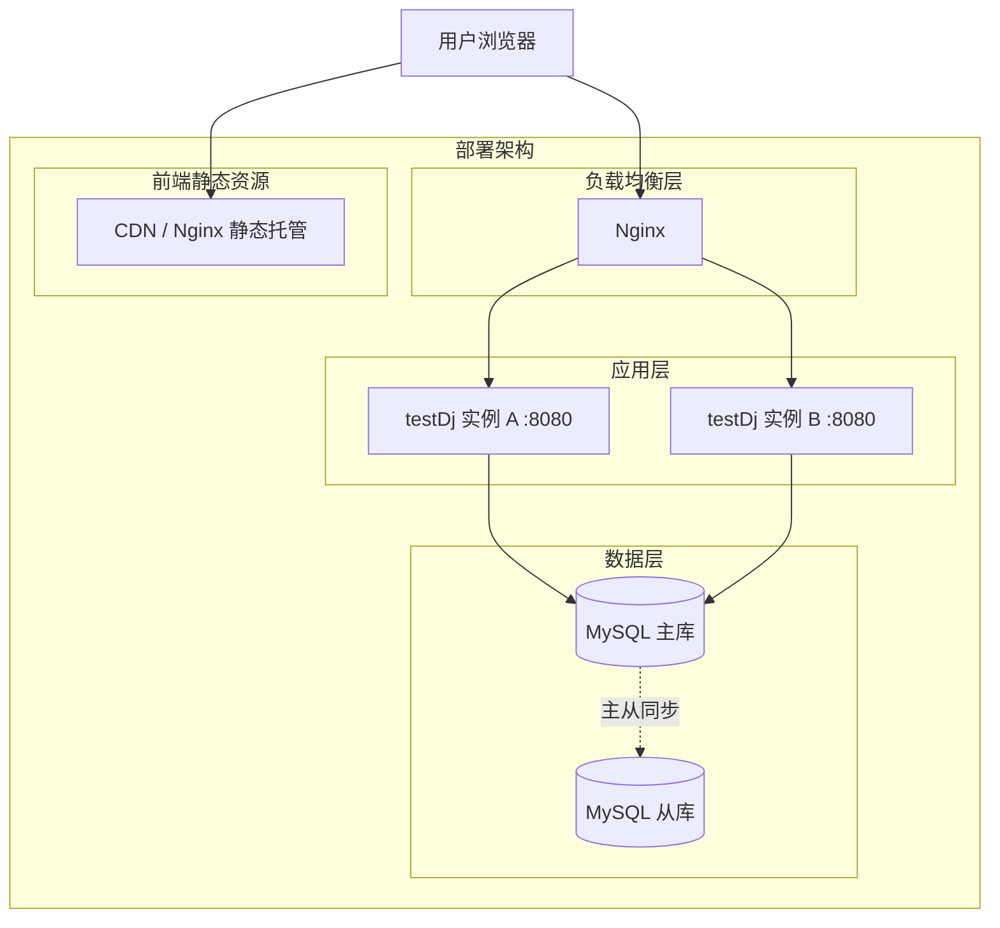
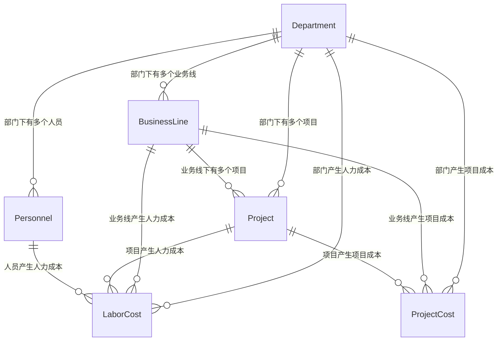
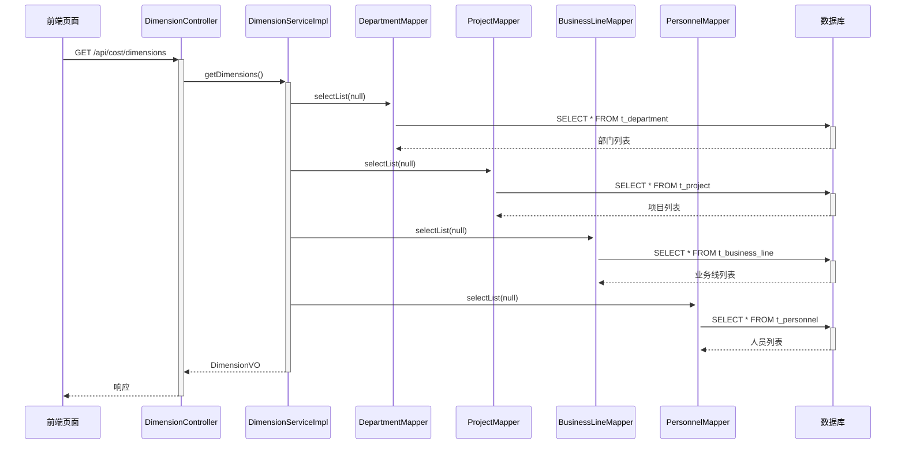
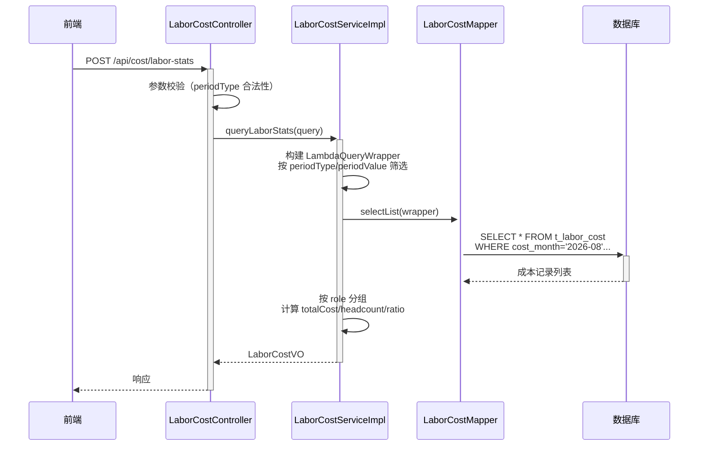
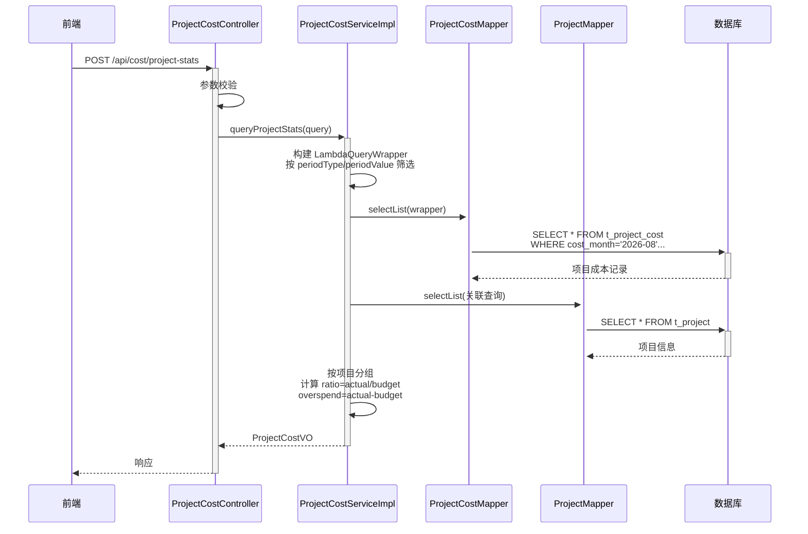
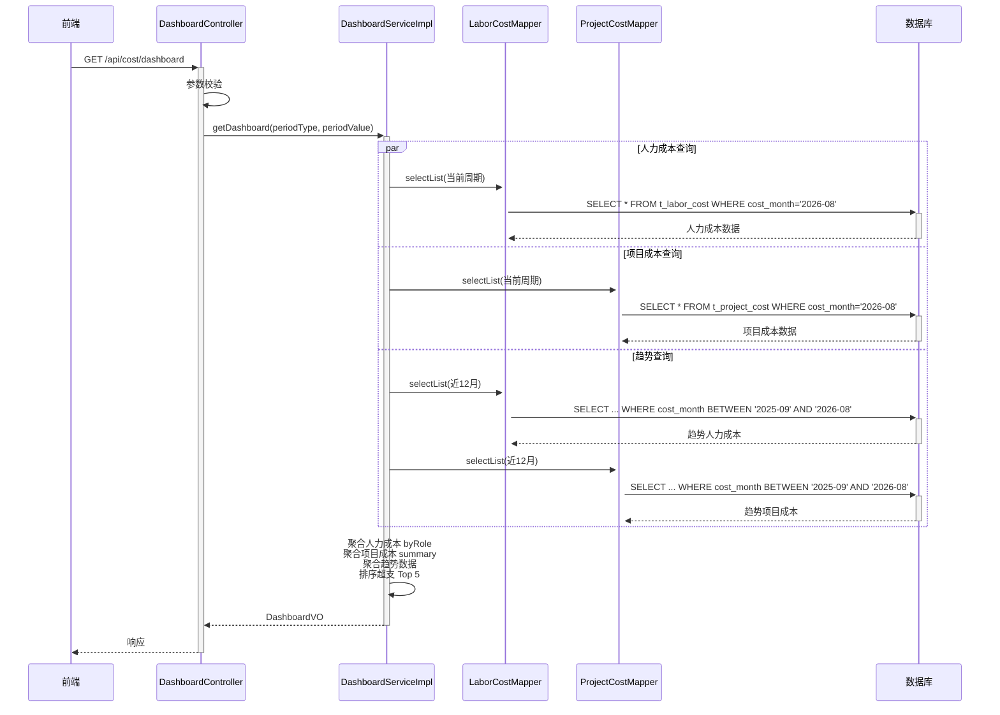
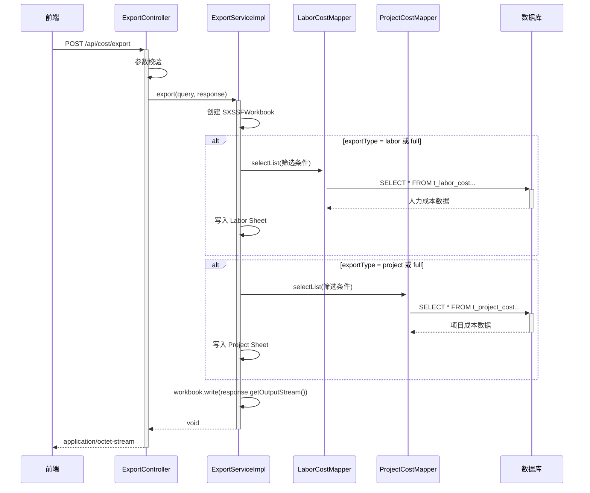
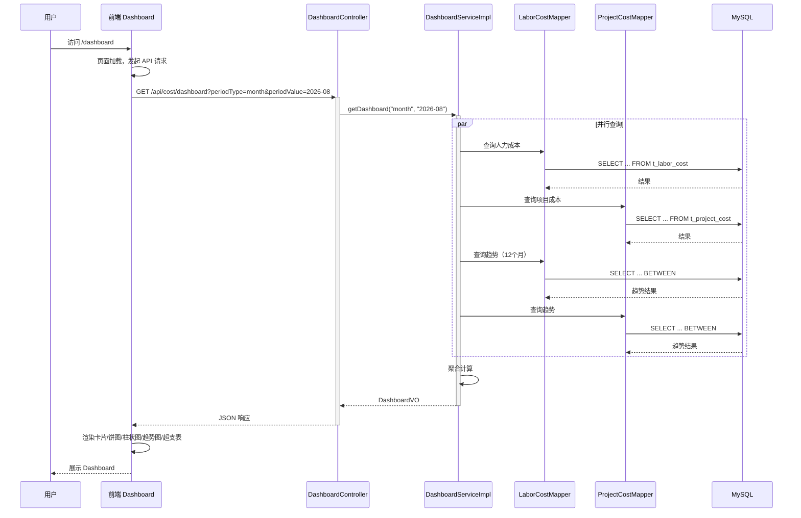

> **文档元信息**
>
> | 项目 | 内容 |
> |------|------|
> | 文档版本 | v1.0 |
> | 作者 | DTCoder |
> | 创建日期 | 2026-08-18 |
> | 需求来源 | .agents/specs/20260818-开发一个成本统计报表 用于统计企业各项成.md |
> | 评审状态 | 待评审 |

# 成本统计报表系统 系分设计

## 1. 需求与范围

### 1.1 背景与目标

构建企业成本统计报表系统，为企业管理层和财务/PMO 人员提供多维度的成本支出可视化分析能力。系统需支持按部门、项目、业务线、人员、时间（月份/季度/年度）等维度统计人力成本（开发/测试/产品/运维）和项目成本（预算/实际消耗/预算占比/预计超支），通过 Dashboard 概览和报表详情页呈现，并支持报表导出为 Excel。

### 1.2 核心功能

- 维度筛选：部门、项目、业务线、人员、角色、时间周期（月/季/年）
- 人力成本统计：按角色（开发/测试/产品/运维）汇总成本、人均成本、人数
- 项目成本统计：预算、实际消耗、预算占比、预计超支金额
- Dashboard 概览：汇总卡片 + 角色分布饼图 + 预算 vs 实际柱状图 + 趋势折线图 + 超支项目 Top N
- 报表导出：Excel 格式导出，支持人力/项目/全量三种导出类型

### 1.3 约束与非功能要求

- 前后端分离：Spring Boot 3.x + React 18 + Ant Design 5 + ECharts
- 统一响应格式：`{ code, data, message }`
- 分页参数：`{ pageNum, pageSize }`，响应含 `{ records, total, pageNum, pageSize }`
- 日期格式：`yyyy-MM-dd`，月份 `yyyy-MM`，季度 `yyyy-Qn`，年度 `yyyy`
- 金额单位：元，保留两位小数
- 前端路由：`/dashboard`、`/cost-report`
- 导出：`application/octet-stream`，前端 Blob 下载

### 1.4 排除范围

- 不涉及成本数据的录入/编辑（假设数据已通过其他系统或初始化脚本导入）
- 不涉及用户权限/角色管理（假设复用现有认证体系）
- 不涉及移动端适配
- 不涉及实时数据推送（WebSocket）

### 1.5 需求功能清单与优先级

| 编号 | 功能点 | 优先级 | 原始描述 | 备注 |
|------|--------|--------|----------|------|
| F01 | 维度查询接口（部门/项目/业务线/人员下拉数据） | P0 | 前端新建成本统计分析页面，按照不同维度展示 | 所有统计页面的前置数据 |
| F02 | 人力成本统计（按角色：开发/测试/产品/运维） | P0 | 人力成本（开发、测试、产品、运维） | 核心统计能力 |
| F03 | 项目成本统计（预算/实际消耗/预算占比/预计超支） | P0 | 项目成本（项目预算、实际消耗、预算占比、预计超支金额） | 核心统计能力 |
| F04 | Dashboard 汇总概览 | P0 | Dashboard | 含汇总卡片、图表 |
| F05 | 按时间维度筛选（月份/季度/年度） | P0 | 月份、季度、年度 | 所有统计的基础维度 |
| F06 | 按部门维度筛选 | P0 | 部门 | 多维筛选 |
| F07 | 按项目维度筛选 | P0 | 项目 | 多维筛选 |
| F08 | 按业务线维度筛选 | P0 | 业务线 | 多维筛选 |
| F09 | 按人员维度筛选 | P0 | 人员 | 多维筛选 |
| F10 | 报表导出（Excel） | P1 | 支持报表导出 | 导出功能 |
| F11 | 成本趋势分析 | P1 | Dashboard 趋势图 | Dashboard 子功能 |
| F12 | 超支项目 Top N | P1 | 预计超支金额 | Dashboard 子功能 |

### 1.6 假设与待确认项

| 编号 | 假设/待确认内容 | 当前假设 | 确认状态 |
|------|-----------------|----------|----------|
| A01 | 成本数据来源 | 假设通过初始化 SQL 脚本预置示例数据，生产环境由外部系统同步 | 待确认 |
| A02 | 用户认证体系 | 假设复用现有系统的认证拦截器，系分不展开设计 | 待确认 |
| A03 | 租户隔离 | 假设单租户场景，暂不引入 tenant_id；若需多租户后续扩展 | 待确认 |
| A04 | 导出数据量上限 | 假设单次导出不超过 10 万行，超出时后端流式写入 SXSSFWorkbook | 待确认 |
| A05 | 趋势数据时间范围 | 假设 Dashboard 趋势图展示最近 12 个月/4 季度/3 年数据 | 待确认 |
| A06 | 前端部署方式 | 假设 Vite 开发代理 `/api` → `localhost:8080`，生产 Nginx 反代 | 待确认 |

---

## 2. 架构与模块

### 2.1 功能架构



- **交互层**：React 18 + Ant Design 5 + ECharts，提供 Dashboard 和成本报表两个页面，通过 axios 调用后端 REST API
- **核心服务层**：Spring Boot 3.x 单体应用，Controller → Service → Mapper 分层，五个模块职责单一
- **数据层**：MySQL 8.x，6 张业务表，InnoDB 引擎

**模块清单**

| 模块 | 职责 | 依赖 |
|------|------|------|
| 维度模块 | 提供部门/项目/业务线/人员下拉数据 | DepartmentMapper, ProjectMapper, BusinessLineMapper, PersonnelMapper |
| 人力成本模块 | 按维度统计人力成本，按角色分组汇总 | LaborCostMapper |
| 项目成本模块 | 按维度统计项目成本（预算/实际/占比/超支） | ProjectCostMapper, ProjectMapper |
| Dashboard 模块 | 聚合人力/项目成本概览 + 趋势 + 超支 Top N | LaborCostMapper, ProjectCostMapper |
| 导出模块 | 生成 Excel 报表文件（Apache POI） | LaborCostMapper, ProjectCostMapper |

### 2.2 应用集成架构



**集成关系说明：**

| 调用方 | 被调用方 | 协议 | 接口类型 | 说明 |
|--------|----------|------|----------|------|
| 用户浏览器 | 前端 React SPA | HTTPS | Web 页面 | Dashboard 与成本报表页面 |
| 前端 React SPA | 后端 REST API | HTTPS | oneapi REST | Vite 代理 /api → localhost:8080 |
| 后端 Controller | Service | JVM | Java 方法调用 | 同进程内调用 |
| Service | Mapper | JVM | MyBatis-Plus | 数据库访问 |
| Mapper | MySQL | JDBC | SQL | 数据持久化 |

### 2.3 部署架构



**部署说明：**
- **负载均衡层**：Nginx 反代，分发到后端多实例；同时托管前端静态资源或转发至 CDN
- **应用层**：Spring Boot 单体应用双实例部署，无状态，支持水平扩展
- **数据层**：MySQL 主从架构，读写分离（假设：读多写少场景，成本数据以批量导入为主）
- **前端**：Vite 构建产物部署至 Nginx 或 CDN，通过 Nginx 反代 `/api` 到后端

---

## 3. 数据模型与存储

### 3.1 实体清单

| 实体名称 | 实体说明 | 所属模块 | 与其他实体的关系 |
|----------|----------|----------|-----------------|
| Department | 部门 | 维度模块 | 一对多 BusinessLine、Project、Personnel、LaborCost、ProjectCost |
| BusinessLine | 业务线 | 维度模块 | 多对一 Department；一对多 Project、LaborCost、ProjectCost |
| Project | 项目 | 维度模块 | 多对一 Department、BusinessLine；一对多 LaborCost、ProjectCost |
| Personnel | 人员 | 维度模块 | 多对一 Department；一对多 LaborCost |
| LaborCost | 人力成本记录 | 人力成本模块 | 多对一 Personnel、Project、BusinessLine、Department |
| ProjectCost | 项目成本记录 | 项目成本模块 | 多对一 Project、Department、BusinessLine |

### 3.2 实体关系图



### 3.3 模型说明

- 所有实体均为业务实体，不涉及缓存或 MQ
- 租户隔离：当前假设单租户场景，表结构中暂不引入 tenant_id；若后续需多租户，在 6 张表中统一添加 tenant_id 字段即可
- 时间维度冗余设计：LaborCost 和 ProjectCost 中同时存储 cost_month（yyyy-MM）、cost_quarter（yyyy-Qn）、cost_year（yyyy），以空间换时间，避免查询时计算季度/年度归属
- 金额字段统一使用 DECIMAL(12,2) 或 DECIMAL(15,2)，保证精度

### 3.4 数据量预估

| 表 | 预估年增量 | 说明 |
|----|-----------|------|
| t_department | < 100 | 维度表，增长缓慢 |
| t_business_line | < 500 | 维度表，增长缓慢 |
| t_project | < 1000 | 维度表 |
| t_personnel | < 5000 | 维度表 |
| t_labor_cost | ~60 万行 | 5000 人 × 12 月 |
| t_project_cost | ~1.2 万行 | 1000 项目 × 12 月 |

单表年增量在 500 万行以内，无需分表。

---

## 4. 接口设计

### 4.1 oneapi（Web 控制台接口）

| 编号 | 接口名称 | 方法 | 路径 | 模块 |
|------|----------|------|------|------|
| W01 | 维度查询 | GET | /api/cost/dimensions | 维度模块 |
| W02 | 人力成本统计 | POST | /api/cost/labor-stats | 人力成本模块 |
| W03 | 项目成本统计 | POST | /api/cost/project-stats | 项目成本模块 |
| W04 | Dashboard 汇总 | GET | /api/cost/dashboard | Dashboard 模块 |
| W05 | 报表导出 | POST | /api/cost/export | 导出模块 |

### 4.2 OpenAPI（对外接口）

本项不适用，原因：当前需求仅涉及 Web 控制台内部使用，不涉及对外 OpenAPI。

### 4.3 内部接口（Service 层）

| 编号 | 接口名称 | 类 | 方法签名 |
|------|----------|------|----------|
| S01 | 维度查询 | DimensionService | DimensionVO getDimensions() |
| S02 | 人力成本统计 | LaborCostService | LaborCostVO queryLaborStats(LaborCostQueryDTO query) |
| S03 | 项目成本统计 | ProjectCostService | ProjectCostVO queryProjectStats(ProjectCostQueryDTO query) |
| S04 | Dashboard 汇总 | DashboardService | DashboardVO getDashboard(String periodType, String periodValue) |
| S05 | 报表导出 | ExportService | void export(ExportQueryDTO query, HttpServletResponse response) |

### 4.4 集成接口（Integration 层）

本项不适用，原因：当前系统为独立单体应用，不涉及外部系统集成调用。

---

## 5. 功能模块设计

### 5.1 全局约定

**错误码格式**：`COST_{SEQ}`，SEQ 为 3 位数字。

| 模块 | 错误码前缀 | 范围 |
|------|-----------|------|
| 维度模块 | COST_001 ~ COST_009 | 维度查询相关 |
| 人力成本模块 | COST_010 ~ COST_019 | 人力成本统计相关 |
| 项目成本模块 | COST_020 ~ COST_029 | 项目成本统计相关 |
| Dashboard 模块 | COST_030 ~ COST_039 | Dashboard 汇总相关 |
| 导出模块 | COST_040 ~ COST_049 | 导出相关 |
| 通用 | COST_900 ~ COST_999 | 参数校验等 |

**通用出参结构**：`{ code: 200, data: {}, message: "success" }`

**模块映射表**：

| 模块 | Controller | Service | ServiceImpl | Mapper |
|------|-----------|---------|-------------|--------|
| 维度模块 | DimensionController | DimensionService | DimensionServiceImpl | DepartmentMapper, BusinessLineMapper, ProjectMapper, PersonnelMapper |
| 人力成本模块 | LaborCostController | LaborCostService | LaborCostServiceImpl | LaborCostMapper |
| 项目成本模块 | ProjectCostController | ProjectCostService | ProjectCostServiceImpl | ProjectCostMapper |
| Dashboard 模块 | DashboardController | DashboardService | DashboardServiceImpl | LaborCostMapper, ProjectCostMapper |
| 导出模块 | ExportController | ExportService | ExportServiceImpl | LaborCostMapper, ProjectCostMapper |

### 5.2 维度模块

#### 5.2.1 表结构设计

##### t_department（部门表）

| 字段名 | 数据类型 | 约束 | 默认值 | 说明 |
|--------|----------|------|--------|------|
| id | bigint | PK, 自增 | - | 系统自增主键 |
| name | varchar(100) | NOT NULL, UNIQUE | - | 部门名称 |
| gmt_create | datetime | NOT NULL | CURRENT_TIMESTAMP | 创建时间 |
| gmt_modified | datetime | NOT NULL | CURRENT_TIMESTAMP | 修改时间 |

**索引：** UK: `uk_department_name` (name)

##### t_business_line（业务线表）

| 字段名 | 数据类型 | 约束 | 默认值 | 说明 |
|--------|----------|------|--------|------|
| id | bigint | PK, 自增 | - | 系统自增主键 |
| name | varchar(100) | NOT NULL, UNIQUE | - | 业务线名称 |
| department_id | bigint | NOT NULL | - | 所属部门 ID |
| gmt_create | datetime | NOT NULL | CURRENT_TIMESTAMP | 创建时间 |
| gmt_modified | datetime | NOT NULL | CURRENT_TIMESTAMP | 修改时间 |

**索引：** UK: `uk_business_line_name` (name)；IDX: `idx_business_line_dept` (department_id)

##### t_project（项目表）

| 字段名 | 数据类型 | 约束 | 默认值 | 说明 |
|--------|----------|------|--------|------|
| id | bigint | PK, 自增 | - | 系统自增主键 |
| name | varchar(200) | NOT NULL | - | 项目名称 |
| department_id | bigint | NOT NULL | - | 所属部门 ID |
| business_line_id | bigint | NOT NULL | - | 所属业务线 ID |
| budget | decimal(15,2) | NOT NULL | 0 | 项目预算（元） |
| start_date | date | NULL | - | 项目开始日期 |
| end_date | date | NULL | - | 项目结束日期 |
| gmt_create | datetime | NOT NULL | CURRENT_TIMESTAMP | 创建时间 |
| gmt_modified | datetime | NOT NULL | CURRENT_TIMESTAMP | 修改时间 |

**索引：** IDX: `idx_project_dept` (department_id)；IDX: `idx_project_biz_line` (business_line_id)

##### t_personnel（人员表）

| 字段名 | 数据类型 | 约束 | 默认值 | 说明 |
|--------|----------|------|--------|------|
| id | bigint | PK, 自增 | - | 系统自增主键 |
| name | varchar(50) | NOT NULL | - | 人员姓名 |
| department_id | bigint | NOT NULL | - | 所属部门 ID |
| role | varchar(20) | NOT NULL | - | 角色：dev/test/product/ops |
| monthly_salary | decimal(12,2) | NOT NULL | 0 | 月薪（元） |
| gmt_create | datetime | NOT NULL | CURRENT_TIMESTAMP | 创建时间 |
| gmt_modified | datetime | NOT NULL | CURRENT_TIMESTAMP | 修改时间 |

**索引：** IDX: `idx_personnel_dept` (department_id)；IDX: `idx_personnel_role` (role)

##### 枚举与常量定义

| 枚举名称 | 取值 | 含义 | 关联字段 |
|----------|------|------|----------|
| PersonnelRole | dev | 开发 | t_personnel.role, t_labor_cost.role |
| PersonnelRole | test | 测试 | t_personnel.role, t_labor_cost.role |
| PersonnelRole | product | 产品 | t_personnel.role, t_labor_cost.role |
| PersonnelRole | ops | 运维 | t_personnel.role, t_labor_cost.role |
| PeriodType | month | 月度 | 查询参数 periodType |
| PeriodType | quarter | 季度 | 查询参数 periodType |
| PeriodType | year | 年度 | 查询参数 periodType |

#### 5.2.2 接口详细设计

##### W01 维度查询

- **URI**: GET /api/cost/dimensions
- **描述**: 获取所有维度下拉选项数据
- **入参**: 无

- **出参**:

| 参数名称 | 类型 | 描述 |
|----------|------|------|
| code | int | 状态码 |
| message | string | 提示信息 |
| data.departments | string[] | 部门名称列表 |
| data.projects | string[] | 项目名称列表 |
| data.businessLines | string[] | 业务线名称列表 |
| data.personnel | object[] | 人员列表 |
| data.personnel[].id | number | 人员 ID |
| data.personnel[].name | string | 人员姓名 |

- **错误码**:

| 错误码 | 说明 |
|--------|------|
| COST_001 | 维度数据查询异常 |

- **业务规则**: 全量返回所有维度数据，不做分页；前端缓存维度数据

- **请求示例**:
```json
GET /api/cost/dimensions
```

- **响应示例**:
```json
{
  "code": 200,
  "message": "success",
  "data": {
    "departments": ["技术部", "产品部", "运营部"],
    "projects": ["平台升级项目", "数据分析平台", "用户增长项目"],
    "businessLines": ["核心平台", "数据服务", "用户产品", "内容运营"],
    "personnel": [
      { "id": 1, "name": "张三" },
      { "id": 2, "name": "李四" }
    ]
  }
}
```

#### 5.2.3 子功能详细设计

##### 维度查询（F01）

- 处理时序图



**业务规则：**

| 规则编号 | 规则描述 | 校验时机 | 不满足时的处理 |
|----------|----------|----------|--------------|
| R01 | 维度数据全量返回，不做分页 | 始终 | - |

**异常场景：**

| 异常场景 | 处理方式 |
|----------|----------|
| 数据库连接异常 | 返回 COST_001，提示"系统繁忙，请稍后重试" |
| 某维度表为空 | 返回空数组，不影响其他维度 |

**并发控制：** 无并发风险，原因：纯查询接口，不涉及数据写入。

**技术选型方案对比：**

| 方案 | 优点 | 缺点 | 推荐 |
|------|------|------|------|
| 方案A：四次独立查询 | 简单直接，易于理解和维护 | 4 次 DB 往返 | ✅ 推荐 |
| 方案B：UNION ALL 合并查询 | 1 次 DB 往返 | SQL 复杂，结果集解析困难 | - |
| 方案C：前端缓存 + 定时刷新 | 减少请求次数 | 数据可能不及时 | - |

**推荐方案 A**，理由：维度数据量小（< 5000 行），4 次查询开销可忽略；代码简单易维护；后续可加 Redis 缓存优化。

### 5.3 人力成本模块

#### 5.3.1 表结构设计

##### t_labor_cost（人力成本表）

| 字段名 | 数据类型 | 约束 | 默认值 | 说明 |
|--------|----------|------|--------|------|
| id | bigint | PK, 自增 | - | 系统自增主键 |
| personnel_id | bigint | NOT NULL | - | 人员 ID |
| project_id | bigint | NULL | - | 关联项目 ID |
| business_line_id | bigint | NULL | - | 关联业务线 ID |
| department_id | bigint | NOT NULL | - | 关联部门 ID |
| role | varchar(20) | NOT NULL | - | 角色：dev/test/product/ops |
| cost_amount | decimal(12,2) | NOT NULL | - | 成本金额（元） |
| cost_month | varchar(7) | NOT NULL | - | 成本所属月份 yyyy-MM |
| cost_quarter | varchar(7) | NOT NULL | - | 成本所属季度 yyyy-Qn |
| cost_year | varchar(4) | NOT NULL | - | 成本所属年度 yyyy |
| gmt_create | datetime | NOT NULL | CURRENT_TIMESTAMP | 创建时间 |
| gmt_modified | datetime | NOT NULL | CURRENT_TIMESTAMP | 修改时间 |

**索引：**
- IDX: `idx_labor_cost_personnel` (personnel_id)
- IDX: `idx_labor_cost_project` (project_id)
- IDX: `idx_labor_cost_dept` (department_id)
- IDX: `idx_labor_cost_biz_line` (business_line_id)
- IDX: `idx_labor_cost_role` (role)
- IDX: `idx_labor_cost_month` (cost_month)
- IDX: `idx_labor_cost_quarter` (cost_quarter)
- IDX: `idx_labor_cost_year` (cost_year)
- UK: `uk_labor_cost_unique` (personnel_id, cost_month)

#### 5.3.2 接口详细设计

##### W02 人力成本统计

- **URI**: POST /api/cost/labor-stats
- **描述**: 按维度统计人力成本，返回按角色分组的成本汇总
- **入参**:

| 参数名称 | 类型 | 是否必填 | 描述 |
|----------|------|----------|------|
| department | string | 否 | 部门名称筛选 |
| project | string | 否 | 项目名称筛选 |
| businessLine | string | 否 | 业务线名称筛选 |
| personnelId | number | 否 | 人员 ID 筛选 |
| periodType | string | 是 | 周期类型：month/quarter/year |
| periodValue | string | 是 | 周期值 |
| role | string | 否 | 角色筛选：dev/test/product/ops |

- **出参**:

| 参数名称 | 类型 | 描述 |
|----------|------|------|
| data.summary.totalLaborCost | number | 人力总成本 |
| data.summary.avgCostPerPerson | number | 人均成本 |
| data.summary.headcount | number | 总人数 |
| data.breakdown | array | 按角色分组明细 |
| data.breakdown[].role | string | 角色 |
| data.breakdown[].cost | number | 该角色总成本 |
| data.breakdown[].headcount | number | 该角色人数 |
| data.breakdown[].ratio | number | 该角色成本占比 |

- **错误码**:

| 错误码 | 说明 |
|--------|------|
| COST_010 | 人力成本统计查询异常 |
| COST_011 | periodType 参数无效 |

- **请求示例**:
```json
{
  "periodType": "month",
  "periodValue": "2026-08",
  "department": "技术部",
  "role": "dev"
}
```

- **响应示例**:
```json
{
  "code": 200,
  "message": "success",
  "data": {
    "summary": {
      "totalLaborCost": 47000.00,
      "avgCostPerPerson": 23500.00,
      "headcount": 2
    },
    "breakdown": [
      { "role": "dev", "cost": 47000.00, "headcount": 2, "ratio": 1.0 }
    ]
  }
}
```

#### 5.3.3 子功能详细设计

##### 人力成本统计查询（F02）

- 处理时序图



**业务规则：**

| 规则编号 | 规则描述 | 校验时机 | 不满足时的处理 |
|----------|----------|----------|--------------|
| R02 | periodType 必须为 month/quarter/year 之一 | 请求时 | 返回 COST_011 |
| R03 | periodValue 格式需与 periodType 匹配 | 请求时 | 返回 COST_011 |
| R04 | 按 role 字段分组，不区分大小写 | 查询后 | - |
| R05 | ratio = 该角色成本 / 总成本，保留 4 位小数 | 计算时 | - |

**异常场景：**

| 异常场景 | 处理方式 |
|----------|----------|
| 查询结果为空 | 返回 summary 全为 0，breakdown 为空数组 |
| 数据库异常 | 返回 COST_010 |

**并发控制：** 无并发风险，原因：纯查询接口。

### 5.4 项目成本模块

#### 5.4.1 表结构设计

##### t_project_cost（项目成本表）

| 字段名 | 数据类型 | 约束 | 默认值 | 说明 |
|--------|----------|------|--------|------|
| id | bigint | PK, 自增 | - | 系统自增主键 |
| project_id | bigint | NOT NULL | - | 项目 ID |
| department_id | bigint | NOT NULL | - | 部门 ID |
| business_line_id | bigint | NOT NULL | - | 业务线 ID |
| budget_amount | decimal(15,2) | NOT NULL | - | 预算金额（元） |
| actual_amount | decimal(15,2) | NOT NULL | 0 | 实际消耗金额（元） |
| cost_month | varchar(7) | NOT NULL | - | 成本所属月份 yyyy-MM |
| cost_quarter | varchar(7) | NOT NULL | - | 成本所属季度 yyyy-Qn |
| cost_year | varchar(4) | NOT NULL | - | 成本所属年度 yyyy |
| gmt_create | datetime | NOT NULL | CURRENT_TIMESTAMP | 创建时间 |
| gmt_modified | datetime | NOT NULL | CURRENT_TIMESTAMP | 修改时间 |

**索引：**
- IDX: `idx_project_cost_project` (project_id)
- IDX: `idx_project_cost_dept` (department_id)
- IDX: `idx_project_cost_biz_line` (business_line_id)
- IDX: `idx_project_cost_month` (cost_month)
- IDX: `idx_project_cost_quarter` (cost_quarter)
- IDX: `idx_project_cost_year` (cost_year)
- UK: `uk_project_cost_unique` (project_id, cost_month)

#### 5.4.2 接口详细设计

##### W03 项目成本统计

- **URI**: POST /api/cost/project-stats
- **描述**: 按维度统计项目成本，返回每个项目的预算/实际/占比/超支
- **入参**:

| 参数名称 | 类型 | 是否必填 | 描述 |
|----------|------|----------|------|
| department | string | 否 | 部门名称筛选 |
| project | string | 否 | 项目名称筛选 |
| businessLine | string | 否 | 业务线名称筛选 |
| periodType | string | 是 | 周期类型：month/quarter/year |
| periodValue | string | 是 | 周期值 |

- **出参**:

| 参数名称 | 类型 | 描述 |
|----------|------|------|
| data.summary.totalBudget | number | 总预算 |
| data.summary.totalActual | number | 总实际消耗 |
| data.summary.totalRatio | number | 总预算占比 |
| data.summary.totalOverspend | number | 总超支金额 |
| data.items | array | 项目明细 |
| data.items[].projectName | string | 项目名称 |
| data.items[].budget | number | 预算 |
| data.items[].actual | number | 实际消耗 |
| data.items[].ratio | number | 预算占比 |
| data.items[].overspend | number | 预计超支（负数为节余） |
| data.items[].department | string | 所属部门 |
| data.items[].businessLine | string | 所属业务线 |

- **错误码**:

| 错误码 | 说明 |
|--------|------|
| COST_020 | 项目成本统计查询异常 |
| COST_021 | periodType 参数无效 |

- **请求示例**:
```json
{
  "periodType": "month",
  "periodValue": "2026-08",
  "department": "技术部"
}
```

- **响应示例**:
```json
{
  "code": 200,
  "message": "success",
  "data": {
    "summary": {
      "totalBudget": 800000.00,
      "totalActual": 205000.00,
      "totalRatio": 0.2563,
      "totalOverspend": -595000.00
    },
    "items": [
      {
        "projectName": "平台升级项目",
        "budget": 500000.00,
        "actual": 120000.00,
        "ratio": 0.24,
        "overspend": -380000.00,
        "department": "技术部",
        "businessLine": "核心平台"
      }
    ]
  }
}
```

#### 5.4.3 子功能详细设计

##### 项目成本统计查询（F03）

- 处理时序图



**业务规则：**

| 规则编号 | 规则描述 | 校验时机 | 不满足时的处理 |
|----------|----------|----------|--------------|
| R06 | ratio = actual / budget，budget 为 0 时 ratio 置为 0 | 计算时 | - |
| R07 | overspend = actual - budget，负值表示节余 | 计算时 | - |
| R08 | summary 中的 totalRatio = totalActual / totalBudget | 计算时 | - |

**异常场景：**

| 异常场景 | 处理方式 |
|----------|----------|
| 查询结果为空 | 返回 summary 全为 0，items 为空数组 |
| 某项目 budget 为 0 | ratio 置为 0，overspend = actual |
| 数据库异常 | 返回 COST_020 |

**并发控制：** 无并发风险，原因：纯查询接口。

### 5.5 Dashboard 模块

#### 5.5.1 表结构设计

Dashboard 模块不新增表，复用 t_labor_cost 和 t_project_cost。

#### 5.5.2 接口详细设计

##### W04 Dashboard 汇总

- **URI**: GET /api/cost/dashboard
- **描述**: 获取 Dashboard 汇总数据，包括人力成本概览、项目成本概览、趋势数据、超支项目 Top N
- **入参**:

| 参数名称 | 类型 | 是否必填 | 描述 |
|----------|------|----------|------|
| periodType | string | 是 | 周期类型：month/quarter/year |
| periodValue | string | 是 | 周期值 |

- **出参**:

| 参数名称 | 类型 | 描述 |
|----------|------|------|
| data.laborCost.total | number | 人力总成本 |
| data.laborCost.byRole | array | 按角色分组的成本 |
| data.laborCost.byRole[].role | string | 角色 |
| data.laborCost.byRole[].cost | number | 成本 |
| data.projectCost.totalBudget | number | 项目总预算 |
| data.projectCost.totalActual | number | 项目总实际消耗 |
| data.projectCost.totalRatio | number | 总预算占比 |
| data.trend | array | 趋势数据 |
| data.trend[].label | string | 时间标签 |
| data.trend[].laborCost | number | 人力成本 |
| data.trend[].projectCost | number | 项目成本 |
| data.topOverspendProjects | array | 超支项目 Top 5 |
| data.topOverspendProjects[].projectName | string | 项目名称 |
| data.topOverspendProjects[].overspend | number | 超支金额 |

- **错误码**:

| 错误码 | 说明 |
|--------|------|
| COST_030 | Dashboard 数据查询异常 |
| COST_031 | periodType 参数无效 |

- **请求示例**:
```json
GET /api/cost/dashboard?periodType=month&periodValue=2026-08
```

- **响应示例**:
```json
{
  "code": 200,
  "message": "success",
  "data": {
    "laborCost": {
      "total": 118000.00,
      "byRole": [
        { "role": "dev", "cost": 47000.00 },
        { "role": "test", "cost": 20000.00 },
        { "role": "ops", "cost": 23000.00 },
        { "role": "product", "cost": 28000.00 }
      ]
    },
    "projectCost": {
      "totalBudget": 1000000.00,
      "totalActual": 250000.00,
      "totalRatio": 0.25
    },
    "trend": [
      { "label": "2026-01", "laborCost": 110000.00, "projectCost": 230000.00 }
    ],
    "topOverspendProjects": [
      { "projectName": "数据分析平台", "overspend": 15000.00 }
    ]
  }
}
```

#### 5.5.3 子功能详细设计

##### Dashboard 汇总查询（F04、F11、F12）

- 处理时序图



**业务规则：**

| 规则编号 | 规则描述 | 校验时机 | 不满足时的处理 |
|----------|----------|----------|--------------|
| R09 | 趋势数据范围：month → 最近 12 个月，quarter → 最近 4 季度，year → 最近 3 年 | 查询时 | - |
| R10 | 超支 Top 5 按 overspend 降序排列，overspend = actual - budget | 计算时 | - |
| R11 | 人力成本按 role 分组汇总，与 LaborCostServiceImpl 逻辑一致 | 计算时 | - |

**异常场景：**

| 异常场景 | 处理方式 |
|----------|----------|
| 数据为空 | 返回零值结构，图表展示空状态 |
| 数据库异常 | 返回 COST_030 |

**并发控制：** 无并发风险，原因：纯查询接口。

### 5.6 导出模块

#### 5.6.1 表结构设计

导出模块不新增表，复用 t_labor_cost 和 t_project_cost。

#### 5.6.2 接口详细设计

##### W05 报表导出

- **URI**: POST /api/cost/export
- **描述**: 导出成本统计报表为 Excel 文件（.xlsx）
- **入参**:

| 参数名称 | 类型 | 是否必填 | 描述 |
|----------|------|----------|------|
| exportType | string | 是 | 导出类型：labor（人力）/ project（项目）/ full（全量） |
| department | string | 否 | 部门筛选 |
| project | string | 否 | 项目筛选 |
| businessLine | string | 否 | 业务线筛选 |
| personnelId | number | 否 | 人员 ID 筛选 |
| periodType | string | 是 | 周期类型 |
| periodValue | string | 是 | 周期值 |
| role | string | 否 | 角色筛选 |

- **出参**: `application/octet-stream`（Excel 二进制流），响应头 `Content-Disposition: attachment; filename="成本统计报表_2026-08.xlsx"`

- **错误码**:

| 错误码 | 说明 |
|--------|------|
| COST_040 | 导出异常 |
| COST_041 | exportType 参数无效 |
| COST_042 | 导出数据量超限（> 10 万行） |

- **业务规则**: 
  - exportType=labor → 导出人力成本 Sheet
  - exportType=project → 导出项目成本 Sheet
  - exportType=full → 导出两个 Sheet
  - 使用 Apache POI SXSSFWorkbook 流式写入，防止内存溢出

- **请求示例**:
```json
{
  "exportType": "full",
  "periodType": "month",
  "periodValue": "2026-08"
}
```

#### 5.6.3 子功能详细设计

##### Excel 报表导出（F10）

- 处理时序图



**业务规则：**

| 规则编号 | 规则描述 | 校验时机 | 不满足时的处理 |
|----------|----------|----------|--------------|
| R12 | exportType 必须为 labor/project/full 之一 | 请求时 | 返回 COST_041 |
| R13 | 导出数据量 > 10 万行时拒绝并提示缩小筛选范围 | 查询前 COUNT | 返回 COST_042 |
| R14 | Excel 列头使用中文，金额列保留两位小数 | 写入时 | - |

**异常场景：**

| 异常场景 | 处理方式 |
|----------|----------|
| 导出数据为空 | 生成仅含表头的 Excel |
| 写入 Excel 时 IO 异常 | 返回 COST_040 |
| 用户取消下载 | 不处理，前端 Blob 自然释放 |

**并发控制：** 无并发风险，原因：纯查询 + 本地生成文件，无共享状态。

**技术选型方案对比：**

| 方案 | 优点 | 缺点 | 推荐 |
|------|------|------|------|
| 方案A：Apache POI SXSSFWorkbook | 流式写入，内存占用低，支持大文件 | 需要手动管理临时文件 | ✅ 推荐 |
| 方案B：Apache POI XSSFWorkbook | API 简单 | 全量加载到内存，数据量大时 OOM | - |
| 方案C：EasyExcel | 阿里开源，API 简洁 | 引入额外依赖 | - |

**推荐方案 A**，理由：已在 spec 中约定使用 Apache POI，SXSSFWorkbook 可支持 10 万行级导出。

### 5.7 跨模块时序图

#### Dashboard 全链路（前端 → 后端 → DB → 返回）



---

## 6. 非功能性需求设计

### 6.1 高可用性

- **服务多副本**：Spring Boot 应用双实例部署，通过 Nginx 负载均衡，单实例故障时自动切换
- **数据库主从**：MySQL 主从架构，主库故障时从库可提升为主库（假设：DBA 已配置 MHA/Orchestrator）
- **降级策略**：Dashboard 图表数据加载失败时，前端展示空状态占位，不影响页面其他模块
- **第三方依赖**：本系统无外部第三方 API 依赖，不存在第三方异常降级场景

### 6.2 可扩展性

- **水平扩展**：Spring Boot 无状态设计，新增实例只需加入 Nginx upstream 即可
- **数据层扩展**：当前数据量预估在 500 万行/年以内，单表可承载；若未来超 500 万行，可按时段（年）分表
- **多租户扩展**：当前为单租户设计，后续可统一添加 tenant_id 字段实现租户隔离
- **插件式存储**：导出模块 Service 接口化，可切换不同的导出实现（POI → EasyExcel 等）

### 6.3 稳定性/可靠性

- **边界场景**：查询参数为空 → 返回全量数据；某维度数据为空 → 返回空数组；budget=0 时计算 ratio → 直接返回 0；导出数据量超限 → 返回 COST_042
- **缓存保护**：维度数据可缓存至 Redis（TTL 5 分钟），减少 DB 压力；缓存失效时降级为直接查 DB
- **限流**：建议 Nginx 层配置 limit_req，限制单 IP 每秒 20 次请求

### 6.4 安全性设计

#### 6.4.1 账户系统方案
假设复用现有系统的认证体系，本系分不展开设计。接口默认受全局拦截器保护，需登录态。

#### 6.4.2 授权 & 访问控制
- **水平权限检查**：不涉及，成本数据为租户级公共数据，同企业内所有用户可见
- **垂直权限检查**：不涉及，Dashboard 和成本报表对所有登录用户开放
- **登录态检查**：假设全局统一拦截器检查，所有 `/api/cost/*` 接口需登录后访问

#### 6.4.3 数据防护方案
- **敏感数据加密存储**：不适用，成本统计数据不涉及身份证、银行卡等敏感信息
- **敏感数据脱敏**：不适用，成本统计数据不涉及个人隐私信息

### 6.5 监控/统计/日志/告警

- **接口监控**：对所有 `/api/cost/*` 接口记录请求耗时、成功率、QPS，接入 Prometheus + Grafana
- **慢查询告警**：SQL 执行超过 1s 时打印 WARN 日志
- **异常告警**：Controller 层全局异常捕获，记录 ERROR 日志并触发告警
- **导出监控**：统计导出次数、数据量、耗时

---

## 7. 变更三板斧

### 7.1 可监控

| 监控点 | 埋点位置 | 指标 | 告警阈值 |
|--------|----------|------|----------|
| 维度查询接口 | DimensionController.getDimensions() | 调用次数、成功率、P99 耗时 | 成功率 < 99.9% 或 P99 > 500ms |
| 人力成本统计接口 | LaborCostController.queryLaborStats() | 调用次数、成功率、P99 耗时 | 成功率 < 99.9% 或 P99 > 2s |
| 项目成本统计接口 | ProjectCostController.queryProjectStats() | 调用次数、成功率、P99 耗时 | 成功率 < 99.9% 或 P99 > 2s |
| Dashboard 接口 | DashboardController.getDashboard() | 调用次数、成功率、P99 耗时 | 成功率 < 99.9% 或 P99 > 3s |
| 导出接口 | ExportController.export() | 调用次数、成功率、导出数据量、耗时 | 成功率 < 99% 或 P99 > 30s |
| DB 慢查询 | MyBatis-Plus 拦截器 | SQL 执行耗时 | > 1s 触发 WARN 日志 |

**埋点实现方式**：假设使用 Spring Boot Actuator + Micrometer，通过 AOP 切面统一记录 Controller 层指标。

### 7.2 可灰度

**方案对比：**

| 方案 | 描述 | 优点 | 缺点 | 推荐 |
|------|------|------|------|------|
| 方案A：全量发布 | 直接全量上线 | 简单快速 | 无灰度验证，风险高 | - |
| 方案B：按租户尾号灰度 | 按 tenant_id 尾号逐步放量 | 精细化控制 | 当前为单租户，不适用 | - |
| 方案C：按实例灰度 | 先发布 1 个实例，验证后全量 | 风险可控，可快速回滚 | 需要负载均衡支持摘流 | ✅ 推荐 |

**推荐方案 C**：先发 1 个应用实例，Nginx 摘除该实例流量；发布完成后挂载 10% 流量验证，观察 30 分钟无异常后全量发布。

**不可灰度场景说明**：前端静态资源为全量替换，无灰度能力；但前端变更仅影响展示，风险可控。

### 7.3 可应急

**应急开关**：

| 开关名称 | 控制粒度 | 实现方式 | 默认状态 |
|----------|----------|----------|----------|
| cost.export.enabled | 导出功能开关 | application.yml 配置项，动态刷新 | true |
| cost.dashboard.cache.enabled | Dashboard 缓存开关 | 配置项 | false |

**应急方案**：

| 异常场景 | 应急措施 | 恢复时间 |
|----------|----------|----------|
| 导出功能 OOM | 关闭导出开关 `cost.export.enabled=false`，前端隐藏导出按钮 | < 1 分钟 |
| Dashboard 查询慢 | 开启缓存 `cost.dashboard.cache.enabled=true`，降低 DB 压力 | < 1 分钟 |
| 数据库主库故障 | 切换至从库（需 DBA 操作），应用侧配置数据源切换 | < 5 分钟 |
| 严重 Bug 需回滚 | 回滚至上一版本发布包，Nginx 切流至旧实例 | < 5 分钟 |

**回滚注意事项**：
- 表结构变更：t_labor_cost 和 t_project_cost 为新增表，回滚时无需删表
- 接口变更：5 个接口均为新增，回滚后旧版本无这些接口，前端页面需同步回滚
- 上下游兼容：无下游系统依赖，回滚无副作用

---

## 附录：方案检查（Step 9 Checklist）

| 检查项 | 详细描述 | 结果 |
|------|------|------|
| 模块划分合理性检查 | 单一职责；无循环依赖；无功能点超 50% 的模块 | ✅ 通过 |
| 依赖关系合理性 | 集成架构依赖合理，下游异常时降级展示空状态 | ✅ 通过 |
| 单点问题检查（部署层面） | 双实例 + Nginx 负载均衡，无单点 | ✅ 通过 |
| 表模型设计范式检查 | 满足 3NF，冗余 cost_month/quarter/year 为查询性能优化 | ✅ 通过 |
| 隐私安全检查 | 成本数据不涉及个人隐私信息，无需脱敏 | ✅ 通过 |
| 兼容性检查（接口） | 所有接口为新增，无兼容性问题 | ✅ 通过 |
| 兼容性检查（表） | 所有表为新增，无兼容性问题 | ✅ 通过 |
| 数据迁移检查 | 新增表通过 schema.sql + data.sql 初始化 | ✅ 通过 |
| 一致性检查（功能点） | F01~F12 均在 Step 5 中有对应设计 | ✅ 通过 |
| 一致性检查（表） | Step 3 中 6 个实体在 Step 5 中均有完整表结构定义 | ✅ 通过 |
| 一致性检查（接口） | Step 4 中 5 个接口在 Step 5 中均有详细定义 | ✅ 通过 |
| 一致性检查（枚举） | PersonnelRole/PeriodType 枚举与表结构字段一致 | ✅ 通过 |
| 状态机完整性检查 | 本系统无状态字段实体，不适用 | ✅ 不适用 |
| 并发风险检查 | 所有接口为纯查询，无并发写入风险 | ✅ 通过 |
| 单点问题检查（定时任务层面） | 无定时任务，不适用 | ✅ 不适用 |
| 非功能性设计可行性检查 | 限流/缓存/多副本/降级方案均可落地 | ✅ 通过 |
| 变更三板斧设计可行性检查（可监控） | Actuator + Micrometer + AOP 埋点可行 | ✅ 通过 |
| 变更三板斧设计可行性检查（可灰度） | 按实例灰度方案可行，需 Nginx 摘流支持 | ✅ 通过 |
| 变更三板斧设计可行性检查（可应急） | 开关 + 回滚方案可行，恢复时间 < 5 分钟 | ✅ 通过 |