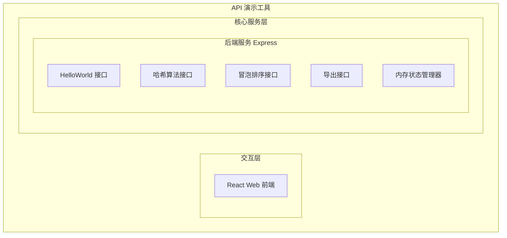
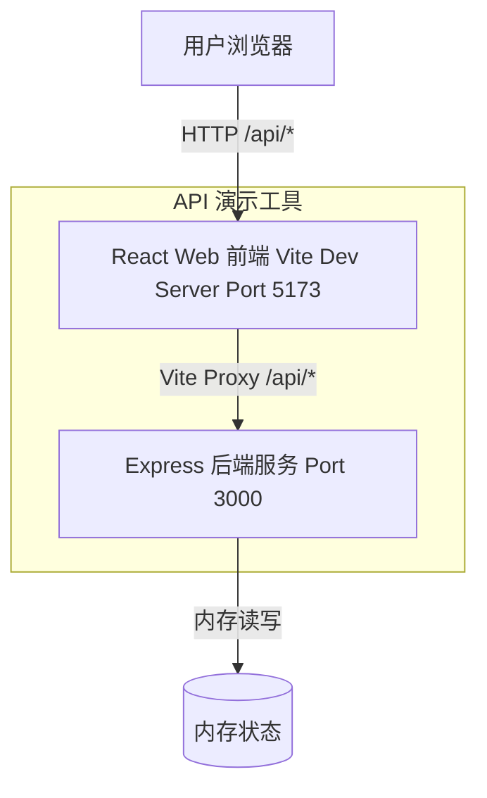
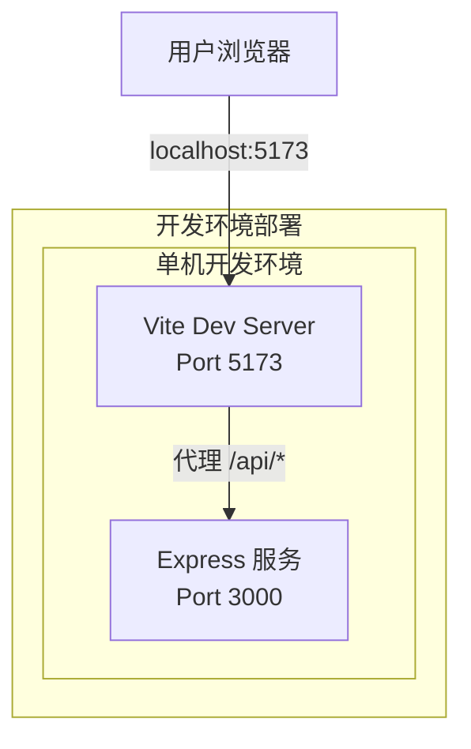
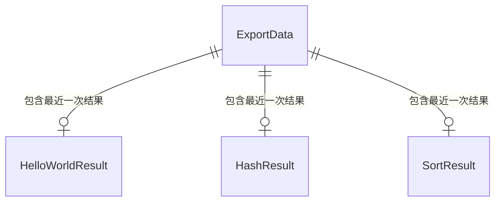
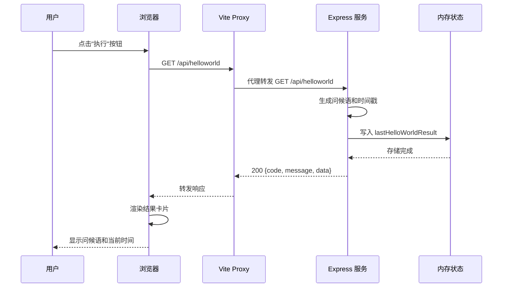
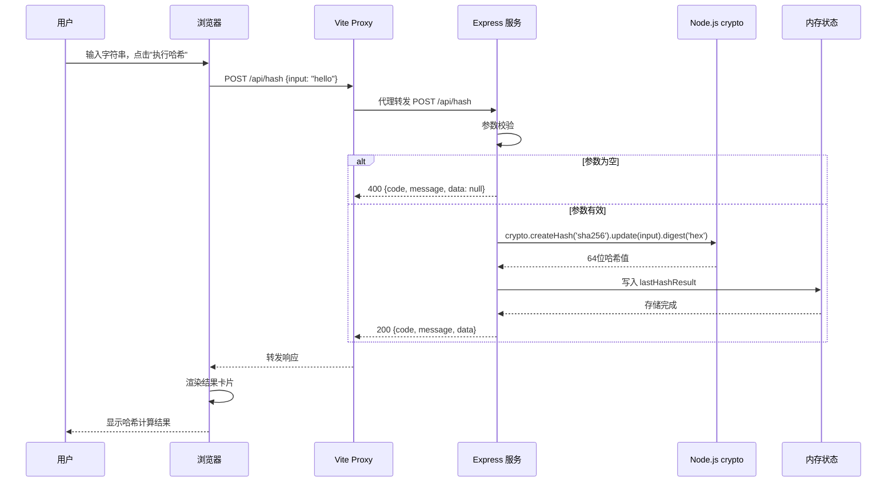
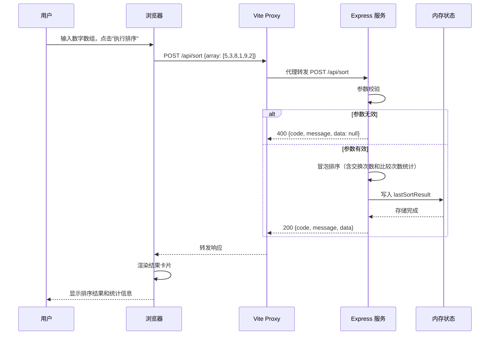
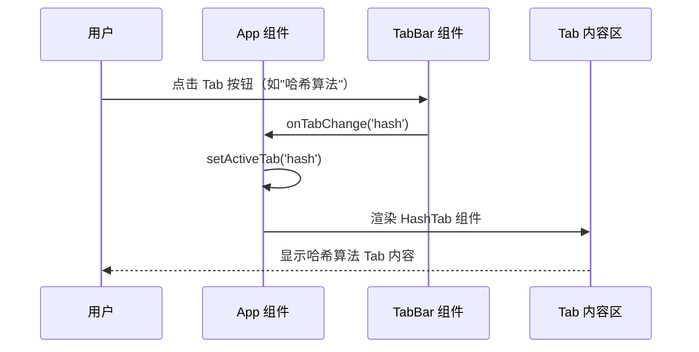

> **文档元信息**
>
> | 项目 | 内容 |
> |------|------|
> | 文档版本 | v1.0 |
> | 作者 | DTCoder |
> | 创建日期 | 2026-08-26 |
> | 需求来源 | `.agents/specs/20260826-分别写三个接口helloworld_哈希.md` |
> | 评审状态 | 待评审 |

# API 演示工具 系分设计

## 1. 需求与范围

### 背景与目标
构建一个全栈演示项目，包含三个后端接口（helloworld、SHA-256哈希、冒泡排序）、一个前端 React 页面（含三个 Tab 展示执行结果）和一个导出功能（CSV/JSON）。目标是为用户提供一个直观的 API 演示工具，展示三种基础功能并支持结果导出。

### 核心功能
1. 后端提供三个 API：GET /api/helloworld、POST /api/hash、POST /api/sort
2. 前端页面含三个 Tab，分别展示三个接口的调用界面和结果
3. 导出按钮提供 JSON/CSV 两种格式的数据导出
4. 后端维护内存状态，记录最近一次各接口调用结果供导出

### 约束与非功能要求
- 技术栈：Node.js 18+, Express.js ^4.18.0, React ^18.2.0, Vite ^5.0.0
- 统一 API 响应格式：`{ code, message, data }`
- 前端端口 5173，后端端口 3000，Vite 代理 `/api` 到后端
- 哈希算法使用 SHA-256
- 禁止使用额外数据库，所有状态保存在服务端内存中
- 导出文件名格式：`api_export_YYYYMMDD_HHMMSS.{csv|json}`

### 排除范围
- 无需用户认证/鉴权
- 无需持久化存储
- 无需部署到生产环境
- 无需单元测试/集成测试框架

### 需求功能清单与优先级

| 编号 | 功能点 | 优先级 | 原始描述 | 备注 |
|------|--------|--------|----------|------|
| F01 | GET /api/helloworld 接口 | P0 | "helloworld" | 返回问候语+时间戳 |
| F02 | POST /api/hash 接口（SHA-256） | P0 | "哈希算法" | 接收字符串，返回 SHA-256 哈希值 |
| F03 | POST /api/sort 接口（冒泡排序） | P0 | "冒泡排序" | 接收整数数组，返回排序结果+交换/比较次数 |
| F04 | 前端页面含三个Tab | P0 | "前端新增一个页面，有三个tab分别展示不同的执行结果" | Tab1: HelloWorld, Tab2: 哈希, Tab3: 冒泡排序 |
| F05 | 导出按钮 | P0 | "新增导出按钮" | 提供 CSV/JSON 两种格式 |
| F06 | GET /api/export 导出接口 | P0 | "后台提供导出接口" | 返回导出文件下载 |
| F07 | 服务端内存状态管理 | P1 | "后台提供导出接口"（隐含） | 记录最近一次各接口调用结果 |
| F08 | 错误处理（空输入/非法格式） | P1 | 隐含 | 对非法输入返回 400 错误 |

### 假设与待确认项

| 编号 | 假设/待确认内容 | 当前假设 | 确认状态 |
|------|-----------------|----------|----------|
| A01 | 前端使用 React + Vite 构建 | 采用 React 18 + Vite 5 | 已确认（来自 specs） |
| A02 | 后端使用 Express.js | 采用 Express 4.x | 已确认（来自 specs） |
| A03 | 哈希算法选择 | 使用 SHA-256 | 已确认（来自 specs） |
| A04 | 导出格式 | 支持 CSV 和 JSON 两种格式 | 已确认（来自 specs） |
| A05 | 无数据库需求 | 不使用数据库，内存状态 | 已确认（来自 specs） |
| A06 | 冒泡排序需返回统计信息 | 返回 swaps 和 comparisons | 已确认（来自 specs） |

## 2. 架构与模块

### 功能架构



- **交互层说明**：React 单页应用，包含三个 Tab 组件和一个导出组件，通过 HTTP 调用后端 API
- **核心服务层说明**：Express 后端服务，提供四个 RESTful API 接口，使用内存状态管理

**模块清单**

| 模块 | 职责 | 依赖 |
|------|------|------|
| 前端 UI 模块 | 提供 Tab 交互界面、调用 API 展示结果、导出按钮触发文件下载 | 后端 API |
| 后端核心服务模块 | 实现三个核心接口（helloworld/hash/sort） | 无外部依赖 |
| 后端导出模块 | 从内存状态读取数据，导出 CSV/JSON 格式文件 | 后端核心服务模块（内存状态） |
| 内存状态管理 | 维护最近一次各接口调用结果 | 无外部依赖 |

### 应用集成架构



**集成关系说明：**

| 调用方 | 被调用方 | 协议 | 接口类型 | 说明 |
|--------|----------|------|----------|------|
| 用户浏览器 | 前端 Vite Dev Server | HTTP | 静态资源+API 代理 | 开发模式 Vite 代理 /api 到后端 |
| 前端组件 | 后端 Express 服务 | HTTP | RESTful API | 通过 Vite 代理转发 |
| 后端接口 | 内存状态 | 内存访问 | 直接读写 | 无数据库，状态保存在内存变量中 |

### 部署架构



**部署说明：**
- **负载均衡层**：不适用，开发环境单机运行
- **应用层**：前端 Vite Dev Server + 后端 Express 服务，通过 `concurrently` 同时启动
- **数据层**：不适用，无数据库，使用内存状态
- 假设：开发环境运行，无需容器化/多实例部署

## 3. 数据模型与存储

### 实体清单

| 实体名称 | 实体说明 | 所属模块 | 与其他实体的关系 |
|----------|----------|----------|-----------------|
| HelloWorldResult | GET /api/helloworld 的响应结果快照 | 后端核心服务 | 无关联 |
| HashResult | POST /api/hash 的响应结果快照 | 后端核心服务 | 无关联 |
| SortResult | POST /api/sort 的响应结果快照 | 后端核心服务 | 无关联 |
| ExportData | 导出聚合数据，包含三个接口的最近一次结果 | 后端导出模块 | 聚合 HelloWorldResult/HashResult/SortResult |

### 实体关系图



**模型说明：**
- 本项目不使用数据库，所有状态保存在服务端内存变量中
- 三个核心接口各自维护一个内存变量记录最近一次调用结果
- 导出接口从这三个内存变量中读取数据，聚合后返回
- 无持久化存储，服务重启后内存状态清空

### 内存状态结构

```javascript
const state = {
  lastHelloWorldResult: null,  // { greeting: string, timestamp: string }
  lastHashResult: null,        // { input: string, algorithm: string, hash: string }
  lastSortResult: null,        // { original: number[], sorted: number[], algorithm: string, swaps: number, comparisons: number }
};
```

## 4. 接口设计

### 4.1 oneapi（Web 控制台接口）

| 编号 | 接口名称 | 方法 | 路径 | 模块 |
|------|----------|------|------|------|
| W01 | HelloWorld 问候 | GET | /api/helloworld | 后端核心服务 |
| W02 | 哈希计算 | POST | /api/hash | 后端核心服务 |
| W03 | 冒泡排序 | POST | /api/sort | 后端核心服务 |
| W04 | 数据导出 | GET | /api/export?format=csv\|json | 后端导出模块 |

### 4.2 OpenAPI（对外接口）

本项不适用，原因：本项目为演示工具，不对外提供 OpenAPI。

### 4.3 内部接口（Service 层）

本项不适用，原因：本项目为 Express 轻量级实现，无 Service 层分层，接口直接在路由处理函数中实现。

### 4.4 集成接口（Integration 层）

本项不适用，原因：本项目无外部系统集成。

### 接口说明

- 所有接口统一响应格式：`{ code, message, data }`
- 错误响应：code=4xx, message 为具体错误描述, data=null
- 成功响应：code=200, message="success", data 为业务数据

## 5. 功能模块设计

### 5.1 全局约定

#### 通用出参结构
```json
{
  "code": 200,
  "message": "success",
  "data": { ... }
}
```

#### 错误码格式
本项目使用 HTTP 状态码作为错误码：
- 200：成功
- 400：参数错误（空输入、非法格式）
- 其他：服务器内部错误

#### 模块映射表

| 模块名称 | 职责 | 对应文件 |
|----------|------|----------|
| 后端核心服务模块 | 实现三个核心接口 + 内存状态管理 | server/index.js |
| 后端导出模块 | 实现导出接口 | server/index.js |
| 前端 UI 模块 | 主应用 + 四个组件 | src/ 目录下各文件 |

### 5.2 后端核心服务模块

#### 5.2.1 表结构设计

本项不适用，原因：本项目不使用数据库，状态保存在服务端内存中。

#### 5.2.2 枚举与常量定义

| 枚举名称 | 取值 | 含义 | 关联字段 |
|----------|------|------|----------|
| 导出格式 | csv / json | 导出文件格式 | /api/export?format 参数 |

#### 5.2.3 接口详细设计

##### W01 GET /api/helloworld

- **URI**: GET /api/helloworld
- **描述**: 返回 "Hello World!" 问候语及当前时间戳
- **入参**: 无
- **出参**:

| 参数名称 | 类型 | 描述 |
|----------|------|------|
| code | number | 状态码 |
| message | string | 提示信息 |
| data.greeting | string | 问候语 "Hello World!" |
| data.timestamp | string | 当前时间戳，格式 yyyy-MM-dd HH:mm:ss |

- **错误码**: 无（无入参，不会出现参数错误）

- **响应示例**:
```json
{
  "code": 200,
  "message": "success",
  "data": {
    "greeting": "Hello World!",
    "timestamp": "2026-08-26 08:00:00"
  }
}
```

##### W02 POST /api/hash

- **URI**: POST /api/hash
- **描述**: 对输入字符串进行 SHA-256 哈希计算，返回哈希值
- **入参**:

| 参数名称 | 类型 | 是否必填 | 描述 |
|----------|------|----------|------|
| input | string | 是 | 待哈希的字符串，不能为空 |

- **出参**:

| 参数名称 | 类型 | 描述 |
|----------|------|------|
| code | number | 状态码 |
| message | string | 提示信息 |
| data.input | string | 原始输入字符串 |
| data.algorithm | string | 算法名称 "SHA-256" |
| data.hash | string | 64 位十六进制哈希值 |

- **错误码**:

| 错误码 | 说明 |
|--------|------|
| 400 | input 参数必须为非空字符串 |

- **响应示例**:
```json
// 成功
{
  "code": 200,
  "message": "success",
  "data": {
    "input": "hello",
    "algorithm": "SHA-256",
    "hash": "2cf24dba5fb0a30e26e83b2ac5b9e29e1b161e5c1fa7425e73043362938b9824"
  }
}

// 失败
{
  "code": 400,
  "message": "input 参数必须为非空字符串",
  "data": null
}
```

##### W03 POST /api/sort

- **URI**: POST /api/sort
- **描述**: 对整数数组进行冒泡排序，返回排序结果及统计信息
- **入参**:

| 参数名称 | 类型 | 是否必填 | 描述 |
|----------|------|----------|------|
| array | number[] | 是 | 包含至少一个整数的数组 |

- **出参**:

| 参数名称 | 类型 | 描述 |
|----------|------|------|
| code | number | 状态码 |
| message | string | 提示信息 |
| data.original | number[] | 原始数组 |
| data.sorted | number[] | 排序后的数组（升序） |
| data.algorithm | string | 算法名称 "bubble_sort" |
| data.swaps | number | 交换次数 |
| data.comparisons | number | 比较次数 |

- **错误码**:

| 错误码 | 说明 |
|--------|------|
| 400 | array 参数必须为包含至少一个整数的数组 |

- **响应示例**:
```json
// 成功
{
  "code": 200,
  "message": "success",
  "data": {
    "original": [5, 3, 8, 1, 9, 2],
    "sorted": [1, 2, 3, 5, 8, 9],
    "algorithm": "bubble_sort",
    "swaps": 10,
    "comparisons": 15
  }
}

// 失败
{
  "code": 400,
  "message": "array 参数必须为包含至少一个整数的数组",
  "data": null
}
```

#### 5.2.4 子功能详细设计

##### 5.2.4.1 HelloWorld 子功能（F01）

- **处理时序图**:


**业务规则**：无特殊业务规则，仅返回固定问候语。

**异常场景**：无异常场景（无入参、无外部依赖）。

##### 5.2.4.2 哈希计算子功能（F02）

- **处理时序图**:


**业务规则**:

| 规则编号 | 规则描述 | 校验时机 | 不满足时的处理 |
|----------|----------|----------|--------------|
| R01 | input 必须为非空字符串 | 接收请求时 | 返回 400，提示"input 参数必须为非空字符串" |

**异常场景**:

| 异常场景 | 处理方式 |
|----------|----------|
| input 参数缺失 | 返回 400 错误 |
| input 为空字符串 | 返回 400 错误 |
| input 类型非字符串（如数字） | 返回 400 错误 |

**并发控制**：无并发风险，原因：本功能为纯计算操作，无竞态数据写入。

##### 5.2.4.3 冒泡排序子功能（F03）

- **处理时序图**:


**业务规则**:

| 规则编号 | 规则描述 | 校验时机 | 不满足时的处理 |
|----------|----------|----------|--------------|
| R02 | array 必须为数组 | 接收请求时 | 返回 400，提示"array 参数必须为包含至少一个整数的数组" |
| R03 | array 不能为空数组 | 接收请求时 | 返回 400 |
| R04 | array 所有元素必须为整数 | 接收请求时 | 返回 400 |

**排序算法逻辑**：
- 算法：冒泡排序（双循环）
- 外层循环：i 从 0 到 n-2
- 内层循环：j 从 0 到 n-2-i
- 比较：arr[j] > arr[j+1] 时交换
- 统计：每次比较 comparisons++，每次交换 swaps++

**异常场景**:

| 异常场景 | 处理方式 |
|----------|----------|
| array 参数缺失 | 返回 400 错误 |
| array 为空数组 | 返回 400 错误 |
| array 包含非整数元素 | 返回 400 错误 |
| array 包含 NaN | 返回 400 错误 |

**并发控制**：无并发风险，原因：本功能为纯计算操作，每次调用独立创建数组副本。`const arr = [...array]` 确保不修改原始输入。

### 5.3 后端导出模块

#### 5.3.1 表结构设计

本项不适用，原因：无数据库，导出数据从内存状态读取。

#### 5.3.2 枚举与常量定义

本项不适用，原因：无枚举字段，导出格式在 URI 参数中指定。

#### 5.3.3 接口详细设计

##### W04 GET /api/export

- **URI**: GET /api/export?format=csv|json
- **描述**: 导出最近一次三个接口的调用结果，支持 CSV 和 JSON 两种格式
- **入参**:

| 参数名称 | 类型 | 是否必填 | 描述 |
|----------|------|----------|------|
| format | string | 否 | 导出格式，可选值：csv / json，默认 json |

- **出参**（文件下载）:

| 参数名称 | 类型 | 描述 |
|----------|------|------|
| Content-Type | Header | application/json 或 text/csv |
| Content-Disposition | Header | attachment; filename="api_export_YYYYMMDD_HHMMSS.{csv\|json}" |

- **响应体**（JSON 格式示例）:
```json
{
  "export_time": "2026-08-26 08:00:00",
  "helloworld": {
    "greeting": "Hello World!",
    "timestamp": "2026-08-26 08:00:00"
  },
  "hash": {
    "input": "hello",
    "algorithm": "SHA-256",
    "hash": "2cf24dba5fb0a30e26e83b2ac5b9e29e1b161e5c1fa7425e73043362938b9824"
  },
  "sort": {
    "original": [5, 3, 8, 1, 9, 2],
    "sorted": [1, 2, 3, 5, 8, 9],
    "algorithm": "bubble_sort",
    "swaps": 10,
    "comparisons": 15
  }
}
```

- **CSV 格式示例**:
```
section,key,value
export_time,value,2026-08-26 08:00:00
helloworld,greeting,Hello World!
helloworld,timestamp,2026-08-26 08:00:00
hash,input,hello
hash,algorithm,SHA-256
hash,hash,2cf24dba5fb0a30e26e83b2ac5b9e29e1b161e5c1fa7425e73043362938b9824
sort,original,"[5,3,8,1,9,2]"
sort,sorted,"[1,2,3,5,8,9]"
sort,algorithm,bubble_sort
sort,swaps,10
sort,comparisons,15
```

- **错误码**:

| 错误码 | 说明 |
|--------|------|
| 400 | 不支持的导出格式，仅支持 csv 和 json |

#### 5.3.4 子功能详细设计

##### 导出子功能（F05/F06）

- **处理时序图**:
```mermaid
sequenceDiagram
    participant User as 用户
    participant Browser as 浏览器
    participant Vite as Vite Proxy
    participant Express as Express 服务
    participant State as 内存状态

    User->>Browser: 点击导出按钮，选择格式
    Browser->>Vite: GET /api/export?format=json
    Vite->>Express: 代理转发
    Express->>Express: 校验 format 参数
    alt format 不支持
        Express-->>Vite: 400 {code, message, data: null}
    else format 合法
        Express->>State: 读取三个内存变量
        State-->>Express: 返回 lastHelloWorldResult / lastHashResult / lastSortResult
        Express->>Express: 组装导出数据
        alt format=json
            Express->>Express: 序列化为 JSON 字符串
        else format=csv
            Express->>Express: 转换为 CSV 格式
        end
        Express-->>Vite: Content-Disposition: attachment; filename=...
        Vite-->>Browser: 文件响应
        Browser->>Browser: 创建 Blob 下载
        Browser-->>User: 文件保存对话框
    end
```

**业务规则**:

| 规则编号 | 规则描述 | 校验时机 | 不满足时的处理 |
|----------|----------|----------|--------------|
| R05 | format 参数仅支持 csv 和 json | 接收请求时 | 返回 400，提示"不支持的导出格式，仅支持 csv 和 json" |
| R06 | 各接口结果可能为 null（未调用过） | 导出时 | 对应字段标记为 null/无数据 |

**异常场景**:

| 异常场景 | 处理方式 |
|----------|----------|
| format 参数不合法 | 返回 400 错误 |
| 各接口从未被调用（所有结果均为 null） | 导出包含 null 值，不做特殊处理 |
| 部分接口未调用 | 对应字段为 null，正常导出 |

**并发控制**：无并发风险，原因：导出为只读操作，不修改内存状态。

### 5.4 前端 UI 模块

#### 5.4.1 表结构设计

本项不适用，原因：前端无数据库。

#### 5.4.2 枚举与常量定义

| 枚举名称 | 取值 | 含义 | 关联字段 |
|----------|------|------|----------|
| Tab 类型 | helloworld / hash / sort | 三个 Tab 标识 | App 组件 activeTab state |
| 导出格式 | json / csv | 导出文件格式 | ExportButton 组件 |

#### 5.4.3 组件结构

| 组件名称 | 文件路径 | 职责 | 依赖 |
|----------|----------|------|------|
| App | src/App.jsx | 主应用，Tab 切换逻辑，状态管理 | 所有子组件 |
| TabBar | src/components/TabBar.jsx | 渲染 Tab 导航按钮组 | - |
| HelloWorldTab | src/components/HelloWorldTab.jsx | 执行并展示 HelloWorld 接口结果 | GET /api/helloworld |
| HashTab | src/components/HashTab.jsx | 输入字符串，执行哈希并展示结果 | POST /api/hash |
| SortTab | src/components/SortTab.jsx | 输入数组，执行排序并展示结果 | POST /api/sort |
| ExportButton | src/components/ExportButton.jsx | 导出按钮+下拉菜单，触发文件下载 | GET /api/export |

#### 5.4.4 子功能详细设计

##### 5.4.4.1 Tab 切换功能（F04）

- **处理时序图**:


**业务规则**：

| 规则编号 | 规则描述 | 校验时机 | 不满足时的处理 |
|----------|----------|----------|--------------|
| R07 | 同一时间仅激活一个 Tab | Tab 切换时 | 设置 activeTab 为新值，替换旧值 |

**异常场景**：无异常场景（Tab 切换为纯前端状态切换）。

##### 5.4.4.2 HelloWorld Tab 调用功能（F01）

**业务规则**：

| 规则编号 | 规则描述 | 校验时机 | 不满足时的处理 |
|----------|----------|----------|--------------|
| R08 | 点击"执行"按钮发起 GET /api/helloworld 请求 | 点击时 | 展示 loading 状态 |
| R09 | 请求成功后展示 JSON 结果 | 收到响应时 | 渲染结果卡片 |
| R10 | 请求失败时展示错误信息 | 收到错误时 | 渲染错误消息 |

**状态管理**：
- loading: boolean — 请求中状态
- result: object | null — 接口返回的数据
- error: string | null — 错误信息

##### 5.4.4.3 哈希 Tab 调用功能（F02）

**业务规则**：

| 规则编号 | 规则描述 | 校验时机 | 不满足时的处理 |
|----------|----------|----------|--------------|
| R11 | 输入框不能为空 | 点击"执行哈希"时 | 显示"请输入待哈希的字符串" |
| R12 | 支持 Enter 键触发执行 | 输入框内按下 Enter | 同点击执行按钮 |
| R13 | 请求成功后展示 JSON 结果 | 收到响应时 | 渲染结果卡片 |
| R14 | 请求失败时展示错误信息 | 收到错误时 | 渲染错误消息 |

##### 5.4.4.4 排序 Tab 调用功能（F03）

**业务规则**：

| 规则编号 | 规则描述 | 校验时机 | 不满足时的处理 |
|----------|----------|----------|--------------|
| R15 | 输入不能为空 | 点击"执行排序"时 | 显示提示：请输入逗号分隔的数字 |
| R16 | 输入必须为逗号分隔的整数 | 点击"执行排序"时 | 显示提示：请输入有效的整数 |
| R17 | 支持 Enter 键触发执行 | 输入框内按下 Enter | 同点击执行按钮 |
| R18 | 请求成功后展示 JSON 结果 | 收到响应时 | 渲染结果卡片 |
| R19 | 请求失败时展示错误信息 | 收到错误时 | 渲染错误消息 |

##### 5.4.4.5 导出功能（F05）

**业务规则**：

| 规则编号 | 规则描述 | 校验时机 | 不满足时的处理 |
|----------|----------|----------|--------------|
| R20 | 点击导出按钮展开下拉菜单 | 点击时 | 显示 CSV/JSON 两个选项 |
| R21 | 点击菜单项触发文件下载 | 选择格式时 | 调用 GET /api/export?format=xxx |
| R22 | 点击外部区域关闭下拉菜单 | 全局点击 | 使用 useEffect 监听 mousedown 事件 |
| R23 | 下载使用 Blob + 临时 URL 方式 | 文件下载时 | 创建 a 标签点击下载 |

**异常场景**：

| 异常场景 | 处理方式 |
|----------|----------|
| 导出请求失败（HTTP 非 2xx） | 使用 alert 提示错误信息 |
| 网络异常 | 使用 alert 提示"导出请求失败" |

**并发控制**：无并发风险，原因：导出为前端单次请求，不涉及竞态。

## 6. 非功能性需求设计

### 6.1 高可用性
本项不适用，原因：本项目为开发环境演示工具，单机运行，无需高可用设计。若部署到生产环境，可考虑：
- 使用 PM2 或 Docker 实现进程守护和自动重启
- 增加 Nginx 反向代理处理静态资源和负载均衡

### 6.2 可扩展性
- 水平扩展：Express 服务无状态（内存状态只在单进程内有效），不适合水平扩展。若需扩展，需将内存状态替换为 Redis 等外部缓存
- 垂直扩展：单机资源充足时，可通过 Node.js cluster 模块利用多核 CPU
- 功能扩展：新增接口直接在 Express 路由中注册，前端新增 Tab 组件，架构简单可扩展

### 6.3 稳定性/可靠性
- 参数校验：所有接口对输入参数进行严格校验，防止非法输入导致服务崩溃
- 异常捕获：前端 fetch 请求使用 try-catch 包裹，网络异常时展示友好提示
- 内存安全：排序操作使用数组副本 `[...array]`，不修改原始输入

### 6.4 安全性设计

#### 6.4.1 账户系统方案
本项不适用，原因：本项目为演示工具，无需用户认证。

#### 6.4.2 授权&访问控制
本项不适用，原因：本项目为演示工具，无鉴权需求。

#### 6.4.3 数据防护方案
本项不适用，原因：本项目不涉及敏感数据存储和传输。

### 6.5 监控/统计/日志/告警
- 后端 Express 可通过 `console.log` 输出请求日志
- 前端可通过浏览器开发者工具 Network 面板监控 API 调用
- 正式环境可引入 Morgan 等 HTTP 请求日志中间件

## 7. 变更三板斧

### 7.1 可监控
- 后端接口监控：可通过浏览器 Network 面板或 curl 命令验证接口可用性
- 前端状态监控：组件内部 loading/error 状态对用户可见，无需额外埋点
- 服务状态：可通过 `curl http://localhost:3000/api/helloworld` 快速验证服务是否正常运行

### 7.2 可灰度
本项不适用，原因：本项目为单机演示工具，无灰度发布需求。若需灰度：
- 可通过 Nginx 按请求头/cookie 分流到不同版本的后端服务
- 前端可通过 URL 参数控制展示不同版本的 Tab 组件

### 7.3 可应急
- 服务重启：停止 Express 进程后重新启动即可恢复
- 前端热更新：Vite Dev Server 支持 HMR，代码修改后自动刷新
- 回滚策略：通过 Git 回滚代码后重新启动服务
- 应急开关：无特殊应急开关需求，所有功能通过代码控制