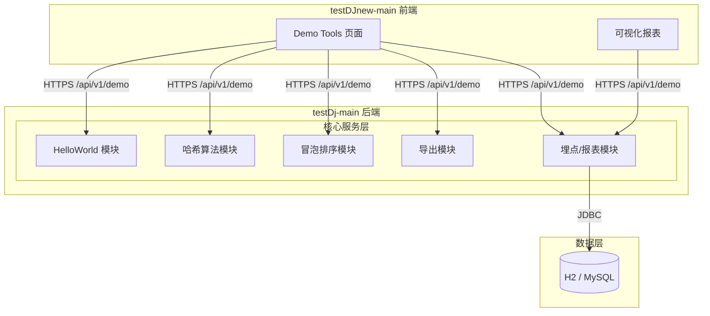
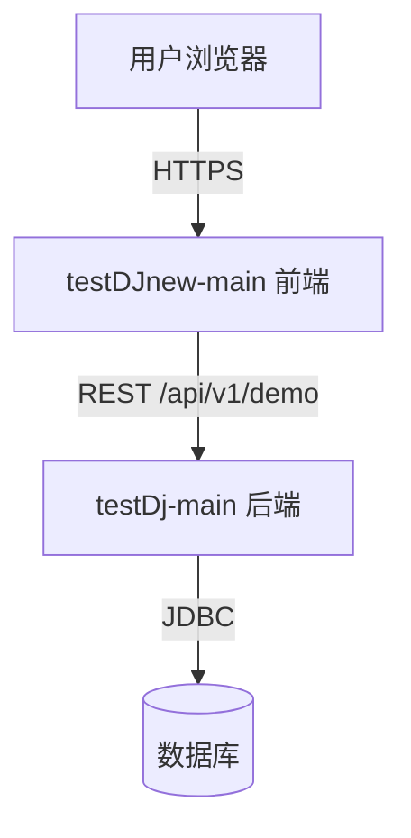
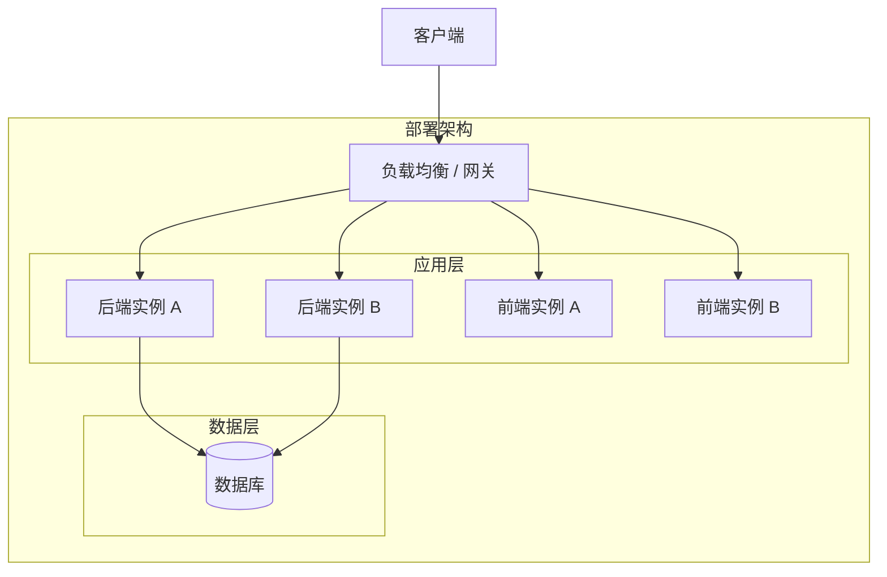
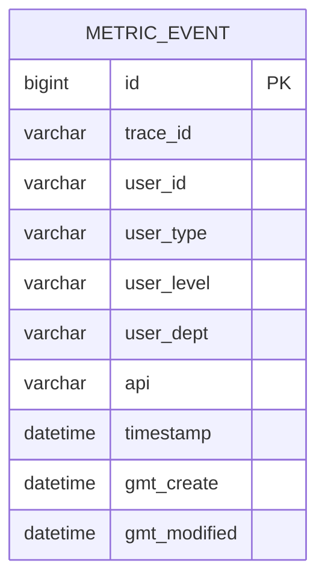
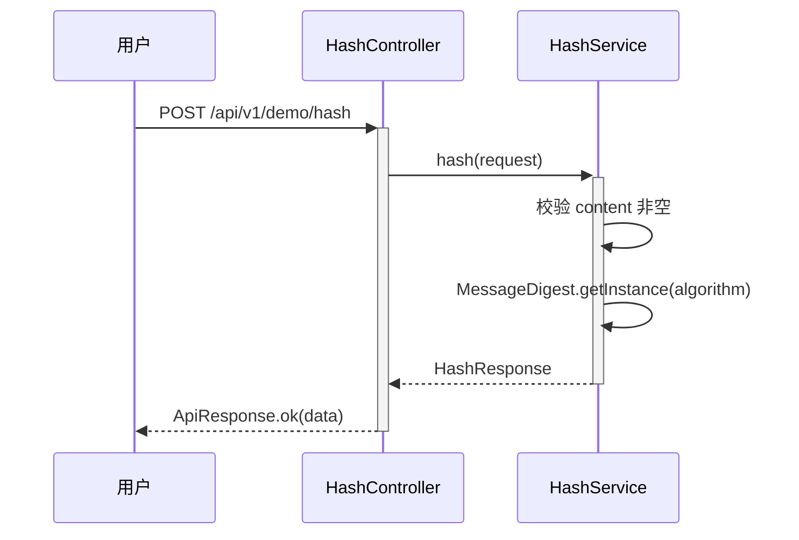
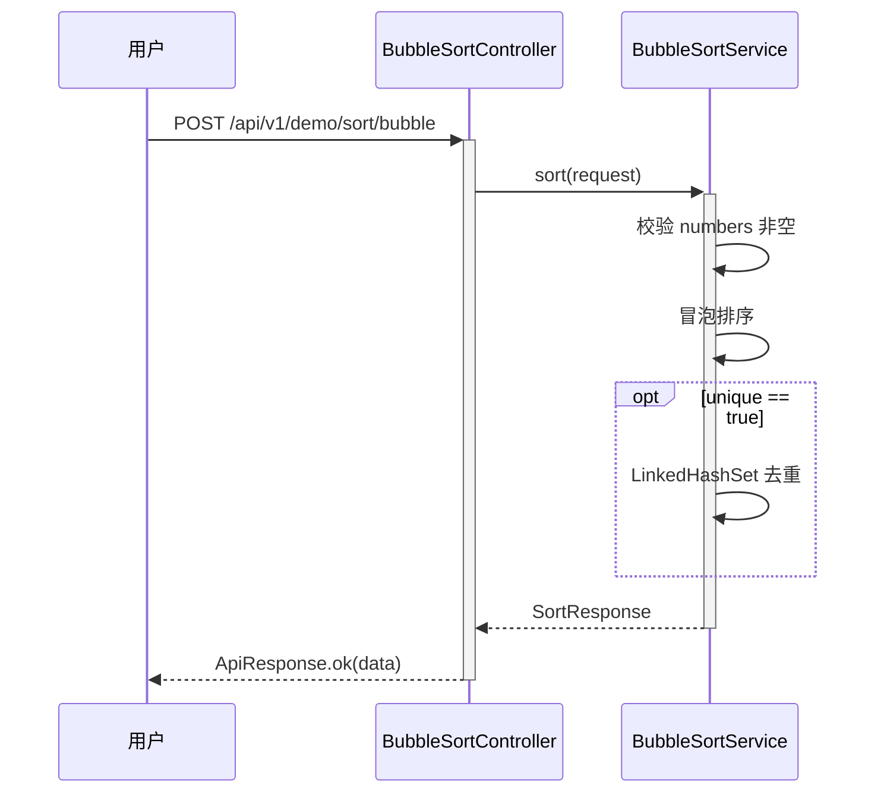
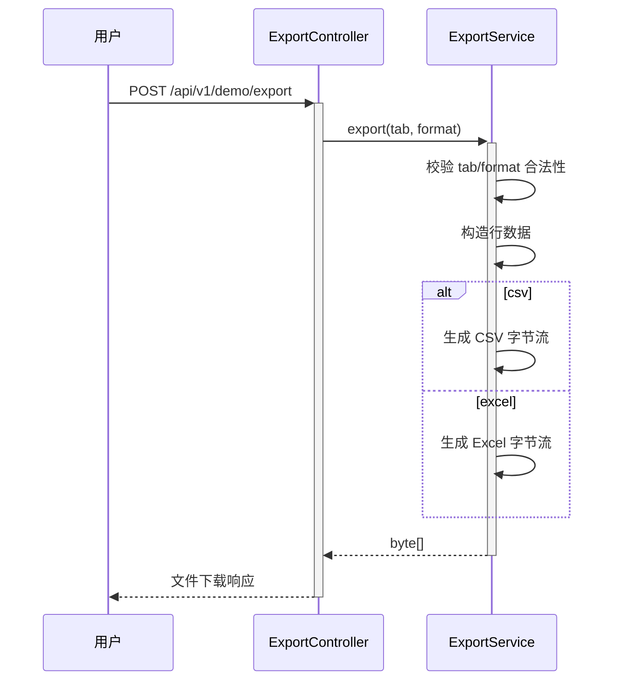
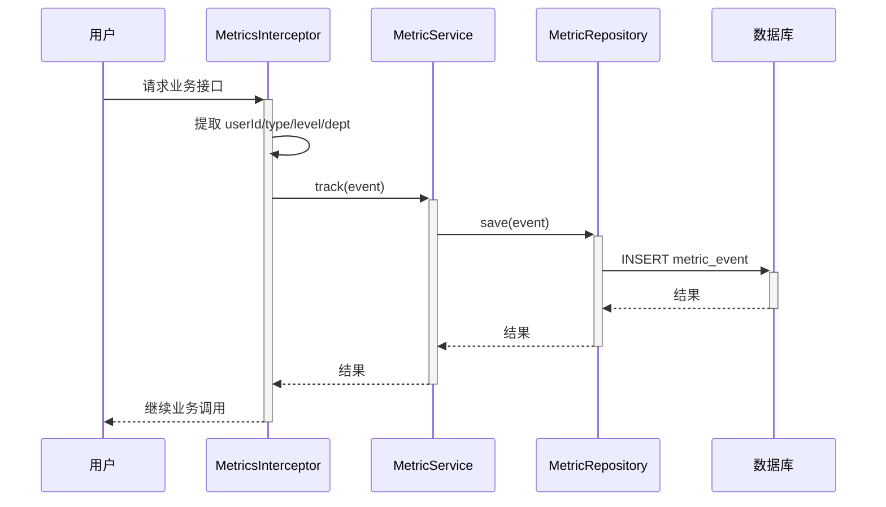
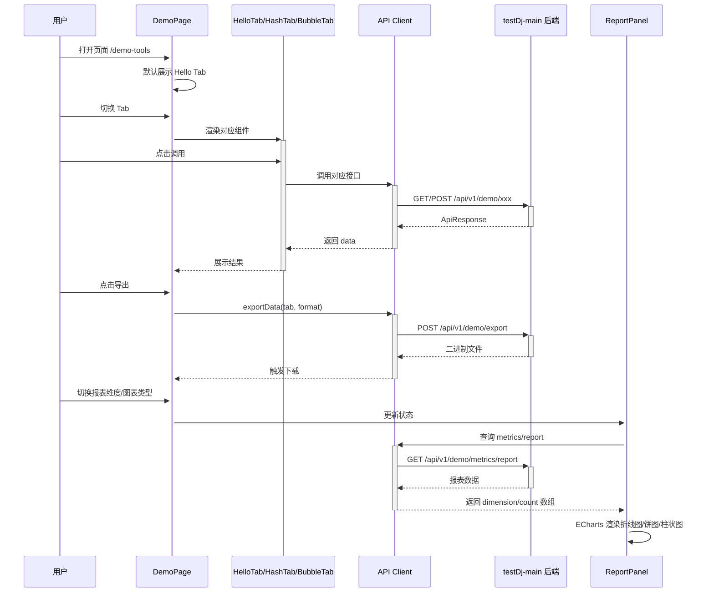

> **文档元信息**
>
> | 项目 | 内容 |
> |------|------|
> | 文档版本 | v1.0 |
> | 作者 | DTCoder |
> | 创建日期 | 2026-08-25 |
> | 需求来源 | `.agents/specs/20260825-分别写三个接口helloworld_哈希.md` |
> | 评审状态 | 待评审 |

# Demo Tools 系分设计

## 1. 需求与范围

### 1.1 背景与目标

为演示前后端协同开发能力，在 `testDj-main` 后端仓库与 `testDJnew-main` 前端仓库分别构建一套 Demo Tools。
后端提供 6 个 REST 接口：HelloWorld、哈希算法、冒泡排序、导出、埋点/报表；
前端提供 1 个页面，通过 3 个 Tab 展示各接口执行结果，支持导出当前展示结果，并以折线图/饼图/柱状图形式可视化埋点报表。

### 1.2 核心功能

- **HelloWorld 接口**：返回固定问候语。
- **哈希算法接口**：接收内容与算法，返回对应哈希值。
- **冒泡排序接口**：接收整数数组，返回排序结果。
- **导出接口**：根据当前 Tab 导出 CSV 或 Excel 文件。
- **埋点与报表接口**：后端拦截业务接口调用，记录调用人身份信息；前端按人员类型/层级/部门等维度可视化展示调用情况。

### 1.3 约束与非功能要求

- 后端统一前缀：`/api/v1/demo`。
- 统一响应结构：`{ code, data, message }`。
- 用户身份字段固定为：`userId`、`userType`、`userLevel`、`userDept`。
- 导出格式：`csv`、`excel`。
- 图表接口返回数组结构：`{ "dimension": string, "count": number }[]`。
- 后端埋点对调用方透明，不暴露内部接口。

### 1.4 排除范围

- 不实现用户登录/鉴权系统；身份信息由调用方通过 Header 或 JWT/Session 传入。
- 不实现复杂文件存储；导出为内存流即时下载。
- 不实现埋点消息队列；首期采用同步写入数据库。

### 1.5 需求功能清单与优先级

| 编号 | 功能点 | 优先级 | PRD 原始描述/章节 | 备注 |
|------|--------|--------|-------------------|------|
| F01 | HelloWorld 接口 | P0 | 分别写三个接口 hello world、哈希算法、冒泡排序 | 后端 |
| F02 | 哈希算法接口 | P0 | 同上 | 后端 |
| F03 | 冒泡排序接口 | P0 | 同上 | 后端 |
| F04 | 前端三 Tab 展示 | P0 | 前端新增一个页面，有三个 tab 分别展示不同的执行结果 | 前端 |
| F05 | 导出按钮与导出接口 | P0 | 新增导出按钮，后台提供导出接口，支持导出各个页面的展示结果 | 前后端 |
| F06 | 后端埋点 | P0 | 后端再做个埋点，获取调用次数和调用人 | 后端 |
| F07 | 前端可视化报表 | P0 | 前端在当前页面上可视化出来一个报表查看调用情况 | 前端 |

### 1.6 假设与待确认项

| 编号 | 假设/待确认内容 | 当前假设 | 确认状态 |
|------|-----------------|----------|----------|
| A01 | 用户身份来源 | 开发阶段通过请求头 `X-User-*` 传入，生产环境可替换为从 JWT/Session 解析 | 已确认（默认） |
| A02 | 哈希算法支持范围 | 默认支持 MD5、SHA-256；SM3 等算法需额外引入密码学库 | 已确认（默认） |
| A03 | 埋点数据库选型 | 开发使用 H2；生产可切换为 MySQL 等关系型数据库 | 已确认（默认） |
| A04 | 导出数据范围 | 导出内容以当前 Tab 结果或全部 Tab 汇总结果为准，由前端传入 `tab` 参数 | 已确认（默认） |

## 2. 架构与模块

### 2.1 功能架构



- **前端层**：React 18 + Vite + TypeScript + ECharts，提供 Tab 切换、结果展示、导出触发、报表可视化。
- **核心服务层**：Spring Boot 3 + Java 17，按职责拆分为 HelloWorld、哈希、排序、导出、埋点/报表五个模块。
- **数据层**：关系型数据库，存储埋点事件。

### 2.2 模块清单

| 模块 | 职责 | 依赖 |
|------|------|------|
| HelloWorld 模块 | 提供问候语接口 | 无 |
| 哈希算法模块 | 根据算法和输入生成哈希值 | 无 |
| 冒泡排序模块 | 对整数数组执行冒泡排序 | 无 |
| 导出模块 | 按 Tab 生成 CSV/Excel 文件 | 无 |
| 埋点/报表模块 | 拦截业务接口并记录调用信息；按维度聚合统计 | 数据层 |

### 2.3 应用集成架构



**集成关系说明：**

| 调用方 | 被调用方 | 协议 | 接口类型 | 说明 |
|--------|----------|------|----------|------|
| 用户浏览器 | 前端页面 | HTTPS | oneapi | 用户交互入口 |
| 前端页面 | 后端服务 | HTTPS | REST | 统一前缀 `/api/v1/demo` |
| 后端服务 | 数据库 | JDBC | SQL | 埋点事件持久化 |

### 2.4 部署架构



**部署说明：**

- **应用层**：前后端均支持多实例容器化部署，无单点。
- **数据层**：使用关系型数据库；埋点数据为典型写多读少场景，可配合读写分离或按时间分表。
- **负载均衡层**：由 Nginx / SLB 统一接入。

## 3. 数据模型与存储

### 3.1 实体清单

| 实体名称 | 实体说明 | 所属模块 | 与其他实体的关系 |
|----------|----------|----------|-----------------|
| metric_event | 埋点事件表 | 埋点/报表模块 | 无 |

### 3.2 实体关系图



**模型说明：**
- 埋点事件为独立实体，不与其他业务实体关联，便于按维度聚合查询。

## 4. 接口设计

### 4.1 oneapi（Web 控制台接口）

| 编号 | 接口名称 | 方法 | 路径 | 模块 |
|------|----------|------|------|------|
| W01 | HelloWorld | GET | /api/v1/demo/hello | HelloWorld |
| W02 | 哈希计算 | POST | /api/v1/demo/hash | 哈希算法 |
| W03 | 冒泡排序 | POST | /api/v1/demo/sort/bubble | 冒泡排序 |
| W04 | 导出结果 | POST | /api/v1/demo/export | 导出 |
| W05 | 报表查询 | GET | /api/v1/demo/metrics/report | 埋点/报表 |

### 4.2 OpenAPI（对外接口）

本需求不涉及对外 OpenAPI。

### 4.3 内部接口（Service 层）

| 编号 | 接口名称 | 类 | 方法签名 |
|------|----------|------|----------|
| S01 | 哈希计算 | HashService | `HashResponse hash(HashRequest request)` |
| S02 | 冒泡排序 | BubbleSortService | `SortResponse sort(SortRequest request)` |
| S03 | 导出文件 | ExportService | `byte[] export(String tab, String format)` |
| S04 | 埋点记录 | MetricService | `MetricEvent track(MetricEvent event)` |
| S05 | 报表统计 | MetricService | `List<ReportItem> report(Dimension dimension, Instant start, Instant end)` |

### 4.4 集成接口（Integration 层）

本需求不涉及外部系统集成。

## 5. 功能模块设计

### 5.1 全局约定

- **统一响应结构**：`{ "code": int, "data": T, "message": string }`。
- **错误码格式**：`{MODULE}_{SEQ}`，例如 `HASH_001`、`EXPORT_001`。
- **用户身份字段**：`userId`、`userType`、`userLevel`、`userDept`。

### 5.2 HelloWorld 模块

#### 5.2.1 表结构设计
本模块无持久化表。

#### 5.2.2 接口详细设计

##### W01 HelloWorld

- **URI**: `GET /api/v1/demo/hello`
- **描述**: 返回固定问候语。
- **入参**: 无
- **出参**:

| 参数名称 | 类型 | 描述 |
|----------|------|------|
| code | int | 结果码 |
| data | string | 问候语 |
| message | string | 提示信息 |

- **错误码**: 无

- **响应示例**:
```json
{
  "code": 0,
  "data": "Hello, World!",
  "message": "ok"
}
```

#### 5.2.3 子功能详细设计
- 处理流程：Controller 直接返回固定字符串，无业务规则校验。

### 5.3 哈希算法模块

#### 5.3.1 表结构设计
本模块无持久化表。

#### 5.3.2 枚举与常量定义

| 枚举名称 | 取值 | 含义 | 关联字段 |
|----------|------|------|----------|
| 支持算法 | MD5 | MD5 摘要 | HashRequest.algorithm |
| 支持算法 | SHA-256 | SHA-256 摘要 | HashRequest.algorithm |

> 注：SM3 等算法如需支持，需额外引入密码学库并在枚举中扩展。

#### 5.3.3 接口详细设计

##### W02 哈希计算

- **URI**: `POST /api/v1/demo/hash`
- **描述**: 根据指定算法计算内容哈希值。
- **入参**:

| 参数名称 | 类型 | 是否必填 | 描述 |
|----------|------|----------|------|
| algorithm | string | 否 | 算法，默认 SHA-256 |
| content | string | 是 | 待哈希内容 |

- **出参**:

| 参数名称 | 类型 | 描述 |
|----------|------|------|
| code | int | 结果码 |
| data.algorithm | string | 实际使用的算法 |
| data.original | string | 原始内容 |
| data.hash | string | 哈希结果（小写十六进制） |
| message | string | 提示信息 |

- **错误码**:

| 错误码 | 说明 |
|--------|------|
| HASH_001 | content 不能为空 |
| HASH_002 | 不支持的算法 |

- **业务规则**:
  - content 为空时返回 HASH_001。
  - algorithm 未传时默认 SHA-256。
  - 返回 hash 为小写十六进制字符串。

#### 5.3.4 子功能详细设计

**处理时序图**


**异常场景**

| 异常场景 | 处理方式 |
|----------|----------|
| content 为空 | 返回 HASH_001，message 提示不能为空 |
| 算法不支持 | 返回 HASH_002，message 提示不支持的算法 |

### 5.4 冒泡排序模块

#### 5.4.1 表结构设计
本模块无持久化表。

#### 5.4.2 接口详细设计

##### W03 冒泡排序

- **URI**: `POST /api/v1/demo/sort/bubble`
- **描述**: 对整数数组执行冒泡排序，支持升序/降序和去重。
- **入参**:

| 参数名称 | 类型 | 是否必填 | 描述 |
|----------|------|----------|------|
| numbers | int[] | 是 | 待排序整数数组 |
| ascending | boolean | 否 | 是否升序，默认 true |
| unique | boolean | 否 | 是否去重，默认 false |

- **出参**:

| 参数名称 | 类型 | 描述 |
|----------|------|------|
| code | int | 结果码 |
| data.input | int[] | 原始输入 |
| data.output | int[] | 排序后结果 |
| message | string | 提示信息 |

- **错误码**:

| 错误码 | 说明 |
|--------|------|
| SORT_001 | 输入数组为空 |

- **业务规则**:
  - numbers 为空时返回 SORT_001。
  - 先排序，再执行去重（unique 为 true）。
  - 去重保持首次出现顺序。

#### 5.4.3 子功能详细设计

**处理时序图**


**异常场景**

| 异常场景 | 处理方式 |
|----------|----------|
| numbers 为空 | 返回 SORT_001 |

### 5.5 导出模块

#### 5.5.1 表结构设计
本模块无持久化表。

#### 5.5.2 接口详细设计

##### W04 导出结果

- **URI**: `POST /api/v1/demo/export`
- **描述**: 根据当前 Tab 导出 CSV 或 Excel 文件。
- **入参**:

| 参数名称 | 类型 | 是否必填 | 描述 |
|----------|------|----------|------|
| tab | string | 是 | 导出范围：hello、hash、bubble、all |
| format | string | 是 | 文件格式：csv、excel |

- **出参**: 二进制文件流，响应头 `Content-Disposition: attachment; filename="demo-export.{csv|xlsx}"`。

- **错误码**:

| 错误码 | 说明 |
|--------|------|
| EXPORT_001 | tab 参数不合法 |
| EXPORT_002 | format 参数不合法 |
| EXPORT_003 | 文件生成失败 |

- **业务规则**:
  - tab 取值限定为 hello、hash、bubble、all。
  - format 取值限定为 csv、excel。
  - CSV 使用 UTF-8 编码。
  - Excel 使用 XSSFWorkbook 生成 `.xlsx` 格式。

#### 5.5.3 子功能详细设计

**处理时序图**


### 5.6 埋点/报表模块

#### 5.6.1 表结构设计

##### metric_event 表

| 字段名 | 数据类型 | 约束 | 默认值 | 说明 |
|--------|----------|------|--------|------|
| id | bigint | PK, 自增 | - | 系统自增主键 |
| trace_id | varchar(64) | NOT NULL | - | 调用链路标识 |
| user_id | varchar(64) | - | - | 调用人标识 |
| user_type | varchar(32) | - | - | 人员类型 |
| user_level | varchar(32) | - | - | 人员层级 |
| user_dept | varchar(64) | - | - | 人员部门 |
| api | varchar(255) | NOT NULL | - | 被调用的接口路径 |
| timestamp | datetime | NOT NULL | - | 调用发生时间 |
| gmt_create | datetime | NOT NULL | CURRENT_TIMESTAMP | 创建时间 |
| gmt_modified | datetime | NOT NULL | CURRENT_TIMESTAMP | 修改时间 |

**索引：**

- IDX: `idx_metric_event_timestamp` (timestamp)
- IDX: `idx_metric_event_user_type` (user_type)
- IDX: `idx_metric_event_user_level` (user_level)
- IDX: `idx_metric_event_user_dept` (user_dept)

#### 5.6.2 枚举与常量定义

| 枚举名称 | 取值 | 含义 | 关联字段 |
|----------|------|------|----------|
| Dimension | USER_TYPE | 按人员类型聚合 | 报表查询 |
| Dimension | USER_LEVEL | 按人员层级聚合 | 报表查询 |
| Dimension | USER_DEPT | 按人员部门聚合 | 报表查询 |

#### 5.6.3 接口详细设计

##### W05 报表查询

- **URI**: `GET /api/v1/demo/metrics/report`
- **描述**: 按指定维度统计一段时间内的接口调用次数。
- **入参**:

| 参数名称 | 类型 | 是否必填 | 描述 |
|----------|------|----------|------|
| dimension | string | 是 | 聚合维度：userType、userLevel、userDept |
| startDate | string | 是 | 开始时间，ISO 8601 格式 |
| endDate | string | 是 | 结束时间，ISO 8601 格式 |

- **出参**:

| 参数名称 | 类型 | 描述 |
|----------|------|------|
| code | int | 结果码 |
| data[] | object[] | 报表数据 |
| data[].dimension | string | 维度值 |
| data[].count | number | 调用次数 |
| message | string | 提示信息 |

- **错误码**:

| 错误码 | 说明 |
|--------|------|
| METRICS_001 | dimension 参数不合法 |
| METRICS_002 | 时间范围不合法 |

#### 5.6.4 子功能详细设计

**处理时序图（埋点）**


**业务规则**

- 拦截器仅对 `/api/v1/demo/hello`、`/api/v1/demo/hash`、`/api/v1/demo/sort/bubble` 进行埋点。
- 用户身份缺失时记录为默认值 `anonymous`。
- 报表查询按维度分组计数，不返回明细。

**异常场景**

| 异常场景 | 处理方式 |
|----------|----------|
| 身份字段缺失 | 使用默认值记录，不阻塞业务 |
| 埋点写入失败 | 记录错误日志，不影响业务接口响应 |

### 5.7 前端页面模块

#### 5.7.1 模块设计

- **路由**：`/demo-tools`
- **组件结构**：
  - `DemoPage`：主页面，维护当前 Tab 状态，提供导出按钮。
  - `HelloTab`：HelloWorld 调用与结果展示。
  - `HashTab`：哈希算法输入、算法选择、结果展示。
  - `BubbleTab`：冒泡排序输入、排序参数、结果展示。
  - `ReportPanel`：维度选择、图表类型切换、ECharts 图表渲染。
- **API 客户端**：统一封装 Axios，baseURL `/api/v1/demo`，默认携带身份请求头。

#### 5.7.2 跨模块时序图



## 6. 非功能性需求设计

### 6.1 高可用性

- 前后端均支持多实例无状态部署，可通过水平扩展提升可用性。
- 后端接口无复杂依赖，单个实例异常可通过负载均衡切换。

### 6.2 可扩展性

- 算法模块可按需新增算法枚举，无需修改既有接口路径。
- 埋点维度可扩展，新增维度只需扩展 `Dimension` 枚举和对应聚合查询。
- 导出模块新增格式（如 PDF）可通过策略模式扩展。

### 6.3 稳定性/可靠性

- 埋点写入失败不阻塞业务接口。
- 导出文件生成控制在合理数据量内，避免内存溢出；生产环境可改用流式生成。
- 对非法入参进行前置校验并返回明确错误码。

### 6.4 安全性设计

#### 6.4.1 账户系统方案
- 本需求不实现账户系统；身份信息由调用方传入或从 JWT/Session 解析。

#### 6.4.2 授权&访问控制
- 开发阶段通过 CORS 允许前端本地地址访问；生产环境应限制 allowedOrigins。
- 埋点接口仅作为内部使用，不暴露给外部调用方。

#### 6.4.3 数据防护方案
- 日志中不打印敏感请求体；导出文件不存储服务端，直接返回客户端。

### 6.5 监控/统计/日志/告警

- 核心接口请求可通过 `metric_event` 表进行统计分析。
- 建议接入应用日志框架，记录接口耗时、异常堆栈。
- 关键指标：接口调用次数、导出成功率、报表查询耗时。

## 7. 变更三板斧

### 7.1 可监控

- 通过埋点模块记录所有业务接口调用，支持按人员类型/层级/部门维度聚合。
- 关键指标：调用量、调用人数、成功率。

### 7.2 可灰度

- 本需求为演示功能，灰度意义不大。
- 如需灰度，可通过请求头或 Cookie 按比例引流，逐步开放新 Tab 或新算法。

### 7.3 可应急

- 导出接口超时或异常时，返回错误码 EXPORT_003，前端降级为提示用户重试。
- 埋点写入异常时不阻塞业务接口，可关闭拦截器或降级为只记录日志。
- 回滚关注点：接口契约、表结构、响应格式保持兼容。

## 8. 跨仓对齐检查

### 8.1 接口契约

| 项目 | 后端（testDj-main） | 前端（testDJnew-main） | 对齐结论 |
|------|---------------------|------------------------|----------|
| 接口前缀 | `/api/v1/demo` | Axios baseURL `/api/v1/demo` | ✅ 一致 |
| 响应结构 | `{ code, data, message }` | `ApiResponse<T>` 类型定义 | ✅ 一致 |
| 用户身份字段 | `userId`、`userType`、`userLevel`、`userDept` | 请求头 `X-User-*` 对应字段 | ✅ 一致 |
| 图表数据结构 | `{ dimension, count }[]` | ECharts 使用 `dimension` 作为 X 轴/名称，`count` 作为值 | ✅ 一致 |
| 导出格式 | `csv`、`excel` | 导出按钮触发对应 format 参数 | ✅ 一致 |
| 报表维度 | `userType`、`userLevel`、`userDept` | 下拉选择对应值 | ✅ 一致 |

### 8.2 依赖关系

- 前端依赖后端接口契约；后端无前端依赖，可独立运行。
- 建议联调阶段通过 Vite proxy 将 `/api` 转发到 `http://localhost:8080`。

### 8.3 风险与兜底

| 风险点 | 应对措施 |
|--------|----------|
| 前端图表无数据 | 默认空数组，ECharts 渲染空白状态 |
| 导出文件过大 | 限制导出数据量，或改为后端流式生成 |
| 埋点数据库写入阻塞接口 | 异步/异步线程写入，失败仅记录日志 |
| 哈希算法不支持 SM3 | 默认仅支持 MD5/SHA-256；SM3 引入外部库后再扩展 |
